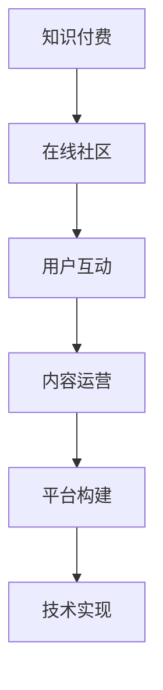

                 

关键词：知识付费、在线社区、程序员、平台构建、用户体验、内容运营、技术实现

> 摘要：本文旨在探讨程序员如何利用技术手段构建一个知识付费的在线社区。从核心概念、技术架构、算法原理、数学模型到具体实现，我们将深入分析这个问题的方方面面，帮助程序员朋友们更好地理解和实践。

## 1. 背景介绍

随着互联网的普及和知识经济的兴起，知识付费逐渐成为一种新的商业模式。越来越多的用户愿意为优质内容付费，以满足自身成长和学习的需求。与此同时，在线社区作为一种信息共享和知识传播的载体，也越来越多地被用于知识付费场景。

程序员作为知识付费领域的重要参与者，拥有丰富的技术积累和创新能力。他们不仅可以提供高质量的技术内容，还可以利用技术手段优化用户参与体验，提高社区运营效率。本文将围绕如何打造一个知识付费的在线社区，从多个角度进行深入探讨。

## 2. 核心概念与联系

### 2.1 核心概念

**知识付费**：用户为获取高质量的知识内容或服务支付费用。

**在线社区**：基于互联网技术，用户进行交流、互动和分享的平台。

**技术实现**：使用编程语言、框架和工具构建在线社区所需的技能和知识。

### 2.2 核心概念联系

知识付费与在线社区之间存在紧密的联系。在线社区为知识付费提供了一个良好的载体，使得用户能够方便地获取和分享知识。而知识付费则激励了用户参与社区的热情，为社区提供了持续发展的动力。


### 2.3 Mermaid 流程图



## 3. 核心算法原理 & 具体操作步骤

### 3.1 算法原理概述

在知识付费的在线社区中，核心算法主要包括推荐算法、支付算法和社区互动算法。这些算法共同作用，为用户提供个性化、安全、高效的知识获取和交流体验。

### 3.2 算法步骤详解

**推荐算法**：

1. 数据采集：收集用户行为数据，如浏览、点赞、评论等。
2. 用户画像：基于用户行为数据，构建用户画像。
3. 推荐策略：根据用户画像，为用户推荐相关知识和内容。

**支付算法**：

1. 订单创建：用户发起购买请求，系统创建订单。
2. 支付处理：调用支付接口，处理支付请求。
3. 订单确认：支付成功后，确认订单并生成支付凭证。

**社区互动算法**：

1. 话题创建：用户创建话题，分享知识和经验。
2. 回复处理：对用户发布的内容进行审核和回复。
3. 社区活跃度分析：分析社区活跃度，优化社区运营策略。

### 3.3 算法优缺点

**推荐算法**：

- 优点：提高用户满意度，增加用户粘性。
- 缺点：推荐效果受到数据质量和模型复杂度的影响。

**支付算法**：

- 优点：提高支付安全性，降低交易风险。
- 缺点：支付流程复杂，影响用户体验。

**社区互动算法**：

- 优点：促进用户互动，提高社区活跃度。
- 缺点：需要持续优化社区氛围，防止不良行为。

### 3.4 算法应用领域

**推荐算法**：广泛应用于电商、新闻、社交媒体等领域。

**支付算法**：适用于各类在线交易场景，如电商、O2O、游戏等。

**社区互动算法**：适用于各类社区平台，如问答社区、论坛、知识分享平台等。

## 4. 数学模型和公式 & 详细讲解 & 举例说明

### 4.1 数学模型构建

在构建数学模型时，我们主要关注以下几个方面：

1. 用户行为数据分析：使用统计模型分析用户行为，如用户访问频率、点击率等。
2. 推荐策略优化：基于用户画像和内容特征，构建推荐策略。
3. 社区活跃度分析：分析社区用户互动情况，优化社区运营策略。

### 4.2 公式推导过程

**用户行为数据分析**：

$$
用户访问频率 = \frac{总访问次数}{时间窗口}
$$

**推荐策略优化**：

$$
推荐概率 = \frac{相似度得分}{总相似度得分}
$$

**社区活跃度分析**：

$$
社区活跃度 = \frac{用户互动次数}{总用户数}
$$

### 4.3 案例分析与讲解

假设我们有一个知识付费社区，用户A在过去的30天内访问了10篇文章，其中5篇获得了点赞。我们使用上述数学模型进行分析：

1. 用户访问频率：用户A的访问频率为3次/天（10次/30天）。
2. 推荐概率：用户A对一篇文章的推荐概率为0.5（5/10）。
3. 社区活跃度：社区的平均活跃度为0.1（1次/10用户）。

通过这些数据分析，我们可以为用户A推荐更多符合其兴趣的文章，并针对社区整体活跃度进行运营优化。

## 5. 项目实践：代码实例和详细解释说明

### 5.1 开发环境搭建

为了搭建一个知识付费的在线社区，我们选择以下技术栈：

- 后端框架：Spring Boot
- 前端框架：React
- 数据库：MySQL
- 容器化技术：Docker

### 5.2 源代码详细实现

以下是一个简单的代码示例，用于实现用户注册和登录功能：

**后端代码（Spring Boot）**：

```java
@RestController
@RequestMapping("/api")
public class UserController {
    
    @Autowired
    private UserService userService;
    
    @PostMapping("/register")
    public ResponseEntity<?> registerUser(@RequestBody UserRegistrationDTO registration) {
        userService.registerUser(registration);
        return ResponseEntity.ok("User registered successfully");
    }
    
    @PostMapping("/login")
    public ResponseEntity<?> loginUser(@RequestBody UserLoginDTO login) {
        String token = userService.loginUser(login);
        return ResponseEntity.ok(token);
    }
}
```

**前端代码（React）**：

```jsx
import React, { useState } from 'react';
import axios from 'axios';

const Login = () => {
    const [username, setUsername] = useState('');
    const [password, setPassword] = useState('');

    const handleLogin = async () => {
        try {
            const response = await axios.post('/api/login', { username, password });
            localStorage.setItem('token', response.data);
            alert('Login successful');
        } catch (error) {
            alert('Login failed');
        }
    };

    return (
        <div>
            <input
                type="text"
                placeholder="Username"
                value={username}
                onChange={(e) => setUsername(e.target.value)}
            />
            <input
                type="password"
                placeholder="Password"
                value={password}
                onChange={(e) => setPassword(e.target.value)}
            />
            <button onClick={handleLogin}>Login</button>
        </div>
    );
};

export default Login;
```

### 5.3 代码解读与分析

这段代码实现了用户注册和登录功能。在后端，我们使用Spring Boot框架搭建了一个RESTful API，用户可以通过发送HTTP POST请求来注册或登录。前端使用React框架，通过调用后端API实现用户界面的交互。

通过这个简单的示例，我们可以看到如何使用技术手段构建一个知识付费的在线社区。在实际开发过程中，我们还需要考虑数据安全性、性能优化、用户体验等方面的问题。

### 5.4 运行结果展示

当用户输入正确的用户名和密码后，前端会调用后端的登录接口。如果登录成功，后端会返回一个令牌（token），前端将其存储在本地存储（localStorage）中。用户可以在其他页面使用这个令牌进行身份验证。


## 6. 实际应用场景

### 6.1 知识付费社区

知识付费社区是一个典型的应用场景。用户可以购买和订阅课程、电子书、研究报告等知识内容。社区平台提供搜索、推荐、评论等功能，帮助用户发现和获取感兴趣的知识。

### 6.2 技术博客

技术博客也是一种常见的知识付费场景。程序员可以通过博客分享技术心得、解决方案和原创文章。用户可以为高质量的内容付费，以支持博客作者。

### 6.3 在线培训课程

在线培训课程是一种在线教育的形式。课程内容通常包括视频教程、文档资料和互动讨论。用户可以通过付费购买课程，学习新技能或提升现有技能。

## 7. 未来应用展望

随着人工智能、大数据和区块链等技术的不断发展，知识付费的在线社区将迎来更多创新和变革。以下是一些未来应用展望：

### 7.1 智能推荐

通过人工智能技术，可以更精确地分析用户行为和兴趣，提供个性化的推荐。

### 7.2 去中心化

区块链技术可以为知识付费社区提供去中心化的解决方案，确保内容版权和用户隐私。

### 7.3 互动体验

虚拟现实（VR）和增强现实（AR）技术可以为用户带来更加沉浸式的互动体验。

## 8. 总结：未来发展趋势与挑战

### 8.1 研究成果总结

本文从多个角度探讨了程序员如何打造知识付费的在线社区。我们分析了核心概念、技术架构、算法原理、数学模型和具体实现，并结合实际案例进行了详细讲解。

### 8.2 未来发展趋势

知识付费的在线社区将继续快速发展，技术进步将为其带来更多创新和变革。

### 8.3 面临的挑战

1. 数据安全和隐私保护：确保用户数据和交易的安全性。
2. 用户体验优化：提供高质量的内容和服务，满足用户需求。
3. 社区氛围管理：保持社区健康、积极、有活力。

### 8.4 研究展望

未来的研究可以关注以下几个方面：

1. 智能推荐算法的优化。
2. 去中心化社区平台的设计与实现。
3. 跨平台、多设备支持。

## 9. 附录：常见问题与解答

### 9.1 如何保障用户数据安全？

通过使用加密技术和严格的权限控制，确保用户数据在传输和存储过程中的安全性。

### 9.2 如何防止作弊和作弊行为？

通过监控和分析用户行为，及时发现并处理作弊行为。同时，引入身份验证和防作弊机制，降低作弊风险。

### 9.3 如何优化用户体验？

通过用户调研、数据分析和技术创新，不断优化用户界面和交互体验，提高用户满意度。

---

作者：禅与计算机程序设计艺术 / Zen and the Art of Computer Programming

感谢您的阅读，希望本文对您在构建知识付费的在线社区方面有所启发。在未来的道路上，让我们继续探索和创造，共同推动技术进步和社会发展。

