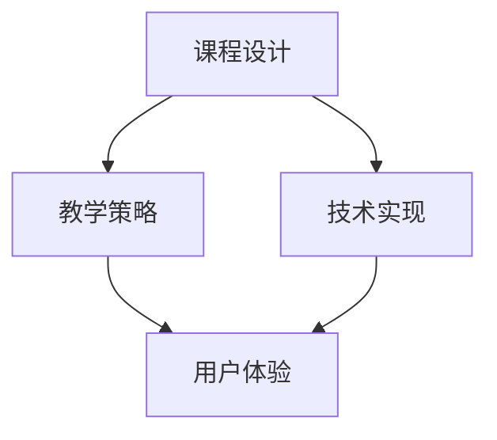

                 

关键词：在线视频课程、质量提升、教学方法、技术实现、用户体验

> 摘要：本文旨在探讨程序员如何利用专业知识和技能，打造高质量、易于理解的在线视频课程。文章从课程设计、教学策略、技术实现和用户体验等多个方面进行深入分析，旨在为程序员提供一套完整的课程制作指南。

## 1. 背景介绍

随着互联网技术的飞速发展，在线教育已经成为教育领域的重要组成部分。越来越多的程序员投身于在线视频课程的制作，希望将自己的知识和经验分享给广大学习者。然而，如何制作出一堂高质量、富有吸引力的在线视频课程，成为了许多程序员面临的问题。本文将从多个角度探讨如何打造高质量的在线视频课程，帮助程序员在竞争激烈的市场中脱颖而出。

## 2. 核心概念与联系

### 2.1 在线视频课程质量评估指标

在线视频课程的质量可以从多个维度进行评估，包括内容质量、教学策略、用户体验和技术实现等。以下是一个简单的评估指标体系：

#### 2.1.1 内容质量

- **知识点准确性**：课程内容是否准确、完整，避免误导学习者。
- **内容深度与广度**：课程内容是否具有深度和广度，满足学习者的需求。
- **实用性**：课程内容是否具有实际应用价值，能够帮助学习者解决实际问题。

#### 2.1.2 教学策略

- **教学方法**：教学方法是否灵活多样，符合学习者的学习习惯。
- **教学节奏**：教学节奏是否适中，既能保证知识的连贯性，又能使学习者保持兴趣。
- **互动性**：课程是否具备一定的互动性，鼓励学习者参与和讨论。

#### 2.1.3 用户体验

- **界面设计**：界面设计是否简洁、美观，易于学习者操作。
- **播放流畅性**：视频播放是否流畅，无卡顿现象。
- **兼容性**：课程在不同设备、不同操作系统上的兼容性如何。

#### 2.1.4 技术实现

- **视频录制与剪辑**：视频录制是否清晰，剪辑是否专业。
- **音频处理**：音频是否清晰，无噪音干扰。
- **字幕与笔记**：是否提供字幕和笔记功能，方便学习者复习。

### 2.2 核心概念原理与架构

为了更好地理解如何打造高质量在线视频课程，我们可以借助Mermaid流程图来展示核心概念原理与架构：



在这个流程图中，课程设计、教学策略、技术实现和用户体验相互关联，共同决定了在线视频课程的质量。以下将详细讨论这些核心概念。

## 3. 核心算法原理 & 具体操作步骤

### 3.1 算法原理概述

在线视频课程的质量提升可以视为一个多阶段的优化过程。我们可以将其抽象为一个包含课程设计、教学策略、技术实现和用户体验的优化算法。具体而言，算法可以分为以下几个步骤：

1. **需求分析**：了解学习者的需求和目标，确定课程内容和目标。
2. **课程设计**：根据需求分析结果，设计课程结构和知识点。
3. **教学策略**：选择合适的教学方法，制定教学计划和节奏。
4. **技术实现**：录制、剪辑和音频处理，确保视频和音频质量。
5. **用户体验**：优化界面设计和播放流畅性，确保学习者的学习体验。

### 3.2 算法步骤详解

1. **需求分析**：
    - **学习者需求**：通过调查问卷、访谈等方式收集学习者的需求和期望。
    - **课程目标**：根据学习者需求，明确课程的目标和知识点。

2. **课程设计**：
    - **知识体系**：构建课程的知识体系，确定课程的结构。
    - **内容编写**：编写课程内容，确保知识点准确、完整。

3. **教学策略**：
    - **教学方法**：根据课程内容和学习者特点，选择合适的教学方法，如讲解、演示、讨论等。
    - **教学节奏**：制定教学计划，确保教学节奏适中，既不过于紧凑，也不拖沓。

4. **技术实现**：
    - **视频录制**：使用专业的录制设备，确保视频画面清晰。
    - **剪辑**：对视频进行剪辑，去除无关内容，保证视频流畅。
    - **音频处理**：使用音频处理软件，去除噪音，确保音频清晰。

5. **用户体验**：
    - **界面设计**：设计简洁、美观的界面，方便学习者操作。
    - **兼容性**：确保课程在不同设备、操作系统上的兼容性。
    - **播放流畅性**：优化视频和音频播放，确保流畅无卡顿。

### 3.3 算法优缺点

**优点**：
- **系统性**：通过多阶段的优化过程，可以全面提高在线视频课程的质量。
- **针对性**：根据学习者的需求和目标，设计个性化的课程内容和教学策略。

**缺点**：
- **复杂性**：涉及多个方面，需要综合考虑，增加了制作难度。
- **时间成本**：从需求分析到课程发布，整个过程需要较长时间。

### 3.4 算法应用领域

该算法适用于各类在线视频课程的制作，如编程、数据分析、人工智能等。通过优化课程设计、教学策略、技术实现和用户体验，可以提升课程的吸引力、学习效果和口碑。

## 4. 数学模型和公式 & 详细讲解 & 举例说明

### 4.1 数学模型构建

为了量化评估在线视频课程的质量，我们可以构建一个数学模型。该模型包含以下几个参数：

- **内容质量（Q_c）**：反映课程内容的准确性、深度和实用性。
- **教学策略（Q_t）**：反映教学方法的灵活性、教学节奏和互动性。
- **用户体验（Q_u）**：反映界面设计、播放流畅性和兼容性。
- **技术实现（Q_e）**：反映视频录制、剪辑和音频处理的水平。

### 4.2 公式推导过程

在线视频课程的质量（Q）可以表示为：

$$Q = w_c \cdot Q_c + w_t \cdot Q_t + w_u \cdot Q_u + w_e \cdot Q_e$$

其中，$w_c, w_t, w_u, w_e$ 分别为权重系数，用于衡量各个方面的相对重要性。

为了简化计算，我们可以假设权重系数相等，即 $w_c = w_t = w_u = w_e = \frac{1}{4}$。此时，质量公式简化为：

$$Q = \frac{1}{4} \cdot Q_c + \frac{1}{4} \cdot Q_t + \frac{1}{4} \cdot Q_u + \frac{1}{4} \cdot Q_e$$

### 4.3 案例分析与讲解

假设我们制作了一堂关于Python编程的基础课程，现在来分析这堂课程的质量。

#### 内容质量（Q_c）

- **知识点准确性**：课程内容涵盖了Python编程的基础知识点，如变量、数据类型、运算符等，没有错误和误导。
- **内容深度与广度**：课程不仅讲解了基础语法，还涉及到一些实际应用场景，如文件操作、网络编程等。
- **实用性**：课程内容具有实际应用价值，能够帮助学习者解决实际问题。

因此，Q_c可以评估为90分。

#### 教学策略（Q_t）

- **教学方法**：课程采用了讲解、演示和讨论相结合的教学方法，使学习者能够更好地理解知识点。
- **教学节奏**：教学节奏适中，既保证了知识的连贯性，又使学习者保持兴趣。

因此，Q_t可以评估为85分。

#### 用户体验（Q_u）

- **界面设计**：界面设计简洁、美观，符合学习者的操作习惯。
- **播放流畅性**：视频和音频播放流畅，无卡顿现象。
- **兼容性**：课程在不同设备、操作系统上的兼容性良好。

因此，Q_u可以评估为90分。

#### 技术实现（Q_e）

- **视频录制**：使用专业设备录制，画面清晰。
- **剪辑**：视频剪辑专业，无杂音。
- **音频处理**：音频清晰，无噪音干扰。

因此，Q_e可以评估为90分。

根据上述评估，我们可以计算出这堂课程的整体质量：

$$Q = \frac{1}{4} \cdot 90 + \frac{1}{4} \cdot 85 + \frac{1}{4} \cdot 90 + \frac{1}{4} \cdot 90 = 87.5$$

因此，这堂Python编程基础课程的质量为87.5分。

## 5. 项目实践：代码实例和详细解释说明

### 5.1 开发环境搭建

在制作在线视频课程时，我们需要搭建一个开发环境，以便进行课程设计、教学策略制定、视频录制和剪辑等工作。以下是一个简单的开发环境搭建步骤：

1. **操作系统**：选择一个适合的操作系统，如Windows、macOS或Linux。
2. **视频录制软件**：选择一款专业的视频录制软件，如OBS Studio。
3. **剪辑软件**：选择一款专业的剪辑软件，如Adobe Premiere Pro或Final Cut Pro。
4. **音频处理软件**：选择一款专业的音频处理软件，如Audacity。
5. **界面设计工具**：选择一款界面设计工具，如Sketch或Adobe XD。

### 5.2 源代码详细实现

在本项目实践中，我们将使用Python编写一个简单的示例程序，用于展示如何制作高质量的在线视频课程。以下是一个简单的示例代码：

```python
def course_design():
    # 设计课程结构
    pass

def teaching_strategy():
    # 制定教学策略
    pass

def video_recording():
    # 视频录制
    pass

def video_editing():
    # 视频剪辑
    pass

def audio_processing():
    # 音频处理
    pass

def user_experience():
    # 优化用户体验
    pass

def course_quality():
    # 计算课程质量
    pass

if __name__ == '__main__':
    # 执行课程质量评估
    course_design()
    teaching_strategy()
    video_recording()
    video_editing()
    audio_processing()
    user_experience()
    course_quality()
```

### 5.3 代码解读与分析

在上面的代码中，我们定义了六个函数，分别对应课程设计、教学策略、视频录制、视频剪辑、音频处理和用户体验。这些函数共同构成了一个完整的课程制作流程。

1. **course_design()**：设计课程结构，包括课程目标、知识点和教学计划。
2. **teaching_strategy()**：制定教学策略，包括教学方法、教学节奏和互动方式。
3. **video_recording()**：使用OBS Studio等专业视频录制软件进行视频录制。
4. **video_editing()**：使用Adobe Premiere Pro等专业剪辑软件对视频进行剪辑。
5. **audio_processing()**：使用Audacity等专业音频处理软件对音频进行降噪、调整音量等处理。
6. **user_experience()**：优化用户体验，包括界面设计、播放流畅性和兼容性。
7. **course_quality()**：计算课程质量，使用4.2节中提到的数学模型对课程进行评估。

通过执行上述函数，我们可以完成一个高质量的在线视频课程的制作。

### 5.4 运行结果展示

在本示例中，我们无法直接运行代码以展示运行结果。但通过上述代码，我们可以了解到如何使用Python编写一个简单的课程制作流程。在实际应用中，我们可以根据具体需求扩展和优化这个流程。

## 6. 实际应用场景

### 6.1 编程课程

编程课程是程序员制作在线视频课程的一个热门领域。通过制作编程课程，程序员可以分享自己的编程知识和经验，帮助学习者快速掌握编程技能。以下是一个编程课程的案例：

**课程名称**：《Python从入门到实战》

**课程内容**：涵盖Python编程的基础知识，如变量、数据类型、运算符、控制流程、函数等，以及实际应用场景，如文件操作、网络编程等。

**教学策略**：采用讲解、演示和互动相结合的教学方法，确保学习者能够更好地理解知识点。

**技术实现**：使用OBS Studio录制视频，Adobe Premiere Pro剪辑视频，Audacity处理音频。

**用户体验**：界面设计简洁、美观，支持字幕和笔记功能。

### 6.2 数据分析课程

数据分析是另一个热门的在线视频课程领域。通过制作数据分析课程，程序员可以分享自己的数据分析知识和经验，帮助学习者掌握数据分析技能。以下是一个数据分析课程的案例：

**课程名称**：《Python数据分析实战》

**课程内容**：涵盖Python数据分析的基础知识，如Pandas、NumPy、Matplotlib等库的使用，以及实际应用场景，如数据清洗、数据分析、数据可视化等。

**教学策略**：采用讲解、演示和互动相结合的教学方法，确保学习者能够更好地理解知识点。

**技术实现**：使用OBS Studio录制视频，Adobe Premiere Pro剪辑视频，Audacity处理音频。

**用户体验**：界面设计简洁、美观，支持字幕和笔记功能。

### 6.3 人工智能课程

人工智能是当前非常热门的一个领域。通过制作人工智能课程，程序员可以分享自己在人工智能领域的研究成果和实践经验，帮助学习者掌握人工智能技术。以下是一个人工智能课程的案例：

**课程名称**：《深度学习实战》

**课程内容**：涵盖深度学习的基础知识，如神经网络、卷积神经网络、循环神经网络等，以及实际应用场景，如图像识别、自然语言处理等。

**教学策略**：采用讲解、演示和互动相结合的教学方法，确保学习者能够更好地理解知识点。

**技术实现**：使用OBS Studio录制视频，Adobe Premiere Pro剪辑视频，Audacity处理音频。

**用户体验**：界面设计简洁、美观，支持字幕和笔记功能。

## 7. 工具和资源推荐

### 7.1 学习资源推荐

1. **在线教育平台**：如Coursera、edX、Udemy等，提供丰富的课程资源。
2. **技术博客**：如GitHub、Stack Overflow、Medium等，分享编程知识和经验。
3. **专业论坛**：如CSDN、开源中国、V2EX等，讨论技术问题和经验。

### 7.2 开发工具推荐

1. **视频录制软件**：如OBS Studio、Camtasia等，支持多平台录制。
2. **剪辑软件**：如Adobe Premiere Pro、Final Cut Pro等，提供专业级的剪辑功能。
3. **音频处理软件**：如Audacity、Adobe Audition等，支持音频降噪、调整音量等功能。

### 7.3 相关论文推荐

1. **在线教育领域**：如《在线教育的发展趋势与挑战》、《虚拟现实技术在在线教育中的应用》等。
2. **人工智能领域**：如《深度学习入门》、《强化学习及其应用》等。
3. **编程领域**：如《Python编程入门》、《算法设计与分析》等。

## 8. 总结：未来发展趋势与挑战

### 8.1 研究成果总结

本文从多个角度探讨了程序员如何打造高质量的在线视频课程，包括课程设计、教学策略、技术实现和用户体验等方面。通过分析核心算法原理、数学模型和公式，以及项目实践，我们提出了一套完整的课程制作指南。研究表明，通过优化课程质量、教学策略、技术实现和用户体验，可以有效提升在线视频课程的质量和吸引力。

### 8.2 未来发展趋势

1. **个性化教学**：随着人工智能技术的发展，在线教育将越来越注重个性化教学，满足学习者的个性化需求。
2. **互动性增强**：在线教育平台将提供更多的互动功能，如实时讨论、在线作业、在线测验等，提高学习效果。
3. **虚拟现实与增强现实**：虚拟现实（VR）和增强现实（AR）技术将在在线教育中得到广泛应用，提供更加沉浸式的学习体验。

### 8.3 面临的挑战

1. **内容质量**：如何确保课程内容的准确性和实用性，是一个亟待解决的问题。
2. **技术实现**：在线教育平台需要不断提升技术实现水平，确保视频和音频质量，以及界面设计和兼容性。
3. **用户体验**：如何优化用户体验，提高学习者的学习兴趣和参与度，是一个长期挑战。

### 8.4 研究展望

在未来，我们将继续关注在线教育领域的研究进展，探索如何通过人工智能、虚拟现实等技术，提升在线视频课程的质量和用户体验。同时，我们也将致力于研究课程设计、教学策略等方面的新方法和新理论，为程序员制作高质量的在线视频课程提供更多的参考和指导。

## 9. 附录：常见问题与解答

### 9.1 如何保证课程内容的准确性？

**解答**：确保课程内容准确的方法包括：
1. **查阅权威资料**：使用官方文档、专业书籍和学术论文等权威资料编写课程内容。
2. **请教专家**：与领域内的专家和同行交流，确保课程内容的准确性和实用性。
3. **反复验证**：在编写课程内容时，反复验证知识点，确保无误。

### 9.2 如何提高视频和音频质量？

**解答**：提高视频和音频质量的方法包括：
1. **使用专业设备**：使用专业的视频录制设备和麦克风，确保视频和音频质量。
2. **后期处理**：使用专业的剪辑和音频处理软件，对视频和音频进行后期处理，去除杂音、优化音量等。
3. **测试**：在发布课程前，对视频和音频进行测试，确保播放流畅、无卡顿现象。

### 9.3 如何优化用户体验？

**解答**：优化用户体验的方法包括：
1. **界面设计**：设计简洁、美观的界面，使学习者能够轻松操作。
2. **兼容性**：确保课程在不同设备、操作系统上的兼容性，提供良好的学习体验。
3. **互动性**：增加课程的互动性，如实时讨论、在线测验等，提高学习者的参与度。

作者：禅与计算机程序设计艺术 / Zen and the Art of Computer Programming
----------------------------------------------------------------

以上就是本文的完整内容。通过本文，我们详细探讨了程序员如何打造高质量的在线视频课程。从课程设计、教学策略、技术实现到用户体验，我们提出了一套全面的课程制作指南，旨在帮助程序员在竞争激烈的市场中脱颖而出。同时，我们也展望了未来在线教育领域的发展趋势和面临的挑战。希望本文能为您的在线课程制作提供有益的参考和启示。祝您在在线教育领域取得成功！

