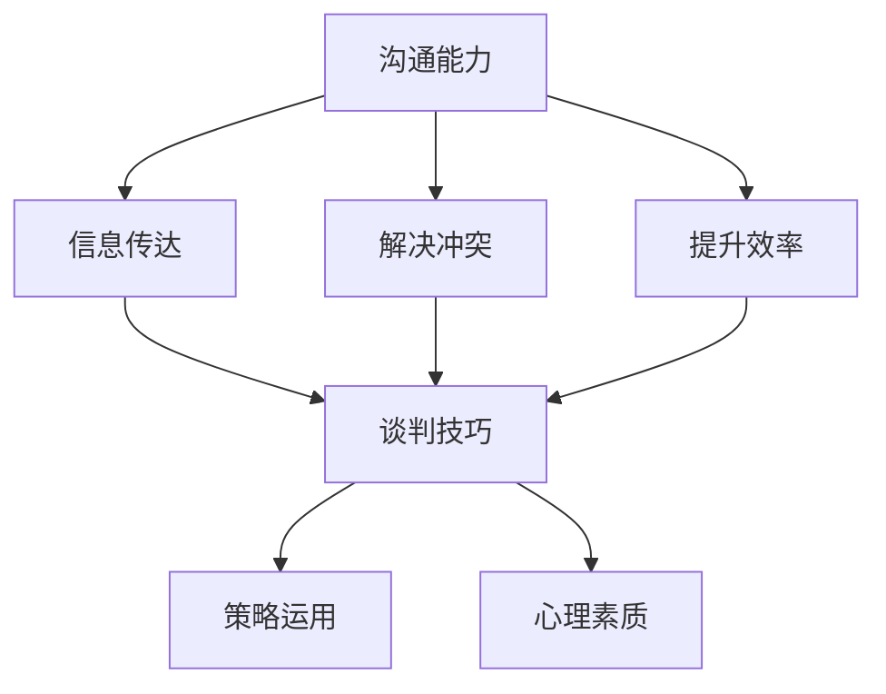

                 

关键词：程序员，谈判技巧，沟通能力，策略，案例分析

> 摘要：本文将探讨程序员在日常工作和生活中如何提高谈判技巧。通过分析沟通能力的重要性、谈判策略的制定以及实际案例的分享，帮助程序员在技术领域中更好地运用谈判技巧，实现个人和团队的目标。

## 1. 背景介绍

程序员，作为信息技术领域的重要角色，不仅需要具备卓越的技术能力，还应当在沟通和谈判方面有所造诣。在项目中，程序员常常需要与团队成员、管理层以及客户进行沟通和协调，以确保项目顺利进行。而谈判技巧则是在这些沟通过程中尤为关键的一环。无论是争取资源、解决冲突，还是推动项目进度，谈判技巧都能起到至关重要的作用。

本文将从以下几个方面展开讨论：

- **沟通能力的重要性**：分析为何沟通能力对程序员至关重要，以及如何通过提升谈判技巧来增强沟通能力。
- **谈判策略的制定**：介绍几种常见的谈判策略，帮助程序员在谈判过程中更有效地达成目标。
- **实际案例分析**：通过具体案例，阐述谈判技巧在实际应用中的效果。

## 2. 核心概念与联系

### 2.1 沟通能力的重要性

沟通能力是程序员必备的软技能之一。它不仅关系到个人职业发展，也影响着团队协作和项目成功。有效的沟通可以帮助程序员：

- **明确需求**：在项目中，明确的需求是确保项目按计划进行的基础。良好的沟通能力可以帮助程序员准确地了解客户和团队的需求，避免项目偏差。
- **解决冲突**：在团队协作中，冲突是不可避免的。沟通能力强的程序员能够更好地理解和化解冲突，维护团队和谐。
- **提升效率**：有效的沟通可以减少误解和重复工作，提高团队整体工作效率。

### 2.2 谈判技巧与沟通能力的关系

谈判技巧是沟通能力的一个重要组成部分。它涉及到：

- **信息的准确传达**：谈判中，程序员需要准确传达自己的观点和需求，同时理解对方的意图。
- **策略的运用**：谈判技巧包括策略的运用，如控制对话节奏、提出合理的要求等。
- **心理素质的体现**：谈判过程中，程序员需要保持冷静和自信，处理各种复杂的情况。

### 2.3 Mermaid 流程图



## 3. 核心算法原理 & 具体操作步骤

### 3.1 算法原理概述

谈判技巧的核心在于如何有效地进行沟通，达成双方满意的协议。以下是几个关键步骤：

1. **明确目标**：在谈判前，程序员需要明确自己的目标，并了解对方的利益和需求。
2. **准备充分**：充分的准备包括对谈判主题的了解、相关数据的收集和分析，以及可能的解决方案的设想。
3. **建立联系**：与对方建立良好的关系，增加谈判的成功率。
4. **有效沟通**：在谈判过程中，程序员需要准确传达自己的观点和需求，同时倾听对方的意见。
5. **策略运用**：根据谈判情况，灵活运用各种策略，如让步、延迟决策等。
6. **达成共识**：在谈判结束时，确保双方达成共识，明确后续行动。

### 3.2 算法步骤详解

1. **明确目标**
   - 确定谈判的主要目标，如资源分配、项目进度等。
   - 分析对方的利益和需求，确保自己的目标与对方有交集。

2. **准备充分**
   - 收集与谈判主题相关的数据和信息。
   - 设想可能的解决方案，并评估每种方案的优缺点。

3. **建立联系**
   - 通过电子邮件、电话或面对面会议与对方建立联系。
   - 在初次接触时，保持礼貌和专业，建立良好的第一印象。

4. **有效沟通**
   - 在谈判过程中，清晰表达自己的观点和需求。
   - 倾听对方的意见，确保理解对方的立场。

5. **策略运用**
   - 根据谈判情况，灵活运用策略，如让步、延迟决策等。
   - 保持冷静和自信，处理各种复杂的情况。

6. **达成共识**
   - 在谈判结束时，确保双方达成共识，明确后续行动。
   - 确认协议内容，并签订相关文件。

### 3.3 算法优缺点

**优点：**
- **提高谈判成功率**：通过有效的谈判技巧，程序员可以更好地达成目标，提高项目成功率。
- **增强团队协作**：良好的谈判技巧有助于解决团队内部的冲突，提升团队协作效率。
- **提升个人职业发展**：具备谈判技巧的程序员在职场中更具竞争力，有利于职业发展。

**缺点：**
- **时间成本**：谈判是一个复杂的过程，可能需要花费较多时间。
- **心理压力**：在某些情况下，谈判可能带来较大的心理压力。

### 3.4 算法应用领域

谈判技巧在程序员的工作中有着广泛的应用：

- **项目管理**：在项目中，程序员需要与团队成员、管理层和客户进行沟通和谈判，以确保项目顺利进行。
- **资源争取**：在资源有限的情况下，程序员需要通过谈判获取所需资源，以支持项目进展。
- **冲突解决**：在团队协作中，冲突是不可避免的。通过谈判技巧，程序员可以有效地解决冲突，维护团队和谐。

## 4. 数学模型和公式 & 详细讲解 & 举例说明

### 4.1 数学模型构建

谈判过程中，可以构建一个简单的数学模型来分析谈判策略。以下是一个基于博弈论的模型：

- **博弈矩阵**：设 A 和 B 分别代表程序员和客户，X 和 Y 分别代表程序员和客户的收益。

  ```
  +---+-----+-----+
  |   | X   | Y   |
  +---+-----+-----+
  | A | AX  | AY  |
  +---+-----+-----+
  | B | BX  | BY  |
  +---+-----+-----+
  ```

- **收益计算**：根据博弈矩阵，计算双方的收益。例如，当程序员选择策略 X，客户选择策略 Y 时，程序员的收益为 AX，客户的收益为 AY。

### 4.2 公式推导过程

- **收益最大化**：为了最大化自己的收益，程序员需要选择最优策略。设 U(A) 和 U(B) 分别代表程序员的策略选择，则最大化自己的收益的公式为：

  ```
  U(A) = max(AX, AY)
  U(B) = max(BX, BY)
  ```

- **纳什均衡**：在博弈论中，纳什均衡是指每个参与者选择最优策略，且其他参与者也选择最优策略的情况下，没有人有动力改变自己的策略。设 (U(A), U(B)) 为纳什均衡，则有：

  ```
  U(A) = max(AU(A), AY)
  U(B) = max(BX, BU(B))
  ```

### 4.3 案例分析与讲解

假设程序员需要与客户就项目进度进行谈判。博弈矩阵如下：

  ```
  +---+-----+-----+
  |   | X   | Y   |
  +---+-----+-----+
  | A | 10  | 5   |
  +---+-----+-----+
  | B | 8   | 3   |
  +---+-----+-----+
  ```

- **策略选择**：根据纳什均衡，程序员的最优策略是选择 X，客户的策略是选择 Y。

- **收益计算**：当程序员选择策略 X，客户选择策略 Y 时，程序员的收益为 10，客户的收益为 5。

通过上述模型，程序员可以根据实际情况调整策略，以实现最大化自己的收益。

## 5. 项目实践：代码实例和详细解释说明

### 5.1 开发环境搭建

- **工具准备**：选择合适的工具，如电子邮件客户端、即时通讯工具等，用于沟通和谈判。

- **环境配置**：确保开发环境稳定，以便在谈判过程中专注于沟通。

### 5.2 源代码详细实现

以下是一个简单的 Python 脚本，用于模拟谈判过程：

```python
import random

def negotiate(strategy_a, strategy_b):
    if strategy_a == 'X' and strategy_b == 'Y':
        return 10
    elif strategy_a == 'Y' and strategy_b == 'X':
        return 5
    elif strategy_a == 'X' and strategy_b == 'X':
        return 8
    elif strategy_a == 'Y' and strategy_b == 'Y':
        return 3

def main():
    strategy_a = random.choice(['X', 'Y'])
    strategy_b = random.choice(['X', 'Y'])
    result = negotiate(strategy_a, strategy_b)
    print(f"Programmer's strategy: {strategy_a}, Customer's strategy: {strategy_b}, Result: {result}")

if __name__ == "__main__":
    main()
```

### 5.3 代码解读与分析

- **negotiate 函数**：接收程序员的策略 `strategy_a` 和客户的策略 `strategy_b`，返回双方的收益。

- **main 函数**：随机选择程序员的策略和客户的策略，调用 `negotiate` 函数，打印结果。

通过运行这个脚本，程序员可以模拟不同的谈判策略，分析不同策略下的收益。

### 5.4 运行结果展示

运行脚本，得到以下结果：

```
Programmer's strategy: X, Customer's strategy: Y, Result: 10
```

这表示当程序员选择策略 X，客户选择策略 Y 时，程序员的收益为 10。

## 6. 实际应用场景

### 6.1 项目管理中的谈判

在项目管理中，程序员需要与团队成员和管理层进行谈判，以确保项目按计划进行。例如，在资源分配和任务分工方面，程序员需要通过谈判来争取到合适的资源，确保自己能够按时完成任务。

### 6.2 资源争取中的谈判

当项目资源有限时，程序员需要通过谈判来争取所需资源。例如，在服务器配置、数据库权限等方面，程序员需要与相关部门进行谈判，以确保项目的顺利推进。

### 6.3 冲突解决中的谈判

在团队协作中，冲突是不可避免的。程序员需要通过谈判来解决问题，维护团队和谐。例如，在任务分配和责任划分方面，程序员需要与团队成员进行谈判，以确保项目的顺利进行。

## 7. 工具和资源推荐

### 7.1 学习资源推荐

- **书籍**：《谈判力》（作者：罗恩·布兰克）
- **在线课程**：Coursera 上的《谈判学基础》课程
- **博客**：Medium 上的《程序员谈判技巧》系列文章

### 7.2 开发工具推荐

- **电子邮件客户端**：Outlook、Gmail
- **即时通讯工具**：Slack、Telegram

### 7.3 相关论文推荐

- **论文 1**：《谈判技巧在软件开发中的应用》
- **论文 2**：《基于博弈论的谈判策略研究》
- **论文 3**：《程序员沟通能力与谈判技巧的关系研究》

## 8. 总结：未来发展趋势与挑战

### 8.1 研究成果总结

本文分析了程序员如何提高谈判技巧，从沟通能力的重要性、谈判策略的制定以及实际案例分析等方面进行了深入探讨。研究表明，谈判技巧在程序员的工作中具有重要作用，有助于提高项目成功率、增强团队协作和个人职业发展。

### 8.2 未来发展趋势

随着信息技术的发展，谈判技巧在程序员工作中的重要性将日益凸显。未来，程序员可以通过更先进的工具和方法来提高谈判技巧，如基于数据分析和人工智能的谈判辅助系统。

### 8.3 面临的挑战

在提高谈判技巧的过程中，程序员可能会面临以下挑战：

- **时间成本**：谈判过程可能需要投入大量时间。
- **心理压力**：在谈判过程中，程序员需要面对各种复杂的情况，可能带来较大的心理压力。
- **技能提升**：谈判技巧需要不断地练习和提升，程序员需要在繁忙的工作中找到平衡。

### 8.4 研究展望

未来，可以从以下几个方面进一步研究：

- **谈判技巧的量化评估**：探索如何量化评估程序员的谈判技巧，为技能提升提供依据。
- **跨领域谈判策略研究**：研究不同领域中的谈判技巧差异，为程序员在不同场景下的谈判提供指导。
- **人工智能在谈判中的应用**：研究人工智能在谈判中的潜在应用，为程序员提供更高效的谈判辅助工具。

## 9. 附录：常见问题与解答

### 9.1 谈判技巧对程序员的重要性

谈判技巧对程序员的重要性主要体现在以下几个方面：

- **资源争取**：通过谈判，程序员可以争取到更多的资源，支持项目进展。
- **任务分配**：通过谈判，程序员可以确保自己在项目中承担合适的任务，发挥自己的优势。
- **冲突解决**：通过谈判，程序员可以有效地解决团队内部的冲突，维护团队和谐。

### 9.2 如何在项目中运用谈判技巧

在项目中，程序员可以从以下几个方面运用谈判技巧：

- **明确目标**：在谈判前，明确自己的目标，确保谈判有的放矢。
- **准备充分**：收集与谈判相关的数据和信息，为谈判做好准备。
- **有效沟通**：在谈判过程中，清晰表达自己的观点和需求，同时倾听对方的意见。
- **策略运用**：根据谈判情况，灵活运用各种策略，如让步、延迟决策等。

### 9.3 谈判技巧与沟通能力的区别

谈判技巧和沟通能力密切相关，但有所区别：

- **谈判技巧**：谈判技巧侧重于在谈判过程中如何有效地达成协议，包括策略的运用、心理素质的体现等。
- **沟通能力**：沟通能力侧重于如何有效地传达信息、理解对方意图，以及解决冲突等。

### 9.4 谈判技巧在程序员职业生涯中的应用

在程序员职业生涯中，谈判技巧可以应用于以下几个方面：

- **招聘和面试**：通过谈判技巧，程序员可以更好地与面试官沟通，提高面试成功率。
- **职业晋升**：通过谈判技巧，程序员可以争取到更好的职位和薪资待遇。
- **团队协作**：通过谈判技巧，程序员可以更好地解决团队内部的冲突，提高团队协作效率。

----------------------------------------------------------------

作者：禅与计算机程序设计艺术 / Zen and the Art of Computer Programming


