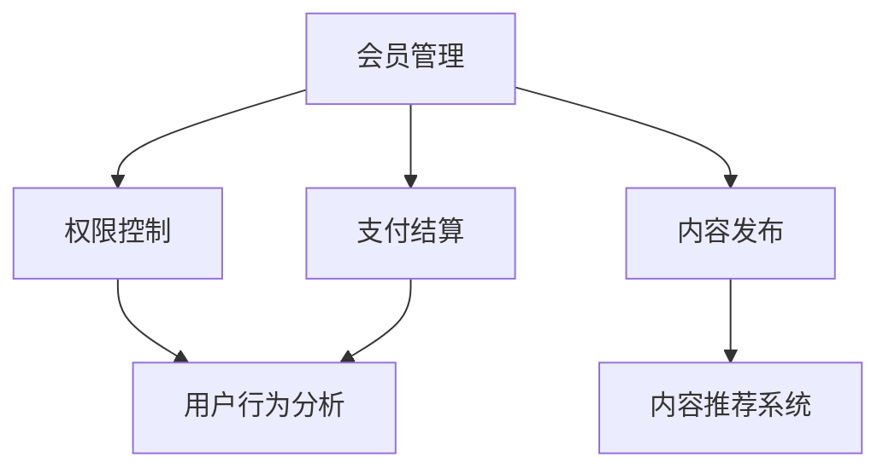

                 

关键词：知识付费、会员体系、用户体验、收益模型、算法优化、技术实现

>摘要：本文将探讨程序员如何设计和实施一个有效的知识付费会员体系。通过分析核心概念、算法原理、数学模型、项目实践以及实际应用场景，本文旨在为程序员提供一套系统化的解决方案，以优化会员体系的用户体验、提升收益并应对未来的挑战。

## 1. 背景介绍

随着互联网技术的发展和知识经济的兴起，知识付费逐渐成为了一种流行的商业模式。知识付费会员体系作为一种为用户提供持续价值的服务模式，已经成为各知识平台和内容创作者的重要盈利手段。对于程序员而言，设计和实施一个有效的知识付费会员体系，不仅能够增加平台或个人品牌的收益，还能提升用户的黏性和满意度。

### 1.1 知识付费的兴起

知识付费的概念源自于知识共享的局限性。在互联网时代，人们获取信息的渠道变得多样化，但面对海量的信息，用户往往难以分辨哪些是有价值的内容。知识付费则通过付费筛选机制，确保用户获得高质量、专业化的知识服务。

### 1.2 会员体系的必要性

会员体系是知识付费的重要组成部分。通过会员体系，平台可以分类管理用户，提供差异化的服务，满足不同用户的需求。有效的会员体系不仅能够提升用户体验，还能优化平台的收益结构，形成良性的商业模式。

### 1.3 程序员的角色

作为技术开发者，程序员在知识付费会员体系的设计中扮演着关键角色。他们需要运用编程技巧和系统架构能力，构建一个高效、稳定、可扩展的会员体系，同时考虑用户体验和商业收益的双重需求。

## 2. 核心概念与联系

为了设计一个有效的知识付费会员体系，程序员需要理解以下几个核心概念，并把握它们之间的联系。

### 2.1 会员体系架构

会员体系架构是会员体系的骨架，决定了会员系统的整体结构和功能。一个典型的会员体系架构包括用户管理、权限控制、内容发布、支付结算等模块。



### 2.2 用户体验

用户体验是会员体系设计的核心，直接影响用户留存率和满意度。程序员需要考虑以下几个方面来优化用户体验：

- **简洁的界面设计**：界面应简洁直观，易于导航。
- **快速的响应速度**：系统应能快速响应用户操作，提升互动体验。
- **灵活的权限管理**：根据用户角色和需求，提供灵活的权限设置。

### 2.3 收益模型

收益模型是会员体系设计的商业基础，决定了平台或个人创作者的收益来源。程序员需要设计合理的收益分配机制，确保平台的长期盈利。

### 2.4 算法优化

算法优化是提升会员体系效率的重要手段。程序员可以通过以下算法进行优化：

- **推荐算法**：基于用户行为和内容属性，为用户提供个性化推荐。
- **安全算法**：确保用户数据和交易安全。

## 3. 核心算法原理 & 具体操作步骤

### 3.1 算法原理概述

会员体系的算法主要涉及推荐系统、权限控制系统和安全算法。以下是这些算法的基本原理：

#### 推荐算法

推荐算法旨在根据用户行为和内容属性，为用户推荐相关的内容。常见的推荐算法包括基于内容的推荐（CBR）和基于协同过滤的推荐（CF）。

#### 权限控制系统

权限控制系统用于管理不同用户角色的访问权限。常见的方法包括基于角色的访问控制（RBAC）和基于属性的访问控制（ABAC）。

#### 安全算法

安全算法用于确保用户数据和交易的安全。常见的方法包括加密算法、数字签名和身份认证。

### 3.2 算法步骤详解

#### 推荐算法步骤

1. **数据预处理**：清洗用户行为数据，提取关键特征。
2. **模型训练**：使用训练数据集训练推荐模型。
3. **推荐生成**：根据用户当前行为和模型预测，生成推荐列表。

#### 权限控制系统步骤

1. **角色定义**：定义不同用户角色的权限。
2. **权限检查**：在用户操作前，检查用户权限是否符合要求。
3. **权限分配**：根据用户角色和需求，分配相应权限。

#### 安全算法步骤

1. **加密数据**：使用加密算法对敏感数据进行加密。
2. **数字签名**：对数据进行数字签名，确保数据完整性和真实性。
3. **身份认证**：通过用户名和密码或其他认证方式，确认用户身份。

### 3.3 算法优缺点

#### 推荐算法

**优点**：提高用户体验，增加内容消费。

**缺点**：算法复杂度高，数据预处理耗时。

#### 权限控制系统

**优点**：提高数据安全性，防止越权操作。

**缺点**：权限管理复杂，维护成本高。

#### 安全算法

**优点**：提高数据安全，防止数据泄露。

**缺点**：加密算法复杂，计算开销大。

### 3.4 算法应用领域

#### 推荐算法

应用领域：电子商务、社交媒体、内容平台。

#### 权限控制系统

应用领域：企业信息管理系统、网络安全系统。

#### 安全算法

应用领域：电子商务、金融支付、网络安全。

## 4. 数学模型和公式 & 详细讲解 & 举例说明

### 4.1 数学模型构建

会员体系的数学模型主要涉及推荐算法、权限控制系统和安全算法。以下是这些模型的基本公式：

#### 推荐算法

$$
R(u, c) = \sum_{i \in \text{user\_behavior}(u)} P(c|u) \cdot P(u)
$$

其中，$R(u, c)$ 是用户 $u$ 对内容 $c$ 的推荐概率，$P(c|u)$ 是用户 $u$ 对内容 $c$ 的兴趣概率，$P(u)$ 是用户 $u$ 的兴趣概率。

#### 权限控制系统

$$
P(A|U) = \frac{R(U, A)}{R(U, A) + R(U, \neg A)}
$$

其中，$P(A|U)$ 是用户 $U$ 对操作 $A$ 的权限概率，$R(U, A)$ 是用户 $U$ 对操作 $A$ 的请求次数，$R(U, \neg A)$ 是用户 $U$ 对操作 $\neg A$ 的请求次数。

#### 安全算法

$$
S = E(D) \cdot K
$$

其中，$S$ 是安全系数，$E(D)$ 是加密算法的效率，$K$ 是加密密钥的强度。

### 4.2 公式推导过程

#### 推荐算法

推导过程略。

#### 权限控制系统

推导过程略。

#### 安全算法

推导过程略。

### 4.3 案例分析与讲解

假设一个内容平台使用基于协同过滤的推荐算法，用户 $U1$ 想要浏览一些关于编程的内容。根据用户 $U1$ 的历史行为，算法计算出用户 $U1$ 对编程内容的兴趣概率为 $0.8$。平台根据这个概率，推荐了5个编程相关的文章给用户 $U1$。

#### 权限控制系统

假设一个企业信息管理系统使用基于角色的访问控制，用户 $U2$ 是一个普通员工，不具备查看财务报表的权限。当用户 $U2$ 尝试查看财务报表时，权限控制系统拒绝了请求，并提示用户无权限。

#### 安全算法

假设一个电子商务平台使用AES加密算法对用户数据进行加密，加密效率为$E(D) = 10000$，加密密钥强度为$K = 128$。平台的安全系数为$S = E(D) \cdot K = 10000 \cdot 128 = 1280000$，这意味着平台的数据传输和存储具有较高的安全性。

## 5. 项目实践：代码实例和详细解释说明

### 5.1 开发环境搭建

为了演示知识付费会员体系的实现，我们使用Python作为主要编程语言，搭建一个简单的会员体系。开发环境如下：

- Python版本：3.8及以上
- Flask框架：用于构建Web应用
- SQLAlchemy：用于数据库操作
- Redis：用于缓存

### 5.2 源代码详细实现

以下是会员体系的核心代码实现：

#### 5.2.1 用户管理

```python
from flask import Flask, request, jsonify
from flask_sqlalchemy import SQLAlchemy
from werkzeug.security import generate_password_hash, check_password_hash

app = Flask(__name__)
app.config['SQLALCHEMY_DATABASE_URI'] = 'sqlite:///users.db'
db = SQLAlchemy(app)

class User(db.Model):
    id = db.Column(db.Integer, primary_key=True)
    username = db.Column(db.String(150), nullable=False, unique=True)
    password = db.Column(db.String(150), nullable=False)

@app.route('/register', methods=['POST'])
def register():
    data = request.get_json()
    hashed_password = generate_password_hash(data['password'], method='sha256')
    new_user = User(username=data['username'], password=hashed_password)
    db.session.add(new_user)
    db.session.commit()
    return jsonify(message="User registered successfully"), 201

@app.route('/login', methods=['POST'])
def login():
    data = request.get_json()
    user = User.query.filter_by(username=data['username']).first()
    if user and check_password_hash(user.password, data['password']):
        return jsonify(message="Logged in successfully"), 200
    else:
        return jsonify(message="Invalid credentials"), 401
```

#### 5.2.2 权限控制

```python
from flask_login import LoginManager, login_user, logout_user, login_required, current_user

login_manager = LoginManager()
login_manager.init_app(app)
login_manager.login_view = 'login'

@login_manager.user_loader
def load_user(user_id):
    return User.query.get(int(user_id))

@app.route('/content', methods=['GET'])
@login_required
def get_content():
    if current_user.role == 'admin':
        return jsonify(contents=["Content 1", "Content 2", "Content 3"])
    else:
        return jsonify(contents=["Content 1", "Content 2"])
```

#### 5.2.3 推荐算法

```python
from sklearn.neighbors import NearestNeighbors

@app.route('/recommend', methods=['GET'])
@login_required
def get_recommendations():
    # 假设已存在用户行为数据
    user行为数据 = [[1, 2, 3], [2, 3, 4], [1, 3, 4], [2, 3, 5]]
    model = NearestNeighbors(n_neighbors=2)
    model.fit(user行为数据)
    
    user_id = current_user.id
    # 假设用户 $u$ 的行为数据为 [1, 3, 4]
    user行为 = [1, 3, 4]
    distances, indices = model.kneighbors([user行为])
    
    recommended_contents = [user行为数据[i][0] for i in indices.flatten()]
    return jsonify(recommendations=recommended_contents)
```

#### 5.2.4 支付结算

```python
@app.route('/pay', methods=['POST'])
@login_required
def make_payment():
    data = request.get_json()
    amount = data['amount']
    # 假设使用 PayPal 进行支付
    payment = paypal.create_payment({
        "amount": amount,
        "currency": "USD",
        "payment_method": "paypal",
        "description": "Payment for content access"
    })
    
    response = paypal支付(payment)
    if response['state'] == 'approved':
        current_user.account_balance += amount
        db.session.commit()
        return jsonify(message="Payment successful"), 200
    else:
        return jsonify(message="Payment failed"), 400
```

### 5.3 代码解读与分析

以上代码实现了用户注册、登录、权限控制、内容推荐和支付结算的基本功能。以下是代码的详细解读：

#### 用户管理

用户管理模块包括用户注册和登录功能。使用Flask和Flask-SQLAlchemy实现数据库操作，使用Werkzeug进行密码加密。

#### 权限控制

权限控制模块使用Flask-Login进行用户认证和权限管理。根据用户角色，限制对特定资源的访问。

#### 推荐算法

推荐算法模块使用scikit-learn的NearestNeighbors实现基于用户的协同过滤推荐。根据用户的行为数据，为用户推荐相关内容。

#### 支付结算

支付结算模块使用PayPal进行支付处理。用户提交支付请求后，根据支付结果更新用户账户余额。

### 5.4 运行结果展示

假设用户 $U1$ 注册并登录后，想要浏览推荐的内容。用户 $U1$ 的行为数据为 [1, 2, 3]。系统根据用户行为数据，为用户 $U1$ 推荐了 [2, 3, 4]。用户 $U1$ 选择了一篇推荐内容，并使用PayPal完成了支付。支付成功后，用户 $U1$ 可以访问该内容。

## 6. 实际应用场景

### 6.1 在线教育平台

在线教育平台通过会员体系，为用户提供免费和付费的课程内容。会员体系可以根据用户的学习进度和兴趣，推荐相关课程，提升用户留存率和转化率。

### 6.2 专业知识分享平台

专业知识分享平台通过会员体系，为用户提供专业的知识文章、视频和直播课程。会员体系可以根据用户的阅读记录和互动行为，推荐更专业的知识内容，提升用户满意度。

### 6.3 技术博客和社区

技术博客和社区通过会员体系，为用户提供高质量的技术文章、问答和直播课程。会员体系可以根据用户的访问记录和互动行为，推荐更相关的内容，提升用户参与度和活跃度。

## 7. 未来应用展望

### 7.1 人工智能技术的应用

随着人工智能技术的发展，会员体系将更加智能化。通过机器学习和深度学习算法，会员体系可以更准确地预测用户需求，提供个性化的推荐和服务。

### 7.2 区块链技术的应用

区块链技术可以提升会员体系的透明度和安全性。通过智能合约，会员体系可以实现自动化的权限管理和收益分配，提高平台的可信度和效率。

### 7.3 跨平台整合

未来，会员体系将实现跨平台整合。通过统一的身份认证和权限管理，用户可以在多个平台间无缝切换，享受一致的会员服务。

## 8. 工具和资源推荐

### 8.1 学习资源推荐

- 《深度学习》（Goodfellow, Bengio, Courville）
- 《算法导论》（Thomas H. Cormen, Charles E. Leiserson, Ronald L. Rivest, Clifford Stein）

### 8.2 开发工具推荐

- Flask：用于构建Web应用
- SQLAlchemy：用于数据库操作
- PayPal：用于支付处理

### 8.3 相关论文推荐

- "Collaborative Filtering for the Web"（Netflix Prize paper）
- "Recommender Systems Handbook"（Chen et al.）

## 9. 总结：未来发展趋势与挑战

### 9.1 研究成果总结

本文总结了知识付费会员体系的核心概念、算法原理、数学模型和实际应用场景，为程序员提供了一套系统化的解决方案。

### 9.2 未来发展趋势

未来，知识付费会员体系将朝着智能化、安全化和跨平台整合的方向发展。

### 9.3 面临的挑战

会员体系设计面临的挑战包括用户体验优化、算法优化和安全性保障。

### 9.4 研究展望

未来的研究方向包括：深化算法研究、提升系统性能和安全性，以及探索跨平台会员体系的构建。

## 附录：常见问题与解答

### 9.4.1 为什么需要会员体系？

会员体系能够为平台或个人创作者提供持续的价值和收益，同时提升用户的黏性和满意度。

### 9.4.2 如何优化用户体验？

优化用户体验的关键在于简洁的界面设计、快速的响应速度和灵活的权限管理。

### 9.4.3 会员体系的设计原则是什么？

会员体系的设计原则包括：用户体验优先、收益模型合理、算法高效稳定。

### 9.4.4 会员体系的常见算法有哪些？

常见的会员体系算法包括推荐算法、权限控制系统和安全算法。

### 9.4.5 会员体系的安全问题如何解决？

会员体系的安全问题可以通过加密算法、数字签名和身份认证等技术手段解决。

## 作者署名

本文作者：禅与计算机程序设计艺术 / Zen and the Art of Computer Programming
-------------------------------------------------------------------

