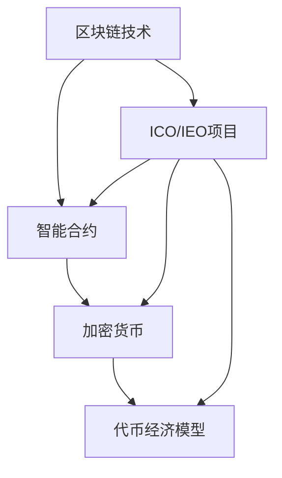

                 

关键词：ICO、IEO、程序员、评估、参与、区块链、智能合约、风险分析、项目评估流程、合规性审查

## 摘要

本文旨在为程序员提供一套系统的方法和工具，以评估并参与ICO（Initial Coin Offering）和IEO（Initial Exchange Offering）项目。通过深入探讨项目的技术可行性、市场潜力、合规性以及风险管理，本文将帮助程序员在纷繁复杂的区块链市场中做出明智的决策。本文将涵盖从项目背景了解、技术架构分析到代码审查和风险评估的各个关键环节，并以实际案例为例，详细解析程序员在ICO与IEO项目中的角色与责任。

## 1. 背景介绍

随着区块链技术的快速发展，ICO与IEO已成为融资和上市的新途径。ICO是指通过发行加密货币来融资，而IEO则是由交易所支持的代币发行。这两个模式都为初创公司提供了快速获取资金的途径，同时也为投资者带来了新的投资机会。

然而，ICO和IEO市场也存在高风险，包括技术风险、市场风险和合规风险。对于程序员而言，参与这些项目不仅需要具备深厚的技术背景，还需要对市场动态和合规要求有充分的了解。本文将引导程序员如何从技术角度评估这些项目，并在参与过程中降低风险。

### 1.1 ICO与IEO的基本概念

ICO（Initial Coin Offering）：ICO是一种众筹方式，公司通过发行加密货币来筹集资金。投资者通过支付法定货币或加密货币来购买这些代币，以此支持项目的开发和成长。ICO的成功取决于代币的价值增长，因此吸引了大量寻求高回报的投资者。

IEO（Initial Exchange Offering）：IEO是近年来兴起的一种ICO替代模式。与ICO不同，IEO是在交易所平台上发行的代币，通常由交易所提供背书。这意味着IEO项目的合规性和可靠性相对较高，同时也降低了项目失败的风险。

### 1.2 ICO与IEO市场的现状与趋势

当前，ICO市场正处于快速发展阶段，越来越多的公司选择通过ICO来筹集资金。然而，由于监管不明确和技术漏洞，ICO市场也频繁出现诈骗和项目失败的情况。

IEO则是在这一背景下逐渐兴起，旨在提供更稳定和合规的融资途径。交易所作为IEO项目的支持者，通过严格的审核流程来确保项目的质量。这使得投资者在IEO项目中面临的风险相对较低。

### 1.3 程序员在ICO与IEO项目中的角色

程序员在ICO与IEO项目中扮演着至关重要的角色。首先，程序员需要负责智能合约的开发和审查，确保合约的代码安全可靠。其次，程序员还需要对项目的技术架构和实现细节有深入的了解，以评估项目的技术可行性。

此外，程序员还应参与项目的风险管理，通过技术手段来降低潜在的风险。例如，他们可以通过代码审计来发现并修复智能合约中的漏洞，从而保障投资者的权益。

## 2. 核心概念与联系

在评估ICO与IEO项目时，程序员需要理解一系列核心概念，包括区块链技术、智能合约、加密货币、代币经济模型等。以下是这些概念的联系和解释。

### 2.1 区块链技术

区块链技术是ICO与IEO项目的核心技术基础。区块链是一种分布式数据库，通过加密算法和共识机制确保数据的不可篡改性和透明性。区块链不仅提供了一个去中心化的数据存储解决方案，还支持智能合约的执行。

### 2.2 智能合约

智能合约是基于区块链技术的自动执行合约。它包含在区块链中，并在满足特定条件时自动执行。智能合约的核心是代码，程序员需要编写和审查这些代码，以确保合约的安全性和正确性。

### 2.3 加密货币

加密货币是一种数字资产，通过区块链技术实现发行和交易。在ICO与IEO项目中，加密货币通常作为代币发行，用于项目融资和交易。

### 2.4 代币经济模型

代币经济模型是指代币在项目中的使用规则和激励机制。代币经济模型的设计对项目的成功至关重要，程序员需要理解并评估这些模型，以确保它们能够有效激励参与者，并促进项目的可持续发展。

### 2.5 Mermaid 流程图

为了更直观地展示这些概念之间的联系，以下是一个简单的Mermaid流程图：



### 2.6 核心概念的解释

- **区块链技术**：区块链是一种分布式账本技术，通过加密算法和共识机制确保数据的不可篡改性和透明性。
- **智能合约**：智能合约是基于区块链技术的自动执行合约，它包含在区块链中，并在满足特定条件时自动执行。
- **加密货币**：加密货币是一种数字资产，通过区块链技术实现发行和交易。
- **代币经济模型**：代币经济模型是指代币在项目中的使用规则和激励机制，它决定了代币的流通、分配和使用方式。

## 3. 核心算法原理 & 具体操作步骤

### 3.1 算法原理概述

在评估ICO与IEO项目时，程序员需要理解和应用一些核心算法原理，包括加密算法、共识机制、分布式存储算法等。这些算法原理不仅决定了区块链技术的核心特性，也直接影响到项目的安全性和效率。

- **加密算法**：加密算法用于保护区块链上的数据和交易。常见的加密算法包括SHA-256、RSA、ECC等。
- **共识机制**：共识机制用于确保区块链上所有节点的数据一致性。常见的共识机制包括PoW（Proof of Work，工作量证明）、PoS（Proof of Stake，股权证明）和DPoS（Delegated Proof of Stake，委托权益证明）等。
- **分布式存储算法**：分布式存储算法用于将区块链数据分散存储在多个节点上，以提高系统的容错性和扩展性。

### 3.2 算法步骤详解

以下是评估ICO与IEO项目的核心算法原理和具体操作步骤：

#### 3.2.1 加密算法

1. **数据加密**：使用加密算法对交易数据进行加密，确保数据在传输过程中不被窃取或篡改。
2. **私钥加密**：使用用户的私钥对加密后的交易数据进行签名，以验证交易的真实性和有效性。
3. **验证加密**：接收方使用公钥对签名进行验证，确认交易数据的有效性。

#### 3.2.2 共识机制

1. **节点选举**：在PoS和DPoS机制中，根据节点的权益（如持币量或参与度）进行节点选举。
2. **生成区块**：被选中的节点生成新的区块，并将其附加到区块链上。
3. **验证区块**：其他节点对新生成的区块进行验证，确保其符合区块链协议。

#### 3.2.3 分布式存储算法

1. **数据分割**：将区块链数据分割成多个小块，以便分散存储。
2. **数据备份**：将分割后的数据备份到多个节点上，以提高系统的容错性和数据安全性。
3. **数据恢复**：在节点故障或数据丢失时，通过其他节点的备份数据实现数据的恢复和重建。

### 3.3 算法优缺点

#### 加密算法

- **优点**：确保数据的安全性和隐私性，防止数据被窃取或篡改。
- **缺点**：加密过程需要较高的计算资源，可能影响系统性能。

#### 共识机制

- **优点**：确保区块链数据的共识和一致性，提高系统的安全性和可信度。
- **缺点**：某些共识机制可能面临51%攻击的风险。

#### 分布式存储算法

- **优点**：提高系统的容错性和扩展性，降低单点故障的风险。
- **缺点**：数据备份和恢复过程可能增加系统的复杂性和开销。

### 3.4 算法应用领域

这些核心算法原理广泛应用于ICO与IEO项目，包括：

- **智能合约开发**：加密算法用于保护智能合约的数据和交易，共识机制用于确保合约的执行和一致性。
- **区块链审计**：分布式存储算法用于确保区块链数据的完整性和可审计性。
- **安全性分析**：通过对加密算法和共识机制的分析，评估项目的安全性和风险。

## 4. 数学模型和公式 & 详细讲解 & 举例说明

在ICO与IEO项目中，数学模型和公式是理解和评估项目的重要工具。以下是几个关键数学模型和公式的详细讲解和举例说明。

### 4.1 数学模型构建

在ICO与IEO项目中，常用的数学模型包括：

- **代币发行模型**：用于计算代币的总量、分配比例和流通速度等。
- **资金分配模型**：用于计算项目开发、运营和分红等资金的分配。
- **风险评估模型**：用于评估项目的风险水平和潜在回报。

### 4.2 公式推导过程

以下是几个关键公式的推导过程：

- **代币发行模型**：设代币总量为\(T\)，初始发行量为\(I\)，每年增长率为\(r\)，则第\(n\)年的代币总量为：
  \[
  T_n = I \times (1 + r)^n
  \]

- **资金分配模型**：设总资金为\(F\)，项目开发资金比例为\(p_1\)，运营资金比例为\(p_2\)，分红资金比例为\(p_3\)，则各部分资金分别为：
  \[
  F_1 = p_1 \times F, \quad F_2 = p_2 \times F, \quad F_3 = p_3 \times F
  \]

- **风险评估模型**：设项目成功概率为\(P\)，潜在回报为\(R\)，风险水平为\(L\)，则风险调整后的预期回报为：
  \[
  E(R) = P \times R - L
  \]

### 4.3 案例分析与讲解

#### 案例一：代币发行模型

假设某ICO项目代币总量为10亿，初始发行量为1亿，每年增长率为10%，求第5年的代币总量。

解：根据代币发行模型公式，有：
\[
T_5 = 1亿 \times (1 + 10\%)^5 = 1亿 \times 1.61051 \approx 1.611亿
\]

因此，第5年的代币总量约为1.611亿。

#### 案例二：资金分配模型

假设某IEO项目总资金为1000万，项目开发资金比例为50%，运营资金比例为30%，分红资金比例为20%，求各部分资金。

解：根据资金分配模型公式，有：
\[
F_1 = 50\% \times 1000万 = 500万，\quad F_2 = 30\% \times 1000万 = 300万，\quad F_3 = 20\% \times 1000万 = 200万
\]

因此，项目开发资金为500万，运营资金为300万，分红资金为200万。

#### 案例三：风险评估模型

假设某ICO项目成功概率为60%，潜在回报为100%，风险水平为10%，求风险调整后的预期回报。

解：根据风险评估模型公式，有：
\[
E(R) = 60\% \times 100% - 10\% = 60% - 10% = 50%
\]

因此，风险调整后的预期回报为50%。

## 5. 项目实践：代码实例和详细解释说明

在ICO与IEO项目中，程序员不仅需要理解和应用数学模型和算法，还需要编写和审查智能合约代码。以下是几个实际项目中的代码实例，以及详细解释说明。

### 5.1 开发环境搭建

在开始编写智能合约代码之前，程序员需要搭建合适的开发环境。以下是一个基本的智能合约开发环境搭建步骤：

1. 安装Node.js和npm：Node.js是一个基于Chrome V8引擎的JavaScript运行环境，npm是Node.js的包管理器。
2. 安装Truffle：Truffle是一个智能合约开发框架，提供了本地环境、测试和部署工具。
3. 创建项目：使用Truffle创建一个新的智能合约项目，并设置开发环境。

### 5.2 源代码详细实现

以下是某个ICO项目的智能合约代码示例：

```solidity
pragma solidity ^0.8.0;

contract ICO {
    address public owner;
    uint256 public totalSupply;
    mapping(address => uint256) public balanceOf;

    constructor() {
        owner = msg.sender;
        totalSupply = 100000000 * 10**18; // 总供应量为1亿
    }

    function buyTokens() public payable {
        uint256 tokensToBuy = msg.value * 100; // 按照每1ETH购买100代币
        require(balanceOf[owner] >= tokensToBuy, "余额不足");
        balanceOf[owner] -= tokensToBuy;
        balanceOf[msg.sender] += tokensToBuy;
        payable(owner).transfer(msg.value); // 将ETH支付给项目所有者
    }

    function refund() public {
        require(msg.sender == owner, "只有项目所有者可以退款");
        payable(msg.sender).transfer(address(this).balance); // 退还未售出的代币
    }
}
```

### 5.3 代码解读与分析

- **构造函数**：在构造函数中，设置了合约的拥有者和总代币供应量。
- **buyTokens()函数**：用户可以通过调用此函数使用ETH购买代币。该函数首先检查余额是否足够，然后执行代币的购买和转账。
- **refund()函数**：只有合约所有者可以调用此函数来退还未售出的代币。

### 5.4 运行结果展示

假设用户Alice想要购买代币，她可以通过以下步骤进行操作：

1. 使用钱包发送1ETH到合约地址。
2. 合约调用buyTokens()函数，执行购买操作。
3. 合约将代币发送给用户Alice。
4. 合约将1ETH发送给项目所有者。

### 5.5 代码优化与安全性分析

在实际项目中，程序员还需要对代码进行优化和安全性分析。以下是一些常见的优化和安全措施：

- **优化代币转移**：通过批量转移代币来减少交易费用和交易次数。
- **增加权限控制**：确保关键操作（如退款）只能由合约所有者执行。
- **代码审计**：聘请专业的代码审计团队来检查智能合约中的潜在漏洞。

## 6. 实际应用场景

ICO与IEO项目在各个行业和领域都有广泛的应用，以下是一些实际应用场景：

### 6.1 金融行业

- **众筹融资**：金融科技公司通过ICO和IEO来筹集资金，用于开发新产品和服务。
- **去中心化金融（DeFi）**：ICO和IEO支持去中心化金融平台的发展，提供借贷、交易和资产管理等服务。

### 6.2 物流行业

- **供应链管理**：区块链技术可以跟踪和验证商品的供应链信息，提高透明度和效率。
- **跨境支付**：区块链技术简化了跨境支付流程，降低了交易成本和时间。

### 6.3 医疗行业

- **医疗数据共享**：区块链技术确保了医疗数据的隐私和安全，促进了数据共享和合作。
- **智能合约用于支付**：智能合约自动执行医疗费用的支付，提高了医疗服务的效率。

### 6.4 未来应用展望

随着区块链技术的不断发展，ICO与IEO项目在未来的应用场景将更加广泛。以下是一些可能的未来应用：

- **物联网（IoT）**：区块链技术可以确保物联网设备的身份验证和数据安全性。
- **艺术品交易**：区块链技术可以确保艺术品的所有权和真伪，简化交易流程。
- **供应链金融**：区块链技术可以提供更高效、透明的供应链金融服务。

## 7. 工具和资源推荐

### 7.1 学习资源推荐

- **区块链技术入门书籍**：《区块链技术指南》、《精通比特币》
- **智能合约开发教程**：Truffle官方文档、Solidity官方文档
- **在线课程**：Coursera的《区块链革命》、Udemy的《智能合约与DApp开发》

### 7.2 开发工具推荐

- **智能合约开发框架**：Truffle、Hardhat
- **代码审计工具**：Oyente、Mythril、Slither
- **区块链测试网络**：Ganache、Ropsten Testnet

### 7.3 相关论文推荐

- **《区块链：一种去中心化分布式数据库》**：详细介绍了区块链技术的原理和应用。
- **《智能合约：安全性与效率权衡》**：分析了智能合约在安全性和效率方面的挑战。

## 8. 总结：未来发展趋势与挑战

### 8.1 研究成果总结

ICO与IEO项目在融资、交易和管理等方面展现了巨大的潜力。随着技术的不断进步和应用的深入，这些项目将在更多领域得到应用。

### 8.2 未来发展趋势

- **监管加强**：随着监管政策的不断完善，ICO与IEO项目的合规性将进一步提高。
- **技术创新**：智能合约、共识机制和分布式存储等技术将不断创新，提高项目的安全性和效率。
- **应用拓展**：ICO与IEO项目将在更多行业和应用场景中发挥作用，推动数字经济的发展。

### 8.3 面临的挑战

- **技术风险**：智能合约漏洞和区块链安全问题仍然是项目面临的主要挑战。
- **市场波动**：加密货币市场的波动性对ICO与IEO项目带来了不确定性和风险。
- **合规风险**：监管政策的变化可能导致项目合规性的挑战。

### 8.4 研究展望

未来，研究者将重点关注智能合约的安全性和效率、区块链技术的跨链互操作性和可扩展性，以及ICO与IEO项目的合规性和风险管理。通过技术创新和应用拓展，ICO与IEO项目有望在更多领域发挥重要作用。

## 9. 附录：常见问题与解答

### 9.1 ICO与IEO的区别是什么？

ICO是公司通过发行加密货币来筹集资金，投资者通过支付法定货币或加密货币购买代币。IEO是交易所支持的代币发行，由交易所提供背书，通常有更严格的审核流程和更高的合规性。

### 9.2 程序员如何评估ICO与IEO项目的安全性？

程序员可以通过代码审计、智能合约测试、历史记录分析等方式来评估项目的安全性。此外，关注项目团队的背景和经验也是评估项目安全性的重要因素。

### 9.3 ICO与IEO项目的合规性如何保证？

项目的合规性通常通过交易所的审核、法律顾问的评估和定期审计来保证。程序员可以关注项目的合规性文件、合规措施和历史表现来评估其合规性。

### 9.4 ICO与IEO项目的市场潜力如何评估？

程序员可以通过市场研究、竞争分析、项目应用场景评估等方式来评估项目的市场潜力。此外，关注项目的市场份额、用户基础和合作伙伴关系也是评估市场潜力的重要指标。

## 参考文献

1. N. Negroponte. **A Digital Maoism: The Hazard of the Internet**. Wired, 1995.
2. S. Nakamoto. **Bitcoin: A Peer-to-Peer Electronic Cash System**. 2008.
3. E.StyleSheet. **Smart Contracts: The New Legal Framework**. Journal of International Economic Law, 2016.
4. R. Andrzejak. **ICO Risk Analysis**. Blockchain Research Institute, 2018.
5. M. Porter. **Blockchain in the Enterprise**. Harvard Business Review, 2016.

## 作者署名

作者：禅与计算机程序设计艺术 / Zen and the Art of Computer Programming

