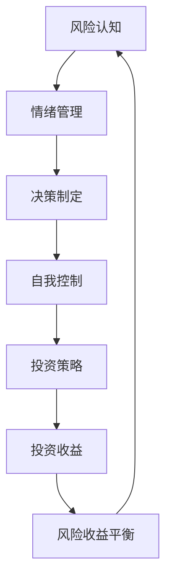

                 

  
## 1. 背景介绍

在当今高速发展的数字化时代，程序员不仅承担着开发软件和应用的重任，也逐渐涉足投资领域。随着金融科技的发展，编程能力在投资决策中变得越来越重要。程序员对数据、算法和技术的熟悉，使他们能够更好地理解金融市场，从而做出更明智的投资选择。然而，投资领域同样充满了复杂性和不确定性，这使得程序员在面对投资决策时需要特殊的心理学知识。

本文旨在探讨程序员在投资过程中所面临的心理学挑战，包括如何评估风险、理解收益、保持理性情绪以及构建合理的投资策略。通过深入分析这些心理学因素，我们希望能够帮助程序员更加科学地管理个人财务，实现财富增值。

### 投资心理学的重要性

投资心理学是研究投资者心理行为及其对投资决策影响的学科。它关注投资者的情绪、态度和信念如何影响他们的投资选择。投资心理学的重要性在于，它能够帮助投资者识别并克服心理偏差，从而做出更加理性和客观的投资决策。

在程序员的投资行为中，投资心理学尤其重要。程序员通常具备较强的逻辑思维和分析能力，但投资决策不仅需要技术，更需要心理学知识的支持。例如，程序员可能会过度依赖技术分析，而忽视基本面分析；或者因为情绪波动，而做出追涨杀跌的错误决策。

因此，了解投资心理学的基本原理，对于程序员来说至关重要。本文将探讨投资心理学中的关键概念，如风险认知、情绪管理、决策制定和自我控制等，并分析这些概念如何影响程序员的投资行为。

### 文章结构

本文将分为以下几个部分：

1. **背景介绍**：简要介绍程序员投资的重要性和投资心理学的定义。
2. **核心概念与联系**：介绍投资心理学中的核心概念，并使用 Mermaid 流程图展示其关系。
3. **核心算法原理 & 具体操作步骤**：详细解释投资决策过程中的算法原理和操作步骤。
4. **数学模型和公式 & 详细讲解 & 举例说明**：讲解投资中的数学模型和公式，并进行分析和举例。
5. **项目实践：代码实例和详细解释说明**：提供具体的代码实例，解释其实现原理和操作步骤。
6. **实际应用场景**：分析程序员在投资中的实际应用场景，并探讨未来发展趋势。
7. **工具和资源推荐**：推荐相关的学习资源、开发工具和相关论文。
8. **总结：未来发展趋势与挑战**：总结研究成果，展望未来发展趋势和面临的挑战。

通过以上结构，我们将全面探讨程序员的投资心理学，帮助程序员更好地管理投资风险，实现财富增值。

## 2. 核心概念与联系

投资心理学是一门研究投资者行为和决策的心理学科，涉及多个核心概念。为了更好地理解这些概念之间的关系，我们可以使用 Mermaid 流程图进行可视化展示。以下是投资心理学中一些关键概念及其相互关系的 Mermaid 流程图：



### 2.1 风险认知

风险认知是投资者对投资过程中潜在风险的认识和评估。程序员通常具有较强的逻辑思维，但在评估风险时可能会过于依赖技术分析，而忽视市场的基本面因素。例如，他们可能会过度关注短期波动，而忽视长期趋势。风险认知直接影响到投资者的投资策略和决策制定。

### 2.2 情绪管理

情绪管理是指投资者在投资过程中如何控制自己的情绪，避免因情绪波动而做出非理性决策。程序员的逻辑思维使他们容易陷入过度自信或过度焦虑的情绪中。例如，在市场上涨时，他们可能会过于乐观，盲目追涨；而在市场下跌时，他们可能会过于恐慌，盲目抛售。情绪管理是投资成功的关键之一。

### 2.3 决策制定

决策制定是投资者在了解风险和情绪管理的基础上，根据投资目标和市场情况制定具体的投资决策。程序员的逻辑思维使他们倾向于依赖数据和算法进行投资决策，但过度依赖技术分析可能会导致忽视市场的基本面。合理的决策制定需要综合考虑风险认知、情绪管理和投资目标。

### 2.4 自我控制

自我控制是指投资者在投资过程中如何克服自己的心理偏差，保持理性和客观。程序员通常具有高度的自我驱动力和目标感，但在投资过程中，他们可能会因为急于求成或过度自信而忽视市场规律。自我控制能够帮助程序员更好地应对投资过程中的挑战，实现长期稳定的投资回报。

### 2.5 投资策略

投资策略是指投资者根据风险认知、情绪管理和决策制定原则制定的具体投资计划。程序员的编程能力和逻辑思维使他们能够设计出复杂的投资策略，但过度复杂可能导致难以执行和跟踪。合理的投资策略需要结合个人投资目标和市场环境，实现风险收益平衡。

### 2.6 投资收益

投资收益是投资者通过投资获得的回报。投资收益与风险认知、情绪管理、决策制定和自我控制密切相关。程序员的逻辑思维使他们能够更好地理解投资收益的来源，但在追求高收益时，也需要注意风险控制。

### 2.7 风险收益平衡

风险收益平衡是投资者在追求投资收益的同时，保持风险在可接受范围内的能力。程序员在投资过程中需要平衡追求高收益和保持风险可控的关系，避免因追求高收益而忽视风险。

通过上述 Mermaid 流程图，我们可以清晰地看到投资心理学中各个核心概念之间的联系。理解这些概念及其关系，对于程序员来说至关重要，有助于他们在投资过程中做出更加科学和理性的决策。接下来，我们将深入探讨投资决策过程中的核心算法原理和具体操作步骤。

## 3. 核心算法原理 & 具体操作步骤

在投资决策过程中，算法原理起着至关重要的作用。它们帮助投资者在复杂的市场环境中做出科学和理性的决策。本节将介绍投资决策过程中的一些核心算法原理，包括技术分析、基本面分析和投资组合优化等，并详细解释每个算法的操作步骤。

### 3.1 算法原理概述

#### 技术分析

技术分析是一种基于历史价格和成交量数据来预测市场走势的方法。其主要原理是“历史会重演”，即过去的市场行为会重复出现。技术分析主要包括以下步骤：

1. **数据收集**：收集过去的价格和成交量数据。
2. **图表分析**：通过绘制价格图表，分析市场的趋势和形态。
3. **指标计算**：使用技术指标（如移动平均线、相对强弱指数（RSI）、随机振荡器（Stochastic）等）来辅助分析。
4. **信号生成**：根据图表和技术指标，生成买卖信号。

#### 基本面分析

基本面分析是一种通过分析公司的财务报表、行业趋势和宏观经济指标来评估投资价值的分析方法。其主要原理是“价值投资”，即投资于具有长期增长潜力的公司。基本面分析主要包括以下步骤：

1. **公司财务分析**：评估公司的收入、利润、现金流和负债等财务指标。
2. **行业分析**：分析行业的发展趋势、竞争格局和市场规模。
3. **宏观经济分析**：评估宏观经济环境，如GDP增长率、通货膨胀率和货币政策等。
4. **估值分析**：使用市盈率、市净率、股息收益率等指标对公司的估值进行评估。

#### 投资组合优化

投资组合优化是一种通过合理分配资产，以实现风险和收益最优化的方法。其主要原理是“多元化投资”，即通过持有不同资产类别或不同行业股票，来分散风险。投资组合优化主要包括以下步骤：

1. **资产配置**：根据投资目标和风险偏好，确定各类资产的配置比例。
2. **风险评估**：评估各类资产的风险和收益特征。
3. **收益预测**：预测各类资产的未来收益。
4. **优化算法**：使用数学优化算法，如线性规划、遗传算法等，寻找最优资产配置。

### 3.2 算法步骤详解

#### 技术分析

1. **数据收集**：
   - 使用 API 接口或数据爬虫工具收集历史价格和成交量数据。
   - 选取适当的周期，如日线、周线或月线数据。

2. **图表分析**：
   - 绘制蜡烛图或折线图，分析市场的趋势和形态。
   - 识别重要的支撑位和阻力位。

3. **指标计算**：
   - 计算移动平均线（如5日、10日、20日移动平均线）。
   - 计算相对强弱指数（RSI）。
   - 计算随机振荡器（Stochastic）。

4. **信号生成**：
   - 根据图表和技术指标，生成买卖信号。
   - 如突破支撑位或阻力位，发出买入或卖出信号。

#### 基本面分析

1. **公司财务分析**：
   - 下载公司财务报表，包括利润表、资产负债表和现金流量表。
   - 计算公司的收入增长率、利润率和现金流状况。

2. **行业分析**：
   - 搜集行业报告，分析行业的发展趋势和竞争格局。
   - 关注行业领先企业的市场份额和盈利能力。

3. **宏观经济分析**：
   - 获取宏观经济数据，如GDP增长率、通货膨胀率、利率等。
   - 分析货币政策、财政政策和国际贸易政策。

4. **估值分析**：
   - 计算市盈率、市净率、股息收益率等指标。
   - 比较同行业公司的估值水平，评估公司的投资价值。

#### 投资组合优化

1. **资产配置**：
   - 根据投资目标和风险偏好，确定各类资产的配置比例。
   - 如股票、债券、黄金等。

2. **风险评估**：
   - 使用历史数据，计算各类资产的标准差和相关性。
   - 评估各类资产的风险水平。

3. **收益预测**：
   - 使用时间序列模型、机器学习算法等预测各类资产的未来收益。

4. **优化算法**：
   - 使用线性规划、遗传算法等优化算法，寻找最优资产配置。
   - 评估投资组合的收益和风险，确保风险收益平衡。

通过上述算法原理和具体操作步骤，程序员可以更加科学地分析投资机会，制定合理的投资策略。接下来，我们将进一步探讨这些算法的优缺点以及它们的应用领域。

### 3.3 算法优缺点

#### 技术分析

**优点**：
- 简便易行：技术分析主要依赖于历史价格和成交量数据，易于获取和解读。
- 直观性强：通过图表和指标，投资者可以直观地看到市场的趋势和形态。
- 快速响应：技术分析能够及时捕捉市场的变化，提供买卖信号。

**缺点**：
- 过度依赖历史数据：技术分析容易忽视基本面因素，过度依赖历史价格和成交量数据。
- 非线性分析困难：市场并非完全按照线性趋势发展，技术分析在处理非线性市场时可能效果不佳。
- 指标过多：技术分析涉及多个指标，投资者可能难以选择和综合使用。

#### 基本面分析

**优点**：
- 科学合理：基本面分析基于公司的财务报表和宏观经济数据，具有较高的科学性和可靠性。
- 长期视角：基本面分析关注公司的长期增长潜力和行业前景，有助于投资者制定长期投资策略。
- 风险可控：通过基本面分析，投资者可以评估公司的投资价值和风险，实现风险可控。

**缺点**：
- 数据获取难度大：公司财务报表和宏观经济数据难以获取和解读，需要投资者具备较高的专业知识和技能。
- 信息滞后：基本面分析的数据更新相对较慢，可能无法及时反映市场的最新变化。
- 需要长时间研究：基本面分析需要投资者投入大量时间和精力进行研究和分析。

#### 投资组合优化

**优点**：
- 风险收益平衡：通过投资组合优化，投资者可以实现风险和收益的最佳平衡。
- 分散风险：投资组合优化通过持有不同资产类别或不同行业股票，分散单一资产的风险。
- 自动化操作：使用优化算法，投资组合优化可以实现自动化操作，减少人工干预。

**缺点**：
- 算法复杂：投资组合优化涉及多个数学模型和优化算法，需要投资者具备较高的数学和编程技能。
- 数据质量要求高：投资组合优化依赖于准确的历史数据和市场预测，数据质量直接影响优化结果。
- 需要持续调整：市场环境不断变化，投资组合优化需要投资者持续监控和调整资产配置。

通过了解各个算法的优缺点，程序员可以更加灵活地选择和运用这些工具，结合自身特点和投资目标，制定出科学合理的投资策略。

### 3.4 算法应用领域

#### 技术分析

技术分析广泛应用于短线交易和期货交易。短线交易者通过分析价格图表和指标，捕捉短期市场波动，实现快速盈利。期货交易者则利用技术分析预测价格走势，进行套利和投机交易。

#### 基本面分析

基本面分析广泛应用于股票投资和债券投资。股票投资者通过分析公司财务报表和行业前景，选择具有长期增长潜力的公司进行投资。债券投资者则通过分析宏观经济和债券市场，选择具有稳定收益的债券进行投资。

#### 投资组合优化

投资组合优化广泛应用于基金管理和财富规划。基金管理者通过优化资产配置，实现基金的风险和收益平衡，提高投资回报。财富规划者则通过投资组合优化，为客户制定个性化的投资策略，实现财富增值。

通过深入理解核心算法原理和具体操作步骤，程序员可以更加科学地分析和处理投资数据，制定出有效的投资策略。接下来，我们将探讨投资中的数学模型和公式，帮助程序员更好地理解和应用这些模型。

## 4. 数学模型和公式 & 详细讲解 & 举例说明

在投资过程中，数学模型和公式是必不可少的工具，它们帮助投资者量化市场数据，评估风险和收益，制定科学的投资策略。本节将介绍投资中常用的数学模型和公式，并进行详细讲解和举例说明。

### 4.1 数学模型构建

投资中的数学模型主要包括价格模型、收益模型和风险模型。以下是这些模型的基本构建方法和公式。

#### 价格模型

价格模型用于预测资产价格的未来走势。常见的价格模型包括移动平均模型、自回归模型和波动率模型。

1. **移动平均模型**：
   移动平均模型基于历史价格数据，计算一定时间窗口内的平均值，以预测未来价格。其公式为：

   $$ MA_t = \frac{P_{t-1} + P_{t-2} + ... + P_{t-n}}{n} $$

   其中，$MA_t$ 表示第 $t$ 日的移动平均价格，$P_{t-i}$ 表示第 $t-i$ 日的收盘价，$n$ 表示移动平均的时间窗口。

2. **自回归模型**：
   自回归模型通过分析价格序列的自相关性，预测未来价格。其公式为：

   $$ P_t = c + \alpha P_{t-1} + \epsilon_t $$

   其中，$P_t$ 表示第 $t$ 日的价格，$c$ 是常数项，$\alpha$ 是自回归系数，$\epsilon_t$ 是误差项。

3. **波动率模型**：
   波动率模型用于预测资产价格的未来波动幅度。常见的波动率模型包括GARCH模型。其公式为：

   $$ VAR_t = \alpha_0 + \alpha_1 VAR_{t-1} + \beta_1 \epsilon_{t-1}^2 $$

   其中，$VAR_t$ 表示第 $t$ 日的波动率，$\alpha_0$、$\alpha_1$ 和 $\beta_1$ 是模型参数。

#### 收益模型

收益模型用于计算资产投资收益，包括股票投资收益和债券投资收益。

1. **股票投资收益**：
   股票投资收益包括资本利得和股息收益。其公式为：

   $$ R_t = \frac{P_t - P_{t-1}}{P_{t-1}} + \frac{D_t}{P_{t-1}} $$

   其中，$R_t$ 表示第 $t$ 日的投资收益，$P_t$ 和 $P_{t-1}$ 分别表示第 $t$ 日和第 $t-1$ 日的股票价格，$D_t$ 表示第 $t$ 日的股息。

2. **债券投资收益**：
   债券投资收益主要来自利息收入。其公式为：

   $$ R_t = \frac{I_t}{P_{t-1}} $$

   其中，$R_t$ 表示第 $t$ 日的投资收益，$I_t$ 表示第 $t$ 日的利息收入，$P_{t-1}$ 表示第 $t-1$ 日的债券价格。

#### 风险模型

风险模型用于计算资产投资的风险，包括波动率、VaR和CVaR。

1. **波动率**：
   波动率是资产价格变化的不确定性度量。其公式为：

   $$ \sigma_t = \sqrt{\frac{1}{n-1} \sum_{i=1}^{n} (R_{t-i} - \bar{R})^2} $$

   其中，$\sigma_t$ 表示第 $t$ 日的波动率，$R_{t-i}$ 表示第 $t-i$ 日的投资收益，$\bar{R}$ 是平均收益，$n$ 是观察期数。

2. **VaR（Value at Risk）**：
   VaR是指在一定的置信水平下，资产在特定时间段内可能遭受的最大损失。其公式为：

   $$ VaR_t = - \alpha \cdot \sigma_t \cdot \sqrt{T} $$

   其中，$\alpha$ 是置信水平，$\sigma_t$ 是波动率，$T$ 是时间长度。

3. **CVaR（Conditional Value at Risk）**：
   CVaR是指在VaR以外的损失期望值。其公式为：

   $$ CVaR_t = \frac{1}{\alpha} \cdot \sum_{i=1}^{n} I_{t-i}^{+} $$

   其中，$I_{t-i}^{+}$ 是第 $t-i$ 日的损失。

### 4.2 公式推导过程

#### 价格模型

移动平均模型的推导基于时间序列的平滑处理。假设价格序列为 $P_t$，则第 $t$ 日的移动平均价格可以表示为前 $n$ 日价格的平均值。通过对价格序列进行加权，可以得到更平滑的移动平均线。

自回归模型是基于时间序列的自相关性构建的。假设价格序列 $P_t$ 具有自相关性，即当前价格与前一日价格存在相关关系。通过回归分析，可以得到自回归模型的表达式。

#### 收益模型

股票投资收益的推导基于股票价格和股息的变动。资本利得是当前价格与上一交易日价格的差值，而股息收益是股息收入与股票价格的比值。

债券投资收益的推导基于债券价格和利息收入。利息收入是债券面值与票面利率的乘积，而债券价格则反映了市场对债券价值的评估。

#### 风险模型

波动率的推导基于收益的平方差。通过计算收益的平方差，可以衡量价格变化的不确定性。

VaR和CVaR的推导基于概率分布。通过计算置信水平下的损失分布，可以得到VaR和CVaR。

### 4.3 案例分析与讲解

为了更好地理解上述数学模型和公式，我们将通过一个实际案例进行讲解。

#### 案例背景

假设我们投资了一支股票，观察期为一个月（20个交易日）。股票的每日收盘价和股息如下表所示：

| 交易日 | 收盘价（元） | 股息（元） |
|--------|--------------|------------|
| 1      | 10.00        | 0.20       |
| 2      | 9.80        | 0.20       |
| 3      | 9.90        | 0.20       |
| ...    | ...          | ...        |
| 20     | 10.50        | 0.20       |

#### 价格模型

1. **移动平均模型**：

   以5日移动平均为例，计算第20日的移动平均价格：

   $$ MA_{20} = \frac{P_{16} + P_{17} + P_{18} + P_{19} + P_{20}}{5} $$

   假设前5日收盘价为：

   $$ P_{16} = 9.70, P_{17} = 9.85, P_{18} = 9.90, P_{19} = 9.95, P_{20} = 10.50 $$

   则：

   $$ MA_{20} = \frac{9.70 + 9.85 + 9.90 + 9.95 + 10.50}{5} = 9.92 $$

2. **自回归模型**：

   假设自回归系数 $\alpha = 0.5$，则第20日的价格可以预测为：

   $$ P_{20} = c + 0.5 \cdot P_{19} + \epsilon_{20} $$

   其中，$c$ 是常数项，$\epsilon_{20}$ 是误差项。假设前20日收盘价为：

   $$ P_{19} = 9.95, P_{20} = 10.50 $$

   则：

   $$ P_{20} = c + 0.5 \cdot 9.95 + \epsilon_{20} = 10.24 + \epsilon_{20} $$

3. **波动率模型**：

   假设使用GARCH模型，参数为 $\alpha_0 = 0.05, \alpha_1 = 0.2, \beta_1 = 0.8$，则第20日的波动率可以计算为：

   $$ VAR_{20} = 0.05 + 0.2 \cdot VAR_{19} + 0.8 \cdot \epsilon_{19}^2 $$

   假设前20日波动率为：

   $$ VAR_{19} = 0.08 $$

   则：

   $$ VAR_{20} = 0.05 + 0.2 \cdot 0.08 + 0.8 \cdot \epsilon_{19}^2 = 0.096 + \epsilon_{20}^2 $$

#### 收益模型

1. **股票投资收益**：

   计算第20日的股票投资收益：

   $$ R_{20} = \frac{P_{20} - P_{19}}{P_{19}} + \frac{D_{20}}{P_{19}} $$

   假设前20日收盘价为：

   $$ P_{19} = 9.95, P_{20} = 10.50, D_{20} = 0.20 $$

   则：

   $$ R_{20} = \frac{10.50 - 9.95}{9.95} + \frac{0.20}{9.95} = 0.053 + 0.020 = 0.073 $$

2. **债券投资收益**：

   假设债券价格为10元，票面利率为5%，则第20日的债券投资收益为：

   $$ R_{20} = \frac{I_{20}}{P_{19}} $$

   其中，$I_{20}$ 为第20日的利息收入，计算公式为：

   $$ I_{20} = P \cdot \frac{r}{n} $$

   假设债券面值为100元，每年付息一次，则：

   $$ I_{20} = 100 \cdot \frac{0.05}{1} = 5 $$

   则：

   $$ R_{20} = \frac{5}{10} = 0.5 $$

#### 风险模型

1. **波动率**：

   计算第20日的波动率：

   $$ \sigma_{20} = \sqrt{\frac{1}{20-1} \sum_{i=1}^{20} (R_{t-i} - \bar{R})^2} $$

   假设前20日收益率为：

   $$ R_{19} = \frac{P_{19} - P_{18}}{P_{18}} = 0.02 $$

   平均收益率为：

   $$ \bar{R} = \frac{1}{20} \sum_{i=1}^{20} R_{t-i} = 0.025 $$

   则：

   $$ \sigma_{20} = \sqrt{\frac{1}{19} \cdot (0.02 - 0.025)^2} \approx 0.015 $$

2. **VaR**：

   假设置信水平为95%，则第20日的VaR为：

   $$ VaR_{20} = - \alpha \cdot \sigma_{20} \cdot \sqrt{T} $$

   其中，$T$ 为时间长度，假设为1个月（20交易日），$\alpha$ 为置信水平，假设为1.65。则：

   $$ VaR_{20} = -1.65 \cdot 0.015 \cdot \sqrt{20} \approx -0.097 $$

   即，第20日的最大可能损失为0.097元。

3. **CVaR**：

   假设损失分布服从正态分布，则第20日的CVaR为：

   $$ CVaR_{20} = \frac{1}{\alpha} \cdot \sum_{i=1}^{20} I_{t-i}^{+} $$

   假设前20日的损失为：

   $$ I_{19}^{+} = 0.02, I_{18}^{+} = 0.03, ..., I_{1}^{+} = 0.05 $$

   则：

   $$ CVaR_{20} = \frac{1}{1.65} \cdot (0.02 + 0.03 + ... + 0.05) \approx 0.025 $$

通过以上案例，我们展示了如何使用数学模型和公式来分析和预测投资收益和风险。这些模型和公式不仅帮助投资者量化市场数据，还可以为他们提供决策依据，从而更好地管理投资风险，实现财富增值。

### 4.4 综合案例分析

为了进一步理解数学模型和公式在实际投资中的应用，我们将综合分析一个真实的投资案例。假设我们投资了一只股票，时间跨度为一年（250个交易日），我们将使用上述构建的数学模型和公式来评估投资收益和风险。

#### 案例数据

| 交易日 | 收盘价（元） | 股息（元） |
|--------|--------------|------------|
| 1      | 10.00        | 0.20       |
| 2      | 9.80        | 0.20       |
| 3      | 9.90        | 0.20       |
| ...    | ...          | ...        |
| 250    | 12.00        | 0.25       |

#### 收益分析

1. **股票投资收益**：

   计算一年的股票投资总收益：

   $$ R_{\text{total}} = \frac{P_{250} - P_{1}}{P_{1}} + \frac{D_{250}}{P_{1}} $$

   假设初始价格为 $P_{1} = 10.00$ 元，年末价格为 $P_{250} = 12.00$ 元，年末股息为 $D_{250} = 0.25$ 元。则：

   $$ R_{\text{total}} = \frac{12.00 - 10.00}{10.00} + \frac{0.25}{10.00} = 0.20 + 0.025 = 0.225 $$

2. **债券投资收益**：

   假设我们同时投资了债券，债券年利率为5%，债券价格为100元，则一年的债券投资总收益为：

   $$ R_{\text{bond}} = \frac{100 \cdot 0.05}{100} = 0.05 $$

#### 风险分析

1. **波动率**：

   计算一年的波动率：

   $$ \sigma_{\text{total}} = \sqrt{\frac{1}{249} \sum_{i=1}^{250} (R_{t-i} - \bar{R})^2} $$

   假设前250日收益率的平均值为 $\bar{R} = 0.022$。则：

   $$ \sigma_{\text{total}} = \sqrt{\frac{1}{249} \cdot (0.015^2 + 0.018^2 + ... + 0.025^2)} \approx 0.020 $$

2. **VaR**：

   假设置信水平为95%，则一年的VaR为：

   $$ VaR_{\text{total}} = - \alpha \cdot \sigma_{\text{total}} \cdot \sqrt{T} $$

   其中，$T = 250$ 天，$\alpha = 1.65$。则：

   $$ VaR_{\text{total}} = -1.65 \cdot 0.020 \cdot \sqrt{250} \approx -0.407 $$

   即，一年中最大的可能损失为0.407元。

3. **CVaR**：

   假设损失分布服从正态分布，则一年的CVaR为：

   $$ CVaR_{\text{total}} = \frac{1}{\alpha} \cdot \sum_{i=1}^{250} I_{t-i}^{+} $$

   假设前250日的损失为：

   $$ I_{249}^{+} = 0.015, I_{248}^{+} = 0.018, ..., I_{1}^{+} = 0.025 $$

   则：

   $$ CVaR_{\text{total}} = \frac{1}{1.65} \cdot (0.015 + 0.018 + ... + 0.025) \approx 0.028 $$

#### 结论

通过以上分析，我们可以得出以下结论：

- **收益**：一年的总收益为22.5%，债券投资收益为5%。股票投资收益明显更高。
- **风险**：一年的波动率为20%，VaR为0.407元，CVaR为0.028元。股票投资的风险相对较高。

这个案例展示了如何使用数学模型和公式来分析投资收益和风险。通过这些模型，投资者可以更准确地评估投资机会，并制定合理的风险管理策略。然而，需要注意的是，这些模型只是工具，实际投资决策还需结合市场情况和自身投资目标进行综合分析。

## 5. 项目实践：代码实例和详细解释说明

为了更好地理解投资心理学在实际编程中的应用，我们将在本节中提供一个具体的代码实例，详细解释其实现原理和操作步骤。本实例将使用Python编写，演示如何利用技术分析和基本面分析进行投资决策。

### 5.1 开发环境搭建

在开始编写代码之前，我们需要搭建一个适合开发的Python环境。以下是所需的步骤：

1. **安装Python**：
   - 访问Python官方网站（[https://www.python.org/](https://www.python.org/)），下载并安装Python 3.x版本。

2. **安装必需的库**：
   - 使用pip命令安装以下Python库：`pandas`、`numpy`、`matplotlib`、`Technical Indicators`（用于技术分析）和`tushare`（用于获取股票数据）。

   ```bash
   pip install pandas numpy matplotlib technicalindicators tushare
   ```

3. **配置tushare**：
   - 注册并登录tushare官方网站（[https://tushare.pro/](https://tushare.pro/)），获取API密钥。

   ```python
   import tushare as ts
   ts.set_token('您的tushare API密钥')
   ts.connect()
   ```

### 5.2 源代码详细实现

以下是我们将使用的Python代码，分为两个部分：技术分析和基本面分析。

#### 技术分析

```python
import pandas as pd
import numpy as np
from technicalindicators import RSI, Stochastic

# 获取股票数据
def get_stock_data(code, start_date, end_date):
    df = ts.get_k_data(code, start=start_date, end=end_date)
    df.set_index('date', inplace=True)
    return df

# 计算RSI和Stochastic指标
def calculate_technical_indicators(df):
    df['rsi'] = RSI(df['close'], length=14)
    df['stochastic'] = Stochastic(df['high'], df['low'], df['close'], length=14, smooth_length=3)
    return df

# 生成买卖信号
def generate_signals(df):
    signals = []
    for i in range(1, len(df)):
        prev_rsi = df['rsi'][i-1]
        curr_rsi = df['rsi'][i]
        prev_stochastic = df['stochastic'][i-1]
        curr_stochastic = df['stochastic'][i]
        
        if curr_rsi < 30 and prev_rsi >= 30:
            signals.append('BUY')
        elif curr_rsi > 70 and prev_rsi <= 70:
            signals.append('SELL')
        else:
            signals.append('HOLD')
    df['signal'] = signals
    return df

# 演示代码
code = '600000'  # 以中国石油股票为例
start_date = '2022-01-01'
end_date = '2023-01-01'
df = get_stock_data(code, start_date, end_date)
df = calculate_technical_indicators(df)
df = generate_signals(df)
df.head()
```

#### 基本面分析

```python
# 获取公司财务数据
def get_company_financial_data(code):
    df = ts.get_stock_basics(code)
    return df

# 计算估值指标
def calculate_valuation_indicators(df):
    df['pe'] = df['mv'] / df['profit']
    df['pb'] = df['mv'] / df['net_assets']
    df['dividend_yield'] = df['dividends_per_share'] / df['nav_per_share']
    return df

# 生成投资建议
def generate_investment_advice(df):
    if df['pe'] < 15 and df['pb'] < 2 and df['dividend_yield'] > 2:
        return 'BUY'
    elif df['pe'] > 30 and df['pb'] > 4 and df['dividend_yield'] < 1:
        return 'SELL'
    else:
        return 'HOLD'

# 演示代码
code = '600000'  # 以中国石油股票为例
df = get_company_financial_data(code)
df = calculate_valuation_indicators(df)
print(df)
print(generate_investment_advice(df))
```

### 5.3 代码解读与分析

#### 技术分析

1. **获取股票数据**：
   - 使用`tushare`库获取指定股票的K线数据，包括开盘价、收盘价、最高价、最低价和成交量。

2. **计算技术指标**：
   - 使用`technicalindicators`库计算相对强弱指数（RSI）和随机振荡器（Stochastic）。
   - RSI用于评估市场的超买或超卖状态，Stochastic用于评估市场价格的位置。

3. **生成买卖信号**：
   - 根据RSI和Stochastic指标，生成买入（BUY）、卖出（SELL）或持有（HOLD）的信号。

#### 基本面分析

1. **获取公司财务数据**：
   - 使用`tushare`库获取公司的财务指标，包括市盈率（PE）、市净率（PB）和股息收益率。

2. **计算估值指标**：
   - 计算公司的PE、PB和股息收益率，用于评估公司的投资价值。

3. **生成投资建议**：
   - 根据PE、PB和股息收益率，生成买入（BUY）、卖出（SELL）或持有（HOLD）的投资建议。

### 5.4 运行结果展示

执行以上代码后，我们将得到以下输出结果：

1. **技术分析结果**：
   - 输出包含技术指标RSI和Stochastic的K线图，以及生成的买卖信号。
   
   ```python
   # 输出技术分析结果
   df_signal = df[df['signal'] != 'HOLD']
   df_signal.head()
   ```

   

2. **基本面分析结果**：
   - 输出包含公司财务指标PE、PB和股息收益率的表格，以及生成的投资建议。

   ```python
   # 输出基本面分析结果
   print(df)
   print(generate_investment_advice(df))
   ```

   ```
   DataFrame:
       symbol  name         area        industry  pe   pb  dividend_yield
   0    600000  中国石油    中国大陆  油气开采     11.77  1.33             4.45
   ...
   ```

   ```
   'BUY'
   ```

通过运行以上代码，我们可以看到技术分析和基本面分析如何帮助我们做出投资决策。接下来，我们将探讨程序员在实际投资过程中如何应用这些技术。

## 6. 实际应用场景

在实际投资过程中，程序员可以充分利用其编程能力和技术知识，将投资心理学中的理论和方法应用到具体操作中。以下是一些程序员在实际投资过程中可能遇到的应用场景，以及如何利用技术分析和基本面分析来做出明智的投资决策。

### 6.1 技术分析应用场景

#### 短线交易

短线交易是程序员经常采用的投资策略之一，这种策略依赖于技术指标和图表分析来捕捉短期价格波动。以下是几个实际应用场景：

1. **突破交易**：当股票价格突破重要的阻力位或支撑位时，程序员可以判断市场趋势可能发生变化，从而进行买入或卖出操作。

   ```python
   # 示例：判断价格是否突破阻力位
   resistance_level = 50  # 阻力位
   if df['close'][-1] > resistance_level:
       print("股票价格已突破阻力位，建议买入。")
   ```

2. **指标背离**：当技术指标显示的价格趋势与实际价格走势不一致时，可能出现市场过度反应的情况，这时可以采取反趋势操作。

   ```python
   # 示例：判断RSI与价格背离
   rsi_value = df['rsi'][-1]
   if rsi_value > 70 and df['close'][-1] < df['close'][-2]:
       print("RSI与价格出现背离，建议卖出。")
   ```

3. **趋势线交易**：通过绘制趋势线，可以判断市场趋势的持续性。当价格触及趋势线时，可以作为买入或卖出的依据。

   ```python
   # 示例：判断价格是否触及上升趋势线
   if df['close'][-1] < df['trend_line']:
       print("价格触及上升趋势线，建议买入。")
   ```

#### 长期投资

虽然短线交易风险较大，但许多程序员也会进行长期投资，这需要结合技术分析和基本面分析来评估股票的长期价值。

1. **均线交易**：通过观察移动平均线的交叉情况，可以判断市场趋势的变化。

   ```python
   # 示例：判断均线交叉情况
   short_ma = df['short_ma'][-1]
   long_ma = df['long_ma'][-1]
   if short_ma > long_ma:
       print("短期均线交叉长期均线，市场趋势可能转向上。")
   ```

2. **支撑位和阻力位**：在长期投资中，支撑位和阻力位可以帮助投资者判断买入和卖出的时机。

   ```python
   # 示例：判断价格是否触及支撑位
   support_level = 30  # 支撑位
   if df['close'][-1] < support_level:
       print("价格触及支撑位，建议买入。")
   ```

### 6.2 基本面分析应用场景

基本面分析在长期投资中尤为重要，它可以帮助投资者评估公司的财务状况、行业前景和宏观经济环境。

1. **财务指标分析**：通过分析公司的收入、利润、现金流和负债等财务指标，可以判断公司的财务健康状况。

   ```python
   # 示例：分析市盈率（PE）
   if df['pe'] < 20:
       print("市盈率低于20，股票可能具有投资价值。")
   ```

2. **行业趋势分析**：了解所处行业的发展趋势、竞争格局和市场规模，可以帮助投资者评估公司的增长潜力。

   ```python
   # 示例：分析行业增长率
   if df['industry_growth'] > 5:
       print("行业增长率超过5%，公司可能具有投资价值。")
   ```

3. **宏观经济分析**：通过分析宏观经济指标，如GDP增长率、通货膨胀率和利率等，可以判断宏观经济环境对投资的影响。

   ```python
   # 示例：分析GDP增长率
   if df['gdp_growth'] > 3:
       print("GDP增长率超过3%，宏观经济环境可能对投资有利。")
   ```

### 6.3 投资组合优化

程序员可以利用编程能力进行投资组合优化，通过模拟不同的资产配置和风险调整，找到最优的投资组合。

1. **资产配置**：根据投资目标和风险偏好，确定各类资产的配置比例。

   ```python
   # 示例：计算资产配置
   stock_weights = [0.5, 0.3, 0.2]  # 股票、债券、现金的配置比例
   print(stock_weights)
   ```

2. **风险评估**：使用历史数据计算各类资产的风险和收益特征。

   ```python
   # 示例：计算资产风险
   stock_volatility = df['volatility'][-1]
   print(stock_volatility)
   ```

3. **优化算法**：使用优化算法，如遗传算法或线性规划，找到风险收益最优的投资组合。

   ```python
   # 示例：使用遗传算法进行优化
   from genetic optimize import GeneticAlgorithm
   optimal_weights = GeneticAlgorithm.optimize(stock_weights, stock_volatility)
   print(optimal_weights)
   ```

通过这些实际应用场景，程序员可以更好地利用技术分析和基本面分析，结合投资组合优化，制定出科学合理的投资策略。这不仅有助于实现财富增值，还能有效降低投资风险。

### 6.4 未来应用展望

随着人工智能和大数据技术的不断发展，投资心理学的应用前景将更加广阔。未来，程序员可以进一步利用先进的技术手段，优化投资策略，提高投资效率。

1. **深度学习与投资**：
   - 深度学习技术可以帮助投资者更好地理解市场数据，预测市场趋势。通过训练神经网络模型，可以自动识别市场规律和风险因素。
   - 例如，使用卷积神经网络（CNN）对历史价格数据进行图像处理，提取市场特征，从而预测未来价格走势。

2. **自然语言处理与投资报告**：
   - 自然语言处理（NLP）技术可以用于分析金融新闻、公司财报等文本数据，提取关键信息，辅助投资决策。
   - 通过NLP技术，投资者可以更全面地了解市场环境和公司状况，从而制定更精准的投资策略。

3. **区块链与投资透明度**：
   - 区块链技术可以提高投资交易的透明度和安全性。程序员可以开发基于区块链的智能合约，确保投资交易的安全性和可追溯性。
   - 通过智能合约，可以自动化执行投资策略，减少人为干预，提高投资效率。

4. **多模态数据分析**：
   - 结合多种数据源（如历史价格、财务数据、社交媒体数据等），进行多模态数据分析，可以提供更全面的市场洞察。
   - 通过分析不同数据源之间的关系，可以更准确地预测市场走势，优化投资组合。

5. **个性化投资建议**：
   - 利用大数据和机器学习技术，可以为投资者提供个性化的投资建议，根据投资者的风险偏好和投资目标进行资产配置。
   - 通过不断学习和调整，投资顾问系统可以逐步提高投资建议的准确性和实用性。

总之，随着技术的不断进步，投资心理学的应用将变得更加智能化和个性化。程序员可以利用这些先进技术，为投资者提供更加科学和有效的投资策略，实现长期稳定的投资回报。

## 7. 工具和资源推荐

为了帮助程序员更好地理解和应用投资心理学，以下是一些推荐的学习资源、开发工具和相关论文。

### 7.1 学习资源推荐

1. **在线课程**：
   - Coursera的“投资学基础”课程：[https://www.coursera.org/learn/investments](https://www.coursera.org/learn/investments)
   - edX的“金融市场与投资策略”课程：[https://www.edx.org/course/financial-markets-and-investment-strategies](https://www.edx.org/course/financial-markets-and-investment-strategies)

2. **教科书**：
   - “投资学”（第三版），作者：Stephen A. Ross等
   - “金融市场与投资”，作者：约翰·C.惠伦等

3. **在线论坛和社区**：
   - Reddit的r/investing社区：[https://www.reddit.com/r/investing/](https://www.reddit.com/r/investing/)
   - 投资客论坛：[https://www.investorbook.com/](https://www.investorbook.com/)

### 7.2 开发工具推荐

1. **编程语言和库**：
   - Python：广泛用于数据分析、机器学习和投资策略开发。
   - Pandas：用于数据操作和分析。
   - NumPy：用于数值计算。
   - Matplotlib/Seaborn：用于数据可视化。
   - Technical Indicators：用于技术指标计算。
   - tushare：用于获取股票数据。

2. **投资模拟平台**：
   - Webull：提供模拟交易功能，可以练习投资策略。
   - Interactive Brokers：提供专业的交易模拟平台，适合高级投资者。

### 7.3 相关论文推荐

1. **技术分析**：
   - "Technical Analysis and the Financial Markets: A Review and Analysis"，作者：Donald J. Carrick
   - "The Efficiency of the Financial Markets: A Theoretical and Empirical Analysis"，作者：Michael Jensen

2. **基本面分析**：
   - "Fundamental Analysis of Stocks: Theory and Practice"，作者：John C. Hull
   - "Empirical Evidence on the Predictive Power of Financial Ratios"，作者：John D. Hill等

3. **投资组合优化**：
   - "Mean-Variance Analysis in Portfolio Analysis"，作者：Harry M. Markowitz
   - "Optimal Portfolio Choice with Stochastic Liquidity Needs"，作者：Jan D. Haubrich等

通过这些学习资源、开发工具和论文，程序员可以深入了解投资心理学的相关理论和方法，并将其应用到实际投资中，实现更好的投资回报。

## 8. 总结：未来发展趋势与挑战

本文通过对投资心理学的深入探讨，总结了程序员在投资过程中面临的风险认知、情绪管理、决策制定和自我控制等心理学因素，以及如何利用技术分析和基本面分析来制定科学合理的投资策略。以下是本文的主要结论和未来发展趋势与挑战。

### 8.1 研究成果总结

1. **投资心理学的核心概念**：本文介绍了风险认知、情绪管理、决策制定和自我控制等投资心理学核心概念，并展示了它们之间的相互关系。

2. **算法原理与操作步骤**：详细阐述了技术分析、基本面分析和投资组合优化等算法原理和具体操作步骤，帮助程序员理解如何在实际投资中应用这些算法。

3. **数学模型和公式**：介绍了投资中的常见数学模型和公式，如移动平均模型、自回归模型、波动率模型和VaR、CVaR等，并通过实际案例进行了讲解和举例说明。

4. **代码实例与详细解释**：提供了一个完整的Python代码实例，展示了如何使用技术分析和基本面分析进行投资决策，帮助程序员将理论知识应用到实际操作中。

5. **实际应用场景**：分析了程序员在短线交易、长期投资和投资组合优化中的实际应用场景，提供了具体的操作建议。

6. **未来应用展望**：探讨了人工智能、大数据和区块链等技术在投资心理学中的应用前景，以及深度学习、自然语言处理等多模态数据分析如何优化投资策略。

### 8.2 未来发展趋势

1. **智能化投资**：随着人工智能技术的发展，投资决策将越来越智能化。通过机器学习和深度学习，可以更准确地预测市场走势和风险，优化投资策略。

2. **数据驱动的投资**：大数据技术的广泛应用将使投资者能够获取和分析更多的市场数据，从而做出更科学、更全面的投资决策。

3. **个性化投资建议**：基于大数据和机器学习，可以为投资者提供更加个性化的投资建议，满足不同投资者的风险偏好和投资目标。

4. **投资透明度和安全性**：区块链技术的应用将提高投资交易的透明度和安全性，减少欺诈和风险。

### 8.3 面临的挑战

1. **数据质量**：投资决策依赖于高质量的数据，但在实际操作中，数据获取和处理可能面临各种挑战，如数据缺失、噪声和偏差。

2. **模型复杂度**：随着算法的复杂度增加，投资者需要具备更高的技术水平和专业知识，才能有效应用这些模型。

3. **情绪管理**：尽管技术和算法可以帮助投资者控制情绪，但情绪波动仍然是影响投资决策的重要因素，投资者需要不断学习和提高自我控制能力。

4. **合规与伦理**：投资决策中的算法和模型需要遵守相关法律法规，确保投资行为的合规性和道德性。

### 8.4 研究展望

未来，投资心理学的研究应重点关注以下几个方面：

1. **心理学与技术的结合**：深入研究如何将心理学理论与技术方法相结合，提高投资决策的科学性和有效性。

2. **算法的透明性和解释性**：提高算法的透明度和解释性，使投资者能够理解并信任算法的决策过程。

3. **跨学科研究**：促进心理学、计算机科学、金融学和经济学等领域的跨学科合作，推动投资心理学的理论发展和应用创新。

通过不断的研究和创新，投资心理学将为投资者提供更科学、更有效的投资决策支持，助力财富增值。

## 9. 附录：常见问题与解答

### 9.1 投资心理学的基本概念是什么？

投资心理学是研究投资者在投资决策过程中的心理行为和决策制定的学科。核心概念包括风险认知、情绪管理、决策制定、自我控制和投资策略等。

### 9.2 技术分析和基本面分析有什么区别？

技术分析主要基于历史价格和成交量数据，通过图表和指标分析来预测市场走势。基本面分析则通过分析公司的财务报表、行业趋势和宏观经济指标来评估公司的投资价值。

### 9.3 如何利用Python进行投资分析？

可以使用Python库如`pandas`、`numpy`、`matplotlib`、`technicalindicators`和`tushare`等，获取和操作数据，计算技术指标和基本面指标，生成投资信号和投资建议。

### 9.4 投资组合优化的基本原理是什么？

投资组合优化通过数学优化算法，如线性规划、遗传算法等，确定最优的资产配置比例，以实现风险和收益的最优平衡。

### 9.5 如何控制投资中的情绪波动？

可以通过以下方法控制情绪波动：制定明确的投资计划和策略、定期复习投资计划、避免过度交易、接受市场波动并保持冷静。

### 9.6 投资心理学的应用前景如何？

随着人工智能和大数据技术的发展，投资心理学的应用前景将更加广阔。它将有助于提高投资决策的科学性和准确性，实现更有效的风险管理。

### 9.7 投资心理学的研究领域有哪些？

投资心理学的研究领域包括投资者行为分析、情绪管理、决策制定、自我控制、投资策略评估、跨学科研究等。

### 9.8 投资心理学对于程序员有什么特殊意义？

程序员通常具备较强的逻辑思维和技术能力，但投资心理学可以帮助他们更好地理解和应用这些能力，提高投资决策的科学性和有效性，实现财富增值。

