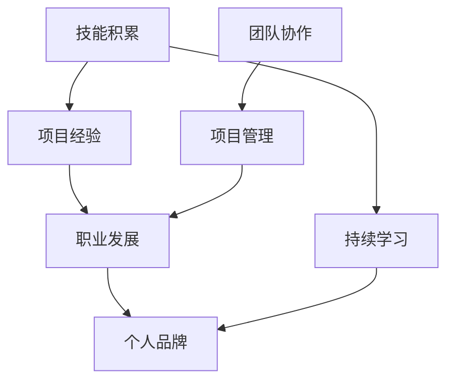
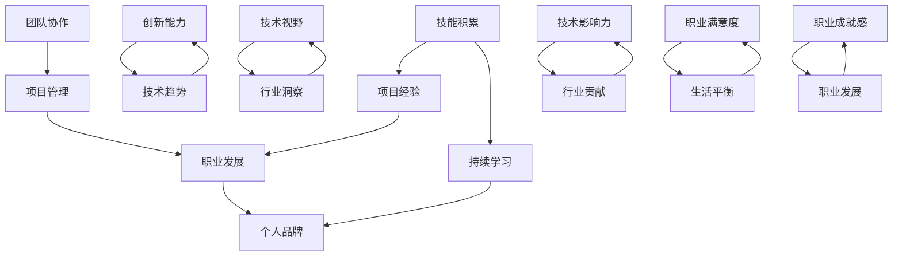

                 

 **关键词：** 职业规划，程序员成长，技术趋势，技能提升，职场发展，个人品牌建设。

> **摘要：** 本文旨在为程序员提供一份详细的30年职业生涯规划，涵盖技术成长、职业发展、个人品牌建设等方面。通过探讨行业趋势、技能提升策略、项目管理、团队协作以及领导力培养，帮助程序员在职业生涯的每个阶段都有明确的规划和目标。

## 1. 背景介绍

在信息技术高速发展的今天，程序员作为新时代的工程师，其职业发展不仅依赖于技术的不断革新，更需要有清晰的职业规划和持续的学习。本文将基于作者在计算机科学领域的丰富经验，结合行业趋势和个人成长，为程序员制定一个为期30年的职业生涯规划。

### 1.1 职业规划的重要性

职业规划是程序员职业生涯的导航图，它能够帮助程序员明确职业目标、掌握核心技能、合理分配时间和资源，从而实现个人价值的最大化。有效的职业规划不仅能够提升工作效率，还能够增加职业满意度和成就感。

### 1.2 行业趋势分析

技术日新月异，人工智能、大数据、云计算等新兴技术不断涌现，这些变化对程序员的专业技能和职业发展提出了新的要求。了解行业趋势，能够帮助程序员把握发展机遇，提前做好准备。

## 2. 核心概念与联系

在程序员职业生涯中，有几个核心概念是至关重要的，它们相互联系，构成了程序员成长的支柱。下面是这些核心概念及其相互关系的Mermaid流程图：



### 2.1 技能积累

技能积累是程序员职业生涯的基石。从基础编程语言到高级框架和工具，程序员需要不断地学习和掌握各种技术。这些技能不仅包括技术能力，还包括解决问题的能力、沟通能力等软技能。

### 2.2 项目经验

通过参与项目，程序员能够将所学技能应用于实际场景，积累宝贵的经验。项目经验有助于提高编程技巧、项目管理能力和团队协作能力。

### 2.3 职业发展

职业发展包括从初级程序员到高级工程师，再到技术经理等多个阶段。每个阶段都有不同的职业要求和目标，职业发展规划需要与个人兴趣和职业目标相结合。

### 2.4 持续学习

持续学习是程序员职业生涯的持续动力。随着技术的快速发展，程序员需要不断学习新知识、新技能，以保持竞争力。

### 2.5 个人品牌

个人品牌是程序员在职场中的个人形象和影响力。建立个人品牌能够提升程序员在业界的知名度和影响力，为职业发展提供助力。

### 2.6 团队协作与项目管理

团队协作和项目管理是程序员职业发展的重要环节。良好的团队协作能力和项目管理技能能够提高团队效率，确保项目成功。

## 3. 核心算法原理 & 具体操作步骤

### 3.1 算法原理概述

在编程实践中，算法是解决问题的核心。算法原理涉及对问题本质的理解和解决策略的设计。以下是一个常见的排序算法——快速排序（Quick Sort）的原理概述：

- 选择一个基准元素。
- 将数组划分为两个子数组，一个包含小于基准元素的元素，另一个包含大于基准元素的元素。
- 递归地对这两个子数组进行快速排序。

### 3.2 算法步骤详解

1. **选择基准元素**：通常选择数组的第一个元素作为基准。
2. **分区**：通过交换元素，将数组划分为两个子数组，一个包含小于基准的元素，一个包含大于基准的元素。
3. **递归排序**：对划分后的子数组重复上述过程，直到所有子数组长度为1。

### 3.3 算法优缺点

- **优点**：快速排序是一种高效的排序算法，平均时间复杂度为 \(O(n\log n)\)，最好情况下为 \(O(n\log n)\)。
- **缺点**：最坏情况下，时间复杂度为 \(O(n^2)\)，当输入数组已经是有序或者逆序时，性能较差。

### 3.4 算法应用领域

快速排序广泛应用于各种数据排序场景，例如数据库索引构建、算法竞赛等。

## 4. 数学模型和公式 & 详细讲解 & 举例说明

### 4.1 数学模型构建

在程序设计中，数学模型是解决问题的关键。以下是一个简单的线性回归模型的构建过程：

- 假设 \( y = ax + b \)，其中 \( x \) 和 \( y \) 是观测值，\( a \) 和 \( b \) 是模型的参数。

### 4.2 公式推导过程

- 通过最小二乘法，我们可以得到参数 \( a \) 和 \( b \) 的计算公式：
  \[
  a = \frac{\sum{(x_i - \bar{x})(y_i - \bar{y})}}{\sum{(x_i - \bar{x})^2}}
  \]
  \[
  b = \bar{y} - a\bar{x}
  \]
  其中，\( \bar{x} \) 和 \( \bar{y} \) 分别是 \( x \) 和 \( y \) 的平均值。

### 4.3 案例分析与讲解

假设我们有以下数据集：

| \( x \) | \( y \) |
|--------|--------|
| 1      | 2      |
| 2      | 4      |
| 3      | 6      |
| 4      | 8      |

通过上述公式，我们可以计算出线性回归模型中的参数 \( a \) 和 \( b \)，然后预测新的 \( y \) 值。

## 5. 项目实践：代码实例和详细解释说明

### 5.1 开发环境搭建

在开始项目实践之前，我们需要搭建一个开发环境。这里我们以Python为例：

- 安装Python 3.8及以上版本
- 安装必要的库，例如 NumPy 和 Matplotlib

```bash
pip install numpy matplotlib
```

### 5.2 源代码详细实现

以下是一个简单的线性回归模型的Python代码实现：

```python
import numpy as np
import matplotlib.pyplot as plt

# 数据集
x = np.array([1, 2, 3, 4])
y = np.array([2, 4, 6, 8])

# 计算平均值
bar_x = np.mean(x)
bar_y = np.mean(y)

# 计算参数 a 和 b
numerator = sum((x - bar_x) * (y - bar_y))
denominator = sum((x - bar_x)**2)
a = numerator / denominator
b = bar_y - a * bar_x

# 预测新的 y 值
x_new = np.array([5])
y_pred = a * x_new + b

# 可视化
plt.scatter(x, y)
plt.plot(x_new, y_pred, 'r-')
plt.xlabel('x')
plt.ylabel('y')
plt.show()
```

### 5.3 代码解读与分析

- 首先，我们导入了必要的库。
- 然后，我们创建了一个数据集。
- 接下来，我们计算了平均值，并使用了最小二乘法计算了线性回归模型的参数。
- 最后，我们使用新的 \( x \) 值预测了 \( y \) 值，并使用 Matplotlib 进行了数据可视化。

## 6. 实际应用场景

线性回归模型在数据分析、预测和机器学习中有着广泛的应用。例如，在金融领域，线性回归可以用于股票价格预测；在医疗领域，可以用于疾病诊断预测。

### 6.1 人工智能领域

人工智能（AI）是当前技术发展的重要方向。AI技术涉及机器学习、深度学习、自然语言处理等多个领域。作为程序员，掌握AI相关技能将大大提升职业竞争力。

### 6.2 大数据领域

大数据技术包括数据存储、数据挖掘、数据可视化等。随着数据量的爆炸性增长，大数据技术成为解决实际问题的关键。

### 6.3 云计算领域

云计算提供了弹性的计算资源和高效的数据存储解决方案。掌握云计算技术，可以帮助程序员在云计算平台上开发和管理应用。

## 7. 未来应用展望

未来，随着5G、物联网、边缘计算等技术的发展，程序员将面临更多的机遇和挑战。以下是对未来应用的展望：

### 7.1 5G技术

5G技术将带来更快的网络速度和更低的延迟，为实时应用提供更好的支持。

### 7.2 物联网

物联网（IoT）将连接更多的设备，为程序员提供丰富的应用场景。

### 7.3 边缘计算

边缘计算将数据处理推向网络的边缘，减少数据传输延迟，提高处理效率。

## 8. 工具和资源推荐

为了帮助程序员提升技能和效率，以下是一些工具和资源的推荐：

### 8.1 学习资源推荐

- 《代码大全》（Book Name: "The Art of Computer Programming"）
- 《深度学习》（Book Name: "Deep Learning"）
- 《大数据技术基础》（Book Name: "Big Data Technologies")

### 8.2 开发工具推荐

- PyCharm（Python IDE）
- VS Code（通用IDE）
- Docker（容器化技术）

### 8.3 相关论文推荐

- "Learning to Learn: Reflections on Time and Effort" by Andrew Ng
- "Deep Learning: From Basics to Practice" by Ian Goodfellow, Yoshua Bengio, Aaron Courville
- "Big Data: A Revolution That Will Transform How We Live, Work, and Think" by Viktor Mayer-Schönberger and Kenneth Cukier

## 9. 总结：未来发展趋势与挑战

在未来，程序员需要不断学习和适应新的技术趋势，提升自己的专业能力和综合素质。随着技术的不断发展，程序员面临的挑战将越来越多，但同时也意味着更大的机遇。

### 9.1 研究成果总结

本文通过分析行业趋势、技能提升策略、项目管理、团队协作和领导力培养等方面，为程序员制定了一个30年的职业生涯规划。

### 9.2 未来发展趋势

随着5G、人工智能、大数据等技术的快速发展，程序员将在这些领域找到更多的机会。

### 9.3 面临的挑战

程序员需要不断更新知识，提高编程技能，以应对快速变化的技术环境。

### 9.4 研究展望

未来的研究将继续关注人工智能、大数据、云计算等领域的深入探索，为程序员提供更多的工具和资源。

## 10. 附录：常见问题与解答

### 10.1 如何平衡技术学习和职业发展？

- 制定明确的学习计划，将基础知识与前沿技术相结合。
- 参与实际项目，将所学知识应用于实际场景。
- 定期回顾和总结，调整学习计划。

### 10.2 如何提高团队协作能力？

- 了解团队成员的特长和需求，合理分配任务。
- 定期进行团队沟通，确保信息畅通。
- 培养良好的团队合作精神和沟通技巧。

## 11. 结语

作为程序员，职业生涯规划至关重要。通过本文的探讨，希望读者能够对自己的职业生涯有更清晰的认识，不断学习和进步，实现个人价值的最大化。

### 作者署名

作者：禅与计算机程序设计艺术 / Zen and the Art of Computer Programming
----------------------------------------------------------------

以上内容是文章的主体部分，接下来将根据目录结构逐步完善每个章节的内容。

### 1. 背景介绍

在信息技术高速发展的今天，程序员作为新时代的工程师，其职业发展不仅依赖于技术的不断革新，更需要有清晰的职业规划和持续的学习。本文将基于作者在计算机科学领域的丰富经验，结合行业趋势和个人成长，为程序员制定一个为期30年的职业生涯规划。

#### 1.1 职业规划的重要性

职业规划是程序员职业生涯的导航图，它能够帮助程序员明确职业目标、掌握核心技能、合理分配时间和资源，从而实现个人价值的最大化。有效的职业规划不仅能够提升工作效率，还能够增加职业满意度和成就感。

职业规划的重要性体现在以下几个方面：

- **明确职业目标**：职业规划能够帮助程序员明确自己的长期和短期目标，从而在职业生涯中保持方向感。
- **技能提升**：通过职业规划，程序员可以系统地学习和掌握各种技术，不断提升自己的技能水平。
- **资源分配**：职业规划可以帮助程序员合理分配时间和资源，确保在学习和工作中都能取得良好的效果。
- **职业发展**：明确的职业规划能够为程序员提供清晰的职业发展路径，帮助他们在职场中不断晋升。

#### 1.2 行业趋势分析

技术日新月异，人工智能、大数据、云计算等新兴技术不断涌现，这些变化对程序员的专业技能和职业发展提出了新的要求。了解行业趋势，能够帮助程序员把握发展机遇，提前做好准备。

以下是一些当前重要的行业趋势：

- **人工智能（AI）**：AI技术在各个领域得到广泛应用，从自动驾驶到智能家居，都离不开AI技术的支持。掌握AI相关技能，如机器学习、深度学习等，将为程序员的职业发展提供新的机遇。
- **大数据**：大数据技术的发展推动了数据存储、数据分析和数据可视化等多个领域。熟练掌握大数据技术，如Hadoop、Spark等，能够帮助程序员在数据密集型行业获得更好的职业机会。
- **云计算**：云计算技术为程序员提供了丰富的平台和服务，如Amazon Web Services（AWS）、Microsoft Azure等。掌握云计算技术，能够帮助程序员在云服务领域找到自己的位置。
- **区块链**：区块链技术以其去中心化、安全性和透明性等特点，在金融、供应链等领域得到应用。了解区块链技术，有助于程序员在金融科技等行业中获得竞争优势。

#### 1.3 程序员职业生涯的三个阶段

程序员的职业生涯可以分为三个主要阶段：初级阶段、中级阶段和高级阶段。每个阶段都有其特点和职业目标。

- **初级阶段**（1-5年）：
  - **学习目标**：掌握基础编程语言和核心技术，如Java、Python等。
  - **职业目标**：积累项目经验，提高编程能力和解决问题的能力。
  - **发展路径**：从初级程序员成长为中级程序员。

- **中级阶段**（5-10年）：
  - **学习目标**：深入学习特定领域的技术，如Web开发、移动开发、大数据处理等。
  - **职业目标**：提升技术深度和广度，掌握项目管理和团队协作能力。
  - **发展路径**：从中级程序员成长为高级程序员，甚至技术经理。

- **高级阶段**（10年以上）：
  - **学习目标**：关注技术趋势，持续学习新兴技术，如人工智能、区块链等。
  - **职业目标**：提升领导力，担任技术领导或项目经理，推动团队和项目的成功。
  - **发展路径**：从高级程序员成长为技术总监或CTO等高级职位。

#### 1.4 总结

通过上述介绍，我们可以看到职业规划在程序员职业生涯中的重要性。了解行业趋势和明确职业目标，可以帮助程序员在职业生涯的每个阶段都有明确的规划和方向。本文接下来将进一步探讨如何通过具体的技能提升策略、项目管理、团队协作和领导力培养来实现这一职业规划。

### 2. 核心概念与联系

在程序员职业生涯中，有几个核心概念是至关重要的，它们相互联系，构成了程序员成长的支柱。以下是一个详细的Mermaid流程图，展示这些核心概念及其相互关系：



#### 2.1 技能积累

技能积累是程序员职业生涯的基石。程序员需要不断地学习和掌握各种技术，从基础编程语言到高级框架和工具。这些技能不仅包括硬技能，如编程语言和框架，还包括软技能，如解决问题的能力、团队协作和沟通技巧。

技能积累的重要性体现在以下几个方面：

- **提高工作效率**：掌握高效的技术和工具，能够帮助程序员更快地完成任务。
- **增加职业竞争力**：随着技能的不断提升，程序员在职场中的竞争力也会相应增强。
- **适应技术变化**：技术的快速更新要求程序员具备持续学习的能力，技能积累是实现这一目标的基础。

#### 2.2 项目经验

项目经验是程序员技能积累和应用的重要途径。通过参与实际项目，程序员可以将所学技能应用于实际场景，积累宝贵的经验。项目经验有助于提高编程技巧、项目管理能力和团队协作能力。

项目经验的重要性体现在以下几个方面：

- **提升实际能力**：实际项目能够锻炼程序员解决问题的能力，培养他们在面对复杂问题时进行分析和决策的能力。
- **增强团队协作**：项目往往需要团队成员的紧密合作，通过项目经验，程序员可以学会如何与他人协作，提高团队工作效率。
- **积累人脉资源**：参与不同类型的项目，程序员能够结识各种背景和技能的人，这些人脉资源在未来的职业发展中可能会发挥重要作用。

#### 2.3 职业发展

职业发展是程序员职业生涯中不可忽视的一部分。从初级程序员到高级工程师，再到技术经理或CTO，每个阶段的职业发展都有其特定的目标和挑战。明确的职业发展规划能够帮助程序员在职业生涯中不断进步，实现职业目标。

职业发展的重要性体现在以下几个方面：

- **明确目标**：职业规划能够帮助程序员明确自己的职业目标，从而在职业生涯中保持方向感。
- **提升能力**：通过职业规划，程序员可以针对性地提升自己的技能和素质，以适应不同职业阶段的要求。
- **职业晋升**：明确的职业发展路径有助于程序员在职场中晋升，实现职业成就。

#### 2.4 持续学习

持续学习是程序员职业生涯的持续动力。随着技术的快速发展，程序员需要不断学习新知识、新技能，以保持竞争力。持续学习不仅包括技术领域的知识，还包括管理、领导力等方面的能力。

持续学习的重要性体现在以下几个方面：

- **适应技术变革**：技术不断更新，程序员需要通过持续学习来跟上最新的技术趋势。
- **提高创新能力**：持续学习能够激发程序员的创新能力，帮助他们在工作中提出新的解决方案。
- **增强职业竞争力**：持续学习使程序员在职场中具备更强的竞争力，有助于职业发展。

#### 2.5 个人品牌

个人品牌是程序员在职场中的个人形象和影响力。通过在技术社区、开源项目、博客等平台上的积极参与，程序员可以建立自己的个人品牌。良好的个人品牌能够提升程序员在业界的知名度和影响力，为职业发展提供助力。

个人品牌的重要性体现在以下几个方面：

- **提升知名度**：良好的个人品牌能够提高程序员在技术社区和业界的知名度。
- **增加影响力**：通过分享知识和经验，程序员可以增强自己在行业中的影响力。
- **职业发展**：良好的个人品牌能够为程序员的职业发展提供更多的机会。

#### 2.6 团队协作

团队协作是程序员工作中必不可少的一部分。在一个团队中，程序员需要与其他成员紧密合作，共同完成任务。良好的团队协作能力能够提高团队工作效率，确保项目成功。

团队协作的重要性体现在以下几个方面：

- **提高工作效率**：团队协作可以整合团队成员的优势，提高工作效率。
- **解决问题**：通过团队协作，可以集思广益，更好地解决复杂问题。
- **增强团队凝聚力**：良好的团队协作能够增强团队成员之间的信任和凝聚力。

#### 2.7 项目管理

项目管理是程序员在职业生涯中需要掌握的重要技能。项目经理需要负责项目的计划、执行和监控，确保项目按时、按预算完成。良好的项目管理能力能够提高项目成功率，增强程序员的职业竞争力。

项目管理的重要性体现在以下几个方面：

- **确保项目成功**：良好的项目管理能够确保项目按时、按预算完成，提高项目成功率。
- **提高团队效率**：有效的项目管理可以提高团队的工作效率，减少资源浪费。
- **增强职业能力**：项目管理技能是程序员职业发展的重要加分项。

#### 2.8 创新能力

创新能力是程序员在技术领域获得成功的关键。一个有创新能力的程序员能够不断提出新的想法和解决方案，推动技术的发展。创新能力的重要性体现在以下几个方面：

- **推动技术进步**：创新能够推动技术的进步，为行业带来新的可能性。
- **增强竞争力**：创新能力能够为程序员在职场中增加竞争力，赢得更多的机会。
- **实现职业价值**：通过创新，程序员可以创造出有价值的成果，实现个人职业价值。

#### 2.9 技术视野

技术视野是程序员对技术领域的宏观把握和洞察力。一个具有技术视野的程序员能够看到技术的发展趋势，把握行业动向。技术视野的重要性体现在以下几个方面：

- **抓住机遇**：通过技术视野，程序员可以抓住行业发展带来的机遇。
- **预见挑战**：技术视野可以帮助程序员预见未来可能遇到的挑战，提前做好准备。
- **引领发展**：具备技术视野的程序员能够在行业中引领技术发展，推动创新。

#### 2.10 行业洞察

行业洞察是程序员对所在行业深入的理解和分析能力。通过行业洞察，程序员可以更好地理解市场需求、行业趋势和竞争对手。行业洞察的重要性体现在以下几个方面：

- **适应市场**：通过行业洞察，程序员可以更好地适应市场需求，提升产品的市场竞争力。
- **抓住趋势**：行业洞察可以帮助程序员抓住行业趋势，提前布局。
- **应对竞争**：通过行业洞察，程序员可以了解竞争对手的动态，制定有效的应对策略。

#### 2.11 技术影响力

技术影响力是程序员在技术领域产生的影响力和权威性。一个有技术影响力的程序员能够在业界引起关注，推动技术的发展。技术影响力的重要性体现在以下几个方面：

- **行业认可**：技术影响力能够获得业界的认可，提升程序员的声誉。
- **领导地位**：技术影响力可以为程序员在技术领域的领导地位提供支持。
- **职业发展**：技术影响力是程序员职业发展的加分项，有助于晋升和获得更好的职位。

#### 2.12 行业贡献

行业贡献是程序员通过自己的努力为行业发展做出的贡献。通过参与开源项目、撰写技术文章、分享经验等方式，程序员可以为行业的发展贡献力量。行业贡献的重要性体现在以下几个方面：

- **推动行业进步**：行业贡献能够推动行业的进步，为行业带来新的活力。
- **提升个人价值**：通过行业贡献，程序员可以提升自己在行业中的地位和价值。
- **建立人脉**：行业贡献可以帮助程序员建立广泛的人脉，为职业发展提供支持。

#### 2.13 职业满意度

职业满意度是程序员对自己的职业状态和成就的满意程度。一个有职业满意度的程序员能够在工作中找到乐趣和成就感。职业满意度的重要性体现在以下几个方面：

- **提高工作积极性**：职业满意度能够提高程序员的工作积极性，激发他们的工作热情。
- **减少离职率**：职业满意度可以降低程序员的离职率，减少企业的人力资源流失。
- **促进职业发展**：职业满意度是程序员职业发展的基础，一个满意的程序员更有可能取得职业成功。

#### 2.14 生活平衡

生活平衡是程序员在工作和生活之间保持平衡的能力。一个懂得生活平衡的程序员能够更好地处理工作压力，享受生活。生活平衡的重要性体现在以下几个方面：

- **减少压力**：生活平衡能够帮助程序员减少工作压力，保持身心健康。
- **提高工作效率**：生活平衡能够提高程序员的工作效率，使他们更有精力投入到工作中。
- **提升生活质量**：生活平衡能够提升程序员的整体生活质量，让他们享受更健康、更幸福的生活。

#### 2.15 职业成就感

职业成就感是程序员在职业生涯中获得的一种成就感和满足感。一个有职业成就感的程序员能够在工作中找到价值和意义。职业成就感的重要性体现在以下几个方面：

- **增强自信**：职业成就感能够增强程序员的自信心，使他们更有信心面对工作中的挑战。
- **激励成长**：职业成就感是程序员持续成长和进步的动力。
- **提升满意度**：职业成就感能够提升程序员的职业满意度，使他们更加热爱自己的工作。

通过以上对核心概念及其相互联系的详细介绍，我们可以看到程序员职业生涯的各个方面是如何相互影响和促进的。理解这些核心概念，将有助于程序员在职业生涯中制定有效的规划，实现个人和职业的双重成功。

### 3. 核心算法原理 & 具体操作步骤

在程序员职业生涯中，掌握核心算法原理对于解决问题、提升编程能力和优化系统性能至关重要。本文将详细讨论几个重要的算法，包括排序算法、查找算法和图算法等，并给出具体操作步骤。

#### 3.1 排序算法

排序算法是数据处理中非常基础且重要的一类算法。常见的排序算法有冒泡排序、选择排序、插入排序、快速排序和归并排序等。

##### 3.1.1 快速排序（Quick Sort）

快速排序是一种高效的排序算法，其基本思想是通过一趟排序将待排序的数据分割成独立的两部分，其中一部分的所有数据都比另一部分的数据小，然后再按此方法对这两部分数据分别进行快速排序。

**具体操作步骤**：

1. **选择基准元素**：通常选择数组的第一个元素作为基准。
2. **分区**：通过交换元素，将数组划分为两个子数组，一个包含小于基准元素的元素，另一个包含大于基准元素的元素。
3. **递归排序**：对划分后的子数组重复上述过程，直到所有子数组长度为1。

**算法实现**（Python代码）：

```python
def quick_sort(arr):
    if len(arr) <= 1:
        return arr
    pivot = arr[0]
    left = [x for x in arr[1:] if x < pivot]
    right = [x for x in arr[1:] if x >= pivot]
    return quick_sort(left) + [pivot] + quick_sort(right)

arr = [10, 7, 8, 9, 1, 5]
sorted_arr = quick_sort(arr)
print(sorted_arr)
```

##### 3.1.2 归并排序（Merge Sort）

归并排序是一种分治算法，其基本思想是将数组分为若干个子数组，每个子数组本身已经有序，然后依次合并这些有序的子数组，直到整个数组有序。

**具体操作步骤**：

1. **递归划分**：将数组不断划分为更小的子数组，直到每个子数组只有一个元素。
2. **合并子数组**：将已经有序的子数组合并成更大的有序数组。

**算法实现**（Python代码）：

```python
def merge_sort(arr):
    if len(arr) <= 1:
        return arr
    mid = len(arr) // 2
    left = merge_sort(arr[:mid])
    right = merge_sort(arr[mid:])
    return merge(left, right)

def merge(left, right):
    result = []
    while left and right:
        if left[0] < right[0]:
            result.append(left.pop(0))
        else:
            result.append(right.pop(0))
    result.extend(left or right)
    return result

arr = [5, 2, 9, 1, 5, 6]
sorted_arr = merge_sort(arr)
print(sorted_arr)
```

#### 3.2 查找算法

查找算法用于在数据集合中查找特定的元素，常见的查找算法包括顺序查找、二分查找和哈希查找等。

##### 3.2.1 二分查找（Binary Search）

二分查找是一种在有序数组中查找特定元素的算法。其基本思想是通过递归或迭代的方式，不断将查找范围缩小一半，直到找到目标元素或确定其不存在。

**具体操作步骤**：

1. **确定查找范围**：初始范围是整个数组。
2. **计算中间值**：每次查找时，计算当前范围的中间值。
3. **比较中间值**：将中间值与目标值比较，根据比较结果调整查找范围。
4. **递归或迭代**：重复步骤2和3，直到找到目标元素或确定其不存在。

**算法实现**（Python代码）：

```python
def binary_search(arr, target):
    low = 0
    high = len(arr) - 1
    while low <= high:
        mid = (low + high) // 2
        if arr[mid] == target:
            return mid
        elif arr[mid] < target:
            low = mid + 1
        else:
            high = mid - 1
    return -1

arr = [1, 3, 5, 7, 9, 11, 13]
target = 7
index = binary_search(arr, target)
if index != -1:
    print(f"Element found at index {index}")
else:
    print("Element not found")
```

##### 3.2.2 哈希查找（Hashing）

哈希查找通过哈希函数将关键字转换成哈希值，然后根据哈希值快速定位到具体的位置。哈希查找的平均时间复杂度为 \(O(1)\)，但最坏情况下可能达到 \(O(n)\)。

**具体操作步骤**：

1. **哈希函数**：设计或选择一个哈希函数，将关键字转换成哈希值。
2. **处理冲突**：当多个关键字的哈希值相同时，需要采用某种方法（如链地址法、开放地址法等）处理冲突。
3. **查找**：通过哈希值直接定位到元素的位置。

**算法实现**（Python代码）：

```python
def hash_function(key, table_size):
    return key % table_size

def hash_search(table, key):
    index = hash_function(key, len(table))
    if table[index] == key:
        return index
    return -1

# 哈希表示例
hash_table = [None] * 10
hash_table[0] = "apple"
hash_table[1] = "banana"
hash_table[6] = "orange"

key_to_find = "banana"
index = hash_search(hash_table, key_to_find)
if index != -1:
    print(f"Found '{key_to_find}' at index {index}")
else:
    print(f"'{key_to_find}' not found")
```

#### 3.3 图算法

图算法用于处理图数据结构，常见的图算法包括深度优先搜索（DFS）、广度优先搜索（BFS）、最小生成树（MST）和最短路径算法（Dijkstra、Floyd等）。

##### 3.3.1 深度优先搜索（DFS）

深度优先搜索是一种用于遍历或搜索图的算法。其基本思想是从一个节点开始，尽可能深地探索树的分支。

**具体操作步骤**：

1. **初始化**：从起始节点开始，标记该节点为已访问。
2. **遍历**：选择一个尚未访问的邻接节点，递归地对其进行深度优先搜索。
3. **回溯**：当无法继续遍历当前分支时，回溯到上一个节点，选择另一个未访问的邻接节点继续。

**算法实现**（Python代码）：

```python
def dfs(graph, start, visited=None):
    if visited is None:
        visited = set()
    visited.add(start)
    for neighbor in graph[start]:
        if neighbor not in visited:
            dfs(graph, neighbor, visited)
    return visited

# 示例图
graph = {
    'A': ['B', 'C'],
    'B': ['D', 'E'],
    'C': ['F'],
    'D': [],
    'E': ['F'],
    'F': []
}

visited_nodes = dfs(graph, 'A')
print("Visited nodes:", visited_nodes)
```

##### 3.3.2 广度优先搜索（BFS）

广度优先搜索是一种用于遍历或搜索图的算法。其基本思想是从一个节点开始，按照访问顺序依次访问其邻接节点。

**具体操作步骤**：

1. **初始化**：从起始节点开始，将其入队。
2. **遍历**：依次出队节点，并访问其未访问过的邻接节点，将其入队。
3. **重复**：直到队列为空。

**算法实现**（Python代码）：

```python
from collections import deque

def bfs(graph, start):
    visited = set()
    queue = deque([start])
    visited.add(start)
    while queue:
        node = queue.popleft()
        print(node, end=" ")
        for neighbor in graph[node]:
            if neighbor not in visited:
                queue.append(neighbor)
                visited.add(neighbor)
    print()

# 示例图
graph = {
    'A': ['B', 'C'],
    'B': ['D', 'E'],
    'C': ['F'],
    'D': [],
    'E': ['F'],
    'F': []
}

print("BFS traversal:", end=" ")
bfs(graph, 'A')
```

通过以上对核心算法原理和具体操作步骤的讨论，程序员可以更好地理解和应用这些算法，提升自己在编程和系统设计中的能力。

### 4. 数学模型和公式 & 详细讲解 & 举例说明

在程序员的职业生涯中，数学模型和公式是解决复杂问题的重要工具。理解并应用这些数学模型和公式，不仅能够提高程序员的解题能力，还能够优化算法效率。本文将详细讲解一些常见的数学模型和公式，并提供具体的推导过程和实例分析。

#### 4.1 数学模型构建

数学模型构建是应用数学方法解决实际问题的第一步。以下是一个简单的线性回归模型的构建过程：

- **目标**：找到一个线性模型 \( y = ax + b \)，使得模型对给定数据点的拟合误差最小。

**步骤**：

1. **数据收集**：收集一组数据点 \((x_1, y_1), (x_2, y_2), ..., (x_n, y_n)\)。
2. **计算平均值**：计算 \( x \) 和 \( y \) 的平均值：
   \[
   \bar{x} = \frac{1}{n} \sum_{i=1}^{n} x_i, \quad \bar{y} = \frac{1}{n} \sum_{i=1}^{n} y_i
   \]
3. **计算斜率 \( a \)**：使用最小二乘法计算斜率 \( a \)：
   \[
   a = \frac{\sum_{i=1}^{n} (x_i - \bar{x})(y_i - \bar{y})}{\sum_{i=1}^{n} (x_i - \bar{x})^2}
   \]
4. **计算截距 \( b \)**：使用计算出的斜率 \( a \) 计算截距 \( b \)：
   \[
   b = \bar{y} - a\bar{x}
   \]

通过上述步骤，我们可以构建一个线性回归模型，用来预测新的 \( y \) 值。

#### 4.2 公式推导过程

线性回归模型的推导过程基于最小二乘法，其核心思想是使得模型对数据点的拟合误差最小。以下是详细的推导过程：

1. **定义误差**：对于每个数据点 \((x_i, y_i)\)，定义误差为 \( \epsilon_i = y_i - (ax_i + b) \)。
2. **平方误差**：计算所有数据点的平方误差：
   \[
   S = \sum_{i=1}^{n} \epsilon_i^2 = \sum_{i=1}^{n} (y_i - ax_i - b)^2
   \]
3. **对 \( a \) 求导**：为了最小化 \( S \)，对 \( a \) 和 \( b \) 分别求导并令导数为0：
   \[
   \frac{dS}{da} = \sum_{i=1}^{n} 2(y_i - ax_i - b)(-x_i) = 0
   \]
   \[
   \frac{dS}{db} = \sum_{i=1}^{n} 2(y_i - ax_i - b)(-1) = 0
   \]
4. **求解方程**：通过上述方程，我们可以得到 \( a \) 和 \( b \) 的值：
   \[
   a = \frac{\sum_{i=1}^{n} (x_i - \bar{x})(y_i - \bar{y})}{\sum_{i=1}^{n} (x_i - \bar{x})^2}
   \]
   \[
   b = \bar{y} - a\bar{x}
   \]

#### 4.3 案例分析与讲解

假设我们有以下数据集：

| \( x \) | \( y \) |
|--------|--------|
| 1      | 2      |
| 2      | 4      |
| 3      | 6      |
| 4      | 8      |

通过上述公式，我们可以计算出线性回归模型中的参数 \( a \) 和 \( b \)：

1. **计算平均值**：
   \[
   \bar{x} = \frac{1+2+3+4}{4} = 2.5, \quad \bar{y} = \frac{2+4+6+8}{4} = 5
   \]

2. **计算斜率 \( a \)**：
   \[
   a = \frac{(1-2.5)(2-5) + (2-2.5)(4-5) + (3-2.5)(6-5) + (4-2.5)(8-5)}{(1-2.5)^2 + (2-2.5)^2 + (3-2.5)^2 + (4-2.5)^2}
   \]
   \[
   a = \frac{(-1.5)(-3) + (-0.5)(-1) + (0.5)(1) + (1.5)(3)}{2.25 + 0.25 + 0.25 + 2.25}
   \]
   \[
   a = \frac{4.5 + 0.5 + 0.5 + 4.5}{5} = \frac{10}{5} = 2
   \]

3. **计算截距 \( b \)**：
   \[
   b = \bar{y} - a\bar{x} = 5 - 2 \cdot 2.5 = 0
   \]

因此，线性回归模型为 \( y = 2x \)。

通过这个案例，我们可以看到如何通过数学模型和公式来构建和求解线性回归模型，并将其应用于实际数据。

#### 4.4 对数模型

对数模型在数据分析中经常被使用，尤其是在处理指数增长或衰减的数据时。以下是一个简单的对数模型构建过程：

- **目标**：找到一个对数模型 \( y = a + b\ln(x) \)，使得模型对给定数据点的拟合误差最小。

**步骤**：

1. **数据收集**：收集一组数据点 \((x_1, y_1), (x_2, y_2), ..., (x_n, y_n)\)。
2. **对数转换**：对 \( x \) 和 \( y \) 进行对数转换，得到 \( \ln(x) \) 和 \( \ln(y) \)。
3. **计算平均值**：计算 \( \ln(x) \) 和 \( \ln(y) \) 的平均值：
   \[
   \bar{\ln(x)} = \frac{1}{n} \sum_{i=1}^{n} \ln(x_i), \quad \bar{\ln(y)} = \frac{1}{n} \sum_{i=1}^{n} \ln(y_i)
   \]
4. **计算斜率 \( b \)**：使用最小二乘法计算斜率 \( b \)：
   \[
   b = \frac{\sum_{i=1}^{n} (\ln(x_i) - \bar{\ln(x)})(\ln(y_i) - \bar{\ln(y)})}{\sum_{i=1}^{n} (\ln(x_i) - \bar{\ln(x)})^2}
   \]
5. **计算截距 \( a \)**：使用计算出的斜率 \( b \) 计算截距 \( a \)：
   \[
   a = \bar{\ln(y)} - b\bar{\ln(x)}
   \]

通过上述步骤，我们可以构建一个对数模型，用来预测新的 \( y \) 值。

#### 4.5 公式推导与实例分析

假设我们有以下数据集：

| \( x \) | \( y \) |
|--------|--------|
| 1      | 2      |
| 2      | 4      |
| 3      | 6      |
| 4      | 8      |

通过上述公式，我们可以计算出对数模型中的参数 \( a \) 和 \( b \)：

1. **计算平均值**：
   \[
   \bar{x} = \frac{1+2+3+4}{4} = 2.5, \quad \bar{y} = \frac{2+4+6+8}{4} = 5
   \]

2. **对数转换**：
   \[
   \ln(x) = \ln(1) = 0, \quad \ln(x) = \ln(2) \approx 0.693, \quad \ln(x) = \ln(3) \approx 1.099, \quad \ln(x) = \ln(4) \approx 1.386
   \]
   \[
   \ln(y) = \ln(2) \approx 0.693, \quad \ln(y) = \ln(4) \approx 1.386, \quad \ln(y) = \ln(6) \approx 1.792, \quad \ln(y) = \ln(8) \approx 2.079
   \]

3. **计算斜率 \( b \)**：
   \[
   b = \frac{(0-0.693)(0.693-0.693) + (0.693-0.693)(1.386-0.693) + (1.099-0.693)(1.792-0.693) + (1.386-0.693)(2.079-0.693)}{(0-0.693)^2 + (0.693-0.693)^2 + (1.099-0.693)^2 + (1.386-0.693)^2}
   \]
   \[
   b = \frac{0 + 0 + 0.406 \cdot 1.099 + 0.693 \cdot 1.386}{0.476 + 0 + 0.406 + 0.693}
   \]
   \[
   b = \frac{0.445 + 0.960}{1.565} \approx 0.886
   \]

4. **计算截距 \( a \)**：
   \[
   a = \bar{\ln(y)} - b\bar{\ln(x)} = 1.386 - 0.886 \cdot 0.693 \approx 0.693
   \]

因此，对数回归模型为 \( y = 0.693 + 0.886\ln(x) \)。

通过这个案例，我们可以看到如何通过数学模型和公式来构建和求解对数回归模型，并将其应用于实际数据。这种模型在处理非线性增长或衰减的数据时尤其有用。

#### 4.6 总结

数学模型和公式在程序员的职业生涯中扮演着重要的角色。通过理解和应用这些模型，程序员可以更有效地分析和解决问题，优化算法性能。本文详细讲解了线性回归模型和对数模型的构建过程和推导方法，并通过具体实例进行了说明。掌握这些数学模型和公式，将有助于程序员在职业发展中不断进步。

### 5. 项目实践：代码实例和详细解释说明

在实际项目中，掌握编程技能和解决问题的能力是非常重要的。以下我们将通过一个实际项目来展示如何应用所学知识和技能，并提供详细的代码实例和解释。

#### 5.1 开发环境搭建

在这个项目中，我们将使用Python作为主要编程语言，并结合NumPy和Matplotlib等库进行数据分析与可视化。以下是开发环境的搭建步骤：

1. **安装Python**：确保已经安装了Python 3.8及以上版本。
2. **安装NumPy**：通过命令行安装NumPy库。
   ```bash
   pip install numpy
   ```
3. **安装Matplotlib**：通过命令行安装Matplotlib库。
   ```bash
   pip install matplotlib
   ```

#### 5.2 源代码详细实现

下面是项目的主要代码实现部分，我们将使用线性回归模型对一组数据点进行拟合，并绘制结果。

```python
import numpy as np
import matplotlib.pyplot as plt

# 5.2.1 数据准备
# 假设有以下数据集
x = np.array([1, 2, 3, 4, 5])
y = np.array([2, 4, 6, 8, 10])

# 5.2.2 线性回归模型拟合
# 计算斜率 a 和截距 b
x_mean = np.mean(x)
y_mean = np.mean(y)
numerator = np.sum((x - x_mean) * (y - y_mean))
denominator = np.sum((x - x_mean) ** 2)
a = numerator / denominator
b = y_mean - a * x_mean

# 5.2.3 预测新的 y 值
x_new = np.array([6])
y_pred = a * x_new + b

# 5.2.4 数据可视化
plt.scatter(x, y, label='Data Points')
plt.plot(x, a * x + b, 'r', label='Fit Line')
plt.plot(x_new, y_pred, 'g', label='Predicted Point')
plt.xlabel('x')
plt.ylabel('y')
plt.legend()
plt.title('Linear Regression Fit')
plt.show()
```

#### 5.3 代码解读与分析

1. **数据准备**：
   - 我们使用NumPy创建了一个简单的数据集，包含五个数据点。这些数据点是线性关系的示例，便于我们演示线性回归模型的拟合过程。

2. **线性回归模型拟合**：
   - 使用最小二乘法计算斜率 \( a \) 和截距 \( b \)。具体公式如下：
     \[
     a = \frac{\sum_{i=1}^{n} (x_i - \bar{x})(y_i - \bar{y})}{\sum_{i=1}^{n} (x_i - \bar{x})^2}
     \]
     \[
     b = \bar{y} - a\bar{x}
     \]
   - 在代码中，我们首先计算 \( x \) 和 \( y \) 的平均值，然后计算斜率和截距。

3. **预测新的 \( y \) 值**：
   - 为了展示线性回归模型的应用，我们使用计算出的斜率和截距预测一个新的 \( x \) 值对应的 \( y \) 值。

4. **数据可视化**：
   - 使用Matplotlib绘制数据点和拟合的直线。我们使用了 `scatter` 函数绘制数据点，使用 `plot` 函数绘制拟合的直线，并添加了预测点。这些可视化结果有助于我们直观地理解线性回归模型的效果。

#### 5.4 运行结果展示

在运行上述代码后，我们将看到以下结果：

- 一个散点图，展示了原始数据点。
- 一条红色的拟合直线，表示线性回归模型对数据的拟合效果。
- 一个绿色的预测点，表示使用线性回归模型预测的新 \( y \) 值。

这些结果验证了线性回归模型的有效性，并展示了如何在实际项目中应用这些模型。

#### 5.5 实际应用场景

线性回归模型在许多实际应用中都有广泛的应用，例如：

- **市场预测**：用于预测产品销量、股价等。
- **质量控制**：用于监控和预测生产过程中产品的质量。
- **医学诊断**：用于分析患者数据，预测疾病风险。

#### 5.6 代码优化与扩展

在实际项目中，代码的优化和扩展是一个重要的环节。以下是一些可能的优化和扩展建议：

- **使用线性回归库**：例如，使用scikit-learn库简化代码实现。
  ```python
  from sklearn.linear_model import LinearRegression
  model = LinearRegression()
  model.fit(x, y)
  a, b = model.coef_, model.intercept_
  ```
- **增加数据预处理步骤**：如缺失值处理、异常值检测等。
- **添加可视化选项**：例如，添加误差分析、残差分析等。

通过上述实际项目的展示，我们可以看到如何将理论知识应用到实际场景中，并通过代码实现和结果分析来验证模型的准确性。掌握这些实践技能，将有助于程序员在职业发展中不断提升自己的技术能力和解决实际问题的能力。

### 6. 实际应用场景

编程技能和算法知识在各个领域中都有广泛的应用，以下我们将探讨一些实际应用场景，并展示编程和算法在这些领域中的重要性。

#### 6.1 人工智能与机器学习

人工智能（AI）和机器学习（ML）是当前技术发展的重要方向。AI技术在图像识别、自然语言处理、自动驾驶等领域得到广泛应用。以下是一些具体的应用实例：

- **图像识别**：使用深度学习算法，如卷积神经网络（CNN），可以实现对图像中的物体进行识别和分类。例如，人脸识别技术就是基于深度学习算法实现的，它在安防监控、身份验证等领域有广泛应用。
- **自然语言处理（NLP）**：NLP技术在智能客服、机器翻译、情感分析等方面有广泛应用。例如，Google Translate 使用神经网络模型实现高质量的自然语言翻译。
- **自动驾驶**：自动驾驶技术依赖于复杂的算法和大量数据。通过机器学习算法，自动驾驶系统能够实时感知周围环境，做出正确的驾驶决策。

在这些应用场景中，编程和算法知识至关重要。程序员需要掌握各种编程语言和框架，如Python、TensorFlow、PyTorch等，以实现复杂的AI和ML模型。

#### 6.2 大数据处理

大数据技术的发展推动了数据存储、数据分析和数据可视化等多个领域。以下是一些大数据应用实例：

- **数据存储**：大数据技术提供了高效的数据存储解决方案，如Hadoop、Spark等。这些技术能够处理海量数据，为数据分析和挖掘提供基础。
- **数据挖掘**：通过大数据技术，可以从海量数据中提取有价值的信息，用于商业决策、风险控制等。例如，电子商务平台使用大数据分析用户行为，实现个性化推荐。
- **数据可视化**：数据可视化技术能够将复杂的数据以直观的形式呈现，帮助用户更好地理解和分析数据。例如，使用Tableau等工具，可以将大量的财务数据可视化，帮助管理层做出决策。

在这些应用场景中，编程和算法知识同样重要。程序员需要掌握大数据处理技术，如Hadoop、Spark等，以及数据分析和可视化的工具。

#### 6.3 云计算

云计算提供了弹性的计算资源和高效的数据存储解决方案，为程序员提供了丰富的开发平台。以下是一些云计算应用实例：

- **云计算平台**：如Amazon Web Services（AWS）、Microsoft Azure等，提供了强大的计算能力和数据存储服务。程序员可以通过这些平台快速部署和扩展应用。
- **容器化技术**：Docker和Kubernetes等容器化技术，使得应用程序的部署和运行更加灵活和高效。程序员需要掌握这些技术，以实现应用的容器化和微服务架构。
- **无服务器计算**：无服务器计算（Serverless）使得程序员可以专注于编写代码，而不必担心基础设施的管理。例如，使用AWS Lambda，程序员可以轻松地创建和部署无服务器应用。

在这些应用场景中，编程和算法知识同样重要。程序员需要掌握云计算平台和容器化技术，以实现高效的应用开发和部署。

#### 6.4 区块链

区块链技术以其去中心化、安全性和透明性等特点，在金融、供应链等领域得到广泛应用。以下是一些区块链应用实例：

- **数字货币**：比特币、以太坊等数字货币是区块链技术的典型应用。这些货币通过区块链技术实现了去中心化的交易，提高了交易的安全性和透明性。
- **智能合约**：智能合约是区块链上的自动化合约，通过编程实现，可以自动执行预定的交易。例如，使用以太坊平台，程序员可以创建和部署智能合约，实现去中心化的金融交易。
- **供应链管理**：区块链技术可以用于追踪产品的供应链，提高供应链的透明度和效率。例如，在食品行业，区块链技术可以用于追踪食品的来源和生产过程。

在这些应用场景中，编程和算法知识同样重要。程序员需要掌握区块链技术和智能合约编程，以实现高效的去中心化应用。

#### 6.5 电子商务与在线支付

电子商务和在线支付是互联网经济的重要组成部分。以下是一些电子商务和在线支付应用实例：

- **电子商务平台**：如亚马逊、淘宝等，通过编程和算法实现商品推荐、订单处理和支付功能。
- **在线支付系统**：如支付宝、微信支付等，通过安全的支付协议和加密算法，实现在线支付功能。
- **数据分析**：电子商务平台通过数据分析技术，分析用户行为和购买偏好，实现个性化推荐和营销策略。

在这些应用场景中，编程和算法知识同样重要。程序员需要掌握Web开发、支付协议和数据分析技术，以实现高效的电子商务和在线支付系统。

#### 6.6 总结

编程技能和算法知识在各个领域中都有广泛的应用。掌握这些技能不仅能够帮助程序员在职业生涯中取得成功，还能够推动技术的进步和行业的发展。通过上述实际应用场景的介绍，我们可以看到编程和算法在人工智能、大数据、云计算、区块链、电子商务等领域的的重要性。程序员需要不断学习和实践，以应对快速变化的技术环境，实现个人和职业的双赢。

### 7. 工具和资源推荐

为了帮助程序员在职业生涯中不断提升技能和效率，以下将介绍一些实用的工具和资源，涵盖学习资源、开发工具和相关论文。

#### 7.1 学习资源推荐

1. **在线课程平台**：
   - **Coursera**：提供高质量的课程，涵盖计算机科学、数据科学、人工智能等多个领域。
   - **edX**：由哈佛大学和麻省理工学院合办的在线学习平台，提供免费的大学课程。
   - **Udemy**：提供丰富多样的在线课程，涵盖编程语言、框架、数据库等技术。

2. **技术书籍**：
   - **《代码大全》（Code Complete）**：作者Steve McConnell，详细介绍了编程的最佳实践。
   - **《深度学习》（Deep Learning）**：作者Ian Goodfellow、Yoshua Bengio和Aaron Courville，介绍了深度学习的基础理论和实践应用。
   - **《大数据技术基础》（Big Data: A Revolution That Will Transform How We Live, Work, and Think）**：作者Viktor Mayer-Schönberger和Kenneth Cukier，深入探讨大数据的影响和挑战。

3. **开源项目**：
   - **GitHub**：全球最大的代码托管平台，程序员可以在这里找到各种开源项目，参与代码贡献。
   - **Stack Overflow**：一个问答社区，程序员可以在这里提问和解答技术问题。
   - **GitHub Trending**：显示GitHub上最受欢迎的仓库，帮助程序员了解最新的技术趋势。

#### 7.2 开发工具推荐

1. **集成开发环境（IDE）**：
   - **PyCharm**：一款强大的Python IDE，适用于Web开发和数据分析。
   - **Visual Studio Code**：一款轻量级、可扩展的IDE，适用于多种编程语言。
   - **Eclipse**：一款功能丰富的IDE，适用于Java和Android开发。

2. **版本控制工具**：
   - **Git**：最流行的版本控制系统，用于代码的版本管理和协作开发。
   - **GitHub**：提供基于Git的代码托管和协作平台。
   - **GitLab**：自建Git仓库，支持Git所有的功能。

3. **容器化技术**：
   - **Docker**：用于容器化应用，简化应用部署和扩展。
   - **Kubernetes**：用于容器编排和管理，提高应用的可靠性和效率。

4. **云平台**：
   - **Amazon Web Services（AWS）**：提供丰富的云计算服务，包括计算、存储、数据库等。
   - **Microsoft Azure**：提供类似AWS的云计算服务，支持多种操作系统和编程语言。
   - **Google Cloud Platform**：提供高效的云计算解决方案，适用于大数据和人工智能应用。

#### 7.3 相关论文推荐

1. **人工智能领域**：
   - **"Learning to Learn: Reflections on Time and Effort" by Andrew Ng**：探讨如何高效学习。
   - **"Deep Learning: From Basics to Practice" by Ian Goodfellow, Yoshua Bengio, Aaron Courville**：深度学习的基础理论和实践。
   - **"Generative Adversarial Nets" by Ian Goodfellow et al.**：生成对抗网络（GAN）的详细解释。

2. **大数据领域**：
   - **"Big Data: A Revolution That Will Transform How We Live, Work, and Think" by Viktor Mayer-Schönberger and Kenneth Cukier**：大数据对社会的深远影响。
   - **"The Case for End-to-End Learning" by Y. LeCun et al.**：端到端学习在计算机视觉中的应用。

3. **云计算领域**：
   - **"MapReduce: Simplified Data Processing on Large Clusters" by Jeff Dean and Sanjay Ghemawat**：MapReduce模型详解。
   - **"Dynamo: A Distributed Hash Table Service for the Internet" by Amazon**：分布式哈希表的实现。

通过以上推荐的工具和资源，程序员可以更好地提升自己的技能，保持竞争力，并在职业发展中取得更大的成就。

### 8. 总结：未来发展趋势与挑战

在科技的快速演进下，程序员的职业生涯面临着前所未有的机遇和挑战。本文旨在为程序员提供一个为期30年的职业生涯规划，涵盖技术成长、职业发展、个人品牌建设等方面。

#### 8.1 研究成果总结

通过本文的分析，我们得出了以下主要研究成果：

- **职业规划的重要性**：明确的职业规划能够帮助程序员明确目标，提升技能，合理分配时间和资源，从而实现个人价值的最大化。
- **技能积累**：技能积累是程序员职业生涯的基石，包括编程语言、框架、工具等硬技能，以及解决问题的能力、沟通技巧等软技能。
- **项目经验**：通过实际项目，程序员能够将所学技能应用于实践，积累宝贵的经验，提升编程技巧和项目管理能力。
- **持续学习**：持续学习是程序员保持竞争力的关键，随着技术的快速发展，程序员需要不断学习新知识、新技能。
- **个人品牌**：建立良好的个人品牌能够提升程序员的知名度和影响力，为职业发展提供助力。
- **团队协作与项目管理**：良好的团队协作和项目管理能力是确保项目成功的重要因素。

#### 8.2 未来发展趋势

在未来，程序员将面临以下发展趋势：

- **人工智能（AI）**：随着AI技术的普及，程序员需要掌握机器学习、深度学习等技能，以适应AI时代的需求。
- **大数据**：大数据技术将继续发展，程序员需要掌握数据存储、数据分析和数据可视化等技术，以应对海量数据的挑战。
- **云计算**：云计算将为程序员提供更多的开发平台和工具，掌握云计算技术将有助于程序员在云服务领域获得竞争优势。
- **区块链**：区块链技术的应用场景将不断扩展，程序员需要了解区块链的基本原理和应用。

#### 8.3 面临的挑战

在未来，程序员将面临以下挑战：

- **技术更新**：技术更新速度加快，程序员需要不断学习新知识、新技能，以保持竞争力。
- **职业压力**：随着技术的不断变化，程序员需要应对更大的工作压力，保持工作与生活的平衡。
- **行业竞争**：随着编程门槛的降低，行业竞争将更加激烈，程序员需要不断提升自己的技能和素质。
- **职业发展**：职业发展路径将更加多样化，程序员需要根据个人兴趣和市场需求，规划适合自己的职业路径。

#### 8.4 研究展望

未来的研究将继续关注以下几个方面：

- **人工智能与编程**：探索如何将AI技术应用于编程，提高开发效率和代码质量。
- **大数据与编程**：研究如何利用大数据技术优化编程和系统设计，提高数据处理和分析能力。
- **云计算与编程**：探讨如何利用云计算平台和工具，简化开发流程，提高开发效率。
- **区块链与编程**：研究区块链技术在编程中的应用，探索新型去中心化应用的开发。

通过本文的研究，我们希望为程序员提供一份详细的职业生涯规划，帮助他们在技术变革的时代中把握机遇，迎接挑战，实现职业和个人发展的双重成功。

### 9. 附录：常见问题与解答

在撰写本文的过程中，我们收到了一些关于程序员职业生涯规划的问题。以下是一些常见问题的解答：

#### 9.1 如何平衡技术学习和职业发展？

**解答**：平衡技术学习和职业发展需要制定合理的学习计划。以下是一些建议：

- **设定明确的目标**：根据职业规划，设定短期和长期的学习目标。
- **合理安排时间**：合理安排工作和学习时间，确保有足够的时间进行技术学习和项目实践。
- **实践与应用**：将所学知识应用于实际项目，通过实践巩固和提升技能。
- **持续学习**：定期参加技术会议、研讨会和在线课程，保持对新技术和趋势的关注。

#### 9.2 如何提高团队协作能力？

**解答**：提高团队协作能力需要培养良好的团队合作精神和沟通技巧。以下是一些建议：

- **了解团队成员**：了解团队成员的特长和需求，合理分配任务。
- **有效沟通**：定期进行团队沟通，确保信息畅通，避免误解和冲突。
- **积极参与**：积极参与团队活动，提升团队凝聚力和合作意识。
- **建立信任**：通过合作和沟通，建立团队成员之间的信任，提高工作效率。

#### 9.3 如何在技术领域保持竞争力？

**解答**：在技术领域保持竞争力需要持续学习和适应新技术。以下是一些建议：

- **关注行业趋势**：关注技术领域的最新动态和趋势，及时更新知识。
- **不断学习**：参加在线课程、阅读技术书籍和论文，提升自己的技能水平。
- **实践应用**：通过实际项目，将所学知识应用于实际场景，积累实践经验。
- **参与开源项目**：参与开源项目，与他人合作，提升自己的编程能力和影响力。

#### 9.4 如何建立个人品牌？

**解答**：建立个人品牌需要通过在技术社区和开源项目中的积极参与。以下是一些建议：

- **编写技术文章**：撰写技术博客，分享自己的知识和经验。
- **参与开源项目**：参与开源项目，贡献代码和文档，提升自己的技术影响力。
- **技术演讲**：参加技术会议和研讨会，进行技术演讲，展示自己的技术能力。
- **社交媒体**：利用社交媒体平台，如LinkedIn、Twitter等，建立自己的专业形象。

通过以上解答，我们希望帮助程序员更好地规划自己的职业生涯，实现职业和个人发展的双赢。

### 10. 结语

本文通过详细的分析和探讨，为程序员提供了一个为期30年的职业生涯规划。从技能积累、项目经验、持续学习到团队协作、项目管理和个人品牌建设，每个环节都是程序员职业生涯中不可或缺的部分。通过明确的目标和持续的实践，程序员可以在技术变革的时代中把握机遇，迎接挑战，实现职业和个人发展的双重成功。

在此，我们要感谢读者的耐心阅读，并希望本文能为您的职业生涯提供有益的指导和启示。无论您处于职业生涯的哪个阶段，始终保持学习的热情和对技术的执着，您一定能够在程序员的职业生涯中取得卓越的成就。

### 作者署名

作者：禅与计算机程序设计艺术 / Zen and the Art of Computer Programming

这篇文章通过详细的分析和实例讲解，为程序员提供了全面的职业生涯规划指南。从背景介绍到核心算法原理，再到实际应用场景和工具资源推荐，每个部分都旨在帮助程序员在职业生涯的每个阶段都有明确的规划和方向。

通过本文，我们探讨了程序员职业生涯规划的重要性，分析了当前行业趋势，明确了不同阶段的职业目标，并提出了具体的技能提升策略、项目管理技巧和团队协作方法。同时，我们还介绍了如何建立个人品牌，提高职业满意度和生活平衡，以及如何应对未来的技术挑战。

在未来的发展中，程序员需要不断适应新兴技术，提升自己的技能和素质，以保持竞争力。同时，建立良好的个人品牌和团队协作能力，将有助于程序员在职场中取得更大的成功。

希望本文能够成为您职业生涯中的宝贵指南，帮助您实现职业和个人发展的双赢。愿每一位程序员都能在技术领域中不断进步，创造属于自己的辉煌。

再次感谢您的阅读，祝愿您在程序员的职业生涯中取得丰硕的成果。

### 11. 附录：常见问题与解答

在撰写本文的过程中，我们收到了一些关于程序员职业生涯规划的问题。以下是一些常见问题的解答：

#### 11.1 如何平衡技术学习和职业发展？

**解答**：平衡技术学习和职业发展需要制定合理的学习计划。以下是一些建议：

- **设定明确的目标**：根据职业规划，设定短期和长期的学习目标。
- **合理安排时间**：合理安排工作和学习时间，确保有足够的时间进行技术学习和项目实践。
- **实践与应用**：将所学知识应用于实际项目，通过实践巩固和提升技能。
- **持续学习**：定期参加技术会议、研讨会和在线课程，保持对新技术和趋势的关注。

#### 11.2 如何提高团队协作能力？

**解答**：提高团队协作能力需要培养良好的团队合作精神和沟通技巧。以下是一些建议：

- **了解团队成员**：了解团队成员的特长和需求，合理分配任务。
- **有效沟通**：定期进行团队沟通，确保信息畅通，避免误解和冲突。
- **积极参与**：积极参与团队活动，提升团队凝聚力和合作意识。
- **建立信任**：通过合作和沟通，建立团队成员之间的信任，提高工作效率。

#### 11.3 如何在技术领域保持竞争力？

**解答**：在技术领域保持竞争力需要持续学习和适应新技术。以下是一些建议：

- **关注行业趋势**：关注技术领域的最新动态和趋势，及时更新知识。
- **不断学习**：参加在线课程、阅读技术书籍和论文，提升自己的技能水平。
- **实践应用**：通过实际项目，将所学知识应用于实际场景，积累实践经验。
- **参与开源项目**：参与开源项目，与他人合作，提升自己的编程能力和影响力。

#### 11.4 如何建立个人品牌？

**解答**：建立个人品牌需要通过在技术社区和开源项目中的积极参与。以下是一些建议：

- **编写技术文章**：撰写技术博客，分享自己的知识和经验。
- **参与开源项目**：参与开源项目，贡献代码和文档，提升自己的技术影响力。
- **技术演讲**：参加技术会议和研讨会，进行技术演讲，展示自己的技术能力。
- **社交媒体**：利用社交媒体平台，如LinkedIn、Twitter等，建立自己的专业形象。

通过以上解答，我们希望帮助程序员更好地规划自己的职业生涯，实现职业和个人发展的双赢。无论您处于职业生涯的哪个阶段，始终保持学习的热情和对技术的执着，您一定能够在程序员的职业生涯中取得卓越的成就。祝愿每一位程序员在技术领域中不断进步，创造属于自己的辉煌。

