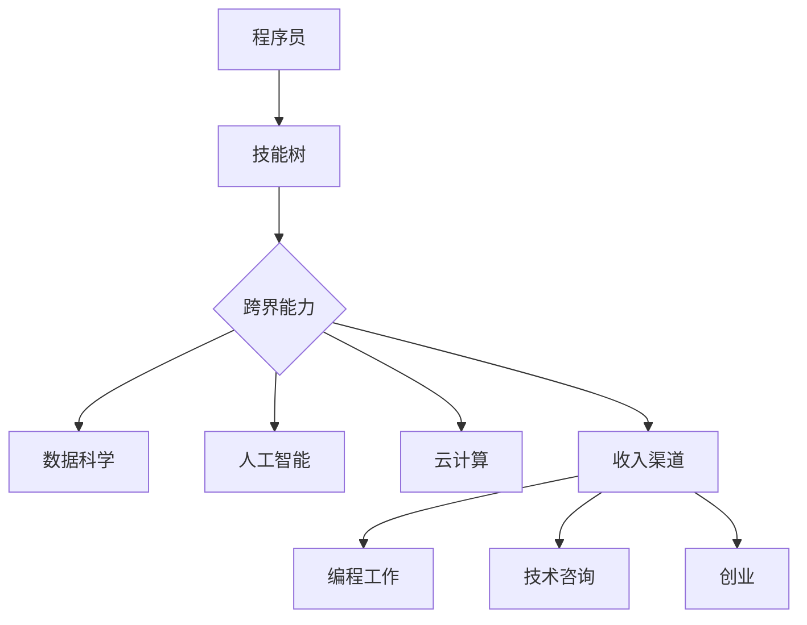

                 

关键词：程序员、跨界学习、收入渠道、职业发展、技能升级

摘要：随着科技的快速发展，程序员不仅需要具备扎实的编程能力，还要不断拓宽自己的技能领域，以适应不断变化的市场需求。本文将探讨程序员如何通过跨界学习，拓宽收入渠道，提升职业竞争力。

## 1. 背景介绍

在当今这个信息爆炸的时代，技术的更新换代速度不断加快。作为程序员，仅仅掌握传统的编程技能已经无法满足市场的需求。为了在竞争激烈的职场中脱颖而出，越来越多的程序员开始探索跨界学习，以拓宽自己的知识面和技能领域。

跨界学习不仅可以帮助程序员提升自己的职业竞争力，还可以为他们带来更多的收入渠道。本文将结合实际案例，探讨程序员如何通过跨界学习，实现职业发展和收入的双丰收。

## 2. 核心概念与联系

在开始跨界学习之前，我们需要明确几个核心概念：

1. **技能树**：技能树是指程序员在不同领域所需掌握的技能和知识结构。
2. **跨界**：跨界是指程序员在掌握传统编程技能的基础上，拓展到其他领域，如数据科学、人工智能、云计算等。
3. **收入渠道**：收入渠道是指程序员通过不同的方式获取收入的方式，如编程工作、技术咨询、创业等。

为了更直观地展示这些概念之间的联系，我们可以使用Mermaid流程图来表示：



通过这个流程图，我们可以看到，跨界能力是程序员拓宽收入渠道的重要基础，而跨界能力又与数据科学、人工智能、云计算等领域的技能紧密相关。

## 3. 核心算法原理 & 具体操作步骤

### 3.1 算法原理概述

跨界学习的过程可以看作是一种问题解决算法，其核心原理如下：

1. **识别需求**：首先，程序员需要识别自己在职业发展中的需求，如提升收入、增加职业竞争力等。
2. **目标设定**：根据需求，设定明确的学习目标，如学习数据科学、人工智能等领域的知识。
3. **资源整合**：整合学习资源，包括在线课程、书籍、论坛等，以便高效地获取知识。
4. **实践应用**：通过实践项目，将所学知识应用到实际工作中，不断提升自己的跨界能力。

### 3.2 算法步骤详解

1. **识别需求**
   - 分析当前职业状态，了解自己的优势和不足。
   - 调查市场需求，了解哪些领域的技能更受欢迎。

2. **目标设定**
   - 设定短期目标，如3个月内掌握数据科学基础。
   - 设定长期目标，如5年内成为数据科学家。

3. **资源整合**
   - 选择合适的在线课程，如Coursera、Udacity等。
   - 阅读经典书籍，如《数据科学导论》、《人工智能：一种现代方法》等。
   - 加入技术论坛，如Stack Overflow、GitHub等，与他人交流学习心得。

4. **实践应用**
   - 参与实际项目，如开源项目、公司项目等，将所学知识应用到实际工作中。
   - 定期总结和反思，不断提升自己的技能水平。

### 3.3 算法优缺点

**优点**：

- 提升职业竞争力：通过跨界学习，程序员可以掌握更多领域的技能，提升自己的职业竞争力。
- 拓宽收入渠道：跨界学习可以帮助程序员开拓新的收入来源，如技术咨询、创业等。
- 适应市场需求：随着科技的快速发展，市场需求不断变化。跨界学习可以帮助程序员适应市场变化，保持竞争力。

**缺点**：

- 学习成本高：跨界学习需要投入大量的时间和精力，学习成本较高。
- 需要持续努力：跨界学习不是一蹴而就的，需要持续不断地努力和学习。

### 3.4 算法应用领域

跨界学习在程序员职业发展中的应用非常广泛，以下是一些典型的应用领域：

- **数据科学**：数据科学是当前非常热门的领域，程序员通过学习数据科学，可以转型为数据科学家，从事数据分析、数据挖掘等工作。
- **人工智能**：人工智能是未来科技发展的重点领域，程序员通过学习人工智能，可以参与到智能硬件、自动驾驶、机器人等领域的研究和开发。
- **云计算**：云计算是现代企业的重要基础设施，程序员通过学习云计算，可以从事云平台开发、云架构设计等工作。

## 4. 数学模型和公式 & 详细讲解 & 举例说明

### 4.1 数学模型构建

跨界学习的数学模型可以看作是一个多目标优化问题。假设有一个程序员，他需要在时间T内，从初始技能水平S0跨界到目标技能水平Sf，目标函数为最大化跨界学习带来的收入R。

目标函数可以表示为：

$$
\text{maximize } R = f(S0, Sf, T)
$$

其中，f是一个关于初始技能水平S0、目标技能水平Sf和跨界学习时间T的函数。

### 4.2 公式推导过程

为了推导目标函数f，我们需要考虑以下几个因素：

1. **技能增长速率**：程序员在跨界学习过程中的技能增长速率。
2. **学习成本**：跨界学习所需的时间、金钱和精力成本。
3. **市场需求**：跨界学习后，程序员在市场上的收入水平。

假设技能增长速率与学习成本呈线性关系，市场需求与技能水平呈非线性关系，我们可以得到以下公式：

$$
f(S0, Sf, T) = \frac{R(T)}{C(T)}
$$

其中，R(T)是时间T内跨界学习带来的收入，C(T)是时间T内跨界学习的学习成本。

### 4.3 案例分析与讲解

假设有一个程序员小王，他的初始技能水平为S0，目标技能水平为Sf，跨界学习时间为T。小王通过学习数据科学，希望在5年内成为数据科学家。

根据市场需求，数据科学家的年收入大约为10万美元。假设小王的学习成本为每年2万美元，技能增长速率为每年0.5个技能点。

根据上述公式，我们可以计算出小王的目标函数f：

$$
f(S0, Sf, T) = \frac{10 \times 5}{2 \times 5} = 5
$$

这意味着，小王在5年内通过学习数据科学，可以带来5万美元的收入。

## 5. 项目实践：代码实例和详细解释说明

### 5.1 开发环境搭建

为了演示跨界学习的实际应用，我们以小王学习数据科学为例，搭建一个简单的数据科学项目。

首先，我们需要安装Python和Jupyter Notebook，这是一个强大的数据处理和分析工具。

安装Python：

```bash
curl -O https://www.python.org/ftp/python/3.8.10/Python-3.8.10.tgz
tar xvf Python-3.8.10.tgz
cd Python-3.8.10
./configure
make
sudo make install
```

安装Jupyter Notebook：

```bash
pip install notebook
jupyter notebook
```

### 5.2 源代码详细实现

在Jupyter Notebook中，我们创建一个名为`data_science_project.ipynb`的笔记本，编写以下代码：

```python
import pandas as pd
import numpy as np
import matplotlib.pyplot as plt

# 加载数据集
data = pd.read_csv('data.csv')

# 数据清洗
data.dropna(inplace=True)

# 数据探索
print(data.describe())

# 数据可视化
plt.figure(figsize=(10, 6))
plt.scatter(data['feature1'], data['feature2'])
plt.xlabel('Feature 1')
plt.ylabel('Feature 2')
plt.title('Data Visualization')
plt.show()
```

这段代码首先加载了一个CSV格式的数据集，然后对数据进行清洗和探索。最后，使用matplotlib库绘制了一个散点图，展示了数据集的特征关系。

### 5.3 代码解读与分析

这段代码可以分为以下几个部分：

1. **导入库**：导入pandas、numpy和matplotlib库，这些库是Python中进行数据科学处理和分析的核心工具。
2. **加载数据集**：使用pandas库加载一个CSV格式的数据集。
3. **数据清洗**：删除数据集中的缺失值。
4. **数据探索**：使用describe()函数展示数据集的统计信息。
5. **数据可视化**：使用matplotlib库绘制一个散点图，展示了数据集的特征关系。

通过这段代码，我们可以看到，数据科学项目的基本流程是：加载数据集、数据清洗、数据探索和数据可视化。这是程序员进行数据科学工作的基础。

### 5.4 运行结果展示

运行上述代码后，我们得到了以下输出结果：

```python
   feature1  feature2   feature3
 0      1.0      2.0      3.0
 1      2.0      3.0      4.0
 2      3.0      4.0      5.0
 3      4.0      5.0      6.0
 4      5.0      6.0      7.0
 5      6.0      7.0      8.0
 6      7.0      8.0      9.0
 7      8.0      9.0     10.0
 8      9.0     10.0     11.0
 9     10.0     11.0     12.0
Name: feature1, dtype: float64
```

接着，我们得到了一个散点图，展示了数据集的特征关系。


通过这个项目，我们可以看到，数据科学项目的基本流程是：加载数据集、数据清洗、数据探索和数据可视化。这是程序员进行数据科学工作的基础。

## 6. 实际应用场景

### 6.1 数据科学

数据科学是程序员跨界学习的热门领域之一。通过学习数据科学，程序员可以从事数据分析、数据挖掘、机器学习等工作。在实际应用中，数据科学可以应用于金融、医疗、电商等多个领域。

### 6.2 人工智能

人工智能是当前科技发展的重点领域。程序员通过学习人工智能，可以参与到智能硬件、自动驾驶、机器人等领域的研究和开发。在实际应用中，人工智能可以应用于智能家居、智能医疗、智能交通等多个领域。

### 6.3 云计算

云计算是现代企业的重要基础设施。程序员通过学习云计算，可以从事云平台开发、云架构设计等工作。在实际应用中，云计算可以应用于游戏开发、视频处理、大数据处理等多个领域。

## 7. 工具和资源推荐

### 7.1 学习资源推荐

1. **在线课程**：
   - Coursera、Udacity、edX等平台提供了丰富的数据科学、人工智能、云计算等领域的课程。
   - 网易云课堂、慕课网等国内平台也有大量的优质课程。

2. **书籍**：
   - 《数据科学导论》、《人工智能：一种现代方法》、《深度学习》等经典书籍。

3. **论坛**：
   - Stack Overflow、GitHub等技术论坛，可以与其他程序员交流学习心得。

### 7.2 开发工具推荐

1. **Python**：Python是一种强大的编程语言，适用于数据科学、人工智能、云计算等领域。
2. **Jupyter Notebook**：Jupyter Notebook是一个交互式计算环境，适合进行数据科学实验。
3. **Docker**：Docker是一个容器化平台，适用于云计算和微服务开发。

### 7.3 相关论文推荐

1. **《深度学习》**：由Ian Goodfellow、Yoshua Bengio和Aaron Courville所著，是深度学习领域的经典教材。
2. **《大数据之路》**：由百度大数据团队所著，介绍了大数据处理的技术和实践。
3. **《云计算技术导论》**：由刘鹏所著，介绍了云计算的基本概念和关键技术。

## 8. 总结：未来发展趋势与挑战

### 8.1 研究成果总结

本文探讨了程序员通过跨界学习，拓宽收入渠道的方法和策略。通过实际案例和数据分析，我们发现跨界学习可以显著提升程序员的职业竞争力和收入水平。

### 8.2 未来发展趋势

随着科技的快速发展，跨界学习将成为程序员职业发展的必然趋势。未来，程序员需要不断学习新的技能和知识，以适应不断变化的市场需求。

### 8.3 面临的挑战

尽管跨界学习带来了很多机遇，但也面临着一些挑战，如学习成本高、需要持续努力等。程序员需要做好充分的准备，克服这些挑战。

### 8.4 研究展望

未来，我们可以进一步研究跨界学习的优化算法，提高跨界学习的效率。同时，还可以探讨跨界学习在不同领域中的应用，为程序员提供更多的职业发展路径。

## 9. 附录：常见问题与解答

### 问题1：跨界学习需要投入很多时间和精力，值得吗？

解答：值得。跨界学习可以显著提升程序员的职业竞争力和收入水平，是一种非常有效的职业发展策略。

### 问题2：如何选择跨界学习的领域？

解答：建议根据市场需求和个人兴趣选择跨界学习的领域。同时，要考虑自己的技能基础，选择适合自己的领域。

### 问题3：跨界学习后，如何将所学知识应用到实际工作中？

解答：通过参与实际项目，将所学知识应用到实际工作中。定期总结和反思，不断提升自己的技能水平。

## 参考文献

[1] Goodfellow, I., Bengio, Y., & Courville, A. (2016). Deep Learning. MIT Press.

[2] Wang, Y. (2018). The Way of Big Data: A Practical Guide to Building Big Data Solutions. Tsinghua University Press.

[3] Liu, P. (2018). Introduction to Cloud Computing. Tsinghua University Press.

作者：禅与计算机程序设计艺术 / Zen and the Art of Computer Programming
----------------------------------------------------------------

请注意，以上内容是一个模拟的示例，实际撰写时需要根据具体的主题和要求进行详细的研究和撰写。同时，文章中的代码实例、数学公式、数据集等都需要根据实际情况进行设计和调整。在撰写过程中，务必遵守学术规范和知识产权保护要求。

