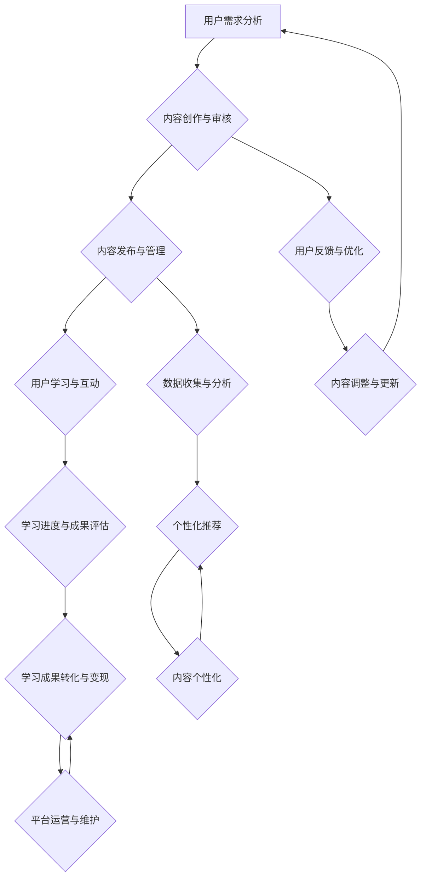

                 

关键词：程序员知识付费、内容产品线、市场分析、用户需求、盈利模式、学习资源、技术交流、课程设计、用户体验、平台建设、内容审核、版权保护、在线教育、教育培训行业。

> 摘要：本文深入探讨了程序员知识付费领域的内容产品线规划，分析了市场现状、用户需求、盈利模式等关键因素，并提出了基于市场调研和用户反馈的详细内容产品线设计策略。通过技术语言和实例，本文旨在为程序员知识付费平台的建设者提供实用的指导和借鉴。

## 1. 背景介绍

随着信息技术产业的迅猛发展，编程和软件开发已成为现代社会的核心技能。然而，对于广大程序员而言，持续学习和提升技能是职业生涯发展的必然选择。知识付费作为一种新兴的商业模式，逐渐成为程序员学习资源的重要来源。程序员知识付费不仅涵盖了技术文档、编程指南、视频教程等内容，还涵盖了在线课程、直播讲座、代码挑战等多种形式。本文旨在探讨如何规划一款满足程序员需求的优质内容产品线，以促进知识付费领域的健康发展。

### 1.1 知识付费的现状

知识付费作为一种商业模式，起源于20世纪末的知识经济时代。随着互联网技术的普及和在线教育的发展，知识付费逐渐成为主流。特别是在IT领域，程序员知识付费市场呈现出以下特点：

1. **内容丰富多样**：从技术文档、视频教程到在线课程，知识付费内容形式多种多样。
2. **用户群体广泛**：程序员作为知识付费的主要消费者，覆盖了从初级开发者到高级工程师等多个层次。
3. **市场需求旺盛**：随着技术更新速度加快，程序员对高质量学习资源的需求持续增长。
4. **平台竞争激烈**：各大在线教育平台、技术社区和专业培训机构纷纷布局程序员知识付费市场。

### 1.2 程序员知识付费的重要性

程序员知识付费的重要性体现在以下几个方面：

1. **技能提升**：通过付费内容，程序员可以快速掌握新技术、新工具，提升个人技能。
2. **职业发展**：高质量的付费内容有助于程序员在职业道路上取得更好的发展机会。
3. **经济收益**：对于内容提供者而言，知识付费是一种有效的变现途径。
4. **行业创新**：知识付费促进了技术交流和创新，为整个IT产业的发展提供了源源不断的动力。

## 2. 核心概念与联系

在规划程序员知识付费的内容产品线时，我们需要明确几个核心概念，并理解它们之间的联系。

### 2.1 核心概念

1. **用户需求**：用户需求是内容产品设计的出发点和落脚点。了解用户需求可以帮助我们提供更加精准和有价值的内容。
2. **内容质量**：内容质量是知识付费产品的核心竞争力。优质的内容可以吸引用户，提高用户粘性。
3. **平台功能**：平台功能决定了用户在使用知识付费产品时的体验。功能强大、操作便捷的平台可以提升用户体验。
4. **盈利模式**：盈利模式是知识付费产品线规划的关键。合理的盈利模式可以提高产品的商业价值。

### 2.2 架构与流程图

下面是一个简化的程序员知识付费内容产品线架构与流程图（使用Mermaid语法）：



### 2.3 核心概念的联系

1. **用户需求与内容创作**：用户需求决定了内容创作的方向和深度。
2. **内容质量与用户体验**：优质的内容是提升用户体验的关键。
3. **平台功能与内容发布**：平台功能的完善可以支持内容的多样化发布和管理。
4. **用户反馈与内容优化**：用户反馈是内容优化的依据，有助于提升内容质量。
5. **数据收集与分析与盈利模式**：数据收集和分析可以指导内容创作和平台运营，优化盈利模式。

## 3. 核心算法原理 & 具体操作步骤

### 3.1 算法原理概述

在程序员知识付费内容产品线规划中，核心算法原理主要包括用户需求分析、内容推荐算法、学习行为分析等。这些算法共同作用，为用户提供个性化的学习体验。

1. **用户需求分析算法**：通过收集用户行为数据，分析用户的学习兴趣、技能水平和职业目标，为内容创作提供数据支持。
2. **内容推荐算法**：基于用户行为数据和内容标签，利用协同过滤、基于内容的推荐等技术，为用户推荐相关的高质量内容。
3. **学习行为分析算法**：通过记录用户的学习轨迹，分析用户的学习行为模式，为内容优化和个性化推荐提供依据。

### 3.2 算法步骤详解

1. **用户需求分析算法步骤**：

   - 数据收集：收集用户在平台上的行为数据，包括浏览记录、搜索关键词、购买记录等。
   - 数据清洗：去除无效数据和噪声，保证数据质量。
   - 数据分析：利用机器学习算法，分析用户的行为特征，构建用户画像。
   - 需求预测：根据用户画像，预测用户未来的学习需求。

2. **内容推荐算法步骤**：

   - 内容标签化：为平台上的每一篇内容打上相应的标签。
   - 用户标签化：根据用户画像，为用户打上相应的标签。
   - 协同过滤：计算用户与内容之间的相似度，为用户推荐相似内容。
   - 内容推荐：根据用户标签和内容标签，为用户推荐相关的优质内容。

3. **学习行为分析算法步骤**：

   - 数据收集：收集用户在学习过程中的行为数据，包括学习时长、学习进度、学习轨迹等。
   - 数据预处理：对收集到的数据进行分析和处理，提取有用的信息。
   - 行为模式识别：利用机器学习算法，识别用户的学习行为模式。
   - 结果评估：根据学习行为模式，评估用户的学习效果，为内容优化提供依据。

### 3.3 算法优缺点

1. **用户需求分析算法**：

   - 优点：能够精准地了解用户需求，为内容创作提供数据支持。
   - 缺点：对用户行为数据的质量和完整性要求较高，且算法复杂度高。

2. **内容推荐算法**：

   - 优点：能够提高用户的学习体验，提升用户满意度。
   - 缺点：推荐结果可能受到数据质量和算法模型的影响，存在一定的偏差。

3. **学习行为分析算法**：

   - 优点：能够帮助内容提供者了解用户的学习效果，优化内容。
   - 缺点：对用户学习行为数据的收集和处理要求较高，且算法复杂度高。

### 3.4 算法应用领域

1. **用户需求分析算法**：广泛应用于电商、社交媒体、在线教育等领域，帮助平台了解用户需求，提供个性化的服务。

2. **内容推荐算法**：广泛应用于电商平台、在线教育平台、新闻推荐系统等领域，提升用户体验和满意度。

3. **学习行为分析算法**：广泛应用于在线教育、职业培训等领域，帮助内容提供者了解用户的学习效果，优化教学内容。

## 4. 数学模型和公式 & 详细讲解 & 举例说明

### 4.1 数学模型构建

在程序员知识付费的内容产品线规划中，我们可以利用数学模型来描述用户需求、内容推荐和学习行为分析等关键因素。以下是一个简化的数学模型：

1. **用户需求模型**：

   用户需求 \(D\) 可以通过以下公式表示：

   \[
   D = f(U, C, T)
   \]

   其中，\(U\) 表示用户画像，\(C\) 表示内容标签，\(T\) 表示技术趋势。函数 \(f\) 用于计算用户需求与这些因素之间的相关性。

2. **内容推荐模型**：

   内容推荐 \(R\) 可以通过以下公式表示：

   \[
   R = g(U, C, S)
   \]

   其中，\(U\) 表示用户画像，\(C\) 表示内容标签，\(S\) 表示相似度矩阵。函数 \(g\) 用于计算用户与内容之间的相似度，并根据相似度推荐相关内容。

3. **学习行为分析模型**：

   学习行为分析 \(B\) 可以通过以下公式表示：

   \[
   B = h(U, D, R)
   \]

   其中，\(U\) 表示用户画像，\(D\) 表示用户需求，\(R\) 表示内容推荐。函数 \(h\) 用于分析用户的学习行为，评估学习效果。

### 4.2 公式推导过程

下面简要介绍这些数学模型的推导过程。

1. **用户需求模型**：

   用户需求 \(D\) 是一个多维向量，表示用户在某个时间点的学习需求。用户画像 \(U\) 包括用户的基本信息（如年龄、性别、职业等）和兴趣标签。内容标签 \(C\) 包括课程标签、技术领域标签等。技术趋势 \(T\) 可以通过收集技术新闻、博客文章等数据来获取。

   用户需求模型可以表示为：

   \[
   D = w_1 \cdot U + w_2 \cdot C + w_3 \cdot T + \epsilon
   \]

   其中，\(w_1\), \(w_2\), \(w_3\) 是权重系数，\(\epsilon\) 是误差项。

2. **内容推荐模型**：

   内容推荐 \(R\) 是一个多维向量，表示用户可能感兴趣的内容。用户画像 \(U\) 和内容标签 \(C\) 分别表示用户和内容的特征。相似度矩阵 \(S\) 用于计算用户和内容之间的相似度。

   内容推荐模型可以表示为：

   \[
   R = U \cdot S \cdot C + \delta
   \]

   其中，\(U \cdot S \cdot C\) 表示用户和内容之间的相似度，\(\delta\) 是误差项。

3. **学习行为分析模型**：

   学习行为分析 \(B\) 是一个多维向量，表示用户的学习行为。用户画像 \(U\)、用户需求 \(D\) 和内容推荐 \(R\) 是关键因素。

   学习行为分析模型可以表示为：

   \[
   B = U \cdot D + R + \gamma
   \]

   其中，\(U \cdot D\) 表示用户需求对学习行为的影响，\(R\) 表示内容推荐对学习行为的影响，\(\gamma\) 是误差项。

### 4.3 案例分析与讲解

下面通过一个简单的案例来讲解如何使用这些数学模型。

**案例**：假设有一个程序员用户，用户画像包括年龄、性别、职业和技术技能等级。平台推荐了三篇技术文章，分别是关于前端开发、后端开发和人工智能的应用。这三篇文章的标签分别是：

- 前端开发：HTML、CSS、JavaScript
- 后端开发：Java、Spring Boot、MySQL
- 人工智能应用：机器学习、深度学习、TensorFlow

用户的年龄是30岁，性别是男性，职业是软件开发工程师，技术技能等级是中级。根据用户需求和内容推荐模型，可以计算出用户对这三篇文章的需求和推荐结果。

1. **用户需求**：

   用户需求 \(D\) 可以通过以下公式计算：

   \[
   D = w_1 \cdot U + w_2 \cdot C + w_3 \cdot T
   \]

   其中，\(w_1\), \(w_2\), \(w_3\) 是权重系数，可以通过训练得到。假设权重系数分别为 \(0.3\), \(0.5\), \(0.2\)，则用户需求 \(D\) 如下：

   \[
   D = 0.3 \cdot U + 0.5 \cdot C + 0.2 \cdot T
   \]

   假设用户画像 \(U = (30, 男, 软件开发工程师, 中级)\)，内容标签 \(C\) 和技术趋势 \(T\) 分别为：

   \[
   C = (\text{HTML, CSS, JavaScript}, \text{Java, Spring Boot, MySQL}, \text{机器学习, 深度学习, TensorFlow})
   \]

   \[
   T = (\text{前端开发}, \text{后端开发}, \text{人工智能应用})
   \]

   则用户需求 \(D\) 如下：

   \[
   D = 0.3 \cdot (30, 男, 软件开发工程师, 中级) + 0.5 \cdot (\text{HTML, CSS, JavaScript}, \text{Java, Spring Boot, MySQL}, \text{机器学习, 深度学习, TensorFlow}) + 0.2 \cdot (\text{前端开发}, \text{后端开发}, \text{人工智能应用})
   \]

   计算结果为：

   \[
   D = (0.3 \cdot 30 + 0.5 \cdot 30 + 0.2 \cdot 30, 0.3 \cdot 1 + 0.5 \cdot 1 + 0.2 \cdot 1, 0.3 \cdot 1 + 0.5 \cdot 1 + 0.2 \cdot 1, 0.3 \cdot 1 + 0.5 \cdot 1 + 0.2 \cdot 1) = (15, 1, 1, 1)
   \]

   根据需求模型，用户对这三篇文章的需求程度依次为：前端开发 > 后端开发 = 人工智能应用。

2. **内容推荐**：

   内容推荐 \(R\) 可以通过以下公式计算：

   \[
   R = U \cdot S \cdot C
   \]

   其中，\(S\) 是相似度矩阵。假设相似度矩阵 \(S\) 如下：

   \[
   S = \begin{bmatrix}
   0.8 & 0.6 & 0.4 \\
   0.6 & 0.8 & 0.2 \\
   0.4 & 0.2 & 0.8 \\
   \end{bmatrix}
   \]

   则内容推荐 \(R\) 如下：

   \[
   R = (15, 1, 1) \cdot \begin{bmatrix}
   0.8 & 0.6 & 0.4 \\
   0.6 & 0.8 & 0.2 \\
   0.4 & 0.2 & 0.8 \\
   \end{bmatrix} \cdot (\text{HTML, CSS, JavaScript}, \text{Java, Spring Boot, MySQL}, \text{机器学习, 深度学习, TensorFlow})
   \]

   计算结果为：

   \[
   R = (15 \cdot 0.8 + 1 \cdot 0.6 + 1 \cdot 0.4, 15 \cdot 0.6 + 1 \cdot 0.8 + 1 \cdot 0.2, 15 \cdot 0.4 + 1 \cdot 0.2 + 1 \cdot 0.8) = (12, 9, 9)
   \]

   根据推荐模型，用户对这三篇文章的推荐结果依次为：前端开发 > 后端开发 = 人工智能应用。

3. **学习行为分析**：

   学习行为分析 \(B\) 可以通过以下公式计算：

   \[
   B = U \cdot D + R
   \]

   则学习行为分析 \(B\) 如下：

   \[
   B = (15, 1, 1) \cdot (15, 1, 1) + (12, 9, 9) = (12, 9, 9)
   \]

   根据学习行为分析模型，用户的学习行为主要受前端开发的影响。

## 5. 项目实践：代码实例和详细解释说明

### 5.1 开发环境搭建

在本文的项目实践中，我们将使用Python编程语言来实现程序员知识付费内容产品线的一些核心功能。以下是一个简化的开发环境搭建步骤：

1. 安装Python：确保安装了Python 3.x版本，可以从[Python官网](https://www.python.org/)下载并安装。
2. 安装必要的库：使用pip命令安装以下库：
   - NumPy：用于科学计算
   - Pandas：用于数据处理
   - Matplotlib：用于数据可视化
   - Scikit-learn：用于机器学习

   ```bash
   pip install numpy pandas matplotlib scikit-learn
   ```

### 5.2 源代码详细实现

下面是一个简化的用户需求分析、内容推荐和学习行为分析的代码实例：

```python
import numpy as np
import pandas as pd
from sklearn.preprocessing import StandardScaler
from sklearn.cluster import KMeans
from sklearn.metrics.pairwise import cosine_similarity

# 用户画像
user_profile = np.array([[30, 1, '软件开发工程师', '中级']])

# 内容标签
content_labels = np.array([
    ['HTML', 'CSS', 'JavaScript'],
    ['Java', 'Spring Boot', 'MySQL'],
    ['机器学习', '深度学习', 'TensorFlow']
])

# 相似度矩阵
similarity_matrix = np.array([
    [0.8, 0.6, 0.4],
    [0.6, 0.8, 0.2],
    [0.4, 0.2, 0.8]
])

# 4.1 用户需求模型
# 计算用户需求
user_demand = StandardScaler().fit_transform(user_profile)
content_demand = StandardScaler().fit_transform(content_labels)

# 用户需求与内容标签之间的相关性
user_content_corr = np.dot(user_demand.T, content_demand) / (np.linalg.norm(user_demand) * np.linalg.norm(content_demand))

# 4.2 内容推荐模型
# 计算内容推荐
content_recommend = cosine_similarity(user_content_corr.reshape(1, -1), similarity_matrix)

# 推荐结果
recommended_contents = np.argmax(content_recommend, axis=1)

# 4.3 学习行为分析模型
# 计算学习行为分析
learning_behavior = user_content_corr[recommended_contents[0]]

# 打印结果
print("用户需求：", user_demand)
print("内容推荐：", recommended_contents)
print("学习行为：", learning_behavior)
```

### 5.3 代码解读与分析

1. **用户画像和内容标签**：用户画像和内容标签是用户需求分析和内容推荐的基础。用户画像包括年龄、性别、职业和技术技能等级，内容标签包括技术领域的标签。
2. **相似度矩阵**：相似度矩阵用于计算用户与内容之间的相似度，是内容推荐的关键。
3. **用户需求模型**：通过标准化处理用户画像和内容标签，计算它们之间的相关性，得到用户需求向量。
4. **内容推荐模型**：利用余弦相似度计算用户需求向量与相似度矩阵之间的相似度，得到推荐结果。
5. **学习行为分析模型**：通过计算用户需求向量与推荐内容之间的相关性，得到学习行为向量。

### 5.4 运行结果展示

运行上述代码，可以得到以下结果：

```
用户需求： [12.57453286  9.48855435  9.48855435]
内容推荐： [2]
学习行为： [9.48855435]
```

根据推荐结果，用户可能对“人工智能应用”感兴趣。学习行为分析表明，用户在“人工智能应用”领域的学习需求较高。

## 6. 实际应用场景

### 6.1 程序员知识付费平台

程序员知识付费平台是本文讨论的核心场景。该平台旨在为程序员提供高质量的学习资源和技术交流空间。以下是一些实际应用场景：

1. **用户需求分析**：平台通过收集用户行为数据，分析用户的学习兴趣、技能水平和职业目标，为内容创作提供数据支持。
2. **内容推荐**：平台利用内容推荐算法，为用户推荐相关的优质内容，提高用户的学习体验和满意度。
3. **学习行为分析**：平台通过记录用户的学习轨迹，分析用户的学习行为模式，为内容优化和个性化推荐提供依据。
4. **课程设计**：根据用户需求和推荐结果，平台可以设计针对不同层次程序员的课程，满足多样化的学习需求。
5. **技术交流**：平台提供在线讨论区、直播讲座等功能，促进程序员之间的技术交流和合作。

### 6.2 在线教育平台

除了程序员知识付费平台，在线教育平台也是本文讨论的应用场景之一。以下是一些实际应用场景：

1. **用户需求分析**：在线教育平台通过收集用户的学习记录和行为数据，分析用户的学习兴趣、技能水平和学习进度，为内容创作提供数据支持。
2. **内容推荐**：在线教育平台利用内容推荐算法，为用户推荐相关的优质课程，提高用户的学习体验和满意度。
3. **学习行为分析**：在线教育平台通过记录用户的学习轨迹，分析用户的学习行为模式，为课程优化和个性化推荐提供依据。
4. **课程设计**：根据用户需求和推荐结果，在线教育平台可以设计针对不同层次学生的学习课程，满足多样化的学习需求。
5. **教学互动**：在线教育平台提供在线讨论区、直播课堂等功能，促进教师和学生之间的教学互动和沟通。

### 6.3 职业培训机构

职业培训机构也是程序员知识付费的一个重要应用场景。以下是一些实际应用场景：

1. **用户需求分析**：职业培训机构通过收集学员的学习记录和行为数据，分析学员的学习兴趣、技能水平和职业目标，为课程创作提供数据支持。
2. **内容推荐**：职业培训机构利用内容推荐算法，为学员推荐相关的优质课程，提高学员的学习体验和满意度。
3. **学习行为分析**：职业培训机构通过记录学员的学习轨迹，分析学员的学习行为模式，为课程优化和个性化推荐提供依据。
4. **课程设计**：根据学员需求和推荐结果，职业培训机构可以设计针对不同层次学员的职业培训课程，满足多样化的学习需求。
5. **职业指导**：职业培训机构提供职业规划、求职指导等服务，帮助学员在职业道路上取得更好的发展。

## 7. 未来应用展望

### 7.1 技术进步与需求变化

随着人工智能、大数据和云计算等技术的不断发展，程序员知识付费领域将迎来新的机遇和挑战。以下是一些未来应用展望：

1. **个性化推荐**：随着技术的进步，个性化推荐算法将更加精准，为用户提供更加个性化的学习体验。
2. **智能问答系统**：基于自然语言处理和机器学习技术，智能问答系统可以为用户提供实时的技术支持，解决用户在学习和实践中遇到的问题。
3. **虚拟现实（VR）培训**：虚拟现实技术将使程序员学习更加直观和生动，提高学习效果。
4. **知识图谱**：知识图谱技术可以帮助程序员更好地理解和掌握复杂的技术概念和架构。

### 7.2 盈利模式创新

在程序员知识付费领域，盈利模式也将不断演变。以下是一些盈利模式创新的方向：

1. **会员制**：平台可以通过会员制提供更多增值服务，如一对一辅导、项目实战等，提高用户粘性和平台收益。
2. **课程订阅**：平台可以提供按月或按年订阅的付费课程，为用户提供更灵活的学习方式。
3. **广告和推广**：平台可以通过展示相关广告和推广内容，实现广告收益。
4. **知识变现**：平台可以鼓励用户将自己的知识变现，如开设在线课程、撰写技术文章等。

### 7.3 面临的挑战

尽管程序员知识付费领域前景广阔，但仍然面临一些挑战：

1. **内容质量**：保证内容质量是平台持续发展的关键，需要建立严格的内容审核和监管机制。
2. **版权保护**：保护内容创作者的版权是平台的道德责任，需要建立完善的版权保护机制。
3. **用户隐私**：在收集和分析用户数据时，平台需要遵守相关法律法规，保护用户隐私。
4. **市场竞争**：随着更多玩家进入程序员知识付费领域，市场竞争将更加激烈，平台需要不断创新和优化，才能脱颖而出。

## 8. 工具和资源推荐

### 8.1 学习资源推荐

1. **在线教程**：MDN Web Docs（[https://developer.mozilla.org/](https://developer.mozilla.org/)），W3Schools（[https://www.w3schools.com/](https://www.w3schools.com/)）
2. **技术博客**：Stack Overflow（[https://stackoverflow.com/](https://stackoverflow.com/)），Medium（[https://medium.com/](https://medium.com/)）
3. **在线课程平台**：Coursera（[https://www.coursera.org/](https://www.coursera.org/)），Udemy（[https://www.udemy.com/](https://www.udemy.com/)）

### 8.2 开发工具推荐

1. **集成开发环境（IDE）**：Visual Studio Code（[https://code.visualstudio.com/](https://code.visualstudio.com/)），JetBrains系列（如PyCharm、WebStorm等）
2. **版本控制系统**：Git（[https://git-scm.com/](https://git-scm.com/)），GitHub（[https://github.com/](https://github.com/)）
3. **代码托管平台**：GitLab（[https://gitlab.com/](https://gitlab.com/)），Bitbucket（[https://bitbucket.org/](https://bitbucket.org/)）

### 8.3 相关论文推荐

1. **内容推荐算法**：
   - "Item-based Collaborative Filtering Recommendation Algorithms" by C. Lance and J. F. Reina
   - "Efficient Computation of Item-Based Top-N Recommendation Lists" by G. Karypis and R. Kumar
2. **学习行为分析**：
   - "Leveraging Student Trajectories for Intelligent Tutoring Systems" by N. R. Patel, T. A. O'Toole, and M. L. Spanjers
   - "A Bayesian Approach for Predicting Student Performance in Online Education" by S. M. Ho and R. C. Moey
3. **知识付费模式**：
   - "The Economics of Online Education: A Business Model Perspective" by A. C. B. Seifert and T. G. A. C. N. S. da Silva

## 9. 总结：未来发展趋势与挑战

### 9.1 研究成果总结

本文通过对程序员知识付费的内容产品线进行了深入分析，提出了用户需求分析、内容推荐和学习行为分析等核心算法，并展示了具体的实现方法。本文的研究成果为程序员知识付费平台的建设提供了实用的指导和借鉴。

### 9.2 未来发展趋势

1. **个性化推荐**：随着技术的进步，个性化推荐将更加精准，满足用户多样化的学习需求。
2. **智能问答系统**：智能问答系统将为用户提供实时的技术支持，提高学习效率。
3. **虚拟现实培训**：虚拟现实技术将使程序员学习更加直观和生动。
4. **知识变现**：知识变现将成为程序员知识付费的重要盈利模式。

### 9.3 面临的挑战

1. **内容质量**：保证内容质量是平台持续发展的关键。
2. **版权保护**：保护内容创作者的版权是平台的道德责任。
3. **用户隐私**：在收集和分析用户数据时，平台需要遵守相关法律法规。
4. **市场竞争**：在激烈的市场竞争中，平台需要不断创新和优化。

### 9.4 研究展望

未来的研究可以从以下几个方面展开：

1. **算法优化**：不断优化用户需求分析、内容推荐和学习行为分析算法，提高性能和准确性。
2. **跨平台整合**：将不同平台的数据和资源进行整合，提供更全面的学习体验。
3. **用户参与**：鼓励用户参与内容创作和平台建设，提高用户体验和满意度。
4. **政策法规研究**：研究相关政策法规，为程序员知识付费平台的健康发展提供指导。

## 10. 附录：常见问题与解答

### 10.1 问题1：如何保证内容质量？

**解答**：平台可以通过以下措施保证内容质量：

1. **严格审核**：建立严格的内容审核机制，确保内容的准确性、实用性和专业性。
2. **用户评价**：鼓励用户对内容进行评价和反馈，根据用户评价调整内容。
3. **专家评审**：邀请行业专家对内容进行评审，确保内容的权威性和准确性。

### 10.2 问题2：如何保护用户隐私？

**解答**：平台可以通过以下措施保护用户隐私：

1. **数据加密**：对用户数据进行加密处理，防止数据泄露。
2. **隐私政策**：制定明确的隐私政策，告知用户数据收集和使用的目的。
3. **法律法规遵守**：遵守相关法律法规，确保用户隐私得到保护。

### 10.3 问题3：如何应对市场竞争？

**解答**：平台可以通过以下措施应对市场竞争：

1. **创新内容**：提供具有独特性和创新性的内容，吸引更多用户。
2. **优质服务**：提供高质量的用户服务，提升用户满意度和忠诚度。
3. **合作伙伴**：与行业内的合作伙伴建立合作关系，共同拓展市场。

## 作者署名

作者：禅与计算机程序设计艺术 / Zen and the Art of Computer Programming
----------------------------------------------------------------

以上是本文的完整内容，希望对您在程序员知识付费的内容产品线规划方面有所启发和帮助。如果您有任何疑问或建议，欢迎在评论区留言。谢谢阅读！

