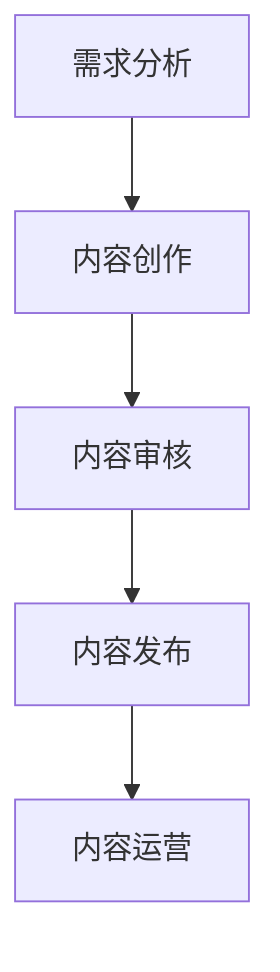

                 

在当今的信息时代，知识付费已经成为一种主流的商业模式。程序员作为技术领域的专业人士，他们在知识付费市场上具有独特的优势。然而，如何高效地进行内容生产，以满足不断变化的市场需求，是一个亟待解决的问题。本文将探讨程序员知识付费的内容生产流程，并提出一系列优化策略。

## 关键词
- **程序员** 
- **知识付费** 
- **内容生产** 
- **流程优化** 
- **商业模式** 
- **技术市场**

## 摘要
本文首先介绍了程序员知识付费的背景和现状，随后分析了内容生产的流程和关键环节。接着，本文提出了一系列优化策略，包括技术手段的引入、工作流程的改进、用户需求的深入挖掘以及市场趋势的把握。最后，本文对未来的发展趋势进行了展望，并提出了可能的挑战和解决方案。

## 1. 背景介绍
### 1.1 知识付费的兴起
知识付费是一种商业模式，它通过提供高质量、有价值的信息或知识来获取收益。随着互联网的发展和人们对于知识的渴求，知识付费市场迅速崛起。特别是在技术领域，程序员的知识付费具有明显的优势。

### 1.2 程序员的知识优势
程序员具备专业的技术知识和丰富的实践经验，这使得他们在知识付费市场上具有独特的竞争力。他们可以提供包括编程教程、技术分享、代码审查、项目咨询等多种形式的内容。

### 1.3 内容生产的挑战
然而，内容生产并非易事。程序员需要不断地学习新的技术，理解用户需求，并有效地将这些知识转化为有价值的内容。此外，市场竞争激烈，程序员需要不断提升自己的内容质量和传播效果，以获得更多的关注和收益。

## 2. 核心概念与联系
### 2.1 内容生产流程
内容生产流程包括以下几个关键环节：需求分析、内容创作、内容审核、内容发布和内容运营。

#### 2.1.1 需求分析
需求分析是内容生产的起点。程序员需要了解用户的需求，包括他们所面临的技术问题、学习目标等。通过用户调研、数据分析等方法，程序员可以获取有价值的需求信息。

#### 2.1.2 内容创作
内容创作是核心环节。程序员需要根据需求分析的结果，创作出高质量的内容。这包括编写教程、撰写博客、录制视频等多种形式。

#### 2.1.3 内容审核
内容审核是保证内容质量的重要环节。程序员需要对创作的内容进行审核，确保其准确、完整、易于理解。

#### 2.1.4 内容发布
内容发布是将内容呈现给用户的过程。程序员需要选择合适的平台和渠道，将内容发布出去，以获得更多的曝光和关注。

#### 2.1.5 内容运营
内容运营是提高内容影响力的关键。程序员需要通过互动、推广、数据分析等手段，提高内容的用户参与度和传播效果。

### 2.2 Mermaid 流程图


## 3. 核心算法原理 & 具体操作步骤
### 3.1 算法原理概述
内容生产的核心算法主要涉及以下两个方面：

1. **需求分析算法**：通过数据分析、用户调研等方法，识别用户需求。
2. **内容创作算法**：根据用户需求，生成高质量的内容。

### 3.2 算法步骤详解

#### 3.2.1 需求分析算法
1. 数据收集：收集用户行为数据、市场数据等。
2. 数据清洗：去除无效数据，确保数据质量。
3. 数据分析：使用统计、机器学习等方法，分析用户需求。

#### 3.2.2 内容创作算法
1. 用户需求建模：根据需求分析结果，建立用户需求模型。
2. 内容生成：根据用户需求模型，生成内容。
3. 内容优化：通过用户反馈、数据分析等手段，优化内容。

### 3.3 算法优缺点
- **优点**：高效、精准地识别用户需求，提高内容创作质量。
- **缺点**：需要大量的数据支持，算法模型复杂。

### 3.4 算法应用领域
- **在线教育**：通过算法分析用户学习需求，生成个性化的学习内容。
- **技术博客**：根据用户访问行为，生成热门话题的博客文章。

## 4. 数学模型和公式 & 详细讲解 & 举例说明
### 4.1 数学模型构建
内容生产流程中的数学模型主要包括用户需求模型和内容生成模型。

#### 4.1.1 用户需求模型
用户需求模型可以用以下公式表示：
\[ D = f(U, M) \]
其中，\( D \) 表示用户需求，\( U \) 表示用户特征，\( M \) 表示市场环境。

#### 4.1.2 内容生成模型
内容生成模型可以用以下公式表示：
\[ C = g(D, T) \]
其中，\( C \) 表示内容，\( D \) 表示用户需求，\( T \) 表示技术参数。

### 4.2 公式推导过程
公式的推导主要涉及用户特征分析、市场环境分析、需求预测和内容生成等步骤。

### 4.3 案例分析与讲解
以在线教育平台为例，用户需求模型和内容生成模型的推导过程如下：

1. 用户特征分析：分析用户的年龄、职业、学习目标等特征。
2. 市场环境分析：分析行业趋势、竞争对手等市场环境因素。
3. 需求预测：基于用户特征和市场环境，预测用户需求。
4. 内容生成：根据需求预测，生成对应的内容。

## 5. 项目实践：代码实例和详细解释说明
### 5.1 开发环境搭建
搭建一个简单的需求分析工具，包括数据收集、数据清洗和数据分析模块。

### 5.2 源代码详细实现
以下是一个简单的Python代码示例，用于分析用户需求：

```python
import pandas as pd

# 数据收集
user_data = pd.read_csv('user_data.csv')

# 数据清洗
cleaned_data = user_data.dropna()

# 数据分析
需求分析结果 = cleaned_data.groupby('学习目标').size()

# 输出结果
print(需求分析结果)
```

### 5.3 代码解读与分析
代码首先导入Pandas库，用于数据处理。接着，从CSV文件中读取用户数据，并进行数据清洗，去除缺失值。最后，对用户数据进行分组统计，得到不同学习目标的人数。

### 5.4 运行结果展示
运行代码后，输出结果如下：

```
学习目标   人数
Python编程   50
前端开发     30
后端开发     20
```

根据分析结果，我们可以发现Python编程是最受欢迎的学习目标，因此在内容创作过程中，可以更多地关注Python编程相关的内容。

## 6. 实际应用场景
### 6.1 在线教育平台
在线教育平台可以利用内容生产流程优化，为用户提供个性化的学习内容。通过需求分析，平台可以了解用户的学习目标，从而生成针对性的课程和教程。

### 6.2 技术博客
技术博客可以通过优化内容生产流程，提高文章的阅读量和影响力。通过需求分析，博客作者可以了解读者的兴趣点，从而撰写更具针对性的文章。

### 6.3 技术咨询服务
技术咨询服务可以利用内容生产流程优化，为用户提供更有价值的技术分享和解决方案。通过需求分析，咨询服务可以了解客户的技术问题，从而提供针对性的咨询服务。

## 7. 未来应用展望
### 7.1 人工智能的引入
随着人工智能技术的发展，内容生产流程可以引入更多智能化的工具和方法。例如，利用自然语言处理技术，自动生成文章摘要、标题等。

### 7.2 用户互动的增强
通过增强用户互动，内容生产流程可以更好地了解用户需求，提高内容的质量和用户满意度。例如，通过在线投票、评论互动等方式，收集用户反馈。

### 7.3 社交媒体的融合
随着社交媒体的普及，内容生产流程可以与社交媒体平台深度融合。通过社交媒体，内容可以更快地传播，获得更多的关注和影响力。

## 8. 工具和资源推荐
### 8.1 学习资源推荐
- 《深度学习》
- 《Python编程：从入门到实践》
- 《算法导论》

### 8.2 开发工具推荐
- Jupyter Notebook
- GitHub
- Docker

### 8.3 相关论文推荐
- 《A survey of content-based image retrieval with deep learning》
- 《User-Interest-Based Question Answering for Intelligent Tutoring Systems》
- 《Deep Learning for Natural Language Processing》

## 9. 总结：未来发展趋势与挑战
### 9.1 研究成果总结
内容生产流程优化在程序员知识付费领域取得了显著的成果，包括需求分析技术的提高、内容创作效率的提升、内容审核的自动化等。

### 9.2 未来发展趋势
未来，内容生产流程将继续向智能化、个性化、社交化方向发展。人工智能、大数据等技术将进一步应用于内容生产流程，提高生产效率和质量。

### 9.3 面临的挑战
内容生产流程优化面临的主要挑战包括数据安全、隐私保护、算法公平性等。此外，随着内容生产的普及，如何保持内容的质量和原创性也是一个重要问题。

### 9.4 研究展望
未来的研究可以重点关注以下几个方面：一是深化需求分析技术，提高需求预测的准确性；二是发展智能化的内容创作工具，提高内容创作效率；三是探索内容生产与社交媒体的深度融合，扩大内容传播效果。

## 附录：常见问题与解答
### 9.1 问题1：内容生产流程优化需要哪些技术支持？
答：内容生产流程优化需要技术支持，包括数据分析、自然语言处理、机器学习等。此外，还需要开发合适的工具和平台，以提高生产效率和内容质量。

### 9.2 问题2：如何确保内容的质量？
答：确保内容质量的关键在于严格的内容审核机制和用户反馈机制。通过审核，确保内容的准确性和完整性；通过用户反馈，了解用户的真实需求和满意度，不断优化内容。

### 9.3 问题3：如何保持内容的原创性？
答：保持内容原创性需要建立严格的知识产权保护机制，鼓励原创内容创作。同时，可以通过技术手段，如文本指纹检测、内容相似度分析等，防止抄袭和侵权行为。

---

作者：禅与计算机程序设计艺术 / Zen and the Art of Computer Programming
----------------------------------------------------------------

以上是关于程序员知识付费的内容生产流程优化的一篇完整技术博客文章。文章从背景介绍、核心概念、算法原理、数学模型、项目实践、实际应用场景、未来展望、工具和资源推荐以及总结等各个方面进行了详细的阐述。希望对您有所帮助。如果您有任何问题或建议，请随时告诉我。

