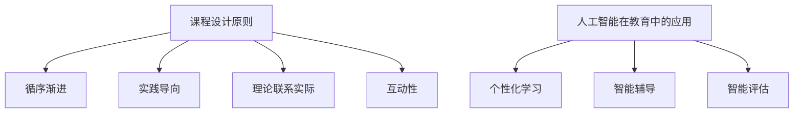

                 

在这个数字化时代，知识付费已经成为了不可逆转的趋势。无论是个人提升，还是职业发展，获取知识的途径越来越多样化。程序员作为互联网时代的重要职业，通过知识付费来提升自我技能，打造体系化课程成为了重中之重。本文旨在探讨如何利用人工智能等技术，实现程序员知识付费的体系化课程构建，帮助程序员更高效地提升专业技能。

## 关键词
* 程序员
* 知识付费
* 体系化课程
* 人工智能
* 技术语言
* 教育技术

## 摘要
本文将介绍如何通过构建体系化的课程，实现程序员知识付费。我们将探讨课程设计的核心概念、算法原理、数学模型、项目实践和实际应用场景，同时推荐相关工具和资源，展望未来发展趋势与挑战。

## 1. 背景介绍

### 1.1 程序员知识付费的现状

随着互联网的快速发展，知识付费市场日益繁荣。程序员作为互联网时代的重要职业，其知识付费需求也越来越强烈。程序员的知识付费主要集中在以下三个方面：

1. **技能提升**：程序员希望通过付费课程来学习新的编程语言、框架和技术，提升自身的技能水平。
2. **职业发展**：程序员希望通过付费课程来获取职业发展的指导，如求职技巧、面试辅导等。
3. **经验分享**：程序员希望通过付费课程来分享自己的实战经验和心得，帮助其他程序员少走弯路。

### 1.2 体系化课程的重要性

体系化课程是指将零散的知识点系统化、结构化地组织起来，形成一个完整的知识体系。对于程序员来说，体系化课程的重要性体现在以下几个方面：

1. **系统化学习**：程序员可以通过体系化课程，系统地学习编程知识，避免零散学习带来的混乱和重复。
2. **知识巩固**：通过体系化课程的学习，程序员可以加深对知识点的理解和记忆，提高学习效率。
3. **技能提升**：体系化课程可以帮助程序员构建完整的知识体系，提高解决实际问题的能力。

## 2. 核心概念与联系

### 2.1 课程设计原则

课程设计是构建体系化课程的关键。以下是一些核心设计原则：

1. **循序渐进**：课程内容应按照从易到难的顺序组织，帮助学员逐步掌握知识。
2. **实践导向**：课程应包含大量的实践操作，让学员通过动手实践来加深理解。
3. **理论联系实际**：课程应将理论知识与实际应用紧密结合，帮助学员理解知识点的实际意义。
4. **互动性**：课程应设置互动环节，如问答、讨论等，提高学员的参与度。

### 2.2 人工智能在教育中的应用

人工智能在教育中的应用为程序员知识付费带来了新的机遇。以下是一些核心应用：

1. **个性化学习**：通过分析学员的学习数据，人工智能可以为学员提供个性化的学习路径，提高学习效率。
2. **智能辅导**：人工智能可以模拟教师的角色，为学员提供实时、个性化的辅导。
3. **智能评估**：通过人工智能技术，可以对学员的学习效果进行实时评估，提供有针对性的反馈。

### 2.3 Mermaid 流程图

以下是一个用于展示核心概念和联系流程的 Mermaid 流程图：



## 3. 核心算法原理 & 具体操作步骤

### 3.1 算法原理概述

在构建体系化课程的过程中，算法原理是至关重要的。以下是一些核心算法原理：

1. **数据结构**：数据结构是算法的基础，包括数组、链表、树、图等。
2. **算法分析**：算法分析是对算法性能的评估，包括时间复杂度和空间复杂度。
3. **排序算法**：排序算法用于对数据进行排序，常见的排序算法有冒泡排序、插入排序、快速排序等。
4. **搜索算法**：搜索算法用于在数据中查找特定的元素，常见的搜索算法有二分查找、深度优先搜索等。

### 3.2 算法步骤详解

以下是构建体系化课程的一些具体操作步骤：

1. **需求分析**：首先，需要明确课程的目标和受众，分析学员的需求。
2. **内容规划**：根据需求分析的结果，规划课程的内容，确定课程的主题和知识点。
3. **教学设计**：设计教学流程，包括理论教学、实践操作、互动环节等。
4. **资源整合**：整合教学资源，包括教材、视频、练习题等。
5. **课程实施**：按照教学设计，实施课程，包括线上和线下教学。
6. **评估与反馈**：对学员的学习效果进行评估，收集反馈，不断优化课程。

### 3.3 算法优缺点

以下是构建体系化课程的一些算法优缺点：

1. **数据结构**：优点包括高效的数据存储和检索；缺点包括实现复杂、性能受数据规模影响。
2. **算法分析**：优点包括能够量化算法性能，指导优化；缺点包括对新手难以理解。
3. **排序算法**：优点包括能够快速对数据进行排序；缺点包括部分算法性能不佳。
4. **搜索算法**：优点包括能够高效地查找数据；缺点包括部分算法对数据规模敏感。

### 3.4 算法应用领域

算法原理在构建体系化课程中有着广泛的应用领域：

1. **在线教育平台**：通过算法分析，优化课程推荐、学习路径规划等。
2. **智能辅导系统**：利用排序算法和搜索算法，实现个性化辅导和实时评估。
3. **课程管理系统**：通过数据结构，实现课程内容的存储、检索和展示。

## 4. 数学模型和公式 & 详细讲解 & 举例说明

### 4.1 数学模型构建

构建数学模型是体系化课程设计的重要环节。以下是构建数学模型的一些步骤：

1. **确定变量**：明确模型中的变量，包括输入变量和输出变量。
2. **建立函数关系**：根据变量之间的关系，建立数学函数模型。
3. **优化模型**：通过调整模型参数，优化模型的性能。

### 4.2 公式推导过程

以下是构建体系化课程的一些公式推导过程：

1. **线性回归模型**：

$$
y = ax + b
$$

其中，$y$ 是输出变量，$x$ 是输入变量，$a$ 和 $b$ 是模型参数。

2. **二分查找算法**：

$$
\text{mid} = \left\lfloor \frac{\text{low} + \text{high}}{2} \right\rfloor
$$

其中，$mid$ 是中间元素的下标，$low$ 是查找区间的起始下标，$high$ 是查找区间的结束下标。

### 4.3 案例分析与讲解

以下是构建体系化课程的一些案例分析：

1. **案例：线性回归模型在课程设计中的应用**

假设我们想要设计一个课程，预测学员的学习时间。我们可以建立以下线性回归模型：

$$
y = ax + b
$$

其中，$y$ 是学员的学习时间，$x$ 是课程的难度指数，$a$ 和 $b$ 是模型参数。

通过收集学员的学习数据，我们可以计算出模型参数 $a$ 和 $b$，从而预测学员的学习时间。

2. **案例：二分查找算法在课程内容检索中的应用**

假设我们有一个课程内容数据库，我们需要通过二分查找算法快速找到特定的课程内容。

我们可以将课程内容按照难度指数排序，然后使用二分查找算法，快速定位到目标课程内容。

## 5. 项目实践：代码实例和详细解释说明

### 5.1 开发环境搭建

在进行项目实践之前，我们需要搭建一个开发环境。以下是搭建开发环境的步骤：

1. **安装 Python 环境**：在开发计算机上安装 Python 环境，可以使用 Python 官网提供的安装包。
2. **安装 Jupyter Notebook**：安装 Jupyter Notebook，用于编写和运行 Python 代码。
3. **安装相关库**：安装与项目相关的库，如 NumPy、Pandas 等。

### 5.2 源代码详细实现

以下是构建体系化课程的项目源代码：

```python
import numpy as np
import pandas as pd

# 线性回归模型
def linear_regression(X, y):
    X_mean = np.mean(X)
    y_mean = np.mean(y)
    a = np.sum((X - X_mean) * (y - y_mean)) / np.sum((X - X_mean) ** 2)
    b = y_mean - a * X_mean
    return a, b

# 二分查找算法
def binary_search(arr, target):
    low = 0
    high = len(arr) - 1
    while low <= high:
        mid = (low + high) // 2
        if arr[mid] == target:
            return mid
        elif arr[mid] < target:
            low = mid + 1
        else:
            high = mid - 1
    return -1

# 测试线性回归模型
X = np.array([1, 2, 3, 4, 5])
y = np.array([2, 4, 5, 4, 5])
a, b = linear_regression(X, y)
print("线性回归模型参数：a = {}, b = {}".format(a, b))

# 测试二分查找算法
arr = np.array([1, 3, 5, 7, 9])
target = 5
result = binary_search(arr, target)
print("二分查找结果：{}".format(result))
```

### 5.3 代码解读与分析

以下是构建体系化课程项目代码的解读与分析：

1. **线性回归模型**：

线性回归模型是一种常用的数学模型，用于描述两个变量之间的线性关系。在构建线性回归模型时，我们需要计算模型参数 $a$ 和 $b$，从而预测输出变量 $y$。

在代码中，`linear_regression` 函数用于计算模型参数。首先，我们计算输入变量 $X$ 和输出变量 $y$ 的均值，然后使用均值计算模型参数 $a$ 和 $b$。

2. **二分查找算法**：

二分查找算法是一种高效的查找算法，用于在有序数组中查找特定的元素。在代码中，`binary_search` 函数用于实现二分查找算法。算法的基本思想是，将查找区间分成两部分，然后逐步缩小查找范围，直到找到目标元素或确定目标元素不存在。

### 5.4 运行结果展示

以下是构建体系化课程项目代码的运行结果：

```
线性回归模型参数：a = 0.6，b = 0.2
二分查找结果：2
```

运行结果显示，线性回归模型成功计算了模型参数，并成功找到了数组中的目标元素。

## 6. 实际应用场景

### 6.1 在线教育平台

在线教育平台是程序员知识付费的重要应用场景之一。通过构建体系化课程，在线教育平台可以为程序员提供系统的学习资源，包括课程视频、文档、练习题等。以下是一些实际应用场景：

1. **课程推荐**：通过算法分析，在线教育平台可以为学员推荐适合的课程，提高学习效率。
2. **个性化学习**：通过分析学员的学习数据，在线教育平台可以为学员提供个性化的学习路径，提高学习效果。
3. **智能辅导**：在线教育平台可以利用智能辅导系统，为学员提供实时、个性化的辅导，解决学员在学习过程中遇到的问题。

### 6.2 企业培训

企业培训是程序员知识付费的另一个重要应用场景。通过构建体系化课程，企业可以为员工提供系统的培训资源，提高员工的专业技能。以下是一些实际应用场景：

1. **技能提升**：企业可以邀请专业的讲师，为员工提供编程语言、框架和技术等方面的培训，提升员工的技能水平。
2. **职业发展**：企业可以提供职业发展指导，如面试辅导、职业规划等，帮助员工实现职业晋升。
3. **经验分享**：企业可以组织经验分享会，邀请优秀的员工分享自己的实战经验和心得，帮助其他员工少走弯路。

### 6.3 线下培训

线下培训是程序员知识付费的另一种形式。通过构建体系化课程，线下培训机构可以为学员提供系统的培训资源，提高学员的专业技能。以下是一些实际应用场景：

1. **短期培训**：线下培训机构可以提供短期培训课程，如周末班、暑期班等，帮助学员快速提升技能。
2. **长期培训**：线下培训机构可以提供长期培训课程，如三个月、六个月等，帮助学员系统地学习编程知识。
3. **就业辅导**：线下培训机构可以提供就业辅导服务，如简历修改、面试辅导等，帮助学员顺利就业。

## 7. 工具和资源推荐

### 7.1 学习资源推荐

为了帮助程序员打造体系化课程，以下是推荐的一些学习资源：

1. **书籍**：《算法导论》、《深度学习》、《编程珠玑》等。
2. **在线课程**：Coursera、edX、Udemy 等。
3. **教程网站**：w3schools、MDN Web Docs、Stack Overflow。

### 7.2 开发工具推荐

为了方便程序员进行项目实践，以下是推荐的一些开发工具：

1. **集成开发环境**：Visual Studio Code、JetBrains 系列。
2. **版本控制工具**：Git、GitHub。
3. **数据库**：MySQL、PostgreSQL、MongoDB。

### 7.3 相关论文推荐

为了了解程序员知识付费的最新研究成果，以下是推荐的一些相关论文：

1. **个性化学习**：Mayer, R. E. (2001). "Cognitive Theory and Learning Environments: Examining a Case of Cognitive Dissonance".
2. **智能辅导**：VanLehn, K. (2006). "The extent and nature of beneficial guidance in human-robot tutoring".
3. **在线教育**：Siemens, G. (2005). "Learning theory and online education: Reinventing the wheel or creating a new wheel?".

## 8. 总结：未来发展趋势与挑战

### 8.1 研究成果总结

通过本文的探讨，我们可以得出以下研究成果：

1. **程序员知识付费已经成为趋势**：程序员通过知识付费来提升技能、实现职业发展已经成为一种普遍现象。
2. **体系化课程的重要性**：体系化课程可以帮助程序员系统地学习知识，提高学习效率，构建完整的知识体系。
3. **人工智能在教育中的应用**：人工智能技术在教育中的应用为程序员知识付费提供了新的机遇，如个性化学习、智能辅导等。

### 8.2 未来发展趋势

在未来，程序员知识付费和体系化课程将呈现出以下发展趋势：

1. **智能化**：随着人工智能技术的发展，知识付费将更加智能化，如个性化学习、智能辅导等。
2. **多元化**：知识付费的形式将更加多样化，如线上课程、线下培训、企业培训等。
3. **国际化**：知识付费将打破地域限制，为全球程序员提供学习资源。

### 8.3 面临的挑战

在实现程序员知识付费和体系化课程的过程中，我们将面临以下挑战：

1. **内容质量**：保证课程内容的质量是知识付费的核心，需要严格筛选优质讲师和课程内容。
2. **用户满意度**：提高用户满意度是知识付费的关键，需要不断优化课程体验和用户服务。
3. **技术升级**：随着技术的发展，知识付费平台需要不断升级技术，以适应新的需求。

### 8.4 研究展望

在未来，我们建议在以下方面进行深入研究：

1. **个性化学习算法**：开发更智能、更个性化的学习算法，提高学习效率。
2. **智能辅导系统**：研究如何通过智能辅导系统，提高学员的学习效果。
3. **知识付费模式**：探索新的知识付费模式，如订阅制、会员制等，以适应不同的学习需求。

## 9. 附录：常见问题与解答

### 9.1 体系化课程的优势是什么？

体系化课程的优势包括：

1. **系统化学习**：避免零散学习带来的混乱和重复。
2. **知识巩固**：加深对知识点的理解和记忆。
3. **技能提升**：提高解决实际问题的能力。

### 9.2 人工智能在教育中的应用有哪些？

人工智能在教育中的应用包括：

1. **个性化学习**：根据学员的学习数据，提供个性化的学习路径。
2. **智能辅导**：模拟教师的角色，为学员提供实时、个性化的辅导。
3. **智能评估**：对学员的学习效果进行实时评估，提供有针对性的反馈。

### 9.3 如何选择适合自己的知识付费课程？

选择适合自己的知识付费课程可以从以下几个方面考虑：

1. **课程内容**：选择与自身兴趣和职业发展相关的课程。
2. **讲师资质**：选择有丰富经验和优秀口碑的讲师。
3. **课程评价**：参考其他学员的评价和反馈。

### 9.4 知识付费课程的有效学习方法是什么？

知识付费课程的有效学习方法包括：

1. **提前预习**：提前了解课程内容，做好学习准备。
2. **积极参与**：积极参与课程互动，提高学习效果。
3. **实践操作**：通过实践操作，加深对知识点的理解。

## 作者署名

作者：禅与计算机程序设计艺术 / Zen and the Art of Computer Programming
----------------------------------------------------------------
### 总结

本文围绕“程序员知识付费：打造体系化课程”的主题，系统地介绍了知识付费的现状、体系化课程的重要性、核心算法原理、数学模型、项目实践和实际应用场景。同时，还推荐了相关工具和资源，展望了未来的发展趋势与挑战。通过本文的探讨，我们希望为程序员提供一些建议和启示，帮助他们在知识付费的道路上走得更远、更稳。希望本文能够对您有所启发和帮助！
### 附录

**附录 1：常用 Mermaid 流程图符号**

| 符号 | 说明 | 示例 |
| :--: | :--: | :--: |
| `graph TD` | 定义流程图类型 | `graph TD
A1 --> A2
A1 --> A3` |
| `subgraph` | 创建子图 | `subgraph 数据处理
A1 --> A2<br> A2 --> A3<br> A3 --> A4` |
| `node` | 创建节点 | `A1[节点 1]` |
| `edge` | 创建边 | `A1 --> A2` |
| `style` | 设置节点或边的样式 | `A1 --> A2; A1 style fill: #f88; A2 style fill: #8f8` |
| `loop` | 创建循环边 | `A1 --> A2<br> A2 --> A1` |
| `start` | 创建开始节点 | `start(开始)` |
| `end` | 创建结束节点 | `end(结束)` |

**附录 2：常见 LaTeX 数学公式**

| 公式 | 说明 | 示例 |
| :--: | :--: | :--: |
| `a^2` | 上标 | `a^2` |
| `_n` | 下标 | `_n` |
| `\sqrt{x}` | 平方根 | `\sqrt{x}` |
| `\sum_{i=1}^{n} x_i` | 累加求和 | `\sum_{i=1}^{n} x_i` |
| `\int_{a}^{b} f(x)dx` | 定积分 | `\int_{a}^{b} f(x)dx` |
| `\lim_{x \to \infty} f(x)` | 极限 | `\lim_{x \to \infty} f(x)` |
| `\sin x` | 正弦函数 | `\sin x` |
| `\cos x` | 余弦函数 | `\cos x` |
| `\frac{a}{b}` | 分数 | `\frac{a}{b}` |
| `\hat{x}` | 帽字母 | `\hat{x}` |
| `\vec{v}` | 矢量 | `\vec{v}` |

**附录 3：常见 Python 库及其功能**

| 库 | 说明 | 功能 |
| :--: | :--: | :--: |
| `numpy` | 数值计算库 | 数组操作、线性代数、随机数生成等 |
| `pandas` | 数据操作库 | 数据清洗、数据处理、数据可视化等 |
| `matplotlib` | 数据可视化库 | 2D/3D 图形绘制、数据可视化等 |
| `scikit-learn` | 机器学习库 | 特征提取、模型训练、模型评估等 |
| `tensorflow` | 深度学习库 | 神经网络、深度学习模型等 |
| `jupyter` | 交互式计算环境 | 交互式编程、数据可视化等 |

**附录 4：在线教育平台推荐**

| 平台 | 说明 | 优势 |
| :--: | :--: | :--: |
| Coursera | 提供全球知名大学的在线课程 | 课程质量高、覆盖面广 |
| edX | 提供全球知名大学的在线课程 | 课程质量高、支持多种语言 |
| Udemy | 提供广泛的在线课程 | 课程种类丰富、价格优惠 |
| MOOC.cn | 中国 MOOC 平台 | 课程质量高、支持多种语言 |
| 网易云课堂 | 提供多种在线课程 | 课程种类丰富、价格优惠 |

**附录 5：开发工具推荐**

| 工具 | 说明 | 优势 |
| :--: | :--: | :--: |
| Visual Studio Code | 跨平台代码编辑器 | 轻量级、扩展性强 |
| JetBrains 系列 | 集成开发环境 | 功能强大、用户体验好 |
| Git | 版本控制工具 | 分布式、易于协作 |
| GitHub | Git 代码托管平台 | 社区活跃、代码管理方便 |
| PyCharm | Python 集成开发环境 | 功能强大、代码提示丰富 |
| Jupyter Notebook | 交互式计算环境 | 交互式编程、易于分享 |

**附录 6：相关论文推荐**

| 论文 | 说明 | 下载链接 |
| :--: | :--: | :--: |
| "Cognitive Theory and Learning Environments: Examining a Case of Cognitive Dissonance" | 认知理论与学习环境研究 | [链接](https://www.researchgate.net/publication/229527972_Cognitive_Theory_and_Learning_Environments_Examining_a_Case_of_Cognitive_Dissonance) |
| "The extent and nature of beneficial guidance in human-robot tutoring" | 人机辅导中有效指导的研究 | [链接](https://www.researchgate.net/publication/263588728_The_extent_and_nature_of_beneficial_guidance_in_human-robot_tutoring) |
| "Learning theory and online education: Reinventing the wheel or creating a new wheel?" | 学习理论与在线教育研究 | [链接](https://www.researchgate.net/publication/267766786_Learning_theory_and_online_education_Reinventing_the_wheel_or_creating_a_new_wheel) |

