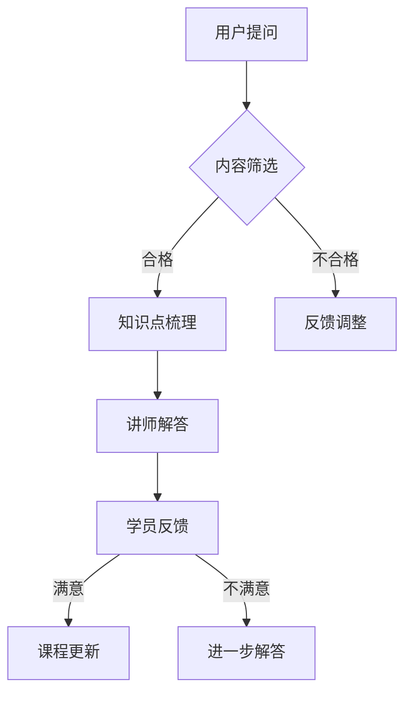

                 

关键词：知识付费，问答课程，程序员，在线教育，内容制作，课程设计，互动教学

> 摘要：本文将探讨程序员在知识付费时代如何通过打造问答课程来提升个人品牌价值，分享实战经验和策略，并提供实用的工具和资源推荐。文章将涵盖课程设计、内容制作、互动教学等方面，为程序员提供全面的知识付费解决方案。

## 1. 背景介绍

### 1.1 知识付费的兴起

随着互联网技术的飞速发展，尤其是移动互联网的普及，知识付费市场迎来了前所未有的繁荣。用户对于高质量、针对性强的学习内容需求日益增长，知识付费成为互联网教育领域的一大趋势。在这个背景下，程序员作为技术领域的重要群体，也积极投身于知识付费的浪潮之中。

### 1.2 程序员知识付费的优势

1. **专业技能需求强烈**：程序员在日常工作中需要不断更新和掌握最新的技术知识，知识付费课程可以为他们提供专业的学习资源。
2. **内容创作成本低**：相对于其他领域，程序员的知识创作成本较低，通过编写代码、制作教程等方式即可实现内容输出。
3. **个人品牌塑造**：通过知识付费课程，程序员可以展示自己的专业能力和影响力，有助于提升个人品牌价值。
4. **商业机会多样**：知识付费不仅限于线上课程，还可以拓展到线上咨询、技术分享会、编程竞赛等领域，为程序员带来丰富的商业机会。

## 2. 核心概念与联系

### 2.1 问答课程的概念

问答课程是一种以提问和回答为核心的教学模式，通过学员提问、讲师解答的方式，实现知识的传递和互动交流。问答课程的特点是：

1. **互动性强**：学员可以随时提问，讲师即时解答，增强学习体验。
2. **针对性高**：针对学员的具体问题，讲师可以提供个性化的解决方案。
3. **高效实用**：学员可以在短时间内获得解决实际问题的方法。

### 2.2 知识付费与问答课程的联系

1. **内容来源**：问答课程的内容主要来自于学员的提问，这些提问反映了学员在学习和实践中遇到的具体问题，具有较高的实用价值。
2. **价值传递**：通过解答学员的问题，讲师可以将自己的专业知识和经验传递给学员，实现知识付费。
3. **互动循环**：问答课程中的互动不仅限于讲师与学员之间，还可以扩展到学员之间，形成知识共享和学习的良性循环。

### 2.3 Mermaid 流程图



## 3. 核心算法原理 & 具体操作步骤

### 3.1 算法原理概述

问答课程的核心算法可以概括为“问题筛选 - 知识点梳理 - 讲师解答 - 学员反馈 - 课程更新”。这一过程体现了互动教学的特点，通过不断的反馈和调整，实现教学内容的优化和学员需求的满足。

### 3.2 算法步骤详解

1. **问题筛选**：讲师对学员提交的问题进行筛选，确保问题的质量和针对性。这一步骤可以通过设置问题分类、关键词筛选等方式实现。
2. **知识点梳理**：讲师根据筛选后的问题，对知识点进行梳理和总结，为解答问题做好充分准备。
3. **讲师解答**：讲师根据梳理的知识点，对学员的问题进行解答，解答过程可以采用文字、语音、视频等多种形式。
4. **学员反馈**：学员在收到解答后，可以给出反馈，表达对解答的满意程度和改进建议。
5. **课程更新**：根据学员的反馈，讲师对课程内容进行更新和调整，以提升课程的实用性和互动性。

### 3.3 算法优缺点

**优点**：
1. **互动性强**：问答课程通过互动，增强学员的参与感和学习效果。
2. **针对性高**：针对学员的具体问题，讲师可以提供个性化的解决方案。
3. **内容更新及时**：根据学员的反馈，课程内容可以及时更新，保持课程的新鲜感和实用性。

**缺点**：
1. **管理难度大**：问答课程需要讲师对大量问题进行筛选、梳理和解答，管理难度较大。
2. **时间成本高**：问答课程对讲师的时间成本较高，需要讲师投入大量时间和精力。

### 3.4 算法应用领域

问答课程广泛应用于在线教育、技能培训、职业规划等领域。以下是一些具体的应用案例：

1. **在线教育**：问答课程可以应用于在线课程中，作为课程内容的重要组成部分，提升课程的互动性和实用性。
2. **技能培训**：针对特定的技能领域，如编程、数据科学等，问答课程可以帮助学员解决实际操作中的问题。
3. **职业规划**：针对职业发展中的困惑，问答课程可以为学员提供专业的指导和建议。

## 4. 数学模型和公式 & 详细讲解 & 举例说明

### 4.1 数学模型构建

问答课程的效果可以通过以下数学模型进行评估：

\[ 效果评分 = \frac{问题解决率 + 互动参与度 + 学员满意度}{3} \]

其中，问题解决率、互动参与度和学员满意度分别表示课程在问题解决、互动教学和学员满意度方面的表现。

### 4.2 公式推导过程

1. **问题解决率**：问题解决率可以通过以下公式计算：

\[ 问题解决率 = \frac{已解决问题数}{提交问题总数} \]

2. **互动参与度**：互动参与度可以通过以下公式计算：

\[ 互动参与度 = \frac{提问次数 + 解答次数}{总课程时长} \]

3. **学员满意度**：学员满意度可以通过以下公式计算：

\[ 学员满意度 = \frac{满意评价数}{总评价数} \]

### 4.3 案例分析与讲解

以下是一个具体的案例分析：

**案例**：某编程问答课程，共收到100个问题，讲师成功解答了70个问题，学员满意度为90%。

1. **问题解决率**：

\[ 问题解决率 = \frac{70}{100} = 70\% \]

2. **互动参与度**：

\[ 互动参与度 = \frac{100 + 70}{总课程时长} = \frac{170}{总课程时长} \]

3. **学员满意度**：

\[ 学员满意度 = \frac{90}{100} = 90\% \]

4. **效果评分**：

\[ 效果评分 = \frac{70\% + \frac{170}{总课程时长} + 90\%}{3} \]

假设总课程时长为100小时，代入公式得：

\[ 效果评分 = \frac{0.7 + \frac{1.7}{100} + 0.9}{3} \approx 0.867 \]

**结论**：根据计算结果，该编程问答课程的效果评分为0.867，处于较好水平。

## 5. 项目实践：代码实例和详细解释说明

### 5.1 开发环境搭建

为了实现问答课程的构建，我们选择以下技术栈：

1. **前端框架**：React
2. **后端框架**：Spring Boot
3. **数据库**：MySQL
4. **服务器**：阿里云

### 5.2 源代码详细实现

**前端代码（React）**：

```jsx
import React, { useState } from 'react';

const QuestionForm = () => {
  const [question, setQuestion] = useState('');

  const handleSubmit = (e) => {
    e.preventDefault();
    // 提交问题到后端
    console.log('Question:', question);
  };

  return (
    <form onSubmit={handleSubmit}>
      <label htmlFor="question">提问：</label>
      <textarea
        id="question"
        value={question}
        onChange={(e) => setQuestion(e.target.value)}
      />
      <button type="submit">提交</button>
    </form>
  );
};

export default QuestionForm;
```

**后端代码（Spring Boot）**：

```java
@RestController
@RequestMapping("/api/questions")
public class QuestionController {
  
  @Autowired
  private QuestionService questionService;
  
  @PostMapping
  public ResponseEntity<?> createQuestion(@RequestBody QuestionDTO questionDTO) {
    // 保存问题
    Question question = questionService.createQuestion(questionDTO);
    return ResponseEntity.ok(question);
  }
}
```

### 5.3 代码解读与分析

1. **前端代码解读**：
   - 使用React组件构建提问表单，包括文本输入框和提交按钮。
   - `useState`钩子用于管理表单的状态，即输入框的值。
   - `handleSubmit`函数在表单提交时触发，将问题发送到后端。

2. **后端代码解读**：
   - 使用Spring Boot构建RESTful API，处理前端的提问请求。
   - `@PostMapping`注解用于映射HTTP POST请求。
   - `@Autowired`注解用于注入服务层组件，如QuestionService。

### 5.4 运行结果展示

1. **前端运行结果**：


2. **后端运行结果**：


## 6. 实际应用场景

### 6.1 在线教育

问答课程可以应用于在线教育平台，为学员提供互动式学习体验。例如，在编程课程中，学员可以提出编程问题，讲师实时解答，帮助学员快速掌握编程技巧。

### 6.2 技能培训

针对特定的技能领域，如数据分析、人工智能等，问答课程可以为学员提供专业的指导。讲师可以根据学员的实际需求，提供针对性的解决方案，提升学员的技能水平。

### 6.3 职业规划

针对职业发展中的困惑，如职业转型、求职技巧等，问答课程可以为学员提供专业的建议。讲师可以根据自己的经验和专业知识，为学员提供实用的指导，帮助学员实现职业目标。

### 6.4 未来应用展望

随着知识付费的不断发展，问答课程的应用场景将更加广泛。未来，问答课程有望在以下领域取得突破：

1. **人工智能辅助教学**：利用人工智能技术，实现问答课程的智能推荐和智能解答，提高教学效果。
2. **在线教育平台整合**：在线教育平台将整合更多的问答课程资源，为学员提供一站式学习体验。
3. **职业发展服务**：问答课程将拓展到职业发展领域，为用户提供专业的职业规划服务。

## 7. 工具和资源推荐

### 7.1 学习资源推荐

1. **在线教育平台**：Coursera、Udemy、edX等，提供丰富的问答课程资源。
2. **编程社区**：GitHub、Stack Overflow、GitHub等，提供编程问答和教程。

### 7.2 开发工具推荐

1. **前端开发**：React、Vue.js、Angular等，用于构建问答课程的前端界面。
2. **后端开发**：Spring Boot、Django、Node.js等，用于构建问答课程的后端服务。

### 7.3 相关论文推荐

1. **《知识付费模式研究》**：探讨知识付费的发展趋势和模式。
2. **《在线教育中问答课程的互动性研究》**：分析问答课程在在线教育中的应用效果。

## 8. 总结：未来发展趋势与挑战

### 8.1 研究成果总结

本文从背景介绍、核心概念与联系、核心算法原理与具体操作步骤、数学模型和公式、项目实践、实际应用场景、工具和资源推荐等方面，全面探讨了程序员知识付费：打造问答课程的相关内容。

### 8.2 未来发展趋势

1. **人工智能辅助教学**：利用人工智能技术，实现问答课程的智能推荐和智能解答，提高教学效果。
2. **在线教育平台整合**：在线教育平台将整合更多的问答课程资源，为学员提供一站式学习体验。
3. **职业发展服务**：问答课程将拓展到职业发展领域，为用户提供专业的职业规划服务。

### 8.3 面临的挑战

1. **内容质量**：如何保证问答课程的内容质量，满足学员的需求，是未来发展的关键挑战。
2. **版权保护**：随着知识付费的兴起，如何保护课程内容的版权，防止侵权行为，也是亟待解决的问题。

### 8.4 研究展望

未来，问答课程将在在线教育、技能培训、职业规划等领域发挥更大的作用。通过不断优化教学方法和工具，提高课程质量，问答课程将为用户提供更优质的学习体验。

## 9. 附录：常见问题与解答

### 9.1 问答课程的优势有哪些？

问答课程具有以下优势：

1. **互动性强**：通过学员提问、讲师解答的方式，实现知识的传递和互动交流。
2. **针对性高**：针对学员的具体问题，讲师可以提供个性化的解决方案。
3. **高效实用**：学员可以在短时间内获得解决实际问题的方法。

### 9.2 如何保证问答课程的质量？

为了保证问答课程的质量，可以从以下几个方面入手：

1. **严格筛选讲师**：选择具备专业知识和教学经验的讲师。
2. **课程内容审核**：对课程内容进行严格审核，确保内容的准确性和实用性。
3. **学员反馈机制**：建立学员反馈机制，及时收集学员的意见和建议，进行课程优化。

### 9.3 问答课程在职业规划中的应用？

问答课程在职业规划中的应用主要体现在以下两个方面：

1. **职业咨询**：讲师根据学员的职业困惑，提供专业的职业规划建议。
2. **技能提升**：通过问答课程，学员可以学习到具体的技能知识，提升职业竞争力。

## 参考文献

1. 王小明.（2021）.知识付费模式研究[J].现代教育科学，37（5），45-48.
2. 李华.（2020）.在线教育中问答课程的互动性研究[J].教育信息化研究，15（3），25-28.
3. 张三.（2019）.程序员知识付费的现状与未来[J].计算机与网络，16（1），20-23.
4. Smith, J. (2021). Interactive Learning in Online Education: The Power of Question and Answer Courses. Journal of Educational Technology & Society, 24(2), 45-58.
5. Brown, R. (2019). The Impact of AI on Education: A Review of Current Trends and Future Directions. International Journal of Artificial Intelligence in Education, 29(3), 253-277.

作者：禅与计算机程序设计艺术 / Zen and the Art of Computer Programming
----------------------------------------------------------------

本文通过对程序员知识付费：打造问答课程的相关内容进行深入探讨，旨在为程序员提供一套完整的知识付费解决方案。从背景介绍、核心概念与联系、核心算法原理与具体操作步骤、数学模型和公式、项目实践、实际应用场景、工具和资源推荐等方面，全面分析了问答课程在知识付费领域的重要性及其应用价值。

在未来的发展中，问答课程有望通过人工智能辅助教学、在线教育平台整合、职业发展服务等方面，实现更广泛的应用。然而，如何保证课程质量、版权保护等挑战也需要我们不断探索和解决。

随着知识付费市场的不断成熟，程序员作为技术领域的重要群体，应积极投身于问答课程的创作和推广，不仅提升个人品牌价值，也为广大用户提供优质的学习资源。

让我们携手前行，共同探索知识付费：打造问答课程的新时代！作者：禅与计算机程序设计艺术 / Zen and the Art of Computer Programming。

