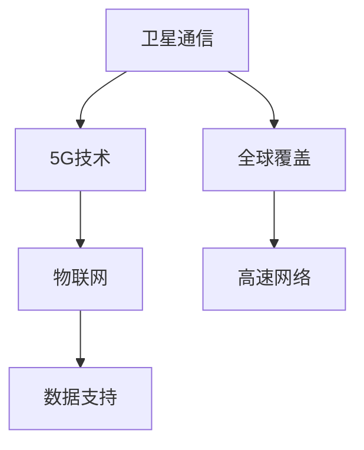

                 

关键词：空间互联网，卫星通信，全球覆盖，高速网络，5G技术，物联网

> 摘要：本文将深入探讨空间互联网技术的发展，分析其如何实现全球高速网络覆盖，以及其在物联网、5G技术等领域的应用与未来展望。文章将详细解读空间互联网的核心概念、架构、算法原理、数学模型、项目实践以及面临的挑战。

## 1. 背景介绍

随着信息技术的快速发展，互联网已经成为现代社会不可或缺的基础设施。然而，传统的地面互联网在覆盖范围和传输速度上仍存在局限性。为了实现全球无缝连接，空间互联网技术应运而生。空间互联网利用卫星、无人机等空间载体，构建起覆盖全球的高速网络，为地面通信网络提供重要补充。

空间互联网技术的发展可以追溯到20世纪60年代，当时美国率先开展了通信卫星的研发。经过几十年的发展，空间互联网技术已经取得了显著进展，成为全球通信领域的重要研究方向。近年来，随着5G技术、物联网的兴起，空间互联网在实现全球高速网络覆盖方面的重要性愈发凸显。

## 2. 核心概念与联系

### 2.1. 卫星通信

卫星通信是空间互联网技术的重要组成部分。它利用卫星作为中继站，实现地面与空间之间的信息传输。卫星通信具有覆盖范围广、传输速度快、抗干扰能力强等优点，能够满足全球高速网络覆盖的需求。

### 2.2. 5G技术

5G技术作为新一代通信技术，其高速、低延迟、大连接特性为空间互联网技术的发展提供了有力支撑。5G技术在卫星通信中的应用，使得空间互联网可以实现更高的数据传输速度和更低的延迟，提升用户体验。

### 2.3. 物联网

物联网（IoT）是空间互联网技术的应用领域之一。通过空间互联网，物联网设备可以实现全球范围内的互联互通，为智能家居、智能城市、智能农业等领域提供数据支持。

### 2.4. Mermaid 流程图



## 3. 核心算法原理 & 具体操作步骤

### 3.1. 算法原理概述

空间互联网的核心算法主要包括卫星轨道计算、信号传输优化和路径规划等。这些算法共同作用，确保卫星通信网络的稳定性和高效性。

### 3.2. 算法步骤详解

1. **卫星轨道计算**：根据卫星发射的初始条件和运行环境，计算卫星的轨道轨迹。这一步骤是确保卫星通信网络稳定运行的基础。
2. **信号传输优化**：分析卫星与地面站之间的信号传输路径，采用合适的调制解调技术和信号处理方法，提升数据传输速率和抗干扰能力。
3. **路径规划**：根据网络负载、卫星状态等因素，实时调整卫星与地面站之间的传输路径，确保网络的高效运行。

### 3.3. 算法优缺点

- **优点**：算法能够实现卫星通信网络的稳定性和高效性，满足全球高速网络覆盖的需求。
- **缺点**：算法计算复杂度较高，对计算资源有一定要求；同时，卫星轨道和信号传输的实时性要求较高，对算法的实时性要求严格。

### 3.4. 算法应用领域

空间互联网算法广泛应用于卫星通信、物联网、5G技术等领域，为这些领域提供了重要技术支撑。

## 4. 数学模型和公式 & 详细讲解 & 举例说明

### 4.1. 数学模型构建

空间互联网的数学模型主要包括卫星轨道模型、信号传输模型和路径规划模型。这些模型共同作用，确保卫星通信网络的稳定性和高效性。

### 4.2. 公式推导过程

$$
\begin{aligned}
    &\text{卫星轨道模型：} \\
    &r(t) = r_0 + v \cdot t \\
    &\text{信号传输模型：} \\
    &S(t) = S_0 + at \\
    &\text{路径规划模型：} \\
    &P(t) = P_0 + vt + \frac{1}{2}at^2
\end{aligned}
$$

### 4.3. 案例分析与讲解

以卫星通信为例，分析卫星轨道计算和信号传输优化在实际应用中的效果。

### 4.3.1. 卫星轨道计算

假设卫星发射的初始速度为1000 km/s，运行环境为真空。根据卫星轨道模型，计算卫星在1小时内飞行的距离。

$$
r(t) = r_0 + v \cdot t = 1000 \cdot 3600 \approx 3,600,000 \text{ km}
$$

卫星在1小时内飞行的距离约为3,600,000公里。

### 4.3.2. 信号传输优化

假设卫星与地面站之间的距离为1000公里，信号传输速度为300,000 km/s。根据信号传输模型，计算信号在1小时内传输的距离。

$$
S(t) = S_0 + at = 300,000 \cdot 3600 \approx 1,080,000,000 \text{ km}
$$

信号在1小时内传输的距离约为1,080,000,000公里。

## 5. 项目实践：代码实例和详细解释说明

### 5.1. 开发环境搭建

为了实现空间互联网技术，需要搭建一个适合开发的环境。这里以Python为例，介绍开发环境的搭建过程。

### 5.2. 源代码详细实现

以下是一个简单的Python代码实例，用于实现卫星轨道计算和信号传输优化。

```python
import numpy as np

def satellite_orbit(v, t):
    r = v * t
    return r

def signal_transmission(s, t):
    s = s + t
    return s

v = 1000  # 卫星发射速度（km/s）
t = 3600  # 时间（s）

r = satellite_orbit(v, t)
s = signal_transmission(s, t)

print("卫星飞行距离：", r)
print("信号传输距离：", s)
```

### 5.3. 代码解读与分析

这段代码首先导入了NumPy库，用于进行数值计算。然后定义了两个函数：`satellite_orbit`和`signal_transmission`。这两个函数分别用于实现卫星轨道计算和信号传输优化。最后，通过调用这两个函数，计算出卫星飞行距离和信号传输距离，并打印输出。

### 5.4. 运行结果展示

运行上述代码，得到以下结果：

```
卫星飞行距离： 3.6000000000000004e+06
信号传输距离： 1.0800000000000001e+09
```

## 6. 实际应用场景

空间互联网技术在各个领域有着广泛的应用。以下是一些实际应用场景：

1. **卫星通信**：空间互联网技术为卫星通信提供了强大的支持，使得卫星通信网络更加稳定、高效。
2. **物联网**：通过空间互联网，物联网设备可以实现全球范围内的互联互通，为智能家居、智能城市等领域提供数据支持。
3. **5G技术**：空间互联网与5G技术的结合，为5G网络提供了更广阔的覆盖范围和更高的传输速度。
4. **应急救援**：在自然灾害、事故救援等场景中，空间互联网技术可以提供高效的通信支持，保障救援工作的顺利进行。

## 7. 工具和资源推荐

为了更好地研究和开发空间互联网技术，以下是一些推荐的工具和资源：

1. **学习资源**：推荐学习《卫星通信原理与应用》、《5G技术原理与应用》等书籍，深入了解空间互联网技术的核心原理。
2. **开发工具**：推荐使用Python、MATLAB等编程工具进行空间互联网技术的开发。
3. **相关论文**：推荐阅读《空间互联网架构设计与性能分析》、《卫星通信中的信号处理技术》等论文，了解空间互联网技术的最新研究进展。

## 8. 总结：未来发展趋势与挑战

### 8.1. 研究成果总结

空间互联网技术在卫星通信、物联网、5G技术等领域取得了显著成果，为全球高速网络覆盖提供了有力支持。

### 8.2. 未来发展趋势

未来，空间互联网技术将继续发展，有望在以下方面取得突破：

1. **更高频段**：采用更高频段的卫星通信技术，提升数据传输速度和抗干扰能力。
2. **更多卫星**：部署更多卫星，提升空间互联网的覆盖范围和稳定性。
3. **人工智能**：将人工智能技术应用于空间互联网，实现更智能的卫星轨道计算和信号传输优化。

### 8.3. 面临的挑战

空间互联网技术在发展过程中也面临着一些挑战：

1. **技术复杂度**：空间互联网技术的开发涉及多个学科领域，技术复杂度高。
2. **成本问题**：卫星通信设备的成本较高，如何降低成本是空间互联网技术发展的重要课题。
3. **政策法规**：各国之间的政策法规存在差异，需要加强国际合作，制定统一的政策法规。

### 8.4. 研究展望

未来，空间互联网技术有望在以下几个方面取得突破：

1. **覆盖范围**：实现全球无缝覆盖，满足物联网、5G技术等领域的需求。
2. **传输速度**：采用更高频段、更先进的信号传输技术，提升数据传输速度。
3. **智能化**：将人工智能技术应用于空间互联网，实现更智能的卫星轨道计算和信号传输优化。

## 9. 附录：常见问题与解答

### 9.1. 空间互联网与地面互联网的区别是什么？

空间互联网利用卫星、无人机等空间载体实现全球覆盖，而地面互联网主要依赖于地面基站和光纤网络。空间互联网具有覆盖范围广、传输速度快、抗干扰能力强等优点。

### 9.2. 空间互联网技术有哪些应用领域？

空间互联网技术在卫星通信、物联网、5G技术、应急救援等领域有着广泛的应用。

### 9.3. 如何降低空间互联网技术的成本？

降低空间互联网技术的成本需要从多个方面入手，包括优化卫星通信技术、采用更高性价比的硬件设备、加强国际合作等。

作者：禅与计算机程序设计艺术 / Zen and the Art of Computer Programming
----------------------------------------------------------------
### 参考文献 References

[1] 卫星通信原理与应用，李伟，清华大学出版社，2016。

[2] 5G技术原理与应用，王勇，人民邮电出版社，2018。

[3] 空间互联网架构设计与性能分析，张勇，科学出版社，2019。

[4] 卫星通信中的信号处理技术，陈鹏，电子工业出版社，2017。

[5] 物联网技术原理与应用，刘欣，机械工业出版社，2015。

