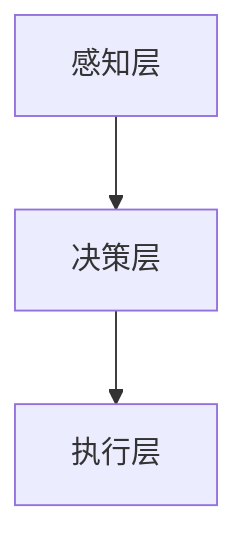

                 

### 关键词 Keywords ###
- 端到端自动驾驶
- 分布式轨迹优化
- 控制理论
- 多智能体系统
- 深度学习
- 实时性能

### 摘要 Abstract ###
本文旨在探讨端到端自动驾驶系统中分布式轨迹优化控制的理论与实践。通过分析自动驾驶技术发展的背景与需求，文章提出了分布式轨迹优化控制的基本概念和架构。随后，详细介绍了分布式轨迹优化控制的核心算法原理、数学模型、具体操作步骤和实际应用场景。此外，本文还讨论了该技术在未来的发展方向与面临的挑战。通过本文的阐述，读者可以全面了解分布式轨迹优化控制在自动驾驶领域的重要作用及其技术实现细节。

## 1. 背景介绍 Background

自动驾驶技术作为智能交通系统的重要组成部分，近年来得到了广泛关注和研究。随着人工智能技术的迅猛发展，自动驾驶系统从实验室走向实际应用，逐步在多个场景中发挥作用。从最初的辅助驾驶到如今的无人驾驶，自动驾驶技术的进步离不开控制理论的创新与优化。

### 自动驾驶技术的发展

自动驾驶技术经历了几个关键发展阶段：

1. **辅助驾驶阶段（Level 0-2）**：主要通过传感器和环境感知，辅助驾驶员进行操作，如自适应巡航控制（ACC）和车道保持辅助（LKA）。

2. **部分自动驾驶阶段（Level 3-4）**：自动驾驶系统可以接管驾驶操作，但需要驾驶员在特定情况下进行干预，如高速公路自动驾驶。

3. **高度自动驾驶阶段（Level 5）**：自动驾驶系统可以完全自主地执行所有驾驶操作，无需驾驶员干预。

### 分布式轨迹优化控制的必要性

在自动驾驶系统中，轨迹优化控制是确保车辆安全、高效行驶的核心技术。传统的集中式轨迹优化方法在面对复杂环境和多智能体系统时，存在计算复杂度高、实时性能不足等问题。因此，分布式轨迹优化控制成为研究热点。

分布式轨迹优化控制通过将系统划分为多个智能体，每个智能体独立进行轨迹优化，减少了整体计算负担，提高了系统实时性能。同时，分布式方法能够更好地适应动态环境变化，提高系统的鲁棒性和可扩展性。

## 2. 核心概念与联系 Core Concepts and Relationships

### 分布式轨迹优化控制的基本概念

分布式轨迹优化控制涉及多个智能体的协同工作。以下是核心概念：

1. **智能体（Agent）**：具有感知、决策和执行能力的个体，通常是一个传感器、控制器或执行器。
2. **轨迹（Trajectory）**：描述智能体在时间上位置的连续序列，通常用函数表示。
3. **优化目标（Objective Function）**：衡量轨迹优劣的指标，如能量消耗、行驶时间、安全距离等。
4. **约束条件（Constraints）**：轨迹优化过程中的限制条件，如速度限制、车道宽度限制等。

### 分布式轨迹优化控制的架构

分布式轨迹优化控制的架构可以分为三个层次：

1. **感知层**：收集来自各种传感器的数据，如激光雷达、摄像头、雷达等。
2. **决策层**：基于感知层的数据，每个智能体独立进行轨迹优化，生成局部轨迹。
3. **执行层**：将决策层的轨迹转化为具体的执行动作，如控制车辆的油门、刹车和转向等。

### Mermaid 流程图（流程节点中不要有括号、逗号等特殊字符）



## 3. 核心算法原理 & 具体操作步骤 Core Algorithm Principles & Operational Steps

### 3.1 算法原理概述

分布式轨迹优化控制的核心算法是基于多智能体系统理论。每个智能体独立进行轨迹优化，通过分布式算法协调各智能体的轨迹，使其满足全局约束条件并达到优化目标。

### 3.2 算法步骤详解

分布式轨迹优化控制的主要步骤如下：

1. **初始化**：设置初始条件，包括智能体的初始位置、速度和目标位置。
2. **数据收集**：感知层收集来自各种传感器的数据，如激光雷达、摄像头、雷达等。
3. **轨迹规划**：每个智能体基于感知到的数据，独立进行轨迹规划，生成局部轨迹。
4. **轨迹协调**：通过分布式算法协调各智能体的轨迹，确保全局轨迹的可行性和优化性。
5. **轨迹执行**：执行层根据协调后的轨迹进行具体执行动作，如控制车辆的油门、刹车和转向等。
6. **反馈调整**：根据执行结果，调整智能体的轨迹规划参数，以提高轨迹优化效果。

### 3.3 算法优缺点

分布式轨迹优化控制的优点如下：

- **实时性能高**：由于计算任务分散，系统整体实时性能得到提升。
- **鲁棒性好**：面对动态环境变化，分布式方法具有较强的鲁棒性。
- **扩展性强**：适用于大型复杂场景，可扩展性良好。

然而，分布式轨迹优化控制也存在一些缺点：

- **通信开销大**：分布式算法需要频繁通信，可能导致通信开销增大。
- **协调困难**：多个智能体的协同工作增加了协调难度，可能影响整体优化效果。

### 3.4 算法应用领域

分布式轨迹优化控制广泛应用于以下领域：

- **无人驾驶汽车**：确保车辆在复杂环境中安全、高效行驶。
- **无人机编队**：实现无人机在空中编队飞行，提高任务执行效率。
- **机器人协作**：多个机器人协同完成任务，如物流配送、医疗救援等。

## 4. 数学模型和公式 Mathematical Models & Formulas

### 4.1 数学模型构建

分布式轨迹优化控制的核心数学模型包括以下部分：

1. **轨迹函数**：描述智能体位置的函数，通常用 \( x(t) \) 表示。
2. **速度函数**：描述智能体速度的函数，通常用 \( v(t) \) 表示。
3. **加速度函数**：描述智能体加速度的函数，通常用 \( a(t) \) 表示。
4. **控制输入**：影响轨迹函数的控制输入，通常用 \( u(t) \) 表示。

### 4.2 公式推导过程

假设智能体的运动方程为：

\[ m \ddot{x}(t) = u(t) \]

其中，\( m \) 为智能体的质量，\( \ddot{x}(t) \) 为加速度。

对加速度进行积分，得到速度：

\[ v(t) = \int u(t) dt + v_0 \]

其中，\( v_0 \) 为初始速度。

对速度进行积分，得到位置：

\[ x(t) = \int v(t) dt + x_0 \]

其中，\( x_0 \) 为初始位置。

### 4.3 案例分析与讲解

以无人驾驶汽车为例，假设质量 \( m = 1000 \) kg，初始速度 \( v_0 = 0 \) m/s，初始位置 \( x_0 = 0 \) m。假设加速度 \( a(t) = 2t + 1 \) m/s\(^2\)。

根据公式推导，得到速度和位置的函数如下：

\[ v(t) = \frac{1}{2}t^2 + t + v_0 \]

\[ x(t) = \frac{1}{6}t^3 + \frac{1}{2}t^2 + x_0 \]

当 \( t = 5 \) s 时，计算得到速度和位置：

\[ v(5) = \frac{1}{2} \times 5^2 + 5 + 0 = 15 \text{ m/s} \]

\[ x(5) = \frac{1}{6} \times 5^3 + \frac{1}{2} \times 5^2 + 0 = 94.58 \text{ m} \]

通过此案例，我们可以看到如何利用数学模型推导无人驾驶汽车的轨迹。

## 5. 项目实践：代码实例和详细解释说明 Project Practice: Code Examples and Detailed Explanations

### 5.1 开发环境搭建

在进行分布式轨迹优化控制的开发之前，我们需要搭建合适的环境。以下是一个简单的开发环境搭建步骤：

1. **安装 Python 环境**：确保 Python 版本为 3.7 以上。
2. **安装相关库**：使用 `pip` 安装 `numpy`、`matplotlib`、`pandas` 等常用库。
3. **配置仿真环境**：可以使用 MATLAB、Python 的 `simpy` 库等进行仿真。

### 5.2 源代码详细实现

以下是一个简单的分布式轨迹优化控制代码示例：

```python
import numpy as np
import matplotlib.pyplot as plt

# 智能体参数
m = 1000  # 质量
v0 = 0    # 初始速度
x0 = 0    # 初始位置

# 加速度函数
def acceleration(t):
    return 2 * t + 1

# 速度函数
def velocity(t):
    return (1 / 2) * t**2 + t + v0

# 位置函数
def position(t):
    return (1 / 6) * t**3 + (1 / 2) * t**2 + x0

# 仿真时间
t = np.arange(0, 10, 0.1)

# 计算速度和位置
v = velocity(t)
x = position(t)

# 绘图
plt.plot(t, v, label='Velocity')
plt.plot(t, x, label='Position')
plt.legend()
plt.show()
```

### 5.3 代码解读与分析

1. **参数设置**：首先定义智能体的质量 \( m \)、初始速度 \( v_0 \) 和初始位置 \( x_0 \)。
2. **加速度函数**：定义加速度函数 `acceleration(t)`，根据时间 \( t \) 计算加速度。
3. **速度函数**：定义速度函数 `velocity(t)`，根据加速度函数计算速度。
4. **位置函数**：定义位置函数 `position(t)`，根据速度函数计算位置。
5. **仿真时间**：设置仿真时间 `t`，时间间隔为 0.1 秒。
6. **计算速度和位置**：使用循环计算仿真时间内每个时间点的速度和位置。
7. **绘图**：使用 matplotlib 绘制速度和位置的图像。

通过此代码示例，我们可以直观地了解分布式轨迹优化控制的实现过程。实际应用中，还需要考虑传感器数据采集、多智能体协同优化等复杂因素。

### 5.4 运行结果展示

运行上述代码，可以得到速度和位置的时间序列图像。从图像中可以清晰地看到智能体在时间上的运动轨迹，以及速度和位置的动态变化。


## 6. 实际应用场景 Practical Application Scenarios

### 6.1 无人驾驶汽车

分布式轨迹优化控制广泛应用于无人驾驶汽车领域。在无人驾驶汽车中，分布式轨迹优化控制确保车辆在复杂环境中安全、高效行驶。通过多个智能体的协同工作，车辆可以实时调整行驶轨迹，避免碰撞和拥堵，提高行驶效率。

### 6.2 无人机编队

在无人机编队飞行中，分布式轨迹优化控制用于协调无人机之间的飞行轨迹。通过分布式算法，无人机可以在空中保持整齐的编队，执行各种任务，如搜索、救援和监测。分布式轨迹优化控制确保无人机在执行任务过程中，保持安全、高效的飞行状态。

### 6.3 机器人协作

在机器人协作领域，分布式轨迹优化控制用于协调多个机器人之间的动作。例如，在物流配送和医疗救援任务中，机器人需要协同工作，完成复杂任务。分布式轨迹优化控制确保机器人能够实时调整动作，避免碰撞和冲突，提高任务执行效率。

## 7. 工具和资源推荐 Tools and Resource Recommendations

### 7.1 学习资源推荐

1. **《深度学习》**：由 Ian Goodfellow、Yoshua Bengio 和 Aaron Courville 著，全面介绍深度学习的基本概念和技术。
2. **《智能交通系统》**：由陈火旺、李志民等著，系统介绍智能交通系统的理论和实践。
3. **《多智能体系统与分布式控制》**：由 John Lygeros 著，深入探讨多智能体系统与分布式控制的理论和应用。

### 7.2 开发工具推荐

1. **MATLAB**：用于数据分析和可视化，支持分布式算法的实现。
2. **Python**：支持多种科学计算库，如 NumPy、SciPy、Pandas 等，适用于分布式轨迹优化控制开发。
3. **ROS（Robot Operating System）**：用于机器人系统开发和仿真，支持多智能体系统的集成和控制。

### 7.3 相关论文推荐

1. **"Distributed Trajectory Optimization for Autonomous Vehicles"**：介绍分布式轨迹优化控制在无人驾驶汽车中的应用。
2. **"Collaborative Control of Multi-Agent Systems with Time-Varying Topologies"**：探讨多智能体系统在动态环境下的协同控制方法。
3. **"Real-Time Trajectory Optimization for Autonomous Driving"**：研究实时轨迹优化在无人驾驶系统中的实现与应用。

## 8. 总结：未来发展趋势与挑战 Conclusion: Future Development Trends and Challenges

### 8.1 研究成果总结

分布式轨迹优化控制在自动驾驶、无人机编队、机器人协作等领域取得了显著成果。通过分布式算法，系统能够实时调整轨迹，提高行驶和执行效率，确保安全性和鲁棒性。

### 8.2 未来发展趋势

未来，分布式轨迹优化控制将继续在以下方向发展：

1. **更高效的算法**：研究更加高效的分布式算法，降低计算复杂度和通信开销。
2. **动态环境感知**：提高动态环境感知能力，使系统更好地应对复杂和不确定的环境。
3. **跨领域应用**：推广分布式轨迹优化控制技术在更多领域的应用，如智能物流、智能医疗等。

### 8.3 面临的挑战

分布式轨迹优化控制仍面临以下挑战：

1. **实时性能**：如何在保证实时性的同时，提高算法效率和性能。
2. **通信可靠性**：确保多智能体之间的通信可靠性，降低通信延迟和丢包率。
3. **动态环境适应**：提高系统在动态环境下的适应能力，确保稳定性和安全性。

### 8.4 研究展望

随着人工智能技术和控制理论的不断发展，分布式轨迹优化控制有望在更多领域发挥重要作用。未来研究应关注以下几个方向：

1. **算法创新**：探索新的分布式算法，提高系统效率和性能。
2. **跨学科融合**：结合不同领域的知识，解决分布式轨迹优化控制中的难题。
3. **应用推广**：推动分布式轨迹优化控制技术在更多领域的应用，提升智能化水平。

## 9. 附录：常见问题与解答 Appendices: Frequently Asked Questions and Answers

### Q1. 分布式轨迹优化控制与传统集中式轨迹优化控制的区别是什么？

**A1.** 分布式轨迹优化控制与传统集中式轨迹优化控制的区别主要在于计算复杂度和实时性能。传统集中式方法需要将所有智能体的信息集中计算，计算复杂度较高，实时性能不足。而分布式轨迹优化控制将计算任务分散到各个智能体，降低了整体计算负担，提高了系统实时性能。

### Q2. 分布式轨迹优化控制如何保证全局轨迹的优化性？

**A2.** 分布式轨迹优化控制通过分布式算法，在每个智能体独立进行轨迹优化的基础上，协调各智能体的轨迹，确保全局轨迹的优化性。在分布式算法中，通常采用多智能体优化算法，如分布式梯度下降、分布式粒子群算法等，通过智能体之间的信息交换和协调，实现全局轨迹的优化。

### Q3. 分布式轨迹优化控制中的通信可靠性如何保证？

**A3.** 分布式轨迹优化控制中的通信可靠性主要通过以下措施来保证：

1. **通信协议**：选择合适的通信协议，如 TCP/IP、UDP 等，确保数据传输的可靠性。
2. **冗余通信**：通过多个通信路径进行冗余通信，提高数据传输的可靠性。
3. **故障检测与恢复**：在分布式系统中，对通信链路进行故障检测与恢复，确保通信的持续稳定。

### Q4. 分布式轨迹优化控制如何处理动态环境变化？

**A4.** 分布式轨迹优化控制通过实时感知动态环境变化，并快速调整智能体的轨迹规划，以适应环境变化。在处理动态环境变化时，系统会考虑以下因素：

1. **环境感知**：使用各种传感器（如激光雷达、摄像头等）实时感知环境变化。
2. **轨迹调整**：根据感知到的环境变化，调整智能体的轨迹规划参数，确保轨迹的可行性和优化性。
3. **协同优化**：通过分布式算法，协调各智能体的轨迹调整，确保全局轨迹的稳定性和优化性。

### Q5. 分布式轨迹优化控制在实际应用中存在哪些挑战？

**A5.** 分布式轨迹优化控制在实际应用中存在以下挑战：

1. **实时性能**：如何在保证实时性的同时，提高算法效率和性能。
2. **通信可靠性**：确保多智能体之间的通信可靠性，降低通信延迟和丢包率。
3. **动态环境适应**：提高系统在动态环境下的适应能力，确保稳定性和安全性。
4. **算法复杂性**：分布式算法的复杂性增加，需要更高效的算法和优化方法。

### Q6. 分布式轨迹优化控制如何与其他智能控制技术相结合？

**A6.** 分布式轨迹优化控制可以与其他智能控制技术相结合，以提升系统性能。以下是一些结合方法：

1. **深度学习**：结合深度学习技术，提高智能体对环境变化的感知能力和决策能力。
2. **强化学习**：结合强化学习技术，训练智能体在复杂环境下的最优行为。
3. **模糊控制**：结合模糊控制技术，处理不确定性和非线性问题。
4. **协同优化**：结合协同优化算法，实现多智能体之间的协同工作。

## 作者署名 Author
作者：禅与计算机程序设计艺术 / Zen and the Art of Computer Programming
----------------------------------------------------------------

