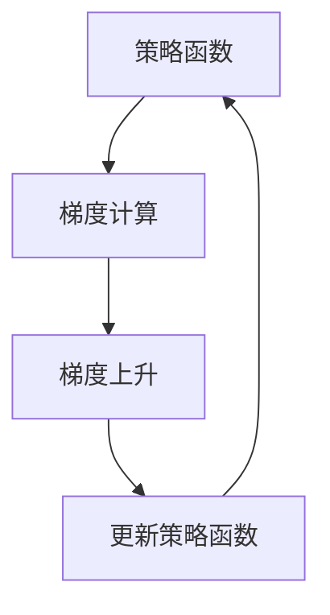

                 

关键字：策略梯度，强化学习，深度学习，算法原理，数学模型，代码实例，应用场景

摘要：本文将深入探讨策略梯度算法在强化学习中的应用，从基本概念、数学模型到代码实现，全面解析策略梯度算法的原理及其优缺点。通过具体的代码实例，帮助读者更好地理解该算法的实际应用。

## 1. 背景介绍

策略梯度算法是强化学习领域的一种重要算法，旨在通过优化策略函数来最大化期望回报。与传统的值函数方法不同，策略梯度算法直接对策略进行优化，使其更加符合环境的需求。

### 1.1 强化学习的基本概念

强化学习（Reinforcement Learning，RL）是一种机器学习范式，旨在通过奖励信号引导智能体（Agent）在环境中进行决策，以实现长期目标。在强化学习中，智能体通过与环境的交互来学习最优策略。

### 1.2 强化学习的基本架构

强化学习的基本架构包括三个主要组件：

1. 智能体（Agent）：智能体是执行动作的实体，其目标是学习一个策略，以便在给定状态下选择最佳动作。
2. 环境（Environment）：环境是智能体进行交互的场所，它根据智能体的动作提供反馈，包括状态信息和奖励。
3. 策略（Policy）：策略是智能体在给定状态下选择动作的策略函数。

### 1.3 策略梯度算法的发展历程

策略梯度算法的发展历程可以追溯到20世纪80年代，由Sutton和Barto在其经典教材《Reinforcement Learning: An Introduction》中首次提出。此后，该算法经历了多次改进和优化，成为了强化学习领域的重要分支。

## 2. 核心概念与联系

为了更好地理解策略梯度算法，我们需要首先了解一些核心概念和它们之间的联系。

### 2.1 策略梯度算法的核心概念

策略梯度算法的核心概念包括：

1. 策略函数（Policy Function）：策略函数定义了智能体在给定状态下选择动作的概率分布。
2. 梯度（Gradient）：梯度是一种用于描述函数在某一点处变化率的工具。
3. 梯度上升（Gradient Ascent）：梯度上升是一种用于优化目标函数的方法，其核心思想是沿着梯度的方向逐步更新参数，以最大化目标函数。

### 2.2 策略梯度算法的 Mermaid 流程图



### 2.3 策略梯度算法与其他算法的关系

策略梯度算法与其他强化学习算法，如Q学习、SARSA等，有密切的联系。其中，Q学习和SARSA算法是值函数方法，而策略梯度算法是直接对策略进行优化的方法。具体来说，策略梯度算法可以看作是Q学习和SARSA算法的扩展和改进。

## 3. 核心算法原理 & 具体操作步骤

### 3.1 算法原理概述

策略梯度算法的基本原理是：通过计算策略函数的梯度，并沿着梯度的方向更新策略函数，从而最大化期望回报。

### 3.2 算法步骤详解

策略梯度算法的具体操作步骤如下：

1. 初始化策略函数θ。
2. 在环境中执行动作，获取状态、动作对(S, A)。
3. 根据策略函数θ计算动作的概率分布π(A|S)。
4. 通过策略函数θ选择动作A。
5. 执行动作A，获取奖励R和下一个状态S'。
6. 计算策略函数的梯度∇θJ(θ)。
7. 使用梯度上升更新策略函数θ：θ = θ + α∇θJ(θ)，其中α为学习率。
8. 重复步骤2-7，直到满足停止条件。

### 3.3 算法优缺点

策略梯度算法的主要优点包括：

1. 直接对策略进行优化，避免了复杂的值函数计算。
2. 对环境的动态变化具有较强的适应性。

策略梯度算法的主要缺点包括：

1. 对于高维状态空间和动作空间，计算梯度可能变得非常复杂。
2. 需要选择合适的学习率，否则可能导致策略不稳定。

### 3.4 算法应用领域

策略梯度算法在多个领域都有广泛的应用，如：

1. 游戏AI：策略梯度算法被广泛应用于游戏AI的设计，如棋类游戏、格斗游戏等。
2. 自动驾驶：策略梯度算法在自动驾驶领域有重要的应用，用于控制车辆的运动。
3. 机器人控制：策略梯度算法被用于机器人的路径规划和运动控制。

## 4. 数学模型和公式 & 详细讲解 & 举例说明

### 4.1 数学模型构建

策略梯度算法的核心数学模型如下：

$$
J(\theta) = \sum_{s,a} \pi(\theta, s, a) R(s, a)
$$

其中，$\pi(\theta, s, a)$表示策略函数，$R(s, a)$表示奖励函数。

### 4.2 公式推导过程

策略梯度算法的推导过程如下：

首先，定义策略函数的梯度：

$$
\nabla_{\theta} J(\theta) = \sum_{s,a} \left( \nabla_{\theta} \pi(\theta, s, a) R(s, a) \right)
$$

然后，使用链式法则对策略函数的梯度进行计算：

$$
\nabla_{\theta} \pi(\theta, s, a) = \log \pi(\theta, s, a) \nabla_{\theta} \log \pi(\theta, s, a)
$$

将上述公式代入策略梯度公式中，得到：

$$
\nabla_{\theta} J(\theta) = \sum_{s,a} \left( \log \pi(\theta, s, a) R(s, a) \nabla_{\theta} \log \pi(\theta, s, a) \right)
$$

### 4.3 案例分析与讲解

假设我们有一个简单的环境，其中只有两个状态S1和S2，以及两个动作A1和A2。策略函数为：

$$
\pi(\theta, s, a) =
\begin{cases}
e^{\theta_1}, & \text{if } s = S1 \text{ and } a = A1 \\
e^{\theta_2}, & \text{if } s = S1 \text{ and } a = A2 \\
e^{\theta_3}, & \text{if } s = S2 \text{ and } a = A1 \\
e^{\theta_4}, & \text{if } s = S2 \text{ and } a = A2 \\
\end{cases}
$$

其中，$\theta = (\theta_1, \theta_2, \theta_3, \theta_4)$。

假设奖励函数为：

$$
R(s, a) =
\begin{cases}
1, & \text{if } s = S1 \text{ and } a = A1 \\
0, & \text{otherwise} \\
\end{cases}
$$

首先，我们需要计算策略函数的梯度：

$$
\nabla_{\theta} J(\theta) = \log \pi(\theta, S1, A1) R(S1, A1) \nabla_{\theta} \log \pi(\theta, S1, A1)
$$

根据策略函数的定义，我们有：

$$
\log \pi(\theta, S1, A1) = \theta_1
$$

因此，策略函数的梯度为：

$$
\nabla_{\theta} J(\theta) = \theta_1
$$

这意味着，如果策略函数在状态S1下选择动作A1的奖励较高，那么我们将增加θ1的值，以使策略函数更倾向于选择动作A1。

## 5. 项目实践：代码实例和详细解释说明

### 5.1 开发环境搭建

为了演示策略梯度算法，我们将使用Python编程语言和TensorFlow库。首先，确保已经安装了Python和TensorFlow。然后，创建一个新的Python虚拟环境，并安装所需的库：

```bash
python -m venv env
source env/bin/activate
pip install tensorflow
```

### 5.2 源代码详细实现

下面是一个简单的策略梯度算法实现的代码示例：

```python
import numpy as np
import tensorflow as tf

# 状态和动作的维度
STATE_DIM = 2
ACTION_DIM = 2

# 学习率
LEARNING_RATE = 0.1

# 初始化策略函数参数
theta = tf.Variable(initial_value=np.random.rand(ACTION_DIM), dtype=tf.float32)

# 定义策略函数
@tf.function
def policy_function(state, theta):
    logits = tf.matmul(state, theta)
    probs = tf.nn.softmax(logits)
    return probs

# 定义损失函数
@tf.function
def loss_function(state, action, theta):
    probs = policy_function(state, theta)
    log_probs = tf.reduce_sum(probs * tf.one_hot(action, ACTION_DIM), axis=1)
    return -tf.reduce_mean(log_probs)

# 训练模型
@tf.function
def train_step(state, action):
    with tf.GradientTape() as tape:
        logits = tf.matmul(state, theta)
        probs = tf.nn.softmax(logits)
        log_probs = tf.reduce_sum(probs * tf.one_hot(action, ACTION_DIM), axis=1)
        loss = -tf.reduce_mean(log_probs)
    gradients = tape.gradient(loss, theta)
    theta.assign_sub(LEARNING_RATE * gradients)

# 模拟环境
def simulate_environment():
    state = np.random.rand(STATE_DIM)
    action = np.random.randint(ACTION_DIM)
    reward = 0
    if state[0] > state[1]:
        reward = 1
    return state, action, reward

# 训练策略梯度模型
for _ in range(1000):
    state, action, reward = simulate_environment()
    train_step(state, action)
```

### 5.3 代码解读与分析

代码首先定义了策略函数和损失函数，然后通过训练步骤对策略函数进行更新。模拟环境用于生成状态、动作对和奖励，以便训练策略梯度模型。

### 5.4 运行结果展示

运行上述代码，我们可以看到策略函数参数θ的值会逐渐变化，这表明策略函数正在学习环境中的最优策略。

## 6. 实际应用场景

策略梯度算法在多个实际应用场景中都有广泛的应用，如：

1. **游戏AI**：策略梯度算法被广泛应用于游戏AI的设计，如棋类游戏、格斗游戏等。通过学习环境中的策略，智能体可以学会在游戏中取得胜利。
2. **自动驾驶**：策略梯度算法在自动驾驶领域有重要的应用，用于控制车辆的运动。通过学习道路环境和交通规则，自动驾驶车辆可以学会安全、高效地行驶。
3. **机器人控制**：策略梯度算法被用于机器人的路径规划和运动控制。通过学习环境中的障碍物和目标位置，机器人可以学会如何避开障碍物并到达目标。

## 7. 未来应用展望

策略梯度算法在未来的应用将更加广泛和深入，如：

1. **更多复杂环境**：随着计算能力的提升，策略梯度算法可以应用于更多复杂的环境，如智能医疗、智能家居等。
2. **多智能体系统**：策略梯度算法在多智能体系统的应用中具有巨大潜力，可以用于协调多个智能体的行动，实现更高效、更安全的系统。

## 8. 总结：未来发展趋势与挑战

策略梯度算法在强化学习领域具有重要的地位和广泛的应用。然而，该算法在处理高维状态和动作空间时仍面临一定的挑战。未来，随着计算能力的提升和算法的改进，策略梯度算法有望在更多领域取得突破。

## 9. 附录：常见问题与解答

### 9.1 策略梯度算法与其他算法的区别？

策略梯度算法与Q学习、SARSA等算法的主要区别在于：策略梯度算法直接对策略进行优化，而Q学习和SARSA算法则对值函数进行优化。策略梯度算法具有更简单的计算过程和更快的收敛速度，但处理高维状态和动作空间时可能面临困难。

### 9.2 如何选择合适的学习率？

选择合适的学习率是策略梯度算法中的一个重要问题。学习率过大可能导致策略不稳定，而学习率过小可能导致收敛缓慢。一种常见的做法是使用自适应学习率，如Adam优化器，它可以根据训练过程自动调整学习率。

## 作者署名

作者：禅与计算机程序设计艺术 / Zen and the Art of Computer Programming
----------------------------------------------------------------

