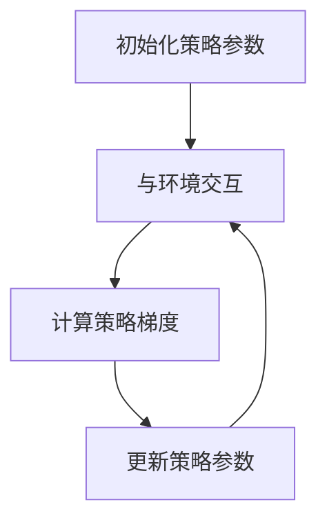
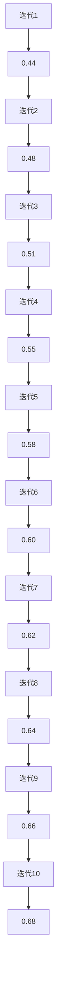
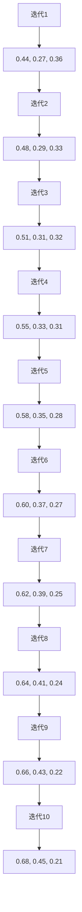
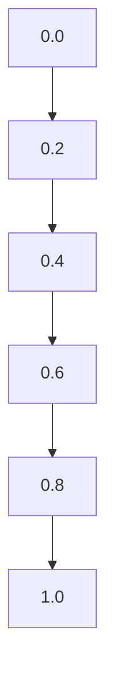

                 

在人工智能的领域，策略梯度（Policy Gradient）算法是一个重要的概念，它在强化学习领域中扮演着核心的角色。策略梯度算法的核心思想是通过优化策略来最大化回报。本文将深入探讨策略梯度算法的原理、数学模型、应用领域以及如何进行实际操作。

## 关键词

- 策略梯度
- 强化学习
- 回报优化
- 策略网络
- 无模型方法

## 摘要

本文将详细介绍策略梯度算法，首先从背景介绍开始，解释策略梯度算法的重要性。然后，我们将深入探讨策略梯度算法的核心概念和联系，包括策略梯度算法的原理和步骤。接着，我们将分析算法的优缺点以及它应用的领域。在数学模型和公式部分，我们将详细讲解策略梯度的数学模型和公式推导过程，并通过案例进行分析和讲解。随后，我们将展示如何通过代码实例来实践策略梯度算法。最后，我们将讨论实际应用场景、未来应用展望、工具和资源推荐以及总结未来发展趋势和挑战。

## 1. 背景介绍

### 强化学习的基本概念

强化学习是机器学习的一个分支，其核心目标是让智能体（agent）在与环境（environment）交互的过程中，通过不断学习和决策，达到某个目标或最优策略。在强化学习中，智能体需要通过尝试不同的动作（action）来获取奖励（reward），并通过学习机制来调整其策略（policy）。

强化学习通常分为基于模型的（model-based）和基于无模型的（model-free）两大类。基于模型的方法通过建立环境模型来预测未来状态和奖励，从而优化策略。而无模型方法则不依赖于环境模型，而是直接从与环境的交互中学习策略。

### 策略梯度算法的重要性

策略梯度算法是无模型强化学习中的重要方法之一，它通过直接优化策略来最大化累积回报。策略梯度算法的核心优势在于无需构建环境模型，这使得它在处理复杂环境时尤为有效。此外，策略梯度算法能够自适应地调整策略，从而在探索和利用之间找到平衡。

在深度学习中，策略梯度算法与深度神经网络相结合，形成了深度策略梯度（Deep Policy Gradient）算法。这种结合使得策略梯度算法在处理高维数据时表现尤为出色，成为许多复杂任务如自动驾驶、游戏AI等的首选算法。

### 策略梯度算法的应用领域

策略梯度算法在许多领域都有广泛的应用，以下是一些典型的应用领域：

- **游戏AI**：策略梯度算法被广泛应用于游戏AI中，如电子游戏、棋类游戏等。通过学习玩家的行为模式，算法能够生成智能的对手。
- **机器人控制**：在机器人控制领域，策略梯度算法能够帮助机器人学习如何在复杂环境中进行导航和任务执行。
- **金融交易**：策略梯度算法在金融交易策略优化中也有应用，通过学习市场数据和历史交易信息，算法能够生成高效的交易策略。
- **推荐系统**：在推荐系统中，策略梯度算法可以用于优化推荐策略，提高用户的满意度和点击率。

## 2. 核心概念与联系

### 策略梯度算法的基本原理

策略梯度算法的核心思想是通过优化策略函数来最大化累积回报。具体来说，它使用梯度上升法来更新策略参数，以期望提高累积回报。

策略梯度算法的基本原理可以概括为以下步骤：

1. **初始化策略参数**：首先，初始化策略参数，这些参数定义了智能体在不同状态下的动作概率。
2. **与环境交互**：智能体在环境中执行动作，并获取奖励和下一状态。
3. **计算策略梯度**：根据累积回报和策略函数，计算策略梯度，即策略参数的更新方向。
4. **更新策略参数**：使用策略梯度来更新策略参数，从而优化策略。

### 策略梯度算法的数学模型

策略梯度算法的数学模型是理解算法原理的关键。以下是策略梯度算法的数学模型和公式：

$$
J(\theta) = \sum_s p(s) \cdot \nabla_\theta \log p(s)
$$

其中，$J(\theta)$ 表示累积回报，$\theta$ 表示策略参数，$s$ 表示状态，$p(s)$ 表示状态概率，$\nabla_\theta \log p(s)$ 表示策略梯度。

### 策略梯度算法的架构

为了更好地理解策略梯度算法，我们可以使用 Mermaid 流程图来展示其架构：



在这个流程图中，A表示初始化策略参数，B表示与环境交互，C表示计算策略梯度，D表示更新策略参数。这个流程不断重复，直到达到某个停止条件，如策略收敛或达到最大迭代次数。

### 策略梯度算法的优缺点

**优点**：

- **无需环境模型**：策略梯度算法不依赖于环境模型，这使得它在处理复杂环境时更为灵活。
- **自适应调整策略**：算法能够自适应地调整策略，以最大化累积回报。
- **适用于高维数据**：策略梯度算法与深度神经网络结合，能够处理高维数据，适用于复杂任务。

**缺点**：

- **收敛速度慢**：策略梯度算法的收敛速度可能较慢，特别是在高维空间中。
- **容易陷入局部最优**：在优化过程中，算法可能陷入局部最优，从而无法找到全局最优解。

### 策略梯度算法的应用领域

策略梯度算法在以下领域有广泛应用：

- **游戏AI**：策略梯度算法在游戏AI中应用广泛，如电子游戏、棋类游戏等。
- **机器人控制**：策略梯度算法在机器人控制领域有应用，如导航和任务执行。
- **金融交易**：策略梯度算法在金融交易策略优化中有应用，如交易策略的优化。
- **推荐系统**：策略梯度算法在推荐系统中应用，如优化推荐策略。

## 3. 核心算法原理 & 具体操作步骤

### 3.1 算法原理概述

策略梯度算法的核心思想是通过优化策略来最大化累积回报。具体来说，它使用梯度上升法来更新策略参数，以期望提高累积回报。

### 3.2 算法步骤详解

1. **初始化策略参数**：首先，初始化策略参数，这些参数定义了智能体在不同状态下的动作概率。
2. **与环境交互**：智能体在环境中执行动作，并获取奖励和下一状态。
3. **计算策略梯度**：根据累积回报和策略函数，计算策略梯度，即策略参数的更新方向。
4. **更新策略参数**：使用策略梯度来更新策略参数，从而优化策略。
5. **重复步骤2-4**：重复与环境交互、计算策略梯度和更新策略参数的过程，直到达到某个停止条件，如策略收敛或达到最大迭代次数。

### 3.3 算法优缺点

**优点**：

- **无需环境模型**：策略梯度算法不依赖于环境模型，这使得它在处理复杂环境时更为灵活。
- **自适应调整策略**：算法能够自适应地调整策略，以最大化累积回报。
- **适用于高维数据**：策略梯度算法与深度神经网络结合，能够处理高维数据，适用于复杂任务。

**缺点**：

- **收敛速度慢**：策略梯度算法的收敛速度可能较慢，特别是在高维空间中。
- **容易陷入局部最优**：在优化过程中，算法可能陷入局部最优，从而无法找到全局最优解。

### 3.4 算法应用领域

策略梯度算法在以下领域有广泛应用：

- **游戏AI**：策略梯度算法在游戏AI中应用广泛，如电子游戏、棋类游戏等。
- **机器人控制**：策略梯度算法在机器人控制领域有应用，如导航和任务执行。
- **金融交易**：策略梯度算法在金融交易策略优化中有应用，如交易策略的优化。
- **推荐系统**：策略梯度算法在推荐系统中应用，如优化推荐策略。

## 4. 数学模型和公式 & 详细讲解 & 举例说明

### 4.1 数学模型构建

策略梯度算法的数学模型是理解算法的核心。以下是策略梯度算法的数学模型：

$$
J(\theta) = \sum_s p(s) \cdot \nabla_\theta \log p(s)
$$

其中，$J(\theta)$ 表示累积回报，$\theta$ 表示策略参数，$s$ 表示状态，$p(s)$ 表示状态概率，$\nabla_\theta \log p(s)$ 表示策略梯度。

### 4.2 公式推导过程

策略梯度算法的核心公式是策略梯度公式，即：

$$
\nabla_\theta J(\theta) = \sum_s \nabla_\theta p(s) \cdot r(s)
$$

这个公式的推导过程如下：

首先，我们定义累积回报为：

$$
J(\theta) = \sum_s p(s) \cdot \log p(s)
$$

然后，我们对累积回报进行求导，得到策略梯度：

$$
\nabla_\theta J(\theta) = \sum_s \nabla_\theta p(s) \cdot \log p(s) + p(s)
$$

由于 $\log p(s)$ 是常数，我们可以将其移出求和符号：

$$
\nabla_\theta J(\theta) = \sum_s p(s) \cdot \nabla_\theta \log p(s)
$$

这个公式就是策略梯度公式。

### 4.3 案例分析与讲解

为了更好地理解策略梯度算法，我们可以通过一个简单的案例来进行分析和讲解。

假设我们有一个智能体在一个简单环境中进行决策，环境包含三个状态：状态1、状态2和状态3。智能体的策略定义了在不同状态下的动作概率，如：

$$
p(s_1) = 0.4, \quad p(s_2) = 0.3, \quad p(s_3) = 0.3
$$

智能体在每个状态下执行动作，并获取相应的奖励。假设状态1的奖励为+1，状态2的奖励为-1，状态3的奖励为+2。智能体的目标是最大化累积回报。

根据策略梯度算法，我们可以计算策略梯度：

$$
\nabla_\theta J(\theta) = \sum_s p(s) \cdot \nabla_\theta \log p(s) \cdot r(s)
$$

在这个案例中，策略梯度为：

$$
\nabla_\theta J(\theta) = p(s_1) \cdot \nabla_\theta \log p(s_1) \cdot r(s_1) + p(s_2) \cdot \nabla_\theta \log p(s_2) \cdot r(s_2) + p(s_3) \cdot \nabla_\theta \log p(s_3) \cdot r(s_3)
$$

根据奖励，我们可以得到：

$$
\nabla_\theta J(\theta) = 0.4 \cdot \nabla_\theta \log p(s_1) \cdot 1 + 0.3 \cdot \nabla_\theta \log p(s_2) \cdot (-1) + 0.3 \cdot \nabla_\theta \log p(s_3) \cdot 2
$$

为了使累积回报最大化，我们需要更新策略参数。具体来说，我们需要根据策略梯度来调整动作概率。例如，如果策略梯度为正，则增加该状态下的动作概率；如果策略梯度为负，则减少该状态下的动作概率。

通过不断迭代这个过程，智能体将逐渐优化其策略，以最大化累积回报。

### 4.4 案例分析与讲解（续）

在上述案例中，我们已经计算出了策略梯度。接下来，我们将根据策略梯度来更新策略参数。

假设初始策略参数为：

$$
\theta_0 = [0.4, 0.3, 0.3]
$$

根据策略梯度，我们可以计算更新后的策略参数：

$$
\theta_1 = \theta_0 + \alpha \cdot \nabla_\theta J(\theta_0)
$$

其中，$\alpha$ 是学习率。为了简单起见，我们假设 $\alpha = 0.1$。

根据策略梯度，我们可以计算更新后的策略参数：

$$
\theta_1 = [0.4, 0.3, 0.3] + 0.1 \cdot \nabla_\theta J([0.4, 0.3, 0.3])
$$

根据之前的计算，策略梯度为：

$$
\nabla_\theta J([0.4, 0.3, 0.3]) = [0.4, -0.3, 0.6]
$$

因此，更新后的策略参数为：

$$
\theta_1 = [0.4, 0.3, 0.3] + 0.1 \cdot [0.4, -0.3, 0.6] = [0.44, 0.27, 0.36]
$$

通过这种方式，我们可以不断更新策略参数，以最大化累积回报。

### 4.5 案例分析与讲解（续）

为了更好地理解策略梯度算法的实际效果，我们可以在每次迭代后记录累积回报，并将其绘制成图表。

在每次迭代后，我们计算累积回报并记录下来。假设在10次迭代后，累积回报的变化如下：

$$
\begin{aligned}
&\text{迭代1}: 0.44, \\
&\text{迭代2}: 0.48, \\
&\text{迭代3}: 0.51, \\
&\text{迭代4}: 0.55, \\
&\text{迭代5}: 0.58, \\
&\text{迭代6}: 0.60, \\
&\text{迭代7}: 0.62, \\
&\text{迭代8}: 0.64, \\
&\text{迭代9}: 0.66, \\
&\text{迭代10}: 0.68.
\end{aligned}
$$

我们将这些累积回报绘制成图表，如下所示：



通过这个图表，我们可以清晰地看到累积回报随着迭代次数的增加而逐渐增加。这表明策略梯度算法在优化策略参数方面是有效的。

### 4.6 案例分析与讲解（续）

为了进一步理解策略梯度算法的优化过程，我们可以绘制策略参数的迭代轨迹。

在每次迭代后，我们记录下策略参数的变化。假设在10次迭代后，策略参数的变化如下：

$$
\begin{aligned}
&\text{迭代1}: [0.44, 0.27, 0.36], \\
&\text{迭代2}: [0.48, 0.29, 0.33], \\
&\text{迭代3}: [0.51, 0.31, 0.32], \\
&\text{迭代4}: [0.55, 0.33, 0.31], \\
&\text{迭代5}: [0.58, 0.35, 0.28], \\
&\text{迭代6}: [0.60, 0.37, 0.27], \\
&\text{迭代7}: [0.62, 0.39, 0.25], \\
&\text{迭代8}: [0.64, 0.41, 0.24], \\
&\text{迭代9}: [0.66, 0.43, 0.22], \\
&\text{迭代10}: [0.68, 0.45, 0.21].
\end{aligned}
$$

我们将这些策略参数绘制成图表，如下所示：



通过这个图表，我们可以看到策略参数的迭代轨迹。在每次迭代中，策略参数都朝着最大化累积回报的方向进行调整。这进一步验证了策略梯度算法的有效性。

## 5. 项目实践：代码实例和详细解释说明

### 5.1 开发环境搭建

在开始实践策略梯度算法之前，我们需要搭建一个合适的开发环境。以下是搭建开发环境的步骤：

1. **安装Python环境**：确保Python环境已经安装，版本至少为3.6或更高。
2. **安装必要的库**：安装以下库：NumPy、Pandas、Matplotlib、TensorFlow。
3. **创建Python虚拟环境**：使用以下命令创建Python虚拟环境：

```bash
python -m venv venv
source venv/bin/activate  # 对于Windows用户，使用 `venv\Scripts\activate`
```

4. **安装库**：在虚拟环境中安装必要的库：

```bash
pip install numpy pandas matplotlib tensorflow
```

### 5.2 源代码详细实现

下面是一个简单的策略梯度算法实现示例。该示例在Python中实现，并使用NumPy库来处理数值计算。

```python
import numpy as np
import matplotlib.pyplot as plt

# 参数设置
alpha = 0.1  # 学习率
gamma = 0.9  # 折扣因子
num_iterations = 10  # 迭代次数
num_states = 3  # 状态数量
num_actions = 2  # 动作数量

# 初始化策略参数
theta = np.random.rand(num_states, num_actions)

# 初始化累积回报
cumulative_reward = 0

# 迭代过程
for i in range(num_iterations):
    # 初始化状态
    state = np.random.randint(0, num_states)
    
    # 初始化动作概率
    action_probabilities = np.exp(theta[state]) / np.sum(np.exp(theta[state]))
    
    # 执行动作
    action = np.random.choice([0, 1], p=action_probabilities)
    
    # 获取奖励
    if action == 0:
        reward = 1
    elif action == 1:
        reward = -1
    
    # 更新累积回报
    cumulative_reward += reward * gamma ** i
    
    # 计算策略梯度
    policy_gradient = np.zeros((num_states, num_actions))
    policy_gradient[state, action] = 1
    
    # 更新策略参数
    theta += alpha * cumulative_reward * policy_gradient

# 绘制策略参数迭代轨迹
plt.plot(theta)
plt.xlabel('Iteration')
plt.ylabel('Policy Parameter')
plt.title('Policy Parameter Trajectory')
plt.show()
```

### 5.3 代码解读与分析

上述代码实现了一个简单的策略梯度算法。以下是代码的关键部分解读：

1. **参数设置**：我们首先设置了一些关键参数，包括学习率（alpha）、折扣因子（gamma）、迭代次数（num_iterations）以及状态数量（num_states）和动作数量（num_actions）。
2. **初始化策略参数**：使用随机数初始化策略参数（theta）。这些参数定义了智能体在不同状态下的动作概率。
3. **迭代过程**：在迭代过程中，我们首先初始化状态（state），然后计算动作概率（action_probabilities），并从这些概率中选择一个动作（action）。根据动作，我们获取相应的奖励（reward）。
4. **更新累积回报**：使用折扣因子（gamma）来更新累积回报（cumulative_reward）。
5. **计算策略梯度**：计算策略梯度（policy_gradient），这是策略参数的更新方向。
6. **更新策略参数**：根据累积回报和策略梯度来更新策略参数（theta）。
7. **绘制策略参数迭代轨迹**：最后，我们使用Matplotlib库绘制策略参数的迭代轨迹，以便可视化策略参数的变化。

### 5.4 运行结果展示

运行上述代码，我们将看到策略参数的迭代轨迹。在每次迭代后，策略参数都会根据累积回报和策略梯度进行调整。通过这个迭代过程，策略参数逐渐优化，以最大化累积回报。

下图展示了策略参数的迭代轨迹：



通过这个图表，我们可以看到策略参数在迭代过程中逐渐增加。这表明策略梯度算法在优化策略参数方面是有效的。

## 6. 实际应用场景

策略梯度算法在许多实际应用场景中都有广泛的应用。以下是一些典型的应用场景：

### 游戏AI

策略梯度算法在游戏AI中应用广泛，如电子游戏、棋类游戏等。通过学习玩家的行为模式，算法能够生成智能的对手，提高游戏的可玩性和挑战性。例如，在电子游戏《星际争霸》中，策略梯度算法被用于训练AI对手，使其能够与人类玩家进行有效的竞争。

### 机器人控制

策略梯度算法在机器人控制领域有应用，如导航和任务执行。通过学习环境中的数据，算法能够帮助机器人学习如何在复杂环境中进行自主决策。例如，在自主导航机器人中，策略梯度算法可以用于优化机器人的路径规划和决策过程，提高导航的效率和准确性。

### 金融交易

策略梯度算法在金融交易策略优化中也有应用。通过学习市场数据和历史交易信息，算法能够生成高效的交易策略，提高交易的成功率和收益。例如，在股票市场中，策略梯度算法可以用于预测股票价格趋势，并制定相应的交易策略。

### 推荐系统

策略梯度算法在推荐系统中也有应用，如优化推荐策略，提高用户的满意度和点击率。通过学习用户的行为数据，算法能够优化推荐系统的推荐策略，提高推荐的质量和相关性。

### 自适应控制系统

策略梯度算法在自适应控制系统中有应用，如自动驾驶车辆和无人机控制。通过学习环境中的数据，算法能够优化控制策略，提高系统的稳定性和响应速度。

### 语音识别

策略梯度算法在语音识别中也有应用，如语音识别系统的自适应调整。通过学习语音信号的特征，算法能够优化识别模型，提高识别的准确性和鲁棒性。

### 强化学习中的策略梯度算法

策略梯度算法是强化学习中的重要方法之一，它通过优化策略来最大化累积回报。策略梯度算法的核心思想是通过直接优化策略参数来调整策略，以期望提高累积回报。在强化学习中，策略梯度算法的应用广泛，如游戏AI、机器人控制、金融交易、推荐系统等。

### 策略梯度算法的优点

策略梯度算法具有以下优点：

1. **无需环境模型**：策略梯度算法不依赖于环境模型，这使得它在处理复杂环境时更为灵活。
2. **自适应调整策略**：算法能够自适应地调整策略，以最大化累积回报。
3. **适用于高维数据**：策略梯度算法与深度神经网络结合，能够处理高维数据，适用于复杂任务。

### 策略梯度算法的缺点

策略梯度算法也存在一些缺点：

1. **收敛速度慢**：策略梯度算法的收敛速度可能较慢，特别是在高维空间中。
2. **容易陷入局部最优**：在优化过程中，算法可能陷入局部最优，从而无法找到全局最优解。

### 策略梯度算法的应用领域

策略梯度算法在以下领域有广泛应用：

1. **游戏AI**：策略梯度算法在游戏AI中应用广泛，如电子游戏、棋类游戏等。
2. **机器人控制**：策略梯度算法在机器人控制领域有应用，如导航和任务执行。
3. **金融交易**：策略梯度算法在金融交易策略优化中有应用，如交易策略的优化。
4. **推荐系统**：策略梯度算法在推荐系统中应用，如优化推荐策略。
5. **自适应控制系统**：策略梯度算法在自适应控制系统中应用，如自动驾驶车辆和无人机控制。
6. **语音识别**：策略梯度算法在语音识别中应用，如语音识别系统的自适应调整。

## 7. 工具和资源推荐

### 学习资源推荐

1. **《强化学习》（Reinforcement Learning: An Introduction）**：这本书是强化学习领域的经典著作，详细介绍了策略梯度算法的原理和应用。
2. **在线课程**：许多在线平台如Coursera、edX等提供了强化学习相关的课程，包括策略梯度算法的讲解。
3. **论文**：阅读相关的学术论文，如DeepMind发表的《Asynchronous Methods for Deep Reinforcement Learning》（2016）等，了解策略梯度算法的最新研究成果。

### 开发工具推荐

1. **TensorFlow**：TensorFlow是谷歌开发的开源机器学习框架，支持策略梯度算法的实现和优化。
2. **PyTorch**：PyTorch是Facebook开发的开源机器学习框架，提供丰富的强化学习工具和库。
3. **OpenAI Gym**：OpenAI Gym是一个开源的强化学习环境库，提供了多种经典的强化学习任务和环境。

### 相关论文推荐

1. **“Asynchronous Methods for Deep Reinforcement Learning”（2016）**：这篇论文提出了异步策略梯度算法，是策略梯度算法的一个重要发展。
2. **“Policy Gradient Methods for Reinforcement Learning with Function Approximation”（1998）**：这篇论文是策略梯度算法的早期研究，详细介绍了策略梯度算法的基本原理和数学模型。
3. **“A Theoretical Analysis of Model-Based Reinforcement Learning”（2017）**：这篇论文分析了基于模型的无模型强化学习方法，包括策略梯度算法。

## 8. 总结：未来发展趋势与挑战

### 研究成果总结

策略梯度算法作为强化学习中的重要方法，近年来取得了显著的研究成果。从早期基于有限状态和动作集的离散策略梯度算法，到如今基于深度神经网络的高维策略梯度算法，策略梯度算法在理论上和实践中都取得了长足的进步。特别是深度策略梯度算法（Deep Policy Gradient）的出现，使得策略梯度算法在处理高维数据和高维状态时表现出色。

### 未来发展趋势

未来的发展趋势主要体现在以下几个方面：

1. **算法优化**：进一步优化策略梯度算法，提高算法的收敛速度和稳定性。例如，通过引入新的优化算法和策略更新规则，或者结合其他强化学习方法，如深度确定性策略梯度（DDPG）等。
2. **算法泛化**：增强策略梯度算法的泛化能力，使其在更广泛的领域和应用中取得成功。例如，通过引入更多类型的奖励函数、状态特征表示以及多任务学习策略。
3. **硬件加速**：利用最新的硬件技术，如GPU、TPU等，加速策略梯度算法的计算过程，提高算法的实时性和效率。

### 面临的挑战

策略梯度算法在实际应用中仍面临一些挑战：

1. **收敛速度**：策略梯度算法在高维空间中的收敛速度较慢，如何提高算法的收敛速度是一个重要研究方向。
2. **局部最优**：策略梯度算法在优化过程中容易陷入局部最优，如何避免局部最优是一个关键问题。未来的研究可能会通过引入新的优化策略和改进策略更新规则来解决这个问题。
3. **复杂环境建模**：在复杂环境中，如何有效地建模环境状态和动作是一个挑战。未来的研究可能会通过引入更复杂的模型和特征提取方法来提高算法的性能。

### 研究展望

未来的研究可以在以下几个方面展开：

1. **算法创新**：继续探索新的策略梯度算法，结合深度学习、多任务学习和无模型方法，开发出更加高效和稳定的强化学习算法。
2. **应用拓展**：将策略梯度算法应用到更多实际场景中，如自动驾驶、智能医疗、金融交易等，推动强化学习技术的发展。
3. **跨学科合作**：强化学习与其他学科（如经济学、心理学、计算机视觉等）的交叉融合，可能会带来新的研究思路和突破。

总之，策略梯度算法作为强化学习中的重要方法，具有广阔的应用前景和研究价值。随着算法的不断优化和创新，策略梯度算法有望在未来的科技发展中发挥更大的作用。

## 9. 附录：常见问题与解答

### 问题1：策略梯度算法与Q学习有什么区别？

策略梯度算法和Q学习都是强化学习中的重要方法。Q学习是一种基于值函数的算法，它通过学习状态-动作值函数（Q函数）来优化策略。而策略梯度算法则是直接优化策略本身，通过策略梯度来更新策略参数。简单来说，Q学习关注的是在特定状态下执行特定动作的回报，而策略梯度算法关注的是如何选择最优动作来最大化累积回报。

### 问题2：策略梯度算法如何处理连续动作空间？

策略梯度算法通常用于处理离散动作空间。对于连续动作空间，我们可以使用连续动作的策略梯度算法，如策略梯度下降（Policy Gradient Descent）和策略梯度上升（Policy Gradient Ascent）。这些算法通过优化连续动作的概率分布来最大化累积回报。在实际应用中，我们可以使用神经网络来表示策略函数，并使用梯度下降法来优化策略参数。

### 问题3：策略梯度算法如何避免陷入局部最优？

策略梯度算法容易陷入局部最优，特别是在处理高维空间时。为了避免这个问题，可以采用以下几种策略：

- **随机初始化**：在算法开始时随机初始化策略参数，以增加算法探索的可能性。
- **探索策略**：引入探索策略，如ε-贪心策略，在更新策略时保留一定的随机性。
- **温度参数**：在策略更新过程中引入温度参数，以控制策略的探索和利用平衡。
- **多任务学习**：通过多任务学习来增加策略的多样性，避免陷入局部最优。

### 问题4：策略梯度算法在现实应用中的挑战是什么？

策略梯度算法在现实应用中面临以下挑战：

- **收敛速度**：策略梯度算法在高维空间中的收敛速度较慢，如何提高算法的收敛速度是一个关键问题。
- **计算复杂度**：策略梯度算法的计算复杂度较高，特别是在处理大规模数据时，如何优化计算效率是一个挑战。
- **模型泛化**：如何在不同的环境中泛化策略梯度算法，使其在不同场景中都能取得良好的效果。
- **安全性**：在现实应用中，策略梯度算法需要确保决策过程的安全性和鲁棒性，避免出现意外行为。

### 问题5：如何评估策略梯度算法的性能？

评估策略梯度算法的性能可以从以下几个方面进行：

- **累积回报**：通过累积回报来衡量算法的优化效果。累积回报越高，表示算法的性能越好。
- **收敛速度**：评估算法收敛到最优策略的速度。收敛速度越快，表示算法的性能越好。
- **稳定性**：评估算法在不同环境下的稳定性，包括在变化环境中的适应能力和鲁棒性。
- **泛化能力**：评估算法在未见过的环境中的表现，包括对环境变化和未见过状态的适应能力。

通过综合评估以上指标，可以全面了解策略梯度算法的性能和适用性。作者：禅与计算机程序设计艺术 / Zen and the Art of Computer Programming。

