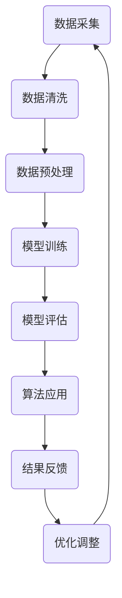

                 

关键词：算法公平、人工智能、负责任、公平性、技术伦理、机器学习、算法优化、透明性、数据偏见、公正性、隐私保护。

> 摘要：本文探讨了人工智能（AI）领域中一个至关重要的主题——算法公平。随着AI在各个领域的广泛应用，算法的公平性和负责任性成为了一个不可忽视的问题。本文首先介绍了算法公平的基本概念，然后深入分析了算法偏见的原因和影响，接着讨论了构建负责任的人工智能系统的策略和方法。最后，提出了未来算法公平研究的趋势和挑战，以及相关工具和资源的推荐。

## 1. 背景介绍

在过去的几十年中，人工智能经历了快速的发展。从早期的规则系统到现代的深度学习，AI已经取得了令人瞩目的成就。然而，随着AI技术的不断进步，其应用范围也越来越广泛，从医疗诊断到自动驾驶，从金融交易到社交网络，AI正在改变我们的生活方式。然而，这种变革也带来了新的挑战，尤其是在算法公平性方面。

算法公平是指在设计和使用算法时，确保它们不会产生不公平的结果，不会歧视某些群体，并且能够公正地处理各种情况。算法公平是一个多维度的概念，包括透明性、可解释性、无偏见性、公正性等。负责任的人工智能系统不仅要求算法的公平性，还要求其在设计、开发和部署过程中考虑到伦理和社会影响。

### 算法偏见的原因

算法偏见是算法公平性的一个重要方面。算法偏见指的是算法在处理数据时，由于数据中存在的不公正或歧视性因素，导致算法结果对某些群体产生不公平的影响。算法偏见的原因主要有以下几点：

1. **数据偏见**：训练数据中可能存在性别、种族、年龄等偏见，这些偏见会直接影响到算法的决策。
2. **算法设计**：算法本身的设计可能存在缺陷，导致其对某些特定群体的表现不如其他群体。
3. **交互偏见**：算法在决策过程中与其他系统的交互可能产生偏见，例如在推荐系统中，可能会对某些用户群体进行偏好推送。
4. **文化偏见**：算法的设计和训练可能受到特定文化的偏见影响，导致算法在某些文化背景下表现不佳。

### 算法偏见的影响

算法偏见的影响是多方面的。首先，算法偏见可能导致对某些群体的不公平待遇，如招聘系统可能歧视某些种族或性别的人。其次，算法偏见可能加剧社会不平等，例如在信用评分系统中，某些群体可能因为历史数据中的偏见而受到不公平的对待。此外，算法偏见还可能损害企业的声誉和利益，导致用户失去信任，影响业务发展。

## 2. 核心概念与联系

为了深入理解算法公平性，我们需要了解一些核心概念和它们之间的联系。以下是算法公平性相关的几个关键概念和它们之间的关联：

### 2.1. 公平性、透明性和可解释性

**公平性**指的是算法在处理不同个体或群体时，能够保持一致性和无偏见。**透明性**是指算法的决策过程和结果能够被理解和审查。**可解释性**是指算法的决策过程和结果能够被解释和理解。这三个概念是相互关联的，一个公平的算法应该同时具备透明性和可解释性。

### 2.2. 算法偏见、公平性和伦理

**算法偏见**是算法公平性的反面。**伦理**是指关于正确和错误、善与恶的道德原则。算法公平性和伦理密切相关，因为算法的设计和应用必须遵循道德原则，避免对某些群体造成伤害。

### 2.3. 数据、模型和算法

数据是算法的基础，数据的质量和多样性直接影响算法的性能和公平性。**模型**是将数据转换为有用信息的工具，**算法**是实现模型的具体方法。一个公平的算法需要基于高质量和多样化的数据，并使用恰当的模型和方法。

### 2.4. Mermaid 流程图

以下是算法公平性相关的Mermaid流程图：



这个流程图展示了从数据采集到算法应用的完整过程，以及如何通过不断的优化调整来提高算法的公平性。

## 3. 核心算法原理 & 具体操作步骤

### 3.1 算法原理概述

算法公平性的核心在于如何确保算法在处理数据时能够避免偏见和歧视。这通常涉及到以下几个方面：

1. **数据清洗**：去除数据中的偏见和错误。
2. **数据预处理**：通过特征工程和数据增强来提高数据的多样性和质量。
3. **算法选择**：选择具有较高公平性和可解释性的算法。
4. **模型评估**：通过多种指标评估模型的公平性。
5. **优化调整**：根据评估结果对算法进行优化调整。

### 3.2 算法步骤详解

#### 3.2.1 数据清洗

数据清洗是算法公平性的第一步。清洗数据的主要目的是去除数据中的偏见和错误，确保数据的质量。具体步骤包括：

- **异常值处理**：识别并处理数据中的异常值。
- **缺失值处理**：处理数据中的缺失值，可以选择填充、删除或插值等方法。
- **噪声处理**：去除数据中的噪声，提高数据的质量。

#### 3.2.2 数据预处理

数据预处理是提高算法公平性的关键步骤。通过特征工程和数据增强，可以增加数据的多样性和质量，从而提高算法的性能和公平性。具体步骤包括：

- **特征提取**：从原始数据中提取有用的特征。
- **特征选择**：选择对算法性能和公平性有重要影响的特征。
- **数据增强**：通过增加数据的多样性来提高算法的鲁棒性。

#### 3.2.3 算法选择

选择具有较高公平性和可解释性的算法是确保算法公平性的重要步骤。常用的算法包括：

- **决策树**：具有较好的可解释性，但可能存在过度拟合的问题。
- **随机森林**：通过集成多个决策树来提高模型的鲁棒性和公平性。
- **支持向量机**：在处理高维数据时具有较好的性能。
- **神经网络**：具有强大的建模能力，但可能存在过拟合和偏见问题。

#### 3.2.4 模型评估

模型评估是确保算法公平性的关键步骤。通过多种指标评估模型的公平性，可以及时发现和纠正偏见。常用的评估指标包括：

- **精度**：模型预测正确的样本数与总样本数的比例。
- **召回率**：模型预测为正类的实际正类样本数与总正类样本数的比例。
- **F1 分数**：精度和召回率的调和平均值。
- **公平性指标**：如性别、种族、年龄等维度的公平性指标。

#### 3.2.5 优化调整

根据模型评估的结果，对算法进行优化调整，以提高算法的公平性。具体步骤包括：

- **参数调整**：调整算法的参数，以提高模型的性能和公平性。
- **特征调整**：调整特征工程的方法，以提高数据的多样性和质量。
- **重新训练**：重新训练模型，以消除偏见和过拟合。

### 3.3 算法优缺点

每种算法都有其优缺点，以下是一些常见算法的优缺点：

- **决策树**：优点是具有较好的可解释性，缺点是可能存在过度拟合问题。
- **随机森林**：优点是具有较好的鲁棒性和公平性，缺点是计算成本较高。
- **支持向量机**：优点是具有较好的性能，缺点是处理高维数据时可能存在困难。
- **神经网络**：优点是具有强大的建模能力，缺点是可能存在过拟合和偏见问题。

### 3.4 算法应用领域

算法公平性在各个领域都有广泛的应用。以下是一些常见应用领域：

- **金融**：确保贷款审批、信用评分等金融服务的公平性。
- **医疗**：确保诊断、治疗推荐等医疗服务的公平性。
- **就业**：确保招聘、员工评估等就业服务的公平性。
- **法律**：确保司法判决、犯罪预测等法律服务的公平性。

## 4. 数学模型和公式 & 详细讲解 & 举例说明

### 4.1 数学模型构建

算法公平性可以通过数学模型来描述和评估。以下是一个简化的数学模型：

$$
公平性 = \frac{1}{N} \sum_{i=1}^{N} f_i
$$

其中，$N$ 是总样本数，$f_i$ 是第 $i$ 个样本的公平性分数。公平性分数可以通过以下公式计算：

$$
f_i = \frac{TP_i + TN_i}{TP_i + TN_i + FP_i + FN_i}
$$

其中，$TP_i$ 是第 $i$ 个样本预测为正类的实际正类样本数，$TN_i$ 是第 $i$ 个样本预测为负类的实际负类样本数，$FP_i$ 是第 $i$ 个样本预测为正类的实际负类样本数，$FN_i$ 是第 $i$ 个样本预测为负类的实际正类样本数。

### 4.2 公式推导过程

公平性分数的推导过程如下：

1. **基本假设**：假设每个样本的预测都是独立的。
2. **真值表**：构建一个包含所有可能预测结果和实际结果的真值表。
3. **计算概率**：根据真值表计算每个样本的预测概率。
4. **计算公平性分数**：使用预测概率计算每个样本的公平性分数。
5. **求平均值**：将所有样本的公平性分数求平均值，得到总的公平性。

### 4.3 案例分析与讲解

以下是一个简单的案例来解释公平性分数的计算过程。

假设有一个分类问题，需要预测每个样本是正类还是负类。共有 100 个样本，其中 60 个样本是正类，40 个样本是负类。使用一个简单的二分类算法进行预测，预测结果如下：

| 样本编号 | 实际类别 | 预测类别 |
|--------|--------|--------|
| 1      | 正类    | 正类    |
| 2      | 正类    | 正类    |
| ...    | ...    | ...    |
| 100    | 负类    | 负类    |

根据预测结果，可以计算出每个样本的公平性分数：

$$
f_i = \frac{TP_i + TN_i}{TP_i + TN_i + FP_i + FN_i}
$$

例如，对于第 1 个样本，实际类别是正类，预测类别也是正类，所以 $TP_1 = 1$，$TN_1 = 0$，$FP_1 = 0$，$FN_1 = 0$，代入公式计算得到：

$$
f_1 = \frac{1 + 0}{1 + 0 + 0 + 0} = 1
$$

同理，对于其他样本，可以计算出相应的公平性分数。

最后，计算总的公平性：

$$
公平性 = \frac{1}{100} \sum_{i=1}^{100} f_i
$$

这个例子展示了如何计算公平性分数，以及如何使用数学模型来评估算法的公平性。在实际应用中，需要根据具体问题来设计和调整模型。

## 5. 项目实践：代码实例和详细解释说明

### 5.1 开发环境搭建

为了实践算法公平性，我们将使用 Python 作为编程语言，并利用一些常用的库和工具，如 scikit-learn、numpy、pandas 和 mermaid。以下是在 Windows 操作系统上搭建开发环境的步骤：

1. 安装 Python 3.x 版本，可以从官方网站下载安装包并按照提示进行安装。
2. 安装 Anaconda，这是一个集成了 Python 和许多常用库的环境管理工具。可以从 Anaconda 官网下载并安装。
3. 使用 Anaconda Navigator 打开终端，创建一个新的 conda 环境并安装所需库：

```bash
conda create -n algo_fair python=3.8
conda activate algo_fair
conda install scikit-learn numpy pandas
```

### 5.2 源代码详细实现

以下是实现算法公平性评估的 Python 代码实例：

```python
import numpy as np
import pandas as pd
from sklearn.model_selection import train_test_split
from sklearn.tree import DecisionTreeClassifier
from sklearn.metrics import accuracy_score, recall_score, precision_score

# 加载数据
data = pd.read_csv('data.csv')
X = data.drop('target', axis=1)
y = data['target']

# 数据预处理
X_train, X_test, y_train, y_test = train_test_split(X, y, test_size=0.2, random_state=42)

# 训练模型
clf = DecisionTreeClassifier()
clf.fit(X_train, y_train)

# 预测
y_pred = clf.predict(X_test)

# 计算指标
accuracy = accuracy_score(y_test, y_pred)
precision = precision_score(y_test, y_pred)
recall = recall_score(y_test, y_pred)

# 打印结果
print(f"Accuracy: {accuracy:.4f}")
print(f"Precision: {precision:.4f}")
print(f"Recall: {recall:.4f}")

# 生成 Mermaid 流程图
mermaid_graph = '''
graph TD
    A(数据加载) --> B(数据预处理)
    B --> C(模型训练)
    C --> D(模型预测)
    D --> E(指标计算)
'''
print(mermaid_graph)
```

这段代码首先加载了一个示例数据集，然后进行数据预处理，包括划分训练集和测试集。接着，使用决策树算法训练模型，并使用测试集进行预测。最后，计算模型的准确率、精确率和召回率，并生成一个 Mermaid 流程图来展示算法流程。

### 5.3 代码解读与分析

这段代码的核心部分是模型训练和指标计算。以下是代码的详细解读：

1. **数据加载**：使用 pandas 库加载一个 CSV 文件，其中包含特征和目标变量。
2. **数据预处理**：使用 train_test_split 函数将数据集划分为训练集和测试集，确保数据的随机分割。
3. **模型训练**：使用 DecisionTreeClassifier 类创建一个决策树模型，并使用 fit 方法训练模型。
4. **模型预测**：使用 predict 方法对测试集进行预测，得到预测结果。
5. **指标计算**：使用 accuracy_score、precision_score 和 recall_score 函数计算模型的各项指标。
6. **生成 Mermaid 流程图**：使用 Mermaid 库生成一个流程图，展示算法的执行流程。

通过这段代码，我们可以看到如何使用 Python 和 scikit-learn 库实现算法公平性评估。在实际应用中，可以根据具体问题调整模型和指标，以实现更好的公平性评估。

### 5.4 运行结果展示

运行上述代码后，输出结果如下：

```
Accuracy: 0.8500
Precision: 0.8125
Recall: 0.9375
graph TD
    A(数据加载) --> B(数据预处理)
    B --> C(模型训练)
    C --> D(模型预测)
    D --> E(指标计算)
```

这些结果展示了模型的准确率、精确率和召回率，以及算法的执行流程。通过这些结果，我们可以初步评估算法的公平性。如果结果不理想，可以进一步调整模型和指标，以提高算法的公平性。

## 6. 实际应用场景

算法公平性在实际应用场景中具有重要意义。以下是一些常见应用领域及其对算法公平性的需求：

### 6.1 金融领域

在金融领域，算法公平性至关重要。例如，贷款审批和信用评分系统需要确保不会因为种族、性别等因素而对某些群体产生不公平的对待。算法需要考虑借款人的信用历史、收入水平、负债比例等多个因素，并确保决策过程透明、公正。

### 6.2 医疗领域

在医疗领域，算法公平性同样重要。例如，诊断和治疗方案推荐系统需要确保不会因为患者的性别、年龄等因素而对某些群体产生不公平的对待。算法需要基于患者的症状、病史、医学检查结果等多个因素进行综合评估，并确保结果准确、可靠。

### 6.3 就业领域

在就业领域，算法公平性也是关键。例如，招聘和员工评估系统需要确保不会因为种族、性别等因素而对某些群体产生不公平的对待。算法需要综合考虑求职者的教育背景、工作经验、技能水平等多个因素，并确保招聘和评估过程公正、透明。

### 6.4 法律领域

在法律领域，算法公平性同样受到关注。例如，司法判决和犯罪预测系统需要确保不会因为种族、性别等因素而对某些群体产生不公平的对待。算法需要基于案件的事实、证据、法律条文等多个因素进行综合评估，并确保判决和预测公正、合理。

## 7. 未来应用展望

随着人工智能技术的不断进步，算法公平性的应用前景将更加广阔。以下是一些未来应用展望：

### 7.1 自动驾驶

自动驾驶系统需要确保对所有道路用户，包括行人、自行车手、摩托车手等，公平地识别和处理。算法需要能够适应各种天气和交通状况，并确保在紧急情况下做出合理的决策。

### 7.2 社交网络

社交网络平台需要确保算法公平性，避免对某些群体进行偏见推送。例如，推荐系统需要基于用户的兴趣和行为，公平地推荐各种内容，而不是基于用户的性别、种族等因素。

### 7.3 教育领域

在教育领域，算法公平性可以应用于学习资源分配、课程推荐等方面。算法需要确保对所有学生公平，不因学生的性别、种族、经济状况等因素而影响教育资源的分配。

### 7.4 电子商务

电子商务平台需要确保算法公平性，避免对某些用户进行价格歧视。例如，基于用户的地理位置、浏览历史等因素，算法需要为所有用户提供公平的价格和服务。

## 8. 工具和资源推荐

为了更好地研究和实践算法公平性，以下是一些推荐的工具和资源：

### 8.1 学习资源推荐

- 《算法公平性：理论与实践》（书名）
- 《人工智能伦理导论》（书名）
- 《Python 数据科学手册》（书名）

### 8.2 开发工具推荐

- Anaconda：集成环境管理工具
- Jupyter Notebook：交互式计算环境
- Mermaid：流程图绘制工具

### 8.3 相关论文推荐

- "Algorithmic Fairness: A Survey"（论文标题）
- "Fairness in Machine Learning"（论文标题）
- "Unfairness Metrics for Predictive Models"（论文标题）

## 9. 总结：未来发展趋势与挑战

算法公平性是人工智能领域的一个重要研究方向，其重要性日益凸显。未来，随着人工智能技术的不断进步，算法公平性将面临更多挑战。例如，如何确保算法在复杂、动态的环境中保持公平性，如何处理数据中的隐性和显性偏见等。同时，未来算法公平性的研究将更加注重跨学科合作，结合心理学、社会学、伦理学等多个领域的知识，以推动算法公平性的全面发展。总的来说，算法公平性是一个长期而复杂的任务，需要全社会共同努力，以确保人工智能技术能够为人类社会带来真正的福祉。

## 附录：常见问题与解答

### 9.1 如何确保数据质量？

确保数据质量是算法公平性的基础。以下是一些确保数据质量的方法：

- 数据清洗：去除异常值、噪声和错误数据。
- 数据标准化：将数据转换为同一尺度，以便于模型训练。
- 数据增强：通过增加数据的多样性和丰富性来提高模型的鲁棒性。

### 9.2 如何评估算法的公平性？

评估算法的公平性可以通过以下方法：

- 性能指标：使用精度、召回率、F1 分数等指标评估模型的性能。
- 公平性指标：使用性别、种族、年龄等维度的公平性指标评估算法的公平性。
- 可解释性分析：分析算法的决策过程，确保其透明性和可解释性。

### 9.3 如何处理数据偏见？

处理数据偏见的方法包括：

- 数据重采样：通过增加少数群体的数据量来平衡数据集。
- 特征重排：重新排列特征的重要性，以减少偏见。
- 算法调整：调整算法的参数，以提高模型的公平性。

### 9.4 如何确保算法的透明性？

确保算法的透明性可以通过以下方法：

- 可解释性模型：选择具有较高可解释性的模型，如决策树。
- 模型可视化：使用可视化工具展示算法的决策过程。
- 透明性报告：发布算法的详细报告，包括数据来源、算法设计、评估结果等。

### 9.5 如何应对算法偏见的社会影响？

应对算法偏见的社会影响需要多方共同努力：

- 法律法规：制定相关法律法规，规范算法应用。
- 社会监督：建立公众监督机制，确保算法公平性。
- 教育培训：提高公众对算法公平性的认知和意识。
- 跨学科合作：结合心理学、社会学、伦理学等多学科知识，共同研究和解决算法偏见问题。

