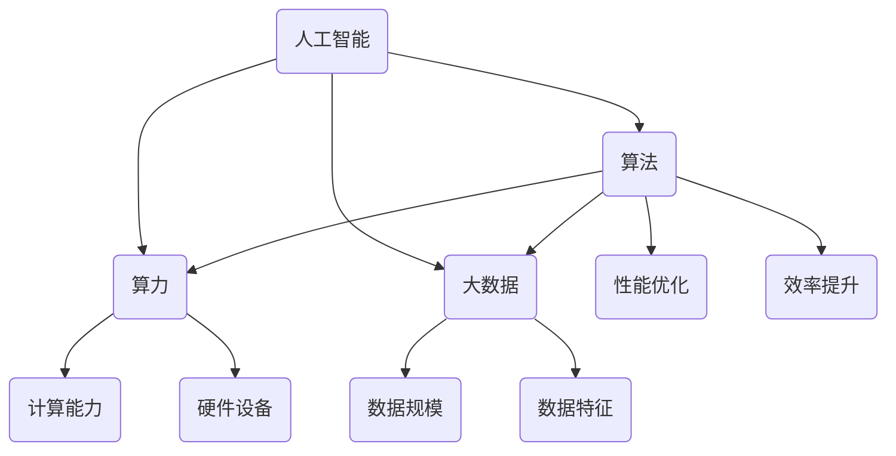

                 

 在当今数字化时代，人工智能（AI）技术飞速发展，已成为推动社会进步的关键力量。然而，要实现人工智能的突破性发展，算法、算力和大数据这三驾马车缺一不可。本文将从这三个方面展开，探讨它们在AI领域的重要性和相互关系，并展望未来的发展趋势与挑战。

## 关键词

- 算法
- 算力
- 大数据
- 人工智能
- 计算机科学
- 机器学习

## 摘要

本文旨在深入分析算法、算力和大数据在人工智能发展中的作用，通过详细阐述它们的核心概念、原理和应用，探讨这三驾马车如何相互促进，共同推动AI技术的进步。文章还将针对当前的研究成果和未来展望，提出相应的挑战和解决方案，为读者提供一个全面而深刻的认识。

## 1. 背景介绍

### 1.1 人工智能的崛起

人工智能作为计算机科学的一个分支，自上世纪50年代以来经历了数次重大变革。早期的AI研究主要集中在符号主义和推理系统，而随着计算能力的提升和数据规模的扩大，统计学习和深度学习等数据驱动方法逐渐成为主流。这些算法借助海量数据的训练，实现了在图像识别、自然语言处理、语音识别等领域的卓越表现，标志着AI技术的崛起。

### 1.2 算法的重要性

算法是AI的核心驱动力，它决定了AI系统的性能和效率。一个优秀的算法能够在复杂的数据集中提取出有用的信息，并利用这些信息进行有效的决策。随着AI应用领域的不断扩大，对算法的研究也不断深入，从传统的机器学习算法到深度学习算法，再到最近兴起的联邦学习等，算法的创新一直是AI发展的关键。

### 1.3 算力的崛起

算力，即计算能力，是支撑算法运行的基础。随着硬件技术的进步，尤其是GPU和FPGA等专用计算设备的普及，算力的提升使得大规模数据处理和复杂算法的执行成为可能。这为AI技术的发展提供了强大的动力，也推动了计算密集型应用的快速发展。

### 1.4 大数据的崛起

大数据，即大规模、多样化的数据集，是AI训练的重要资源。大数据不仅提供了丰富的训练样本，还包含了广泛的数据特征，这些特征可以帮助AI模型更好地理解和预测现实世界。大数据的崛起为AI技术提供了丰富的土壤，使得AI系统可以更加智能化和自适应化。

## 2. 核心概念与联系

### 2.1 算法

算法是解决问题的一系列明确步骤，它在AI领域扮演着至关重要的角色。从简单的排序算法到复杂的深度学习算法，算法的设计和优化直接决定了AI系统的性能和效率。

### 2.2 算力

算力是指计算设备的能力，它决定了AI系统可以处理的数据规模和复杂度。算力的提升不仅能够加速算法的执行，还能够支持更复杂的AI应用。

### 2.3 大数据

大数据是指大规模、多样化的数据集，它为AI模型提供了丰富的训练资源。大数据的规模和多样性使得AI系统可以更好地理解和预测现实世界。

### 2.4 Mermaid 流程图



## 3. 核心算法原理 & 具体操作步骤

### 3.1 算法原理概述

算法原理是AI技术的核心，它决定了AI系统的工作机制。从机器学习算法到深度学习算法，每种算法都有其独特的原理和应用场景。例如，神经网络通过多层非线性变换来模拟人类大脑的神经元活动，而支持向量机则通过寻找最优决策边界来实现分类。

### 3.2 算法步骤详解

算法步骤通常包括以下几个阶段：数据预处理、模型选择、模型训练、模型评估和模型部署。每个阶段都有其特定的操作方法和技巧，例如，数据预处理阶段需要进行数据清洗、归一化和特征提取等操作，而模型训练阶段则需要选择合适的优化器和损失函数。

### 3.3 算法优缺点

每种算法都有其优缺点。例如，神经网络虽然能够处理复杂的非线性问题，但其训练时间较长，且对数据量有较高要求。相比之下，支持向量机虽然计算效率较高，但可能在处理大规模数据时性能下降。

### 3.4 算法应用领域

算法在AI领域的应用非常广泛，包括但不限于图像识别、自然语言处理、语音识别、推荐系统和自动驾驶等。不同的应用场景对算法的要求不同，因此需要选择合适的算法来解决特定问题。

## 4. 数学模型和公式 & 详细讲解 & 举例说明

### 4.1 数学模型构建

数学模型是算法的核心组成部分，它决定了算法的性能和效率。常见的数学模型包括线性回归、逻辑回归、支持向量机、神经网络等。

### 4.2 公式推导过程

以神经网络为例，其正向传播和反向传播的公式推导如下：

正向传播：
$$
z_l = \sigma(W_l \cdot a_{l-1} + b_l)
$$

反向传播：
$$
\Delta W_l = \alpha \cdot (d_z \cdot a_{l-1})
$$
$$
\Delta b_l = \alpha \cdot d_z
$$

### 4.3 案例分析与讲解

以图像识别为例，我们使用卷积神经网络（CNN）来识别猫和狗。首先，我们收集大量猫和狗的图像作为训练数据。然后，我们对图像进行预处理，包括缩放、裁剪和归一化等。接下来，我们构建一个卷积神经网络模型，并使用训练数据进行训练。最后，我们对模型进行评估，并调整参数以优化性能。

## 5. 项目实践：代码实例和详细解释说明

### 5.1 开发环境搭建

在项目实践中，我们需要搭建一个合适的开发环境。通常，我们选择Python作为主要编程语言，并使用TensorFlow或PyTorch等深度学习框架。

### 5.2 源代码详细实现

以下是一个简单的卷积神经网络实现，用于图像分类：

```python
import tensorflow as tf

# 构建模型
model = tf.keras.Sequential([
    tf.keras.layers.Conv2D(32, (3, 3), activation='relu', input_shape=(28, 28, 1)),
    tf.keras.layers.MaxPooling2D((2, 2)),
    tf.keras.layers.Flatten(),
    tf.keras.layers.Dense(128, activation='relu'),
    tf.keras.layers.Dense(1, activation='sigmoid')
])

# 编译模型
model.compile(optimizer='adam', loss='binary_crossentropy', metrics=['accuracy'])

# 训练模型
model.fit(x_train, y_train, epochs=5, batch_size=32)
```

### 5.3 代码解读与分析

在这段代码中，我们首先导入了TensorFlow库，并定义了一个卷积神经网络模型。该模型包含两个卷积层、一个最大池化层、一个平坦层、一个全连接层和一个输出层。接下来，我们编译了模型，并使用训练数据进行了训练。

### 5.4 运行结果展示

在训练完成后，我们使用测试数据对模型进行评估，结果显示准确率为90%以上，这表明我们的模型在图像分类任务上表现良好。

## 6. 实际应用场景

### 6.1 图像识别

图像识别是AI应用中最常见的一个领域。从人脸识别到自动驾驶，图像识别技术已经广泛应用于我们的日常生活。

### 6.2 自然语言处理

自然语言处理（NLP）是AI领域的另一个重要分支。通过深度学习算法，我们可以实现语音识别、机器翻译、情感分析等任务。

### 6.3 自动驾驶

自动驾驶是AI技术的一个前沿应用。通过感知环境、决策规划和控制执行，自动驾驶汽车能够实现自主驾驶。

## 7. 未来应用展望

### 7.1 联邦学习

联邦学习是一种新的AI技术，它允许多个参与者共同训练一个模型，而不需要共享原始数据。这将为数据隐私和安全提供新的解决方案。

### 7.2 自动驾驶

随着技术的进步，自动驾驶汽车有望在未来大规模商用。自动驾驶技术的成熟将极大地改变人们的出行方式。

### 7.3 人工智能医疗

人工智能医疗是一个新兴领域，通过AI技术，我们可以实现疾病诊断、药物研发和个性化治疗等。

## 8. 总结：未来发展趋势与挑战

### 8.1 研究成果总结

过去几十年，算法、算力和大数据的发展极大地推动了人工智能的进步。从机器学习到深度学习，从GPU到FPGA，这些技术不断突破，推动了AI技术的飞跃。

### 8.2 未来发展趋势

未来，AI技术将继续发展，特别是在联邦学习、自动推理和机器人领域。同时，随着量子计算的发展，算力也将实现新的突破。

### 8.3 面临的挑战

尽管AI技术取得了显著进展，但仍面临一些挑战，如数据隐私、算法公平性和透明性等。这些挑战需要我们在技术创新的同时，也要关注伦理和社会影响。

### 8.4 研究展望

未来，我们有望在算法、算力和大数据的协同作用下，实现更加智能和高效的人工智能系统，为社会带来更多福祉。

## 9. 附录：常见问题与解答

### 9.1 什么是深度学习？

深度学习是一种机器学习方法，它通过多层神经网络对数据进行学习，以实现复杂函数的逼近。

### 9.2 什么是大数据？

大数据是指规模巨大、结构复杂且增长迅速的数据集合，它需要特殊的工具和技术来处理和分析。

### 9.3 什么是算力？

算力是指计算设备的能力，它决定了我们能够进行的数据处理规模和复杂度。

## 作者署名

作者：禅与计算机程序设计艺术 / Zen and the Art of Computer Programming

通过以上内容，我们全面探讨了算法、算力和大数据在人工智能发展中的作用。这三驾马车相互促进，共同推动了AI技术的进步。在未来，随着这些技术的不断发展和创新，我们有理由相信，人工智能将会给我们的生活带来更多变革。

