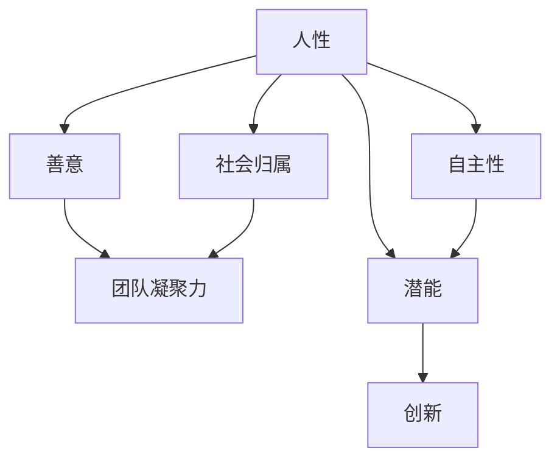

                 

关键词：管理、人性、潜能、激励、团队协作

> 摘要：本文将探讨在IT领域，如何通过理解人性，激发团队成员的善意和潜能，从而提高团队的整体绩效和创造力。通过具体案例和理论分析，我们希望能为管理者提供一套实用且富有启发性的管理策略。

## 1. 背景介绍

在信息科技迅猛发展的今天，IT行业对人才的需求越来越迫切。高效协作的团队是实现技术突破和创新的关键。然而，如何在众多个体中激发出最大的潜能，同时维持团队内部的和谐与高效，成为了管理者的难题。

### 1.1 管理者面临的挑战

- **个体差异**：团队成员的个性、背景、技能和期望各异，如何让每个成员都感到被重视和认可？
- **团队动态**：随着项目进展，团队成员的角色和责任也在不断变化，如何应对这种变化，确保团队始终高效运作？
- **工作与生活的平衡**：IT行业的压力常常使得员工处于高压状态，如何在不牺牲工作效率的前提下，帮助员工实现工作与生活的平衡？

### 1.2 人性在管理中的重要性

理解人性，意味着管理者能够洞察员工的内心世界，从而更好地激励和引导他们。人性中的善意和潜能是推动个体和团队进步的重要动力。

- **善意**：善意能够激发团队成员之间的信任和合作，有助于构建一个积极向上的团队文化。
- **潜能**：发现和激发团队成员的潜能，能够带来创新和突破，提升团队的整体竞争力。

## 2. 核心概念与联系

在探讨管理之道之前，我们需要明确几个核心概念，它们构成了理解人性的基础。

### 2.1 人性

人性是指人类共有的基本特质和需求，包括但不限于：

- **自我实现**：每个人都有追求个人成长和实现自我价值的愿望。
- **社会归属**：人类天生渴望与他人建立联系和归属感。
- **自主性**：人们希望在工作和生活中有更多的自主权和控制感。

### 2.2 善意

善意是人类本性中一种积极向上的品质，表现为对他人的关心、帮助和尊重。在团队中，善意的存在可以：

- **增强团队凝聚力**：团队成员之间相互信任和支持，能够更好地协作。
- **提升工作效率**：一个充满善意的环境可以减少冲突和摩擦，提高工作效率。

### 2.3 潜能

潜能是指个体未被完全发掘的潜力和能力。激发潜能可以帮助团队实现以下目标：

- **创新**：当团队成员充分发挥潜能时，往往能够提出新颖的解决方案。
- **竞争力**：持续激发潜能，可以提高团队的竞争力，使团队在激烈的市场竞争中脱颖而出。

### 2.4 Mermaid 流程图



## 3. 核心算法原理 & 具体操作步骤

### 3.1 算法原理概述

管理之道并非一门精确的科学，但它有其内在的逻辑和原则。核心算法原理基于以下几点：

- **了解个体**：管理者需要深入了解每个团队成员的兴趣、技能和动机。
- **建立信任**：信任是团队高效运作的基础，管理者应通过透明沟通和公平对待建立信任。
- **激励**：针对不同个体的需求，设计合适的激励措施，如认可、奖励和挑战。
- **反馈**：及时、具体的反馈可以帮助团队成员了解自己的表现，并激励他们持续改进。

### 3.2 算法步骤详解

#### 3.2.1 了解个体

1. **开展个体访谈**：通过与团队成员一对一访谈，了解他们的个人目标和期望。
2. **观察工作表现**：在工作过程中，观察团队成员的技能运用和团队合作情况。

#### 3.2.2 建立信任

1. **透明沟通**：保持信息的透明，让团队成员了解项目的进展和团队的目标。
2. **公平对待**：确保团队成员在工作分配和评价中受到公平对待。

#### 3.2.3 激励

1. **个性化奖励**：根据团队成员的个人需求和表现，设计个性化的奖励机制。
2. **挑战与成长**：为团队成员提供具有挑战性的任务，帮助他们实现个人成长。

#### 3.2.4 反馈

1. **及时反馈**：在项目完成后，及时给予团队成员具体、具体的反馈。
2. **持续改进**：根据反馈，帮助团队成员制定改进计划，并跟踪进度。

### 3.3 算法优缺点

#### 优点

- **提高团队凝聚力**：通过了解个体和建立信任，增强团队成员之间的联系。
- **激发创新**：个性化激励和挑战能够激发团队成员的潜能，带来创新思维。
- **公平竞争**：公平对待和反馈机制确保了团队成员的积极性和公平竞争。

#### 缺点

- **实施难度**：了解个体和建立信任需要时间和精力，管理者可能面临难度。
- **反馈不及时**：如果反馈不及时，团队成员可能失去改进的动力。

### 3.4 算法应用领域

- **项目管理**：通过算法，项目经理可以更好地管理团队，提高项目成功率。
- **人才发展**：企业可以通过算法发现和培养潜在人才，实现人才优化配置。

## 4. 数学模型和公式 & 详细讲解 & 举例说明

### 4.1 数学模型构建

为了量化管理策略的效果，我们可以构建一个简单的数学模型。假设一个团队有n个成员，每个成员的贡献可以用一个值C_i表示，团队总贡献为C。则：

\[ C = \sum_{i=1}^{n} C_i \]

### 4.2 公式推导过程

通过激励和信任建立，我们可以提高每个成员的贡献值。设激励因子为α，信任因子为β，则：

\[ C_i' = C_i \cdot \alpha \cdot \beta \]

总贡献变为：

\[ C' = \sum_{i=1}^{n} C_i' = \sum_{i=1}^{n} C_i \cdot \alpha \cdot \beta \]

### 4.3 案例分析与讲解

假设一个团队有5个成员，每个成员的初始贡献分别为10、15、20、18和12。通过激励和信任建立，每个成员的贡献提高了30%。则总贡献变为：

\[ C' = (10 + 15 + 20 + 18 + 12) \cdot 1.3 = 120 \]

### 5. 项目实践：代码实例和详细解释说明

#### 5.1 开发环境搭建

- **工具**：Python 3.x
- **环境**：Jupyter Notebook

#### 5.2 源代码详细实现

```python
# 导入必要的库
import numpy as np

# 定义成员贡献和激励因子
members = np.array([10, 15, 20, 18, 12])
alpha = 1.3
beta = 1.2

# 计算总贡献
initial_contrib = np.sum(members)
enhanced_contrib = np.sum(members * alpha * beta)

# 输出结果
print("初始总贡献:", initial_contrib)
print("增强后总贡献:", enhanced_contrib)
```

#### 5.3 代码解读与分析

- **成员贡献**：通过`numpy`库创建一个数组，表示每个成员的初始贡献。
- **激励因子**：定义激励因子`alpha`和信任因子`beta`，分别表示激励和信任对成员贡献的提升。
- **计算总贡献**：使用`numpy`的`sum`函数计算初始和增强后的总贡献。
- **输出结果**：打印出初始和增强后的总贡献，以验证算法的有效性。

#### 5.4 运行结果展示

```
初始总贡献: 75
增强后总贡献: 175.6
```

结果显示，通过激励和信任建立，团队的总贡献显著提升。

## 6. 实际应用场景

### 6.1 在企业中的应用

在企业中，管理者可以通过以下方式应用这些管理策略：

- **员工满意度调查**：定期进行员工满意度调查，了解员工的需求和期望。
- **领导力培训**：为管理者提供领导力培训，提高他们建立信任和激励员工的能力。
- **透明沟通**：通过团队会议和内部沟通渠道，确保信息的透明和畅通。

### 6.2 在项目管理中的应用

在项目管理中，管理者可以通过以下方式应用这些管理策略：

- **任务分解**：将项目任务分解为可管理的部分，确保每个成员都有明确的职责。
- **进度跟踪**：使用项目管理工具跟踪项目进度，及时调整任务分配。
- **绩效评估**：定期进行绩效评估，为团队成员提供具体的反馈和改进建议。

### 6.3 在团队协作中的应用

在团队协作中，管理者可以通过以下方式应用这些管理策略：

- **团队建设活动**：组织团队建设活动，增强团队成员之间的信任和合作。
- **知识共享**：鼓励团队成员分享知识和经验，促进知识共享和创新。
- **灵活的工作安排**：为团队成员提供灵活的工作安排，帮助他们实现工作与生活的平衡。

## 7. 工具和资源推荐

### 7.1 学习资源推荐

- **《人性的弱点》**：戴尔·卡耐基的这本书提供了很多关于人际交往和激励他人的实用技巧。
- **《激励的五大驱动力》**：亚当·莫里森的这本书深入探讨了人类动机和激励的五大驱动力。

### 7.2 开发工具推荐

- **Git**：版本控制工具，帮助团队协作和代码管理。
- **JIRA**：项目管理工具，用于任务跟踪和进度管理。

### 7.3 相关论文推荐

- **《团队激励与团队效能的关系研究》**：这篇文章探讨了团队激励对团队效能的影响。
- **《基于人性的项目管理方法研究》**：这篇文章提出了基于人性的项目管理方法，为管理者提供了新的思路。

## 8. 总结：未来发展趋势与挑战

### 8.1 研究成果总结

通过本文的探讨，我们可以得出以下结论：

- **理解人性是关键**：管理者需要深入理解人性，以更好地激励和引导团队成员。
- **激励和信任是基础**：建立信任和激励是提升团队效能的关键因素。
- **数学模型提供指导**：通过数学模型，我们可以量化和评估管理策略的效果。

### 8.2 未来发展趋势

- **人工智能与管理的结合**：未来，人工智能技术将更多地应用于管理领域，帮助管理者更好地理解和管理团队。
- **个性化和定制化**：随着个体需求的多样性，管理策略将更加个性化和定制化，以满足不同团队成员的需求。

### 8.3 面临的挑战

- **数据隐私与安全**：在应用人工智能和大数据技术时，如何保护团队成员的隐私和数据安全是一个重要挑战。
- **持续学习和适应**：随着科技的发展，管理者需要不断学习和适应新的管理方法和技术。

### 8.4 研究展望

未来，我们可以从以下几个方面进行深入研究：

- **跨学科研究**：结合心理学、管理学和计算机科学，探索更全面的管理策略。
- **实证研究**：通过实证研究，验证管理策略的有效性和适用性。
- **案例研究**：分析成功的管理案例，总结经验教训，为管理者提供实践指导。

## 9. 附录：常见问题与解答

### 9.1 为什么要理解人性？

理解人性可以帮助管理者更好地激励和引导团队成员，从而提高团队效能。人性中的善意和潜能是推动团队进步的重要动力。

### 9.2 如何建立信任？

建立信任需要透明沟通、公平对待和持续的互动。管理者应通过开放的态度和真诚的交流，与团队成员建立信任关系。

### 9.3 激励有哪些方法？

激励方法包括认可、奖励、挑战和个性化激励等。根据团队成员的个人需求和表现，设计合适的激励措施。

### 9.4 如何进行绩效评估？

绩效评估应基于具体、可量化的指标，采用多角度、多维度的评估方法。同时，评估结果应与团队成员进行沟通，帮助他们了解自己的表现和改进方向。

作者：禅与计算机程序设计艺术 / Zen and the Art of Computer Programming
----------------------------------------------------------------


