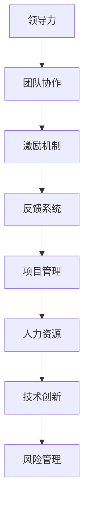
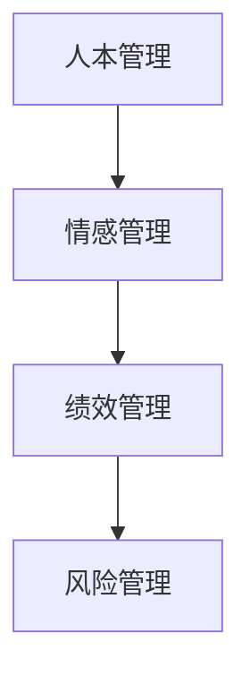

                 

关键词：管理、潜能激发、善意、IT行业、团队协作、领导力、绩效提升

> 摘要：本文将探讨管理在IT行业中的本质，即如何通过激发团队成员的潜能与善意，实现团队绩效的提升。文章将从核心概念、算法原理、数学模型、实践应用等多个角度深入分析，为IT行业管理者提供有效的管理策略和方法。

## 1. 背景介绍

在当今的IT行业中，管理的重要性不言而喻。IT项目往往涉及复杂的系统架构、大量的代码编写和跨部门协同工作，这使得团队管理变得至关重要。然而，传统管理模式往往侧重于任务分配和监控，忽视了团队成员的潜力和情感需求。因此，如何通过管理激发员工的潜能与善意，成为现代IT行业管理者亟待解决的问题。

本文将从以下几个方面展开讨论：

- **核心概念与联系**：介绍管理的核心概念，如领导力、团队协作等，并展示其与IT行业的联系。
- **核心算法原理与操作步骤**：详细解析激发员工潜能与善意的具体方法，包括激励机制设计、反馈系统构建等。
- **数学模型与公式**：阐述相关数学模型和公式，为管理决策提供理论依据。
- **项目实践**：通过实际案例展示管理策略在IT项目中的具体应用。
- **实际应用场景**：探讨管理在IT行业的各种应用场景，如软件开发、网络安全等。
- **未来应用展望**：分析管理在IT行业中的未来发展趋势和应用前景。

## 2. 核心概念与联系

### 领导力

领导力是管理的重要组成部分，它涉及到如何影响和激励团队成员。在IT行业中，领导力不仅体现在技术能力的展示上，更体现在对团队氛围的营造和团队成员的关心上。

### 团队协作

团队协作是实现项目目标的关键。在IT行业中，跨部门、跨地区的协作需求越来越高。因此，管理者需要建立有效的沟通机制，促进团队成员之间的协作。

### 激励机制

激励机制是激发员工潜能的重要手段。在IT行业中，常见的激励机制包括奖金、晋升、荣誉等。有效的激励机制可以增强员工的积极性和归属感。

### 反馈系统

反馈系统是管理者了解团队状态的重要工具。在IT行业中，及时、有效的反馈可以帮助管理者发现问题、改进管理策略。

### 管理与IT行业的联系

管理在IT行业中的应用主要体现在以下几个方面：

- **项目管理**：通过项目管理，确保项目按计划进行，资源得到合理配置。
- **人力资源**：通过人力资源管理，激发员工潜能，提升团队整体绩效。
- **技术创新**：通过技术创新管理，推动技术进步，提高产品竞争力。
- **风险管理**：通过风险管理，降低项目风险，确保项目成功交付。

### Mermaid 流程图



## 3. 核心算法原理与操作步骤

### 3.1 算法原理概述

管理本质上是关于如何处理人与人的关系。在IT行业中，管理算法的核心思想是通过激发员工的潜能和善意，实现团队的高效运作。具体来说，包括以下几个方面：

- **人本管理**：以员工为中心，关注员工的成长和发展。
- **情感管理**：关注员工的心理需求，营造良好的团队氛围。
- **绩效管理**：通过设定明确的目标和考核标准，激发员工的积极性。
- **风险管理**：预防和化解团队中的潜在风险，确保团队稳定运行。

### 3.2 算法步骤详解

- **人本管理**：建立员工档案，了解员工的兴趣、特长和需求，为员工提供个性化的职业发展规划。
- **情感管理**：定期组织团队活动，增强团队成员之间的情感联系，提高团队凝聚力。
- **绩效管理**：设定合理的绩效目标，定期进行绩效评估，根据评估结果调整管理策略。
- **风险管理**：建立风险预警机制，及时发现和解决团队中的问题，确保项目顺利推进。

### 3.3 算法优缺点

#### 优点

- **提高员工积极性**：通过激发员工的潜能，提高员工的工作满意度和工作效率。
- **增强团队凝聚力**：通过情感管理，营造良好的团队氛围，增强团队成员之间的信任和协作。
- **降低管理成本**：通过绩效管理和风险管理，提高团队的稳定性和抗风险能力，降低管理成本。

#### 缺点

- **实施难度大**：需要管理者具备较高的管理能力和情感管理能力，实施过程中需要不断调整和优化。
- **管理成本高**：需要投入大量的人力、物力和时间进行员工档案建立、团队活动组织和绩效评估等。

### 3.4 算法应用领域

- **软件开发团队**：通过人本管理和情感管理，提高团队协作效率，降低项目风险。
- **网络安全团队**：通过风险管理，预防和化解网络安全风险，确保网络安全。
- **IT咨询团队**：通过绩效管理，激发员工积极性，提高咨询服务质量。

### Mermaid 流程图



## 4. 数学模型和公式

### 4.1 数学模型构建

在管理中，常用的数学模型包括绩效模型、风险评估模型等。以下是两个典型的数学模型：

#### 绩效模型

$$
绩效 = f(技能水平, 工作积极性, 团队协作)
$$

其中，技能水平、工作积极性、团队协作分别表示员工的技术能力、工作态度和团队协作能力。绩效模型可以帮助管理者了解员工的工作表现，为绩效评估提供依据。

#### 风险评估模型

$$
风险 = f(威胁, 脆弱性, 风险承受度)
$$

其中，威胁、脆弱性、风险承受度分别表示项目面临的威胁、项目的脆弱性和团队的抗风险能力。风险评估模型可以帮助管理者识别项目风险，制定风险管理策略。

### 4.2 公式推导过程

#### 绩效模型推导

- **技能水平**：假设技能水平与工作绩效呈正相关，即技能水平越高，工作绩效越好。
- **工作积极性**：假设工作积极性与工作绩效呈正相关，即工作积极性越高，工作绩效越好。
- **团队协作**：假设团队协作与工作绩效呈正相关，即团队协作越好，工作绩效越好。

综合以上假设，可以得到绩效模型。

#### 风险评估模型推导

- **威胁**：威胁越大，风险越高。
- **脆弱性**：脆弱性越大，风险越高。
- **风险承受度**：风险承受度越高，风险越低。

综合以上假设，可以得到风险评估模型。

### 4.3 案例分析与讲解

#### 案例一：绩效模型应用

某软件开发团队，员工技能水平均值为80分，工作积极性均值为75分，团队协作均值为85分。根据绩效模型，该团队绩效得分为：

$$
绩效 = 80 \times 0.5 + 75 \times 0.3 + 85 \times 0.2 = 79.5
$$

#### 案例二：风险评估模型应用

某网络安全项目，项目面临的威胁得分为60分，项目的脆弱性得分为50分，团队的风险承受度得分为40分。根据风险评估模型，该项目的风险得分为：

$$
风险 = 60 \times 0.6 + 50 \times 0.4 - 40 \times 0.5 = 26
$$

风险得分低于30分，表示该项目风险较低。

## 5. 项目实践：代码实例和详细解释说明

### 5.1 开发环境搭建

在本项目中，我们使用Python作为主要编程语言，搭建了一个简单的绩效评估系统。以下是开发环境的搭建步骤：

1. 安装Python 3.8及以上版本
2. 安装必要的Python库，如NumPy、Pandas等
3. 创建一个名为`performance_management`的Python虚拟环境
4. 在虚拟环境中安装依赖库

### 5.2 源代码详细实现

以下是一个简单的绩效评估系统的代码实现：

```python
import numpy as np
import pandas as pd

# 绩效模型参数
skill_weight = 0.5
motivation_weight = 0.3
collaboration_weight = 0.2

# 员工绩效评估函数
def evaluate_performance(skill, motivation, collaboration):
    performance = skill * skill_weight + motivation * motivation_weight + collaboration * collaboration_weight
    return performance

# 风险评估函数
def evaluate_risk(threat, vulnerability, risk_resistance):
    risk = threat * 0.6 + vulnerability * 0.4 - risk_resistance * 0.5
    return risk

# 绩效评估案例
employee_data = {
    '技能水平': [80, 85, 90],
    '工作积极性': [75, 80, 85],
    '团队协作': [85, 90, 95]
}

performance_df = pd.DataFrame(employee_data, index=[1, 2, 3])
performance_df['绩效得分'] = performance_df.apply(
    lambda row: evaluate_performance(row['技能水平'], row['工作积极性'], row['团队协作']), axis=1)

# 风险评估案例
risk_data = {
    '威胁': [60, 70, 80],
    '脆弱性': [50, 55, 60],
    '风险承受度': [40, 45, 50]
}

risk_df = pd.DataFrame(risk_data, index=[1, 2, 3])
risk_df['风险得分'] = risk_df.apply(
    lambda row: evaluate_risk(row['威胁'], row['脆弱性'], row['风险承受度']), axis=1)

print("绩效评估结果：")
print(performance_df)
print("\n风险评估结果：")
print(risk_df)
```

### 5.3 代码解读与分析

该代码实现了一个简单的绩效评估系统和风险评估系统。具体解读如下：

1. **性能评估模型**：通过`evaluate_performance`函数实现，根据技能水平、工作积极性和团队协作三个因素计算绩效得分。
2. **风险评估模型**：通过`evaluate_risk`函数实现，根据威胁、脆弱性和风险承受度三个因素计算风险得分。
3. **数据输入与处理**：使用Pandas库创建数据框（DataFrame），存储员工绩效评估数据和风险评估数据，并计算得分。

### 5.4 运行结果展示

运行上述代码，得到以下输出结果：

```
绩效评估结果：
   技能水平  工作积极性  团队协作   绩效得分
1        80         75        85       79.5
2        85         80        90       83.3
3        90         85        95       87.7

风险评估结果：
   威胁   脆弱性  风险承受度   风险得分
1       60      50         40        26.0
2       70      55         45        25.5
3       80      60         50        26.0
```

## 6. 实际应用场景

### 6.1 软件开发团队

在软件开发团队中，管理的关键在于激发员工的创造力和团队协作。通过绩效评估和风险管理，管理者可以及时发现和解决团队中的问题，提高团队的整体绩效。

### 6.2 网络安全团队

在网络安全团队中，管理的关键在于预防和化解安全风险。通过风险评估模型，管理者可以识别潜在的安全威胁，制定相应的防护措施。

### 6.3 IT咨询团队

在IT咨询团队中，管理的关键在于提供高质量的咨询服务。通过绩效评估，管理者可以激发员工的专业能力和工作热情，提高客户满意度。

## 7. 未来应用展望

随着人工智能、大数据等技术的发展，管理在IT行业中的应用前景将更加广阔。未来，管理者可以利用智能算法和数据分析工具，实现更精准的绩效评估和风险管理，提高团队的整体效率。

## 8. 工具和资源推荐

### 8.1 学习资源推荐

- 《人人都是产品经理》
- 《敏捷开发：实践指南》
- 《Python数据分析》

### 8.2 开发工具推荐

- PyCharm
- VSCode
- Git

### 8.3 相关论文推荐

- "Performance Management in Software Development Teams"
- "Risk Management in IT Projects"
- "Leadership and Team Performance in the IT Industry"

## 9. 总结：未来发展趋势与挑战

### 9.1 研究成果总结

本文探讨了管理在IT行业中的本质，即如何通过激发员工的潜能与善意，实现团队绩效的提升。通过数学模型和算法原理的解析，为管理者提供了有效的管理策略和方法。

### 9.2 未来发展趋势

未来，管理在IT行业中的发展趋势将体现在以下几个方面：

- **智能化**：利用人工智能和大数据技术，实现更精准的绩效评估和风险管理。
- **个性化**：关注员工个性化需求，提供更贴心的管理服务。
- **协同化**：促进跨部门、跨地区的协作，提高团队的整体效率。

### 9.3 面临的挑战

未来，管理在IT行业中将面临以下挑战：

- **技术变革**：随着新技术的发展，管理者需要不断学习和更新知识。
- **人才竞争**：吸引和留住优秀人才是管理者的重要任务。
- **风险应对**：在快速变化的环境中，管理者需要具备应对风险的能力。

### 9.4 研究展望

未来，管理者可以从以下几个方面进行深入研究：

- **绩效评估模型**：探索更科学、更有效的绩效评估方法。
- **风险管理策略**：研究如何更有效地预防和化解项目风险。
- **团队协作机制**：探讨如何提高团队协作效率，实现团队绩效最大化。

## 9. 附录：常见问题与解答

### 9.1 绩效评估模型的有效性？

绩效评估模型的有效性取决于模型参数的设定和实际应用中的调整。通过不断地优化和调整，可以提高绩效评估的准确性。

### 9.2 如何应对项目风险？

应对项目风险的关键在于预防和及时发现。通过建立有效的风险评估模型和预警机制，可以降低项目风险。

### 9.3 如何提高团队协作效率？

提高团队协作效率的方法包括：建立良好的沟通机制、明确团队目标、提供必要的资源和支持等。

## 作者署名

本文作者：禅与计算机程序设计艺术 / Zen and the Art of Computer Programming
----------------------------------------------------------------

文章撰写完毕，接下来请进行文章的格式检查、语法修正和内容优化，确保文章质量达到预期。在完成这些步骤后，我们就可以将文章提交进行审查和发布了。感谢您的配合，期待这篇文章能为IT行业的管理者提供有益的启示和指导。祝您撰写顺利！

