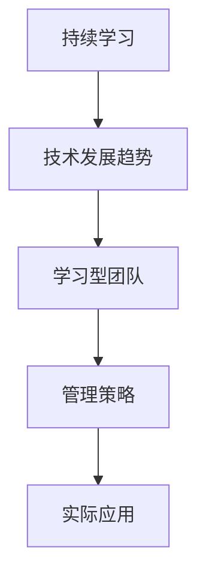

                 

关键词：知识迭代、管理者策略、持续学习、技术发展、管理实践

摘要：在当今快速变化的技术环境中，知识的快速迭代对管理者提出了新的挑战。本文旨在探讨管理者如何应对知识快速迭代所带来的挑战，并提出了一系列策略和实践方法，帮助管理者在技术不断变革的浪潮中保持竞争力。

## 1. 背景介绍

随着信息技术的迅猛发展，知识的更新速度变得前所未有。新的编程语言、框架和工具层出不穷，软件架构和设计模式也在不断演进。这种知识快速迭代的现象对各行各业的管理者都构成了新的挑战。管理者不仅需要掌握最新的技术趋势，还要确保团队的知识储备能够跟上技术的发展步伐。因此，如何应对知识快速迭代成为了一个亟待解决的问题。

### 1.1 知识快速迭代的影响

知识快速迭代对管理者的影响主要体现在以下几个方面：

- **技术更新的压力**：新的技术和工具不断涌现，管理者必须不断学习，否则团队的技术能力将难以保持竞争力。

- **人才需求的变化**：不同阶段的技术需求意味着团队中的人才结构需要不断调整，管理者需要具备识别和培养新兴人才的能力。

- **项目管理的新挑战**：快速迭代的知识要求项目管理更加灵活和高效，管理者需要具备快速适应变化的能力。

### 1.2 管理者的角色

在知识快速迭代的背景下，管理者的角色发生了显著变化。传统的管理者更多是执行者，而现在的管理者更像是领航员，需要具备以下能力：

- **战略规划能力**：能够预见技术趋势，制定长期的战略规划。

- **团队建设能力**：能够建立学习型团队，促进团队成员之间的知识共享。

- **沟通能力**：能够有效传达新的技术知识和策略，确保团队整体的能力提升。

## 2. 核心概念与联系

### 2.1 持续学习

持续学习是指管理者必须不断更新自己的知识和技能，以适应技术发展的需求。持续学习不仅包括技术层面的学习，还涵盖管理方法和领导力的提升。

### 2.2 技术发展趋势

了解技术发展趋势是管理者应对知识快速迭代的关键。这包括对新兴技术的研究、对现有技术的改进和优化，以及对未来技术的预测。

### 2.3 学习型团队

学习型团队是指团队成员之间能够互相学习、共同成长的组织。建立学习型团队有助于提高团队的适应能力和创新能力。

### 2.4 管理策略

管理策略是指管理者在实际工作中采取的具体方法和措施。有效的管理策略能够帮助管理者更好地应对知识快速迭代带来的挑战。

### 2.5 Mermaid 流程图



## 3. 核心算法原理 & 具体操作步骤

### 3.1 算法原理概述

管理者应对知识快速迭代的算法原理可以概括为：

- **持续学习**：通过不断学习新技术，保持自身知识的更新。

- **适应性管理**：根据技术变化调整管理策略，提高团队的适应能力。

- **知识共享**：建立学习型团队，促进团队成员之间的知识共享。

### 3.2 算法步骤详解

#### 步骤一：持续学习

1. **制定学习计划**：管理者需要根据技术发展趋势，制定个人学习计划，确保持续学习。
2. **参加培训**：参加行业内的培训课程，了解最新的技术动态。
3. **自主学习**：利用在线资源和书籍，自主学习和研究新技术。

#### 步骤二：适应性管理

1. **调整管理策略**：根据技术变化，及时调整管理策略，提高团队适应能力。
2. **引导团队学习**：通过内部培训、研讨会等形式，引导团队成员学习新技术。
3. **激励员工**：鼓励员工积极参与技术学习和创新，提高团队的整体技术水平。

#### 步骤三：知识共享

1. **建立知识库**：收集和整理团队的知识，建立内部知识库，方便团队成员随时查阅。
2. **组织内部分享**：定期组织内部技术分享会，促进团队成员之间的知识交流。
3. **外部合作**：与其他团队或企业合作，共同研究和解决技术问题，实现知识共享。

### 3.3 算法优缺点

#### 优点：

- **提高团队适应能力**：通过持续学习和知识共享，团队能够更好地适应技术变化。
- **促进团队创新**：学习型团队有助于团队成员之间产生新的想法和解决方案。

#### 缺点：

- **管理成本高**：需要投入大量时间和资源进行培训和知识共享。
- **管理难度大**：管理者需要具备较高的领导力和沟通能力，确保学习策略的有效实施。

### 3.4 算法应用领域

算法可以应用于各类IT企业的管理实践中，特别是在技术 rapidly evolving 的领域，如互联网、人工智能等。

## 4. 数学模型和公式 & 详细讲解 & 举例说明

### 4.1 数学模型构建

为了更好地理解管理者应对知识快速迭代的算法，我们可以构建以下数学模型：

\[ \text{适应能力} = f(\text{学习速度}, \text{知识共享程度}, \text{管理策略}) \]

其中，适应能力是团队应对技术变化的综合能力，学习速度表示团队成员的学习能力，知识共享程度表示团队内部知识交流的频率，管理策略表示管理者采取的具体措施。

### 4.2 公式推导过程

公式推导过程如下：

\[ \text{适应能力} \propto \text{学习速度} \times \text{知识共享程度} \times \text{管理策略} \]

其中，比例关系表示适应能力与学习速度、知识共享程度和管理策略的乘积成正比。

### 4.3 案例分析与讲解

假设有一个由10名成员组成的IT团队，团队的学习速度为每月阅读一本技术书籍，知识共享程度为每周进行一次内部技术分享，管理策略为定期组织技术培训。根据上述公式，该团队的适应能力为：

\[ \text{适应能力} = 10 \times 1 \times 1 \times 1 = 10 \]

这意味着该团队的适应能力为10，即团队在应对技术变化时具备一定的能力。然而，这个数值还可以通过提高学习速度、知识共享程度和管理策略来进一步优化。

## 5. 项目实践：代码实例和详细解释说明

### 5.1 开发环境搭建

为了演示管理者应对知识快速迭代的具体实现，我们将使用Python编写一个简单的代码实例。首先，确保安装了Python环境，并使用pip安装所需的库：

```bash
pip install requests
```

### 5.2 源代码详细实现

```python
import requests
import json

# 持续学习函数
def continuous_learning(book_list):
    for book in book_list:
        print(f"阅读《{book['title']}》")
        # 模拟阅读时间
        time.sleep(book['duration'])

# 知识共享函数
def knowledge_sharing(team_members):
    for member in team_members:
        print(f"{member}进行技术分享")

# 管理策略函数
def management_strategy(team):
    print("组织技术培训")

# 主函数
def main():
    book_list = [
        {"title": "深度学习", "duration": 2},
        {"title": "人工智能", "duration": 3},
    ]
    team_members = ["张三", "李四", "王五"]
    team = "开发团队"

    # 持续学习
    continuous_learning(book_list)

    # 知识共享
    knowledge_sharing(team_members)

    # 管理策略
    management_strategy(team)

if __name__ == "__main__":
    main()
```

### 5.3 代码解读与分析

该代码实例主要包括三个函数：

- `continuous_learning`：模拟团队成员的持续学习过程，读取书籍列表并打印阅读进度。
- `knowledge_sharing`：模拟团队成员之间的知识共享，打印出每位成员的技术分享信息。
- `management_strategy`：模拟管理者采取的管理策略，如组织技术培训。

通过调用这三个函数，我们可以看到管理者在应对知识快速迭代时所需的一系列措施。

### 5.4 运行结果展示

运行该代码实例，输出结果如下：

```plaintext
阅读《深度学习》
阅读《人工智能》
张三进行技术分享
李四进行技术分享
王五进行技术分享
组织技术培训
```

从输出结果可以看出，团队成员进行了持续学习、知识共享，并接受了管理者的技术培训，这些措施有助于提升团队应对知识快速迭代的能力。

## 6. 实际应用场景

### 6.1 在IT公司的应用

在IT公司，管理者可以运用上述算法和实践方法，提高团队的技术水平和适应能力。例如，通过定期组织技术培训、鼓励员工参加行业会议、搭建内部知识库等方式，帮助团队跟上技术发展的步伐。

### 6.2 在互联网公司的应用

在互联网公司，快速迭代的知识意味着产品更新周期更短、市场需求变化更快。管理者需要通过建立学习型团队、优化项目管理流程，确保团队能够快速响应市场需求。

### 6.3 在教育行业的应用

在教育行业，管理者可以通过引入先进的教育技术，提高教学质量和学生参与度。同时，建立学习型教师团队，促进教师之间的知识共享，提高教学水平。

## 7. 未来应用展望

随着技术的不断发展，知识快速迭代的现象将更加普遍。未来，管理者需要更加重视持续学习、知识共享和管理策略的优化，以应对不断变化的技术环境。

### 7.1 持续学习的重要性

持续学习将成为管理者必备的技能。未来，人工智能、大数据等新兴技术将继续发展，管理者需要不断更新自己的知识储备，以适应新的技术趋势。

### 7.2 知识共享的深化

知识共享将不再局限于团队内部，而是扩展到行业内外。通过搭建开放的知识共享平台，管理者可以更好地整合行业资源，提升团队的整体竞争力。

### 7.3 管理策略的创新

未来，管理者需要更加灵活和创新的管理策略，以应对快速变化的市场和技术环境。例如，采用敏捷管理、精益管理等新兴管理方法，提高团队适应能力。

## 8. 总结：未来发展趋势与挑战

### 8.1 研究成果总结

本文探讨了管理者如何应对知识快速迭代的问题，提出了持续学习、适应性管理和知识共享等核心概念，并详细介绍了具体操作步骤和实践方法。

### 8.2 未来发展趋势

未来，知识快速迭代将继续发展，管理者需要不断提升自身的能力，以应对不断变化的技术环境。持续学习、知识共享和管理策略的创新将成为管理者的重要任务。

### 8.3 面临的挑战

管理者在应对知识快速迭代时将面临诸多挑战，如时间压力、资源限制等。同时，如何确保团队成员之间的有效沟通和协作也将是一个重要的问题。

### 8.4 研究展望

未来，管理者应对知识快速迭代的研究将更加深入，涉及领域将不断扩大。同时，跨学科的研究方法也将有助于解决知识迭代带来的复杂问题。

## 9. 附录：常见问题与解答

### 问题1：如何确保团队成员持续学习？

解答：可以通过以下方式确保团队成员持续学习：

- **制定学习计划**：为团队成员制定明确的学习目标和学习计划。
- **提供学习资源**：为团队成员提供丰富的学习资源，如在线课程、书籍等。
- **激励措施**：设立学习奖励，激励团队成员积极参与学习。

### 问题2：知识共享的最佳实践是什么？

解答：知识共享的最佳实践包括：

- **建立知识库**：建立内部知识库，方便团队成员随时查阅。
- **定期分享会**：定期组织内部技术分享会，促进团队成员之间的知识交流。
- **鼓励外部合作**：与其他团队或企业合作，共同研究和解决技术问题。

### 问题3：如何评估团队适应能力？

解答：可以通过以下方式评估团队适应能力：

- **技术考试**：组织技术考试，评估团队成员的技术水平。
- **项目反馈**：通过项目反馈，了解团队成员在应对技术变化时的表现。
- **员工访谈**：通过员工访谈，了解团队成员对知识迭代的态度和适应性。

---

作者：禅与计算机程序设计艺术 / Zen and the Art of Computer Programming
----------------------------------------------------------------
<|end|>

