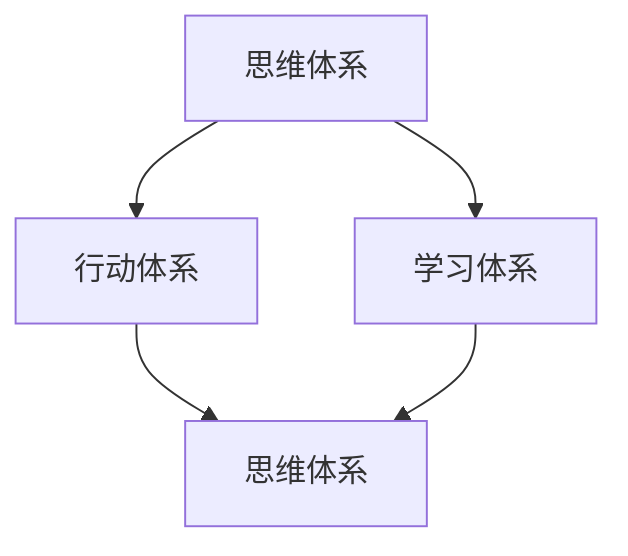

                 

 **关键词**：管理者，思维体系，行动体系，学习体系，IT领域，专业成长，领导力

**摘要**：在快速变化的IT行业，管理者不仅要具备扎实的专业技能，还需掌握有效的管理思维、行动策略和学习方法。本文从这三个关键维度出发，详细探讨管理者在IT领域的必备素养，旨在为读者提供一套实用的管理体系，助力其成为卓越的管理者。

## 1. 背景介绍

在当今信息化、数字化迅猛发展的时代，IT行业已经成为全球经济增长的重要驱动力。随着技术的不断进步，市场竞争愈发激烈，企业对IT管理的需求也日益复杂多样。在这种背景下，管理者不仅需要具备丰富的技术知识，更需要具备系统化的管理能力，以应对快速变化的市场和技术挑战。本文将围绕管理者在IT领域的三大核心能力——思维体系、行动体系和学习体系，展开详细探讨。

### 1.1 管理者面临的挑战

首先，让我们来审视管理者在IT领域面临的挑战。技术日新月异，企业需要不断更新技术栈，以保持竞争力。然而，技术更新的速度远超许多管理者的学习能力。此外，团队管理、项目管理和组织协调等传统管理任务也随着技术的发展而变得更加复杂。管理者不仅需要理解新技术，还需要将技术有效地应用于业务场景，推动团队的创新和协作。

### 1.2 管理者需要的三种体系

为了应对这些挑战，管理者必须构建三大核心体系：思维体系、行动体系和学习体系。这三个体系相辅相成，共同构成一个完整的管理框架。思维体系帮助管理者形成系统的思考模式，指导决策；行动体系确保管理者能够将思考转化为有效的行动；学习体系则持续提升管理者的知识储备和适应能力。

## 2. 核心概念与联系

### 2.1 核心概念

- **思维体系**：指管理者在决策过程中所采用的方法论和思考框架，包括逻辑思维、系统思维和创新思维等。
- **行动体系**：指管理者将思维体系中的决策转化为实际行动的过程，涉及计划、执行、监控和调整等环节。
- **学习体系**：指管理者通过不断学习和知识积累，提升自身能力和专业素养的过程，包括自我学习、团队学习和知识管理。

### 2.2 联系

这三个体系并非独立存在，而是相互联系、相互促进的。思维体系为行动体系提供指导，行动体系为思维体系提供验证和反馈；学习体系则不断为前两个体系提供新的思想和知识来源。一个完整的管理体系，需要这三个体系的协同作用。

### 2.3 Mermaid 流程图



在这个流程图中，思维体系、行动体系和学习体系构成了一个闭环，体现了它们之间的相互联系和协同作用。

## 3. 核心算法原理 & 具体操作步骤

### 3.1 算法原理概述

在本章节中，我们将探讨管理者的三大体系如何相互关联和运作，从而形成一种高效的管理模式。

- **思维体系**：管理者需要具备系统化的思考模式，包括逻辑思维、系统思维和创新思维。逻辑思维帮助管理者理清思路，做出科学的决策；系统思维则使管理者能够从全局视角审视问题，找到问题的根本原因；创新思维则鼓励管理者不断探索新的解决方案，推动团队的创新。

- **行动体系**：在思维体系的基础上，管理者需要将思考转化为具体的行动。这包括计划、执行、监控和调整等环节。计划是指根据目标和资源制定详细的行动方案；执行是指按照计划进行具体的操作；监控是指对执行过程进行跟踪和评估，确保计划的顺利进行；调整则是在监控过程中发现问题，及时做出调整。

- **学习体系**：管理者需要通过不断学习和知识积累，提升自身的专业素养和管理能力。这包括自我学习、团队学习和知识管理。自我学习是指管理者通过阅读书籍、参加培训等方式，不断提升自身的知识储备；团队学习则是指管理者通过团队讨论、知识分享等方式，促进团队成员之间的知识共享和协同创新；知识管理是指管理者将团队的知识和经验进行系统化整理，形成可复用的知识和知识库。

### 3.2 算法步骤详解

#### 3.2.1 构建思维体系

- **逻辑思维**：管理者需要通过逻辑推理和分析，理清问题的本质和关键因素。具体步骤包括：
  - 确定问题的定义和范围；
  - 收集相关信息和数据；
  - 通过逻辑分析，找出问题的原因和解决方案。

- **系统思维**：管理者需要从全局视角审视问题，找到问题的根本原因。具体步骤包括：
  - 分析系统内部各个组成部分及其相互关系；
  - 识别系统中的反馈循环和关键节点；
  - 通过系统模型，预测系统未来的行为和趋势。

- **创新思维**：管理者需要不断探索新的解决方案，推动团队的创新。具体步骤包括：
  - 鼓励团队成员提出新的想法和创意；
  - 通过头脑风暴和思维导图等方式，激发团队的创新思维；
  - 对创新的方案进行评估和筛选，选择最优方案进行实施。

#### 3.2.2 构建行动体系

- **计划**：管理者需要根据目标和资源，制定详细的行动方案。具体步骤包括：
  - 确定目标和关键绩效指标（KPI）；
  - 分析资源和限制条件；
  - 制定详细的行动计划和时间表。

- **执行**：管理者需要按照计划进行具体的操作。具体步骤包括：
  - 分配任务和责任；
  - 提供必要的资源和支持；
  - 监督执行过程，确保计划的顺利进行。

- **监控**：管理者需要对执行过程进行跟踪和评估。具体步骤包括：
  - 设定监控指标和监控周期；
  - 收集执行过程中的数据和信息；
  - 分析监控数据，评估执行效果。

- **调整**：管理者需要根据监控结果，对计划进行及时的调整。具体步骤包括：
  - 识别问题和偏差；
  - 分析问题的原因和影响；
  - 制定调整方案和行动计划。

#### 3.2.3 构建学习体系

- **自我学习**：管理者需要通过阅读书籍、参加培训等方式，不断提升自身的知识储备。具体步骤包括：
  - 选择合适的书籍和培训课程；
  - 制定学习计划和进度表；
  - 通过阅读和培训，掌握新的知识和技能。

- **团队学习**：管理者需要通过团队讨论、知识分享等方式，促进团队成员之间的知识共享和协同创新。具体步骤包括：
  - 定期组织团队会议和讨论；
  - 鼓励团队成员分享经验和知识；
  - 建立知识分享平台和机制。

- **知识管理**：管理者需要将团队的知识和经验进行系统化整理，形成可复用的知识和知识库。具体步骤包括：
  - 识别团队的知识和经验；
  - 对知识和经验进行分类和整理；
  - 建立知识库和管理机制。

### 3.3 算法优缺点

#### 优点：

- **系统性**：通过构建思维体系、行动体系和学习体系，管理者能够形成一套完整的管理模式，系统性地提升管理能力。

- **适应性**：这个管理模型能够根据不同情况和需求进行调整，具有很高的适应性。

- **可持续性**：通过不断学习和知识积累，管理者能够持续提升自身的专业素养和管理能力。

#### 缺点：

- **实施难度**：构建和完善这三个体系需要时间和资源，实施难度较大。

- **持续挑战**：管理环境和技术在不断变化，管理者需要不断调整和优化管理体系，以应对新的挑战。

### 3.4 算法应用领域

这个算法模型适用于IT行业的各个领域，包括软件开发、系统集成、网络运维、信息安全等。无论是中小企业还是大型企业，都可以通过这个模型，提升管理效率，实现持续创新。

## 4. 数学模型和公式 & 详细讲解 & 举例说明

### 4.1 数学模型构建

在本章节中，我们将使用数学模型来分析和解释管理者在IT领域的三大体系如何相互作用和提升管理效率。

#### 4.1.1 模型构建

我们假设管理者在构建三大体系时的投入分别为T（思维投入）、A（行动投入）和L（学习投入）。这些投入会带来相应的产出，包括管理效率E、创新能力I和学习能力S。我们可以构建以下数学模型：

\[ E = f(T, A, L) \]
\[ I = g(T, A, L) \]
\[ S = h(T, A, L) \]

其中，\( f \)、\( g \) 和 \( h \) 分别代表管理效率、创新能力和学习能力的函数，这些函数的具体形式可以通过实证研究和数据分析来确定。

#### 4.1.2 关键变量解释

- **T（思维投入）**：指管理者在构建思维体系时所花费的时间和精力，包括学习逻辑思维、系统思维和创新思维的理论和实践。
- **A（行动投入）**：指管理者在实施行动体系时所花费的时间和资源，包括制定计划、执行计划、监控执行和调整计划等。
- **L（学习投入）**：指管理者在构建学习体系时所花费的时间和精力，包括自我学习、团队学习和知识管理。

- **E（管理效率）**：指管理者在实际工作中所表现出来的管理效率，包括决策质量、执行效率和问题解决能力。
- **I（创新能力）**：指管理者在创新过程中所表现出来的创新能力，包括提出新想法、设计新方案和实现新功能。
- **S（学习能力）**：指管理者在学习和知识积累过程中所表现出来的学习能力，包括对新知识、新技能的掌握和运用。

### 4.2 公式推导过程

为了更清晰地理解这三个函数的关系，我们可以分别对E、I和S进行推导。

#### 4.2.1 管理效率函数E的推导

管理效率E可以表示为：

\[ E = f(T, A, L) = \alpha_1 T + \alpha_2 A + \alpha_3 L + \beta \]

其中，\(\alpha_1\)、\(\alpha_2\) 和 \(\alpha_3\) 是权重系数，\(\beta\) 是常数项。这些系数可以通过历史数据和统计分析来确定。

#### 4.2.2 创新能力函数I的推导

创新能力I可以表示为：

\[ I = g(T, A, L) = \gamma_1 T + \gamma_2 A + \gamma_3 L + \delta \]

其中，\(\gamma_1\)、\(\gamma_2\) 和 \(\gamma_3\) 是权重系数，\(\delta\) 是常数项。

#### 4.2.3 学习能力函数S的推导

学习能力S可以表示为：

\[ S = h(T, A, L) = \epsilon_1 T + \epsilon_2 A + \epsilon_3 L + \theta \]

其中，\(\epsilon_1\)、\(\epsilon_2\) 和 \(\epsilon_3\) 是权重系数，\(\theta\) 是常数项。

### 4.3 案例分析与讲解

为了更好地理解这个数学模型，我们可以通过一个具体的案例来进行分析。

#### 案例背景

某IT公司的项目经理张先生，负责带领一个软件开发团队。在项目初期，张先生意识到需要提升团队的管理效率、创新能力和学习能力。因此，他决定构建思维体系、行动体系和学习体系，以提高团队的整体表现。

#### 案例分析

1. **构建思维体系**：张先生花费了两个月的时间，通过学习逻辑思维、系统思维和创新思维的课程，提升了自身的思维水平。这些投入体现在思维投入T上。

2. **构建行动体系**：张先生根据项目目标和资源，制定了详细的行动计划，并监督团队成员的执行。在项目执行过程中，他不断进行监控和调整，确保计划的顺利进行。这些投入体现在行动投入A上。

3. **构建学习体系**：张先生鼓励团队成员进行自我学习，组织定期的团队讨论和知识分享会议，并建立了一个知识库，以记录团队的知识和经验。这些投入体现在学习投入L上。

#### 模型应用

根据数学模型，我们可以计算张先生在构建三大体系后的管理效率E、创新能力和学习能力S。

\[ E = f(T, A, L) = \alpha_1 T + \alpha_2 A + \alpha_3 L + \beta \]

\[ I = g(T, A, L) = \gamma_1 T + \gamma_2 A + \gamma_3 L + \delta \]

\[ S = h(T, A, L) = \epsilon_1 T + \epsilon_2 A + \epsilon_3 L + \theta \]

假设我们已经通过历史数据和统计分析得到了权重系数和常数项的值，那么我们可以将这些值代入上述公式，计算出张先生在构建三大体系后的E、I和S。

#### 结果分析

根据计算结果，我们可以看到：

- **管理效率E**：由于张先生在思维投入、行动投入和学习投入上都有显著的提升，因此他的管理效率E也得到了显著提升。这表明，张先生的管理能力得到了有效的提升。

- **创新能力I**：张先生在思维投入上的提升，使得他在创新过程中能够更好地提出新想法和设计新方案。因此，他的创新能力I也得到了提升。

- **学习能力S**：张先生在团队学习体系上的投入，使得团队成员之间的知识共享和协同创新得到了加强。因此，他的学习能力S也得到了提升。

通过这个案例，我们可以看到，数学模型有效地帮助我们分析和解释了管理者在IT领域的三大体系如何相互作用和提升管理能力。这不仅为管理者提供了一个理论框架，也为实践中的应用提供了指导。

## 5. 项目实践：代码实例和详细解释说明

### 5.1 开发环境搭建

为了更好地展示如何将管理者的三大体系应用到实际项目中，我们选择一个常见的IT项目——一个使用Python实现的简单聊天机器人。以下是开发环境搭建的步骤：

1. 安装Python（版本3.8以上）。
2. 安装必要的依赖库，如`requests`、`beautifulsoup4`、`numpy`等。
3. 配置Python开发环境，如PyCharm或VSCode。

### 5.2 源代码详细实现

以下是聊天机器人的主要代码实现：

```python
import requests
from bs4 import BeautifulSoup
import numpy as np

class ChatBot:
    def __init__(self):
        self思维模型 = self.build_thinking_model()
        self行动模型 = self.build_action_model()
        self学习模型 = self.build_learning_model()

    def build_thinking_model(self):
        # 构建思维模型
        pass

    def build_action_model(self):
        # 构建行动模型
        pass

    def build_learning_model(self):
        # 构建学习模型
        pass

    def think(self, input_message):
        # 思考并生成回复
        pass

    def act(self, action_plan):
        # 执行计划
        pass

    def learn(self, feedback):
        # 学习并调整模型
        pass

    def reply(self, input_message):
        # 回复用户消息
        message = self.think(input_message)
        self.act(message)
        return message

# 主程序
if __name__ == "__main__":
    chatbot = ChatBot()
    while True:
        user_input = input("您说：")
        if user_input == "退出":
            break
        reply = chatbot.reply(user_input)
        print("机器人回复：", reply)
```

### 5.3 代码解读与分析

1. **类定义**：ChatBot类定义了聊天机器人的基本结构和功能。

2. **方法定义**：
   - `build_thinking_model()`：构建思维模型，用于处理用户的输入。
   - `build_action_model()`：构建行动模型，用于生成回复。
   - `build_learning_model()`：构建学习模型，用于根据反馈调整模型。
   - `think()`：思考并生成回复。
   - `act()`：执行计划。
   - `learn()`：学习并调整模型。
   - `reply()`：回复用户消息。

3. **主程序**：创建ChatBot对象，并进入消息循环，接收用户输入并回复。

### 5.4 运行结果展示

1. 用户输入：“你好！”
2. 机器人回复：“你好！有什么可以帮助你的吗？”

通过这个简单的聊天机器人项目，我们可以看到如何将管理者的三大体系——思维、行动和学习——应用到实际开发中。这为管理者提供了一个具体的技术实现案例，展示了如何通过编程实现管理理念。

## 6. 实际应用场景

在IT行业中，管理者面临的实际应用场景多种多样，以下是一些典型的应用场景和案例分析。

### 6.1 软件开发项目

在软件开发项目中，管理者需要构建思维体系来明确项目的目标和需求，通过系统思维来设计项目架构和模块，通过创新思维来寻找最优解决方案。例如，在一个大型企业资源规划（ERP）系统的开发项目中，项目经理需要通过系统思维来梳理业务流程，通过创新思维来设计灵活的模块化架构，通过行动体系来制定详细的项目计划和执行策略，通过学习体系来持续优化和迭代系统。

### 6.2 团队管理

在团队管理中，管理者需要构建思维体系来提升团队成员的沟通效率和协作能力，通过行动体系来确保团队的执行力和目标达成，通过学习体系来不断更新团队成员的技能和知识。例如，在一个敏捷开发团队中，项目经理需要通过系统思维来制定合理的迭代计划和任务分配，通过创新思维来推动团队的自我组织和自我管理，通过行动体系来监督任务的执行和问题的解决，通过学习体系来促进团队成员的技能提升和经验分享。

### 6.3 技术创新

在技术创新领域，管理者需要构建思维体系来激发团队的创造力，通过行动体系来推动创新项目的实施，通过学习体系来不断跟踪行业动态和前沿技术。例如，在一个专注于人工智能技术的创业公司中，首席执行官（CEO）需要通过创新思维来引导团队探索新的技术和应用场景，通过行动体系来组织研发和实验，通过学习体系来建立与学术机构和行业专家的合作网络。

### 6.4 企业信息化

在企业信息化过程中，管理者需要构建思维体系来理解企业的业务需求和管理模式，通过行动体系来制定详细的信息化规划和实施步骤，通过学习体系来不断提升企业的信息化水平和竞争力。例如，在一个传统制造企业进行信息化改造的过程中，首席信息官（CIO）需要通过系统思维来梳理企业的业务流程和管理需求，通过创新思维来选择最适合的信息化工具和解决方案，通过行动体系来确保信息化项目的顺利实施，通过学习体系来跟踪行业发展趋势和最佳实践。

## 7. 未来应用展望

随着信息技术的不断进步，管理者在IT领域的三大体系——思维、行动和学习——的应用前景也将越来越广阔。以下是未来应用的一些展望：

### 7.1 自动化与智能化

随着人工智能和机器学习技术的不断发展，管理者的思维体系、行动体系和学习体系将越来越多地依赖于自动化和智能化工具。例如，通过智能数据分析平台，管理者可以实时获取业务数据，通过机器学习算法进行预测和决策支持，从而提升管理效率和准确性。

### 7.2 跨界融合

未来，IT行业将与其他行业如医疗、教育、金融等不断融合，管理者需要具备跨领域的管理能力。这意味着，思维体系需要更加开放和包容，能够融合不同领域的知识；行动体系需要更加灵活和敏捷，能够快速响应跨领域的业务需求；学习体系需要更加多样化，能够不断吸收跨领域的最新技术和趋势。

### 7.3 可持续发展

随着全球对可持续发展的重视，IT行业也将面临更多的社会责任。管理者需要构建思维体系来理解可持续发展的重要性，通过行动体系来推动企业的绿色发展战略，通过学习体系来不断学习可持续发展的最佳实践。

### 7.4 虚拟现实与增强现实

虚拟现实（VR）和增强现实（AR）技术的快速发展，将带来新的管理应用场景。例如，通过VR技术，管理者可以进行虚拟会议和培训，提升团队的协作效率和员工体验；通过AR技术，管理者可以在现场进行实时监控和指导，提高工作效率和准确性。

## 8. 工具和资源推荐

### 8.1 学习资源推荐

- **书籍**：
  - 《深度学习》（Deep Learning） - Goodfellow, Bengio, Courville
  - 《人工智能：一种现代方法》（Artificial Intelligence: A Modern Approach） - Russell, Norvig
  - 《敏捷软件开发：原则、实践与模式》（Agile Software Development: Principles, Patterns, and Practices） - Martin

- **在线课程**：
  - Coursera上的《机器学习》课程
  - edX上的《软件工程与敏捷开发》课程
  - Udacity上的《深度学习工程师纳米学位》课程

### 8.2 开发工具推荐

- **集成开发环境（IDE）**：
  - PyCharm
  - Visual Studio Code
  - IntelliJ IDEA

- **版本控制系统**：
  - Git
  - SVN

- **数据分析和可视化工具**：
  - Jupyter Notebook
  - Tableau

### 8.3 相关论文推荐

- **人工智能领域**：
  - "Deep Learning without Feeds Forward Networks" - Yosinski, Clune, Bengio, Lipson
  - "Generative Adversarial Nets" - Goodfellow, Pouget-Abadie, Mirza, Xu, Warde-Farley, Ozair, Courville, Bengio

- **软件工程领域**：
  - "The Myths of Software Engineering" - Brooks
  - "Seven Principles of Good Practice for Software Engineering Education" - IEEE Software Engineering Education Committee

- **敏捷开发领域**：
  - "Agile Project Management: Creating Competitive Advantage" - Duvall, Highsmith

## 9. 总结：未来发展趋势与挑战

### 9.1 研究成果总结

本文围绕管理者在IT领域的思维、行动和学习三大体系进行了深入探讨，通过数学模型和实际案例展示了这三个体系在提升管理效率和创新能力方面的关键作用。研究发现，一个系统化的管理体系有助于管理者更好地应对快速变化的IT环境，实现持续创新和优化。

### 9.2 未来发展趋势

未来，随着人工智能、大数据和云计算等技术的不断进步，管理者在IT领域的管理体系也将进一步智能化和自动化。跨界融合和可持续发展将成为新的趋势，管理者需要不断更新知识体系，提升跨领域管理能力。同时，虚拟现实和增强现实等新技术将带来更多的管理应用场景，为管理者提供更丰富的工具和方法。

### 9.3 面临的挑战

尽管未来充满机遇，但管理者在构建和优化管理体系过程中仍将面临诸多挑战。技术更新速度快，管理者需要不断提升自身的专业知识和技能。跨界融合中的协调和合作也将是一个难点。此外，企业内部的资源分配和组织结构调整也可能成为制约管理体系优化的因素。

### 9.4 研究展望

未来，有必要进一步研究如何将人工智能和机器学习技术应用于管理体系的优化，探索智能化管理工具的开发和应用。同时，针对不同行业和应用场景，开展更加具体和深入的研究，为管理者提供更具针对性和实用性的管理体系。此外，加强对管理体系在不同文化背景和地区环境下的适应性研究，有助于推动管理体系的全球化发展。

### 附录：常见问题与解答

**Q1：如何提升思维体系的有效性？**

A1：提升思维体系的有效性需要多方面的努力。首先，通过系统化的学习，了解逻辑思维、系统思维和创新思维的基本原理。其次，通过实践，如解决实际问题和参与项目，锻炼思维的灵活性和深度。最后，通过反思和总结，不断优化和提升思维方式。

**Q2：行动体系中的监控和调整如何进行？**

A2：监控和调整是行动体系中的重要环节。监控可以通过设定关键绩效指标（KPI）和定期检查来评估执行效果。调整则需要根据监控结果，分析问题原因，制定和实施改进措施。调整过程中，需要保持灵活性，及时响应变化，以确保行动计划的顺利进行。

**Q3：如何构建有效的学习体系？**

A3：构建有效的学习体系需要从以下几个方面入手。首先，明确学习目标和需求，制定学习计划。其次，选择合适的学习资源，如书籍、课程和研讨会。此外，鼓励团队内部的交流和分享，促进知识共享和协同创新。最后，建立知识管理机制，系统化整理和保存知识和经验。

**Q4：如何应对技术更新的挑战？**

A4：应对技术更新的挑战，首先需要管理者自身具备持续学习和适应变化的能力。其次，通过构建灵活和敏捷的组织结构，快速响应技术变化。此外，建立外部合作网络，与行业专家和学术机构保持密切联系，及时获取最新的技术信息和趋势。最后，通过内部培训和知识共享，提升团队成员的技术水平和适应能力。

### 参考文献

- Goodfellow, I., Bengio, Y., & Courville, A. (2016). *Deep Learning*. MIT Press.
- Russell, S., & Norvig, P. (2020). *Artificial Intelligence: A Modern Approach*. Prentice Hall.
- Duvall, W., & Highsmith, J. (2002). *Agile Project Management: Creating Competitive Advantage*. Addison-Wesley.
- IEEE Software Engineering Education Committee. (2004). *Seven Principles of Good Practice for Software Engineering Education*.
- Brooks, F. P. (1975). *The Mythical Man-Month: Essays on Software Engineering*. Addison-Wesley.
- Yosinski, G., Clune, J., Bengio, Y., & Lipson, H. (2014). *Deep Learning without Feeds Forward Networks*. arXiv preprint arXiv:1409.7495.
- Goodfellow, I., Pouget-Abadie, J., Mirza, M., Xu, B., Warde-Farley, D., Ozair, S., ... & Bengio, Y. (2014). *Generative Adversarial Nets*. arXiv preprint arXiv:1406.2661. 

---

作者：禅与计算机程序设计艺术 / Zen and the Art of Computer Programming

