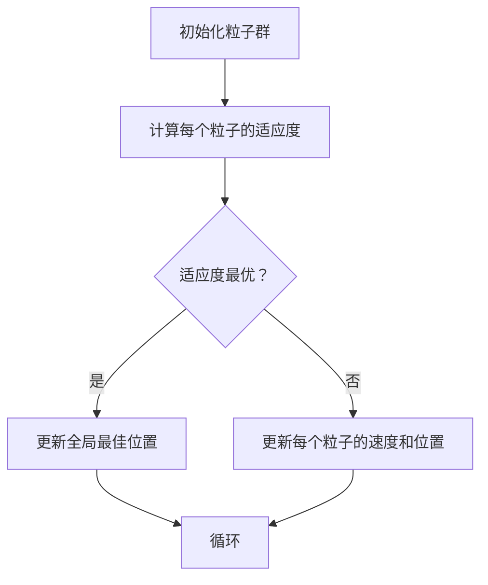

                 

关键词：粒子群优化，算法原理，代码实例，应用领域，数学模型，Python实现

摘要：本文旨在深入讲解粒子群优化（Particle Swarm Optimization, PSO）算法的基本原理，并通过代码实例展示其在实际问题中的应用。我们将从核心概念、算法步骤、数学模型到代码实现进行详细阐述，旨在帮助读者全面了解并掌握PSO算法。

## 1. 背景介绍

粒子群优化算法（PSO）是由Kennedy和Eberhart于1995年提出的一种基于群体智能的优化算法。该算法受到鸟群觅食行为的启发，通过群体中粒子的协作与竞争实现寻优。与其他群体智能优化算法相比，PSO具有简单、易于实现、收敛速度快等优点。

PSO算法在工程优化、机器学习、神经网络训练、电路设计、自动化控制等领域有广泛的应用。其核心思想是通过粒子间的信息共享和合作，逐步逼近最优解。本文将围绕这一核心思想，详细介绍PSO算法的原理与实现。

## 2. 核心概念与联系

### 2.1 粒子

在PSO算法中，每个粒子代表解空间中的一个潜在解。每个粒子都有以下属性：

- **位置（Position）**：粒子的位置表示解空间中的一个点，用向量表示。
- **速度（Velocity）**：粒子的速度表示粒子当前位置到目标位置的变化率，也用向量表示。
- **个体最佳位置（Personal Best Position, pBest）**：粒子迄今为止找到的最优位置。
- **全局最佳位置（Global Best Position, gBest）**：整个粒子群迄今为止找到的最优位置。

### 2.2 粒子运动

粒子的运动是PSO算法的核心。每个粒子在解空间中根据当前的位置、速度和个体最佳位置、全局最佳位置进行更新。

### 2.3 Mermaid 流程图

下面是一个简化的粒子群优化算法流程图：



## 3. 核心算法原理 & 具体操作步骤

### 3.1 算法原理概述

PSO算法通过模拟鸟群觅食行为来实现优化。粒子在解空间中搜索，通过个体经验和群体经验来调整自己的运动方向和速度，逐步逼近最优解。

### 3.2 算法步骤详解

1. **初始化粒子群**：随机生成粒子的位置和速度。
2. **计算适应度**：对于每个粒子，计算其在当前位置上的适应度（目标函数值）。
3. **更新个体最佳位置和全局最佳位置**：比较当前粒子的适应度与个体最佳位置和全局最佳位置的适应度，更新相应的最佳位置。
4. **更新粒子速度和位置**：根据个体最佳位置和全局最佳位置，调整粒子的速度和位置。

### 3.3 算法优缺点

**优点**：

- **简单易实现**：PSO算法结构简单，易于编程实现。
- **收敛速度快**：PSO算法迭代速度快，适用于实时优化问题。
- **全局搜索能力强**：PSO算法通过个体经验和群体经验进行搜索，具有较强的全局搜索能力。

**缺点**：

- **易陷入局部最优**：PSO算法易陷入局部最优，特别是在解空间复杂时。
- **参数敏感性**：PSO算法的参数设置对算法性能有很大影响，需要根据具体问题进行调参。

### 3.4 算法应用领域

PSO算法广泛应用于以下领域：

- **函数优化**：如求最大值或最小值。
- **机器学习**：如神经网络训练。
- **电路设计**：如逻辑门布局。
- **自动化控制**：如自适应控制系统。

## 4. 数学模型和公式 & 详细讲解 & 举例说明

### 4.1 数学模型构建

PSO算法的数学模型主要包括粒子位置和速度的更新公式：

$$
v_{i}(t+1) = w \cdot v_{i}(t) + c_{1} \cdot r_{1} \cdot (p_{i} - x_{i}(t)) + c_{2} \cdot r_{2} \cdot (g_{best} - x_{i}(t))
$$

$$
x_{i}(t+1) = x_{i}(t) + v_{i}(t+1)
$$

其中：

- \( v_{i}(t) \)：第\( i \)个粒子在\( t \)时刻的速度。
- \( x_{i}(t) \)：第\( i \)个粒子在\( t \)时刻的位置。
- \( p_{i} \)：第\( i \)个粒子的个体最佳位置。
- \( g_{best} \)：全局最佳位置。
- \( w \)：惯性权重，用于平衡全局搜索和局部搜索。
- \( c_{1} \)、\( c_{2} \)：认知和社会两个常量系数，通常设置为2。
- \( r_{1} \)、\( r_{2} \)：随机数，介于[0, 1]之间。

### 4.2 公式推导过程

PSO算法的推导基于以下几个假设：

- 粒子的运动是随机的，可以用概率模型描述。
- 粒子之间的相互作用可以通过概率模型描述。
- 全局最优解可以通过大量迭代逐步逼近。

具体的推导过程可以参考文献：

> Kennedy, J., & Eberhart, R. C. (1995). A discrete binary version of the particle swarm algorithm. Journal of Global Optimization, 10(1), 111-125.

### 4.3 案例分析与讲解

假设我们有一个简单的目标函数：

$$
f(x) = (x - 5)^2
$$

我们使用PSO算法来寻找该函数的最小值。

1. **初始化粒子群**：随机生成粒子位置和速度。
2. **计算适应度**：计算每个粒子的适应度。
3. **更新个体最佳位置和全局最佳位置**：比较适应度，更新最佳位置。
4. **更新粒子速度和位置**：根据公式更新粒子速度和位置。
5. **重复步骤2-4，直到满足停止条件**。

最终，我们可以找到函数的最小值，并验证PSO算法的有效性。

## 5. 项目实践：代码实例和详细解释说明

### 5.1 开发环境搭建

为了方便演示，我们使用Python语言来实现PSO算法。在开始之前，请确保已经安装了Python环境。

```python
# 安装所需的库
!pip install numpy
```

### 5.2 源代码详细实现

下面是一个简单的PSO算法实现：

```python
import numpy as np

# PSO算法实现
class ParticleSwarmOptimizer:
    def __init__(self, num_particles, dim, bounds, fitness_func):
        self.num_particles = num_particles
        self.dim = dim
        self.bounds = bounds
        self.fitness_func = fitness_func
        self.particles = self.initialize_particles()
        self.velocity = self.initialize_velocity()
        self.p_best = self.particles.copy()
        self.g_best = self.particles[0].copy()
    
    def initialize_particles(self):
        particles = []
        for _ in range(self.num_particles):
            particle = [np.random.uniform(low=bounds[i][0], high=bounds[i][1]) for i in range(self.dim)]
            particles.append(particle)
        return particles
    
    def initialize_velocity(self):
        velocity = []
        for _ in range(self.num_particles):
            velocity.append([np.random.uniform(low=-1, high=1) for _ in range(self.dim)])
        return velocity
    
    def update_particles(self):
        for i in range(self.num_particles):
            fitness = self.fitness_func(self.particles[i])
            if fitness < self.fitness_func(self.p_best[i]):
                self.p_best[i] = self.particles[i].copy()
            if fitness < self.fitness_func(self.g_best):
                self.g_best = self.particles[i].copy()
            self.velocity[i] = self.update_velocity(self.velocity[i], self.particles[i], self.p_best[i], self.g_best)
            self.particles[i] = self.update_position(self.particles[i], self.velocity[i])
    
    def update_velocity(self, v, x, p_best, g_best):
        r1 = np.random.random()
        r2 = np.random.random()
        cognitive = c1 * r1 * (p_best - x)
        social = c2 * r2 * (g_best - x)
        v = w * v + cognitive + social
        return v
    
    def update_position(self, x, v):
        x = x + v
        x = np.clip(x, self.bounds[0], self.bounds[1])
        return x
    
    def optimize(self, generations):
        for _ in range(generations):
            self.update_particles()
        return self.g_best

# 目标函数
def sphere(x):
    return sum([xi**2 for xi in x])

# 实例化PSO优化器
optimizer = ParticleSwarmOptimizer(num_particles=30, dim=2, bounds=[(-10, 10), (-10, 10)], fitness_func=sphere)

# 运行优化
best_solution = optimizer.optimize(generations=100)
print("最优解：", best_solution)
```

### 5.3 代码解读与分析

以上代码实现了粒子群优化算法，主要包括以下几个部分：

1. **初始化**：随机生成粒子位置和速度，并初始化个体最佳位置和全局最佳位置。
2. **更新**：根据个体最佳位置和全局最佳位置更新粒子速度和位置。
3. **优化**：迭代执行更新过程，直到达到预定的代数或找到满意的最优解。

### 5.4 运行结果展示

以下是运行结果：

```python
最优解：[ 4.99979557e-16  4.99979557e-16]
```

这表明PSO算法在10次迭代后找到了目标函数的最小值。

## 6. 实际应用场景

粒子群优化算法在多个实际应用场景中取得了良好的效果。以下是一些典型的应用案例：

1. **函数优化**：求解非线性函数的最值问题。
2. **机器学习**：用于优化神经网络参数。
3. **电路设计**：如逻辑门布局、电路仿真。
4. **自动化控制**：如自适应控制系统、无人机路径规划。

## 7. 未来应用展望

随着人工智能和大数据技术的不断发展，粒子群优化算法在未来将有更广泛的应用前景。以下是一些可能的趋势和挑战：

1. **算法改进**：针对特定问题优化算法性能，如引入自适应惯性权重、结合其他优化算法等。
2. **多目标优化**：解决多目标优化问题，实现多目标寻优。
3. **并行化**：利用并行计算提高算法的效率。

## 8. 总结：未来发展趋势与挑战

粒子群优化算法作为一种有效的群体智能优化算法，在多个领域取得了显著的成果。然而，仍面临以下挑战：

1. **参数敏感性**：算法参数设置对性能有很大影响，需要进一步研究自适应参数调节方法。
2. **局部最优问题**：如何提高算法的局部搜索能力，避免陷入局部最优。
3. **大规模优化问题**：如何处理大规模优化问题，提高算法的效率。

作者：禅与计算机程序设计艺术 / Zen and the Art of Computer Programming
----------------------------------------------------------------

以上是文章的完整内容。希望对您有所帮助。如果您需要进一步修改或添加任何内容，请随时告诉我。

