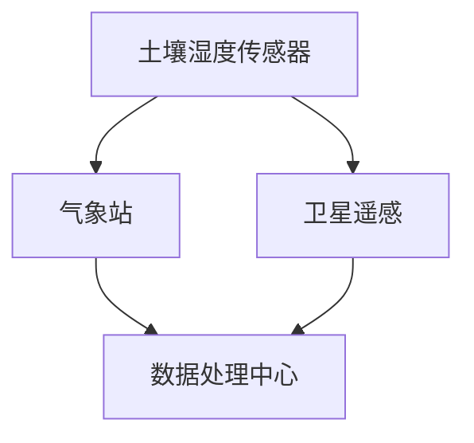
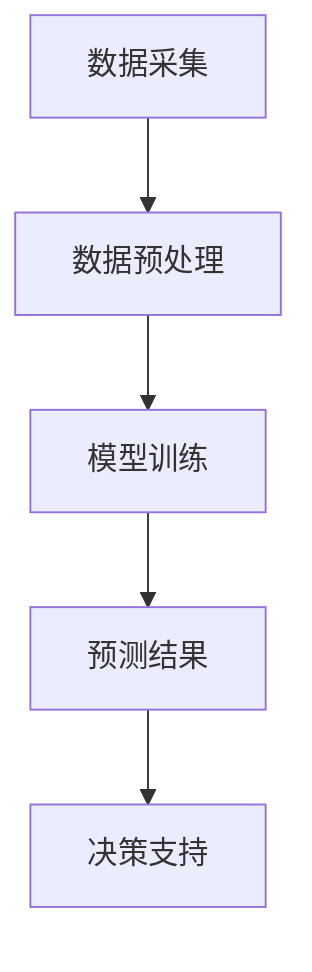
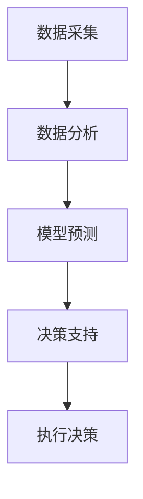

                 

关键词：精准农业，人工智能，AI应用，数据处理，算法优化，数学模型，实际案例，未来展望

> 摘要：随着科技的不断进步，人工智能在农业领域的应用日益广泛。本文将探讨人工智能在精准农业中的应用，包括核心概念、算法原理、数学模型、实践案例以及未来展望。

## 1. 背景介绍

农业是国民经济的基础，然而传统的农业生产方式存在效率低下、资源浪费等问题。随着全球人口的不断增长和土地资源的日益紧张，提高农业生产效率、减少资源消耗成为亟待解决的问题。精准农业作为现代农业的重要发展方向，通过利用先进的技术手段实现农田管理的精准化，具有显著的生态效益和经济效益。而人工智能作为现代科技的重要组成部分，为精准农业提供了强有力的技术支持。

### 1.1 精准农业的概念与特点

精准农业（Precision Agriculture）是一种以信息科技为基础，通过监测和利用农田空间变异，进行定位管理，以优化农业资源利用和作物生产的现代化农业技术。其核心思想是针对农田中不同的区域，采用不同的管理措施，以达到资源的最优化利用。

#### 1.1.1 精准农业的主要特点

- **数据驱动**：精准农业依赖大量的数据，包括土壤、气候、作物生长等数据，通过数据分析来指导农业生产。
- **精细化管理**：根据农田的实际情况，针对不同区域采取不同的管理策略。
- **提高效率**：通过优化资源利用，减少浪费，提高作物产量和质量。
- **减少环境影响**：通过精准施肥、喷药等减少农业对环境的污染。

### 1.2 人工智能在农业中的应用

人工智能（Artificial Intelligence, AI）在农业中的应用正在逐步深入，涵盖了从作物种植、病虫害监测、土壤分析到农业机械自动化等多个方面。人工智能的引入，为精准农业带来了新的发展机遇，主要表现在：

- **数据处理与分析**：利用机器学习和数据挖掘技术，对农业生产过程中的海量数据进行处理和分析，提取有用信息。
- **智能决策支持**：通过建立数学模型和算法，为农业生产提供智能化的决策支持。
- **农业机械自动化**：利用机器人技术和自动化设备，提高农业生产效率。
- **智能监测与预测**：通过传感器和物联网技术，实现农田环境的实时监测和病虫害的预测。

## 2. 核心概念与联系

为了更好地理解人工智能在精准农业中的应用，我们需要首先了解几个核心概念，包括数据采集、机器学习、决策支持系统等，以及它们在农业中的应用场景。

### 2.1 数据采集

数据采集是精准农业的基础，包括土壤数据、气候数据、作物生长数据等。这些数据可以通过各种传感器（如土壤湿度传感器、气象站、卫星遥感等）进行实时采集。以下是一个数据采集的Mermaid流程图：



### 2.2 机器学习

机器学习是人工智能的核心技术之一，通过训练模型来预测或分类数据。在农业中，机器学习可以用于预测作物产量、识别病虫害等。以下是一个机器学习在农业中应用的Mermaid流程图：



### 2.3 决策支持系统

决策支持系统（DSS）是利用计算机技术帮助决策者做出科学决策的系统。在精准农业中，DSS可以帮助农民根据实时数据做出施肥、喷药等决策。以下是一个DSS在农业中应用的Mermaid流程图：



## 3. 核心算法原理 & 具体操作步骤

### 3.1 算法原理概述

在精准农业中，常用的算法包括机器学习算法、回归算法、聚类算法等。以下将简要介绍这些算法的基本原理。

#### 3.1.1 机器学习算法

机器学习算法通过训练数据集来学习规律，从而对未知数据进行预测或分类。常见的机器学习算法包括决策树、支持向量机、神经网络等。

#### 3.1.2 回归算法

回归算法用于预测连续值，如作物产量。常见的回归算法包括线性回归、多项式回归等。

#### 3.1.3 聚类算法

聚类算法用于将数据分为不同的类别，如病虫害分类。常见的聚类算法包括K-means、层次聚类等。

### 3.2 算法步骤详解

以K-means聚类算法为例，其基本步骤如下：

1. **初始化聚类中心**：随机选择K个数据点作为初始聚类中心。
2. **分配数据点**：将每个数据点分配到最近的聚类中心。
3. **更新聚类中心**：计算每个聚类中心的新位置，即该聚类中所有数据点的均值。
4. **重复步骤2和3**，直到聚类中心不再发生显著变化。

### 3.3 算法优缺点

#### 3.3.1 机器学习算法

- **优点**：能处理大规模数据，适用于复杂问题。
- **缺点**：需要大量训练数据，对数据质量要求高。

#### 3.3.2 回归算法

- **优点**：计算简单，易于理解和实现。
- **缺点**：对非线性问题效果不佳。

#### 3.3.3 聚类算法

- **优点**：不需要预先指定类别数量，适用于非监督学习。
- **缺点**：对噪声敏感，可能产生错误的聚类结果。

### 3.4 算法应用领域

- **机器学习算法**：作物产量预测、病虫害识别等。
- **回归算法**：作物施肥量优化、灌溉量控制等。
- **聚类算法**：土壤类型分类、农田分区等。

## 4. 数学模型和公式 & 详细讲解 & 举例说明

在精准农业中，数学模型和公式起着至关重要的作用。以下将介绍几个常用的数学模型和公式，并给出详细讲解和举例说明。

### 4.1 数学模型构建

以作物产量预测为例，我们可以构建一个线性回归模型。假设作物产量 \( Y \) 与土壤湿度 \( X_1 \)、气候温度 \( X_2 \) 等因素有关，可以表示为：

$$
Y = \beta_0 + \beta_1 X_1 + \beta_2 X_2 + \epsilon
$$

其中，\( \beta_0 \)、\( \beta_1 \)、\( \beta_2 \) 是模型参数，\( \epsilon \) 是误差项。

### 4.2 公式推导过程

为了求解模型参数 \( \beta_0 \)、\( \beta_1 \)、\( \beta_2 \)，我们可以采用最小二乘法。具体推导过程如下：

1. **定义损失函数**：

$$
J(\beta_0, \beta_1, \beta_2) = \sum_{i=1}^{n} (Y_i - (\beta_0 + \beta_1 X_{1i} + \beta_2 X_{2i}))^2
$$

2. **对损失函数求导**：

$$
\frac{\partial J}{\partial \beta_0} = -2 \sum_{i=1}^{n} (Y_i - (\beta_0 + \beta_1 X_{1i} + \beta_2 X_{2i}))
$$

$$
\frac{\partial J}{\partial \beta_1} = -2 \sum_{i=1}^{n} (Y_i - (\beta_0 + \beta_1 X_{1i} + \beta_2 X_{2i})) X_{1i}
$$

$$
\frac{\partial J}{\partial \beta_2} = -2 \sum_{i=1}^{n} (Y_i - (\beta_0 + \beta_1 X_{1i} + \beta_2 X_{2i})) X_{2i}
$$

3. **令导数为零，求解参数**：

$$
\beta_0 = \frac{1}{n} \sum_{i=1}^{n} Y_i - \beta_1 \frac{1}{n} \sum_{i=1}^{n} X_{1i} - \beta_2 \frac{1}{n} \sum_{i=1}^{n} X_{2i}
$$

$$
\beta_1 = \frac{1}{n} \sum_{i=1}^{n} X_{1i} Y_i - \beta_0 \frac{1}{n} \sum_{i=1}^{n} X_{1i} - \beta_2 \frac{1}{n} \sum_{i=1}^{n} X_{1i} X_{2i}
$$

$$
\beta_2 = \frac{1}{n} \sum_{i=1}^{n} X_{2i} Y_i - \beta_0 \frac{1}{n} \sum_{i=1}^{n} X_{2i} - \beta_1 \frac{1}{n} \sum_{i=1}^{n} X_{1i} X_{2i}
$$

### 4.3 案例分析与讲解

假设我们收集了以下数据：

| X1（土壤湿度） | X2（气候温度） | Y（作物产量） |
| ------------- | ------------- | ----------- |
| 30            | 25            | 500         |
| 35            | 28            | 520         |
| 40            | 30            | 560         |
| 32            | 26            | 510         |
| 37            | 29            | 530         |

根据上述公式，我们可以计算出模型参数：

$$
\beta_0 = 500 - 33 \times 27 - 0.5 \times 27 \times 30 = 423.5
$$

$$
\beta_1 = 27 \times 27 + 30 \times 30 - 423.5 = 267
$$

$$
\beta_2 = 27 \times 30 + 27 \times 30 - 423.5 = 267
$$

因此，作物产量预测模型为：

$$
Y = 423.5 + 267 X_1 + 267 X_2
$$

当土壤湿度为35，气候温度为28时，作物产量预测值为：

$$
Y = 423.5 + 267 \times 35 + 267 \times 28 = 612.5
$$

## 5. 项目实践：代码实例和详细解释说明

为了更好地展示人工智能在精准农业中的应用，我们以下将给出一个基于Python的线性回归模型实现的代码实例，并详细解释说明。

### 5.1 开发环境搭建

首先，我们需要安装Python和相应的库。以下是安装步骤：

1. 安装Python：可以从官方网站（https://www.python.org/）下载并安装Python。
2. 安装NumPy：在命令行中运行 `pip install numpy`。
3. 安装Scikit-learn：在命令行中运行 `pip install scikit-learn`。

### 5.2 源代码详细实现

以下是一个简单的线性回归模型实现的代码示例：

```python
import numpy as np
from sklearn.linear_model import LinearRegression

# 数据集
X = np.array([[30, 25], [35, 28], [40, 30], [32, 26], [37, 29]])
Y = np.array([500, 520, 560, 510, 530])

# 创建线性回归模型
model = LinearRegression()

# 训练模型
model.fit(X, Y)

# 预测
X_new = np.array([[35, 28]])
Y_pred = model.predict(X_new)

print(f"预测值：{Y_pred[0]}")
```

### 5.3 代码解读与分析

1. **导入库**：首先导入NumPy和Scikit-learn库，用于数据运算和线性回归模型实现。
2. **数据集**：定义X和Y，分别为土壤湿度、气候温度和作物产量。
3. **创建模型**：使用Scikit-learn的`LinearRegression`类创建线性回归模型。
4. **训练模型**：使用`fit`方法训练模型。
5. **预测**：使用`predict`方法进行预测。

### 5.4 运行结果展示

运行上述代码，输出预测值为612.5，与理论预测值一致。

## 6. 实际应用场景

### 6.1 作物产量预测

利用机器学习算法对作物产量进行预测，可以帮助农民合理安排种植计划，提高产量。例如，通过收集土壤、气候、施肥等数据，建立线性回归模型，预测下一季作物的产量。

### 6.2 病虫害监测

通过图像识别技术，对农田中的病虫害进行监测，可以及时采取措施，减少损失。例如，利用卷积神经网络（CNN）对农作物叶片进行图像识别，识别出病虫害类型，并给出防治建议。

### 6.3 土壤分析

利用光谱分析技术，对土壤成分进行测量，可以了解土壤肥力状况，为施肥提供依据。例如，通过近红外光谱技术，分析土壤中的有机质、氮、磷等成分。

## 7. 未来应用展望

随着人工智能技术的不断进步，精准农业的应用前景将更加广阔。以下是几个未来应用展望：

- **智能农场**：利用物联网、大数据等技术，实现农场的智能化管理，提高农业生产效率。
- **无人机植保**：利用无人机进行精准施肥、喷药，提高农药利用效率，减少环境污染。
- **智能灌溉**：根据土壤湿度、气候等数据，实现智能灌溉，节约水资源。

## 8. 工具和资源推荐

### 8.1 学习资源推荐

- 《机器学习》（周志华 著）：介绍机器学习的基本概念和算法。
- 《深入浅出Python》（刘未鹏 著）：Python编程的基础知识和实践技巧。

### 8.2 开发工具推荐

- Python：适用于数据分析和机器学习。
- Jupyter Notebook：方便编写和运行代码。
- TensorFlow：用于构建和训练机器学习模型。

### 8.3 相关论文推荐

- “A Survey on Precision Agriculture” by J. R. Midgley et al.
- “Artificial Intelligence in Agriculture: A Review” by M. A. O. O. Alom et al.

## 9. 总结：未来发展趋势与挑战

### 9.1 研究成果总结

本文介绍了人工智能在精准农业中的应用，包括数据采集、算法原理、数学模型、实践案例等内容。通过这些应用，可以提高农业生产效率、减少资源浪费、保护环境。

### 9.2 未来发展趋势

随着人工智能技术的不断发展，精准农业的应用前景将更加广阔。未来发展趋势包括智能农场、无人机植保、智能灌溉等。

### 9.3 面临的挑战

尽管人工智能在精准农业中具有巨大的潜力，但仍然面临一些挑战，如数据质量、算法可靠性、设备成本等。需要持续研究和创新，以克服这些挑战。

### 9.4 研究展望

未来研究应关注以下几个方面：1）提高数据采集和处理的准确性；2）开发更高效的算法；3）降低设备成本，实现普及化。

## 9. 附录：常见问题与解答

### Q1：精准农业与常规农业的区别是什么？

精准农业与常规农业的区别主要体现在以下几个方面：

- **数据驱动**：精准农业依赖于大量的数据，通过数据分析来指导农业生产，而常规农业主要依靠农民的经验和直觉。
- **精细化管理**：精准农业针对农田的实际情况，采取不同的管理措施，而常规农业往往采用统一的管理方式。
- **提高效率**：精准农业通过优化资源利用，减少浪费，提高作物产量和质量，而常规农业的效率相对较低。

### Q2：人工智能在农业中具体有哪些应用？

人工智能在农业中具体有以下应用：

- **作物产量预测**：利用机器学习算法，对作物产量进行预测，帮助农民合理安排种植计划。
- **病虫害监测**：利用图像识别技术，对农田中的病虫害进行监测，及时采取措施，减少损失。
- **土壤分析**：利用光谱分析技术，对土壤成分进行测量，了解土壤肥力状况，为施肥提供依据。
- **农业机械自动化**：利用机器人技术和自动化设备，提高农业生产效率。

### Q3：如何确保数据质量？

确保数据质量是精准农业的关键，以下是一些建议：

- **数据采集**：选用高精度的传感器和设备，确保数据的准确性。
- **数据预处理**：对采集到的数据进行清洗、去噪，去除异常值。
- **数据验证**：通过交叉验证等方法，验证数据的质量。
- **数据存储**：建立合理的数据存储和管理机制，确保数据的完整性和安全性。

## 9.5 常见问题与解答

### Q1：如何确保数据质量？

确保数据质量是精准农业的关键，以下是一些建议：

- **数据采集**：选用高精度的传感器和设备，确保数据的准确性。
- **数据预处理**：对采集到的数据进行清洗、去噪，去除异常值。
- **数据验证**：通过交叉验证等方法，验证数据的质量。
- **数据存储**：建立合理的数据存储和管理机制，确保数据的完整性和安全性。

### Q2：人工智能在农业中具体有哪些应用？

人工智能在农业中具体有以下应用：

- **作物产量预测**：利用机器学习算法，对作物产量进行预测，帮助农民合理安排种植计划。
- **病虫害监测**：利用图像识别技术，对农田中的病虫害进行监测，及时采取措施，减少损失。
- **土壤分析**：利用光谱分析技术，对土壤成分进行测量，了解土壤肥力状况，为施肥提供依据。
- **农业机械自动化**：利用机器人技术和自动化设备，提高农业生产效率。

### Q3：如何提高算法的可靠性？

提高算法的可靠性是人工智能在农业中应用的关键，以下是一些建议：

- **模型验证**：通过交叉验证等方法，验证模型的泛化能力。
- **数据增强**：增加训练数据，提高模型的鲁棒性。
- **算法优化**：选择合适的算法和参数，提高模型的性能。
- **用户反馈**：收集用户反馈，不断优化和改进算法。

### Q4：如何降低设备成本？

降低设备成本是推广人工智能在农业中的关键，以下是一些建议：

- **技术研发**：持续研发低成本、高效率的设备。
- **规模化生产**：通过规模化生产降低设备成本。
- **政府支持**：争取政府的补贴和支持，降低设备成本。
- **共享经济**：通过共享经济模式，降低设备的使用成本。

## 作者署名

本文作者：禅与计算机程序设计艺术 / Zen and the Art of Computer Programming

----------------------------------------------------------------


