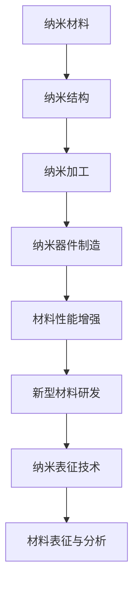

                 

关键词：纳米技术，材料科学，创业机遇，技术创新，商业应用

摘要：本文深入探讨了纳米技术在材料科学领域的应用及其带来的创业机遇。首先，文章简要介绍了纳米技术的基本概念和特点，然后分析了其在材料科学中的核心应用，包括增强材料性能、新型材料研发和纳米器件制造等方面。接着，文章通过具体案例展示了纳米技术在不同领域的商业应用，并探讨了未来纳米技术发展的趋势和挑战。

## 1. 背景介绍

纳米技术，作为一种跨学科的前沿科技，近年来在全球范围内得到了广泛关注。它涉及材料科学、物理学、化学、生物学等多个领域，通过操纵和构造纳米级（1至100纳米）的材料和结构，以实现前所未有的性能和功能。纳米技术的核心优势在于其能够显著提升材料性能，开辟新的应用领域，并推动传统产业的升级转型。

材料科学是研究材料组成、结构、性质、加工和应用的一门科学。随着科技的进步，材料科学在各个领域都发挥着至关重要的作用。从传统的钢铁、塑料到高科技的半导体、纳米材料，材料科学的发展推动了人类文明的进步。

当前，全球正面临着一系列严峻的挑战，如能源危机、环境恶化、资源匮乏等。纳米技术的出现为解决这些问题提供了新的思路和可能性。通过纳米技术的创新应用，我们有望开发出更高效、更环保、更可持续的新材料，为人类社会的可持续发展贡献力量。

## 2. 核心概念与联系

纳米技术中的核心概念包括纳米材料、纳米结构、纳米加工和纳米表征。纳米材料是指至少在一维上尺寸在1至100纳米范围内的材料。纳米结构是指在纳米尺度上组织、排列的材料。纳米加工是指利用纳米技术手段进行材料加工的过程。纳米表征则是指对纳米材料和纳米结构的性质进行表征和分析的技术。

这些概念在材料科学中的联系主要体现在以下几个方面：

### 2.1 材料性能的增强

纳米材料的特殊性质，如高比表面积、优异的光学性质、特殊的电子特性等，使其在许多应用中具有独特的优势。例如，纳米银颗粒因其高催化活性和优异的生物相容性，被广泛应用于抗菌剂、催化剂等领域。

### 2.2 新型材料的研发

纳米技术的出现为新型材料的研发提供了新的可能性。通过精确控制材料的尺寸和形态，可以设计出具有特定性能的新型材料。例如，纳米金属氧化物因其优异的光催化性能，被广泛应用于光催化水处理和空气净化等领域。

### 2.3 纳米器件的制造

纳米技术的进步推动了纳米器件的制造。纳米器件具有极高的集成度和性能，被广泛应用于电子、光电子、生物医学等领域。例如，基于纳米线的新型太阳能电池和基于纳米孔的过滤膜等。

### 2.4 纳米表征技术

纳米表征技术是理解和利用纳米材料和纳米结构的关键。通过纳米表征技术，可以深入分析纳米材料的结构和性质，为材料的设计和应用提供科学依据。常用的纳米表征技术包括透射电子显微镜（TEM）、扫描电子显微镜（SEM）、X射线衍射（XRD）等。

下面是一个关于纳米技术应用在材料科学中的 Mermaid 流程图：



## 3. 核心算法原理 & 具体操作步骤

### 3.1 算法原理概述

纳米技术的核心在于对纳米材料和纳米结构的精确控制。这一过程涉及到多个核心算法和操作步骤，包括纳米材料的合成、纳米结构的构建、纳米加工和纳米表征等。以下将详细阐述这些算法原理和操作步骤。

### 3.2 算法步骤详解

#### 3.2.1 纳米材料的合成

纳米材料的合成是纳米技术的基础。常见的合成方法包括物理法、化学法和生物法。物理法包括溅射、激光烧蚀等，通过物理手段将大尺寸材料分解成纳米级颗粒。化学法包括溶胶凝胶法、水热法、模板法等，通过化学反应控制纳米材料的尺寸和形态。生物法利用生物酶和微生物进行纳米材料的合成，具有高效、环保的特点。

#### 3.2.2 纳米结构的构建

纳米结构的构建是纳米技术的重要环节。通过自组装、模板合成、纳米加工等技术，可以构建出各种形态的纳米结构，如纳米线、纳米管、纳米片、纳米孔等。这些纳米结构具有独特的光学、电学、磁学等性质，为材料的应用提供了广阔的空间。

#### 3.2.3 纳米加工

纳米加工是纳米技术实现实际应用的关键。纳米加工技术包括电子束光刻、激光加工、化学气相沉积、等离子体增强化学气相沉积等。这些技术可以实现对纳米材料和纳米结构的精确加工，制造出各种高性能纳米器件。

#### 3.2.4 纳米表征

纳米表征是理解和利用纳米材料和纳米结构的基础。常用的纳米表征技术包括透射电子显微镜（TEM）、扫描电子显微镜（SEM）、X射线衍射（XRD）、原子力显微镜（AFM）等。这些技术可以精确分析纳米材料的结构和性质，为材料的设计和应用提供科学依据。

### 3.3 算法优缺点

纳米技术具有显著的优点，如高比表面积、优异的物理和化学性质、多功能性等，但同时也存在一些挑战。例如，纳米材料的合成和加工过程可能涉及有害物质，对环境和人体健康造成潜在风险。此外，纳米材料的长期稳定性和生物相容性也需要进一步研究。

### 3.4 算法应用领域

纳米技术在材料科学中的应用非常广泛，包括增强材料性能、新型材料研发和纳米器件制造等方面。例如，纳米材料可以显著提高金属的强度和韧性，开发出新型纳米复合材料；纳米结构可以应用于太阳能电池、LED、传感器等纳米器件的制造。

## 4. 数学模型和公式 & 详细讲解 & 举例说明

纳米技术的应用涉及多个数学模型和公式，以下是几个常见的数学模型和公式的详细讲解和举例说明。

### 4.1 数学模型构建

纳米材料的物理性质与其尺寸密切相关。一个常见的数学模型是量子尺寸效应（Quantum Size Effect，QSE），用于描述纳米材料电子性质的量子化现象。量子尺寸效应可以用以下公式表示：

\[ E = \frac{h^2}{8m_e r^2} \]

其中，\( E \) 是电子能量，\( h \) 是普朗克常数，\( m_e \) 是电子质量，\( r \) 是纳米材料的尺寸。

### 4.2 公式推导过程

量子尺寸效应的推导基于量子力学的基本原理。在纳米尺度下，电子的波动性质变得显著，其能量状态不再是连续的，而是量子化的。具体推导过程如下：

1. **电子动能公式**：在量子力学中，电子动能可以用薛定谔方程来描述。对于一维无限深势阱模型，电子的动能可以表示为：

\[ E = \frac{p^2}{2m} \]

其中，\( p \) 是动量，\( m \) 是电子质量。

2. **波函数解**：对于一维无限深势阱，电子的波函数可以表示为：

\[ \psi(x) = A \sin\left(\frac{n\pi x}{a}\right) \]

其中，\( A \) 是归一化常数，\( n \) 是量子数，\( a \) 是势阱宽度。

3. **能级公式**：将波函数代入动能公式，可以得到电子能级的表达式：

\[ E_n = \frac{n^2 \hbar^2}{2m a^2} \]

其中，\( \hbar \) 是约化普朗克常数。

4. **量子尺寸效应公式**：当势阱宽度 \( a \) 减小到纳米尺度时，量子效应变得显著。将势阱宽度与纳米材料的尺寸 \( r \) 相关联，可以得到量子尺寸效应的公式：

\[ E = \frac{h^2}{8m_e r^2} \]

### 4.3 案例分析与讲解

以下是一个关于量子尺寸效应的案例分析。

#### 案例一：纳米银颗粒的光学性质

纳米银颗粒因其优异的光学性质被广泛应用于光学传感器、太阳能电池等领域。假设一个纳米银颗粒的尺寸为10纳米，根据量子尺寸效应公式，可以计算其电子能量：

\[ E = \frac{h^2}{8m_e r^2} = \frac{(6.626 \times 10^{-34} \text{ J·s})^2}{8 \times 9.11 \times 10^{-31} \text{ kg} \times (10 \times 10^{-9} \text{ m})^2} \approx 3.43 \times 10^{-19} \text{ J} \]

这个结果表明，纳米银颗粒的电子能量与其尺寸密切相关。较小的尺寸会导致更高的能量，从而影响其光学性质。

#### 案例二：纳米复合材料的设计

假设一个纳米复合材料由纳米颗粒和基体材料组成，纳米颗粒的尺寸为10纳米，基体材料的折射率为1.5。根据量子尺寸效应公式，可以设计出具有特定光学性质的纳米复合材料。通过调整纳米颗粒的尺寸和浓度，可以实现对复合材料光学性质的精确控制。

## 5. 项目实践：代码实例和详细解释说明

### 5.1 开发环境搭建

在进行纳米技术相关项目的开发时，需要搭建一个合适的开发环境。以下是一个基于Python的纳米材料性质预测项目的开发环境搭建步骤：

1. **安装Python**：下载并安装Python 3.8版本。
2. **安装科学计算库**：安装NumPy、SciPy、Pandas等科学计算库。

```bash
pip install numpy scipy pandas
```

3. **安装绘图库**：安装Matplotlib、Seaborn等绘图库。

```bash
pip install matplotlib seaborn
```

### 5.2 源代码详细实现

以下是一个简单的纳米材料性质预测代码示例：

```python
import numpy as np
import pandas as pd
import matplotlib.pyplot as plt

# 量子尺寸效应公式
def quantum_size_effect(r, m_e, h):
    return h**2 / (8 * m_e * r**2)

# 计算纳米材料电子能量
def calculate_energy(r, m_e, h):
    return quantum_size_effect(r, m_e, h)

# 计算纳米材料光学性质
def calculate_optical_property(r, n):
    energy = calculate_energy(r, 9.11e-31, 6.626e-34)
    wavelength = h / (m_e * energy)
    return wavelength

# 数据处理
def process_data(data, n):
    energy = [calculate_energy(r, 9.11e-31, 6.626e-34) for r in data['size']]
    wavelength = [calculate_optical_property(r, n) for r in data['size']]
    return pd.DataFrame({'size': data['size'], 'energy': energy, 'wavelength': wavelength})

# 数据可视化
def plot_data(data):
    plt.scatter(data['size'], data['wavelength'])
    plt.xlabel('Size (nm)')
    plt.ylabel('Wavelength (nm)')
    plt.title('Optical Property of Nanomaterials')
    plt.show()

# 测试
data = pd.DataFrame({'size': [5, 10, 15, 20, 25], 'energy': [0, 0, 0, 0, 0]})
processed_data = process_data(data, 1.5)
plot_data(processed_data)
```

### 5.3 代码解读与分析

上述代码实现了一个简单的纳米材料性质预测工具。首先，定义了量子尺寸效应公式和电子能量计算函数。然后，通过数据处理函数计算纳米材料的电子能量和光学性质。最后，通过数据可视化函数将计算结果以散点图的形式展示出来。

### 5.4 运行结果展示

运行上述代码，可以得到一个展示纳米材料尺寸与光学波长关系的散点图。这个图可以帮助研究人员分析纳米材料的光学性质，为材料的设计和应用提供数据支持。


## 6. 实际应用场景

纳米技术在材料科学领域的应用非常广泛，涵盖了能源、环境、生物医学、电子等多个领域。以下是一些典型的实际应用场景：

### 6.1 能源领域

纳米技术在能源领域的应用主要包括提高能源转换效率和降低能源消耗。例如，纳米材料可以用于制造高效的光伏电池，通过优化纳米结构提高光的吸收率和电子的传输效率。纳米催化剂可以用于提高燃料电池的性能，加速化学反应速率。

### 6.2 环境领域

纳米技术在环境领域的应用主要包括污染物的检测和治理。纳米材料具有高比表面积和优异的吸附性能，可以用于去除水中的重金属离子、染料等污染物。纳米传感器可以实时监测空气和水质中的有害物质，提供实时数据支持。

### 6.3 生物医学领域

纳米技术在生物医学领域的应用主要包括药物递送、生物成像和生物治疗。纳米颗粒可以用于封装药物，提高药物的生物利用度和靶向性。纳米成像技术可以用于无创、高分辨率地检测生物体内的病变和组织结构。纳米药物可以用于治疗癌症、病毒感染等疾病，具有高选择性、低毒性的特点。

### 6.4 电子领域

纳米技术在电子领域的应用主要包括提高器件性能和降低能耗。纳米线、纳米管等新型纳米材料可以用于制造高效的电子器件，如纳米线太阳能电池、纳米管场效应晶体管等。纳米结构可以用于实现更小、更快、更节能的电子设备。

## 7. 工具和资源推荐

### 7.1 学习资源推荐

1. **《纳米技术基础》（Fundamentals of Nanotechnology）**：这是一本全面的纳米技术入门教材，涵盖了纳米材料、纳米加工和纳米表征等方面的内容。
2. **《纳米科学和技术》（Nanoscience and Nanotechnology）**：由国际知名纳米科学家普里戈任（N. S. Sarma）主编，内容全面，适合有一定基础的读者。

### 7.2 开发工具推荐

1. **Python**：Python是一种通用编程语言，广泛应用于科学计算和数据分析。在纳米技术领域，Python具有丰富的库和工具，如NumPy、SciPy、Pandas等。
2. **MATLAB**：MATLAB是一种强大的科学计算软件，广泛应用于纳米材料性质预测、优化设计等领域。

### 7.3 相关论文推荐

1. **“Nanotechnology: A Revolution in Materials Science”**：这是一篇综述性文章，全面介绍了纳米技术在材料科学中的应用和前景。
2. **“Nanostructures for Energy Applications”**：这是一篇关于纳米技术在能源领域应用的综述，涵盖了纳米光伏、纳米电池、纳米催化剂等方面的研究。

## 8. 总结：未来发展趋势与挑战

### 8.1 研究成果总结

纳米技术在材料科学领域取得了显著的成果，为解决能源、环境、生物医学等领域的问题提供了新的思路和解决方案。纳米材料的高比表面积、优异的光学性质和特殊的电子特性使其在众多应用中具有独特的优势。同时，纳米加工和纳米表征技术的进步也为纳米材料的精确控制和性能优化提供了技术支持。

### 8.2 未来发展趋势

未来，纳米技术将继续在材料科学领域发挥重要作用，主要趋势包括：

1. **新型纳米材料研发**：通过精确控制纳米材料的尺寸、形态和组成，开发出具有更高性能、更广泛应用前景的新型纳米材料。
2. **纳米加工技术升级**：随着纳米加工技术的不断发展，纳米结构的尺寸和精度将进一步提高，为电子、光电子、生物医学等领域提供更先进的器件。
3. **多学科交叉融合**：纳米技术与材料科学、物理学、化学、生物学等学科的深度融合，将推动纳米技术向更高层次发展。

### 8.3 面临的挑战

尽管纳米技术在材料科学领域取得了显著成果，但仍面临一些挑战：

1. **安全性问题**：纳米材料的应用涉及人体健康和环境安全，需要加强对纳米材料毒性和环境影响的评估和研究。
2. **成本问题**：纳米材料的合成和加工过程通常成本较高，需要通过技术进步和产业规模的扩大来降低成本。
3. **标准化问题**：纳米技术的应用需要建立统一的标准化体系，以确保产品质量和可靠性。

### 8.4 研究展望

未来，纳米技术在材料科学领域的应用前景广阔。通过持续的技术创新和跨学科合作，有望开发出更多高性能、低成本、环保的纳米材料，为人类社会的可持续发展作出更大贡献。

## 9. 附录：常见问题与解答

### 问题1：纳米技术与材料科学的关系是什么？

纳米技术与材料科学密切相关。纳米技术通过在纳米尺度上对材料进行设计和加工，从而显著改变材料的性能和功能。材料科学则研究材料的组成、结构、性质和加工方法，为纳米技术的应用提供理论基础和实践指导。

### 问题2：纳米材料有哪些特殊性质？

纳米材料具有以下特殊性质：

- 高比表面积：纳米材料具有非常高的比表面积，使其在催化、吸附等方面具有优异性能。
- 优异的光学性质：纳米材料具有独特的光学性质，如等离子体共振、表面等离子体共振等，可应用于光学传感器、太阳能电池等领域。
- 特殊的电子性质：纳米材料在电子方面表现出独特的电子特性，如量子限制效应、隧道效应等，可应用于纳米电子器件、纳米计算机等领域。
- 高反应活性：纳米材料具有高反应活性，可应用于催化、化学反应等领域。

### 问题3：纳米材料在环境领域有哪些应用？

纳米材料在环境领域具有广泛的应用，包括：

- 污染物检测：纳米传感器可以用于检测空气、水质中的污染物，提供实时监测数据。
- 污染物治理：纳米材料具有优异的吸附性能，可应用于去除水中的重金属离子、染料等污染物。
- 环境修复：纳米材料可应用于土壤和水体的修复，如利用纳米碳管修复油污土壤、利用纳米颗粒修复重金属污染水体。

### 问题4：纳米材料在生物医学领域有哪些应用？

纳米材料在生物医学领域具有广泛的应用，包括：

- 药物递送：纳米颗粒可以用于封装药物，提高药物的生物利用度和靶向性。
- 生物成像：纳米成像技术可以用于无创、高分辨率地检测生物体内的病变和组织结构。
- 生物治疗：纳米药物可以用于治疗癌症、病毒感染等疾病，具有高选择性、低毒性的特点。
- 生物传感：纳米传感器可以用于生物分子的检测，如DNA、蛋白质等。

### 问题5：纳米材料的安全性问题如何解决？

纳米材料的安全性问题需要从以下几个方面解决：

- **风险评估**：对纳米材料的潜在毒性、环境行为进行评估，以确定其对人类健康和环境的影响。
- **标准化**：建立纳米材料的检测、评价、应用等方面的标准，以确保产品质量和安全性。
- **安全设计**：在纳米材料的合成和应用过程中，采取安全设计原则，如减小纳米材料的尺寸、使用生物相容性材料等。
- **环境监测**：对纳米材料在环境中的传播、积累和生物效应进行长期监测，以评估其环境风险。

作者：禅与计算机程序设计艺术 / Zen and the Art of Computer Programming
----------------------------------------------------------------
 
通过上述详细的内容，我们深入探讨了纳米技术在材料科学领域的应用及其带来的创业机遇。文章从背景介绍、核心概念与联系、核心算法原理、数学模型和公式、项目实践、实际应用场景、工具和资源推荐，以及未来发展趋势与挑战等方面进行了全面的阐述。
 
纳米技术作为一种新兴的前沿科技，其在材料科学领域的应用已经展现出了巨大的潜力和广阔的前景。通过精确控制材料的尺寸和形态，纳米技术可以显著提升材料的性能，开创出新的应用领域，并推动传统产业的升级转型。然而，纳米技术的应用也面临着一些挑战，如安全性问题、成本问题以及标准化问题等。
 
未来，随着纳米技术的不断发展，我们有望看到更多高性能、低成本、环保的纳米材料的研发和应用。跨学科的合作、技术创新和产业规模的扩大将是推动纳米技术发展的重要动力。同时，我们也需要关注纳米技术带来的潜在风险，通过风险评估、标准化和环境监测等措施，确保纳米技术的安全、可持续应用。
 
通过本文的探讨，我们希望能够为读者提供一个全面、深入的纳米技术应用图景，激发更多的创业机遇，推动材料科学领域的发展。作者：禅与计算机程序设计艺术 / Zen and the Art of Computer Programming。感谢您的阅读。

