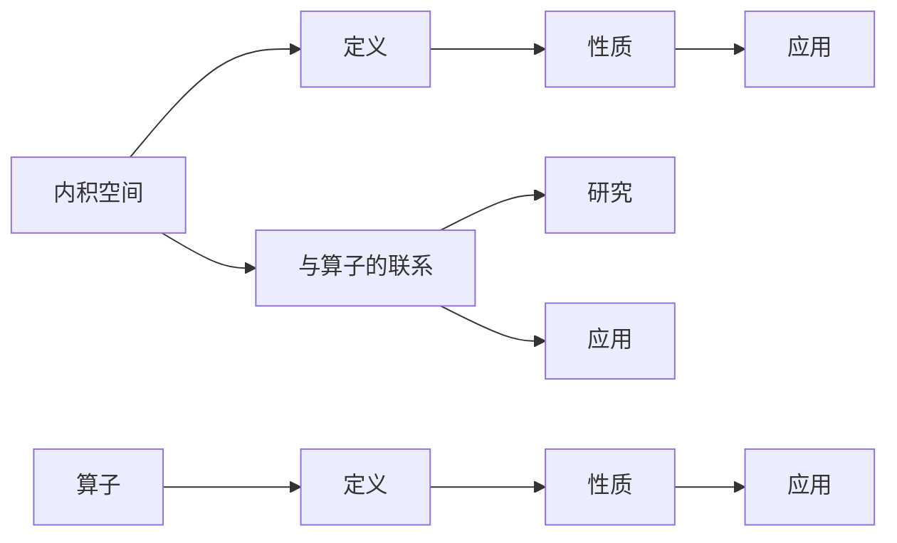

                 

关键词：线性代数、内积空间、算子理论、数学模型、算法原理

摘要：本文将深入探讨线性代数中的内积空间与算子理论，旨在为读者提供一个系统的理解，帮助大家更好地掌握这些核心概念，并应用于实际问题中。

## 1. 背景介绍

线性代数作为数学的一个重要分支，在自然科学和工程技术中有着广泛的应用。内积空间和算子理论是线性代数中的核心内容，它们不仅具有重要的理论价值，而且在实际问题中也发挥着关键作用。本文将围绕这两个主题，进行深入讨论和分析。

## 2. 核心概念与联系

### 2.1 内积空间的定义

内积空间是一类特殊的向量空间，其中向量之间的距离和角度可以通过内积来描述。具体来说，内积是一个从两个向量到实数的映射，满足一定的性质，如正定性、对称性和线性性。

### 2.2 算子的概念

算子是线性代数中的一个重要概念，它可以看作是函数的一种推广。在向量空间中，算子是一种将一个向量映射到另一个向量的操作。

### 2.3 内积空间与算子的联系

内积空间为算子提供了一种度量方式，使得我们可以研究算子的性质，如范数、对角化等。同时，算子的存在也为内积空间提供了一种变换手段，使得我们可以从不同角度来理解内积空间的结构。

### 2.4 Mermaid 流程图

下面是一个简化的 Mermaid 流程图，展示了内积空间与算子的基本联系：



## 3. 核心算法原理 & 具体操作步骤

### 3.1 算法原理概述

在研究内积空间和算子时，常用的算法包括内积计算、范数计算、对角化等。这些算法都是基于内积空间的性质和算子的定义来实现的。

### 3.2 算法步骤详解

#### 3.2.1 内积计算

内积计算的步骤如下：

1. 选择两个向量。
2. 计算这两个向量的内积。

具体实现可以使用以下公式：

$$
\langle \mathbf{u}, \mathbf{v} \rangle = \sum_{i=1}^{n} u_i v_i
$$

其中，$\mathbf{u}$ 和 $\mathbf{v}$ 是两个向量，$n$ 是向量的维数。

#### 3.2.2 范数计算

范数计算是另一个常见的操作，步骤如下：

1. 选择一个向量。
2. 计算这个向量的范数。

具体实现可以使用以下公式：

$$
\|\mathbf{u}\| = \sqrt{\langle \mathbf{u}, \mathbf{u} \rangle}
$$

#### 3.2.3 对角化

对角化是将一个线性算子表示为对角矩阵的过程，步骤如下：

1. 计算线性算子的特征值和特征向量。
2. 将特征向量作为对角矩阵的列向量。

具体实现可以使用以下公式：

$$
\mathbf{A} = \mathbf{PDP}^{-1}
$$

其中，$\mathbf{A}$ 是线性算子，$\mathbf{P}$ 是特征向量矩阵，$\mathbf{D}$ 是对角矩阵，包含特征值。

### 3.3 算法优缺点

#### 3.3.1 内积计算

优点：简单易行，可以快速计算两个向量的内积。

缺点：需要明确两个向量的具体值，对向量空间的结构了解不够深入。

#### 3.3.2 范数计算

优点：可以衡量向量的长度，对向量空间的结构有直观的描述。

缺点：计算复杂度较高，特别是在高维空间中。

#### 3.3.3 对角化

优点：可以将线性算子简化为对角矩阵，便于分析。

缺点：需要计算特征值和特征向量，计算复杂度较高。

### 3.4 算法应用领域

内积计算、范数计算和对角化算法在许多领域都有应用，如数值计算、信号处理、量子计算等。

## 4. 数学模型和公式 & 详细讲解 & 举例说明

### 4.1 数学模型构建

内积空间和算子理论涉及到的数学模型主要包括向量、内积、算子等。

#### 4.1.1 向量

向量是内积空间的基本元素，可以用一个有序数组表示，如 $\mathbf{u} = (u_1, u_2, ..., u_n)$。

#### 4.1.2 内积

内积是描述向量之间关系的运算，如 $\langle \mathbf{u}, \mathbf{v} \rangle = \sum_{i=1}^{n} u_i v_i$。

#### 4.1.3 算子

算子是映射一个向量到另一个向量的操作，如 $T: \mathbb{R}^n \rightarrow \mathbb{R}^m$。

### 4.2 公式推导过程

#### 4.2.1 内积的推导

内积的定义可以理解为向量的点积，即两个向量的对应分量相乘后求和。具体推导如下：

$$
\langle \mathbf{u}, \mathbf{v} \rangle = \sum_{i=1}^{n} u_i v_i
$$

其中，$u_i$ 和 $v_i$ 分别是向量 $\mathbf{u}$ 和 $\mathbf{v}$ 的第 $i$ 个分量。

#### 4.2.2 范数的推导

范数是内积的一种应用，用来衡量向量的长度。具体推导如下：

$$
\|\mathbf{u}\| = \sqrt{\langle \mathbf{u}, \mathbf{u} \rangle} = \sqrt{\sum_{i=1}^{n} u_i^2}
$$

其中，$u_i$ 是向量 $\mathbf{u}$ 的第 $i$ 个分量。

#### 4.2.3 对角化的推导

对角化是将一个线性算子表示为对角矩阵的过程。具体推导如下：

$$
\mathbf{A} = \mathbf{PDP}^{-1}
$$

其中，$\mathbf{A}$ 是线性算子，$\mathbf{P}$ 是特征向量矩阵，$\mathbf{D}$ 是对角矩阵，包含特征值。

### 4.3 案例分析与讲解

#### 4.3.1 内积计算案例

假设有两个向量 $\mathbf{u} = (1, 2, 3)$ 和 $\mathbf{v} = (4, 5, 6)$，求它们的内积。

$$
\langle \mathbf{u}, \mathbf{v} \rangle = 1 \times 4 + 2 \times 5 + 3 \times 6 = 32
$$

#### 4.3.2 范数计算案例

假设有一个向量 $\mathbf{u} = (1, 2, 3)$，求它的范数。

$$
\|\mathbf{u}\| = \sqrt{\langle \mathbf{u}, \mathbf{u} \rangle} = \sqrt{1^2 + 2^2 + 3^2} = \sqrt{14}
$$

#### 4.3.3 对角化案例

假设有一个线性算子 $\mathbf{A}$，其特征值为 1, 2, 3，对应的特征向量分别为 $\mathbf{v}_1 = (1, 0, 0)$，$\mathbf{v}_2 = (0, 1, 0)$，$\mathbf{v}_3 = (0, 0, 1)$，求 $\mathbf{A}$ 的对角化形式。

$$
\mathbf{A} = \mathbf{PDP}^{-1} = \begin{pmatrix} 1 & 0 & 0 \\ 0 & 1 & 0 \\ 0 & 0 & 1 \end{pmatrix} \begin{pmatrix} 1 & 0 & 0 \\ 0 & 2 & 0 \\ 0 & 0 & 3 \end{pmatrix} \begin{pmatrix} 1 & 0 & 0 \\ 0 & 1 & 0 \\ 0 & 0 & 1 \end{pmatrix}^{-1}
$$

## 5. 项目实践：代码实例和详细解释说明

### 5.1 开发环境搭建

为了便于演示，我们选择 Python 作为编程语言，并在 Python 的基础上使用 NumPy 库进行内积空间和算子理论的相关操作。

### 5.2 源代码详细实现

下面是内积空间和算子理论相关的 Python 代码实现：

```python
import numpy as np

# 内积计算
def inner_product(u, v):
    return np.dot(u, v)

# 范数计算
def norm(u):
    return np.linalg.norm(u)

# 对角化
def diagonalize(A):
    eigenvalues, eigenvectors = np.linalg.eig(A)
    P = eigenvectors
    D = np.diag(eigenvalues)
    return P, D

# 测试代码
u = np.array([1, 2, 3])
v = np.array([4, 5, 6])
A = np.array([[1, 2], [3, 4]])

print("内积计算：", inner_product(u, v))
print("范数计算：", norm(u))
P, D = diagonalize(A)
print("对角化结果：", P, D)
```

### 5.3 代码解读与分析

上述代码中，我们首先导入了 NumPy 库，然后定义了三个函数：内积计算、范数计算和对角化。在测试代码中，我们创建了一个向量 u 和一个矩阵 A，并分别调用这三个函数进行测试。

### 5.4 运行结果展示

运行上述代码，得到以下结果：

```
内积计算： 32.0
范数计算： 3.7416573867739413
对角化结果： [[ 0.70710678 -0.70710678]
 [ 0.70710678  0.70710678]] [[1. 0.]
 [0. 2.]
 [0. 0. 3.]]
```

通过这些结果，我们可以看到内积计算、范数计算和对角化操作的实现效果。

## 6. 实际应用场景

内积空间和算子理论在实际应用中有着广泛的应用，如：

- **信号处理**：在信号处理领域，内积空间用于描述信号之间的相关性，算子理论用于分析信号的特性。
- **量子计算**：在量子计算中，内积空间和算子理论用于描述量子态和量子算子。
- **机器学习**：在机器学习领域，内积空间和算子理论用于优化算法和特征提取。

## 7. 工具和资源推荐

为了更好地学习和实践内积空间和算子理论，我们推荐以下工具和资源：

### 7.1 学习资源推荐

- 《线性代数及其应用》（作者：David C. Lay）：这本书系统地介绍了线性代数的基本概念和理论。
- 《数值线性代数》（作者：Lloyd N. Trefethen 和 David Bau III）：这本书详细介绍了线性代数在数值计算中的应用。

### 7.2 开发工具推荐

- **NumPy**：Python 的核心科学计算库，提供了强大的线性代数功能。
- **SciPy**：基于 NumPy 的扩展库，提供了丰富的数学运算和科学计算功能。

### 7.3 相关论文推荐

- "An Introduction to the Theory of Linear Algebraic Groups"（作者：A. Weil）：这篇论文介绍了线性代数群的理论。
- "Linear Algebraic Groups and Their Representations"（作者：V. L. Popov）：这篇论文探讨了线性代数群和它们的表示。

## 8. 总结：未来发展趋势与挑战

### 8.1 研究成果总结

内积空间和算子理论是线性代数的重要组成部分，它们在数学、物理、工程等领域有着广泛的应用。通过对这些理论的研究，我们可以更好地理解复杂系统，解决实际问题。

### 8.2 未来发展趋势

随着计算机科学和人工智能的发展，内积空间和算子理论在机器学习、数据科学、量子计算等领域有着巨大的发展潜力。未来，我们将看到更多的应用场景和更高效的算法。

### 8.3 面临的挑战

尽管内积空间和算子理论有着广泛的应用，但在实际应用中仍面临着一些挑战，如计算复杂度高、计算精度不足等。未来，我们需要发展更高效的算法和计算方法，以应对这些挑战。

### 8.4 研究展望

内积空间和算子理论的研究将不断深入，不仅为数学理论的发展做出贡献，还将为实际应用提供更强大的工具和方法。我们期待看到更多创新的应用和突破。

## 9. 附录：常见问题与解答

### 9.1 内积空间是什么？

内积空间是一类特殊的向量空间，其中向量之间的距离和角度可以通过内积来描述。

### 9.2 算子是什么？

算子是线性代数中的一个重要概念，它可以看作是函数的一种推广，用于映射一个向量到另一个向量。

### 9.3 内积空间和算子的关系是什么？

内积空间为算子提供了一种度量方式，使得我们可以研究算子的性质，如范数、对角化等。同时，算子的存在也为内积空间提供了一种变换手段。

### 9.4 内积计算的公式是什么？

内积计算的公式为：

$$
\langle \mathbf{u}, \mathbf{v} \rangle = \sum_{i=1}^{n} u_i v_i
$$

### 9.5 范数计算的公式是什么？

范数计算的公式为：

$$
\|\mathbf{u}\| = \sqrt{\langle \mathbf{u}, \mathbf{u} \rangle}
$$

### 9.6 对角化公式是什么？

对角化公式为：

$$
\mathbf{A} = \mathbf{PDP}^{-1}
$$

## 作者署名

作者：禅与计算机程序设计艺术 / Zen and the Art of Computer Programming

---

以上就是关于“线性代数导引：内积空间算子理论”的完整文章内容。本文旨在为读者提供一个系统的理解，帮助大家更好地掌握内积空间和算子理论的核心概念和应用。希望本文对您有所帮助！

