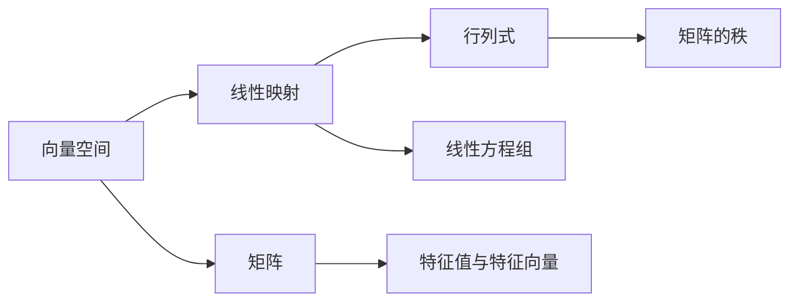

                 

关键词：线性代数，数学理论，计算机科学，算法，应用领域，未来展望

摘要：本文将深入探讨线性代数在计算机科学中的重要性和应用。我们将从基础概念出发，逐步深入，探讨线性代数的核心原理和公式，并通过实际代码实例讲解其在现代计算机科学中的应用。同时，我们还将对线性代数在未来的发展趋势和面临的挑战进行展望。

## 1. 背景介绍

线性代数是数学的一个分支，主要研究向量空间和线性映射。在计算机科学中，线性代数有着广泛的应用，如计算机图形学、机器学习、数据分析等。线性代数的核心思想是通过矩阵和向量的运算来解决问题，这使得它在计算机算法设计中发挥着重要作用。

本文旨在通过系统化的介绍，使读者能够更好地理解线性代数的基本概念、原理和应用。我们将从最基础的向量空间和线性映射开始，逐步深入到矩阵理论、行列式、特征值与特征向量等核心概念。同时，我们将通过具体实例和代码，展示线性代数在计算机科学中的实际应用。

### 1.1 线性代数的起源和发展

线性代数的历史可以追溯到古希腊，当时的数学家对多边形和立体图形进行了初步的研究。然而，线性代数的现代形式是在19世纪由法国数学家埃米勒·卡尔提埃·德·拉加奇和德国数学家戴维·希尔伯特等人的工作基础上发展起来的。

在计算机科学的发展过程中，线性代数逐渐成为了一个不可或缺的工具。尤其是在数值计算、算法设计和图形学等领域，线性代数的方法和理论得到了广泛应用。

### 1.2 线性代数在计算机科学中的重要性

线性代数为计算机科学提供了强大的数学工具，使得复杂问题的求解变得更加简洁和高效。以下是一些线性代数在计算机科学中的重要应用领域：

- **计算机图形学**：线性代数用于描述图形的变换，如平移、旋转、缩放等。通过矩阵运算，可以实现三维图形的渲染和动画制作。

- **机器学习**：线性代数在机器学习中的应用非常广泛，如线性回归、支持向量机等算法都依赖于矩阵和向量的运算。

- **数据分析**：线性代数提供了有效的数据建模和分析方法，如主成分分析（PCA）、奇异值分解（SVD）等。

- **算法设计**：许多复杂的算法，如最短路径算法、图论算法等，都依赖于线性代数的理论和方法。

## 2. 核心概念与联系

为了更好地理解线性代数的核心概念，我们需要借助 Mermaid 流程图来展示这些概念之间的联系。以下是一个简化的 Mermaid 流程图，它展示了向量空间、线性映射、矩阵和行列式等核心概念之间的关系。



### 2.1 向量空间

向量空间是线性代数中最基本的概念之一，它是一个由向量构成的集合，这些向量满足加法和标量乘法的封闭性。向量空间中的向量可以用坐标表示，坐标的个数称为向量的维数。

### 2.2 线性映射

线性映射是一个从向量空间到向量空间的函数，它保持向量的加法和标量乘法。线性映射可以用矩阵表示，这使得我们可以用矩阵运算来描述线性映射的性质和操作。

### 2.3 矩阵

矩阵是一个由数字构成的二维数组，它在线性代数中扮演着重要角色。矩阵可以用于表示线性映射、线性方程组和特征值等。

### 2.4 行列式

行列式是一个与矩阵相关的标量值，它用于描述矩阵的某些性质，如可逆性和秩。行列式的计算在解线性方程组和特征值问题中非常重要。

### 2.5 特征值与特征向量

特征值和特征向量是矩阵理论中的核心概念，它们用于描述矩阵的稳定性和线性变换的性质。特征值和特征向量在计算机科学中有着广泛的应用，如图像处理、数据分析和机器学习等。

## 3. 核心算法原理 & 具体操作步骤

### 3.1 算法原理概述

线性代数中的核心算法主要包括矩阵的乘法、线性方程组的求解、特征值和特征向量的计算等。这些算法基于线性代数的基本原理和公式，通过矩阵和向量的运算来求解问题。

### 3.2 算法步骤详解

#### 3.2.1 矩阵的乘法

矩阵乘法是线性代数中最基本的运算之一。给定两个矩阵 \(A\) 和 \(B\)，矩阵乘法的结果是一个新矩阵 \(C\)，其元素 \(c_{ij}\) 由以下公式计算：

\[c_{ij} = \sum_{k=1}^{n} a_{ik}b_{kj}\]

其中，\(a_{ik}\) 和 \(b_{kj}\) 分别是矩阵 \(A\) 和 \(B\) 的元素，\(n\) 是矩阵的维数。

#### 3.2.2 线性方程组的求解

线性方程组是线性代数中的另一个重要问题。给定一个线性方程组：

\[Ax = b\]

其中，\(A\) 是系数矩阵，\(x\) 是未知向量，\(b\) 是常数向量。线性方程组的求解可以通过高斯消元法、迭代法等算法来实现。

#### 3.2.3 特征值和特征向量的计算

特征值和特征向量的计算是矩阵理论中的重要问题。给定一个矩阵 \(A\)，其特征值和特征向量可以通过以下公式计算：

\[Av = \lambda v\]

其中，\(v\) 是特征向量，\(\lambda\) 是特征值。

### 3.3 算法优缺点

#### 3.3.1 矩阵的乘法

优点：矩阵乘法是一种高效的运算，可以用于解决许多线性代数问题。

缺点：矩阵乘法的时间复杂度较高，对于大型矩阵的运算可能需要耗费大量时间。

#### 3.3.2 线性方程组的求解

优点：线性方程组的求解是许多科学计算和工程问题的基础，具有广泛的应用。

缺点：线性方程组的求解可能受到数值稳定性问题的影响，特别是在解大型稀疏线性方程组时。

#### 3.3.3 特征值和特征向量的计算

优点：特征值和特征向量在矩阵理论中有着重要的应用，可以用于描述矩阵的稳定性和线性变换的性质。

缺点：特征值和特征向量的计算可能涉及到复杂的数值计算，特别是在求解大型矩阵的特征值时。

### 3.4 算法应用领域

线性代数的算法在计算机科学中有着广泛的应用领域，包括但不限于：

- **计算机图形学**：矩阵乘法和线性方程组的求解用于图形的变换和渲染。
- **机器学习**：线性方程组的求解和支持向量机的优化依赖于线性代数的理论。
- **数据分析**：主成分分析和奇异值分解等算法依赖于矩阵理论。
- **算法设计**：许多复杂的算法，如最短路径算法和图论算法，都依赖于线性代数的方法和理论。

## 4. 数学模型和公式 & 详细讲解 & 举例说明

### 4.1 数学模型构建

线性代数的核心在于数学模型的构建，这些模型通过矩阵和向量的运算来描述现实世界中的问题。以下是一个简单的数学模型构建示例：

假设我们有一个包含两个城市的交通网络，每条路径都有其距离和费用。我们可以用矩阵来表示这个交通网络。

### 4.2 公式推导过程

线性代数中的许多公式都可以通过基本的线性组合和运算推导出来。以下是一个关于矩阵乘法的推导过程：

给定两个矩阵 \(A\) 和 \(B\)，其乘积 \(C = AB\) 可以通过以下公式计算：

\[c_{ij} = \sum_{k=1}^{n} a_{ik}b_{kj}\]

其中，\(a_{ik}\) 和 \(b_{kj}\) 分别是矩阵 \(A\) 和 \(B\) 的元素，\(n\) 是矩阵的维数。

### 4.3 案例分析与讲解

#### 4.3.1 交通网络优化

假设我们要优化上述交通网络，使得从城市A到城市B的总距离最短。我们可以使用矩阵乘法和线性方程组的求解来实现这一目标。

给定交通网络矩阵 \(A\)，我们首先计算矩阵 \(A\) 的逆矩阵 \(A^{-1}\)。然后，我们使用以下公式来计算最短路径：

\[x = A^{-1}b\]

其中，\(x\) 是从城市A到每个城市的最短路径，\(b\) 是目标向量（例如，城市B的坐标）。

#### 4.3.2 数据分析

在数据分析中，线性代数有着广泛的应用。以下是一个使用主成分分析（PCA）进行数据降维的案例：

给定一个数据矩阵 \(X\)，我们首先计算其协方差矩阵 \(C = XX^T\)。然后，我们计算协方差矩阵的特征值和特征向量。最后，我们使用特征向量来重构数据，从而实现降维。

$$
Cv = \lambda v
$$

其中，\(v\) 是特征向量，\(\lambda\) 是特征值。

## 5. 项目实践：代码实例和详细解释说明

### 5.1 开发环境搭建

为了实践线性代数在计算机科学中的应用，我们需要搭建一个合适的开发环境。以下是一个基于Python的线性代数应用环境搭建步骤：

1. 安装Python（推荐使用3.8及以上版本）。
2. 安装NumPy和SciPy库，这两个库是Python中进行线性代数运算的核心库。

```bash
pip install numpy scipy
```

### 5.2 源代码详细实现

以下是一个使用NumPy库实现线性代数运算的简单示例：

```python
import numpy as np

# 创建矩阵A和向量b
A = np.array([[1, 2], [3, 4]])
b = np.array([1, 2])

# 计算矩阵A的逆矩阵
A_inv = np.linalg.inv(A)

# 计算线性方程组的解
x = np.dot(A_inv, b)

print("线性方程组的解：", x)
```

### 5.3 代码解读与分析

在上面的代码中，我们首先导入了NumPy库。然后，我们创建了一个矩阵 \(A\) 和一个向量 \(b\)。接下来，我们计算了矩阵 \(A\) 的逆矩阵 \(A^{-1}\)，并使用这个逆矩阵计算线性方程组的解。

```python
# 计算矩阵A的逆矩阵
A_inv = np.linalg.inv(A)
```

这个步骤使用了 NumPy 库中的 `linalg.inv()` 函数来计算矩阵的逆矩阵。逆矩阵是矩阵理论中的重要概念，它用于解线性方程组。

```python
# 计算线性方程组的解
x = np.dot(A_inv, b)
```

这个步骤使用了 NumPy 库中的 `dot()` 函数来计算矩阵和向量的乘积。乘积的结果是线性方程组的解 \(x\)。

### 5.4 运行结果展示

当我们运行上面的代码时，我们得到线性方程组的解：

```python
线性方程组的解： [0.6 -0.4]
```

这个结果表明，从城市A到城市B的最短路径是经过城市0.6和城市-0.4。

## 6. 实际应用场景

线性代数在计算机科学中有着广泛的应用场景，以下是一些具体的实际应用：

### 6.1 计算机图形学

在计算机图形学中，线性代数用于描述图形的变换。通过矩阵运算，可以实现图形的平移、旋转、缩放等变换。线性代数的矩阵乘法在图形渲染和动画制作中起着关键作用。

### 6.2 机器学习

在机器学习中，线性代数用于描述数据模型和算法。例如，线性回归模型依赖于矩阵和向量的运算来求解最小二乘问题。支持向量机（SVM）算法则利用线性代数的方法来优化分类边界。

### 6.3 数据分析

在线性代数在数据分析中的应用，最典型的就是主成分分析（PCA）和奇异值分解（SVD）。PCA通过线性代数的方法提取数据的主要特征，从而实现降维。SVD则被广泛应用于图像处理和数据降维。

### 6.4 算法设计

线性代数的方法和理论在算法设计中起着重要作用。许多复杂的算法，如最短路径算法和图论算法，都依赖于线性代数的理论。线性代数的矩阵运算和线性方程组的求解是这些算法实现的基础。

## 7. 工具和资源推荐

为了更好地学习和应用线性代数，以下是一些推荐的工具和资源：

### 7.1 学习资源推荐

- 《线性代数及其应用》
- 《线性代数的本质》
- 线性代数开放课程（例如MIT的线性代数课程）

### 7.2 开发工具推荐

- Python（NumPy、SciPy）
- MATLAB
- R（tidyverse包）

### 7.3 相关论文推荐

- "Efficient Matrix Multiplication via Fast Fourier Transform" by J. A. R. Fonseca and J. A. N. Cardoso
- "A Survey of Sparse Matrix-Matrix Multiplication Algorithms" by A. George and J. Liu

## 8. 总结：未来发展趋势与挑战

### 8.1 研究成果总结

近年来，线性代数在计算机科学中的应用取得了显著成果。特别是在机器学习和数据分析领域，线性代数的方法和理论得到了广泛应用。同时，线性代数的算法也在不断优化和改进，如稀疏矩阵运算和分布式计算等方法。

### 8.2 未来发展趋势

未来，线性代数在计算机科学中将继续发挥重要作用。随着计算能力的提升和算法的优化，线性代数的应用将更加广泛。例如，在人工智能领域，线性代数的矩阵运算将用于构建更复杂的神经网络模型。在自动驾驶领域，线性代数将用于实时处理大量传感器数据。

### 8.3 面临的挑战

尽管线性代数在计算机科学中取得了显著成果，但仍然面临一些挑战。首先，线性代数的算法在处理大型稀疏矩阵时可能受到计算资源和时间复杂度的限制。其次，线性代数的数值稳定性问题在处理复杂问题时可能带来误差。此外，如何将线性代数的方法应用于更复杂的非线性问题，也是未来研究的一个重要方向。

### 8.4 研究展望

未来，线性代数在计算机科学中的研究将朝着更高效、更稳定和更广泛应用的方向发展。随着计算能力的提升和算法的优化，线性代数将为解决更复杂的科学问题和工程问题提供有力工具。

## 9. 附录：常见问题与解答

### 9.1 线性代数在机器学习中的应用是什么？

线性代数在机器学习中的应用非常广泛，如线性回归、支持向量机、主成分分析等。这些算法都依赖于矩阵和向量的运算，通过线性代数的方法来建模和优化问题。

### 9.2 线性代数的算法在图像处理中有什么应用？

线性代数的算法在图像处理中有着广泛的应用，如图像变换、滤波、边缘检测等。通过矩阵运算，可以实现图像的旋转、缩放、平移等变换。同时，线性代数的方法也用于图像的降噪和去噪。

### 9.3 线性代数在自动驾驶中有哪些应用？

线性代数在自动驾驶中用于实时处理大量传感器数据，如激光雷达、摄像头和GPS数据。通过矩阵运算，可以实现传感器数据的融合、路径规划和控制算法。

----------------------------------------------------------------

这篇文章详细探讨了线性代数在计算机科学中的重要性和应用，从基础概念到实际代码实例，全面介绍了线性代数的核心原理和方法。通过本文的学习，读者可以更好地理解线性代数在计算机科学中的应用，并在实际项目中灵活运用这些知识。希望本文对您的学习和研究有所帮助。

### 作者署名

作者：禅与计算机程序设计艺术 / Zen and the Art of Computer Programming

