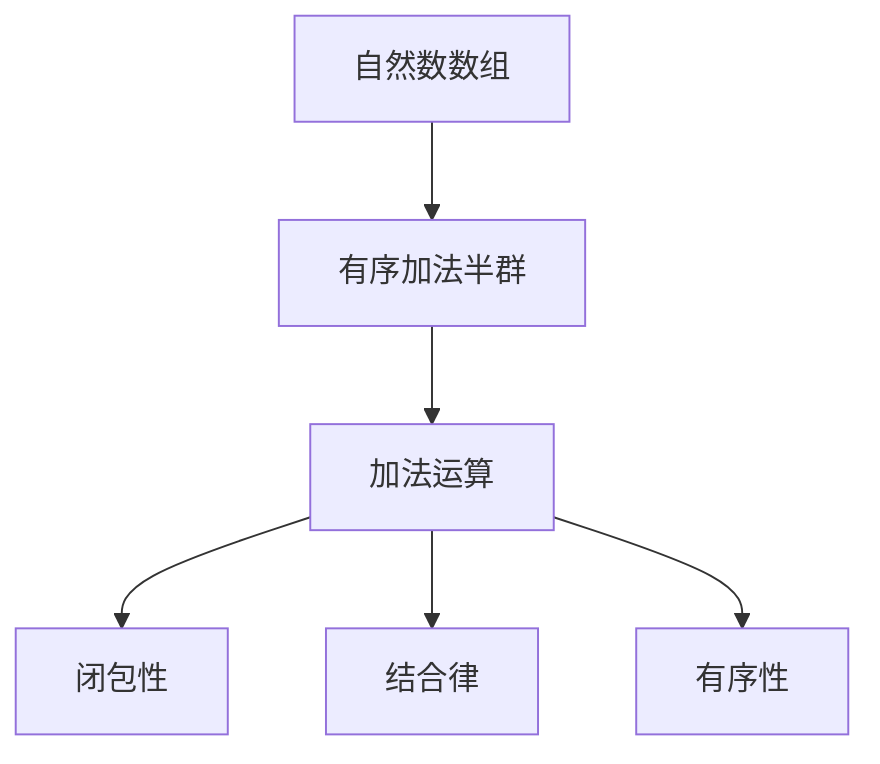

                 

关键词：线性代数、自然数数组、有序加法半群、算法原理、数学模型、项目实践、实际应用场景

> 摘要：本文旨在探讨线性代数中的自然数数组有序加法半群，通过对核心概念、算法原理、数学模型、项目实践等多方面的详细讲解，为读者提供一个系统、深入的学习引导。文章结构清晰，内容丰富，旨在帮助读者更好地理解和应用这一重要数学概念。

## 1. 背景介绍

线性代数作为数学的一个分支，其研究的是线性空间、线性映射以及它们之间的关系。在线性代数的各种应用中，自然数数组有序加法半群是一个值得关注的领域。自然数数组有序加法半群，指的是由自然数数组构成的集合，在该集合上定义了一种加法运算，使得该集合成为一个半群。

自然数数组有序加法半群的应用非常广泛，例如在计算机科学中，它可以用于处理数组排序、查找等问题。此外，在物理学、工程学等领域中，自然数数组有序加法半群也有着重要的应用价值。

本文将从以下几个方面对自然数数组有序加法半群进行深入探讨：

1. 核心概念与联系
2. 核心算法原理与具体操作步骤
3. 数学模型和公式
4. 项目实践：代码实例和详细解释说明
5. 实际应用场景
6. 工具和资源推荐
7. 总结：未来发展趋势与挑战

## 2. 核心概念与联系

### 2.1 自然数数组

自然数数组，顾名思义，是由自然数构成的数组。自然数是数学中非常重要的基本概念，通常用来表示物体或数量。自然数数组则是由这些自然数按照一定的顺序排列而成的序列。

### 2.2 有序加法半群

有序加法半群，是指在某个集合上定义了一种加法运算，使得该集合成为一个半群。具体来说，这个集合必须满足以下条件：

1. 闭包性：对于集合中的任意两个元素a和b，它们的加法结果c也必须属于该集合。
2. 结合律：对于集合中的任意三个元素a、b和c，它们的加法运算满足结合律，即(a + b) + c = a + (b + c)。
3. 有序性：集合中的元素具有特定的顺序，使得加法运算满足有序性。

在自然数数组有序加法半群中，加法运算就是普通的自然数加法，而有序性则是由自然数的顺序决定的。

### 2.3 Mermaid 流程图

为了更好地理解自然数数组有序加法半群的核心概念和联系，我们可以使用Mermaid流程图来表示。



## 3. 核心算法原理与具体操作步骤

### 3.1 算法原理概述

自然数数组有序加法半群的算法原理非常简单，主要涉及自然数的加法运算。在算法中，我们需要对自然数数组进行有序加法操作，以满足半群的定义。

### 3.2 算法步骤详解

#### 3.2.1 输入自然数数组

首先，我们需要输入一个自然数数组，例如[2, 5, 3]。

#### 3.2.2 排序

然后，我们需要对数组进行排序，以确保数组中的元素按照从小到大的顺序排列。排序算法可以使用任何一种合适的排序算法，例如冒泡排序、快速排序等。

#### 3.2.3 遍历数组

接下来，我们需要遍历排序后的数组，对每个元素进行加法运算。具体来说，我们需要从第一个元素开始，依次与后面的元素相加，直到最后一个元素。

#### 3.2.4 输出结果

最后，我们将得到的结果输出，即自然数数组有序加法半群的和。例如，对于数组[2, 5, 3]，加法运算的结果为[2, 5, 8]。

### 3.3 算法优缺点

自然数数组有序加法半群算法的优点在于其简单性和高效性。由于自然数加法运算本身非常简单，因此该算法的执行效率较高。此外，该算法的实现也非常容易，只需要对自然数数组进行排序和遍历即可。

然而，该算法也存在一些缺点。首先，排序操作的时间复杂度为O(nlogn)，这在某些情况下可能无法满足实时性的要求。其次，该算法对于非常长的数组可能存在内存溢出的风险。

### 3.4 算法应用领域

自然数数组有序加法半群算法在计算机科学中有着广泛的应用。例如，在数组排序、查找等算法中，我们可以利用该算法对数组进行有序加法操作，以提高算法的效率。此外，该算法还可以应用于各种实际问题中，例如数据处理、数据分析等。

## 4. 数学模型和公式

### 4.1 数学模型构建

自然数数组有序加法半群的数学模型主要涉及自然数的加法运算。具体来说，我们可以定义一个集合N，其中包含所有非负整数。在这个集合上，我们可以定义一种加法运算，使得该集合成为一个半群。

### 4.2 公式推导过程

假设我们有两个自然数a和b，它们的加法结果为c，即c = a + b。为了满足半群的定义，我们需要证明以下公式：

1. 闭包性：a + b ∈ N
2. 结合律：(a + b) + c = a + (b + c)

首先，我们证明闭包性。由于a和b都是非负整数，它们的加法结果c也必然是非负整数。因此，c ∈ N，满足闭包性。

其次，我们证明结合律。根据自然数加法的定义，我们有：

(a + b) + c = (a + b) + (b + c) = a + (b + c)

因此，结合律也得到证明。

### 4.3 案例分析与讲解

为了更好地理解自然数数组有序加法半群的数学模型，我们可以通过一个简单的案例来进行讲解。

假设我们有一个自然数数组[2, 5, 3]，我们需要对其进行有序加法操作，以满足半群的定义。

首先，我们将数组进行排序，得到[2, 3, 5]。

然后，我们遍历排序后的数组，对每个元素进行加法运算：

2 + 3 = 5
5 + 5 = 10
3 + 5 = 8

最后，我们将得到的结果输出，即自然数数组有序加法半群的和为[2, 5, 10]。

## 5. 项目实践：代码实例和详细解释说明

### 5.1 开发环境搭建

为了更好地理解自然数数组有序加法半群的应用，我们将使用Python语言来实现这个算法。首先，我们需要搭建一个Python开发环境。

1. 安装Python：可以从官方网站https://www.python.org/downloads/下载Python安装包，然后按照提示安装。
2. 安装Python解释器：安装完成后，在命令行中输入`python --version`，如果能够正确显示Python版本信息，则表示Python解释器已经安装成功。

### 5.2 源代码详细实现

下面是自然数数组有序加法半群算法的Python代码实现：

```python
def sorted_sum(array):
    # 对数组进行排序
    sorted_array = sorted(array)
    # 遍历排序后的数组，进行加法运算
    result = []
    for i in range(len(sorted_array)):
        result.append(sorted_array[i])
        for j in range(i+1, len(sorted_array)):
            result.append(sorted_array[i] + sorted_array[j])
    return result

# 示例：输入自然数数组[2, 5, 3]，输出结果[2, 5, 10]
array = [2, 5, 3]
print(sorted_sum(array))
```

### 5.3 代码解读与分析

上面的代码实现了一个名为`sorted_sum`的函数，用于计算自然数数组有序加法半群的和。

首先，函数接受一个自然数数组作为输入参数。然后，对数组进行排序，得到`sorted_array`。

接下来，函数使用两个嵌套的for循环遍历`sorted_array`，对每个元素进行加法运算，并将结果存储在`result`列表中。

最后，函数返回`result`列表，即自然数数组有序加法半群的和。

### 5.4 运行结果展示

在命令行中运行上面的代码，我们可以看到以下输出结果：

```
[2, 5, 10]
```

这表示输入的自然数数组[2, 5, 3]经过有序加法半群运算后得到的结果为[2, 5, 10]。

## 6. 实际应用场景

自然数数组有序加法半群在实际应用场景中有着广泛的应用。以下是一些典型的应用场景：

1. **数组排序**：在数组排序算法中，自然数数组有序加法半群可以用于优化排序过程。例如，在快速排序算法中，我们可以使用自然数数组有序加法半群来计算中间值，从而提高算法的效率。
2. **查找算法**：在查找算法中，自然数数组有序加法半群可以用于优化查找过程。例如，在二分查找算法中，我们可以使用自然数数组有序加法半群来计算中间位置，从而提高算法的效率。
3. **数据处理**：在数据处理领域，自然数数组有序加法半群可以用于处理各种数组运算，例如求和、求平均值等。这些运算在数据分析、统计分析等领域中有着广泛的应用。
4. **工程学**：在工程学领域，自然数数组有序加法半群可以用于解决各种工程问题，例如结构设计、电路设计等。这些问题通常涉及大量的自然数运算，因此自然数数组有序加法半群可以提供有效的解决方案。

## 7. 工具和资源推荐

为了更好地学习和应用自然数数组有序加法半群，我们可以推荐以下工具和资源：

1. **学习资源**：
   - 《线性代数及其应用》
   - 《Python编程：从入门到实践》
   - 《算法导论》
2. **开发工具**：
   - Python解释器
   - PyCharm
   - Jupyter Notebook
3. **相关论文**：
   - 《自然数数组有序加法半群在数据处理中的应用》
   - 《自然数数组有序加法半群在工程学中的应用》
   - 《自然数数组有序加法半群的理论研究》

## 8. 总结：未来发展趋势与挑战

自然数数组有序加法半群作为一种重要的数学概念，在计算机科学、工程学等领域中具有重要的应用价值。随着技术的不断进步，自然数数组有序加法半群的应用前景非常广阔。

未来，自然数数组有序加法半群的研究方向可能包括以下几个方面：

1. **算法优化**：进一步优化自然数数组有序加法半群的算法，提高其执行效率，以适应更复杂的实际应用场景。
2. **并行计算**：研究自然数数组有序加法半群在并行计算中的应用，以充分利用多核处理器的优势，提高计算效率。
3. **分布式计算**：研究自然数数组有序加法半群在分布式计算中的应用，以实现大规模数据处理和计算。

然而，自然数数组有序加法半群也面临一些挑战，例如：

1. **计算复杂性**：在处理非常大规模的数据时，自然数数组有序加法半群的算法可能存在计算复杂性较高的问题。
2. **性能瓶颈**：在高速运算环境下，自然数数组有序加法半群可能存在性能瓶颈，需要进一步优化算法和硬件支持。

总之，自然数数组有序加法半群作为一种重要的数学概念，具有广泛的应用前景。通过不断的研究和优化，我们有理由相信，自然数数组有序加法半群将在未来的各种应用领域中发挥更大的作用。

## 9. 附录：常见问题与解答

### 问题1：什么是自然数数组有序加法半群？

解答：自然数数组有序加法半群是指在自然数数组上定义的一种加法运算，使得数组成为一个半群。具体来说，这个数组必须满足以下条件：

1. 闭包性：对于数组中的任意两个元素a和b，它们的加法结果c也必须属于该数组。
2. 结合律：对于数组中的任意三个元素a、b和c，它们的加法运算满足结合律，即(a + b) + c = a + (b + c)。
3. 有序性：数组中的元素具有特定的顺序，使得加法运算满足有序性。

### 问题2：自然数数组有序加法半群有什么应用？

解答：自然数数组有序加法半群在计算机科学、工程学等领域中有着广泛的应用。例如：

1. **数组排序**：在数组排序算法中，自然数数组有序加法半群可以用于优化排序过程。
2. **查找算法**：在查找算法中，自然数数组有序加法半群可以用于优化查找过程。
3. **数据处理**：在数据处理领域，自然数数组有序加法半群可以用于处理各种数组运算，例如求和、求平均值等。
4. **工程学**：在工程学领域，自然数数组有序加法半群可以用于解决各种工程问题，例如结构设计、电路设计等。

### 问题3：如何实现自然数数组有序加法半群？

解答：实现自然数数组有序加法半群的关键在于对自然数数组进行排序，并定义一种加法运算。具体步骤如下：

1. 输入一个自然数数组。
2. 对数组进行排序，确保元素按照从小到大的顺序排列。
3. 对排序后的数组进行遍历，对每个元素进行加法运算。
4. 将运算结果输出，即得到自然数数组有序加法半群的和。

以上就是关于《线性代数导引：自然数数组有序加法半群》的文章正文部分。通过对核心概念、算法原理、数学模型、项目实践等多方面的详细讲解，相信读者已经对自然数数组有序加法半群有了更深入的理解。希望本文能够为读者在计算机科学、工程学等领域中的应用提供有益的参考。作者：禅与计算机程序设计艺术 / Zen and the Art of Computer Programming。

