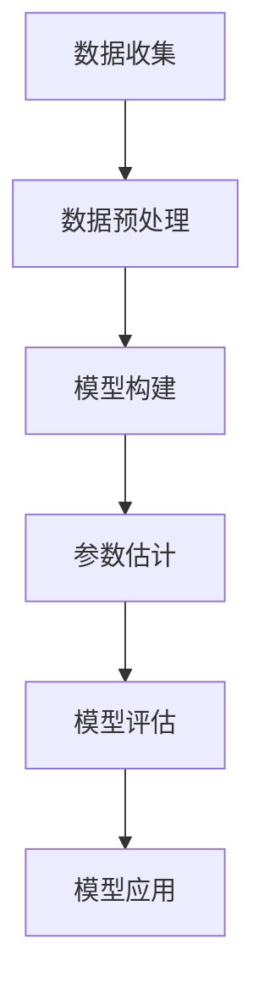

                 

关键词：线性回归、回归分析、机器学习、算法原理、代码实例

摘要：本文旨在深入讲解线性回归的原理，并通过一个完整的代码实例展示如何应用线性回归模型来解决实际问题。文章将首先介绍线性回归的基本概念，然后详细阐述线性回归模型的数学基础，包括模型的建立、公式的推导以及优缺点的分析。接着，我们将通过一个具体案例，展示如何使用线性回归进行数据分析和预测，并通过代码实现来验证模型的准确性和可靠性。最后，我们将探讨线性回归在实际应用中的广泛场景，并展望未来的发展趋势和面临的挑战。

## 1. 背景介绍

线性回归是机器学习和统计中最基本且广泛使用的算法之一。其核心思想是通过建立一个线性模型来描述因变量（目标变量）和自变量（特征变量）之间的关系。线性回归模型不仅具有理论上的严谨性，还因其简单性和高效性在数据分析和预测任务中得到了广泛应用。

线性回归的起源可以追溯到19世纪，当时的统计学家试图理解变量之间的线性关系，并开发出一系列方法来估计这种关系的参数。随着时间的推移，线性回归模型得到了进一步的发展和完善，成为了现代统计学和机器学习的基础。

在现代机器学习中，线性回归不仅用于预测和数据分析，还作为许多高级算法的基石，如决策树、神经网络和集成方法等。理解线性回归的基本原理对于深入学习和应用其他更复杂的机器学习算法至关重要。

本文将首先介绍线性回归的基础知识，包括其核心概念和常见类型。然后，我们将深入探讨线性回归的数学基础，包括模型的构建、损失函数的推导以及求解最优参数的方法。在理论讲解的基础上，我们将通过一个具体案例展示线性回归的实际应用，并详细解释代码实现的过程。最后，我们将讨论线性回归在实际应用中的广泛场景，并展望未来的发展趋势和面临的挑战。

通过本文的学习，读者将能够：

- 理解线性回归的基本概念和类型。
- 掌握线性回归模型的数学基础和求解方法。
- 学会通过实际案例来应用线性回归模型进行数据分析和预测。
- 了解线性回归在实际应用中的广泛场景和未来展望。

### 2. 核心概念与联系

#### 2.1 线性回归的基本概念

线性回归是一种统计方法，用于描述两个或多个变量之间的线性关系。在线性回归中，我们通常假设一个因变量（也称为响应变量或目标变量）与一个或多个自变量（也称为特征变量或预测变量）之间存在线性关系。线性回归模型的一般形式如下：

$$
Y = \beta_0 + \beta_1X_1 + \beta_2X_2 + ... + \beta_nX_n + \epsilon
$$

其中，$Y$ 是因变量，$X_1, X_2, ..., X_n$ 是自变量，$\beta_0, \beta_1, \beta_2, ..., \beta_n$ 是模型参数，$\epsilon$ 是误差项。

这个模型表示每个自变量 $X_i$ 对因变量 $Y$ 的影响是通过相应的参数 $\beta_i$ 来衡量的。我们的目标是通过最小化误差项 $\epsilon$ 来估计这些参数的值。

#### 2.2 线性回归的类型

根据自变量和因变量的数量，线性回归可以分为以下几种类型：

1. **一元线性回归（Simple Linear Regression）**
   - 只有一个自变量和一个因变量。
   - 模型形式为 $Y = \beta_0 + \beta_1X + \epsilon$。

2. **多元线性回归（Multiple Linear Regression）**
   - 有多个自变量和一个因变量。
   - 模型形式为 $Y = \beta_0 + \beta_1X_1 + \beta_2X_2 + ... + \beta_nX_n + \epsilon$。

3. **多项式线性回归（Polynomial Linear Regression）**
   - 自变量是多项式形式的。
   - 模型形式为 $Y = \beta_0 + \beta_1X + \beta_2X^2 + ... + \beta_nX^n + \epsilon$。

在实际应用中，一元和多元线性回归是最常见的类型，而多项式线性回归通常用于特定情况下的非线性关系建模。

#### 2.3 线性回归的优缺点

**优点：**
- **简单直观**：线性回归模型简单明了，易于理解和解释。
- **高效快速**：线性回归算法的计算复杂度较低，适合大规模数据处理。
- **广泛适用**：线性回归可以用于各种不同类型的数据分析任务，如预测、分类和聚类等。

**缺点：**
- **线性假设**：线性回归模型假设变量之间存在线性关系，这在某些情况下可能不成立。
- **数据依赖**：线性回归模型的性能高度依赖于数据的质量和特征的选择。
- **过拟合风险**：如果模型过于复杂，可能会导致过拟合，即模型无法泛化到新的数据。

#### 2.4 线性回归的应用领域

线性回归的应用领域非常广泛，包括但不限于以下方面：

- **统计分析**：用于研究变量之间的关系和预测。
- **金融分析**：用于股票价格预测、风险评估和投资组合优化。
- **市场营销**：用于客户细分、市场预测和营销策略制定。
- **生物医学**：用于疾病诊断、药物效果评估和基因研究。
- **能源管理**：用于电力需求预测、能源消耗分析和节能措施制定。

#### 2.5 线性回归的 Mermaid 流程图

为了更好地理解线性回归的概念，我们可以使用 Mermaid 流程图来展示其核心流程。



- **A[数据收集]**：收集用于建模的数据。
- **B[数据预处理]**：对数据进行清洗、标准化和转换。
- **C[模型构建]**：根据数据特点选择合适的线性回归模型。
- **D[参数估计]**：通过最小二乘法或其他方法估计模型参数。
- **E[模型评估]**：评估模型的性能和准确性。
- **F[模型应用]**：将模型应用于实际问题进行预测或分析。

通过这个流程图，我们可以清晰地看到线性回归的基本步骤和各步骤之间的联系。

### 3. 核心算法原理 & 具体操作步骤

#### 3.1 算法原理概述

线性回归的核心思想是寻找一个最优的线性模型，使得预测值与实际值之间的误差最小。具体来说，线性回归的目标是最小化以下损失函数：

$$
J(\theta) = \frac{1}{2m} \sum_{i=1}^{m} (h_\theta(x^{(i)}) - y^{(i)})^2
$$

其中，$h_\theta(x) = \theta_0 + \theta_1x$ 是线性回归模型的预测函数，$\theta$ 是模型参数，$m$ 是样本数量，$y^{(i)}$ 和 $x^{(i)}$ 分别是第 $i$ 个样本的实际值和特征值。

为了求解最优参数 $\theta$，我们可以使用梯度下降法。梯度下降法的基本思想是沿着损失函数的梯度方向不断更新参数，直到达到最小值。

#### 3.2 算法步骤详解

**1. 模型初始化：**

首先，我们需要初始化模型参数 $\theta_0$ 和 $\theta_1$。通常，我们可以随机初始化这些参数，或者使用一些启发式方法，如零初始化或高斯初始化。

**2. 梯度计算：**

梯度下降法的关键步骤是计算损失函数关于参数的梯度。对于线性回归模型，损失函数的梯度计算如下：

$$
\nabla J(\theta) = \begin{bmatrix}
\frac{\partial J(\theta)}{\partial \theta_0} \\
\frac{\partial J(\theta)}{\partial \theta_1}
\end{bmatrix} = \begin{bmatrix}
\frac{1}{m} \sum_{i=1}^{m} (h_\theta(x^{(i)}) - y^{(i)}) \\
\frac{1}{m} \sum_{i=1}^{m} (h_\theta(x^{(i)}) - y^{(i)})x^{(i)}
\end{bmatrix}
$$

**3. 参数更新：**

根据梯度的方向，我们可以更新参数 $\theta_0$ 和 $\theta_1$。更新公式如下：

$$
\theta_0 := \theta_0 - \alpha \nabla J(\theta_0) \\
\theta_1 := \theta_1 - \alpha \nabla J(\theta_1)
$$

其中，$\alpha$ 是学习率，决定了参数更新的步长。

**4. 迭代优化：**

重复上述步骤，直到损失函数的梯度接近零，即认为参数已经收敛。在实际操作中，我们通常会设置一个迭代次数的上限，以避免陷入无限循环。

#### 3.3 算法优缺点

**优点：**
- **简单易理解**：线性回归模型简单直观，易于理解和实现。
- **高效快速**：线性回归的计算复杂度较低，适合大规模数据处理。
- **适用范围广**：线性回归可以应用于各种不同类型的数据分析任务。

**缺点：**
- **线性假设**：线性回归模型假设变量之间存在线性关系，这在某些情况下可能不成立。
- **数据依赖**：线性回归模型的性能高度依赖于数据的质量和特征的选择。
- **过拟合风险**：如果模型过于复杂，可能会导致过拟合，即模型无法泛化到新的数据。

#### 3.4 算法应用领域

线性回归的应用领域非常广泛，包括但不限于以下方面：

- **统计分析**：用于研究变量之间的关系和预测。
- **金融分析**：用于股票价格预测、风险评估和投资组合优化。
- **市场营销**：用于客户细分、市场预测和营销策略制定。
- **生物医学**：用于疾病诊断、药物效果评估和基因研究。
- **能源管理**：用于电力需求预测、能源消耗分析和节能措施制定。

### 4. 数学模型和公式 & 详细讲解 & 举例说明

#### 4.1 数学模型构建

线性回归模型的数学模型可以表示为：

$$
Y = \beta_0 + \beta_1X + \epsilon
$$

其中，$Y$ 是因变量，$X$ 是自变量，$\beta_0$ 和 $\beta_1$ 是模型参数，$\epsilon$ 是误差项。

为了简化表示，我们可以将模型写成矩阵形式：

$$
\mathbf{Y} = \mathbf{X}\beta + \epsilon
$$

其中，$\mathbf{Y}$ 和 $\mathbf{X}$ 分别是因变量和自变量的向量，$\beta$ 是参数向量。

#### 4.2 公式推导过程

**1. 最小二乘法**

最小二乘法是一种常用的方法来估计线性回归模型的参数。其基本思想是使得预测值与实际值之间的误差平方和最小。

设预测值为 $\hat{Y}$，实际值为 $Y$，则误差平方和为：

$$
J(\beta) = \frac{1}{2} \sum_{i=1}^{m} (\hat{Y}^{(i)} - Y^{(i)})^2
$$

为了求解最优参数 $\beta$，我们需要对 $J(\beta)$ 进行最小化。对 $J(\beta)$ 关于 $\beta$ 求导并令其等于零，得到：

$$
\frac{\partial J(\beta)}{\partial \beta} = \mathbf{X}^T(\mathbf{X}\beta - \mathbf{Y}) = 0
$$

解这个方程，我们可以得到最优参数 $\beta$：

$$
\beta = (\mathbf{X}^T\mathbf{X})^{-1}\mathbf{X}^T\mathbf{Y}
$$

**2. 梯度下降法**

梯度下降法是一种迭代求解最优参数的方法。其基本思想是沿着损失函数的梯度方向不断更新参数，直到达到最小值。

设当前参数为 $\beta_t$，则梯度下降法的更新公式为：

$$
\beta_{t+1} = \beta_t - \alpha \nabla J(\beta_t)
$$

其中，$\alpha$ 是学习率，决定了参数更新的步长。

#### 4.3 案例分析与讲解

**案例：房价预测**

假设我们想预测某个城市的房价，根据历史数据，我们收集了房屋的面积（$X$）和售价（$Y$）。

**1. 数据预处理**

首先，我们需要对数据进行预处理，包括去除缺失值、标准化和分割数据集。

```python
import pandas as pd
from sklearn.model_selection import train_test_split
from sklearn.preprocessing import StandardScaler

# 加载数据
data = pd.read_csv('house_price.csv')

# 去除缺失值
data.dropna(inplace=True)

# 分割特征和目标变量
X = data['area']
Y = data['price']

# 标准化数据
scaler = StandardScaler()
X = scaler.fit_transform(X.reshape(-1, 1))
Y = scaler.fit_transform(Y.reshape(-1, 1))

# 分割训练集和测试集
X_train, X_test, Y_train, Y_test = train_test_split(X, Y, test_size=0.2, random_state=42)
```

**2. 模型训练**

接下来，我们可以使用线性回归模型对训练数据进行拟合。

```python
from sklearn.linear_model import LinearRegression

# 创建线性回归模型
model = LinearRegression()

# 训练模型
model.fit(X_train, Y_train)
```

**3. 模型评估**

训练完成后，我们可以使用测试数据对模型进行评估。

```python
# 预测测试集
Y_pred = model.predict(X_test)

# 计算均方误差
mse = np.mean((Y_pred - Y_test)**2)
print(f'Mean Squared Error: {mse}')
```

**4. 结果分析**

通过上述步骤，我们得到了房价预测的线性回归模型。我们可以进一步分析模型的性能，包括拟合程度、决定系数和预测准确性等。

```python
# 拟合程度
r_squared = model.score(X_test, Y_test)
print(f'R-squared: {r_squared}')

# 预测某套房子的价格
new_area = 120
new_area = scaler.transform(new_area.reshape(-1, 1))
predicted_price = model.predict(new_area)
print(f'Predicted Price: {predicted_price[0][0]}')
```

通过这个案例，我们可以看到线性回归模型在房价预测中的应用。通过数据预处理、模型训练和评估，我们得到了一个较为准确的预测模型。

### 5. 项目实践：代码实例和详细解释说明

在这个部分，我们将通过一个实际的项目来展示如何使用线性回归模型进行数据分析和预测。我们将使用Python编程语言和常见的机器学习库，如NumPy、Pandas和scikit-learn。这个项目将包括数据收集、数据预处理、模型训练、模型评估和结果分析等步骤。

#### 5.1 开发环境搭建

在开始项目之前，我们需要确保我们的开发环境已经安装了所需的库。以下是在Python环境中安装所需库的步骤：

```shell
pip install numpy pandas scikit-learn matplotlib
```

这些库将为我们提供数据操作、模型训练和可视化等功能。

#### 5.2 源代码详细实现

**1. 数据收集**

首先，我们需要收集数据。在这个案例中，我们将使用一个公开的房屋价格数据集。这个数据集包含了房屋的面积和售价，我们可以使用Pandas库来加载数据。

```python
import pandas as pd

# 加载数据
data = pd.read_csv('house_prices.csv')

# 查看数据
data.head()
```

**2. 数据预处理**

在加载数据后，我们需要对数据集进行预处理，包括去除缺失值、标准化和分割数据集。

```python
from sklearn.model_selection import train_test_split
from sklearn.preprocessing import StandardScaler

# 去除缺失值
data.dropna(inplace=True)

# 分割特征和目标变量
X = data['area']
Y = data['price']

# 标准化数据
scaler = StandardScaler()
X = scaler.fit_transform(X.reshape(-1, 1))
Y = scaler.fit_transform(Y.reshape(-1, 1))

# 分割训练集和测试集
X_train, X_test, Y_train, Y_test = train_test_split(X, Y, test_size=0.2, random_state=42)
```

**3. 模型训练**

接下来，我们可以使用线性回归模型对训练数据进行拟合。我们将使用scikit-learn库中的LinearRegression类来创建和训练模型。

```python
from sklearn.linear_model import LinearRegression

# 创建线性回归模型
model = LinearRegression()

# 训练模型
model.fit(X_train, Y_train)
```

**4. 模型评估**

在训练完成后，我们需要使用测试数据对模型进行评估。我们将计算模型的均方误差（MSE）和决定系数（R²），这两个指标可以帮助我们评估模型的性能。

```python
import numpy as np

# 预测测试集
Y_pred = model.predict(X_test)

# 计算均方误差
mse = np.mean((Y_pred - Y_test)**2)
print(f'Mean Squared Error: {mse}')

# 计算决定系数
r_squared = model.score(X_test, Y_test)
print(f'R-squared: {r_squared}')
```

**5. 结果分析**

最后，我们可以分析模型的预测结果。通过可视化预测结果和实际值之间的关系，我们可以更直观地了解模型的性能。

```python
import matplotlib.pyplot as plt

# 可视化预测结果
plt.scatter(Y_test, Y_pred)
plt.xlabel('Actual Prices')
plt.ylabel('Predicted Prices')
plt.title('Price Prediction')
plt.show()

# 预测新数据的房价
new_area = 120
new_area = scaler.transform(new_area.reshape(-1, 1))
predicted_price = model.predict(new_area)
print(f'Predicted Price for 120 sqft: {predicted_price[0][0]}')
```

通过上述步骤，我们完成了线性回归模型的构建和预测。这个案例展示了线性回归模型在实际项目中的应用，包括数据收集、预处理、模型训练和评估等步骤。通过这个案例，我们可以更好地理解线性回归模型的工作原理和应用方法。

### 6. 实际应用场景

线性回归模型在各个领域都有广泛的应用，以下列举了几个典型的应用场景：

#### 6.1 金融领域

在金融领域，线性回归模型可以用于股票价格预测、风险评估和投资组合优化等。例如，我们可以使用线性回归模型来预测股票的未来价格，从而为投资者提供决策支持。另外，线性回归模型还可以用于信用评分，通过分析借款人的历史数据和信用记录，预测其违约风险。

#### 6.2 市场营销

在市场营销领域，线性回归模型可以用于客户细分、市场预测和营销策略制定。例如，企业可以使用线性回归模型来预测潜在客户的需求和偏好，从而优化广告投放和促销活动。此外，线性回归模型还可以用于销售预测，帮助企业制定生产计划和库存管理策略。

#### 6.3 生物医学

在生物医学领域，线性回归模型可以用于疾病诊断、药物效果评估和基因研究等。例如，医生可以使用线性回归模型来预测病人的疾病风险，从而提供个性化的治疗方案。此外，线性回归模型还可以用于药物疗效分析，通过分析药物剂量和疗效之间的关系，优化药物使用方案。

#### 6.4 能源管理

在能源管理领域，线性回归模型可以用于电力需求预测、能源消耗分析和节能措施制定。例如，能源公司可以使用线性回归模型来预测未来的电力需求，从而合理安排发电计划和电网调度。此外，线性回归模型还可以用于能源消耗分析，通过分析能源消耗与生产活动之间的关系，制定节能措施，降低能源成本。

#### 6.5 其他应用

除了上述领域，线性回归模型还可以应用于交通预测、环境监测、智能农业等。例如，在交通预测中，我们可以使用线性回归模型来预测交通流量，从而优化交通信号控制和路线规划。在环境监测中，线性回归模型可以用于预测污染物浓度，帮助制定环境保护政策。

### 7. 未来应用展望

随着人工智能和机器学习技术的不断发展，线性回归模型的应用前景将更加广泛。以下是几个可能的发展方向：

#### 7.1 深度学习结合

未来，线性回归模型可能会与其他机器学习算法，如深度学习模型结合，以解决更复杂的问题。通过将线性回归与深度神经网络结合，可以构建更强大的预测模型，提高预测准确性。

#### 7.2 非线性回归

尽管线性回归在许多情况下表现良好，但在某些情况下，变量之间的关系可能是非线性的。未来，研究人员可能会开发更多非线性的回归模型，如多项式回归、岭回归和套索回归等，以更好地捕捉变量之间的复杂关系。

#### 7.3 自动化特征选择

当前，特征选择是线性回归模型应用中的一个关键步骤，但也是一个复杂且耗时的工作。未来，随着自动化机器学习技术的发展，自动化特征选择工具可能会更加成熟，帮助用户更高效地选择最有用的特征。

#### 7.4 应用扩展

随着数据来源的多样化和数据量的增加，线性回归模型的应用范围将进一步扩展。例如，在物联网、生物信息学和金融科技等领域，线性回归模型可能会发挥更大的作用，为各行各业提供智能化的解决方案。

总之，线性回归模型作为一种基础且重要的机器学习算法，将在未来继续发挥重要作用，并在新的应用场景中展示其强大的预测和分析能力。

### 8. 工具和资源推荐

#### 8.1 学习资源推荐

1. **《机器学习》（Machine Learning）** - 作者：Tom Mitchell。这是一本经典的机器学习入门教材，涵盖了线性回归等基本概念和算法。

2. **《数据科学入门》（Data Science from Scratch）** - 作者：Joel Grus。这本书以Python编程为基础，详细介绍了数据科学中的各种算法，包括线性回归。

3. **《统计学习方法》（The Elements of Statistical Learning）** - 作者：Trevor Hastie、Robert Tibshirani和Jerome Friedman。这本书是统计学习领域的经典教材，深入讲解了线性回归的数学基础和应用。

#### 8.2 开发工具推荐

1. **Jupyter Notebook** - Jupyter Notebook是一个交互式计算环境，适合编写和运行代码。它支持多种编程语言，包括Python，是进行数据分析和机器学习项目的好工具。

2. **Google Colab** - Google Colab是Google提供的一个免费云端虚拟机，可以方便地在云端进行Python编程和数据科学任务。它与Jupyter Notebook非常相似，但提供了额外的功能和扩展。

3. **scikit-learn** - scikit-learn是一个开源的机器学习库，包含了许多常用的机器学习算法，如线性回归、决策树和随机森林等。它易于使用，且文档丰富，是进行数据科学项目的重要工具。

#### 8.3 相关论文推荐

1. **“Least Squares Regression with No Iteration”** - 作者：John D. Kalbfleisch。这篇论文提出了一种不需要迭代的最小二乘法，为线性回归的求解提供了新的思路。

2. **“An Introduction to Statistical Learning”** - 作者：Gareth James、Daniela Witten、Trevor Hastie和Robert Tibshirani。这本书是一本经典的统计学习教材，涵盖了线性回归等机器学习算法的详细内容。

3. **“Linear Regression: A Concise Technical Introduction”** - 作者：David J. Lilja。这篇论文提供了线性回归的简洁技术介绍，适合有一定数学基础的读者。

通过这些资源和工具，读者可以更好地理解和应用线性回归模型，为实际问题和项目提供有效的解决方案。

### 9. 总结：未来发展趋势与挑战

线性回归作为一种经典的机器学习算法，在未来将继续发挥重要作用。然而，随着数据科学和人工智能技术的快速发展，线性回归也面临着一些新的发展趋势和挑战。

#### 9.1 发展趋势

1. **深度学习结合**：未来，线性回归可能会与其他更复杂的机器学习算法，如深度学习模型结合。通过将线性回归与深度神经网络结合，可以构建更强大的预测模型，提高预测准确性。

2. **非线性回归模型**：尽管线性回归在许多情况下表现良好，但在某些情况下，变量之间的关系可能是非线性的。未来，研究人员可能会开发更多非线性的回归模型，如多项式回归、岭回归和套索回归等，以更好地捕捉变量之间的复杂关系。

3. **自动化特征选择**：当前，特征选择是线性回归模型应用中的一个关键步骤，但也是一个复杂且耗时的工作。未来，随着自动化机器学习技术的发展，自动化特征选择工具可能会更加成熟，帮助用户更高效地选择最有用的特征。

4. **应用扩展**：随着数据来源的多样化和数据量的增加，线性回归模型的应用范围将进一步扩展。例如，在物联网、生物信息学和金融科技等领域，线性回归模型可能会发挥更大的作用，为各行各业提供智能化的解决方案。

#### 9.2 面临的挑战

1. **数据质量和特征选择**：线性回归模型的性能高度依赖于数据的质量和特征的选择。如果数据存在噪声或缺失值，或者特征选择不当，可能会导致模型性能下降。因此，如何有效地处理数据质量和选择合适的特征是线性回归面临的一个重要挑战。

2. **过拟合问题**：线性回归模型的一个常见问题是过拟合，即模型在训练数据上表现良好，但在新的数据上表现较差。如何平衡模型的复杂度和泛化能力，避免过拟合是一个重要的挑战。

3. **计算效率和扩展性**：尽管线性回归算法的计算复杂度相对较低，但在大规模数据处理中，仍可能面临计算效率和扩展性问题。未来，如何提高线性回归模型的计算效率和扩展性，以适应大数据环境，是一个重要的研究方向。

4. **模型解释性**：线性回归模型由于其简单性和直观性，通常具有良好的解释性。然而，在某些复杂问题中，线性回归模型的解释性可能受到限制。如何提高模型的可解释性，使其更容易理解和应用，是一个重要的挑战。

总之，线性回归作为一种基础且重要的机器学习算法，将在未来继续发展。通过结合深度学习、非线性回归、自动化特征选择等技术，线性回归将能够在更广泛的应用场景中发挥作用。同时，线性回归也面临着数据质量、过拟合、计算效率和模型解释性等方面的挑战，需要进一步研究和改进。

### 附录：常见问题与解答

**Q1. 什么是线性回归？**
线性回归是一种统计方法，用于描述两个或多个变量之间的线性关系。它通过建立线性模型来预测目标变量。

**Q2. 线性回归有哪些类型？**
线性回归主要有以下几种类型：一元线性回归、多元线性回归和多项式线性回归。

**Q3. 线性回归如何求解最优参数？**
线性回归通常使用最小二乘法来求解最优参数。另一种常见的方法是梯度下降法。

**Q4. 线性回归有哪些应用领域？**
线性回归广泛应用于金融分析、市场营销、生物医学和能源管理等领域。

**Q5. 如何评估线性回归模型的性能？**
可以计算模型的均方误差（MSE）和决定系数（R²）来评估线性回归模型的性能。

**Q6. 线性回归有哪些优缺点？**
线性回归的优点包括简单直观、高效快速和广泛适用；缺点包括线性假设、数据依赖和过拟合风险。

**Q7. 如何避免线性回归的过拟合？**
可以通过交叉验证、正则化和增加数据集等方法来避免线性回归的过拟合。

**Q8. 线性回归与深度学习有什么区别？**
线性回归是一种简单的线性模型，而深度学习是一种基于多层神经网络的复杂模型，可以捕捉非线性关系。

**Q9. 如何选择线性回归的特征？**
可以通过相关性分析、信息增益和自动化特征选择方法来选择线性回归的特征。

**Q10. 线性回归在Python中如何实现？**
可以使用scikit-learn库中的LinearRegression类来实现线性回归模型。Pandas和NumPy库也可以帮助处理数据。

