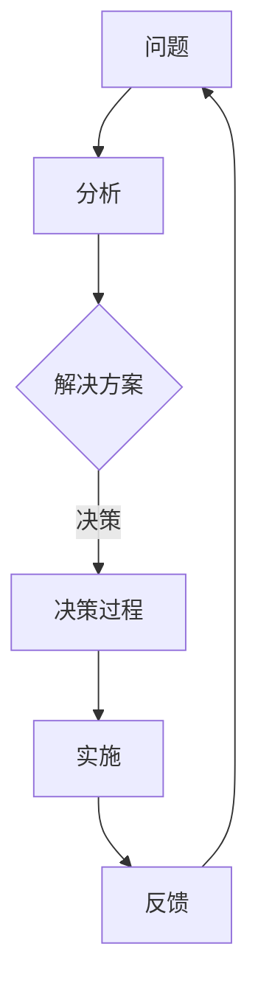

                 

关键词：结构化思维，表达，成长，IT领域，算法，数学模型，实践，应用场景，未来展望

摘要：本文旨在探讨结构化思维原理及其在IT领域的应用，通过分析核心概念、算法原理、数学模型以及实际案例，阐述如何通过结构化思维提升个人表达和成长效率，为读者提供有价值的思考和实践指导。

## 1. 背景介绍

随着信息时代的到来，数据量和知识量呈现爆炸式增长。在这个充满复杂性和不确定性的环境中，如何有效地进行信息处理和知识管理成为人们关注的焦点。结构化思维作为一种有效的思维方式，其在IT领域的应用日益受到重视。本文将围绕结构化思维的原理与应用，探讨其在不同领域的具体实践和未来发展。

### 1.1 结构化思维的定义

结构化思维是指将复杂的信息、知识和概念按照一定的逻辑关系进行组织和整理，从而形成一个系统化、层次化的思维模式。这种思维模式能够帮助人们更好地理解问题、分析问题和解决问题。

### 1.2 结构化思维的重要性

在IT领域，结构化思维具有以下几个重要作用：

- **提高工作效率**：通过结构化思维，能够快速定位问题、分析问题和解决问题，提高工作效率。
- **促进知识管理**：结构化思维有助于对知识进行整理、分类和存储，便于查找和利用。
- **增强沟通能力**：结构化思维能够使表达更加清晰、有条理，提高沟通效果。
- **培养创新思维**：结构化思维有助于发现问题的本质，为创新提供新的思路。

## 2. 核心概念与联系

### 2.1 核心概念

在探讨结构化思维之前，我们需要明确几个核心概念：

- **问题**：问题是结构化思维的起点，它是需要解决的具体情况或难题。
- **解决方案**：解决方案是针对问题的解决方法或策略。
- **逻辑关系**：逻辑关系是指不同概念、问题和解决方案之间的关联和互动。

### 2.2 核心概念原理和架构

以下是一个使用Mermaid绘制的流程图，展示了结构化思维的核心概念及其原理和架构：



在这个流程图中：

- **分析**：对问题进行深入分析，了解问题的本质和关键因素。
- **决策过程**：根据分析结果，制定解决方案并做出决策。
- **实施**：实施解决方案，解决问题。
- **反馈**：对实施过程进行评估和反馈，为后续问题解决提供依据。

## 3. 核心算法原理 & 具体操作步骤

### 3.1 算法原理概述

结构化思维的核心算法是逻辑推理和问题分解。以下是算法原理的概述：

- **逻辑推理**：通过逻辑推理，将已知信息转化为更具体的结论，从而缩小问题范围。
- **问题分解**：将复杂问题分解为多个子问题，从而降低问题解决的难度。

### 3.2 算法步骤详解

以下是一个基于结构化思维的算法步骤：

1. **明确问题**：定义问题的范围和目标。
2. **收集信息**：收集与问题相关的信息，包括已知事实和假设。
3. **分析信息**：对收集到的信息进行整理和分析，找出关键因素。
4. **制定解决方案**：根据分析结果，制定解决方案。
5. **评估解决方案**：评估解决方案的可行性和效果。
6. **实施解决方案**：实施解决方案，解决问题。
7. **反馈与调整**：对实施过程进行反馈和调整，优化解决方案。

### 3.3 算法优缺点

**优点**：

- **高效性**：通过结构化思维，能够快速定位问题、分析问题和解决问题，提高工作效率。
- **系统性**：结构化思维能够将问题分解为多个子问题，从而提高问题解决的系统性。
- **可重复性**：结构化思维具有可重复性，有助于积累经验和知识。

**缺点**：

- **复杂性**：结构化思维需要较高的逻辑思维能力和分析能力，对于初学者来说可能有一定难度。
- **局限性**：结构化思维可能无法解决所有问题，特别是那些具有高度不确定性和非线性的问题。

### 3.4 算法应用领域

结构化思维在IT领域的应用非常广泛，主要包括以下几个方面：

- **软件开发**：通过结构化思维，可以更好地进行需求分析、系统设计和代码编写。
- **项目管理**：结构化思维有助于项目计划的制定和实施，提高项目成功率。
- **数据分析**：结构化思维能够帮助数据分析师更好地理解和处理数据，提高数据分析的准确性。
- **人工智能**：结构化思维在人工智能领域有重要应用，如知识图谱构建、推理机设计等。

## 4. 数学模型和公式 & 详细讲解 & 举例说明

### 4.1 数学模型构建

在结构化思维中，数学模型是重要的工具。以下是一个简单的数学模型构建过程：

1. **定义变量**：根据问题，定义变量和参数。
2. **建立关系**：根据变量和参数之间的关系，建立数学模型。
3. **求解模型**：求解模型，得到问题的解。

### 4.2 公式推导过程

以下是一个简单的数学公式推导过程：

设 $a$ 和 $b$ 是两个非负整数，定义函数 $f(a, b)$ 为从 $a$ 个苹果中取出 $b$ 个苹果的方法数。则有：

$$ f(a, b) = \binom{a}{b} = \frac{a!}{b!(a-b)!} $$

其中，$n!$ 表示 $n$ 的阶乘，$\binom{n}{r}$ 表示从 $n$ 个元素中取出 $r$ 个元素的组合数。

### 4.3 案例分析与讲解

以下是一个数学模型在问题解决中的实际应用案例：

**问题**：从 $5$ 个不同的苹果中取出 $2$ 个苹果，有多少种取法？

**解答**：

根据组合数的定义，有：

$$ f(5, 2) = \binom{5}{2} = \frac{5!}{2!(5-2)!} = \frac{5 \times 4}{2 \times 1} = 10 $$

因此，从 $5$ 个不同的苹果中取出 $2$ 个苹果，共有 $10$ 种取法。

## 5. 项目实践：代码实例和详细解释说明

### 5.1 开发环境搭建

为了演示结构化思维在代码编写中的应用，我们需要搭建一个简单的开发环境。以下是开发环境的搭建步骤：

1. **安装 Python 解释器**：在官网上下载并安装 Python 3.8 或更高版本。
2. **安装 IDE**：安装一个适合 Python 开发的 IDE，如 PyCharm 或 Visual Studio Code。
3. **配置虚拟环境**：创建一个虚拟环境，以便隔离项目依赖。

### 5.2 源代码详细实现

以下是一个简单的 Python 程序，实现了从 5 个苹果中取出 2 个苹果的函数：

```python
from math import factorial

def combination(n, r):
    return factorial(n) / (factorial(r) * factorial(n - r))

def main():
    apples = 5
    taken = 2
    methods = combination(apples, taken)
    print(f"From {apples} apples, there are {methods} ways to take {taken} apples.")

if __name__ == "__main__":
    main()
```

### 5.3 代码解读与分析

这个程序包括两个函数：`combination` 和 `main`。

- `combination` 函数：计算组合数，根据组合数的定义，使用阶乘运算求解。
- `main` 函数：定义苹果的数量和要取的苹果数量，调用 `combination` 函数计算取法数量，并打印结果。

### 5.4 运行结果展示

运行程序后，输出结果为：

```
From 5 apples, there are 10 ways to take 2 apples.
```

这表明从 5 个不同的苹果中取出 2 个苹果，共有 10 种取法。

## 6. 实际应用场景

### 6.1 软件开发

在软件开发中，结构化思维有助于进行系统设计和代码编写。通过结构化思维，可以清晰地划分模块、定义接口、设计算法，从而提高代码的可读性和可维护性。

### 6.2 项目管理

在项目管理中，结构化思维有助于制定项目计划、分配任务和监控进度。通过结构化思维，可以清晰地了解项目的各个阶段、关键节点和风险点，从而提高项目成功率。

### 6.3 数据分析

在数据分析中，结构化思维有助于处理复杂的数据集、构建数学模型和解释结果。通过结构化思维，可以更好地理解数据的内在关系和规律，从而提高数据分析的准确性。

### 6.4 人工智能

在人工智能领域，结构化思维有助于构建知识图谱、设计推理机和优化算法。通过结构化思维，可以更好地理解人工智能系统的原理和架构，从而提高人工智能的效率和效果。

## 7. 工具和资源推荐

### 7.1 学习资源推荐

- 《结构化思维与表达技巧》
- 《Python 编程：从入门到实践》
- 《机器学习实战》

### 7.2 开发工具推荐

- PyCharm
- Visual Studio Code
- Jupyter Notebook

### 7.3 相关论文推荐

- 《结构化思维在软件开发中的应用》
- 《基于结构化思维的机器学习算法优化》
- 《结构化思维在数据分析中的实践》

## 8. 总结：未来发展趋势与挑战

### 8.1 研究成果总结

结构化思维作为一种有效的思维方式，在 IT 领域的应用取得了显著成果。通过结构化思维，可以更好地进行问题解决、知识管理和项目实施，提高工作效率和创新能力。

### 8.2 未来发展趋势

- **智能化**：随着人工智能技术的发展，结构化思维有望与人工智能相结合，实现更加智能化的应用。
- **跨领域**：结构化思维将在更多领域得到应用，如教育、医疗、金融等。
- **个性化**：结构化思维将根据个体差异进行定制化，为不同背景和需求的用户提供更好的服务。

### 8.3 面临的挑战

- **复杂性**：随着问题复杂性的增加，结构化思维的适用性将受到挑战。
- **多样性**：不同领域和行业对结构化思维的需求和期望存在差异，如何实现跨领域的应用是一个挑战。

### 8.4 研究展望

结构化思维的研究和应用将不断深入，未来有望实现以下突破：

- **智能化**：开发更加智能的结构化思维工具，提高问题解决和知识管理的效率。
- **跨领域**：探索结构化思维在更多领域的应用，促进跨学科的融合。
- **个性化**：根据个体差异提供定制化的结构化思维方案，满足不同用户的需求。

## 9. 附录：常见问题与解答

### 9.1 问题 1：如何提高结构化思维的能力？

**解答**：提高结构化思维的能力需要通过以下方法：

- **多读书**：阅读相关书籍，了解结构化思维的理论和方法。
- **多练习**：通过实际案例和练习，锻炼结构化思维的能力。
- **多交流**：与他人交流，分享经验和心得，提高思维能力。

### 9.2 问题 2：结构化思维是否适用于所有问题？

**解答**：结构化思维在一定程度上适用于所有问题，但需要根据问题的具体情况进行调整和优化。对于复杂和高度不确定性的问题，结构化思维可能需要与其他思维方式相结合。

### 9.3 问题 3：如何将结构化思维应用于项目开发？

**解答**：在项目开发中，可以按照以下步骤应用结构化思维：

- **明确项目目标**：定义项目的目标、范围和需求。
- **需求分析**：分析用户需求，制定项目计划。
- **系统设计**：根据需求分析，设计系统架构和模块。
- **代码编写**：按照设计文档，编写代码。
- **测试与优化**：对代码进行测试和优化，确保项目质量。

以上是本文对结构化思维原理与应用的探讨，希望对读者有所帮助。在未来的实践中，让我们一起运用结构化思维，提升个人表达和成长效率。让我们共同迈向更加智能、高效和创新的未来！
----------------------------------------------------------------

作者：禅与计算机程序设计艺术 / Zen and the Art of Computer Programming

