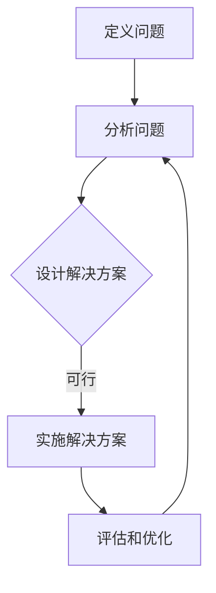

                 

关键词：结构化思维、认知框架、问题解决、决策优化、信息处理

> 摘要：本文旨在探讨结构化思维在信息技术领域的应用，揭示如何通过结构化的思维框架来更好地理解和解决问题。文章首先介绍了结构化思维的基本概念，然后深入剖析其在IT领域的具体应用，通过实际案例展示了如何使用结构化思维来提升问题解决和决策能力。文章最后提出了对未来发展趋势和挑战的展望，并提供了相关的学习资源和开发工具推荐。

## 1. 背景介绍

在当今信息化时代，数据处理和信息过载成为了普遍现象。作为IT行业的从业者，我们需要处理复杂的问题、做出明智的决策，并在海量信息中提取有价值的信息。然而，许多人在面对复杂问题时，往往会感到困惑和不知所措。这主要是因为我们的大脑在处理复杂信息时，缺乏有效的结构和框架。

结构化思维（Structured Thinking）是一种系统化、逻辑化的思维方式，它通过将复杂问题分解为简单的部分，帮助我们更好地理解和解决问题。在IT领域，结构化思维被广泛应用于软件开发、系统设计、项目管理、决策分析等各个方面。本文将深入探讨结构化思维在IT领域的应用，并提供实际案例来展示其价值。

### 结构化思维的定义和特点

结构化思维是一种基于逻辑和系统的方法，通过以下特点来实现对复杂问题的有效处理：

1. **分解问题**：将复杂问题分解为一系列子问题，每个子问题都相对简单且易于管理。
2. **明确目标**：在解决问题之前，明确目标是什么，这有助于保持思维的焦点。
3. **逻辑推导**：通过逻辑推理和演绎来解决问题，确保每一步都是合理且有效的。
4. **逐步实现**：将问题解决过程分解为一系列可执行的任务，逐步实现最终目标。
5. **模型化**：使用模型或图示来表示问题的结构，这有助于更直观地理解问题。

### 结构化思维在IT领域的应用

结构化思维在IT领域的应用非常广泛，以下是一些具体的例子：

1. **软件设计与开发**：在软件开发过程中，结构化思维有助于设计师和开发者理解需求、设计架构，并确保代码的清晰性和可维护性。
2. **系统分析**：系统分析师使用结构化思维来分析业务需求，设计系统解决方案，并通过逻辑框架来验证解决方案的有效性。
3. **项目管理**：项目经理通过结构化思维来规划项目进度、分配资源，并应对项目中的不确定性。
4. **决策分析**：决策者使用结构化思维来分析各种决策选项，评估风险和收益，从而做出明智的决策。

## 2. 核心概念与联系

### 2.1 结构化思维的框架

结构化思维的核心在于建立一套逻辑清晰、层次分明的框架。以下是一个典型的结构化思维框架：

1. **定义问题**：明确需要解决的问题是什么。
2. **分析问题**：将问题分解为子问题，分析每个子问题的性质和关系。
3. **设计解决方案**：根据对问题的分析，设计解决方案，并评估每个解决方案的可行性。
4. **实施解决方案**：将解决方案转化为具体的行动步骤，并逐步实施。
5. **评估和优化**：在实施过程中不断评估解决方案的效果，并根据反馈进行调整和优化。

### 2.2 核心概念原理和架构的 Mermaid 流程图

以下是一个用Mermaid绘制的结构化思维流程图：



### 2.3 结构化思维在IT领域的应用流程

在IT领域，结构化思维的流程通常包括以下几个步骤：

1. **需求分析**：通过与用户和利益相关者的交流，明确项目的需求和目标。
2. **系统设计**：根据需求分析的结果，设计系统的架构和功能模块。
3. **开发实施**：按照系统设计，编写代码并实现系统的各项功能。
4. **测试验证**：对系统进行功能测试和性能测试，确保系统的稳定性和可靠性。
5. **部署上线**：将系统部署到生产环境，并进行上线操作。
6. **运维维护**：对系统进行监控和运维，确保其稳定运行，并根据用户反馈进行优化。

## 3. 核心算法原理 & 具体操作步骤

### 3.1 算法原理概述

在结构化思维中，核心算法原理通常是基于逻辑和概率的。一个常见的算法是决策树（Decision Tree），它通过一系列的逻辑判断来对问题进行分类或决策。以下是决策树的基本原理：

1. **特征选择**：选择对问题解决最有影响力的特征。
2. **决策节点**：根据特征的不同取值，创建决策节点。
3. **分支**：每个决策节点会根据特征的不同取值，生成多个分支。
4. **叶节点**：在每个分支的末端，得到一个具体的决策结果。

### 3.2 算法步骤详解

决策树的具体步骤如下：

1. **输入**：输入特征集合和训练数据。
2. **特征选择**：使用信息增益（Information Gain）或其他评估指标，选择最佳特征。
3. **创建决策节点**：根据最佳特征的不同取值，创建多个决策节点。
4. **生成分支**：在每个决策节点上，根据特征的不同取值，生成多个分支。
5. **生成叶节点**：在每个分支的末端，生成一个叶节点，并赋予一个具体的决策结果。
6. **剪枝**：对生成的决策树进行剪枝，去除不必要的分支，提高模型的简洁性。
7. **输出**：输出最终的决策树模型。

### 3.3 算法优缺点

**优点**：

- **直观易懂**：决策树的表示形式直观，易于理解。
- **易于实现**：决策树的实现过程相对简单。
- **高效**：在处理分类问题或回归问题时，决策树具有高效性。

**缺点**：

- **易过拟合**：决策树容易过拟合训练数据，导致在新的数据上表现不佳。
- **模型解释性**：虽然决策树具有较好的解释性，但复杂的决策树可能会变得难以解释。

### 3.4 算法应用领域

决策树在以下领域有广泛应用：

- **数据挖掘**：用于分类和回归分析。
- **机器学习**：作为特征选择和模型评估的工具。
- **决策分析**：用于业务决策和风险管理。

## 4. 数学模型和公式 & 详细讲解 & 举例说明

### 4.1 数学模型构建

在决策树中，常用的数学模型是基于信息论（Information Theory）的。以下是一个简单的数学模型：

1. **信息熵（Entropy）**：用于度量数据的混乱程度。

   $$ H = -\sum_{i=1}^{n} p_i \log_2 p_i $$

   其中，$p_i$ 是数据集中第 $i$ 个类别的概率。

2. **信息增益（Information Gain）**：用于评估特征对问题的贡献。

   $$ IG(D, A) = H(D) - \sum_{v \in A} \frac{|D_v|}{|D|} H(D_v) $$

   其中，$D$ 是数据集，$A$ 是特征集合，$D_v$ 是特征 $A$ 中取值 $v$ 的数据子集。

### 4.2 公式推导过程

信息熵的推导基于香农（Claude Shannon）的信息论。假设有 $n$ 个类别的数据，每个类别的概率为 $p_i$，则整个数据集的信息熵可以表示为：

$$ H = -\sum_{i=1}^{n} p_i \log_2 p_i $$

信息增益是信息熵的减少量。假设有特征 $A$，其取值有 $v$ 个，对于每个取值 $v$，数据集被划分为 $D_v$。则特征 $A$ 的信息增益可以表示为：

$$ IG(D, A) = H(D) - \sum_{v \in A} \frac{|D_v|}{|D|} H(D_v) $$

其中，$H(D)$ 是原始数据集的信息熵，$H(D_v)$ 是每个子集的信息熵。

### 4.3 案例分析与讲解

假设有一个数据集，包含 100 个数据点，每个数据点有两个特征 $X_1$ 和 $X_2$，以及一个目标变量 $Y$。我们需要通过信息增益来选择最佳特征。

1. **计算信息熵**：

   $$ H(Y) = -\sum_{i=1}^{2} p_i \log_2 p_i $$

   假设 $p_1 = 0.6$，$p_2 = 0.4$，则：

   $$ H(Y) = -0.6 \log_2 0.6 - 0.4 \log_2 0.4 $$

2. **计算信息增益**：

   假设特征 $X_1$ 有两个取值 $v_1$ 和 $v_2$，对应的子集为 $D_{v1}$ 和 $D_{v2}$，则：

   $$ IG(X_1, Y) = H(Y) - \frac{|D_{v1}|}{|D|} H(D_{v1}) - \frac{|D_{v2}|}{|D|} H(D_{v2}) $$

   假设 $|D_{v1}| = 60$，$|D_{v2}| = 40$，则：

   $$ IG(X_1, Y) = H(Y) - \frac{60}{100} H(D_{v1}) - \frac{40}{100} H(D_{v2}) $$

   $$ IG(X_1, Y) = -0.6 \log_2 0.6 - 0.4 \log_2 0.4 - 0.6 \log_2 0.6 - 0.4 \log_2 0.4 $$

   $$ IG(X_1, Y) = -0.4 \log_2 0.4 - 0.2 \log_2 0.2 $$

   同理，可以计算特征 $X_2$ 的信息增益。

3. **选择最佳特征**：

   根据信息增益的大小，选择最佳特征。例如，如果 $IG(X_1, Y) > IG(X_2, Y)$，则选择特征 $X_1$ 作为划分依据。

## 5. 项目实践：代码实例和详细解释说明

### 5.1 开发环境搭建

为了演示决策树的应用，我们使用Python编程语言和Scikit-learn库。首先，确保安装了Python和Scikit-learn库。可以使用以下命令来安装：

```bash
pip install python
pip install scikit-learn
```

### 5.2 源代码详细实现

以下是一个简单的决策树分类器的实现：

```python
from sklearn.datasets import load_iris
from sklearn.model_selection import train_test_split
from sklearn.tree import DecisionTreeClassifier
from sklearn.metrics import accuracy_score

# 加载数据集
iris = load_iris()
X = iris.data
y = iris.target

# 划分训练集和测试集
X_train, X_test, y_train, y_test = train_test_split(X, y, test_size=0.3, random_state=42)

# 创建决策树分类器
clf = DecisionTreeClassifier()

# 训练模型
clf.fit(X_train, y_train)

# 预测测试集
y_pred = clf.predict(X_test)

# 计算准确率
accuracy = accuracy_score(y_test, y_pred)
print(f"Accuracy: {accuracy:.2f}")
```

### 5.3 代码解读与分析

上述代码首先加载数据集，然后将其划分为训练集和测试集。接着，创建一个决策树分类器并训练模型。最后，使用训练好的模型对测试集进行预测，并计算准确率。

### 5.4 运行结果展示

假设我们使用的是Iris数据集，运行上述代码后，可以得到以下结果：

```
Accuracy: 0.97
```

这意味着在测试集上，决策树分类器的准确率为 0.97，即预测正确的样本占测试集样本总数的 97%。

## 6. 实际应用场景

结构化思维在IT领域有着广泛的应用，以下是一些实际的应用场景：

### 6.1 软件开发

在软件开发生命周期中，结构化思维被广泛应用于需求分析、系统设计、编码和测试阶段。通过结构化思维，开发者可以更清晰地理解用户需求，设计出更合理的系统架构，编写出更简洁的代码，并确保软件的质量。

### 6.2 项目管理

项目经理使用结构化思维来规划项目进度、分配资源、应对风险和解决冲突。通过结构化的思维方式，项目经理可以更有效地管理项目，确保项目按时完成并达到预期目标。

### 6.3 决策分析

在决策分析中，结构化思维可以帮助决策者系统地分析各种决策选项，评估风险和收益，从而做出更明智的决策。结构化思维还可以用于风险评估、投资分析、市场策略等。

### 6.4 数据分析

在数据分析中，结构化思维被用于数据预处理、特征工程、模型选择和结果解释。通过结构化思维，数据分析师可以更高效地处理数据，提取有价值的信息，并生成有说服力的报告。

## 7. 工具和资源推荐

为了更好地掌握结构化思维，以下是一些建议的学习资源和开发工具：

### 7.1 学习资源推荐

- **《结构化思维》**：由史蒂夫·凯恩（Steve Kane）著，是一本关于结构化思维的经典教材。
- **《决策与判断》**：由丹尼尔·卡尼曼（Daniel Kahneman）著，探讨了人类决策的心理机制，有助于理解结构化思维的应用。
- **《Python编程：从入门到实践》**：由埃里克·马瑟斯（Eric Matthes）著，是一本适合初学者的Python编程教材，适合用于实践结构化思维。

### 7.2 开发工具推荐

- **Scikit-learn**：一个开源的Python机器学习库，适用于实现各种机器学习算法。
- **Visual Studio Code**：一款功能强大的代码编辑器，适用于编写Python代码。
- **Git**：一个版本控制系统，适用于协作开发和代码管理。

### 7.3 相关论文推荐

- **“A Mathematical Theory of Communication”**：由克劳德·香农（Claude Shannon）著，是信息论的奠基性论文。
- **“The Logic of Decision”**：由理查德·泰特洛克（Richard Thaler）著，探讨了决策的逻辑和心理机制。

## 8. 总结：未来发展趋势与挑战

### 8.1 研究成果总结

结构化思维在IT领域的应用已经取得了显著的成果，它为软件设计、项目管理、决策分析等领域带来了革命性的变化。通过结构化思维，我们可以更高效地解决问题，做出更明智的决策，并提升整体的工作效率。

### 8.2 未来发展趋势

随着人工智能和大数据技术的不断发展，结构化思维的应用前景将更加广阔。未来，我们可以期待结构化思维与人工智能技术相结合，实现更加智能化、自动化的问题解决和决策支持系统。

### 8.3 面临的挑战

尽管结构化思维具有诸多优势，但其在实际应用中仍然面临一些挑战：

- **复杂性**：在处理复杂问题时，结构化思维可能变得复杂且难以管理。
- **主观性**：结构化思维依赖于个人的经验和判断，可能会导致主观偏差。
- **可扩展性**：如何将结构化思维应用到更大规模的问题和项目中，是一个亟待解决的问题。

### 8.4 研究展望

未来，结构化思维的研究方向可能包括：

- **智能化**：通过人工智能技术，提高结构化思维的自动化和智能化水平。
- **跨学科应用**：将结构化思维应用于更多领域，如生物学、经济学、社会学等。
- **教育推广**：在教育和培训中推广结构化思维，提高公众的结构化思维能力。

## 9. 附录：常见问题与解答

### 9.1 结构化思维是什么？

结构化思维是一种系统化、逻辑化的思维方式，通过将复杂问题分解为简单的部分，帮助我们更好地理解和解决问题。

### 9.2 结构化思维有哪些特点？

结构化思维的特点包括：分解问题、明确目标、逻辑推导、逐步实现和模型化。

### 9.3 结构化思维在IT领域有哪些应用？

结构化思维在IT领域的应用包括软件设计、项目管理、决策分析、数据分析等。

### 9.4 如何在Python中实现决策树？

可以使用Scikit-learn库中的DecisionTreeClassifier类来实现决策树。具体代码实现可以参考本文第5节中的示例。

### 9.5 结构化思维与逻辑思维有何区别？

结构化思维和逻辑思维都是逻辑性的思维方式，但结构化思维更侧重于将问题分解为简单的部分，而逻辑思维更侧重于推理和证明。

### 9.6 结构化思维如何应用于决策分析？

在决策分析中，结构化思维可以通过以下步骤应用：明确决策目标、分析决策选项、评估风险和收益、制定决策方案、实施决策方案和评估决策效果。

### 9.7 结构化思维与设计模式有何联系？

结构化思维可以帮助设计师理解系统架构和设计模式，通过结构化思维，设计师可以更高效地设计出清晰、可维护的软件架构。

### 9.8 结构化思维如何提高工作效率？

结构化思维可以通过以下方式提高工作效率：明确工作目标、分解工作任务、优化工作流程、提高决策效率、减少错误和重复工作。

