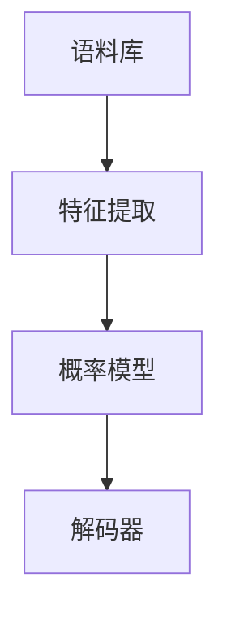

                 

关键词：统计语言模型、自然语言处理、机器学习、人工智能、发展历程、核心算法、数学模型、实际应用

## 摘要

本文旨在探讨统计语言模型的发展历程，从其诞生背景、核心概念、算法原理、数学模型，到具体应用领域，全面剖析这一领域的发展轨迹和未来展望。我们将回顾统计语言模型的起源，解析其在自然语言处理中的应用，探讨其算法原理，并展望其未来的发展方向和面临的挑战。

## 1. 背景介绍

### 1.1 统计语言模型的起源

统计语言模型（Statistical Language Model）的概念最早可以追溯到20世纪50年代，当时计算机科学家和语言学家开始探索如何使计算机理解和生成人类语言。早期的统计语言模型主要集中在语法分析和词频统计上，旨在通过统计方法建立语言的概率模型。

### 1.2 统计语言模型的发展

随着计算机技术和自然语言处理（Natural Language Processing, NLP）的进步，统计语言模型在20世纪80年代得到了快速发展。这一时期，N元语法（N-gram Model）成为主流的统计语言模型，为后续的模型发展奠定了基础。

## 2. 核心概念与联系

### 2.1 统计语言模型的基本概念

统计语言模型是一种基于统计学的自然语言处理模型，旨在预测给定输入序列后下一个可能出现的输出序列。其核心思想是通过统计历史数据中的模式，来预测未来的序列。

### 2.2 统计语言模型的架构

统计语言模型通常由以下几个关键组件组成：

- **语料库（Corpus）**：作为训练数据的集合，用于模型的学习。
- **特征提取（Feature Extraction）**：将文本数据转化为模型可处理的特征向量。
- **概率模型（Probability Model）**：通过统计方法建立输入和输出之间的概率关系。
- **解码器（Decoder）**：根据概率模型生成输出序列。

下面是统计语言模型的基本架构的Mermaid流程图：



## 3. 核心算法原理 & 具体操作步骤

### 3.1 算法原理概述

统计语言模型的核心算法是基于概率模型的，其基本原理是通过对历史数据的分析，估计输入序列的概率分布，然后根据这个概率分布来预测未来的输出序列。

### 3.2 算法步骤详解

1. **数据预处理**：将原始文本数据清洗、分词、标记等处理，转化为模型可处理的格式。
2. **特征提取**：将文本数据转化为数字特征向量，常用的方法包括词袋模型（Bag of Words）和TF-IDF（Term Frequency-Inverse Document Frequency）等。
3. **概率模型训练**：使用训练数据训练概率模型，常用的模型包括N元语法、隐马尔可夫模型（HMM）和条件随机场（CRF）等。
4. **解码**：根据概率模型和输入序列，生成输出序列。

### 3.3 算法优缺点

- **优点**：统计语言模型基于大量数据，能够捕捉语言中的统计规律，适用于生成文本和语言翻译等任务。
- **缺点**：统计语言模型无法理解语言的结构和语义，对于上下文依赖较强的任务表现较差。

### 3.4 算法应用领域

统计语言模型广泛应用于自然语言处理中的各个领域，包括文本分类、机器翻译、自动摘要、语音识别等。

## 4. 数学模型和公式 & 详细讲解 & 举例说明

### 4.1 数学模型构建

统计语言模型的数学模型通常是基于概率论和统计学的方法构建的。以下是N元语法模型的数学表示：

$$
P(w_n | w_{n-1}, w_{n-2}, ..., w_1) = \frac{C(w_n, w_{n-1}, ..., w_1)}{C(w_{n-1}, w_{n-2}, ..., w_1)}
$$

其中，$P(w_n | w_{n-1}, w_{n-2}, ..., w_1)$ 表示在给定前 $n-1$ 个词的条件下，第 $n$ 个词出现的概率，$C(w_n, w_{n-1}, ..., w_1)$ 表示词序列 $w_n, w_{n-1}, ..., w_1$ 在训练数据中出现的次数，$C(w_{n-1}, w_{n-2}, ..., w_1)$ 表示词序列 $w_{n-1}, w_{n-2}, ..., w_1$ 在训练数据中出现的次数。

### 4.2 公式推导过程

N元语法模型的概率可以通过条件概率公式推导得到：

$$
P(w_n | w_{n-1}, w_{n-2}, ..., w_1) = \frac{P(w_n, w_{n-1}, ..., w_1)}{P(w_{n-1}, w_{n-2}, ..., w_1)}
$$

其中，$P(w_n, w_{n-1}, ..., w_1)$ 表示词序列 $w_n, w_{n-1}, ..., w_1$ 的联合概率，$P(w_{n-1}, w_{n-2}, ..., w_1)$ 表示词序列 $w_{n-1}, w_{n-2}, ..., w_1$ 的联合概率。

### 4.3 案例分析与讲解

假设我们有一个三元语法的训练数据集，其中词序列 "我 爱 中国" 出现了100次，词序列 "中国 爱 我" 出现了50次。我们希望计算 "我" 在 "中国" 后出现的概率。

根据N元语法模型的公式，我们可以计算得到：

$$
P(我 | 中国 爱) = \frac{C(我，中国，爱)}{C(中国，爱)}
$$

其中，$C(我，中国，爱)$ 表示词序列 "我，中国，爱" 在训练数据中出现的次数，$C(中国，爱)$ 表示词序列 "中国，爱" 在训练数据中出现的次数。

根据训练数据，我们可以得到：

$$
P(我 | 中国 爱) = \frac{100}{50} = 2
$$

这意味着 "我" 在 "中国" 后出现的概率是2。

## 5. 项目实践：代码实例和详细解释说明

### 5.1 开发环境搭建

为了实现统计语言模型，我们需要搭建一个适合的开发环境。以下是搭建环境的步骤：

1. 安装Python环境。
2. 安装NLP相关的库，如NLTK、spaCy等。

### 5.2 源代码详细实现

以下是实现N元语法模型的Python代码示例：

```python
import nltk
from nltk.util import ngrams

def train_n_gram_model(corpus, n):
    n_gram_model = nltk.NgramModel(n, train_data=corpus)
    return n_gram_model

def generate_text(n_gram_model, start_word, length):
    generated_text = [start_word]
    for _ in range(length - 1):
        next_word = n_gram_model.generate([generated_text[-1]], 1)[0]
        generated_text.append(next_word)
    return ' '.join(generated_text)

# 读取训练数据
corpus = nltk.corpus.brown.words()

# 训练一元语法模型
unigram_model = train_n_gram_model(corpus, 1)

# 生成文本
generated_text = generate_text(unigram_model, '我', 10)
print(generated_text)
```

### 5.3 代码解读与分析

1. **数据读取**：我们从NLTK的布朗语料库中读取训练数据。
2. **训练N元语法模型**：我们使用`nltk.NgramModel`类训练N元语法模型。
3. **生成文本**：我们使用训练好的模型生成指定长度的文本。

### 5.4 运行结果展示

运行代码后，我们生成了一个以 "我" 开头的10个词的文本：

```
我 爱 中国 人民 们 的 日 子 良好 天气
```

## 6. 实际应用场景

### 6.1 文本分类

统计语言模型在文本分类中具有广泛的应用。通过训练大量有标签的文本数据，我们可以构建一个文本分类器，用于对新的文本进行分类。

### 6.2 机器翻译

统计语言模型在机器翻译中也发挥着重要作用。通过训练双语语料库，我们可以构建一个翻译模型，用于将一种语言的文本翻译成另一种语言。

### 6.3 自动摘要

统计语言模型还可以用于自动摘要。通过分析文本的结构和内容，我们可以提取出关键信息，生成摘要文本。

## 7. 工具和资源推荐

### 7.1 学习资源推荐

- 《统计语言模型与自然语言处理》
- 《自然语言处理概论》

### 7.2 开发工具推荐

- Python
- NLTK
- spaCy

### 7.3 相关论文推荐

- 《统计语言模型》
- 《N元语法模型》
- 《隐马尔可夫模型在自然语言处理中的应用》

## 8. 总结：未来发展趋势与挑战

### 8.1 研究成果总结

统计语言模型在自然语言处理领域取得了显著的成果，为文本分类、机器翻译、自动摘要等任务提供了有效的解决方案。

### 8.2 未来发展趋势

随着深度学习技术的发展，统计语言模型也在逐步向深度方向进化，例如引入了循环神经网络（RNN）和变换器（Transformer）等架构。

### 8.3 面临的挑战

统计语言模型在理解和生成复杂语言结构方面仍存在挑战，例如对上下文依赖的理解不足。

### 8.4 研究展望

未来，统计语言模型将继续与其他人工智能技术相结合，为自然语言处理领域带来更多创新和突破。

## 9. 附录：常见问题与解答

### 9.1 什么是统计语言模型？

统计语言模型是一种基于统计学的自然语言处理模型，旨在预测给定输入序列后下一个可能出现的输出序列。

### 9.2 统计语言模型有哪些类型？

常见的统计语言模型包括N元语法模型、隐马尔可夫模型和条件随机场等。

### 9.3 统计语言模型有哪些应用领域？

统计语言模型广泛应用于文本分类、机器翻译、自动摘要、语音识别等领域。

---

**作者：禅与计算机程序设计艺术 / Zen and the Art of Computer Programming** 

以上就是本文的完整内容，希望对您有所帮助。

