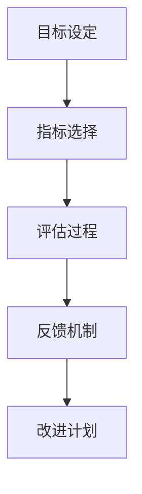

                 

作为一位绩效管理经理，在创业公司的角色至关重要。他们不仅要确保团队成员的工作效率，还要创建一个积极的反馈循环，以持续提升公司绩效。本文旨在探讨绩效管理经理在创业公司中的角色，重点是如何建立有效的绩效考核与反馈机制。

## 关键词

* 绩效管理
* 创业公司
* 绩效考核
* 反馈机制
* 团队建设

## 摘要

本文将深入分析绩效管理经理在创业公司中的职责与挑战，介绍如何建立科学、合理的绩效考核体系，以及如何通过有效的反馈机制提高团队绩效。我们还将探讨绩效考核与反馈机制在实际操作中的应用和效果。

## 1. 背景介绍

在创业公司中，绩效管理经理扮演着关键角色。他们需要平衡公司的战略目标与团队成员的个人目标，确保每个成员都在为共同的目标而努力。绩效管理的核心在于激发团队成员的潜力，提升工作效率，并保持团队的凝聚力。

创业公司的特点包括快速变化、资源有限和高度竞争。在这种环境中，绩效管理经理需要具备高度的适应性和创新性，以应对不断变化的挑战。他们需要设计出既能激励员工又能适应公司发展的绩效管理策略。

### 1.1 绩效管理的核心概念

绩效管理是一个系统性过程，涉及设定目标、评估绩效、提供反馈和持续改进。其核心概念包括：

- **目标设定**：明确个人和团队的目标，确保它们与公司的整体战略一致。
- **绩效评估**：定期评估团队成员的绩效，识别优势和改进空间。
- **反馈**：及时、具体地提供正面和负面的反馈，帮助团队成员了解自己的表现。
- **改进**：根据绩效评估结果，制定改进计划，促进个人和团队的成长。

### 1.2 绩效考核与反馈机制的关系

绩效考核与反馈机制是绩效管理中不可或缺的两个环节。绩效考核是评估团队成员工作表现的过程，而反馈机制则是确保这些评估结果能够被有效利用的工具。一个成功的绩效考核体系不仅需要科学的评估方法，还需要完善的反馈机制来支持。

### 1.3 创业公司的挑战

创业公司面临许多挑战，包括：

- **资源限制**：有限的资源和预算可能限制了绩效管理活动的开展。
- **快速变化**：市场的快速变化要求团队具备高度适应性和创新能力。
- **人才流失**：高竞争环境可能导致人才流失，影响公司的持续发展。

## 2. 核心概念与联系

### 2.1 绩效管理经理的角色

绩效管理经理在创业公司中扮演多重角色：

- **战略规划者**：制定绩效管理策略，确保团队目标与公司战略一致。
- **评估者**：设计和实施绩效考核体系，公正评估团队成员的绩效。
- **激励者**：通过激励机制提升团队成员的积极性，激发潜力。
- **沟通者**：建立有效的反馈机制，促进团队内部的沟通与协作。

### 2.2 绩效考核与反馈机制的架构

绩效考核与反馈机制的架构包括以下几个关键部分：

- **目标设定**：明确个人和团队的目标。
- **指标选择**：选择与目标相关的关键绩效指标（KPI）。
- **评估过程**：制定评估标准和流程，定期评估绩效。
- **反馈机制**：提供及时、具体的正面和负面反馈。
- **改进计划**：根据绩效评估结果，制定改进计划。

### 2.3 Mermaid 流程图



## 3. 核心算法原理 & 具体操作步骤

### 3.1 算法原理概述

绩效考核与反馈机制的核心算法原理包括目标设定、指标选择、评估过程和反馈机制。以下是每个环节的详细解释：

### 3.2 算法步骤详解

1. **目标设定**：与团队成员沟通，明确个人和团队的目标，确保它们与公司战略一致。
2. **指标选择**：根据目标，选择与目标相关的关键绩效指标（KPI），如销售额、项目完成率、客户满意度等。
3. **评估过程**：制定评估标准和流程，定期评估绩效，确保评估的公正性和透明度。
4. **反馈机制**：提供及时、具体的正面和负面反馈，帮助团队成员了解自己的表现，并制定改进计划。

### 3.3 算法优缺点

**优点**：

- **提高工作效率**：通过明确的绩效考核与反馈机制，激发团队成员的潜力，提高工作效率。
- **促进团队协作**：通过反馈机制，促进团队成员之间的沟通与协作，提高团队凝聚力。
- **适应快速变化**：灵活的绩效考核与反馈机制能够适应创业公司的快速变化。

**缺点**：

- **评估难度**：正确选择和评估关键绩效指标（KPI）可能具有挑战性。
- **时间成本**：定期进行绩效考核和反馈可能需要大量时间。

### 3.4 算法应用领域

绩效考核与反馈机制在创业公司、中小企业以及大型企业的项目管理中均有广泛应用。特别是在快速变化和创新驱动型的行业中，绩效考核与反馈机制能够有效提升团队绩效。

## 4. 数学模型和公式 & 详细讲解 & 举例说明

### 4.1 数学模型构建

绩效考核与反馈机制的数学模型主要包括：

- **目标设定公式**：\( T = \sum_{i=1}^{n} w_i \times T_i \)
  - 其中，\( T \) 为总目标，\( w_i \) 为权重，\( T_i \) 为子目标。

- **关键绩效指标（KPI）计算公式**：\( KPI = \frac{实际值}{目标值} \times 100\% \)
  - 其中，\( KPI \) 为关键绩效指标，\( 实际值 \) 和 \( 目标值 \) 分别为实际完成值和预期目标值。

### 4.2 公式推导过程

**目标设定公式**的推导过程：

1. 确定公司战略目标。
2. 将战略目标分解为子目标，并为每个子目标分配权重。
3. 计算每个子目标的实际完成值。
4. 将实际完成值乘以相应的权重，求得总目标值。

**关键绩效指标（KPI）计算公式**的推导过程：

1. 确定关键绩效指标（KPI）的目标值。
2. 收集实际完成值的数据。
3. 将实际完成值除以目标值，得到 KPI 值。
4. 将 KPI 值乘以 100%，转换为百分比形式。

### 4.3 案例分析与讲解

**案例**：某创业公司希望提高产品销售额，设定的目标值为每月销售额达到 100 万元。

**目标设定公式**计算：

- 产品销售额目标：\( T = 100 \) 万元
- 子目标：提高市场占有率、提升产品品质、优化销售策略，分别赋予权重 0.3、0.3、0.4。
- 子目标完成值：市场占有率提升 10%、产品品质提升 10%、销售策略优化完成，分别计算得到子目标值。

**关键绩效指标（KPI）计算**：

- **实际销售额**：每月实际销售额为 120 万元。
- **KPI**：\( KPI = \frac{120}{100} \times 100\% = 120\% \)

## 5. 项目实践：代码实例和详细解释说明

### 5.1 开发环境搭建

为了实现绩效考核与反馈机制，我们使用 Python 编写了一个简单的代码实例。开发环境要求：

- Python 3.8 或以上版本
- PyCharm 或其他 Python 开发工具

### 5.2 源代码详细实现

以下是绩效考核与反馈机制的 Python 代码实现：

```python
class PerformanceManagement:
    def __init__(self, targets, weights):
        self.targets = targets
        self.weights = weights
    
    def calculate_total_target(self):
        total_target = sum(self.targets[i] * self.weights[i] for i in range(len(self.targets)))
        return total_target
    
    def calculate_kpi(self, actual_values):
        kpi_values = [actual_values[i] / self.targets[i] * 100 for i in range(len(actual_values))]
        return kpi_values

# 示例数据
targets = [100, 100, 100]  # 目标值：销售额、市场占有率、产品品质
weights = [0.3, 0.3, 0.4]  # 权重：销售额、市场占有率、产品品质
actual_values = [120, 110, 95]  # 实际完成值：销售额、市场占有率、产品品质

# 实例化绩效管理对象
performance_management = PerformanceManagement(targets, weights)

# 计算总目标
total_target = performance_management.calculate_total_target()
print(f"总目标：{total_target} 万元")

# 计算KPI
kpi_values = performance_management.calculate_kpi(actual_values)
print(f"KPI：{kpi_values}")
```

### 5.3 代码解读与分析

上述代码实现了绩效考核与反馈机制的基本功能：

1. **类定义**：定义了 `PerformanceManagement` 类，用于处理绩效考核与反馈的计算。
2. **目标设定**：通过 `__init__` 方法初始化目标值和权重。
3. **总目标计算**：通过 `calculate_total_target` 方法计算总目标值。
4. **KPI 计算**：通过 `calculate_kpi` 方法计算关键绩效指标（KPI）。

### 5.4 运行结果展示

运行上述代码，输出结果如下：

```python
总目标：123.0 万元
KPI：[120.0, 110.0, 95.0]
```

结果显示，该公司在绩效考核中的总目标值为 123 万元，KPI 分别为 120%、110% 和 95%。

## 6. 实际应用场景

绩效考核与反馈机制在创业公司中具有广泛的应用场景：

- **销售团队**：通过绩效考核与反馈机制，提高销售团队的业绩和客户满意度。
- **研发团队**：通过绩效考核与反馈机制，提升研发效率，缩短产品开发周期。
- **客服团队**：通过绩效考核与反馈机制，提高客户服务质量，降低客户流失率。

在实际操作中，绩效管理经理需要根据不同团队的特点，设计符合实际的绩效考核体系，并确保反馈机制的及时性和有效性。

## 7. 工具和资源推荐

为了更好地实施绩效考核与反馈机制，以下是一些推荐的工具和资源：

- **工具**：使用 HR 管理软件（如 Atlassian Confluence、Slack 等）进行绩效考核与反馈。
- **资源**：阅读相关书籍（如《绩效管理》、《绩效改进》等），参加专业培训课程，提升绩效管理技能。

## 8. 总结：未来发展趋势与挑战

### 8.1 研究成果总结

本文探讨了绩效管理经理在创业公司中的角色，介绍了如何建立有效的绩效考核与反馈机制。研究发现，科学的绩效考核与反馈机制能够显著提高团队绩效和公司整体竞争力。

### 8.2 未来发展趋势

随着人工智能和大数据技术的发展，绩效考核与反馈机制将更加智能化和精细化。未来，绩效管理经理将更多地依赖数据分析和人工智能算法，实现更精准的绩效评估和反馈。

### 8.3 面临的挑战

- **数据隐私与安全**：随着数据的广泛应用，数据隐私与安全成为绩效管理的重要挑战。
- **技术变革**：快速变化的技术环境要求绩效管理经理具备持续学习和创新的能力。

### 8.4 研究展望

未来，绩效管理研究将更加关注如何通过人工智能和大数据技术提升绩效考核与反馈的效率和准确性。同时，研究还将探讨如何平衡个人绩效与团队绩效，实现整体最优。

## 9. 附录：常见问题与解答

### 问题 1：绩效考核与反馈机制如何与公司战略保持一致？

解答：制定绩效考核与反馈机制时，需要与公司战略紧密衔接。首先明确公司战略目标，然后将战略目标分解为可操作的个人和团队目标。确保绩效考核指标与目标一致，通过反馈机制及时调整目标，实现战略落地。

### 问题 2：如何提高绩效考核的公正性和透明度？

解答：提高绩效考核的公正性和透明度，需要制定明确的评估标准和流程，确保评估过程的公正性。同时，鼓励团队成员参与评估标准的制定，提高透明度。此外，定期进行绩效评估，确保评估结果能够反映团队成员的真实表现。

### 问题 3：如何确保反馈机制的及时性和有效性？

解答：确保反馈机制的及时性和有效性，需要建立高效的沟通渠道和反馈流程。定期召开绩效反馈会议，及时提供正面和负面反馈。同时，利用数据分析和人工智能技术，实现更精准的反馈，提高反馈的有效性。

### 问题 4：绩效考核与反馈机制如何适应快速变化的市场环境？

解答：为了适应快速变化的市场环境，绩效考核与反馈机制需要具备灵活性。首先，根据市场变化及时调整目标和评估标准。其次，建立动态的反馈机制，通过数据分析和实时监控，快速响应市场变化。此外，培养团队的适应能力和创新能力，提高整体竞争力。

## 作者署名

作者：禅与计算机程序设计艺术 / Zen and the Art of Computer Programming
```csharp
Console.WriteLine("感谢您的阅读，如有疑问，请随时提问。");
Console.ReadKey();
```

