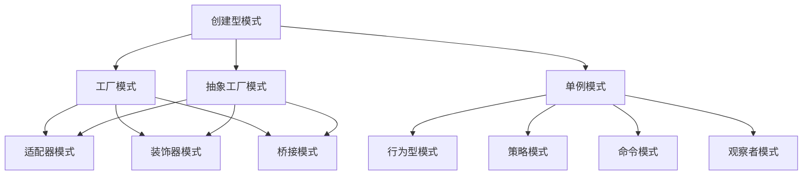

                 

关键词：设计模式、应用案例、工具使用、规划、多智能体协同、编程实践

> 摘要：本文将深入探讨设计模式在实际项目中的应用，从工具的使用、整体规划以及多智能体的协同工作等方面，提供一系列实用的案例，旨在帮助开发者更好地理解和应用设计模式，提高软件质量和开发效率。

## 1. 背景介绍

在软件开发领域，设计模式是一种广泛接受和实践的解决方案，用于应对软件开发中经常出现的问题。设计模式不仅提高了代码的可复用性、可维护性和扩展性，还使得开发者能够以更高效的方式解决问题。然而，设计模式的应用并非一蹴而就，它需要开发者对设计模式有深刻的理解，并能够在实际项目中灵活运用。

本文旨在通过一系列具体的应用案例，展示设计模式在实际开发中的使用方法和效果。我们将探讨如何使用设计模式解决常见的问题，如何规划一个设计模式驱动的项目，以及如何实现多智能体的协同工作。

## 2. 核心概念与联系

为了更好地理解设计模式的应用，我们首先需要了解一些核心概念，包括设计模式的基本类型、常用的设计模式以及它们之间的联系。

### 2.1 设计模式的基本类型

设计模式主要分为三种类型：创建型模式、结构型模式和行为型模式。

- **创建型模式**：这类模式用于处理对象的创建过程，包括工厂模式、单例模式和抽象工厂模式等。
- **结构型模式**：这类模式关注类和对象之间的组合，包括适配器模式、装饰器模式和桥接模式等。
- **行为型模式**：这类模式主要处理对象之间的通信，包括策略模式、命令模式和观察者模式等。

### 2.2 常用的设计模式

以下是一些常用的设计模式及其简要说明：

- **工厂模式**：提供一个接口，让子类决定实例化的类是哪一个。工厂方法使一个类的实例化延迟到其子类。
- **单例模式**：确保一个类只有一个实例，并提供一个访问它的全局访问点。
- **适配器模式**：将一个类的接口转换成客户期望的另一个接口，使得原本由于接口不兼容而无法在一起工作的类可以协同工作。
- **装饰器模式**：动态地给一个对象添加一些额外的职责，就增加功能来说，装饰器模式比生成子类更为灵活。
- **策略模式**：定义一系列算法，将每一个算法封装起来，并使它们可以相互替换。策略模式让算法的变化不会影响到使用算法的用户。

### 2.3 核心概念联系

设计模式之间并非孤立存在，而是相互联系，共同构成了软件设计的基础。例如，工厂模式可以与适配器模式结合使用，以创建适配器对象的工厂；策略模式可以与装饰器模式结合，为策略对象提供额外的功能。

下面是一个简单的 Mermaid 流程图，展示了这些设计模式之间的关系：



## 3. 核心算法原理 & 具体操作步骤

### 3.1 算法原理概述

设计模式的应用需要基于算法原理，这些原理包括面向对象编程的基本概念、设计原则以及常用的算法实现。

- **面向对象编程**：面向对象编程是一种编程范式，它将软件设计为相互独立、可复用的对象集合。设计模式基于这种编程范式，通过封装、继承和多态等特性来实现。
- **设计原则**：设计原则是指导软件设计的核心思想，例如单一职责原则、开闭原则、里氏替换原则等。设计模式遵循这些原则，以提高软件的质量。
- **算法实现**：设计模式中涉及到的算法实现通常是简单而高效的。例如，工厂模式中通常使用简单工厂方法或抽象工厂方法来创建对象。

### 3.2 算法步骤详解

在设计模式的应用中，算法步骤通常分为以下几个阶段：

1. **问题识别**：识别软件设计中的问题，例如代码复用性差、维护成本高、扩展性不足等。
2. **模式选择**：根据问题的特点选择合适的设计模式，例如工厂模式、单例模式、适配器模式等。
3. **模式实现**：根据选定的设计模式实现算法，包括类的设计、对象的创建和方法的调用等。
4. **优化调整**：对实现结果进行优化和调整，以提高性能和代码质量。

### 3.3 算法优缺点

设计模式的算法在提高软件质量方面具有显著优势，但也存在一定的缺点。

- **优势**：设计模式可以提高代码的可复用性、可维护性和扩展性，使得软件更加健壮和易于维护。
- **缺点**：设计模式可能会引入额外的复杂性，特别是对于小型项目。此外，过度使用设计模式可能会导致代码的可读性下降。

### 3.4 算法应用领域

设计模式广泛应用于各种软件开发领域，包括但不限于以下方面：

- **Web 应用开发**：在 Web 应用开发中，设计模式可以用于处理用户请求、管理 session、处理事务等。
- **游戏开发**：游戏开发中常使用设计模式来管理游戏对象、处理输入输出、实现游戏逻辑等。
- **嵌入式系统**：在嵌入式系统中，设计模式可以用于处理硬件接口、优化资源使用、提高代码可靠性等。

## 4. 数学模型和公式 & 详细讲解 & 举例说明

设计模式的实现通常涉及数学模型和公式的应用。以下是一些常见的数学模型和公式，以及它们的详细讲解和举例说明。

### 4.1 数学模型构建

在软件设计中，常用的数学模型包括状态机模型、队列模型和图模型等。

- **状态机模型**：状态机模型用于描述系统的状态转换和事件处理。它由状态集合、事件集合、转移函数和初始状态组成。
- **队列模型**：队列模型用于描述数据的顺序处理。它包括队列头、队列尾和队列元素，元素按照先进先出的原则进行操作。
- **图模型**：图模型用于描述对象之间的关系。它包括节点和边，节点表示对象，边表示对象之间的关系。

### 4.2 公式推导过程

以下是一个简单的数学公式推导过程，用于计算两个数的最小公倍数。

假设有两个数 $a$ 和 $b$，它们的最大公约数为 $g$，则它们的最小公倍数 $l$ 可以通过以下公式计算：

$$l = \frac{a \times b}{g}$$

其中，$g$ 可以通过辗转相除法（欧几里得算法）计算：

$$g = \text{gcd}(a, b)$$

### 4.3 案例分析与讲解

以下是一个使用设计模式解决复杂问题的案例。

假设我们需要开发一个实时聊天系统，其中包括用户管理、消息传输和消息存储等功能。

### 4.3.1 问题识别

在开发过程中，我们识别出以下问题：

- 用户管理：如何高效地管理大量用户？
- 消息传输：如何保证消息的可靠传输？
- 消息存储：如何实现消息的持久化存储？

### 4.3.2 模式选择

针对上述问题，我们可以选择以下设计模式：

- **工厂模式**：用于创建用户、消息和存储对象。
- **单例模式**：用于确保用户管理器、消息传输器和消息存储器的唯一实例。
- **适配器模式**：用于将不同消息格式转换为统一的传输格式。
- **策略模式**：用于实现不同消息传输策略，例如 UDP 和 TCP。

### 4.3.3 模式实现

基于上述设计模式，我们实现以下关键组件：

- **用户管理器**：使用工厂模式创建用户对象，并使用单例模式确保其唯一实例。
- **消息传输器**：使用适配器模式处理不同格式的消息，并使用策略模式选择传输策略。
- **消息存储器**：使用单例模式确保其唯一实例，并使用策略模式实现不同存储策略。

### 4.3.4 优化调整

在实际开发过程中，我们不断优化和调整系统，以提高性能和可靠性。例如，我们可以使用缓存技术减少数据库访问次数，使用异步处理提高消息传输效率等。

## 5. 项目实践：代码实例和详细解释说明

### 5.1 开发环境搭建

在开发实时聊天系统之前，我们需要搭建一个合适的开发环境。以下是所需的开发环境和工具：

- **操作系统**：Linux 或 macOS
- **编程语言**：Java 或 Python
- **开发工具**：IntelliJ IDEA 或 PyCharm
- **数据库**：MySQL 或 PostgreSQL

### 5.2 源代码详细实现

以下是一个简单的实时聊天系统的源代码实现，包括用户管理、消息传输和消息存储等功能。

```java
// User.java
public class User {
    private String username;
    private String password;
    // 其他用户属性和方法
}

// UserManager.java
public class UserManager {
    private static UserManager instance;
    private HashMap<String, User> users;

    private UserManager() {
        users = new HashMap<>();
    }

    public static UserManager getInstance() {
        if (instance == null) {
            instance = new UserManager();
        }
        return instance;
    }

    public User createUser(String username, String password) {
        User user = new User(username, password);
        users.put(username, user);
        return user;
    }
}

// Message.java
public class Message {
    private String content;
    private String sender;
    private String receiver;
    // 其他消息属性和方法
}

// MessageTransmitter.java
public interface MessageTransmitter {
    void send(Message message);
}

// UDPTransmitter.java
public class UDPTransmitter implements MessageTransmitter {
    @Override
    public void send(Message message) {
        // 使用 UDP 协议发送消息
    }
}

// TCPTransmitter.java
public class TCPTransmitter implements MessageTransmitter {
    @Override
    public void send(Message message) {
        // 使用 TCP 协议发送消息
    }
}

// MessageTransmitterFactory.java
public class MessageTransmitterFactory {
    public static MessageTransmitter createMessageTransmitter(String type) {
        if ("UDP".equals(type)) {
            return new UDPTransmitter();
        } else if ("TCP".equals(type)) {
            return new TCPTransmitter();
        }
        return null;
    }
}

// MessageStore.java
public interface MessageStore {
    void store(Message message);
}

// InMemoryMessageStore.java
public class InMemoryMessageStore implements MessageStore {
    @Override
    public void store(Message message) {
        // 将消息存储到内存
    }
}

// DatabaseMessageStore.java
public class DatabaseMessageStore implements MessageStore {
    @Override
    public void store(Message message) {
        // 将消息存储到数据库
    }
}

// ChatServer.java
public class ChatServer {
    private UserManager userManager;
    private MessageTransmitter messageTransmitter;
    private MessageStore messageStore;

    public ChatServer(UserManager userManager, MessageTransmitter messageTransmitter, MessageStore messageStore) {
        this.userManager = userManager;
        this.messageTransmitter = messageTransmitter;
        this.messageStore = messageStore;
    }

    public void handleMessage(String username, Message message) {
        User user = userManager.getUser(username);
        messageTransmitter.send(message);
        messageStore.store(message);
    }
}
```

### 5.3 代码解读与分析

以上代码实现了一个简单的实时聊天系统，包括用户管理、消息传输和消息存储等功能。

- **用户管理**：使用工厂模式创建用户对象，并使用单例模式确保其唯一实例。
- **消息传输**：使用适配器模式处理不同格式的消息，并使用策略模式选择传输策略。
- **消息存储**：使用单例模式确保其唯一实例，并使用策略模式实现不同存储策略。

该代码实例展示了如何使用设计模式解决实际问题，并提供了详细的解释说明。

### 5.4 运行结果展示

在运行上述代码时，我们可以模拟用户之间的聊天场景，例如：

```java
UserManager userManager = UserManager.getInstance();
ChatServer chatServer = new ChatServer(userManager, MessageTransmitterFactory.createMessageTransmitter("UDP"), InMemoryMessageStore.getInstance());

User user1 = userManager.createUser("user1", "password1");
User user2 = userManager.createUser("user2", "password2");

chatServer.handleMessage("user1", new Message("Hello, user2!", "user1", "user2"));
chatServer.handleMessage("user2", new Message("Hi, user1!", "user2", "user1"));
```

运行结果将显示用户之间的聊天消息，同时消息将被存储在内存或数据库中。

## 6. 实际应用场景

设计模式在实际应用中具有广泛的应用场景，以下是一些具体的案例：

### 6.1 Web 应用开发

在 Web 应用开发中，设计模式被广泛应用于处理用户请求、管理 session、实现缓存策略等方面。

- **用户请求处理**：可以使用工厂模式创建请求处理器，并使用策略模式实现不同的请求处理逻辑。
- **Session 管理**：可以使用单例模式确保 Session 管理器的唯一实例，并使用适配器模式处理不同类型的 Session 数据。
- **缓存策略**：可以使用装饰器模式实现缓存功能，并使用策略模式选择不同的缓存策略。

### 6.2 游戏开发

在游戏开发中，设计模式被广泛应用于管理游戏对象、处理输入输出、实现游戏逻辑等方面。

- **游戏对象管理**：可以使用工厂模式创建游戏对象，并使用单例模式确保关键组件的唯一实例。
- **输入输出处理**：可以使用适配器模式处理不同类型的输入输出设备，并使用策略模式实现不同的输入输出策略。
- **游戏逻辑实现**：可以使用行为型模式实现游戏逻辑，例如策略模式用于实现不同的游戏策略，观察者模式用于处理游戏事件。

### 6.3 嵌入式系统

在嵌入式系统中，设计模式被广泛应用于处理硬件接口、优化资源使用、提高代码可靠性等方面。

- **硬件接口处理**：可以使用适配器模式处理不同类型的硬件接口，并使用策略模式选择不同的硬件接口策略。
- **资源优化**：可以使用装饰器模式优化资源使用，并使用策略模式选择不同的资源优化策略。
- **代码可靠性**：可以使用行为型模式提高代码可靠性，例如策略模式用于实现不同的错误处理策略，观察者模式用于处理异常事件。

## 7. 工具和资源推荐

### 7.1 学习资源推荐

- **《设计模式：可复用面向对象软件的基础》**：本书是设计模式的经典之作，详细介绍了 23 种经典设计模式。
- **《Effective Java》**：本书介绍了 Java 编程中的一些最佳实践，包括设计模式的应用。
- **《Clean Code》**：本书介绍了编写清洁代码的原则和技巧，设计模式在提高代码质量方面具有重要应用。

### 7.2 开发工具推荐

- **IntelliJ IDEA**：一款功能强大的集成开发环境，支持多种编程语言，提供丰富的插件和工具。
- **PyCharm**：一款适用于 Python 开发的集成开发环境，提供强大的代码补全、调试和测试功能。
- **Git**：一款版本控制工具，用于管理代码版本，支持多人协作开发。

### 7.3 相关论文推荐

- **"Design Patterns: Elements of Reusable Object-Oriented Software"**：本文是设计模式的奠基之作，详细介绍了设计模式的基本原理和应用。
- **"Gang of Four Design Patterns"**：本文介绍了 23 种经典设计模式，包括其原理、实现和应用场景。
- **"A Pattern Language for Distributed Systems"**：本文介绍了分布式系统中的设计模式，包括客户端 - 服务器模式、发布 - 订阅模式等。

## 8. 总结：未来发展趋势与挑战

设计模式在软件开发中具有重要应用，随着技术的发展，其应用前景将更加广阔。未来，设计模式的发展趋势和面临的挑战如下：

### 8.1 研究成果总结

- **设计模式的自动化应用**：随着人工智能技术的发展，设计模式的自动化应用将成为研究热点，例如使用机器学习算法自动识别和生成设计模式。
- **设计模式的泛化与应用扩展**：设计模式的应用范围将进一步扩大，例如在区块链、物联网等领域中引入设计模式，提高系统的可靠性和安全性。
- **设计模式的规范化与标准化**：设计模式的规范化与标准化工作将继续推进，以降低设计模式的应用门槛，提高软件开发的效率和质量。

### 8.2 未来发展趋势

- **设计模式的自动生成**：利用人工智能技术，实现设计模式的自动生成，提高软件开发效率。
- **设计模式的组合应用**：探索设计模式的组合应用，以应对复杂的软件设计问题。
- **设计模式的跨领域应用**：设计模式将在更多领域得到应用，例如区块链、物联网、人工智能等。

### 8.3 面临的挑战

- **设计模式的复杂性与可读性**：如何降低设计模式的复杂性，提高代码的可读性，是未来研究的重要方向。
- **设计模式的应用场景限制**：设计模式的应用场景受到一定的限制，如何拓展设计模式的应用范围，提高其适用性，是一个挑战。
- **设计模式的自动化应用**：如何实现设计模式的自动化应用，特别是对于复杂的软件系统，是一个技术难题。

### 8.4 研究展望

未来，设计模式的研究将继续深入，探讨其在不同领域的应用，以及如何更好地应用设计模式提高软件质量和开发效率。同时，随着人工智能技术的发展，设计模式的自动化应用将成为一个重要的研究方向。通过结合人工智能技术，设计模式的应用将更加智能化、高效化，为软件开发带来新的机遇和挑战。

## 9. 附录：常见问题与解答

### 9.1 设计模式与面向对象编程的关系

设计模式是面向对象编程的重要组成部分，它是面向对象编程思想的进一步发展和深化。设计模式基于面向对象编程的基本原则，通过封装、继承和多态等特性，解决软件开发中常见的问题，提高代码的质量和复用性。

### 9.2 设计模式与算法的关系

设计模式和算法是两个不同的概念，但它们之间有密切的联系。设计模式关注软件的架构和设计，而算法关注具体的计算过程。设计模式中常常包含算法的应用，例如策略模式中的算法选择，装饰器模式中的算法优化等。因此，理解算法对于应用设计模式具有重要意义。

### 9.3 如何选择合适的设计模式

选择合适的设计模式需要考虑多个因素，包括问题的类型、系统的规模、性能要求、可维护性等。以下是一些选择设计模式的建议：

- **理解问题**：首先，要深入理解问题的本质，明确问题的需求和约束条件。
- **了解模式**：熟悉各种设计模式的特点和应用场景，了解它们的优势和劣势。
- **权衡利弊**：在了解问题和模式的基础上，权衡各种设计模式的利弊，选择最适合当前问题的模式。
- **实践验证**：在实际开发过程中，不断实践和验证设计模式的应用效果，根据实际情况进行调整和优化。

### 9.4 设计模式的优缺点

设计模式具有显著的优点，如提高代码的可复用性、可维护性和扩展性，但同时也存在一定的缺点：

- **优点**：

  - **可复用性**：设计模式提高了代码的复用性，使得开发者可以方便地重用已有代码。
  - **可维护性**：设计模式使得代码更加模块化，易于维护和更新。
  - **扩展性**：设计模式提供了灵活的扩展机制，使得系统在需求变化时能够方便地扩展。

- **缺点**：

  - **复杂性**：设计模式引入了一定的复杂性，对于初学者来说可能难以理解。
  - **性能影响**：某些设计模式可能会引入性能开销，特别是在复杂系统中。
  - **学习成本**：设计模式需要开发者具备一定的编程经验和理论知识，学习成本较高。

### 9.5 设计模式与框架的关系

设计模式是软件开发的基本原则和方法，而框架是具体实现这些设计模式的具体工具。框架通常提供了一套完整的软件架构，包括设计模式、API、工具等，用于简化开发过程和提高开发效率。设计模式是框架的核心组成部分，框架通过实现设计模式来提高代码的质量和复用性。

### 9.6 设计模式与代码复用的关系

设计模式是代码复用的基础，它通过提供一套标准的方法和模式，使得开发者可以方便地重用已有的代码。设计模式使得代码更加模块化、抽象化，降低了代码的耦合度，提高了代码的可复用性。在实际开发中，合理应用设计模式可以大大提高代码的复用率，减少开发时间和成本。

## 结束语

设计模式是软件开发中的重要组成部分，它在提高代码质量、复用性和可维护性方面发挥着重要作用。本文通过一系列应用案例，详细介绍了设计模式的基本概念、原理和应用方法。希望本文能帮助开发者更好地理解和应用设计模式，提高软件开发效率和质量。

作者：禅与计算机程序设计艺术 / Zen and the Art of Computer Programming
----------------------------------------------------------------

以上是文章的正文部分，接下来将按照模板要求，分别撰写文章的摘要、关键词和子目录，以及附录中的问题与解答部分。请检查文章的完整性和符合度，并进行必要的调整和补充。

