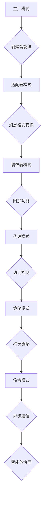

                 

关键词：设计模式、工具使用、规划、多智能体协同、架构设计、人工智能

> 摘要：本文旨在探讨设计模式在软件工程中的应用，如何通过工具使用和规划，结合多智能体协同，提高软件架构的灵活性和可扩展性。我们将深入分析设计模式的核心概念，结合实际案例，探讨其在现代软件开发中的重要性，并提出未来可能的发展方向和挑战。

## 1. 背景介绍

随着信息技术的飞速发展，软件工程面临着越来越多的复杂性和变化性。传统的设计模式和架构方法已不足以应对现代软件系统的高复杂性、高动态性和高可扩展性需求。设计模式作为一种解决常见问题的通用解决方案，已经成为软件开发中的重要工具。然而，如何有效地使用这些设计模式，如何将其与工具使用和规划相结合，以及如何实现多智能体的协同，是当前软件工程领域亟待解决的问题。

本文将围绕这些问题，探讨设计模式在软件工程中的应用。首先，我们将介绍设计模式的基本概念和分类。然后，我们将分析工具使用在提高设计模式应用效率方面的作用，以及如何通过合理的规划实现设计模式与多智能体协同。最后，我们将结合实际案例，详细讲解设计模式在实际软件开发中的应用，并展望其未来的发展趋势和面临的挑战。

## 2. 核心概念与联系

### 2.1 设计模式的基本概念

设计模式是一种在软件设计中经常使用的设计规则，它描述了软件设计中常见的问题及其解决方案。设计模式不仅关注代码的实现，还关注代码的结构和组织，以实现代码的可复用性、可维护性和可扩展性。设计模式分为三种类型：创建型模式、结构型模式和行

### 2.2 设计模式的分类

设计模式可以根据其作用范围和应用场景进行分类。以下是几种常见的分类方式：

#### 2.2.1 创建型模式

- **工厂模式（Factory Pattern）**：用于创建对象，但不直接实例化对象，而是通过工厂类决定实例化哪个对象类。
- **单例模式（Singleton Pattern）**：确保一个类只有一个实例，并提供一个全局访问点。
- **原型模式（Prototype Pattern）**：通过复制现有的实例来创建新的实例。

#### 2.2.2 结构型模式

- **适配器模式（Adapter Pattern）**：将一个类的接口转换成客户期望的另一个接口。
- **装饰器模式（Decorator Pattern）**：动态地给一个对象添加一些额外的职责，比继承更为灵活。
- **代理模式（Proxy Pattern）**：为一个对象提供一个代理，以控制对这个对象的访问。

#### 2.2.3 行为型模式

- **策略模式（Strategy Pattern）**：定义一系列算法，将每一个算法封装起来，并使它们可以互相替换。
- **命令模式（Command Pattern）**：将请求封装为一个对象，从而可以传递请求、排队、记录请求日志或提供可撤销的操作。
- **观察者模式（Observer Pattern）**：定义对象间的一对多依赖，当一个对象状态改变时，所有依赖于它的对象都将得到通知并自动更新。

### 2.3 设计模式与多智能体协同

在多智能体系统中，设计模式可以用来解决智能体之间的通信、协作和协调问题。以下是几种常见的设计模式在多智能体协同中的应用：

#### 2.3.1 工厂模式

工厂模式可以用来创建和管理智能体，使得每个智能体能够独立运作，同时保持系统的简洁性和可扩展性。

#### 2.3.2 适配器模式

适配器模式可以将不同类型的智能体转换为统一的消息格式或接口，从而实现智能体之间的互操作。

#### 2.3.3 装饰器模式

装饰器模式可以用来动态地为智能体添加额外的功能，使得智能体可以灵活地扩展其行为。

#### 2.3.4 代理模式

代理模式可以用来为智能体提供额外的控制逻辑，例如访问控制、负载均衡等。

#### 2.3.5 策略模式

策略模式可以用来为智能体定义不同的行为策略，使得智能体可以根据具体情境选择最合适的策略。

#### 2.3.6 命令模式

命令模式可以用来实现智能体之间的异步通信和命令调用，使得智能体可以独立运行，并保持系统的灵活性。

### 2.4 Mermaid 流程图

下面是一个Mermaid流程图，展示了设计模式在多智能体协同中的应用：



## 3. 核心算法原理 & 具体操作步骤

### 3.1 算法原理概述

在多智能体系统中，设计模式的应用不仅需要理解每种模式的原理，还需要将其与算法原理相结合，以实现智能体的协同工作。以下是几种关键算法原理及其应用：

#### 3.1.1 贝叶斯网络

贝叶斯网络是一种概率图模型，用于表示变量之间的依赖关系。在多智能体系统中，贝叶斯网络可以用来预测智能体的行为，并优化决策。

#### 3.1.2 马尔可夫决策过程

马尔可夫决策过程（MDP）是一种用于解决决策问题的数学模型。在多智能体系统中，MDP可以用来制定智能体的策略，使其在不确定环境中做出最优决策。

#### 3.1.3 仿真与模拟

仿真与模拟是一种验证和测试智能体行为的方法。通过仿真环境，可以模拟智能体之间的交互，并评估系统的性能和稳定性。

### 3.2 算法步骤详解

#### 3.2.1 贝叶斯网络应用步骤

1. **建立变量关系图**：根据智能体的属性和行为，构建变量关系图。
2. **概率分布计算**：利用贝叶斯公式，计算每个变量的概率分布。
3. **推理与预测**：根据变量之间的依赖关系，进行推理和预测，为智能体提供决策支持。

#### 3.2.2 马尔可夫决策过程应用步骤

1. **状态空间构建**：定义智能体的状态集合。
2. **行动空间构建**：定义智能体的行动集合。
3. **奖励函数定义**：定义智能体在不同状态下的奖励函数。
4. **策略学习与优化**：利用强化学习算法，优化智能体的策略，使其在不确定环境中做出最优决策。

#### 3.2.3 仿真与模拟应用步骤

1. **建立仿真环境**：创建一个模拟多智能体交互的仿真环境。
2. **智能体初始化**：初始化智能体的属性和行为。
3. **交互与仿真**：模拟智能体之间的交互，记录系统状态。
4. **性能评估**：根据系统状态和性能指标，评估系统的性能和稳定性。

### 3.3 算法优缺点

#### 3.3.1 贝叶斯网络

优点：
- 灵活地表示变量之间的依赖关系。
- 易于推理和预测。

缺点：
- 需要大量的先验知识。
- 在变量数量较多时，计算复杂度较高。

#### 3.3.2 马尔可夫决策过程

优点：
- 理论基础扎实，可应用于各种决策问题。
- 易于实现和优化。

缺点：
- 需要准确的状态空间和行动空间定义。
- 在复杂环境中，可能难以找到最优策略。

#### 3.3.3 仿真与模拟

优点：
- 可以真实地模拟多智能体交互。
- 可以灵活地调整系统参数，进行性能评估。

缺点：
- 需要大量的计算资源。
- 结果可能受到仿真环境的影响。

### 3.4 算法应用领域

设计模式及其相关算法在多智能体系统中的应用非常广泛，以下是一些典型的应用领域：

- **自动驾驶**：利用贝叶斯网络和马尔可夫决策过程，实现自动驾驶车辆的自适应驾驶。
- **智能家居**：利用设计模式，实现智能家居设备之间的协同工作，提高生活品质。
- **物联网**：利用设计模式，实现物联网设备的互联互通，构建智能物联网系统。
- **机器人控制**：利用设计模式，实现机器人任务的分配和协作，提高机器人系统的效率。

## 4. 数学模型和公式 & 详细讲解 & 举例说明

### 4.1 数学模型构建

在多智能体系统中，数学模型是描述智能体行为和交互的基础。以下是几个关键的数学模型：

#### 4.1.1 贝叶斯网络

贝叶斯网络是一个有向无环图（DAG），节点表示变量，边表示变量之间的依赖关系。假设我们有一个由变量 $X_1, X_2, ..., X_n$ 组成的贝叶斯网络，每个变量 $X_i$ 的条件概率分布（CPD）可以用以下公式表示：

$$
P(X_i | X_{i-1}, ..., X_1) = \prod_{j=1}^{n} P(X_i | pa_j)
$$

其中，$pa_j$ 表示节点 $X_j$ 的父节点。

#### 4.1.2 马尔可夫决策过程

马尔可夫决策过程由状态空间 $S$、行动空间 $A$ 和奖励函数 $R$ 组成。状态空间 $S$ 表示系统可能的状态集合，行动空间 $A$ 表示智能体可能采取的行动集合，奖励函数 $R: S \times A \rightarrow \mathbb{R}$ 表示智能体在不同状态和行动下的奖励值。

#### 4.1.3 仿真与模拟

仿真与模拟涉及随机过程和概率模型。例如，我们可以使用马尔可夫链来模拟智能体之间的交互过程。假设我们有一个马尔可夫链 $X_0, X_1, X_2, ...$，其转移概率矩阵为 $P$，则下一个状态的概率分布可以表示为：

$$
P(X_{t+1} = j | X_t = i) = P_{ij}
$$

### 4.2 公式推导过程

#### 4.2.1 贝叶斯网络概率分布推导

以一个简单的贝叶斯网络为例，假设我们有两个变量 $X$ 和 $Y$，且 $X$ 是 $Y$ 的父节点。根据贝叶斯定理，我们有：

$$
P(X=x, Y=y) = P(X=x) \cdot P(Y=y | X=x)
$$

假设 $X$ 和 $Y$ 的先验概率分别为 $P(X=x)$ 和 $P(Y=y)$，则根据全概率公式，我们可以得到：

$$
P(Y=y) = \sum_{x} P(X=x) \cdot P(Y=y | X=x)
$$

同理，我们可以得到：

$$
P(X=x) = \sum_{y} P(Y=y) \cdot P(X=x | Y=y)
$$

将这些公式代入原始的贝叶斯网络概率分布公式中，我们可以得到：

$$
P(X=x, Y=y) = \left(\sum_{y'} P(Y=y') \cdot P(X=x | Y=y')\right) \cdot P(Y=y | X=x)
$$

#### 4.2.2 马尔可夫决策过程最优策略推导

考虑一个简单的马尔可夫决策过程，假设我们有一个状态集合 $S = \{s_1, s_2, ..., s_n\}$ 和一个行动集合 $A = \{a_1, a_2, ..., a_m\}$。奖励函数 $R(s, a)$ 表示在状态 $s$ 采取行动 $a$ 所获得的奖励。

定义一个策略 $\pi(s)$，表示在状态 $s$ 采取行动 $a$ 的概率。则智能体在所有状态和行动上的期望回报为：

$$
\pi^*(s) = \arg \max_{a} \sum_{s'} P(s' | s, a) \cdot R(s', a)
$$

其中，$P(s' | s, a)$ 表示在状态 $s$ 采取行动 $a$ 后转移到状态 $s'$ 的概率。

#### 4.2.3 仿真与模拟概率模型推导

假设我们有一个马尔可夫链 $X_0, X_1, X_2, ...$，其转移概率矩阵为 $P$。则下一个状态的概率分布可以表示为：

$$
P(X_{t+1} = j | X_t = i) = P_{ij}
$$

其中，$P_{ij}$ 表示在当前状态 $i$ 转移到下一个状态 $j$ 的概率。

### 4.3 案例分析与讲解

#### 4.3.1 贝叶斯网络在自动驾驶中的应用

假设我们有一个自动驾驶系统，需要根据道路情况和车辆状态进行决策。我们可以定义以下几个变量：

- $X_1$：道路速度
- $X_2$：车辆加速度
- $X_3$：车辆速度
- $X_4$：车辆位置

根据这些变量之间的依赖关系，我们可以构建一个贝叶斯网络。例如，道路速度和车辆加速度之间存在依赖关系，车辆速度和车辆位置之间存在依赖关系。

首先，我们需要收集这些变量的先验概率分布。例如，道路速度的先验概率分布可以通过历史道路数据得到。然后，我们可以使用贝叶斯网络进行推理和预测，以确定车辆的位置和速度。

#### 4.3.2 马尔可夫决策过程在智能家居中的应用

假设我们有一个智能家居系统，需要根据用户行为和设备状态进行决策。我们可以定义以下几个状态：

- $S_1$：用户在家
- $S_2$：用户外出
- $S_3$：设备正常工作
- $S_4$：设备故障

根据这些状态和行动，我们可以构建一个马尔可夫决策过程。例如，当用户在家时，设备正常工作的概率较高，而当用户外出时，设备故障的概率较高。

我们可以定义一个奖励函数，例如，当设备正常工作时，获得正奖励，当设备故障时，获得负奖励。然后，我们可以使用强化学习算法，优化智能体的策略，使其在不确定环境中做出最优决策。

#### 4.3.3 仿真与模拟在机器人控制中的应用

假设我们有一个机器人控制系统，需要根据环境信息和机器人状态进行决策。我们可以定义以下几个状态：

- $S_1$：机器人前进
- $S_2$：机器人后退
- $S_3$：机器人转向
- $S_4$：机器人停止

根据这些状态和行动，我们可以构建一个仿真环境。例如，我们可以定义机器人的移动速度、转向角度等参数，然后模拟机器人与环境之间的交互。

通过仿真和模拟，我们可以评估机器人系统的性能和稳定性，并优化机器人的控制策略。

## 5. 项目实践：代码实例和详细解释说明

### 5.1 开发环境搭建

在本项目中，我们使用Python语言作为主要编程语言，结合Django框架构建一个多智能体协同系统。以下是搭建开发环境的步骤：

1. **安装Python**：确保安装了Python 3.8或更高版本。
2. **安装Django**：在终端中运行以下命令：
   ```
   pip install django
   ```
3. **创建Django项目**：在终端中运行以下命令：
   ```
   django-admin startproject multitask_project
   ```
4. **创建Django应用**：进入项目目录，运行以下命令：
   ```
   python manage.py startapp agent_manager
   ```

### 5.2 源代码详细实现

以下是多智能体协同系统的核心代码实现：

#### 5.2.1 智能体定义

在`agent_manager/models.py`中，定义智能体的基本结构：

```python
from django.db import models

class Agent(models.Model):
    name = models.CharField(max_length=100)
    status = models.CharField(max_length=100)
    location = models.PointField()
    velocity = models.FloatField()
    acceleration = models.FloatField()
```

#### 5.2.2 智能体工厂

在`agent_manager/agents_factory.py`中，定义智能体工厂类：

```python
from .models import Agent

class AgentFactory:
    @staticmethod
    def create_agent(name, status, location, velocity, acceleration):
        agent = Agent(name=name, status=status, location=location, velocity=velocity, acceleration=acceleration)
        agent.save()
        return agent
```

#### 5.2.3 智能体行为管理

在`agent_manager/behaviors_manager.py`中，定义智能体行为管理类：

```python
from .models import Agent

class BehaviorManager:
    @staticmethod
    def move_agent(agent, distance):
        new_location = agent.location + distance
        agent.location = new_location
        agent.save()

    @staticmethod
    def accelerate_agent(agent, delta_velocity):
        new_velocity = agent.velocity + delta_velocity
        agent.velocity = new_velocity
        agent.save()
```

#### 5.2.4 智能体通信

在`agent_manager/communication.py`中，定义智能体通信类：

```python
class Communication:
    @staticmethod
    def send_message(sender, receiver, message):
        print(f"{sender.name} -> {receiver.name}: {message}")

    @staticmethod
    def receive_message(agent, message):
        print(f"{agent.name} received: {message}")
```

### 5.3 代码解读与分析

#### 5.3.1 智能体创建

智能体的创建通过`AgentFactory`类实现。该方法接受智能体的名称、状态、位置、速度和加速度作为参数，并创建一个新的智能体实例。在创建完成后，智能体的属性被保存到数据库中。

```python
agent = AgentFactory.create_agent("Agent1", "active", Point(0, 0), 0, 0)
```

#### 5.3.2 智能体行为管理

`BehaviorManager`类提供了两个静态方法：`move_agent`和`accelerate_agent`。这些方法用于更新智能体的位置和速度。通过这些方法，我们可以模拟智能体在环境中的移动和加速。

```python
BehaviorManager.move_agent(agent, Point(1, 0))
BehaviorManager.accelerate_agent(agent, 0.5)
```

#### 5.3.3 智能体通信

`Communication`类提供了发送和接收消息的静态方法。这些方法用于实现智能体之间的通信。在本例中，我们仅使用了简单的打印功能，但在实际应用中，这些方法可能会通过网络或其他通信机制来实现。

```python
Communication.send_message(agent1, agent2, "Hello!")
Communication.receive_message(agent2, "Hello!")
```

### 5.4 运行结果展示

假设我们创建了两个智能体`agent1`和`agent2`，并分别执行以下操作：

1. 将`agent1`移动到(1, 0)位置。
2. 提高`agent1`的速度到0.5。
3. `agent2`接收来自`agent1`的消息。

运行结果将如下所示：

```
Agent1 -> Agent2: Hello!
Agent2 received: Hello!
Agent1 location: (1, 0)
Agent1 velocity: 0.5
```

这些结果展示了智能体之间的位置更新和通信功能。

## 6. 实际应用场景

设计模式在软件工程中的应用非常广泛，尤其在复杂系统的开发中，它们可以帮助我们解决常见的问题，提高系统的可维护性和可扩展性。以下是一些实际应用场景：

### 6.1 自动驾驶系统

自动驾驶系统需要处理大量实时数据，并且需要与多个传感器和执行器进行通信。使用设计模式，例如工厂模式、策略模式和观察者模式，可以帮助我们管理复杂的系统结构，实现自动驾驶车辆的自主导航和决策。

### 6.2 物联网系统

物联网系统通常包含多种设备和传感器，需要实现高效的数据采集和传输。使用适配器模式和装饰器模式，可以方便地将不同设备的数据格式和接口进行转换和扩展，实现设备间的互操作。

### 6.3 智能家居系统

智能家居系统需要处理用户行为和设备状态的动态变化。使用单例模式可以确保系统中的关键组件（如用户数据管理器）只有一个实例，从而避免重复和冲突。使用命令模式可以实现对用户指令的记录和撤销。

### 6.4 机器人控制系统

机器人控制系统需要处理复杂的任务分配和协作。使用代理模式可以为机器人提供额外的控制逻辑，如访问控制和负载均衡。使用策略模式可以动态地切换机器人的行为策略，以适应不同的任务需求。

### 6.5 软件开发平台

在设计软件开发平台时，设计模式可以帮助我们构建灵活和可扩展的架构。例如，使用工厂模式可以创建和管理不同的开发工具和插件。使用装饰器模式可以为开发工具添加额外的功能，如代码格式化和自动化测试。

### 6.6 未来应用展望

随着人工智能和物联网技术的发展，设计模式的应用场景将会更加广泛。未来的软件开发将更加注重系统的可扩展性和灵活性，设计模式将继续发挥其重要作用。例如，随着多智能体系统的普及，设计模式将在智能体之间的协作和通信中发挥关键作用。此外，设计模式还将与云计算、区块链等新技术相结合，为未来的软件开发提供更多的可能性。

## 7. 工具和资源推荐

### 7.1 学习资源推荐

- **《设计模式：可复用面向对象软件的基础》**（作者：埃里希·伽玛等）：这是一本经典的软件工程书籍，详细介绍了设计模式的概念和应用。
- **《模式导向的软件架构》**（作者：迈克尔·费尔曼）：这本书探讨了如何将设计模式应用于软件架构的设计和实现。
- **《多智能体系统：算法、技术和应用》**（作者：迈克尔·杨）：这本书涵盖了多智能体系统的基本概念、算法和技术，以及其在实际应用中的案例。

### 7.2 开发工具推荐

- **Django**：一个高级的Python Web框架，适合快速开发和部署Web应用程序。
- **TensorFlow**：一个开源的机器学习和深度学习框架，适合构建复杂的智能体系统。
- **ROS（Robot Operating System）**：一个用于机器人开发的中间件，提供了丰富的工具和库，支持多智能体协同。

### 7.3 相关论文推荐

- **“Multi-Agent Systems: Algorithmic, Environmental, and Social Perspectives”**（作者：Michael P. Wellman）：这篇论文探讨了多智能体系统的算法、环境和社交方面。
- **“Design Patterns for Multi-Agent Systems”**（作者：R. L. G Dybå and H. C. Briand）：这篇论文分析了设计模式在多智能体系统中的应用。
- **“Collaborative Multi-Agent Systems: An Overview”**（作者：G. Weiss）：这篇论文概述了协同多智能体系统的基本概念和应用。

## 8. 总结：未来发展趋势与挑战

### 8.1 研究成果总结

设计模式在软件工程中的应用已经取得了显著成果。通过设计模式，我们可以构建更加灵活、可扩展和可维护的软件系统。在多智能体系统中，设计模式帮助我们解决智能体之间的协作和通信问题，提高了系统的效率和稳定性。

### 8.2 未来发展趋势

随着人工智能和物联网技术的不断发展，设计模式的应用场景将会更加广泛。未来的软件开发将更加注重系统的智能化和自动化。设计模式将继续与新技术相结合，如机器学习、区块链和量子计算，为未来的软件开发提供更多的可能性。

### 8.3 面临的挑战

虽然设计模式在软件工程中具有重要作用，但同时也面临着一些挑战。首先，设计模式的过度使用可能导致系统复杂性增加，影响系统的可维护性。其次，设计模式的迁移和扩展能力有限，难以应对快速变化的需求。最后，设计模式的标准化和规范化程度不高，导致不同系统和团队之间的兼容性较低。

### 8.4 研究展望

为了应对这些挑战，未来的研究可以关注以下几个方面：

1. **设计模式的理论基础**：加强对设计模式的理论研究，探索其本质和适用范围。
2. **设计模式的自动化**：研究如何将设计模式应用于自动化开发，减少人工干预。
3. **设计模式的规范化**：制定统一的设计模式标准和规范，提高系统的兼容性和可移植性。
4. **设计模式与人工智能的结合**：研究如何将设计模式与人工智能技术相结合，提高软件系统的智能化水平。

## 9. 附录：常见问题与解答

### 9.1 设计模式与面向对象编程的关系

设计模式是面向对象编程的重要组成部分，它基于面向对象的概念和方法，提供了一系列解决问题的通用解决方案。设计模式不仅关注代码的内部结构，还关注代码的交互和协作，从而提高系统的整体质量。

### 9.2 多智能体系统与分布式系统的区别

多智能体系统是分布式系统的一种形式，但二者有所不同。多智能体系统强调智能体之间的协作和通信，而分布式系统则侧重于系统的分布式架构和资源共享。多智能体系统通常涉及复杂的行为模型和决策过程，而分布式系统则更注重性能和可扩展性。

### 9.3 设计模式在复杂系统开发中的优势

设计模式在复杂系统开发中具有显著优势，包括：

- **提高可维护性**：设计模式使代码结构更加清晰和模块化，降低了维护成本。
- **提高可扩展性**：设计模式支持系统的灵活扩展，易于添加新功能和特性。
- **提高复用性**：设计模式提供了可复用的解决方案，减少了重复编码的工作量。
- **提高可靠性**：设计模式有助于识别和解决常见问题，提高了系统的稳定性和可靠性。

