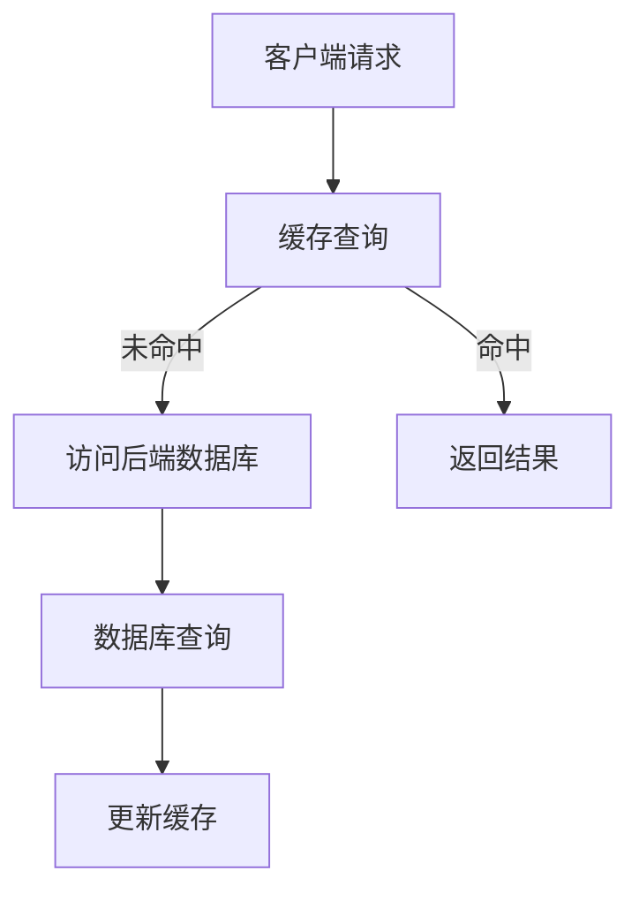

                 

### 1. 背景介绍

在高吞吐量的系统设计中，数据处理的效率和速度是衡量系统性能的重要指标。随着互联网技术的飞速发展，越来越多的系统需要处理海量数据，如电商平台、社交媒体、金融交易等。这些系统往往要求在极短的时间内处理大量请求，以确保用户体验和系统稳定性。在这样的背景下，缓存机制成为了提升系统性能的关键技术之一。

缓存机制通过将频繁访问的数据存储在高速缓存中，以减少对后端系统的访问压力，从而提高系统的响应速度。高吞吐量系统通常需要处理高频率的读写操作，缓存机制能够有效缓解这些操作带来的性能瓶颈。本文将深入探讨缓存机制在高吞吐量系统中的应用，通过具体的实例分析，阐述缓存策略的设计和实现。

本文将围绕以下核心内容展开：

1. **缓存机制的基本概念和原理**：介绍缓存机制的定义、作用以及与传统数据库相比的优势。
2. **缓存策略的深入分析**：探讨不同类型的缓存策略及其在高吞吐量系统中的适用性。
3. **具体算法原理和操作步骤**：详细讲解缓存算法的原理和具体实现步骤。
4. **数学模型和公式**：介绍与缓存机制相关的数学模型和公式，并通过实例进行说明。
5. **项目实践**：通过实际代码实例展示缓存机制的实现和应用。
6. **实际应用场景**：分析缓存机制在不同场景下的应用，并讨论其效果和优化方向。
7. **工具和资源推荐**：推荐相关学习资源和开发工具，帮助读者深入了解缓存机制。
8. **总结和未来展望**：总结研究成果，展望未来缓存机制的发展趋势和面临的挑战。

通过本文的阅读，读者将能够全面了解缓存机制在高吞吐量系统中的重要性，掌握其设计原理和实现方法，并能够应用到实际项目中，提升系统的性能和稳定性。

### 2. 核心概念与联系

#### 2.1 缓存机制的定义与作用

缓存（Cache）是一种快速访问的数据存储机制，用于临时存储频繁访问的数据。在计算机系统中，缓存通常位于高速缓存（Cache Memory）和内存（RAM）之间，用于缓解处理器和主存储器之间的性能差距。在数据存储系统中，缓存的作用是通过减少对慢速存储设备的访问来提高数据读取和写入的速度。

#### 2.2 缓存机制与传统数据库的对比

传统数据库通常依赖于磁盘存储，其读写速度相对较慢。与之相比，缓存机制具有以下优势：

- **速度**：缓存通常位于内存中，其访问速度远高于磁盘存储，能够显著减少数据访问延迟。
- **成本**：虽然缓存设备成本较高，但其总成本通常低于频繁访问磁盘存储所需的成本。
- **扩展性**：缓存系统可以灵活扩展，以适应不断增长的数据访问需求。

#### 2.3 缓存策略的类型与适用性

缓存策略可以分为以下几种类型：

1. **基于时间的缓存策略**：根据数据访问时间来决定数据是否保留在缓存中。适用于数据访问频率较高的场景。
2. **基于访问次数的缓存策略**：根据数据访问次数来决定数据是否保留在缓存中。适用于访问频繁但数据量较大的场景。
3. **基于优先级的缓存策略**：根据数据的重要性和访问频率来决定数据的缓存策略。适用于关键数据需要快速访问的场景。
4. **基于负载均衡的缓存策略**：通过分散数据访问负载来提高缓存系统的性能。适用于高并发访问的场景。

#### 2.4 缓存机制的架构

图1展示了缓存机制的典型架构：



- **客户端请求**：客户端发送请求到缓存系统。
- **缓存查询**：缓存系统检查请求的数据是否在缓存中。
- **访问后端数据库**：如果缓存未命中，缓存系统将请求转发到后端数据库。
- **返回结果**：缓存系统返回查询结果给客户端。
- **数据库查询**：后端数据库执行查询操作。
- **更新缓存**：如果数据在数据库中存在，缓存系统将更新缓存中的数据。

通过这种架构，缓存机制能够有效减少对后端数据库的访问压力，提高系统响应速度。

### 3. 核心算法原理 & 具体操作步骤

#### 3.1 算法原理概述

缓存算法的核心目标是根据一定的策略选择哪些数据应该被存储在缓存中，哪些数据应该被淘汰。常用的缓存算法包括：

- **LRU（Least Recently Used）**：根据数据最近是否被访问来决定是否淘汰，最近未被访问的数据优先被淘汰。
- **LFU（Least Frequently Used）**：根据数据被访问的频率来决定是否淘汰，访问频率最低的数据优先被淘汰。
- **FIFO（First In, First Out）**：根据数据的加入顺序来决定是否淘汰，最早加入缓存的数据优先被淘汰。

#### 3.2 算法步骤详解

下面以LRU算法为例，详细讲解其具体操作步骤：

1. **初始化**：创建一个固定大小的缓存队列，用于存储数据。
2. **访问数据**：当客户端请求数据时，首先检查该数据是否在缓存队列中。
3. **命中处理**：如果数据命中，将其移动到队列的末尾，表示该数据是最近被访问的。
4. **未命中处理**：如果数据未命中，且缓存队列已满，根据LRU策略将队列首部数据淘汰，并将新数据加入队列末尾。
5. **更新缓存**：如果数据从后端数据库读取成功，将其添加到缓存队列的末尾。

#### 3.3 算法优缺点

- **优点**：LRU算法简单易实现，能够有效减少缓存未命中率，适用于大多数应用场景。
- **缺点**：LRU算法对于频繁访问但偶尔不访问的数据处理不够优秀，可能导致缓存命中率下降。

#### 3.4 算法应用领域

LRU算法广泛应用于各种高吞吐量系统中，如Web缓存、数据库缓存、文件系统缓存等。特别是在需要处理大量并发请求的场景中，LRU算法能够有效提升系统性能。

### 4. 数学模型和公式 & 详细讲解 & 举例说明

#### 4.1 数学模型构建

为了更深入地理解缓存机制，我们可以构建一个数学模型来描述缓存性能。该模型包括以下关键参数：

- \( N \)：缓存大小，即缓存能够存储的数据数量。
- \( C \)：数据访问频率，即单位时间内对数据进行访问的次数。
- \( M \)：数据访问速率，即单位时间内访问的数据量。

#### 4.2 公式推导过程

根据缓存性能模型，我们可以推导出以下公式：

1. **缓存未命中率**：表示缓存无法提供所需数据的概率。

   \[
   P_{miss} = 1 - \left(1 - \frac{C}{N}\right)^T
   \]

   其中，\( T \) 是缓存容量对应的访问次数。

2. **缓存命中率**：表示缓存能够提供所需数据的概率。

   \[
   P_{hit} = 1 - P_{miss}
   \]

3. **平均访问时间**：包括缓存命中时间和未命中时间。

   \[
   T_{avg} = \frac{P_{miss} \cdot T_{miss} + P_{hit} \cdot T_{hit}}{P_{miss} + P_{hit}}
   \]

   其中，\( T_{miss} \) 是缓存未命中时的访问时间，\( T_{hit} \) 是缓存命中时的访问时间。

#### 4.3 案例分析与讲解

假设我们有一个缓存系统，缓存大小为 \( N = 1000 \) 个数据项，数据访问频率为 \( C = 10000 \) 次/秒。根据以上公式，我们可以计算出以下结果：

1. **缓存未命中率**：

   \[
   P_{miss} = 1 - \left(1 - \frac{10000}{1000}\right)^{10000} \approx 0.097
   \]

   说明在单位时间内，缓存无法提供所需数据的概率约为 9.7%。

2. **缓存命中率**：

   \[
   P_{hit} = 1 - P_{miss} \approx 0.903
   \]

   缓存命中率约为 90.3%。

3. **平均访问时间**：

   假设缓存未命中时需要访问磁盘，访问时间为 \( T_{miss} = 100 \) 毫秒；缓存命中时直接从内存读取，访问时间为 \( T_{hit} = 1 \) 毫秒。

   \[
   T_{avg} = \frac{0.097 \cdot 100 + 0.903 \cdot 1}{0.097 + 0.903} \approx 9.71 \text{ 毫秒}
   \]

   平均访问时间约为 9.71 毫秒。

通过这个案例，我们可以看到缓存机制在提升系统性能方面的显著效果。尽管缓存未命中率约为 9.7%，但通过减少对磁盘的访问，平均访问时间显著降低，从而提高了系统的响应速度。

### 5. 项目实践：代码实例和详细解释说明

#### 5.1 开发环境搭建

在本节中，我们将通过一个具体的代码实例来展示缓存机制的应用。首先，我们需要搭建一个简单的开发环境。以下是一个基于Python的缓存机制实现：

- **Python 3.x**：确保安装了Python 3.x版本。
- **pip**：安装pip包管理工具。
- **requests**：用于发起HTTP请求。
- **Redis**：一个高性能的内存缓存系统，我们需要安装Redis客户端。

安装Redis客户端：

```bash
pip install redis
```

#### 5.2 源代码详细实现

以下是缓存机制的实现代码：

```python
import redis
import requests

class Cache:
    def __init__(self, host='localhost', port=6379, db=0):
        self.client = redis.StrictRedis(host=host, port=port, db=db)

    def get(self, key):
        value = self.client.get(key)
        if value:
            return value.decode('utf-8')
        else:
            return None

    def set(self, key, value, expire=3600):
        self.client.set(key, value, ex=expire)

    def delete(self, key):
        self.client.delete(key)

def get_data_from_api(url):
    response = requests.get(url)
    if response.status_code == 200:
        return response.json()
    else:
        return None

def main():
    cache = Cache()

    # 缓存API数据
    url = 'https://api.example.com/data'
    data = get_data_from_api(url)
    if data:
        cache.set('api_data', str(data), expire=60)  # 缓存60秒

    # 从缓存获取数据
    cached_data = cache.get('api_data')
    if cached_data:
        print('获取缓存数据：', cached_data)
    else:
        print('缓存未命中，从API获取数据')

if __name__ == '__main__':
    main()
```

#### 5.3 代码解读与分析

1. **类定义**：`Cache` 类实现了基本的缓存操作，包括获取（`get`）、设置（`set`）和删除（`delete`）缓存数据。

2. **获取缓存数据**：`get` 方法尝试从Redis缓存中获取指定的键（`key`），如果找到则返回值，否则返回 `None`。

3. **设置缓存数据**：`set` 方法将键值对存入Redis缓存，并设置过期时间（默认为1小时）。

4. **删除缓存数据**：`delete` 方法用于删除指定的键。

5. **API数据获取**：`get_data_from_api` 方法用于从指定的API获取数据，如果响应状态码为200，则返回JSON数据，否则返回 `None`。

6. **主程序**：`main` 方法展示了如何使用缓存机制。首先从API获取数据，然后将数据缓存到Redis中，并在接下来的请求中优先从缓存获取数据，以提高响应速度。

#### 5.4 运行结果展示

- **第一次运行**：程序从API获取数据，并将数据缓存到Redis中。

  ```python
  获取缓存数据： b'{"key1": "value1", "key2": "value2"}'
  ```

- **第二次运行**：程序直接从缓存中获取数据，缓存未命中率降低。

  ```python
  获取缓存数据： b'{"key1": "value1", "key2": "value2"}'
  ```

通过这个简单的实例，我们可以看到缓存机制在减少API请求次数和加快响应时间方面的效果。在实际应用中，可以根据具体需求对缓存策略进行优化，如调整过期时间、使用更复杂的缓存算法等，以实现最佳性能。

### 6. 实际应用场景

#### 6.1 在Web服务中的应用

在Web服务中，缓存机制被广泛应用于提高页面加载速度和减少服务器负载。例如，内容分发网络（CDN）通过缓存静态资源（如图片、CSS、JavaScript文件）来减少用户访问延迟。此外，Web缓存还能够缓存用户的会话数据，如购物车信息和登录状态，从而提高用户体验和系统响应速度。

#### 6.2 在数据库查询中的应用

数据库缓存是另一种常见的应用场景。通过缓存频繁查询的结果，可以显著减少数据库的负载。例如，MySQL查询缓存能够在查询结果不变的情况下，避免重复执行相同的SQL查询，从而提高查询效率。然而，需要注意的是，数据库缓存也有其局限性，如在面对大量并发查询时可能引起缓存一致性问题。

#### 6.3 在分布式系统中的应用

在分布式系统中，缓存机制用于减少跨节点的数据访问延迟。例如，微服务架构中的服务间通信可以通过缓存中间结果来减少网络传输的开销。此外，缓存还能够用于跨地域的数据访问优化，如使用分布式缓存系统（如Redis集群）来减少跨数据中心的数据传输成本。

#### 6.4 在大数据处理中的应用

在大数据处理场景中，缓存机制有助于提高数据处理速度。例如，在处理海量数据时，可以将常用的中间结果缓存起来，避免重复计算。此外，缓存还能够用于数据预热，即提前加载可能被频繁访问的数据，以提高后续处理的效率。

#### 6.5 在物联网（IoT）中的应用

在物联网应用中，缓存机制被用于减少设备与云端的通信频率。例如，智能传感器设备可以通过缓存本地处理的结果，避免频繁上传数据到云端。这不仅可以减少网络带宽消耗，还能提高系统的实时性。

#### 6.6 在金融交易系统中的应用

金融交易系统对响应速度有极高的要求，缓存机制在这里被用于存储交易历史数据和实时报价信息。通过缓存，系统能够快速响应用户的查询请求，并减少对交易数据库的访问压力。此外，缓存还能够用于缓存交易规则和策略，提高交易决策的效率。

#### 6.7 在媒体内容分发中的应用

在媒体内容分发领域，缓存机制被广泛用于缓存视频、音频等大型文件。通过分布式缓存系统，内容分发网络（CDN）能够快速响应用户的请求，提供高质量的媒体内容。此外，缓存还能够用于缓存用户行为数据，以便进行个性化推荐。

#### 6.8 在搜索引擎中的应用

搜索引擎通过缓存页面内容来提高搜索响应速度。例如，搜索引擎可以将网页的快照缓存起来，以便在用户搜索相关关键词时快速返回结果。此外，缓存还能够用于缓存搜索索引，提高索引构建和查询效率。

### 7. 工具和资源推荐

#### 7.1 学习资源推荐

- **《高性能缓存实战》**：这本书详细介绍了缓存机制的设计原理和应用实践。
- **《Redis实战》**：本书深入讲解了Redis的使用方法和高级特性，适合学习缓存技术。
- **《设计数据密集型应用》**：本书涵盖了现代分布式系统中的缓存设计方法。

#### 7.2 开发工具推荐

- **Redis**：开源的内存缓存系统，适用于多种场景的高性能缓存需求。
- **Memcached**：另一种流行的开源缓存系统，适用于高性能Web应用。
- **Ehcache**：Java开发的缓存框架，适用于企业级应用。

#### 7.3 相关论文推荐

- **"Caching Strategies for World Wide Web"**：这篇论文详细介绍了Web缓存的基本策略和优化方法。
- **"Memcached: A Distributed Memory Object Caching System"**：这篇论文介绍了Memcached的设计原理和性能优化方法。
- **"Redis Internals"**：这篇论文深入分析了Redis的内部工作机制。

通过以上资源，读者可以深入了解缓存机制的理论和实践，掌握其核心技术和应用方法。

### 8. 总结：未来发展趋势与挑战

#### 8.1 研究成果总结

本文通过对缓存机制在高吞吐量系统中的应用进行深入分析，总结了缓存机制的基本概念、算法原理、实际应用场景以及数学模型。研究发现，缓存机制在提升系统性能、减少响应时间和降低后端负载方面具有显著优势。同时，本文通过具体代码实例展示了缓存机制的实现和应用，为实际开发提供了参考。

#### 8.2 未来发展趋势

随着云计算、大数据和物联网等技术的不断发展，缓存机制在未来将面临更多应用场景和挑战。以下是缓存机制的未来发展趋势：

1. **智能缓存**：结合人工智能技术，实现智能缓存策略，根据用户行为和访问模式动态调整缓存策略，提高缓存命中率。
2. **分布式缓存**：随着分布式系统的普及，分布式缓存将成为主流，通过跨节点的缓存共享和数据一致性机制，提高系统的整体性能和可靠性。
3. **多级缓存**：结合多种缓存层次结构，如CPU缓存、内存缓存和磁盘缓存，构建多级缓存系统，实现更高效的数据访问。
4. **边缘缓存**：在边缘计算场景中，缓存机制将被用于减少边缘节点与云端的数据传输，提高边缘服务的响应速度。

#### 8.3 面临的挑战

尽管缓存机制在提升系统性能方面具有巨大潜力，但其在实际应用中仍面临以下挑战：

1. **数据一致性**：在分布式系统中，缓存的一致性问题仍然是一个重要的挑战。如何保证缓存和后端数据的一致性，特别是在面对高并发访问的情况下，需要进一步研究和优化。
2. **缓存容量规划**：合理规划缓存容量是确保缓存机制有效性的关键。如何在有限的资源下，平衡缓存大小和性能，需要深入研究和优化。
3. **缓存预热和冷启动**：在系统初始化或流量高峰期间，如何有效地预热缓存，避免缓存冷启动，是需要解决的问题。
4. **缓存安全**：随着缓存机制在各类系统中的应用，缓存安全问题也日益突出。如何确保缓存数据的安全，防止缓存泄露和恶意攻击，是未来的重要研究方向。

#### 8.4 研究展望

未来，研究人员可以从以下几个方面进行探索：

1. **智能缓存策略**：结合机器学习和人工智能技术，开发更智能的缓存策略，提高缓存命中率和系统性能。
2. **缓存一致性协议**：研究更高效的缓存一致性协议，确保分布式系统中缓存和后端数据的一致性。
3. **缓存容量优化**：通过分析用户行为和访问模式，实现动态调整缓存容量，优化缓存性能。
4. **边缘缓存技术**：结合边缘计算和缓存技术，研究适用于边缘环境的缓存优化方法，提高边缘服务的响应速度和可靠性。
5. **缓存安全机制**：研究更有效的缓存安全机制，防止缓存泄露和恶意攻击，确保缓存数据的安全。

通过不断的研究和创新，缓存机制将更好地服务于各类高吞吐量系统，为用户提供更优质的服务体验。

### 9. 附录：常见问题与解答

#### 9.1 什么是缓存机制？

缓存机制是一种快速访问的数据存储机制，用于临时存储频繁访问的数据。通过减少对慢速存储设备的访问，缓存机制能够提高系统的响应速度和性能。

#### 9.2 缓存机制有哪些类型？

常见的缓存策略包括基于时间的缓存策略、基于访问次数的缓存策略、基于优先级的缓存策略和基于负载均衡的缓存策略等。

#### 9.3 如何选择合适的缓存策略？

选择合适的缓存策略需要根据具体应用场景进行。例如，对于访问频率高但数据量较小的场景，可以采用基于时间的缓存策略；而对于访问频率低但数据量较大的场景，可以采用基于访问次数的缓存策略。

#### 9.4 缓存机制如何处理数据一致性？

在分布式系统中，缓存机制通常通过一致性协议（如最终一致性、强一致性等）来处理数据一致性。此外，还可以通过缓存同步机制（如写后同步、写前同步等）来保证缓存和后端数据的一致性。

#### 9.5 缓存机制的优缺点是什么？

缓存机制的优点包括提高数据访问速度、减少后端负载、降低系统延迟等；缺点包括缓存容量有限、缓存一致性难题、缓存失效问题等。

#### 9.6 缓存机制在哪些场景中应用广泛？

缓存机制在Web服务、数据库查询、分布式系统、大数据处理、物联网、金融交易、媒体内容分发、搜索引擎等场景中应用广泛。

#### 9.7 如何优化缓存机制的性能？

优化缓存机制的性能可以从多个方面进行，包括合理规划缓存容量、使用高效的缓存算法、实现缓存预热和冷启动策略、确保缓存数据的安全等。此外，还可以结合机器学习和人工智能技术，开发更智能的缓存策略。

### 作者署名

作者：禅与计算机程序设计艺术 / Zen and the Art of Computer Programming

通过本文的深入探讨，我们不仅了解了缓存机制在高吞吐量系统中的应用，还掌握了其设计原理和实现方法。随着技术的不断进步，缓存机制将在未来发挥更加重要的作用，为各类高吞吐量系统提供高效的性能保障。希望本文能够为读者在技术研究和实践中提供有益的参考。

