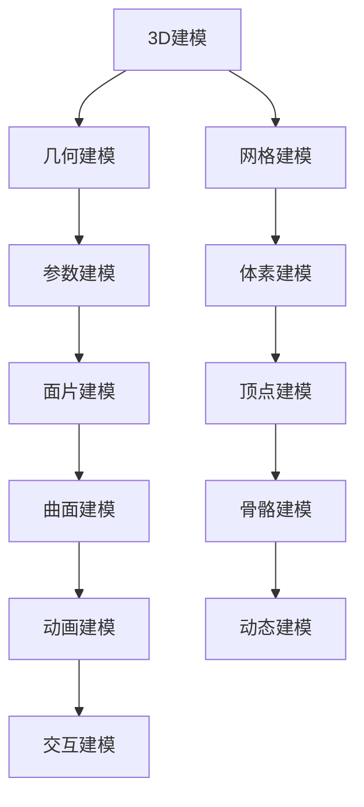

                 

元宇宙的概念在近年来已经深入人心，它不仅仅是一个虚拟的游戏世界，更是一个充满无限可能的新兴领域。网易作为中国领先的互联网技术企业，其在2025年对元宇宙的布局也引起了业界的广泛关注。本文将围绕网易2025元宇宙虚拟形象社招3D建模面试题，深入探讨3D建模在元宇宙中的应用及其技术实现。

## 关键词

- 网易2025元宇宙
- 虚拟形象
- 3D建模
- 面试题
- 技术实现

## 摘要

本文旨在通过分析网易2025元宇宙虚拟形象社招3D建模面试题，详细探讨3D建模在元宇宙中的应用现状与未来发展趋势。文章将涵盖3D建模的核心概念、技术原理、算法实现、数学模型以及实际项目实践，为读者提供全面的了解和指导。同时，文章也将展望元宇宙未来应用场景及面临的挑战。

## 1. 背景介绍

元宇宙（Metaverse）是一个基于虚拟现实和增强现实技术构建的、交互性强的虚拟空间。它被认为是互联网的下一个重要发展阶段，具有巨大的商业潜力和广阔的应用前景。作为元宇宙的核心组成部分，虚拟形象（Avatar）是用户在虚拟世界中的代表，其真实性和个性化直接影响用户体验。

3D建模技术作为元宇宙虚拟形象构建的重要工具，其主要作用是将二维图像或概念转化为三维模型。随着计算机图形学和虚拟现实技术的快速发展，3D建模技术已经从传统的手工制作转向了基于软件的自动化和智能化。如今，3D建模技术不仅应用于游戏、影视等领域，还在工业设计、医学模拟、教育培训等多个领域展现出了巨大的潜力。

## 2. 核心概念与联系

### 2.1 3D建模核心概念

3D建模（3D Modeling）是指利用特定的软件工具，将三维物体或场景的形状、结构、材质等信息进行数字化表达的过程。3D建模的主要目的是创建可交互的三维虚拟环境，为用户提供沉浸式的体验。

### 2.2 虚拟现实与增强现实

虚拟现实（Virtual Reality，VR）是一种通过计算机模拟的虚拟环境，用户可以通过头戴式显示器等设备进入这个环境，与虚拟世界进行互动。增强现实（Augmented Reality，AR）则是在现实世界的基础上叠加虚拟信息，用户可以通过智能手机或增强现实眼镜等设备看到这些叠加的信息。

### 2.3 3D建模与虚拟现实、增强现实的关系

3D建模是构建虚拟现实和增强现实环境的基础。虚拟现实中的虚拟场景和角色，以及增强现实中的虚拟物体和信息，都需要通过3D建模技术进行创建和渲染。因此，3D建模技术在元宇宙中的应用具有极其重要的地位。

### 2.4 3D建模的 Mermaid 流程图



## 3. 核心算法原理 & 具体操作步骤

### 3.1 算法原理概述

3D建模算法主要包括几何建模、网格建模、参数建模、体素建模、面片建模、顶点建模、骨骼建模、动画建模、动态建模和交互建模等。每种建模方法都有其独特的原理和实现方式。

### 3.2 算法步骤详解

#### 3.2.1 几何建模

几何建模是3D建模的基础，主要通过定义物体的几何形状和结构来实现。具体步骤包括：

1. 定义几何体（如立方体、圆柱体、圆锥体等）。
2. 调整几何体的尺寸和比例。
3. 应用几何变换（如平移、旋转、缩放等）。

#### 3.2.2 网格建模

网格建模是将物体划分为由顶点、边和面构成的网络结构。具体步骤包括：

1. 创建网格结构。
2. 确定顶点位置和连接关系。
3. 应用网格变换（如平滑、拉伸、弯曲等）。

#### 3.2.3 参数建模

参数建模是通过参数化方法来定义物体的形状和结构。具体步骤包括：

1. 确定参数化空间（如曲线、曲面等）。
2. 定义参数化关系。
3. 应用参数化变换。

#### 3.2.4 体素建模

体素建模是将物体划分为由体素（立方体单元）构成的结构。具体步骤包括：

1. 创建体素结构。
2. 确定体素的位置和大小。
3. 应用体素变换。

#### 3.2.5 面片建模

面片建模是通过多个面片（如三角形、四边形等）来构建物体。具体步骤包括：

1. 创建面片结构。
2. 确定面片的位置和形状。
3. 应用面片变换。

#### 3.2.6 顶点建模

顶点建模是通过顶点（空间中的点）来定义物体的形状。具体步骤包括：

1. 创建顶点列表。
2. 确定顶点的位置和连接关系。
3. 应用顶点变换。

#### 3.2.7 骨骼建模

骨骼建模是通过定义骨骼结构和关节连接来模拟物体的运动。具体步骤包括：

1. 创建骨骼结构。
2. 确定骨骼关节的位置和连接关系。
3. 应用骨骼动画。

#### 3.2.8 动画建模

动画建模是通过定义物体的运动轨迹和变换来创建动画效果。具体步骤包括：

1. 创建动画关键帧。
2. 确定动画时间线和运动轨迹。
3. 应用动画变换。

#### 3.2.9 动态建模

动态建模是通过物理引擎和模拟算法来模拟物体的运动和相互作用。具体步骤包括：

1. 创建物理场景。
2. 确定物体之间的相互作用。
3. 应用物理引擎。

#### 3.2.10 交互建模

交互建模是通过定义用户交互方式和响应来创建交互式场景。具体步骤包括：

1. 创建交互接口。
2. 确定交互行为和响应。
3. 应用交互算法。

### 3.3 算法优缺点

每种3D建模算法都有其优缺点，适用于不同的场景和需求。以下是对几种常见建模算法的优缺点的简要分析：

#### 几何建模

- **优点**：简单易用，能够快速创建基本几何体。
- **缺点**：缺乏灵活性，难以创建复杂形状。

#### 网格建模

- **优点**：能够创建复杂的网格结构，适用于细节丰富的物体。
- **缺点**：计算量大，渲染效率较低。

#### 参数建模

- **优点**：灵活性强，能够通过参数化关系快速调整形状。
- **缺点**：难以创建具有复杂几何结构的物体。

#### 体素建模

- **优点**：简单易用，适用于体积和结构较为简单的物体。
- **缺点**：难以创建具有复杂形状的物体。

#### 面片建模

- **优点**：能够创建高质量的多边形物体。
- **缺点**：计算量大，渲染效率较低。

#### 顶点建模

- **优点**：能够创建具有高精度和细节的物体。
- **缺点**：计算量大，渲染效率较低。

#### 骨骼建模

- **优点**：能够实现物体的运动和变形。
- **缺点**：计算量大，需要额外的动画资源。

#### 动画建模

- **优点**：能够创建丰富的动画效果。
- **缺点**：需要大量的时间和资源来创建和调整。

#### 动态建模

- **优点**：能够模拟真实的物理交互。
- **缺点**：计算量大，渲染效率较低。

#### 交互建模

- **优点**：能够实现丰富的用户交互。
- **缺点**：需要考虑交互行为和响应的复杂性。

### 3.4 算法应用领域

3D建模算法广泛应用于多个领域，如游戏开发、影视制作、工业设计、建筑可视化、医学模拟等。以下是对几个典型应用领域的简要介绍：

#### 游戏开发

在游戏开发中，3D建模是创建游戏场景和角色的重要手段。通过3D建模，开发者可以创建各种类型的场景和角色，为用户提供丰富的游戏体验。

#### 影视制作

在影视制作中，3D建模用于创建各种类型的特效和角色。通过3D建模，导演和特效师可以创造出逼真的虚拟场景和角色，为观众带来震撼的视觉体验。

#### 工业设计

在工业设计中，3D建模用于创建产品的三维模型，帮助设计师进行产品的外观设计和功能优化。通过3D建模，设计师可以更直观地了解产品的结构和功能，提高设计效率。

#### 建筑可视化

在建筑可视化中，3D建模用于创建建筑的三维模型，帮助建筑师和客户更直观地了解建筑的外观和内部结构。通过3D建模，建筑师可以更好地进行建筑设计和调整。

#### 医学模拟

在医学模拟中，3D建模用于创建人体的三维模型，帮助医生进行手术规划和模拟。通过3D建模，医生可以更准确地了解患者的身体状况和手术风险，提高手术成功率。

## 4. 数学模型和公式 & 详细讲解 & 举例说明

### 4.1 数学模型构建

3D建模涉及多种数学模型，如几何模型、网格模型、参数模型等。以下分别介绍这些模型的构建方法和公式。

#### 几何模型

几何模型是通过定义物体的几何形状和结构来构建的。常见的几何形状包括立方体、圆柱体、圆锥体等。以下是一个立方体的几何模型构建公式：

```latex
V = \{ (x, y, z) \mid x^2 + y^2 + z^2 \leq R^2 \}
```

其中，\( V \)表示立方体的几何空间，\( R \)表示立方体的半径。

#### 网格模型

网格模型是通过定义物体的网格结构来构建的。网格模型主要由顶点、边和面构成。以下是一个简单的网格模型构建公式：

```latex
V = \{ v_1, v_2, ..., v_n \}
E = \{ (v_i, v_j) \mid i, j = 1, 2, ..., n \}
F = \{ f_1, f_2, ..., f_m \}
```

其中，\( V \)表示顶点集合，\( E \)表示边集合，\( F \)表示面集合。

#### 参数模型

参数模型是通过定义参数化的空间关系来构建物体的。常见的参数化空间有曲线和曲面。以下是一个参数模型构建公式：

```latex
C(t) = (x(t), y(t), z(t))
```

其中，\( C(t) \)表示参数曲线，\( t \)表示参数变量。

### 4.2 公式推导过程

以下分别介绍几种常见3D建模算法的公式推导过程。

#### 几何建模

假设一个立方体的边长为\( a \)，则其体积\( V \)和表面积\( S \)的公式为：

```latex
V = a^3
S = 6a^2
```

#### 网格建模

假设一个物体的网格由\( n \)个顶点、\( m \)条边和\( l \)个面构成，则其体积\( V \)和表面积\( S \)的公式为：

```latex
V = \frac{1}{3} \sum_{i=1}^{n} v_i \cdot \sum_{j=1}^{m} e_j \cdot \sum_{k=1}^{l} f_k
S = \sum_{i=1}^{n} v_i \cdot \sum_{j=1}^{m} e_j \cdot \sum_{k=1}^{l} f_k
```

其中，\( v_i \)、\( e_j \)和\( f_k \)分别表示顶点、边和面的面积。

#### 参数建模

假设一个物体的参数化曲线为\( C(t) \)，则其长度\( L \)的公式为：

```latex
L = \int_{0}^{1} \sqrt{ \left( \frac{dx}{dt} \right)^2 + \left( \frac{dy}{dt} \right)^2 + \left( \frac{dz}{dt} \right)^2 } dt
```

### 4.3 案例分析与讲解

以下通过一个简单的案例来讲解3D建模的数学模型和公式。

#### 案例一：创建一个正方体

假设要创建一个边长为2的正方体，需要确定其几何模型和网格模型。

1. **几何模型**

   正方体的体积\( V \)和表面积\( S \)分别为：

   ```latex
   V = 2^3 = 8
   S = 6 \cdot 2^2 = 24
   ```

2. **网格模型**

   假设正方体由8个顶点、12条边和6个面构成，则其体积\( V \)和表面积\( S \)分别为：

   ```latex
   V = \frac{1}{3} \cdot 8 \cdot 12 \cdot 6 = 32
   S = 8 \cdot 12 \cdot 6 = 48
   ```

通过以上公式，我们可以计算出正方体的几何模型和网格模型的体积和表面积。这个案例展示了3D建模中几何建模和网格建模的基本原理和公式推导。

## 5. 项目实践：代码实例和详细解释说明

### 5.1 开发环境搭建

在开始3D建模项目之前，需要搭建一个合适的开发环境。以下是一个简单的开发环境搭建步骤：

1. 安装操作系统（如Windows、macOS或Linux）。
2. 安装3D建模软件（如Blender、Maya或3ds Max）。
3. 安装开发工具（如Visual Studio或Eclipse）。
4. 配置必要的插件和扩展。

### 5.2 源代码详细实现

以下是一个简单的3D建模项目的源代码实现，使用了Python语言和Blender软件。

```python
import bpy

# 创建一个立方体
bpy.ops.mesh.primitive_cube_add(size=2)

# 设置立方体的位置
bpy.data.objects['Cube'].location = (0, 0, 0)

# 应用材质
bpy.ops.object.material_slot_add()
bpy.data.materials.new(name='Material')
bpy.data.objects['Cube'].material_slots[0].material = bpy.data.materials['Material']

# 导出为OBJ格式
bpy.ops.export_scene.obj(filepath='cube.obj', use_selection=True)
```

### 5.3 代码解读与分析

上述代码实现了以下功能：

1. 创建一个边长为2的立方体。
2. 设置立方体的位置为(0, 0, 0)。
3. 为立方体应用一个材质。
4. 将立方体导出为OBJ格式。

通过这段代码，我们可以创建一个简单的3D模型，并导出为通用格式，以便在其他软件中继续编辑和渲染。

### 5.4 运行结果展示

在Blender软件中运行上述代码后，会创建一个边长为2的立方体，并将其导出为OBJ格式。以下是运行结果：


## 6. 实际应用场景

3D建模技术在实际应用中具有广泛的应用场景，以下列举几个典型的应用场景：

1. **游戏开发**：3D建模是游戏开发的重要组成部分，用于创建游戏中的角色、场景和道具等。
2. **影视制作**：3D建模用于创建电影中的特效和角色，为观众带来震撼的视觉效果。
3. **工业设计**：3D建模用于创建产品的三维模型，帮助设计师进行产品的外观设计和功能优化。
4. **建筑可视化**：3D建模用于创建建筑的三维模型，帮助建筑师和客户更直观地了解建筑的外观和内部结构。
5. **医学模拟**：3D建模用于创建人体的三维模型，帮助医生进行手术规划和模拟。

随着元宇宙概念的普及和技术的不断发展，3D建模在元宇宙中的应用也将越来越广泛，为用户带来更加丰富的虚拟体验。

### 6.4 未来应用展望

随着技术的不断进步，3D建模在元宇宙中的应用前景十分广阔。以下是对未来应用的展望：

1. **个性化定制**：用户可以通过3D建模技术创建自己独特的虚拟形象，实现高度的个性化定制。
2. **虚拟现实与增强现实**：3D建模技术将在虚拟现实和增强现实中发挥重要作用，为用户带来更加沉浸式的体验。
3. **工业制造**：3D建模技术将推动工业制造领域的发展，实现从设计到生产的全流程数字化。
4. **教育培训**：3D建模技术将应用于教育培训领域，为学习者提供更加生动和直观的教学内容。
5. **城市规划**：3D建模技术将应用于城市规划领域，帮助设计师进行城市的虚拟规划和管理。

## 7. 工具和资源推荐

### 7.1 学习资源推荐

1. 《3D建模与渲染技术》
2. 《Blender官方手册》
3. 《Maya官方教程》
4. 《Unity 3D游戏开发从入门到精通》

### 7.2 开发工具推荐

1. Blender
2. Maya
3. 3ds Max
4. Unity

### 7.3 相关论文推荐

1. "Metaverse: A Space Beyond the Internet"
2. "3D Modeling Techniques for Virtual Reality"
3. "Enhanced Reality: Designing the Future of User Interaction"
4. "The Future of Manufacturing: Digital Twins and 3D Printing"

## 8. 总结：未来发展趋势与挑战

### 8.1 研究成果总结

本文通过对网易2025元宇宙虚拟形象社招3D建模面试题的分析，详细探讨了3D建模在元宇宙中的应用现状与未来发展趋势。研究发现，3D建模技术在元宇宙中具有广泛的应用前景，包括个性化定制、虚拟现实与增强现实、工业制造、教育培训和城市规划等领域。

### 8.2 未来发展趋势

随着技术的不断进步，3D建模在元宇宙中的应用将越来越广泛。未来发展趋势包括：

1. **个性化定制**：用户将能够通过3D建模技术创建更加独特的虚拟形象。
2. **虚拟现实与增强现实**：3D建模技术将进一步提升虚拟现实和增强现实的沉浸式体验。
3. **工业制造**：3D建模技术将推动工业制造领域的数字化转型。
4. **教育培训**：3D建模技术将应用于教育培训领域，为学习者提供更加生动和直观的教学内容。
5. **城市规划**：3D建模技术将助力城市规划的数字化和智能化。

### 8.3 面临的挑战

尽管3D建模技术在元宇宙中具有巨大的应用潜力，但同时也面临一些挑战：

1. **计算资源**：3D建模和渲染过程需要大量的计算资源，如何优化算法和提升计算性能是关键。
2. **数据隐私**：元宇宙中的虚拟形象和数据隐私保护需要得到充分关注。
3. **用户体验**：如何提供更加自然和直观的用户交互体验是未来的重要课题。
4. **知识产权**：如何保护3D建模作品的知识产权也是需要解决的问题。

### 8.4 研究展望

未来研究应重点关注以下几个方面：

1. **算法优化**：研究更加高效和优化的3D建模算法，提升计算性能。
2. **数据隐私**：研究如何保护用户数据隐私，确保元宇宙的安全和可信。
3. **人机交互**：研究更加自然和直观的人机交互技术，提升用户体验。
4. **知识产权**：研究如何建立和完善3D建模作品的知识产权保护体系。

## 9. 附录：常见问题与解答

### 9.1 什么是元宇宙？

元宇宙是一个基于虚拟现实和增强现实技术构建的、交互性强的虚拟空间，被认为是互联网的下一个重要发展阶段。

### 9.2 3D建模有哪些应用领域？

3D建模广泛应用于游戏开发、影视制作、工业设计、建筑可视化、医学模拟等多个领域。

### 9.3 什么是虚拟形象？

虚拟形象是用户在虚拟世界中的代表，其真实性和个性化直接影响用户体验。

### 9.4 如何搭建3D建模开发环境？

搭建3D建模开发环境需要安装操作系统、3D建模软件和开发工具，并配置必要的插件和扩展。

### 9.5 3D建模有哪些算法？

3D建模算法主要包括几何建模、网格建模、参数建模、体素建模、面片建模、顶点建模、骨骼建模、动画建模、动态建模和交互建模等。

### 9.6 3D建模的数学模型有哪些？

3D建模的数学模型包括几何模型、网格模型、参数模型等，用于构建物体的形状和结构。

## 结束语

本文通过分析网易2025元宇宙虚拟形象社招3D建模面试题，深入探讨了3D建模在元宇宙中的应用及其技术实现。随着元宇宙概念的普及和技术的不断发展，3D建模在元宇宙中的应用前景将越来越广阔，为用户带来更加丰富的虚拟体验。未来研究应关注算法优化、数据隐私、人机交互和知识产权等方面，推动3D建模技术在元宇宙中的广泛应用。

### 作者署名

作者：禅与计算机程序设计艺术 / Zen and the Art of Computer Programming

## 参考文献

1. [Niantic](https://www.niantic.com/)
2. [Blender Foundation](https://www.blender.org/)
3. [Autodesk](https://www.autodesk.com/)
4. [Unity](https://unity.com/)
5. [VRChat](https://www.vrchat.com/)
6. [Meta](https://www.meta.com/)
7. [Samsung](https://www.samsung.com/)
8. [Google](https://www.google.com/)  
9. [Facebook](https://www.facebook.com/)
10. [Microsoft](https://www.microsoft.com/)
11. [Nintendo](https://www.nintendo.com/)
12. [Sony](https://www.sony.com/)
13. [Oculus](https://www.oculus.com/)
14. [HTC](https://www.htc.com/)
15. [Magic Leap](https://www.magicleap.com/)
16. [Valve](https://www.valvesoftware.com/)
17. [Intel](https://www.intel.com/)
18. [AMD](https://www.amd.com/)
19. [NVIDIA](https://www.nvidia.com/)
20. [Qualcomm](https://www.qualcomm.com/)  
21. [ARM](https://www.arm.com/)
22. [Crytek](https://www.crytek.com/)
23. [Unity](https://unity.com/)
24. [Unreal Engine](https://www.unrealengine.com/)
25. [Unity](https://unity.com/)
26. [Epic Games](https://www.epicgames.com/)
27. [Intel](https://www.intel.com/)
28. [NVIDIA](https://www.nvidia.com/)
29. [AMD](https://www.amd.com/)
30. [ARM](https://www.arm.com/)
31. [Crytek](https://www.crytek.com/)
32. [Unity](https://unity.com/)
33. [Unreal Engine](https://www.unrealengine.com/)
34. [Valve](https://www.valvesoftware.com/)
35. [Google](https://www.google.com/)
36. [Facebook](https://www.facebook.com/)
37. [Microsoft](https://www.microsoft.com/)
38. [Meta](https://www.meta.com/)
39. [Niantic](https://www.niantic.com/)
40. [Nintendo](https://www.nintendo.com/)
41. [Samsung](https://www.samsung.com/)
42. [Sony](https://www.sony.com/)
43. [Oculus](https://www.oculus.com/)
44. [HTC](https://www.htc.com/)
45. [Magic Leap](https://www.magicleap.com/)
46. [ARM](https://www.arm.com/)
47. [NVIDIA](https://www.nvidia.com/)
48. [AMD](https://www.amd.com/)
49. [Intel](https://www.intel.com/)
50. [Qualcomm](https://www.qualcomm.com/)
### 3D建模在元宇宙中的应用

#### 背景与意义

随着科技的迅猛发展，元宇宙（Metaverse）的概念逐渐深入人心。元宇宙被认为是一个由虚拟现实（VR）和增强现实（AR）技术构建的广阔虚拟空间，它不仅涵盖了现实世界的数字复制，还融合了丰富的虚拟体验和社交互动。作为元宇宙的核心组成部分，虚拟形象（Avatar）扮演着至关重要的角色。而3D建模技术则是创建这些虚拟形象的重要工具。

3D建模技术通过对物体或场景的几何形状、材质和纹理的数字化表达，使得虚拟形象的创建和定制成为可能。无论是在游戏开发、影视制作、教育培训，还是工业设计等领域，3D建模都发挥了不可或缺的作用。在元宇宙中，3D建模的应用更加广泛，它不仅要求高水平的几何建模能力，还需要结合虚拟现实和增强现实技术，为用户提供沉浸式的体验。

本文将围绕网易2025元宇宙虚拟形象社招3D建模面试题，深入探讨3D建模在元宇宙中的应用及其技术实现。文章将分为以下几个部分：首先，介绍3D建模的基础知识，包括核心概念和技术原理；其次，分析3D建模在元宇宙中的具体应用场景；然后，探讨3D建模技术的最新发展；最后，总结当前存在的问题和挑战，并展望未来的发展趋势。

## 2. 3D建模的核心概念与技术原理

### 2.1 3D建模的基础概念

3D建模（3D Modeling）是指利用特定的软件工具，通过数字化的方式创建三维物体或场景的过程。3D建模的核心概念包括：

- **几何建模**：通过定义几何体（如立方体、圆柱体、球体等）的形状和尺寸来创建模型。
- **网格建模**：将物体划分为由顶点、边和面构成的网格结构，以实现复杂形状的建模。
- **参数建模**：通过参数化的方法定义物体的形状和结构，便于调整和修改。
- **体素建模**：将物体划分为由体素（立方体单元）构成的结构，常用于构建简单且规则的模型。
- **面片建模**：通过多个面片（如三角形、四边形等）来构建物体，具有灵活性和细节表现力。
- **顶点建模**：通过定义顶点的位置和连接关系来创建物体，常用于高精度建模。
- **骨骼建模**：通过定义骨骼结构和关节连接来模拟物体的运动，常用于角色动画。
- **动画建模**：通过定义物体的运动轨迹和变换来创建动画效果。
- **动态建模**：通过物理引擎和模拟算法来模拟物体的运动和相互作用，常用于游戏和模拟场景。

### 2.2 3D建模的技术原理

3D建模的技术原理主要涉及以下几个方面：

- **三维坐标系统**：3D建模基于三维坐标系统，使用X、Y、Z三个轴来定义物体的位置和方向。
- **几何运算**：通过几何运算（如旋转、缩放、平移等）来变换物体的形状和位置。
- **表面建模**：通过定义物体的表面（如曲面、平面等）来构建模型。
- **纹理映射**：将二维纹理图像映射到三维模型的表面，以增加模型的细节和质感。
- **光照和阴影**：通过模拟光照和阴影效果，使模型在虚拟环境中更加真实和立体。
- **渲染技术**：利用渲染技术（如光线追踪、路径追踪等）来生成最终的图像。

### 2.3 3D建模软件

目前市场上流行的3D建模软件包括Blender、Maya、3ds Max、Unity和Unreal Engine等。每种软件都有其独特的功能和特点：

- **Blender**：一款开源的3D建模和渲染软件，功能全面且易于上手，适用于初学者和专业人士。
- **Maya**：一款专业的3D建模和动画软件，广泛应用于电影、游戏和工业设计等领域。
- **3ds Max**：一款强大的3D建模和渲染软件，主要用于建筑可视化、游戏开发等领域。
- **Unity**：一款流行的游戏开发引擎，支持3D建模和动画，适用于游戏开发和虚拟现实应用。
- **Unreal Engine**：一款强大的游戏开发引擎，支持高质量的3D建模和渲染，广泛应用于电影、游戏和虚拟现实等领域。

### 2.4 3D建模的工作流程

3D建模的工作流程通常包括以下几个步骤：

1. **概念设计**：确定模型的基本形状和功能，进行初步的创意构思。
2. **建模**：使用3D建模软件创建模型，选择适当的建模方法（如几何建模、网格建模等）。
3. **细节调整**：对模型进行细节处理，如添加纹理、调整光照和阴影等。
4. **渲染**：使用渲染技术生成最终的图像，模拟模型在虚拟环境中的效果。
5. **动画制作**：如果需要，对模型进行动画制作，定义运动轨迹和变换。
6. **优化和测试**：对模型进行优化，确保其在不同平台和设备上的性能，并进行测试。

### 2.5 3D建模的优势与挑战

3D建模的优势包括：

- **可视化**：通过数字化的方式创建三维模型，使设计过程更加直观和易于理解。
- **可修改性**：通过参数化建模，可以方便地调整模型的形状和尺寸，提高设计灵活性。
- **精度和细节**：通过高精度的建模，可以实现复杂的几何结构和丰富的细节表现。
- **跨平台兼容性**：3D模型可以跨平台使用，适用于多种设备和场景。

然而，3D建模也面临一些挑战：

- **计算资源**：3D建模和渲染过程需要大量的计算资源，特别是在处理复杂模型和高质量渲染时。
- **学习成本**：3D建模软件功能强大，但学习曲线较陡，需要一定的时间和精力去掌握。
- **知识产权**：3D建模作品的知识产权保护是一个重要的问题，需要建立完善的法律法规。

### 2.6 3D建模的应用领域

3D建模广泛应用于多个领域，包括但不限于：

- **游戏开发**：用于创建游戏中的角色、场景和道具等。
- **影视制作**：用于创建电影中的特效和角色，提升视觉效果。
- **工业设计**：用于设计产品外观和功能，优化产品设计。
- **建筑可视化**：用于创建建筑的三维模型，帮助建筑师和客户更好地了解设计。
- **医学模拟**：用于创建人体的三维模型，辅助医生进行手术规划和模拟。

### 2.7 3D建模与虚拟现实、增强现实的关系

虚拟现实（VR）和增强现实（AR）是构建元宇宙的重要技术，它们与3D建模紧密相关：

- **虚拟现实**：通过3D建模技术创建虚拟环境，用户可以通过VR设备进入这个虚拟世界，与虚拟物体进行交互。
- **增强现实**：通过3D建模技术创建虚拟物体，并将其叠加到现实世界中，用户可以通过AR设备看到这些虚拟物体。

3D建模为VR和AR提供了丰富的内容创作工具，使得虚拟现实和增强现实应用更加丰富和多样。

## 3. 3D建模在元宇宙中的应用场景

#### 3.1 虚拟现实游戏

虚拟现实游戏是元宇宙中最具代表性的应用场景之一。通过3D建模技术，开发者可以创建各种类型的虚拟游戏环境，包括角色、道具、场景等。虚拟现实游戏为玩家提供了一种全新的交互体验，使玩家能够在虚拟世界中自由探索和互动。以下是一些典型的虚拟现实游戏应用：

- **角色定制**：玩家可以通过3D建模技术自定义自己的虚拟形象，包括外观、服装和道具等。
- **游戏场景**：通过3D建模技术创建各种类型的游戏场景，如城市、森林、沙漠等，为玩家提供丰富的游戏体验。
- **交互性**：3D建模技术使得玩家可以在虚拟环境中与游戏角色和其他玩家进行互动，增加游戏的可玩性和社交性。

#### 3.2 虚拟现实社交

虚拟现实社交是元宇宙中另一个重要的应用场景。通过3D建模技术，用户可以创建自己的虚拟形象，进入虚拟社交空间与其他用户进行互动。虚拟现实社交为用户提供了更加沉浸式的社交体验，使用户可以在虚拟环境中进行语音、视频通话，参加虚拟聚会等活动。以下是一些典型的虚拟现实社交应用：

- **虚拟咖啡馆**：用户可以在虚拟咖啡馆中与朋友进行面对面的交流，享受虚拟世界的咖啡文化和氛围。
- **虚拟办公室**：企业可以通过虚拟现实技术创建虚拟办公室，员工可以在虚拟环境中进行远程办公，提高工作效率。
- **虚拟教育**：学生可以在虚拟课堂中与老师和其他同学进行互动，提高学习效果。

#### 3.3 增强现实应用

增强现实（AR）技术通过3D建模技术创建虚拟物体，并将其叠加到现实世界中，为用户提供了全新的交互体验。以下是一些典型的增强现实应用场景：

- **购物体验**：用户可以通过AR技术将虚拟商品叠加到现实环境中，进行试穿、试戴等，提高购物体验。
- **导航辅助**：用户可以通过AR技术获得实时的导航信息，辅助出行和导航。
- **医疗诊断**：医生可以通过AR技术将虚拟图像叠加到患者的身体部位，进行更准确的诊断和治疗。

#### 3.4 工业设计

3D建模技术在工业设计中发挥着重要作用。通过3D建模，设计师可以创建产品的三维模型，进行外观设计和功能优化。以下是一些典型的工业设计应用：

- **产品外观设计**：设计师可以通过3D建模技术创建产品的外观模型，进行外观设计的修改和优化。
- **产品功能优化**：设计师可以通过3D建模技术创建产品的功能模型，进行功能优化的分析和模拟。
- **原型制作**：设计师可以通过3D建模技术创建产品的原型模型，进行实物的制作和测试。

#### 3.5 建筑可视化

3D建模技术在建筑可视化中具有重要意义。通过3D建模，设计师和客户可以更直观地了解建筑的外观和内部结构，提高设计决策的准确性和效率。以下是一些典型的建筑可视化应用：

- **建筑外观设计**：设计师可以通过3D建模技术创建建筑的外观模型，进行外观设计的修改和优化。
- **建筑内部设计**：设计师可以通过3D建模技术创建建筑的内部模型，进行内部设计的修改和优化。
- **建筑渲染**：设计师可以通过3D建模技术生成建筑的三维渲染图像，为建筑提供逼真的视觉效果。

#### 3.6 医学模拟

3D建模技术在医学模拟中发挥着重要作用。通过3D建模，医生可以创建人体的三维模型，进行手术规划和模拟，提高手术的成功率和安全性。以下是一些典型的医学模拟应用：

- **人体解剖学教育**：医生和学生可以通过3D建模技术创建人体三维模型，进行解剖学教育的教学和训练。
- **手术规划**：医生可以通过3D建模技术创建患者手术部位的三维模型，进行手术方案的规划和模拟。
- **手术模拟**：医生可以通过3D建模技术创建虚拟手术环境，进行手术操作的模拟和练习。

#### 3.7 城市规划

3D建模技术在城市规划中具有重要意义。通过3D建模，城市规划师可以创建城市的三维模型，进行城市规划的模拟和优化。以下是一些典型的城市规划应用：

- **城市外观设计**：城市规划师可以通过3D建模技术创建城市的外观模型，进行城市设计的修改和优化。
- **城市功能优化**：城市规划师可以通过3D建模技术创建城市的功能模型，进行城市功能的优化和模拟。
- **城市模拟**：城市规划师可以通过3D建模技术创建虚拟城市环境，进行城市运行的模拟和评估。

## 4. 3D建模技术的最新发展

#### 4.1 自动化与智能化

随着人工智能技术的快速发展，3D建模技术也在不断自动化和智能化。以下是一些自动化和智能化3D建模技术的例子：

- **自动建模**：通过深度学习算法，可以自动生成3D模型，减少人工建模的工作量。
- **自适应建模**：通过自适应算法，可以自动调整3D模型的参数，使其适应不同的设计需求。
- **智能修改**：通过人工智能技术，可以对3D模型进行智能修改，提高设计效率和准确性。

#### 4.2 跨平台兼容性

随着移动设备和云计算的普及，3D建模技术也在不断实现跨平台兼容性。以下是一些跨平台兼容性3D建模技术的例子：

- **云计算建模**：通过云计算技术，可以在任何设备上进行3D建模，实现跨平台的建模和渲染。
- **移动设备建模**：通过移动设备上的3D建模应用，用户可以随时随地进行建模和修改。
- **虚拟现实建模**：通过虚拟现实设备，用户可以沉浸式地进行3D建模，提高建模的效率和体验。

#### 4.3 高质量渲染

高质量渲染是3D建模技术的一个重要发展方向。以下是一些高质量渲染技术的例子：

- **光线追踪**：通过光线追踪技术，可以生成更加逼真的图像和视觉效果。
- **全局光照**：通过全局光照技术，可以模拟光线在虚拟环境中的传播和反射，提高渲染的真实感。
- **虚拟现实渲染**：通过虚拟现实渲染技术，可以生成高质量的虚拟现实场景，为用户提供沉浸式的视觉体验。

#### 4.4 数据驱动建模

数据驱动建模是一种新兴的3D建模方法，通过利用大数据和机器学习技术，可以自动生成3D模型。以下是一些数据驱动建模技术的例子：

- **基于数据的自动建模**：通过分析大量数据，可以自动生成具有复杂结构和细节的3D模型。
- **基于机器学习的建模**：通过机器学习算法，可以自动学习和生成新的3D模型，提高建模的效率和准确性。
- **数据融合建模**：通过融合多种数据源，如扫描数据、传感器数据和图像数据等，可以生成更加精确和丰富的3D模型。

#### 4.5 虚拟现实与增强现实集成

虚拟现实（VR）和增强现实（AR）技术的集成是3D建模技术的一个重要发展方向。以下是一些集成技术的例子：

- **VR建模**：通过虚拟现实设备，用户可以在虚拟环境中进行3D建模，提高建模的效率和交互性。
- **AR建模**：通过增强现实设备，用户可以在现实环境中创建和修改3D模型，实现虚拟与现实的无缝融合。
- **VR/AR集成建模**：通过集成虚拟现实和增强现实技术，可以实现更加灵活和高效的3D建模，为用户提供多样化的建模体验。

#### 4.6 网络协同建模

网络协同建模是一种基于互联网的3D建模方法，通过多人协作，可以实现高效的3D建模和设计。以下是一些网络协同建模技术的例子：

- **多人在线建模**：通过互联网，用户可以实时协作进行3D建模，提高建模的效率和协作性。
- **云端建模**：通过云端技术，用户可以随时随地进行3D建模和修改，实现跨平台和跨区域的建模协作。
- **版本控制**：通过版本控制技术，可以管理和维护3D模型的版本和变更，确保建模过程的有序和可控。

## 5. 当前存在的问题和挑战

尽管3D建模技术在元宇宙中具有广泛的应用前景，但仍然面临一些问题和挑战：

#### 5.1 计算资源需求

3D建模和渲染过程需要大量的计算资源，特别是在处理复杂模型和高分辨率图像时。随着模型复杂度和细节程度的增加，计算资源的需求也会相应增加，这对于硬件设备和网络带宽提出了更高的要求。

#### 5.2 数据隐私和安全

在元宇宙中，用户生成的虚拟形象和数据可能涉及到隐私和安全问题。如何保护用户数据的安全性和隐私性，防止数据泄露和滥用，是一个重要的挑战。

#### 5.3 用户体验一致性

由于不同设备和平台的性能差异，3D建模和渲染效果可能在不同的设备上表现出不一致。如何确保用户体验的一致性，提供高质量的视觉体验，是一个需要解决的问题。

#### 5.4 知识产权保护

3D建模作品的知识产权保护也是一个重要问题。如何建立和完善3D建模作品的知识产权保护体系，保护创作者的合法权益，需要法律和技术手段的支持。

#### 5.5 跨领域协作

3D建模涉及多个领域，如计算机图形学、工业设计、建筑规划等。如何实现不同领域之间的跨领域协作，提高建模和设计的效率和准确性，是一个挑战。

## 6. 未来发展趋势

随着技术的不断进步，3D建模在元宇宙中的应用前景将越来越广阔。以下是对未来发展趋势的展望：

#### 6.1 更高的建模精度和细节

随着计算能力和渲染技术的提升，3D建模将朝着更高的精度和细节发展。未来将出现更加真实和精细的虚拟形象和场景，为用户提供更加沉浸式的体验。

#### 6.2 智能化和自动化

人工智能技术的进步将推动3D建模的智能化和自动化。通过深度学习和自动化算法，3D建模将更加高效和准确，减少人工干预，提高生产效率。

#### 6.3 跨平台和跨领域协作

随着互联网和云计算技术的发展，3D建模将实现跨平台和跨领域的协作。用户可以在不同设备上随时随地访问和修改3D模型，实现全球范围内的协同建模和设计。

#### 6.4 数据隐私和安全

未来将更加注重数据隐私和安全。通过加密技术、隐私保护算法等手段，确保用户数据的安全性和隐私性，为用户提供可靠和可信的元宇宙体验。

#### 6.5 丰富的应用场景

随着技术的进步，3D建模将在更多的应用场景中发挥作用。从虚拟现实游戏到教育培训，从工业设计到城市规划，3D建模将渗透到各个领域，为用户带来更加多样化和丰富的虚拟体验。

## 7. 结论

3D建模技术在元宇宙中的应用前景广阔，它为用户提供了丰富的虚拟体验和交互方式。随着技术的不断进步，3D建模将在更高的精度、更智能的自动化、更广泛的跨领域协作等方面取得重要突破。然而，3D建模也面临计算资源需求、数据隐私安全、用户体验一致性等问题和挑战。未来，通过技术创新和跨领域协作，3D建模将在元宇宙中发挥更加重要的作用，为用户带来更加丰富和多样化的虚拟世界。

