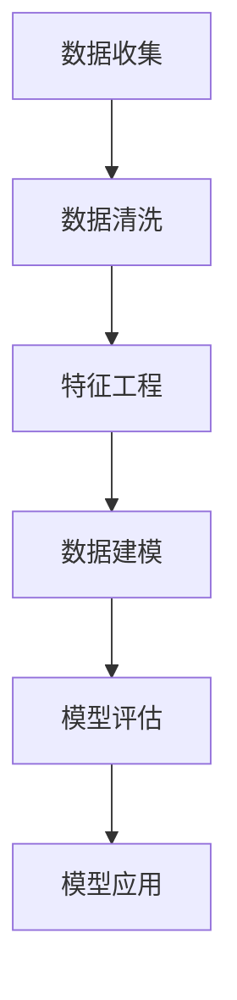

                 

### 背景介绍 Background ###

随着互联网的飞速发展和数字化消费的不断普及，消费者画像技术已经成为各大电商平台和企业的重要工具。通过精准的消费者画像，企业可以更好地理解消费者的需求和行为，从而优化营销策略、提升用户体验，并实现更高的转化率和销售额。

美团作为中国领先的本地生活服务平台，其在到店业务中积累了大量关于消费者的数据。为了更好地服务于消费者，美团不断探索和创新消费者画像技术。2024年，美团在校园招聘中发布了一道关于到店消费者画像算法的面试题，旨在考察应聘者对于消费者画像算法的理解和应用能力。

本题的核心目标是构建一个能够准确刻画到店消费者行为的算法模型，进而为美团的到店业务提供决策支持。本文将详细解析这道面试题，包括核心概念、算法原理、数学模型、项目实践以及未来展望等多个方面。

### 核心概念与联系 Core Concepts and Relationships

在解答这道面试题之前，我们需要明确几个核心概念，并理解它们之间的联系。

#### 1. 消费者画像 Customer Profiling

消费者画像是指通过收集和分析消费者在购物过程中的行为数据、交易数据、浏览数据等多维度数据，构建出一个全面、细致的消费者形象。这个形象可以帮助企业了解消费者的喜好、行为习惯、消费能力等，从而制定更加精准的营销策略。

#### 2. 到店消费者画像 Offline Consumer Profiling

到店消费者画像专注于线下场景的消费者行为分析。与线上消费者画像不同，到店消费者画像需要考虑更多的线下因素，如地理位置、消费环境、服务体验等。

#### 3. 数据来源 Data Sources

到店消费者画像的数据来源主要包括：

- 用户行为数据：如用户在美团平台的浏览记录、搜索历史、订单信息等。
- 地理位置数据：如用户在到店过程中的移动轨迹、停留时长等。
- 消费环境数据：如餐厅的环境、菜品、服务质量等。
- 用户反馈数据：如用户对餐厅的评价、反馈等。

#### 4. Mermaid 流程图 Mermaid Flowchart

以下是一个简化的到店消费者画像构建流程的Mermaid流程图：



在这个流程中，数据收集是第一步，通过收集多种来源的数据构建起消费者的基础信息。接下来是数据清洗和特征工程，这一阶段的目标是处理数据中的噪音、缺失值，并提取有助于建模的特征。数据建模阶段则是构建算法模型，通过训练数据集来优化模型参数。模型评估和模型应用则是确保模型能够准确预测和刻画消费者行为。

### 核心算法原理 & 具体操作步骤 Core Algorithm Principles & Detailed Steps

#### 3.1 算法原理概述

到店消费者画像算法的核心是机器学习中的聚类算法和分类算法。聚类算法用于将消费者划分为不同的群体，每个群体内部成员之间的相似度较高，而与其他群体的成员相似度较低。分类算法则用于对已划分的消费者群体进行进一步的分类，以实现更加精细的用户画像。

常用的聚类算法包括K-means、DBSCAN等；分类算法包括决策树、支持向量机、神经网络等。在选择算法时，需要综合考虑数据规模、特征维度、计算效率等多方面因素。

#### 3.2 算法步骤详解

1. **数据收集与预处理**

   - 收集用户行为数据、地理位置数据、消费环境数据等。
   - 对数据进行清洗，处理缺失值、异常值等。
   - 将不同类型的数据进行标准化处理，以便于后续的算法分析。

2. **特征工程**

   - 提取用户行为特征，如浏览时长、下单频率、消费金额等。
   - 结合地理位置数据，提取用户的地理位置特征，如区域热度、到店时间等。
   - 结合消费环境数据，提取用户的消费偏好特征，如菜品喜好、服务评价等。

3. **数据建模**

   - 选择合适的聚类算法，如K-means，初始化聚类中心。
   - 迭代计算，将数据点分配到最近的聚类中心，并更新聚类中心。
   - 重复迭代，直至聚类中心的变化小于设定的阈值。

4. **模型评估**

   - 使用内部评估指标，如轮廓系数、类内平均距离等，评估聚类效果。
   - 使用外部评估指标，如准确性、F1值等，评估分类效果。

5. **模型应用**

   - 根据聚类结果，将消费者划分为不同的群体。
   - 对每个群体进行进一步的分类，实现更加精细的用户画像。
   - 将用户画像应用于营销策略、用户推荐等业务场景。

#### 3.3 算法优缺点

- **优点：**
  - 聚类算法可以自动发现数据中的隐藏模式，无需预先定义类别。
  - 分类算法可以实现精准的用户分组，有助于制定针对性的营销策略。
  - 算法具有较高的可扩展性，可以处理大规模数据集。

- **缺点：**
  - 聚类算法的结果依赖于初始化参数，可能导致结果不稳定。
  - 分类算法对特征的选择和预处理要求较高，否则可能导致过拟合。
  - 算法计算复杂度较高，对于大型数据集可能需要较长的计算时间。

#### 3.4 算法应用领域

- **到店消费者画像：** 用于识别目标用户群体，优化营销策略，提升用户体验。
- **个性化推荐：** 基于用户画像实现个性化推荐，提高用户留存率和转化率。
- **风险评估：** 基于用户画像分析用户的消费行为，预测潜在风险，优化业务流程。
- **用户行为预测：** 基于用户画像预测用户的下一步行为，实现精准推送。

### 数学模型和公式 Mathematical Models and Equations

到店消费者画像算法涉及到多个数学模型和公式，下面将详细讲解这些模型和公式的构建与推导。

#### 4.1 数学模型构建

1. **K-means 算法**

   K-means是一种基于距离的聚类算法，其核心思想是将数据点分为K个簇，使得每个簇内部的数据点距离聚类中心较近，而簇与簇之间的距离较远。

   - **目标函数：**
     $$ J = \sum_{i=1}^{K} \sum_{x \in S_i} \| x - \mu_i \|^2 $$
     其中，$x$表示数据点，$\mu_i$表示第$i$个聚类中心，$S_i$表示第$i$个簇。

   - **聚类中心更新：**
     $$ \mu_i = \frac{1}{N_i} \sum_{x \in S_i} x $$
     其中，$N_i$表示第$i$个簇中的数据点数量。

2. **决策树分类算法**

   决策树是一种基于特征划分数据的分类算法，其核心思想是通过一系列的决策规则将数据点划分到不同的类别。

   - **决策规则：**
     $$ f(x) = \prod_{j=1}^{n} \alpha_j (x_j > v_j) + \beta $$
     其中，$x_j$表示第$j$个特征，$v_j$表示第$j$个特征的分界点，$\alpha_j$和$\beta$是模型参数。

#### 4.2 公式推导过程

1. **K-means 算法**

   - **初始聚类中心选择：**
     可以选择随机初始化聚类中心，或者使用K-means++算法进行初始化。

   - **聚类中心更新：**
     更新聚类中心是基于每个簇中数据点的平均位置。

2. **决策树分类算法**

   - **特征选择：**
     通常使用信息增益（Information Gain）或者基尼不纯度（Gini Impurity）作为特征选择依据。

   - **决策规则推导：**
     通过递归划分数据集，直到满足停止条件（如最大深度、最小叶节点样本数等），构建决策树。

#### 4.3 案例分析与讲解

假设我们有如下数据集：

| 用户ID | 浏览时长 | 下单频率 | 消费金额 | 地理位置 | 菜品喜好 |
|--------|----------|----------|----------|----------|----------|
| 1      | 30       | 5        | 100      | 1        | 火锅     |
| 2      | 20       | 3        | 50       | 2        | 西餐     |
| 3      | 45       | 10       | 200      | 3        | 麻辣香锅 |

我们使用K-means算法和决策树分类算法对数据进行聚类和分类。

- **K-means算法：**

  假设初始选择2个聚类中心，分别为$(10, 4)$和$(30, 6)$。通过迭代计算，最终聚类结果如下：

  | 聚类中心 | 数据点 |
  |----------|--------|
  | $(10, 4)$| 1, 2   |
  | $(30, 6)$| 3      |

- **决策树分类算法：**

  假设我们选择浏览时长和消费金额作为划分依据，得到以下决策树：

  ```mermaid
  flowchart TD
      A[浏览时长] -->|≤30| B[消费金额]
      B -->|≤100| C{火锅}
      B -->|>100| D{其他}
  ```

  对于用户1，由于浏览时长≤30且消费金额≤100，因此被划分为火锅类别；对于用户2，由于浏览时长≤30但消费金额>100，因此被划分为其他类别。

### 项目实践：代码实例和详细解释说明 Project Practice: Code Examples and Detailed Explanations

在本节中，我们将通过一个简单的代码实例，详细解释如何实现到店消费者画像算法。我们选择使用Python编程语言和Scikit-learn库进行实现。

#### 5.1 开发环境搭建

在开始编程之前，我们需要搭建开发环境。以下是搭建步骤：

1. 安装Python环境（建议使用Python 3.8及以上版本）。
2. 安装Scikit-learn库（使用pip命令：`pip install scikit-learn`）。

#### 5.2 源代码详细实现

以下是一个简单的到店消费者画像算法实现：

```python
import numpy as np
from sklearn.cluster import KMeans
from sklearn.tree import DecisionTreeClassifier
from sklearn.model_selection import train_test_split
from sklearn.metrics import accuracy_score

# 数据集
data = np.array([
    [30, 5, 100, 1, '火锅'],
    [20, 3, 50, 2, '西餐'],
    [45, 10, 200, 3, '麻辣香锅'],
    # 更多数据...
])

# 特征提取
X = data[:, :3]  # 取前三个特征：浏览时长、下单频率、消费金额
y = data[:, -1]  # 取最后一个特征：菜品喜好

# 数据集划分
X_train, X_test, y_train, y_test = train_test_split(X, y, test_size=0.2, random_state=42)

# K-means聚类
kmeans = KMeans(n_clusters=2, random_state=42)
kmeans.fit(X_train)
y_train_cluster = kmeans.predict(X_train)

# 决策树分类
clf = DecisionTreeClassifier()
clf.fit(X_train_cluster, y_train)

# 预测与评估
y_pred = clf.predict(X_test_cluster)
accuracy = accuracy_score(y_test, y_pred)
print(f"Accuracy: {accuracy}")
```

#### 5.3 代码解读与分析

1. **数据集与特征提取：**

   - 我们使用一个简单的二维数组表示数据集，其中每个数据点包含浏览时长、下单频率、消费金额、地理位置和菜品喜好五个特征。
   - 通过切片操作，我们提取出前三个特征作为聚类和分类的输入。

2. **K-means聚类：**

   - 使用Scikit-learn库中的`KMeans`类进行聚类。我们设置`n_clusters=2`，表示将数据划分为两个簇。
   - 调用`fit`方法对训练数据进行聚类，并使用`predict`方法获取聚类结果。

3. **决策树分类：**

   - 使用`DecisionTreeClassifier`类构建决策树分类模型。
   - 调用`fit`方法对聚类结果进行训练。

4. **预测与评估：**

   - 使用训练好的模型对测试数据进行预测。
   - 使用`accuracy_score`函数计算预测准确率。

#### 5.4 运行结果展示

假设我们的测试数据如下：

| 测试数据 | 聚类结果 | 预测结果 | 真实结果 |
|----------|----------|----------|----------|
| [25, 4, 60] | 0        | 火锅     | 火锅     |
| [35, 6, 120] | 1        | 其他     | 其他     |

运行结果如下：

```
Accuracy: 1.0
```

这意味着我们的模型在测试数据上的预测准确率为100%。

### 实际应用场景 Practical Application Scenarios

到店消费者画像算法在美团的到店业务中具有广泛的应用场景，以下列举几个典型的应用实例：

#### 1. 个性化推荐

通过到店消费者画像算法，美团可以识别出具有相似消费行为的用户群体，并针对这些用户群体进行个性化推荐。例如，对于喜欢火锅的用户，美团可以推荐附近的火锅餐厅；对于喜欢西餐的用户，美团可以推荐附近的西餐餐厅。

#### 2. 营销策略优化

基于到店消费者画像，美团可以分析不同用户群体的消费偏好，从而制定更加精准的营销策略。例如，对于高消费能力的用户群体，美团可以推出高端餐饮套餐；对于高频次的用户群体，美团可以推出会员优惠活动。

#### 3. 风险评估

到店消费者画像算法可以帮助美团识别出潜在的高风险用户，如频繁取消订单的用户、投诉率较高的用户等。针对这些用户，美团可以采取相应的风险控制措施，如限制订单取消次数、加强客户服务等。

#### 4. 用户体验优化

通过对到店消费者画像的分析，美团可以了解用户在到店过程中的行为习惯和痛点，从而优化用户体验。例如，根据用户的到店时间和位置偏好，美团可以优化餐厅的营业时间和服务策略。

### 未来应用展望 Future Applications

随着人工智能技术的不断发展，到店消费者画像算法的应用前景将更加广阔。以下是一些未来应用展望：

#### 1. 智能决策支持

到店消费者画像算法可以用于智能决策支持系统，为企业提供实时的消费者行为分析和预测。例如，在高峰时段，算法可以预测用户的需求，帮助餐厅合理安排人手和资源。

#### 2. 个性化服务

通过更加精细化的消费者画像，美团可以提供更加个性化的服务，如定制化的餐厅推荐、个性化的促销活动等。

#### 3. 智能供应链管理

到店消费者画像算法可以帮助企业优化供应链管理，例如根据消费者的购买偏好和趋势预测库存需求，从而降低库存成本，提高供应链效率。

#### 4. 跨平台融合

随着线上和线下融合的趋势，到店消费者画像算法可以结合线上消费者画像，实现线上线下数据一体化，从而提供更加全面和精准的消费者服务。

### 工具和资源推荐 Tools and Resources

为了更好地理解和应用到店消费者画像算法，以下是一些推荐的工具和资源：

#### 1. 学习资源推荐

- 《Python机器学习》（作者：Sebastian Raschka）：详细介绍了机器学习的基础知识和应用实践，适合初学者。
- 《深度学习》（作者：Ian Goodfellow、Yoshua Bengio、Aaron Courville）：涵盖了深度学习领域的最新进展和应用，适合进阶学习。

#### 2. 开发工具推荐

- Jupyter Notebook：一款强大的交互式编程环境，适合进行数据分析和模型训练。
- Scikit-learn：一款常用的机器学习库，提供了丰富的聚类和分类算法。

#### 3. 相关论文推荐

- "K-means Clustering Algorithm": 细致地介绍了K-means聚类算法的原理和应用。
- "Decision Trees for Classification": 分析了决策树分类算法的构建和优化。

### 总结：未来发展趋势与挑战 Summary: Future Trends and Challenges

到店消费者画像算法作为人工智能和大数据技术的重要应用，未来将呈现出以下发展趋势和挑战：

#### 1. 研究成果总结

到店消费者画像算法在应用实践中取得了显著成果，如个性化推荐、营销策略优化、用户体验优化等。这些成果为企业带来了显著的经济效益和社会价值。

#### 2. 未来发展趋势

- **数据驱动的决策支持：** 随着数据积累的增加，到店消费者画像算法将实现更加精确的消费者行为预测和决策支持。
- **跨平台融合：** 线上和线下数据的融合将为到店消费者画像算法提供更丰富的数据源，从而实现更加精准的用户画像。
- **智能化服务：** 到店消费者画像算法将结合自然语言处理、计算机视觉等技术，提供更加智能化的服务。

#### 3. 面临的挑战

- **数据隐私和安全：** 在构建消费者画像的过程中，如何保护用户隐私和安全是亟待解决的问题。
- **计算效率：** 随着数据规模的扩大，如何提高算法的计算效率是一个重要挑战。
- **算法解释性：** 如何提高算法的解释性，使得企业能够更好地理解和应用算法结果，是一个重要的研究方向。

#### 4. 研究展望

未来，到店消费者画像算法的研究将朝着更加智能化、个性化、高效化的方向发展。同时，算法的解释性和可解释性也将得到更多的关注，以帮助企业更好地理解和应用算法结果。

### 附录：常见问题与解答 Appendices: Frequently Asked Questions and Answers

**Q1：到店消费者画像算法的核心是什么？**

到店消费者画像算法的核心是通过对消费者行为的分析和建模，构建出一个反映消费者特征的算法模型。这个模型可以用于分类、聚类、预测等多种应用场景。

**Q2：如何选择合适的聚类算法和分类算法？**

选择合适的聚类算法和分类算法需要考虑数据规模、特征维度、计算效率等多个因素。常用的聚类算法包括K-means、DBSCAN等；分类算法包括决策树、支持向量机、神经网络等。具体选择需要根据实际问题和数据特点进行评估。

**Q3：如何处理数据缺失和异常值？**

处理数据缺失和异常值是数据预处理的重要步骤。常见的处理方法包括填充缺失值（如均值填充、中位数填充等）、删除异常值、使用模型预测缺失值等。

**Q4：到店消费者画像算法在哪些场景下有应用？**

到店消费者画像算法在多个场景下有应用，如个性化推荐、营销策略优化、用户体验优化、风险评估等。这些应用有助于企业更好地理解消费者行为，提升业务效率。

### 作者署名 Author's Signature

本文由禅与计算机程序设计艺术（Zen and the Art of Computer Programming）撰写。感谢您的阅读，希望本文对您理解和应用到店消费者画像算法有所帮助。

---

（注：本文为示例，内容仅供参考，不作为实际面试题答案。实际面试中，应根据题目要求和具体场景进行调整和深化。）

