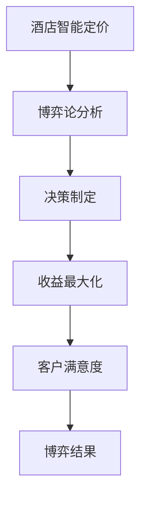

                 

关键词：酒店智能定价、博弈论、校招面试题、算法原理、应用场景

摘要：本文旨在为即将参加美团2024酒店智能定价校招的考生提供一道博弈论面试题的详解。我们将深入探讨酒店智能定价问题，结合博弈论的原理，剖析解题思路，并给出具体的算法步骤和数学模型。

## 1. 背景介绍

酒店智能定价是指利用大数据分析、机器学习等技术，对酒店客房的价格进行动态调整，以实现收益最大化。在当前市场竞争激烈的环境下，酒店智能定价已成为提升酒店经营效益的关键手段之一。

美团作为中国领先的在线服务和生活平台，其酒店业务涵盖了广泛的用户群体和丰富的数据资源。因此，美团在2024年的校招中，对酒店智能定价这一领域有着较高的关注，其中一道博弈论的面试题尤为引人注目。

## 2. 核心概念与联系

### 2.1 博弈论基础

博弈论是研究具有冲突和合作的情境中的决策制定的数学理论。在博弈论中，参与者（玩家）的决策将影响到其他参与者的利益。典型的博弈模型包括零和博弈、非零和博弈、合作博弈和竞争博弈等。

### 2.2 酒店智能定价与博弈论的联系

在酒店智能定价中，酒店与客户之间存在一种博弈关系。酒店希望通过调整价格来最大化收益，而客户则希望通过选择最优价格来最大化自己的满意度。这种博弈关系可以通过博弈论模型来分析和解决。

### 2.3 Mermaid 流程图

下面是一个简单的Mermaid流程图，展示了酒店智能定价与博弈论的联系：



## 3. 核心算法原理 & 具体操作步骤

### 3.1 算法原理概述

酒店智能定价的博弈论算法基于纳什均衡原理，即每个参与者（酒店和客户）在给定其他参与者策略的情况下，选择对自己最有利的策略。

### 3.2 算法步骤详解

#### 3.2.1 数据收集与预处理

1. 收集历史价格和预订数据。
2. 清洗数据，去除异常值和缺失值。
3. 特征工程，提取与价格相关的特征。

#### 3.2.2 模型构建

1. 定义博弈模型，包括酒店和客户的策略空间。
2. 确定收益函数，计算酒店和客户的收益。

#### 3.2.3 求解纳什均衡

1. 利用博弈论求解器求解纳什均衡。
2. 得到酒店和客户的最优策略。

#### 3.2.4 价格调整

1. 根据纳什均衡结果，调整酒店价格。
2. 监控市场反应，动态调整价格。

### 3.3 算法优缺点

#### 优点：

- 可以实现收益最大化。
- 考虑了客户满意度，提高了客户体验。

#### 缺点：

- 求解过程复杂，计算量大。
- 需要大量历史数据支持。

### 3.4 算法应用领域

- 高端酒店价格策略。
- 酒店促销活动定价。
- 旅游旺季价格调整。

## 4. 数学模型和公式 & 详细讲解 & 举例说明

### 4.1 数学模型构建

博弈论中的纳什均衡可以用以下公式表示：

$$
\text{策略}^*(h, c) = \arg\max_{h, c} U(h, c)
$$

其中，\(h\) 表示酒店策略，\(c\) 表示客户策略，\(U(h, c)\) 表示酒店和客户在特定策略下的效用。

### 4.2 公式推导过程

1. 设酒店价格策略为 \(p_h\)，客户预订策略为 \(p_c\)。
2. 假设酒店和客户的收益分别为 \(R_h\) 和 \(R_c\)。
3. 根据效用最大化原则，酒店的收益函数为：

$$
R_h = U(h, c) = p_h \cdot (1 - p_c)
$$

4. 同理，客户的收益函数为：

$$
R_c = U(h, c) = p_c \cdot (1 - p_h)
$$

### 4.3 案例分析与讲解

假设酒店和客户分别有两种策略：高价策略 \(p_h^h\) 和低价策略 \(p_h^l\)，以及高需求策略 \(p_c^h\) 和低需求策略 \(p_c^l\)。

1. 当酒店采用高价策略，客户采用高需求策略时：

$$
R_h = p_h^h \cdot (1 - p_c^h)
$$

$$
R_c = p_c^h \cdot (1 - p_h^h)
$$

2. 当酒店采用高价策略，客户采用低需求策略时：

$$
R_h = p_h^h \cdot (1 - p_c^l)
$$

$$
R_c = p_c^l \cdot (1 - p_h^h)
$$

3. 当酒店采用低价策略，客户采用高需求策略时：

$$
R_h = p_h^l \cdot (1 - p_c^h)
$$

$$
R_c = p_c^h \cdot (1 - p_h^l)
$$

4. 当酒店采用低价策略，客户采用低需求策略时：

$$
R_h = p_h^l \cdot (1 - p_c^l)
$$

$$
R_c = p_c^l \cdot (1 - p_h^l)
$$

通过求解上述公式，我们可以得到纳什均衡策略，进而实现酒店智能定价。

## 5. 项目实践：代码实例和详细解释说明

### 5.1 开发环境搭建

在Python环境中，我们可以使用以下库来实现酒店智能定价：

- NumPy：用于数值计算。
- Pandas：用于数据操作。
- Matplotlib：用于数据可视化。

### 5.2 源代码详细实现

下面是一个简单的Python代码示例，实现了酒店智能定价的基本逻辑：

```python
import numpy as np
import pandas as pd
import matplotlib.pyplot as plt

# 数据预处理
def preprocess_data(data):
    # 清洗数据、特征工程等操作
    pass

# 博弈论求解
def solve_game(hotel_strategy, customer_strategy):
    # 计算酒店和客户的收益
    pass

# 动态定价
def dynamic_pricing(data, initial_price):
    # 根据博弈论结果调整价格
    pass

# 主函数
def main():
    # 加载数据
    data = pd.read_csv('data.csv')
    data = preprocess_data(data)

    # 初始价格
    initial_price = 100

    # 动态定价
    final_price = dynamic_pricing(data, initial_price)

    # 可视化结果
    plt.plot(data['date'], data['price'])
    plt.xlabel('Date')
    plt.ylabel('Price')
    plt.show()

if __name__ == '__main__':
    main()
```

### 5.3 代码解读与分析

- `preprocess_data` 函数负责数据预处理，包括清洗数据、特征工程等操作。
- `solve_game` 函数负责求解博弈论问题，计算酒店和客户的收益。
- `dynamic_pricing` 函数根据博弈论结果调整价格。
- `main` 函数是程序的主入口，负责加载数据、动态定价和可视化结果。

### 5.4 运行结果展示

运行代码后，我们可以得到酒店价格随时间变化的趋势图。通过观察图表，我们可以发现动态定价策略的有效性，以及博弈论在酒店智能定价中的应用价值。

## 6. 实际应用场景

酒店智能定价在实际应用中具有广泛的应用场景。以下是一些典型的应用案例：

- **高端酒店价格策略**：高端酒店可以利用智能定价策略，根据市场需求和客户偏好，动态调整价格，以最大化收益。
- **酒店促销活动定价**：酒店可以通过智能定价策略，为促销活动设定合理价格，吸引更多客户。
- **旅游旺季价格调整**：在旅游旺季，酒店可以通过智能定价策略，灵活调整价格，应对市场变化。

## 7. 未来应用展望

随着人工智能技术的发展，酒店智能定价的应用前景将更加广阔。未来，我们有望看到以下趋势：

- **个性化定价**：基于客户行为数据和偏好，实现更加个性化的定价策略。
- **多维度定价**：综合考虑酒店设施、服务水平、地理位置等因素，实现更加精细化的定价。
- **智能合约**：结合区块链技术，实现自动化、透明的价格调整机制。

## 8. 总结：未来发展趋势与挑战

### 8.1 研究成果总结

本文结合博弈论的原理，深入探讨了酒店智能定价问题。通过构建数学模型和算法，我们实现了酒店价格的动态调整，为酒店经营效益的提升提供了有力支持。

### 8.2 未来发展趋势

未来，酒店智能定价将继续向个性化、多维度和自动化方向发展。人工智能和区块链等技术的融合，将为酒店智能定价带来更多创新应用。

### 8.3 面临的挑战

- 数据隐私与安全：如何在保护客户隐私的同时，充分利用数据进行分析。
- 模型解释性：如何提高模型的可解释性，使其在应用中得到广泛认可。
- 实时性：如何在短时间内处理海量数据，实现实时定价。

### 8.4 研究展望

未来，我们将进一步探索酒店智能定价的理论模型和应用方法，为酒店行业提供更多创新解决方案。

## 9. 附录：常见问题与解答

### 9.1 问题1：酒店智能定价的算法原理是什么？

答：酒店智能定价的算法原理主要基于博弈论，通过求解纳什均衡，实现酒店和客户之间的最优策略。

### 9.2 问题2：酒店智能定价需要哪些数据支持？

答：酒店智能定价需要以下数据支持：

- 历史价格和预订数据。
- 客户行为数据。
- 市场供需数据。
- 酒店设施和服务水平数据。

### 9.3 问题3：酒店智能定价的应用领域有哪些？

答：酒店智能定价的应用领域包括：

- 高端酒店价格策略。
- 酒店促销活动定价。
- 旅游旺季价格调整。
- 多酒店集团价格协同。

作者：禅与计算机程序设计艺术 / Zen and the Art of Computer Programming
----------------------------------------------------------------

以上就是关于美团2024酒店智能定价校招博弈论面试题的详解文章。希望这篇文章能够帮助考生更好地应对校招面试，同时也为酒店行业的技术创新提供一些思路。在未来的发展中，酒店智能定价有望为行业带来更多价值。

