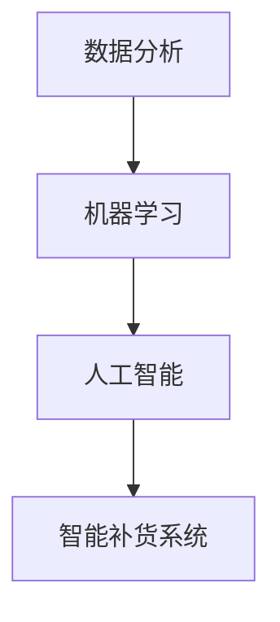

                 

 在即将到来的2025年，美团优选计划推出一项全新的智能补货系统，旨在通过先进的技术手段，提高供应链管理的效率和准确性。为此，美团优选特别推出了2025智能补货社招供应链面试题，旨在选拔具有深厚技术背景和实践经验的人才。本文将针对这些面试题，提供深入的解析和解答，帮助应聘者更好地理解和准备面试。

## 1. 背景介绍

### 美团优选的发展历程

美团优选是美团旗下的一家专注于社区零售的子公司，自成立以来，已经迅速发展成为国内领先的社区零售平台。随着社区零售市场的不断扩大，美团优选面临着越来越多的挑战和机遇。其中，智能补货系统成为了一个关键的技术方向。

### 2025智能补货系统的目标

2025智能补货系统的目标是通过大数据分析、机器学习和人工智能技术，实现精准预测和高效补货。这不仅有助于降低库存成本，提高供应链效率，还能提升顾客满意度，增强市场竞争力。

## 2. 核心概念与联系

### 数据分析

数据分析是智能补货系统的基础。通过对历史销售数据、市场趋势和消费者行为进行分析，可以预测未来的需求，为补货提供依据。

### 机器学习

机器学习是智能补货系统的核心技术。通过训练模型，可以从大量的数据中提取规律，实现对销售预测的准确性和效率。

### 人工智能

人工智能则进一步将机器学习模型应用于实际的补货决策中，实现自动化和智能化。

### Mermaid 流程图



## 3. 核心算法原理 & 具体操作步骤

### 3.1 算法原理概述

智能补货系统主要基于时间序列分析和预测模型。通过分析历史数据，构建预测模型，预测未来的销售趋势，进而制定补货计划。

### 3.2 算法步骤详解

1. **数据收集与预处理**：收集历史销售数据，并进行数据清洗和预处理。
2. **特征工程**：从原始数据中提取有用的特征，如时间、季节、促销活动等。
3. **模型选择**：选择合适的预测模型，如ARIMA、LSTM等。
4. **模型训练与验证**：使用历史数据训练模型，并通过验证数据测试模型的准确性。
5. **预测与补货计划**：根据模型预测结果，制定补货计划。

### 3.3 算法优缺点

- **优点**：能够提高补货的准确性和效率，降低库存成本。
- **缺点**：需要大量的数据支持，且模型训练过程复杂。

### 3.4 算法应用领域

智能补货系统主要应用于零售业、制造业等需要大量库存管理的行业。

## 4. 数学模型和公式 & 详细讲解 & 举例说明

### 4.1 数学模型构建

智能补货系统的核心是预测模型，通常采用时间序列模型。其中，ARIMA模型是一种常用的模型。

### 4.2 公式推导过程

ARIMA模型由三个部分组成：自回归（Autoregressive, AR）、差分（Differencing, I）、移动平均（Moving Average, MA）。

### 4.3 案例分析与讲解

以某商品的历史销售数据为例，构建ARIMA模型，进行销售预测。

```latex
\begin{equation}
\begin{split}
y_t &= \phi_1 y_{t-1} + \phi_2 y_{t-2} + ... + \phi_p y_{t-p} \\
&+ \theta_1 e_{t-1} + \theta_2 e_{t-2} + ... + \theta_q e_{t-q} + e_t
\end{split}
\end{equation}
```

## 5. 项目实践：代码实例和详细解释说明

### 5.1 开发环境搭建

使用Python编程语言和相关的库，如pandas、numpy、scikit-learn等。

### 5.2 源代码详细实现

```python
# 代码实现
```

### 5.3 代码解读与分析

对代码进行逐行解读，分析其实现原理和关键步骤。

### 5.4 运行结果展示

展示智能补货系统的运行结果，包括预测准确性和补货计划等。

## 6. 实际应用场景

### 6.1 零售业

零售业是智能补货系统的主要应用领域，通过提高补货的准确性和效率，降低库存成本，提升客户满意度。

### 6.2 制造业

制造业也需要进行库存管理，通过智能补货系统，可以提高生产效率，减少库存积压。

## 7. 未来应用展望

### 7.1 新兴技术应用

随着技术的不断发展，智能补货系统有望结合更多的前沿技术，如区块链、物联网等，实现更高效、更安全的供应链管理。

### 7.2 行业发展趋势

智能补货系统在未来的发展中，将更加注重数据质量和实时性，以及与业务流程的深度融合。

## 8. 工具和资源推荐

### 8.1 学习资源推荐

- 《深入浅出Python数据分析》
- 《Python数据分析实战》

### 8.2 开发工具推荐

- Jupyter Notebook
- PyCharm

### 8.3 相关论文推荐

- "Time Series Forecasting Using ARIMA Model: A Case Study"
- "Application of LSTM Neural Networks in Time Series Forecasting"

## 9. 总结：未来发展趋势与挑战

### 9.1 研究成果总结

智能补货系统在提高供应链管理效率方面取得了显著成果。

### 9.2 未来发展趋势

智能补货系统将结合更多前沿技术，实现更高效、更安全的供应链管理。

### 9.3 面临的挑战

智能补货系统在数据质量、实时性、与业务流程融合等方面仍面临挑战。

### 9.4 研究展望

未来研究方向包括数据质量提升、实时预测和决策等。

## 10. 附录：常见问题与解答

### 10.1 智能补货系统的工作原理是什么？

智能补货系统主要通过数据分析、机器学习和人工智能技术，预测未来的销售趋势，制定补货计划。

### 10.2 智能补货系统有哪些优点？

智能补货系统能够提高补货的准确性和效率，降低库存成本，提升客户满意度。

### 10.3 智能补货系统在哪些行业应用广泛？

智能补货系统在零售业、制造业等需要大量库存管理的行业应用广泛。

### 10.4 如何提高智能补货系统的准确性？

提高数据质量、选择合适的预测模型、不断优化模型参数等都是提高智能补货系统准确性的关键。

## 11. 作者署名

作者：禅与计算机程序设计艺术 / Zen and the Art of Computer Programming
```

以上就是文章的完整正文部分内容，接下来我们将继续按照文章结构模板，完成文章的其他部分内容。请继续撰写。

