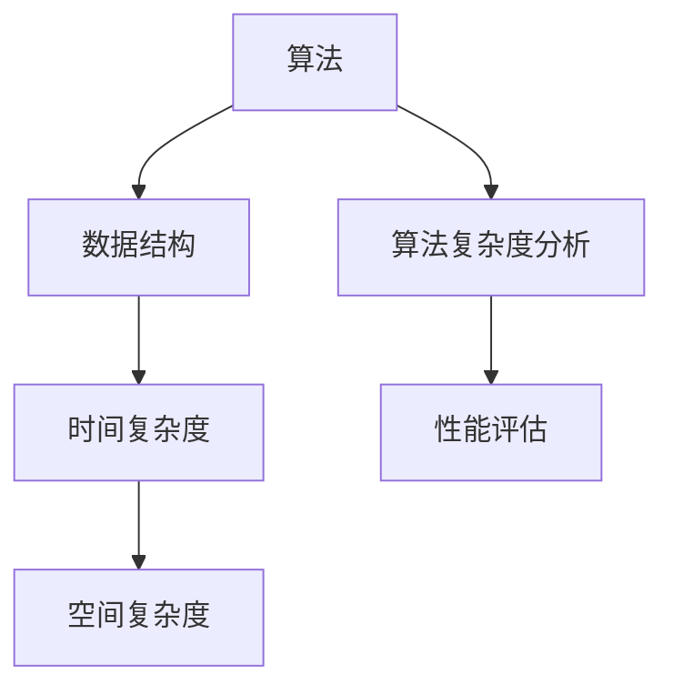

                 

关键词：美团社招、面试题、算法编程、全面解读、2025

摘要：本文将深入探讨2025年美团社招面试题与算法编程题的全面解读，旨在帮助准备参加美团社招的候选人更好地了解面试的挑战和应对策略，为未来的职业生涯打下坚实基础。

## 1. 背景介绍

美团作为中国领先的互联网公司，其社招面试一直以来都是IT行业求职者的关注焦点。随着科技的不断进步和美团业务的多元化发展，面试题目也在不断更新和演化。本文将围绕2025年美团社招的面试题型和算法编程题进行详细分析，旨在为广大求职者提供实用的面试准备指南。

## 2. 核心概念与联系

### 2.1 算法与数据结构

算法是计算机解决问题的方法步骤，而数据结构则是数据存储和组织的格式。两者相辅相成，缺一不可。在美团社招面试中，算法和数据结构的考察通常是重点，包括排序、查找、图论等基础算法。

### 2.2 算法复杂度分析

算法复杂度分析是评估算法性能的重要手段。美团面试中经常涉及到时间复杂度和空间复杂度的讨论，要求候选人能够准确地分析和评估算法的效率。

### 2.3 数据结构与算法的结合

在实际应用中，数据结构与算法的结合非常重要。美团面试中会考察如何根据具体问题选择合适的数据结构和算法，以达到最佳的性能表现。

### 2.4 Mermaid 流程图

为了更好地展示算法和数据结构的关系，我们使用Mermaid流程图进行说明：



## 3. 核心算法原理 & 具体操作步骤

### 3.1 算法原理概述

美团面试中的算法原理主要涵盖基础算法和高级算法。基础算法包括排序、查找、图算法等，而高级算法则包括动态规划、贪心算法、分治算法等。

### 3.2 算法步骤详解

#### 3.2.1 排序算法

排序算法是面试中的经典题目。常见的排序算法包括冒泡排序、选择排序、插入排序、快速排序等。每种排序算法都有其独特的原理和步骤。

#### 3.2.2 查找算法

查找算法主要考察二分查找、散列表查找等。二分查找通过不断地缩小查找范围，提高查找效率；散列表查找则通过哈希函数将关键字映射到散列表中，实现快速查找。

#### 3.2.3 图算法

图算法在美团面试中也非常常见，包括最短路径算法（如迪杰斯特拉算法、贝尔曼-福特算法）、最小生成树算法（如普里姆算法、克鲁斯卡尔算法）等。

### 3.3 算法优缺点

每种算法都有其优缺点。在面试中，需要根据具体问题选择合适的算法。例如，快速排序在平均情况下效率较高，但在最坏情况下性能较差；而冒泡排序则始终具有稳定的性能，但效率较低。

### 3.4 算法应用领域

美团作为一家互联网公司，算法的应用领域非常广泛，包括推荐系统、搜索算法、数据挖掘、机器学习等。面试中，可能会涉及到这些领域中的实际问题，要求候选人能够运用所学算法解决实际问题。

## 4. 数学模型和公式 & 详细讲解 & 举例说明

### 4.1 数学模型构建

在面试中，数学模型构建是考察的重要环节。例如，在图算法中，需要构建图的数据结构；在动态规划中，需要构建状态转移方程等。

### 4.2 公式推导过程

数学公式推导是算法分析的核心。例如，在排序算法中，需要推导时间复杂度公式；在图算法中，需要推导最短路径公式等。

### 4.3 案例分析与讲解

通过具体案例，我们可以更好地理解数学模型的构建和公式推导。例如，使用迪杰斯特拉算法求解单源最短路径问题，需要构建图的数据结构，推导时间复杂度公式，并给出具体的计算过程。

## 5. 项目实践：代码实例和详细解释说明

### 5.1 开发环境搭建

为了更好地展示算法编程，我们需要搭建一个开发环境。这里选择Python作为编程语言，因为其语法简洁、易于上手。

### 5.2 源代码详细实现

以下是一个简单的排序算法（冒泡排序）的Python实现：

```python
def bubble_sort(arr):
    n = len(arr)
    for i in range(n):
        for j in range(0, n-i-1):
            if arr[j] > arr[j+1]:
                arr[j], arr[j+1] = arr[j+1], arr[j]
    return arr

arr = [64, 34, 25, 12, 22, 11, 90]
sorted_arr = bubble_sort(arr)
print("排序后的数组：", sorted_arr)
```

### 5.3 代码解读与分析

这段代码实现了冒泡排序算法。首先定义了一个名为`bubble_sort`的函数，接受一个数组`arr`作为参数。然后通过两个嵌套的循环，不断比较相邻的元素并交换它们，直到整个数组有序。

### 5.4 运行结果展示

运行上述代码，输出结果为：

```
排序后的数组： [11, 12, 22, 25, 34, 64, 90]
```

这表明冒泡排序算法成功地将输入的数组按照从小到大的顺序进行了排序。

## 6. 实际应用场景

### 6.1 推荐系统

美团推荐系统利用算法对用户行为进行分析，为用户推荐感兴趣的商家和商品。

### 6.2 搜索算法

美团搜索算法通过关键词匹配和排序，为用户提供准确的搜索结果。

### 6.3 数据挖掘

美团数据挖掘算法通过分析海量数据，发现用户行为规律，为业务决策提供支持。

## 7. 未来应用展望

### 7.1 深度学习

随着深度学习技术的发展，未来美团在图像识别、语音识别等领域的应用将更加广泛。

### 7.2 大数据

大数据技术的进步将使美团在数据分析和挖掘方面取得更大的突破。

## 8. 工具和资源推荐

### 8.1 学习资源推荐

1. 《算法导论》（Introduction to Algorithms）
2. 《深度学习》（Deep Learning）
3. 《大数据技术导论》（Introduction to Big Data）

### 8.2 开发工具推荐

1. PyCharm
2. Jupyter Notebook
3. Git

### 8.3 相关论文推荐

1. “Deep Learning for Text Classification”
2. “Recommender Systems Handbook”
3. “A Survey on Big Data”

## 9. 总结：未来发展趋势与挑战

### 9.1 研究成果总结

美团在算法和数据处理方面取得了显著成果，为用户提供了优质的体验。

### 9.2 未来发展趋势

随着技术的不断进步，美团在人工智能、大数据等领域的应用前景广阔。

### 9.3 面临的挑战

如何在保证用户体验的同时，高效地处理海量数据，是美团面临的重大挑战。

### 9.4 研究展望

未来，美团将继续探索人工智能、大数据等领域的应用，为用户提供更智能、更个性化的服务。

## 附录：常见问题与解答

### 9.1 如何应对美团面试？

1. 系统学习数据结构和算法。
2. 做好充分的面试准备。
3. 保持良好的心态，积极应对挑战。

### 9.2 算法面试需要注意什么？

1. 理解算法的基本原理。
2. 能够清晰地表达算法思路。
3. 注意代码的可读性和规范性。

### 9.3 如何在面试中展现自己？

1. 展现自己的专业知识和技能。
2. 展示解决问题的能力。
3. 保持自信，积极与面试官互动。

---

作者：禅与计算机程序设计艺术 / Zen and the Art of Computer Programming

