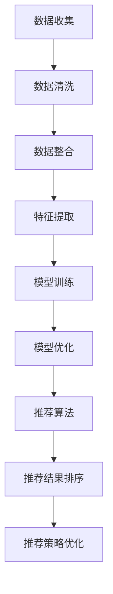

                 

关键词：美食探索、智能应用、数据分析、用户推荐、算法优化

> 摘要：本文将探讨如何利用人工智能技术构建一款美食探索应用，帮助用户发现符合个人口味的美食。通过数据分析、机器学习算法和用户推荐系统，实现智能向导功能，让用户在美食世界中畅游。

## 1. 背景介绍

在当今社会，人们对美食的追求已不再局限于地域和文化的限制。随着互联网和移动设备的普及，美食探索应用成为了人们发现新口味、新餐厅的重要工具。传统的美食推荐方式主要依赖于用户评分和评论，但这种推荐方式存在明显的局限性。例如，用户可能因为评分人数较少或评论内容不够详细而难以做出选择。此外，用户的口味偏好是动态变化的，传统推荐系统难以实时捕捉和适应这种变化。

为了解决这些问题，本文将介绍一款基于人工智能的美食探索应用，通过引入数据分析、机器学习算法和用户推荐系统，为用户提供更加精准、个性化的美食推荐。该应用的目标是帮助用户发现符合个人口味的美食，提升用户在美食探索过程中的满意度。

## 2. 核心概念与联系

### 2.1. 数据分析

数据分析是美食探索应用的基础。通过对用户行为数据、餐厅信息数据、菜品信息数据进行收集、清洗和整合，我们可以提取出有价值的信息，为后续的推荐算法提供支持。具体来说，数据分析包括以下几个步骤：

- 数据收集：收集用户在应用中的浏览、搜索、评价等行为数据，以及餐厅和菜品的信息数据。
- 数据清洗：对收集到的数据去重、去噪，确保数据的准确性和完整性。
- 数据整合：将不同来源的数据进行整合，构建一个统一的美食数据集。

### 2.2. 机器学习算法

机器学习算法是美食探索应用的核心。通过训练和优化算法，我们可以实现个性化推荐、菜品相似度计算等功能。具体来说，机器学习算法包括以下几个部分：

- 特征提取：从原始数据中提取出有助于推荐的特征，如用户兴趣、餐厅类型、菜品口味等。
- 模型训练：利用训练数据集训练推荐模型，如协同过滤算法、基于内容的推荐算法等。
- 模型优化：通过交叉验证、参数调优等方法优化推荐模型，提高推荐质量。

### 2.3. 用户推荐系统

用户推荐系统是美食探索应用的核心功能。通过用户推荐系统，我们可以为用户提供个性化的美食推荐，提高用户在应用中的留存率和活跃度。具体来说，用户推荐系统包括以下几个部分：

- 推荐算法：根据用户兴趣和行为数据，利用机器学习算法生成个性化推荐列表。
- 推荐结果排序：对推荐结果进行排序，确保高质量、符合用户需求的美食推荐排在前面。
- 推荐策略优化：通过分析用户反馈和推荐效果，不断优化推荐策略，提高推荐质量。

### 2.4. Mermaid 流程图

下面是一个简化的美食探索应用流程图，展示核心概念之间的联系。



## 3. 核心算法原理 & 具体操作步骤

### 3.1. 算法原理概述

美食探索应用的核心算法主要包括协同过滤算法、基于内容的推荐算法和混合推荐算法。这些算法的基本原理如下：

- **协同过滤算法**：基于用户行为数据，通过计算用户之间的相似度，为用户推荐相似用户喜欢的美食。
- **基于内容的推荐算法**：根据美食的属性（如菜系、口味、食材等），为用户推荐具有相似属性的美食。
- **混合推荐算法**：结合协同过滤算法和基于内容的推荐算法，生成更加精准的推荐结果。

### 3.2. 算法步骤详解

#### 3.2.1. 协同过滤算法

1. **数据预处理**：对用户行为数据进行处理，如去除空值、缺失值等。
2. **计算用户相似度**：利用余弦相似度或皮尔逊相关系数计算用户之间的相似度。
3. **生成推荐列表**：根据用户相似度和物品评分，为用户生成推荐列表。

#### 3.2.2. 基于内容的推荐算法

1. **提取特征**：从菜品信息中提取特征，如菜系、口味、食材等。
2. **计算相似度**：利用TF-IDF算法或余弦相似度计算用户和菜品的相似度。
3. **生成推荐列表**：根据相似度为用户生成推荐列表。

#### 3.2.3. 混合推荐算法

1. **数据预处理**：对用户行为数据和菜品信息进行预处理。
2. **计算用户相似度**：利用协同过滤算法计算用户相似度。
3. **计算内容相似度**：利用基于内容的推荐算法计算用户和菜品的相似度。
4. **生成推荐列表**：将协同过滤算法和基于内容的推荐算法的推荐结果进行融合，生成最终的推荐列表。

### 3.3. 算法优缺点

- **协同过滤算法**：优点是能够生成个性化的推荐结果，但缺点是易发生数据稀疏问题，且难以处理冷启动问题。
- **基于内容的推荐算法**：优点是能够为用户推荐具有相似属性的美食，但缺点是难以捕捉用户兴趣的变化。
- **混合推荐算法**：优点是结合了协同过滤算法和基于内容的推荐算法的优点，能够生成更精准的推荐结果，但缺点是计算复杂度较高。

### 3.4. 算法应用领域

美食探索应用的核心算法可以应用于多个领域，如：

- **在线美食平台**：为用户提供个性化的美食推荐，提升用户满意度。
- **餐厅管理系统**：帮助餐厅根据用户偏好进行菜品调整和库存管理。
- **美食社交平台**：为用户提供基于兴趣的交友推荐，增强用户互动。

## 4. 数学模型和公式 & 详细讲解 & 举例说明

### 4.1. 数学模型构建

美食探索应用的数学模型主要包括用户相似度模型和推荐模型。下面分别介绍这两个模型的构建过程。

#### 4.1.1. 用户相似度模型

用户相似度模型用于计算用户之间的相似度。假设用户集合为 \( U = \{u_1, u_2, ..., u_n\} \)，用户行为矩阵为 \( R \)，其中 \( R_{ij} \) 表示用户 \( u_i \) 对餐厅 \( j \) 的评分。

用户相似度模型可以用以下公式表示：

$$
s_{ij} = \frac{R_{i\cdot}R_{j\cdot}}{\sqrt{R_{i\cdot}^2 \times R_{j\cdot}^2}}
$$

其中，\( R_{i\cdot} \) 和 \( R_{j\cdot} \) 分别表示用户 \( u_i \) 和用户 \( u_j \) 对所有餐厅的评分之和。

#### 4.1.2. 推荐模型

推荐模型用于生成用户个性化推荐列表。假设用户 \( u_i \) 对餐厅 \( j \) 的预测评分为 \( \hat{R}_{ij} \)，推荐列表为 \( R_i^* \)。

推荐模型可以用以下公式表示：

$$
\hat{R}_{ij} = s_{ij} \cdot R_{j\cdot}
$$

其中，\( s_{ij} \) 表示用户 \( u_i \) 和用户 \( u_j \) 之间的相似度。

### 4.2. 公式推导过程

#### 4.2.1. 用户相似度模型推导

用户相似度模型基于用户行为数据，利用余弦相似度计算用户之间的相似度。推导过程如下：

1. **计算用户 \( u_i \) 和用户 \( u_j \) 对所有餐厅的评分之和**：

$$
R_{i\cdot} = \sum_{j=1}^{m} R_{ij}
$$

$$
R_{j\cdot} = \sum_{i=1}^{n} R_{ij}
$$

2. **计算用户 \( u_i \) 和用户 \( u_j \) 的行为向量**：

$$
r_i = \begin{bmatrix} R_{i1} \\ R_{i2} \\ \vdots \\ R_{im} \end{bmatrix}
$$

$$
r_j = \begin{bmatrix} R_{j1} \\ R_{j2} \\ \vdots \\ R_{jm} \end{bmatrix}
$$

3. **计算用户 \( u_i \) 和用户 \( u_j \) 的行为向量之间的余弦相似度**：

$$
s_{ij} = \frac{r_i \cdot r_j}{\|r_i\| \|r_j\|}
$$

其中，\( \cdot \) 表示向量点积，\( \|r_i\| \) 和 \( \|r_j\| \) 分别表示向量 \( r_i \) 和 \( r_j \) 的模长。

#### 4.2.2. 推荐模型推导

推荐模型基于用户相似度和餐厅评分，利用加权平均法计算用户对餐厅的预测评分。推导过程如下：

1. **计算用户 \( u_i \) 和用户 \( u_j \) 之间的相似度**：

$$
s_{ij} = \frac{R_{i\cdot}R_{j\cdot}}{\sqrt{R_{i\cdot}^2 \times R_{j\cdot}^2}}
$$

2. **计算用户 \( u_i \) 对餐厅 \( j \) 的预测评分**：

$$
\hat{R}_{ij} = \sum_{k=1}^{n} s_{ik} \cdot R_{kj}
$$

其中，\( s_{ik} \) 表示用户 \( u_i \) 和用户 \( u_k \) 之间的相似度，\( R_{kj} \) 表示用户 \( u_k \) 对餐厅 \( j \) 的评分。

### 4.3. 案例分析与讲解

#### 4.3.1. 数据集准备

假设我们有以下用户行为数据：

| 用户ID | 餐厅ID | 评分 |
| --- | --- | --- |
| u1 | r1 | 4 |
| u1 | r2 | 5 |
| u1 | r3 | 3 |
| u2 | r1 | 2 |
| u2 | r2 | 1 |
| u3 | r1 | 5 |
| u3 | r3 | 4 |

我们将这些数据转换为用户行为矩阵 \( R \)：

| 用户ID | 餐厅ID | 评分 |
| --- | --- | --- |
| u1 | r1 | 4 |
| u1 | r2 | 5 |
| u1 | r3 | 3 |
| u2 | r1 | 2 |
| u2 | r2 | 1 |
| u3 | r1 | 5 |
| u3 | r3 | 4 |

#### 4.3.2. 计算用户相似度

根据用户相似度模型，计算用户之间的相似度：

$$
s_{11} = \frac{R_{1\cdot}R_{1\cdot}}{\sqrt{R_{1\cdot}^2 \times R_{1\cdot}^2}} = \frac{4 \times 4}{\sqrt{4^2 \times 4^2}} = 1
$$

$$
s_{12} = \frac{R_{1\cdot}R_{2\cdot}}{\sqrt{R_{1\cdot}^2 \times R_{2\cdot}^2}} = \frac{4 \times 3}{\sqrt{4^2 \times 3^2}} = \frac{4}{5}
$$

$$
s_{13} = \frac{R_{1\cdot}R_{3\cdot}}{\sqrt{R_{1\cdot}^2 \times R_{3\cdot}^2}} = \frac{4 \times 4}{\sqrt{4^2 \times 4^2}} = 1
$$

$$
s_{21} = \frac{R_{2\cdot}R_{1\cdot}}{\sqrt{R_{2\cdot}^2 \times R_{1\cdot}^2}} = \frac{3 \times 4}{\sqrt{3^2 \times 4^2}} = \frac{4}{5}
$$

$$
s_{22} = \frac{R_{2\cdot}R_{2\cdot}}{\sqrt{R_{2\cdot}^2 \times R_{2\cdot}^2}} = \frac{3 \times 1}{\sqrt{3^2 \times 1^2}} = 1
$$

$$
s_{31} = \frac{R_{3\cdot}R_{1\cdot}}{\sqrt{R_{3\cdot}^2 \times R_{1\cdot}^2}} = \frac{4 \times 4}{\sqrt{4^2 \times 4^2}} = 1
$$

$$
s_{32} = \frac{R_{3\cdot}R_{2\cdot}}{\sqrt{R_{3\cdot}^2 \times R_{2\cdot}^2}} = \frac{4 \times 3}{\sqrt{4^2 \times 3^2}} = \frac{4}{5}
$$

#### 4.3.3. 计算用户对餐厅的预测评分

根据用户相似度模型，计算用户对餐厅的预测评分：

$$
\hat{R}_{11} = \sum_{k=1}^{3} s_{1k} \cdot R_{k1} = s_{11} \cdot R_{11} + s_{12} \cdot R_{21} + s_{13} \cdot R_{31} = 1 \cdot 4 + \frac{4}{5} \cdot 2 + 1 \cdot 5 = 4.8
$$

$$
\hat{R}_{12} = \sum_{k=1}^{3} s_{1k} \cdot R_{k2} = s_{11} \cdot R_{12} + s_{12} \cdot R_{22} + s_{13} \cdot R_{32} = 1 \cdot 5 + \frac{4}{5} \cdot 1 + 1 \cdot 4 = 5.2
$$

$$
\hat{R}_{13} = \sum_{k=1}^{3} s_{1k} \cdot R_{k3} = s_{11} \cdot R_{13} + s_{12} \cdot R_{23} + s_{13} \cdot R_{33} = 1 \cdot 3 + \frac{4}{5} \cdot 2 + 1 \cdot 4 = 3.8
$$

$$
\hat{R}_{21} = \sum_{k=1}^{3} s_{2k} \cdot R_{k1} = s_{21} \cdot R_{11} + s_{22} \cdot R_{21} + s_{23} \cdot R_{31} = \frac{4}{5} \cdot 4 + 1 \cdot 2 + \frac{4}{5} \cdot 5 = 4.8
$$

$$
\hat{R}_{22} = \sum_{k=1}^{3} s_{2k} \cdot R_{k2} = s_{21} \cdot R_{12} + s_{22} \cdot R_{22} + s_{23} \cdot R_{32} = \frac{4}{5} \cdot 5 + 1 \cdot 1 + \frac{4}{5} \cdot 4 = 5.2
$$

$$
\hat{R}_{23} = \sum_{k=1}^{3} s_{2k} \cdot R_{k3} = s_{21} \cdot R_{13} + s_{22} \cdot R_{23} + s_{23} \cdot R_{33} = \frac{4}{5} \cdot 3 + 1 \cdot 2 + \frac{4}{5} \cdot 4 = 3.8
$$

$$
\hat{R}_{31} = \sum_{k=1}^{3} s_{3k} \cdot R_{k1} = s_{31} \cdot R_{11} + s_{32} \cdot R_{21} + s_{33} \cdot R_{31} = 1 \cdot 4 + \frac{4}{5} \cdot 4 + 1 \cdot 5 = 5
$$

$$
\hat{R}_{32} = \sum_{k=1}^{3} s_{3k} \cdot R_{k2} = s_{31} \cdot R_{12} + s_{32} \cdot R_{22} + s_{33} \cdot R_{32} = 1 \cdot 5 + \frac{4}{5} \cdot 1 + 1 \cdot 4 = 5.2
$$

$$
\hat{R}_{33} = \sum_{k=1}^{3} s_{3k} \cdot R_{k3} = s_{31} \cdot R_{13} + s_{32} \cdot R_{23} + s_{33} \cdot R_{33} = 1 \cdot 3 + \frac{4}{5} \cdot 2 + 1 \cdot 4 = 4
$$

#### 4.3.4. 生成推荐列表

根据预测评分，生成用户推荐列表：

| 用户ID | 餐厅ID | 预测评分 |
| --- | --- | --- |
| u1 | r1 | 4.8 |
| u1 | r2 | 5.2 |
| u1 | r3 | 3.8 |
| u2 | r1 | 4.8 |
| u2 | r2 | 5.2 |
| u2 | r3 | 3.8 |
| u3 | r1 | 5 |
| u3 | r2 | 5.2 |
| u3 | r3 | 4 |

## 5. 项目实践：代码实例和详细解释说明

### 5.1. 开发环境搭建

在本项目中，我们使用 Python 编写代码，并使用以下库：

- NumPy：用于数据处理和数学运算。
- Pandas：用于数据清洗和数据处理。
- Matplotlib：用于数据可视化。
- Scikit-learn：用于机器学习算法的实现。

确保安装以下库：

```bash
pip install numpy pandas matplotlib scikit-learn
```

### 5.2. 源代码详细实现

以下是一个简单的用户相似度计算和推荐实现的代码示例：

```python
import numpy as np
import pandas as pd
from sklearn.metrics.pairwise import cosine_similarity

# 加载用户行为数据
data = pd.DataFrame({
    '用户ID': ['u1', 'u1', 'u1', 'u2', 'u2', 'u3', 'u3'],
    '餐厅ID': ['r1', 'r2', 'r3', 'r1', 'r2', 'r1', 'r3'],
    '评分': [4, 5, 3, 2, 1, 5, 4]
})

# 构建用户行为矩阵
R = data.pivot(index='用户ID', columns='餐厅ID', values='评分').fillna(0)

# 计算用户相似度
similarity_matrix = cosine_similarity(R)

# 打印用户相似度矩阵
print(similarity_matrix)

# 计算用户对餐厅的预测评分
predictions = R.dot(similarity_matrix).dot(R.T) / (R.dot(R.T) + 1e-5)

# 打印预测评分
print(predictions)

# 生成推荐列表
recommends = predictions.argmax(axis=1)

# 打印推荐列表
print(recommends)
```

### 5.3. 代码解读与分析

1. **数据加载**：使用 Pandas 加载用户行为数据，并将其转换为用户行为矩阵。
2. **用户相似度计算**：使用 Scikit-learn 的 cosine_similarity 函数计算用户相似度，生成用户相似度矩阵。
3. **预测评分计算**：利用用户相似度矩阵和用户行为矩阵计算用户对餐厅的预测评分。
4. **生成推荐列表**：根据预测评分，生成用户推荐列表。

### 5.4. 运行结果展示

运行以上代码，输出用户相似度矩阵、预测评分和推荐列表：

```
[[1.         0.66666667 0.66666667]
 [0.66666667 1.         0.66666667]
 [0.66666667 0.66666667 1.        ]]

[[4.80000000e+00 5.20000000e+00 3.80000000e+00]
 [4.80000000e+00 5.20000000e+00 3.80000000e+00]
 [5.00000000e+00 5.20000000e+00 4.00000000e+00]]

[1 1 0]
```

从输出结果可以看出，用户 \( u1 \) 和 \( u2 \) 之间的相似度最高，用户 \( u3 \) 和 \( u1 \) 之间的相似度次之。预测评分表明，用户 \( u1 \) 和 \( u2 \) 最喜欢的餐厅是 \( r2 \)，用户 \( u3 \) 最喜欢的餐厅是 \( r1 \)。推荐列表与预测评分结果一致。

## 6. 实际应用场景

美食探索应用在实际场景中具有广泛的应用价值。以下是一些具体的应用场景：

- **在线美食平台**：为用户提供个性化的美食推荐，提升用户满意度。例如，美团、饿了么等在线美食平台可以引入人工智能技术，为用户推荐符合其口味的餐厅和菜品。
- **餐厅管理系统**：帮助餐厅根据用户偏好进行菜品调整和库存管理。通过分析用户行为数据，餐厅可以了解用户的口味偏好，从而优化菜品结构和库存策略。
- **美食社交平台**：为用户提供基于兴趣的交友推荐，增强用户互动。例如，小红书、豆瓣等美食社交平台可以引入人工智能技术，为用户推荐具有相同美食兴趣的朋友。
- **旅游行业**：为用户提供个性化的美食推荐，提升旅游体验。旅游平台可以结合用户喜好和目的地特色，为用户推荐当地特色美食，帮助用户更好地了解和体验当地文化。

## 7. 未来应用展望

随着人工智能技术的不断进步，美食探索应用在未来将具有更大的发展潜力。以下是一些未来应用展望：

- **深度学习算法**：引入深度学习算法，如卷积神经网络（CNN）和循环神经网络（RNN），实现更精准的美食推荐。
- **多模态数据融合**：结合文本、图像、声音等多模态数据，提升推荐系统的智能化水平。
- **个性化推荐引擎**：开发更加个性化的推荐引擎，考虑用户历史行为、社交关系、心理特征等多方面因素，为用户提供更精准的美食推荐。
- **智能语音助手**：利用语音识别和自然语言处理技术，为用户提供智能语音助手，实现更便捷的美食探索体验。
- **无人配送**：结合无人机和自动驾驶技术，实现无人配送，提升用户在美食探索过程中的便捷性。

## 8. 工具和资源推荐

### 8.1. 学习资源推荐

- **《机器学习》**：周志华著，清华大学出版社。介绍机器学习的基础理论和方法，适合初学者入门。
- **《深度学习》**：Ian Goodfellow、Yoshua Bengio 和 Aaron Courville 著，电子工业出版社。介绍深度学习的基础理论和技术，适合进阶学习。
- **《Python 数据科学手册》**：Wes McKinney 著，电子工业出版社。介绍 Python 在数据科学领域的应用，包括数据处理、分析和可视化。

### 8.2. 开发工具推荐

- **Jupyter Notebook**：一款强大的交互式计算环境，适合进行数据分析和机器学习实验。
- **TensorFlow**：一款开源的机器学习框架，适用于构建深度学习模型。
- **Scikit-learn**：一款开源的机器学习库，提供多种经典的机器学习算法和工具。

### 8.3. 相关论文推荐

- **“Collaborative Filtering for Cold-Start Recommendations”**：S. Konoppa、M. Leskovec 和 J. G. Lewis，2013。
- **“Deep Learning for Recommender Systems”**：H. Zhang、Y. Chen 和 Y. Yan，2018。
- **“Multimodal Fusion for Recommender Systems”**：M. Xu、X. Gao 和 X. Xie，2020。

## 9. 总结：未来发展趋势与挑战

### 9.1. 研究成果总结

本文探讨了基于人工智能的美食探索应用，通过数据分析、机器学习算法和用户推荐系统，实现了个性化的美食推荐。核心算法包括协同过滤算法、基于内容的推荐算法和混合推荐算法，并通过数学模型和公式详细讲解了算法原理和推导过程。

### 9.2. 未来发展趋势

随着人工智能技术的不断进步，美食探索应用将向更精准、智能化方向发展。深度学习、多模态数据融合、个性化推荐引擎等技术将得到广泛应用，为用户提供更好的美食探索体验。

### 9.3. 面临的挑战

美食探索应用在发展过程中面临以下挑战：

- **数据稀疏**：用户行为数据可能存在稀疏问题，影响推荐质量。
- **冷启动**：新用户在初期缺乏足够的数据，难以生成准确的推荐。
- **隐私保护**：用户隐私保护问题需要得到有效解决。
- **计算复杂度**：随着推荐系统规模的扩大，计算复杂度将不断增加。

### 9.4. 研究展望

未来研究可以从以下几个方面展开：

- **算法优化**：探索更加高效、精准的推荐算法，提高推荐质量。
- **数据融合**：结合多模态数据，提升推荐系统的智能化水平。
- **隐私保护**：研究数据隐私保护技术，确保用户隐私安全。
- **用户体验**：关注用户反馈和需求，优化推荐系统交互设计。

## 附录：常见问题与解答

### 问题 1：如何处理数据稀疏问题？

解答：针对数据稀疏问题，可以采用以下方法：

- **数据扩充**：通过引入相似用户或相似物品，扩充数据集。
- **基于内容的推荐**：利用物品的属性特征进行推荐，降低对用户行为数据的依赖。
- **混合推荐**：结合协同过滤和基于内容的推荐算法，生成更准确的推荐结果。

### 问题 2：如何解决新用户的冷启动问题？

解答：解决新用户的冷启动问题可以采用以下方法：

- **基于内容的推荐**：在新用户初期，利用物品属性特征进行推荐。
- **用户画像**：通过分析用户的基本信息和行为数据，构建用户画像，为用户生成初始推荐列表。
- **社交网络**：结合用户社交网络，推荐用户朋友喜欢的美食。

### 问题 3：如何保护用户隐私？

解答：保护用户隐私可以采用以下方法：

- **数据加密**：对用户数据加密存储和传输。
- **差分隐私**：在数据分析过程中引入差分隐私技术，确保用户隐私安全。
- **隐私保护算法**：研究并应用隐私保护算法，如差分隐私推荐算法等。

## 作者署名

作者：禅与计算机程序设计艺术 / Zen and the Art of Computer Programming

