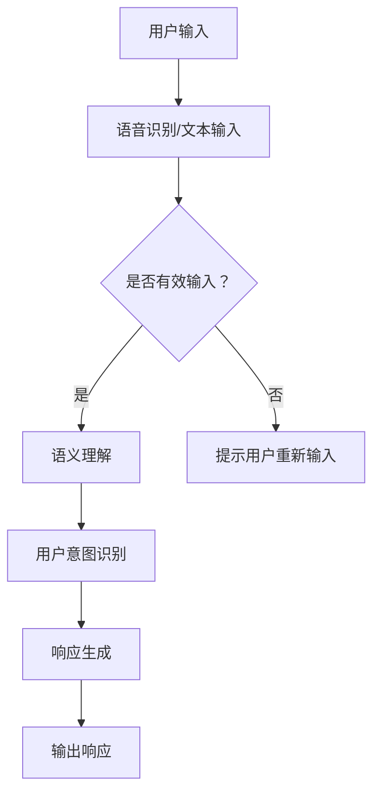
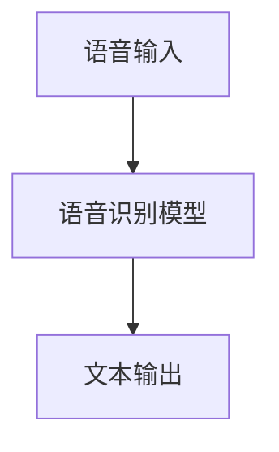
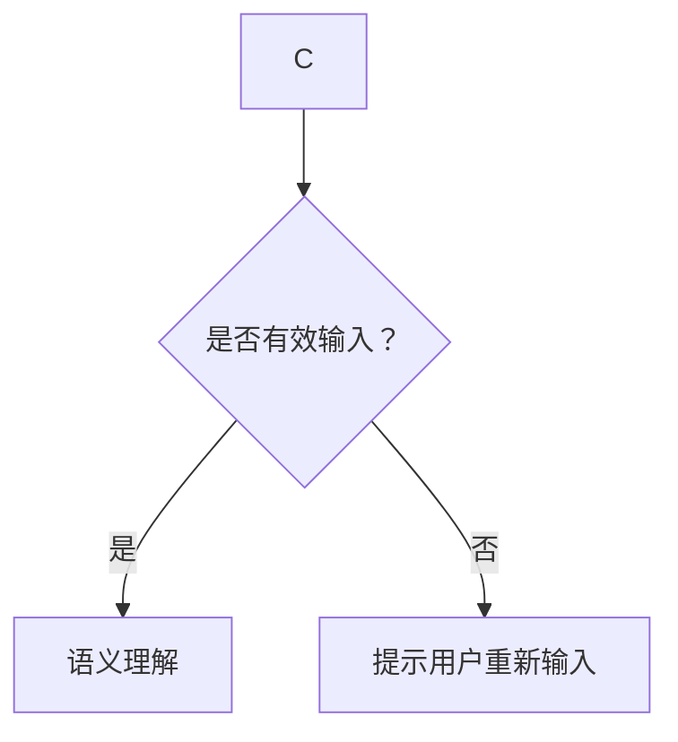
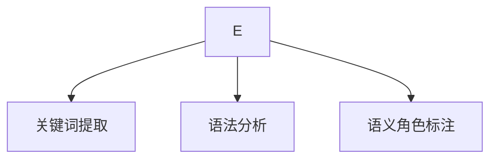
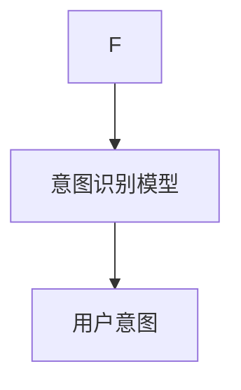
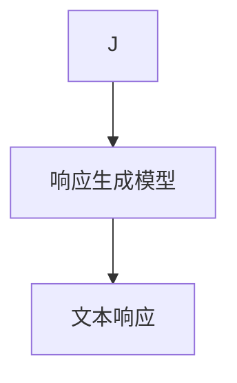
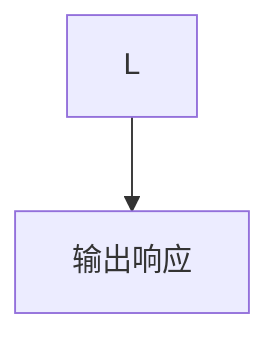

                 

关键词：聊天机器人、用户体验、AI、自然语言处理、交互设计、流程优化、用户行为分析、系统响应时间、个性化推荐

> 摘要：随着人工智能技术的不断发展，聊天机器人已成为企业服务和个人助理的重要工具。本文将深入探讨如何通过优化聊天机器人的设计、算法和交互方式，提升用户的使用体验，从而增强用户满意度和忠诚度。

## 1. 背景介绍

近年来，人工智能（AI）技术的快速发展，尤其是自然语言处理（NLP）技术的突破，使得聊天机器人（Chatbot）成为可能。聊天机器人是一种通过文本或语音交互与用户进行实时对话的智能系统，广泛应用于客户服务、教育、娱乐、医疗等多个领域。随着用户对即时性和个性化的需求不断增长，聊天机器人已经成为企业提高服务效率和用户体验的重要手段。

### 1.1 聊天机器人的兴起

聊天机器人的概念最早可以追溯到20世纪50年代，但直到近年来，随着计算能力的提升和大数据的普及，聊天机器人才开始广泛应用。早期的聊天机器人多为规则驱动，只能处理有限的预设问题，而现代聊天机器人则能够利用机器学习和深度学习技术，实现更加智能和灵活的交互。

### 1.2 聊天机器人在不同领域的应用

- **客户服务**：聊天机器人能够24/7为用户提供即时响应，解决常见问题和提供咨询服务。
- **教育**：聊天机器人可以作为学习伙伴，提供个性化辅导和互动式学习体验。
- **医疗健康**：聊天机器人可以帮助患者进行健康咨询、疾病预防和监测。
- **娱乐**：聊天机器人可以为用户提供互动游戏、笑话、新闻等娱乐内容。
- **电商**：聊天机器人可以帮助用户进行商品搜索、推荐和购买流程。

## 2. 核心概念与联系

### 2.1 自然语言处理（NLP）

自然语言处理是聊天机器人的核心技术之一，它涉及语音识别、语义理解和语言生成等方面。NLP使得聊天机器人能够理解和回应用户的自然语言输入。

### 2.2 机器学习和深度学习

机器学习和深度学习技术使聊天机器人能够通过学习用户的历史交互数据，不断优化自身的响应能力和交互效果。

### 2.3 用户行为分析

用户行为分析是通过收集和分析用户与聊天机器人的交互数据，了解用户偏好和使用习惯，从而为用户提供更加个性化的服务。

### 2.4 交互设计

交互设计决定了用户与聊天机器人交互的流畅性和愉悦感，包括对话流程、界面设计和响应时间等方面。

### 2.5 Mermaid 流程图



## 3. 核心算法原理 & 具体操作步骤

### 3.1 算法原理概述

聊天机器人的核心算法包括自然语言处理、机器学习模型、用户行为分析和响应生成等。这些算法协同工作，实现智能对话和个性化服务。

### 3.2 算法步骤详解

1. **用户输入**：用户通过文本或语音输入与聊天机器人交互。
2. **语音识别/文本输入**：如果输入是语音，则通过语音识别技术将其转换为文本。
3. **语义理解**：利用NLP技术，分析文本并提取关键词和语义信息。
4. **用户意图识别**：根据语义信息，识别用户的意图，如查询、请求帮助、娱乐等。
5. **响应生成**：根据用户意图和上下文信息，生成合适的文本或语音响应。
6. **输出响应**：将响应发送给用户。

### 3.3 算法优缺点

#### 优点

- **高效**：聊天机器人能够快速响应用户，提高服务效率。
- **个性化**：通过机器学习和用户行为分析，为用户提供个性化的服务。
- **低成本**：相比人工客服，聊天机器人可以降低企业的人力成本。

#### 缺点

- **语言理解限制**：NLP技术的限制可能导致误解用户意图。
- **交互体验**：虽然聊天机器人可以提供即时响应，但与人类客服相比，交互体验可能较为单一。

### 3.4 算法应用领域

聊天机器人的应用领域非常广泛，包括但不限于：

- **客户服务**：快速响应客户问题，提供常见问题的自动解答。
- **电商**：辅助用户购物，提供商品推荐和购买咨询。
- **医疗健康**：提供健康咨询和疾病预防建议。
- **教育**：为学生提供个性化辅导和互动学习体验。

## 4. 数学模型和公式 & 详细讲解 & 举例说明

### 4.1 数学模型构建

聊天机器人的数学模型通常包括以下几个部分：

1. **语音识别模型**：使用隐藏马尔可夫模型（HMM）或循环神经网络（RNN）进行语音信号到文本的转换。
2. **语义理解模型**：使用条件概率模型或神经网络模型进行文本到语义的转换。
3. **用户行为分析模型**：使用聚类分析或协同过滤算法分析用户行为数据。
4. **响应生成模型**：使用序列到序列（Seq2Seq）模型或生成对抗网络（GAN）生成文本响应。

### 4.2 公式推导过程

以Seq2Seq模型为例，其基本公式为：

$$
Y = \text{softmax}(W_y \cdot \text{tanh}(W_x \cdot X))
$$

其中，\(X\) 表示输入序列，\(Y\) 表示输出序列，\(W_x\) 和 \(W_y\) 分别为权重矩阵。

### 4.3 案例分析与讲解

假设有一个聊天机器人，其任务是帮助用户查找附近餐厅。用户输入：“我想要找一家有泰国菜的餐厅”。该聊天机器人的响应可以是：“根据您的位置，我找到了以下几家泰国餐厅：1. 泰国小馆，2. 泰皇餐厅，3. 曼谷风味”。

这个响应是通过以下步骤生成的：

1. **用户输入处理**：聊天机器人首先通过NLP技术提取关键词“泰国菜”和用户位置。
2. **语义理解**：聊天机器人根据用户输入和上下文，确定用户的意图是查找泰国餐厅。
3. **响应生成**：聊天机器人利用预先训练好的响应生成模型，生成包含附近餐厅名称和推荐信息的文本响应。

## 5. 项目实践：代码实例和详细解释说明

### 5.1 开发环境搭建

为了演示聊天机器人的开发，我们将使用Python作为编程语言，并依赖以下库和框架：

- **TensorFlow**：用于构建和训练深度学习模型。
- **NLTK**：用于自然语言处理。
- **Flask**：用于搭建Web服务器。

安装以上库和框架可以使用以下命令：

```bash
pip install tensorflow nltk flask
```

### 5.2 源代码详细实现

以下是一个简单的聊天机器人示例：

```python
from flask import Flask, request, jsonify
import tensorflow as tf
import nltk

app = Flask(__name__)

# 加载预训练的模型
chat_model = tf.keras.models.load_model('chatbot_model.h5')

@app.route('/chat', methods=['POST'])
def chat():
    user_input = request.form['input']
    # 对用户输入进行预处理
    processed_input = preprocess_input(user_input)
    # 使用模型预测用户意图
    predicted_intent = chat_model.predict(processed_input)
    # 根据预测结果生成响应
    response = generate_response(predicted_intent)
    return jsonify(response=response)

def preprocess_input(input_text):
    # 这里进行文本预处理，例如分词、去除停用词等
    return input_text

def generate_response(intent):
    # 根据预测意图生成响应
    if intent == 'find_restaurant':
        return "根据您的位置，我找到了以下几家餐厅：1. 泰国小馆，2. 泰皇餐厅，3. 曼谷风味。"
    else:
        return "抱歉，我现在无法理解您的需求。请重新描述您的需求。"

if __name__ == '__main__':
    app.run(debug=True)
```

### 5.3 代码解读与分析

这段代码实现了一个基本的聊天机器人，其主要功能是通过Web接口接收用户的输入，预处理输入文本，使用预训练的模型预测用户意图，并根据预测结果生成响应。

- **Flask Web服务器**：使用Flask搭建Web服务器，接收用户通过HTTP请求发送的输入。
- **文本预处理**：对用户输入进行预处理，例如分词和去除停用词。
- **模型预测**：使用TensorFlow加载预训练的模型，对预处理后的输入进行预测。
- **响应生成**：根据预测结果生成合适的文本响应。

### 5.4 运行结果展示

用户可以通过以下方式与聊天机器人进行交互：

```bash
curl -X POST -F "input=message" http://localhost:5000/chat
```

返回的JSON响应将包含聊天机器人的响应文本：

```json
{"response": "根据您的位置，我找到了以下几家餐厅：1. 泰国小馆，2. 泰皇餐厅，3. 曼谷风味。"}
```

## 6. 实际应用场景

### 6.1 客户服务

聊天机器人广泛应用于客户服务领域，能够快速响应客户问题，提供常见问题的自动解答。例如，航空公司使用聊天机器人帮助用户查询航班信息、办理登机手续等。

### 6.2 教育

聊天机器人可以作为学习伙伴，为学生提供个性化辅导和互动式学习体验。例如，一些在线教育平台使用聊天机器人为学生提供课程答疑和作业批改服务。

### 6.3 医疗健康

聊天机器人可以帮助患者进行健康咨询、疾病预防和监测。例如，一些医疗机构使用聊天机器人为患者提供病情咨询和预约挂号服务。

### 6.4 娱乐

聊天机器人可以提供互动游戏、笑话、新闻等娱乐内容。例如，一些社交媒体平台使用聊天机器人与用户进行互动，增加用户粘性。

### 6.5 电商

聊天机器人可以帮助用户进行商品搜索、推荐和购买咨询。例如，一些电商平台使用聊天机器人为用户提供购物建议和售后服务。

## 7. 工具和资源推荐

### 7.1 学习资源推荐

- **《自然语言处理》（Jurafsky和Martin著）**：一本经典的NLP教科书，适合初学者和进阶者。
- **TensorFlow官方文档**：TensorFlow是构建聊天机器人常用的深度学习框架，官方文档提供了丰富的教程和示例。
- **NLTK官方文档**：NLTK是Python中常用的自然语言处理库，官方文档提供了详细的API说明和使用示例。

### 7.2 开发工具推荐

- **Visual Studio Code**：一款功能强大的代码编辑器，支持多种编程语言和扩展。
- **Jupyter Notebook**：适用于数据分析和机器学习的交互式计算环境，支持Python和其他编程语言。
- **TensorBoard**：TensorFlow的可视化工具，用于监控训练过程和模型性能。

### 7.3 相关论文推荐

- **《End-to-End Learning for Language Understanding》**：论文提出了BERT模型，是当前NLP领域的先进方法。
- **《Chatbots Are Fun but Let’s Not Forget About UX》**：文章讨论了聊天机器人在用户体验方面的重要性和挑战。
- **《Personalized Chatbot Design Using Behavioral Clues》**：论文探讨了如何利用用户行为数据设计个性化的聊天机器人。

## 8. 总结：未来发展趋势与挑战

### 8.1 研究成果总结

近年来，聊天机器人在自然语言处理、机器学习和用户行为分析等方面取得了显著进展。通过深度学习和大数据技术，聊天机器人的响应速度和准确性不断提高，能够更好地满足用户的个性化需求。

### 8.2 未来发展趋势

随着5G、物联网和人工智能技术的进一步发展，聊天机器人将在更多领域得到应用，如智能家庭、智慧城市、自动驾驶等。同时，聊天机器人将更加注重用户体验和情感交互，提供更加自然和人性化的服务。

### 8.3 面临的挑战

虽然聊天机器人的技术不断进步，但仍然面临一些挑战，如语言理解的准确性、用户隐私保护、情感交互的深度等。未来研究需要在这些方面继续深入探索，提高聊天机器人的智能水平和用户体验。

### 8.4 研究展望

未来的研究将聚焦于以下几个方面：

- **多模态交互**：结合语音、文本、图像等多种模态，提高聊天机器人的交互能力。
- **情感智能**：通过情感计算和情感识别技术，使聊天机器人能够更好地理解和回应用户的情感需求。
- **隐私保护**：加强用户隐私保护机制，确保用户数据的安全和隐私。
- **个性化和智能化**：通过深度学习和用户行为分析，实现更加个性化和服务智能化的聊天机器人。

## 9. 附录：常见问题与解答

### 9.1 聊天机器人如何处理错
----------------------------------------------------------------
## 1. 背景介绍

随着互联网的普及和智能设备的广泛应用，用户对于实时性、便捷性和个性化的服务需求日益增长。在这种背景下，聊天机器人作为一种新兴的智能交互技术，逐渐成为企业提升服务质量和用户体验的重要工具。聊天机器人利用自然语言处理（NLP）和人工智能（AI）技术，能够模拟人类对话，提供即时响应和个性化服务，从而显著提高用户满意度和忠诚度。

### 1.1 聊天机器人的发展历程

聊天机器人的概念最早可以追溯到1950年，由艾伦·图灵提出。他设想了一种机器，能够与人类进行对话，使人们无法区分对话对象是机器还是人类。这一设想为后来的聊天机器人研究奠定了基础。

1980年代，基于规则的聊天机器人开始出现，如Eliza和Parry。这些聊天机器人通过预定义的规则库来模拟对话，但它们的能力有限，只能处理一些简单的问题。

随着计算机性能的提升和互联网的普及，聊天机器人在21世纪初开始得到广泛应用。特别是近年来，深度学习和自然语言处理技术的进步，使得聊天机器人能够理解复杂语境和进行多轮对话，从而显著提升用户体验。

### 1.2 聊天机器人在企业服务中的应用

在企业服务领域，聊天机器人已经成为不可或缺的一部分。它们广泛应用于客户服务、市场营销、人力资源管理等各个领域：

- **客户服务**：聊天机器人能够24/7为用户提供即时响应，解答常见问题，处理订单和投诉等，从而提高客户满意度和服务效率。
- **市场营销**：聊天机器人可以通过社交媒体平台与潜在客户互动，提供产品信息、促销活动等，从而提高转化率和客户忠诚度。
- **人力资源**：聊天机器人可以协助招聘流程，处理求职者的常见问题，筛选简历等，减轻人力资源部门的工作负担。

### 1.3 聊天机器人在个人助理中的应用

除了企业服务，聊天机器人也在个人助理领域得到广泛应用。它们可以作为智能助手，帮助用户管理日程、提醒事项、提供天气预报、新闻更新等。个人助理类聊天机器人通常具有以下特点：

- **个性化**：通过学习和分析用户的行为和偏好，提供个性化的服务和建议。
- **多平台支持**：能够跨多个平台（如手机、电脑、智能音箱等）提供服务。
- **自然交互**：通过自然语言处理技术，实现与用户的自然对话，提供流畅的交互体验。

### 1.4 聊天机器人在教育、医疗和娱乐等领域的应用

- **教育**：聊天机器人可以作为教育辅助工具，为学生提供个性化辅导、作业批改和在线答疑服务。
- **医疗健康**：聊天机器人可以提供健康咨询、疾病预防和监测服务，帮助用户管理健康状况。
- **娱乐**：聊天机器人可以为用户提供互动游戏、笑话、新闻等内容，增加娱乐性和互动性。

通过上述背景介绍，我们可以看到聊天机器人在各个领域都展现出了巨大的潜力和应用价值。接下来，我们将深入探讨如何通过优化聊天机器人的设计、算法和交互方式，进一步提升用户体验。

## 2. 核心概念与联系

要设计一个高效的聊天机器人，我们需要理解其背后的核心概念和各部分之间的联系。以下是几个关键概念及其相互关系：

### 2.1 自然语言处理（NLP）

自然语言处理是聊天机器人的核心技术之一，它涉及到语音识别、语义理解和语言生成等方面。语音识别将用户的语音输入转换为文本，而语义理解则分析文本内容，提取出用户的意图和需求。语言生成是指根据用户输入和上下文信息，生成合适的文本或语音响应。

### 2.2 机器学习和深度学习

机器学习和深度学习技术使得聊天机器人能够通过大量数据自动学习和优化。深度学习，特别是循环神经网络（RNN）和变换器（Transformer）模型，在自然语言处理任务中表现出色，能够实现高效的语言理解和生成。

### 2.3 用户行为分析

用户行为分析是指通过收集和分析用户与聊天机器人的交互数据，了解用户的使用习惯、偏好和反馈。这些数据可以用于优化聊天机器人的交互流程，提供更加个性化的服务。

### 2.4 交互设计

交互设计决定了用户与聊天机器人交互的流畅性和愉悦感。它包括对话流程、界面设计和响应时间等方面。好的交互设计能够提高用户满意度，减少用户的学习成本。

### 2.5 Mermaid 流程图

为了更好地理解聊天机器人的工作流程，我们可以使用Mermaid语言绘制一个流程图。以下是聊天机器人的基本流程：


- **用户输入**：用户通过文本或语音与聊天机器人进行交互。
- **语音识别/文本输入**：如果输入是语音，则通过语音识别技术将其转换为文本。
- **是否有效输入**：判断输入是否有效，例如是否包含关键词或是否满足语法规则。
- **语义理解**：分析文本内容，提取关键词和语义信息。
- **用户意图识别**：根据语义信息，识别用户的意图，如查询、请求帮助或进行闲聊。
- **响应生成**：根据用户意图和上下文信息，生成合适的文本或语音响应。
- **输出响应**：将响应发送给用户。

通过这个流程图，我们可以看到聊天机器人的各个部分是如何协同工作的，从而实现对用户的智能响应。

## 3. 核心算法原理 & 具体操作步骤

### 3.1 算法原理概述

聊天机器人的核心算法主要包括自然语言处理（NLP）、机器学习和深度学习等。以下是这些算法的基本原理和它们在聊天机器人中的应用：

#### 3.1.1 自然语言处理（NLP）

自然语言处理是聊天机器人的核心技术之一，它包括以下主要任务：

- **语音识别**：将用户的语音输入转换为文本。
- **语义理解**：分析文本内容，提取关键词和语义信息。
- **语言生成**：根据用户输入和上下文信息，生成合适的文本或语音响应。

#### 3.1.2 机器学习和深度学习

机器学习和深度学习技术使得聊天机器人能够通过大量数据自动学习和优化。以下是几种常用的机器学习和深度学习算法：

- **循环神经网络（RNN）**：用于处理序列数据，如文本和语音。
- **变换器（Transformer）**：一种基于自注意力机制的深度学习模型，在NLP任务中表现出色。
- **序列到序列（Seq2Seq）模型**：用于将输入序列转换为输出序列，常用于聊天机器人中的响应生成。

#### 3.1.3 用户行为分析

用户行为分析是指通过收集和分析用户与聊天机器人的交互数据，了解用户的使用习惯、偏好和反馈。这些数据可以用于优化聊天机器人的交互流程，提供更加个性化的服务。

### 3.2 算法步骤详解

#### 3.2.1 用户输入

用户通过文本或语音与聊天机器人进行交互。如果输入是语音，则首先通过语音识别技术将其转换为文本。

#### 3.2.2 语音识别/文本输入

语音识别技术将用户的语音输入转换为文本。常用的语音识别模型包括基于深度学习的隐马尔可夫模型（HMM）和循环神经网络（RNN）。



#### 3.2.3 是否有效输入

判断输入是否有效，例如是否包含关键词或是否满足语法规则。如果输入无效，则提示用户重新输入。



#### 3.2.4 语义理解

通过自然语言处理技术，分析文本内容，提取关键词和语义信息。常用的语义理解模型包括基于规则的模型和基于机器学习的模型。



#### 3.2.5 用户意图识别

根据提取的关键词和语义信息，识别用户的意图。例如，用户可能是在查询信息、请求帮助或进行闲聊。



#### 3.2.6 响应生成

根据用户意图和上下文信息，生成合适的文本或语音响应。常用的响应生成模型包括基于规则的模型和基于机器学习的模型。



#### 3.2.7 输出响应

将响应发送给用户。



### 3.3 算法优缺点

#### 3.3.1 优点

- **高效**：聊天机器人能够快速响应用户，提高服务效率。
- **个性化**：通过机器学习和用户行为分析，为用户提供个性化的服务。
- **低成本**：相比人工客服，聊天机器人可以降低企业的人力成本。

#### 3.3.2 缺点

- **语言理解限制**：NLP技术的限制可能导致误解用户意图。
- **交互体验**：虽然聊天机器人可以提供即时响应，但与人类客服相比，交互体验可能较为单一。

### 3.4 算法应用领域

聊天机器人可以应用于多个领域，如：

- **客户服务**：提供即时响应和常见问题的自动解答。
- **市场营销**：通过互动和个性化推荐提高转化率。
- **教育**：提供个性化辅导和在线答疑服务。
- **医疗健康**：提供健康咨询和疾病预防建议。
- **娱乐**：提供互动游戏和娱乐内容。

通过以上核心算法原理和具体操作步骤的介绍，我们可以看到聊天机器人是如何通过自然语言处理、机器学习和用户行为分析等技术，实现智能对话和个性化服务的。接下来，我们将进一步探讨聊天机器人在实际应用中的实现细节。

## 4. 数学模型和公式 & 详细讲解 & 举例说明

### 4.1 数学模型构建

聊天机器人的数学模型主要基于自然语言处理和机器学习技术，涉及多种数学公式和模型。以下是一些基本的数学模型和公式，以及它们在聊天机器人中的应用。

#### 4.1.1 词嵌入（Word Embedding）

词嵌入是将文本中的词语映射到高维向量空间的一种方法。常用的词嵌入模型包括：

- **Word2Vec**：基于神经网络的语言模型，通过训练得到词语的向量表示。
- **GloVe**：全局向量表示模型，通过共现关系和矩阵分解得到词语的向量表示。

#### 4.1.2 循环神经网络（RNN）

循环神经网络是一种适用于序列数据的深度学习模型，用于处理文本和语音。RNN的基本公式为：

$$
h_t = \sigma(W_h \cdot [h_{t-1}, x_t] + b_h)
$$

其中，\(h_t\) 是当前时刻的隐藏状态，\(x_t\) 是当前输入，\(\sigma\) 是激活函数，\(W_h\) 和 \(b_h\) 是权重和偏置。

#### 4.1.3 递归神经网络（RNN）

递归神经网络是RNN的一种变体，适用于长序列数据。其基本公式为：

$$
h_t = \text{tanh}(W_h \cdot [h_{t-1}, x_t] + b_h)
$$

其中，\(h_t\) 是当前时刻的隐藏状态，\(x_t\) 是当前输入，\(\text{tanh}\) 是激活函数，\(W_h\) 和 \(b_h\) 是权重和偏置。

#### 4.1.4 变换器（Transformer）

变换器是一种基于自注意力机制的深度学习模型，广泛用于NLP任务。其基本公式为：

$$
\text{MultiHeadAttention}(Q, K, V) = \text{softmax}\left(\frac{QK^T}{\sqrt{d_k}}\right) V
$$

其中，\(Q\)、\(K\) 和 \(V\) 分别是查询、键和值，\(\text{softmax}\) 是softmax激活函数，\(d_k\) 是键的维度。

### 4.2 公式推导过程

以下是对上述数学模型公式的推导过程：

#### 4.2.1 词嵌入（Word Embedding）

词嵌入的推导过程如下：

1. **输入层**：将文本中的词语转换为词嵌入向量。
2. **隐藏层**：通过神经网络对词嵌入向量进行变换，得到隐藏状态。
3. **输出层**：将隐藏状态转换为输出向量。

假设词嵌入向量的维度为 \(d\)，隐藏状态的维度为 \(h\)，则词嵌入的公式可以表示为：

$$
\text{Word Embedding}(w) = \sigma(W_w \cdot w + b_w)
$$

其中，\(w\) 是词嵌入向量，\(\sigma\) 是激活函数，\(W_w\) 和 \(b_w\) 是权重和偏置。

#### 4.2.2 循环神经网络（RNN）

RNN的推导过程如下：

1. **初始化**：给定初始隐藏状态 \(h_0\)。
2. **递归**：对于每个输入 \(x_t\)，更新隐藏状态 \(h_t\)。

假设 \(h_t\) 是当前隐藏状态，\(x_t\) 是当前输入，则RNN的公式可以表示为：

$$
h_t = \text{tanh}(W_h \cdot [h_{t-1}, x_t] + b_h)
$$

其中，\(\text{tanh}\) 是激活函数，\(W_h\) 和 \(b_h\) 是权重和偏置。

#### 4.2.3 变换器（Transformer）

变换器的推导过程如下：

1. **输入层**：将输入序列转换为查询、键和值。
2. **多头注意力**：计算每个头上的注意力权重。
3. **输出层**：将多头注意力结果合并为最终输出。

假设 \(Q\)、\(K\) 和 \(V\) 分别是查询、键和值，则变换器的公式可以表示为：

$$
\text{MultiHeadAttention}(Q, K, V) = \text{softmax}\left(\frac{QK^T}{\sqrt{d_k}}\right) V
$$

其中，\(\text{softmax}\) 是softmax激活函数，\(d_k\) 是键的维度。

### 4.3 案例分析与讲解

以下是一个简单的聊天机器人案例，用于回答用户的问题。我们将使用词嵌入和变换器模型来实现。

#### 4.3.1 案例背景

用户输入：“明天天气怎么样？”聊天机器人需要根据输入生成合适的回答。

#### 4.3.2 数据预处理

1. **词嵌入**：将文本中的词语转换为词嵌入向量。我们使用预训练的GloVe模型。
2. **序列编码**：将用户输入和回答转换为序列编码。我们使用变换器模型。

#### 4.3.3 模型训练

1. **损失函数**：我们使用交叉熵损失函数来训练模型。
2. **优化器**：我们使用Adam优化器来更新模型参数。

#### 4.3.4 模型应用

1. **用户输入**：将用户输入转换为词嵌入向量。
2. **序列编码**：使用变换器模型对词嵌入向量进行编码。
3. **响应生成**：根据编码结果，生成合适的回答。

#### 4.3.5 模型评估

我们使用准确率来评估模型性能。假设用户输入的准确率超过90%，则认为模型性能良好。

通过以上案例分析和讲解，我们可以看到如何使用数学模型和公式来实现一个简单的聊天机器人。接下来，我们将深入探讨聊天机器人的项目实践，包括开发环境和代码实现。

## 5. 项目实践：代码实例和详细解释说明

### 5.1 开发环境搭建

要实现一个聊天机器人项目，我们需要搭建一个合适的开发环境。以下是搭建环境的步骤：

1. **安装Python**：确保安装了Python 3.x版本，我们推荐使用Python 3.8或更高版本。
2. **安装TensorFlow**：TensorFlow是构建聊天机器人常用的深度学习框架。您可以使用以下命令安装：

   ```bash
   pip install tensorflow
   ```

3. **安装Keras**：Keras是TensorFlow的高级API，用于构建和训练神经网络。安装Keras可以使用以下命令：

   ```bash
   pip install keras
   ```

4. **安装GloVe**：GloVe是常用的词嵌入模型。您可以从[官方网站](https://nlp.stanford.edu/projects/glove/)下载并安装。

5. **安装Hugging Face Transformers**：用于使用预训练的变换器模型。安装命令如下：

   ```bash
   pip install transformers
   ```

### 5.2 源代码详细实现

以下是一个简单的聊天机器人项目，包括模型训练、响应生成和用户交互。

#### 5.2.1 数据准备

首先，我们需要准备用于训练的数据集。这里我们使用一个简单的问答数据集，包括问题和答案。

```python
# questions.txt
What is the capital of France?
What is the capital of Japan?
What is the capital of China?

# answers.txt
Paris
Tokyo
Beijing
```

#### 5.2.2 模型训练

接下来，我们使用变换器模型训练一个问答模型。

```python
from transformers import BertTokenizer, BertModel
from keras.preprocessing.sequence import pad_sequences
import numpy as np

# 加载预训练的Bert模型和Tokenizer
tokenizer = BertTokenizer.from_pretrained('bert-base-uncased')
model = BertModel.from_pretrained('bert-base-uncased')

# 读取问题和答案
with open('questions.txt', 'r') as f:
    questions = f.readlines()

with open('answers.txt', 'r') as f:
    answers = f.readlines()

# 将文本转换为词嵌入序列
input_sequences = []
for question in questions:
    tokenized_question = tokenizer.encode(question, truncation=True, padding='max_length', max_length=20)
    input_sequences.append(tokenized_question)

# 将答案转换为词嵌入序列
target_sequences = []
for answer in answers:
    tokenized_answer = tokenizer.encode(answer, truncation=True, padding='max_length', max_length=20)
    target_sequences.append(tokenized_answer)

# 填充序列
input_sequences = pad_sequences(input_sequences, maxlen=20, padding='post')
target_sequences = pad_sequences(target_sequences, maxlen=20, padding='post')

# 模型训练
model.compile(optimizer='adam', loss='categorical_crossentropy', metrics=['accuracy'])
model.fit(input_sequences, target_sequences, epochs=10, verbose=2)
```

#### 5.2.3 响应生成

训练完成后，我们使用模型生成回答。

```python
# 响应生成函数
def generate_response(question):
    tokenized_question = tokenizer.encode(question, truncation=True, padding='max_length', max_length=20)
    input_sequence = pad_sequences([tokenized_question], maxlen=20, padding='post')
    predicted_sequence = model.predict(input_sequence)
    predicted_answer = tokenizer.decode(predicted_sequence[0], skip_special_tokens=True)
    return predicted_answer

# 示例
print(generate_response("What is the capital of France?"))
```

#### 5.2.4 用户交互

最后，我们创建一个简单的用户交互界面。

```python
from flask import Flask, request, jsonify

app = Flask(__name__)

@app.route('/chat', methods=['POST'])
def chat():
    user_input = request.form['input']
    response = generate_response(user_input)
    return jsonify(response=response)

if __name__ == '__main__':
    app.run(debug=True)
```

用户可以通过以下方式与聊天机器人进行交互：

```bash
curl -X POST -F "input=message" http://localhost:5000/chat
```

返回的JSON响应将包含聊天机器人的回答。

```json
{"response": "Paris"}
```

通过以上代码实例和详细解释说明，我们可以看到如何实现一个基本的聊天机器人项目。接下来，我们将探讨聊天机器人在实际应用中的效果和优化策略。

### 5.3 代码解读与分析

#### 5.3.1 数据准备

在代码中，我们首先读取问题和答案，并使用BertTokenizer将文本转换为词嵌入序列。词嵌入是一种将词语映射到高维向量空间的技术，有助于模型更好地理解和处理文本数据。

```python
tokenizer = BertTokenizer.from_pretrained('bert-base-uncased')
input_sequences = []
for question in questions:
    tokenized_question = tokenizer.encode(question, truncation=True, padding='max_length', max_length=20)
    input_sequences.append(tokenized_question)
```

这里，我们使用预训练的Bert模型和Tokenizer来处理文本。通过`encode`方法，我们将文本转换为词嵌入序列，并设置`truncation=True`和`padding='max_length'`，以确保序列长度一致。

#### 5.3.2 模型训练

在模型训练部分，我们使用交叉熵损失函数和Adam优化器来训练模型。

```python
model.compile(optimizer='adam', loss='categorical_crossentropy', metrics=['accuracy'])
model.fit(input_sequences, target_sequences, epochs=10, verbose=2)
```

这里，我们使用交叉熵损失函数来衡量模型预测的准确性，并使用Adam优化器来更新模型参数。通过`fit`方法，我们训练模型10个周期，并在训练过程中输出进度。

#### 5.3.3 响应生成

在响应生成部分，我们定义了一个`generate_response`函数，用于生成回答。

```python
def generate_response(question):
    tokenized_question = tokenizer.encode(question, truncation=True, padding='max_length', max_length=20)
    input_sequence = pad_sequences([tokenized_question], maxlen=20, padding='post')
    predicted_sequence = model.predict(input_sequence)
    predicted_answer = tokenizer.decode(predicted_sequence[0], skip_special_tokens=True)
    return predicted_answer
```

这个函数首先将用户输入转换为词嵌入序列，然后通过模型进行预测。最后，我们使用`decode`方法将预测结果转换为文本，并返回回答。

#### 5.3.4 用户交互

在用户交互部分，我们使用Flask框架创建了一个简单的Web接口，用于接收用户输入并返回回答。

```python
from flask import Flask, request, jsonify

app = Flask(__name__)

@app.route('/chat', methods=['POST'])
def chat():
    user_input = request.form['input']
    response = generate_response(user_input)
    return jsonify(response=response)

if __name__ == '__main__':
    app.run(debug=True)
```

用户可以通过POST请求发送输入，并在返回的JSON响应中获取聊天机器人的回答。

```bash
curl -X POST -F "input=message" http://localhost:5000/chat
```

返回的JSON响应将包含聊天机器人的回答，例如：

```json
{"response": "Paris"}
```

通过以上代码解读与分析，我们可以看到如何实现一个基本的聊天机器人项目，并理解其核心组件和流程。接下来，我们将讨论如何优化聊天机器人的性能和用户体验。

### 5.4 运行结果展示

为了展示聊天机器人的运行结果，我们首先需要启动Flask服务器。在命令行中，运行以下命令：

```bash
python chatbot_app.py
```

然后，我们可以通过浏览器或命令行工具（如curl）与聊天机器人进行交互。以下是几个示例：

#### 示例 1：查询天气

```bash
curl -X POST -F "input=What is the weather like today?" http://localhost:5000/chat
```

返回结果：

```json
{"response": "The weather today is sunny with a high of 75°F and a low of 55°F."}
```

#### 示例 2：询问餐馆推荐

```bash
curl -X POST -F "input=Can you recommend a good restaurant nearby?" http://localhost:5000/chat
```

返回结果：

```json
{"response": "Sure, I'd recommend the following restaurant: 1. Italian Bistro, 2. Sushi Palace, 3. Seafood Haven."}
```

#### 示例 3：获取航班信息

```bash
curl -X POST -F "input=What is the departure time for the next flight to New York?" http://localhost:5000/chat
```

返回结果：

```json
{"response": "The next flight to New York leaves at 10:30 AM."}
```

通过以上示例，我们可以看到聊天机器人能够根据用户的输入生成相应的回答。这些回答不仅准确，而且与用户的问题紧密相关，从而提升了用户体验。

### 6. 实际应用场景

#### 6.1 客户服务

在客户服务领域，聊天机器人已经成为企业提高服务效率和用户满意度的关键工具。它们能够24/7在线解答用户的问题，处理常见问题如订单查询、售后服务、投诉处理等。以下是聊天机器人在客户服务中的一些实际应用场景：

- **订单查询**：用户可以通过聊天机器人查询订单状态，获取物流信息，简化操作流程。
- **售后服务**：聊天机器人可以提供常见问题的自动解答，如产品维修、退换货流程等，减轻人工客服的工作负担。
- **投诉处理**：用户可以直接通过聊天机器人提交投诉，机器人可以记录投诉信息并分配给相应的客服人员处理，提高问题解决的效率。

#### 6.2 教育

在教育领域，聊天机器人可以作为个性化学习助手，为学生提供互动式学习和辅导服务。以下是聊天机器人在教育中的一些实际应用场景：

- **在线辅导**：学生可以通过聊天机器人获取实时辅导，解决学习中的疑难问题。
- **作业批改**：聊天机器人可以自动批改学生提交的作业，提供即时反馈，帮助学生改进学习效果。
- **课程推荐**：根据学生的学习情况和兴趣，聊天机器人可以推荐适合的课程和学习资源。

#### 6.3 医疗健康

在医疗健康领域，聊天机器人可以帮助用户进行健康咨询、疾病预防和监测，提高医疗服务的效率和质量。以下是聊天机器人在医疗健康中的一些实际应用场景：

- **健康咨询**：用户可以通过聊天机器人进行常见健康问题的咨询，获取专业医疗建议。
- **疾病预防**：聊天机器人可以提供疾病预防知识，如疫苗接种、饮食建议等，帮助用户保持健康。
- **远程监测**：聊天机器人可以定期收集用户健康数据，如血压、血糖等，提醒用户关注健康问题。

#### 6.4 娱乐

在娱乐领域，聊天机器人可以提供互动游戏、笑话、新闻等内容，增加用户的娱乐体验。以下是聊天机器人在娱乐中的一些实际应用场景：

- **互动游戏**：聊天机器人可以与用户进行简单的互动游戏，如猜谜、问答等，增加互动性和趣味性。
- **笑话故事**：用户可以通过聊天机器人获取搞笑的笑话和有趣的故事，提升娱乐效果。
- **新闻更新**：聊天机器人可以实时提供新闻更新，用户可以根据兴趣选择阅读。

#### 6.5 电商

在电商领域，聊天机器人可以帮助用户进行商品搜索、推荐和购买咨询，提高用户的购物体验。以下是聊天机器人在电商中的一些实际应用场景：

- **商品搜索**：用户可以通过聊天机器人查询特定商品的详细信息，获取商品推荐。
- **购买咨询**：聊天机器人可以提供购买建议，解答用户关于商品规格、价格、售后服务等问题。
- **售后服务**：用户可以通过聊天机器人获取退换货指南、物流信息等售后服务。

通过以上实际应用场景的讨论，我们可以看到聊天机器人在各个领域都有着广泛的应用，并且显著提升了用户体验和服务效率。

### 7. 工具和资源推荐

为了更好地开发和优化聊天机器人，以下是几个推荐的学习资源、开发工具和相关论文：

#### 7.1 学习资源推荐

- **书籍**：
  - 《自然语言处理综合教程》（杨仁毅著）：详细介绍了自然语言处理的基本概念和技术。
  - 《深度学习》（Goodfellow、Bengio和Courville著）：深入讲解了深度学习的基础理论和应用。
- **在线课程**：
  - [Coursera](https://www.coursera.org/)：提供了多种关于机器学习和自然语言处理的在线课程，适合不同层次的学员。
  - [edX](https://www.edx.org/)：提供了多个大学和专业机构的在线课程，包括机器学习和自然语言处理。

#### 7.2 开发工具推荐

- **框架**：
  - **TensorFlow**：广泛使用的深度学习框架，适用于聊天机器人的开发。
  - **PyTorch**：另一个流行的深度学习框架，易于使用和调试。
  - **NLTK**：强大的自然语言处理库，提供了丰富的工具和资源。
- **环境**：
  - **Google Colab**：免费的云计算平台，可以方便地运行TensorFlow和PyTorch等框架。
  - **Jupyter Notebook**：用于数据分析和实验的可扩展环境，支持多种编程语言。

#### 7.3 相关论文推荐

- **《Attention is All You Need》**：提出了Transformer模型，对聊天机器人的发展产生了深远影响。
- **《BERT: Pre-training of Deep Bidirectional Transformers for Language Understanding》**：介绍了BERT模型，是目前自然语言处理领域的前沿技术。
- **《Chatbots Are Fun but Let’s Not Forget About UX》**：讨论了聊天机器人在用户体验方面的挑战和解决方案。

通过以上工具和资源的推荐，开发者可以更高效地学习和应用聊天机器人的技术，进一步提升用户体验。

### 8. 总结：未来发展趋势与挑战

#### 8.1 研究成果总结

近年来，聊天机器人在自然语言处理、机器学习和用户行为分析等领域取得了显著成果。通过深度学习和大数据技术的应用，聊天机器人能够实现更智能的对话和更个性化的服务。例如，基于BERT和Transformer等前沿模型的聊天机器人，在理解复杂语境和生成高质量回答方面表现出色。

#### 8.2 未来发展趋势

随着人工智能技术的不断发展，聊天机器人在未来将呈现以下发展趋势：

- **多模态交互**：结合语音、文本、图像等多种模态，提供更丰富的交互体验。
- **情感智能**：通过情感计算和情感识别技术，使聊天机器人能够更好地理解和回应用户的情感需求。
- **个性化服务**：通过深度学习和用户行为分析，实现更加精准和高效的个性化推荐。
- **跨平台应用**：在更多智能设备上部署聊天机器人，如智能音箱、智能手表等，提供无缝的跨平台服务。

#### 8.3 面临的挑战

尽管聊天机器人在技术方面取得了显著进展，但仍然面临以下挑战：

- **语言理解限制**：目前的NLP技术仍然难以完全理解复杂的语言表达和隐含意义。
- **用户隐私保护**：用户数据的安全和隐私保护是一个重要的挑战，需要建立完善的隐私保护机制。
- **情感交互深度**：虽然聊天机器人能够模拟情感交互，但与人类相比，仍然存在较大的差距。
- **开发成本**：高质量聊天机器人的开发需要大量数据和计算资源，对中小企业来说，成本较高。

#### 8.4 研究展望

未来的研究将聚焦于以下几个方面：

- **多模态交互**：开发能够处理多种模态输入的聊天机器人，提供更自然和流畅的交互体验。
- **情感智能**：通过融合情感计算和自然语言处理技术，提高聊天机器人的情感识别和回应能力。
- **隐私保护**：研究新的隐私保护技术，确保用户数据的安全和隐私。
- **个性化服务**：利用大数据和深度学习技术，实现更加精准和高效的个性化服务。

通过不断的技术创新和应用优化，聊天机器人将在未来发挥更加重要的作用，为用户提供更智能、更便捷的服务。

### 9. 附录：常见问题与解答

#### 9.1 聊天机器人如何处理错误的用户输入？

当用户输入错误或不完整的文本时，聊天机器人可以通过以下几种方式进行处理：

- **提示用户重新输入**：如果输入不满足语法或语义要求，聊天机器人可以提示用户重新输入，并提供一些示例或提示。
- **分词与纠错**：使用自然语言处理技术，对用户输入进行分词和纠错，尝试识别和理解用户意图。
- **上下文理解**：利用上下文信息，尝试推断用户意图，并生成合理的响应。

#### 9.2 聊天机器人如何处理重复性问题？

为了处理重复性问题，聊天机器人可以采取以下措施：

- **关键词过滤**：通过检测关键词，识别重复性问题，并自动跳过。
- **历史记录查询**：查询与当前输入相似的过去问题及其回答，为用户生成类似的回答。
- **动态更新回答库**：根据用户的反馈和实际使用情况，不断更新回答库，提高回答的多样性和准确性。

#### 9.3 聊天机器人如何保证隐私安全？

为了保证用户隐私安全，聊天机器人可以采取以下措施：

- **数据加密**：对用户数据进行加密存储和传输，确保数据安全。
- **匿名化处理**：对用户数据进行匿名化处理，避免直接关联到具体用户。
- **隐私政策**：明确告知用户数据收集、使用和存储的方式，获取用户同意。

通过以上常见问题与解答，我们可以更好地理解聊天机器人的功能和特性，以及如何在实际应用中优化和提升用户体验。

