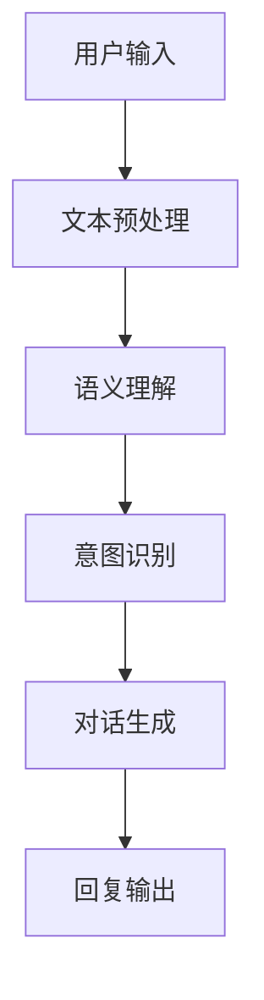
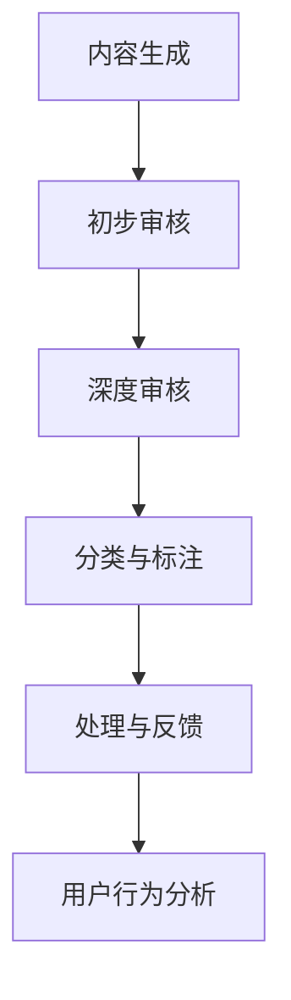

                 

关键词：聊天机器人、社交媒体、影响力、内容审核、网络健康、人工智能、算法、平台安全

> 摘要：随着社交媒体的迅速发展和普及，聊天机器人在这一领域的应用越来越广泛。本文旨在探讨聊天机器人在社交媒体上的影响力，以及如何通过有效的内容审核机制保障网络健康。本文将详细介绍聊天机器人的核心算法原理、数学模型，并结合实际项目实践，分析其在内容审核和网络安全中的应用，为未来发展趋势提供展望。

## 1. 背景介绍

在过去的几年里，聊天机器人的应用场景不断拓展，从传统的客户服务到社交互动、信息查询等多个领域。随着人工智能技术的不断进步，聊天机器人在语义理解、多模态交互等方面取得了显著成果。社交媒体平台的用户数量急剧增加，使得平台内容审核成为了亟待解决的问题。如何通过有效的算法对大量社交媒体内容进行实时审核，保障网络健康，成为了一个重要的研究方向。

本文将围绕以下问题展开讨论：

1. 聊天机器人在社交媒体上的作用和影响力。
2. 内容审核在网络健康中的重要性。
3. 聊天机器人核心算法原理及其在内容审核中的应用。
4. 数学模型在内容审核中的运用。
5. 聊天机器人实际应用场景及未来展望。

## 2. 核心概念与联系

### 2.1 聊天机器人的核心算法原理

聊天机器人的核心算法主要包括自然语言处理（NLP）、机器学习（ML）和深度学习（DL）等。以下是一个简单的 Mermaid 流程图，展示了聊天机器人核心算法的流程和相互关系。



### 2.2 内容审核在网络健康中的重要性

内容审核是保障网络健康的重要环节。一个健康的社交媒体平台需要及时识别并处理违规内容，如仇恨言论、色情内容、欺诈信息等。以下是一个简单的 Mermaid 流程图，展示了内容审核的流程。



### 2.3 聊天机器人与内容审核的关联

聊天机器人在内容审核中的应用主要体现在以下几个方面：

1. **实时监控**：通过实时分析社交媒体平台上的内容，快速识别违规信息。
2. **自动处理**：根据审核结果，自动对违规内容进行屏蔽、删除等处理。
3. **用户反馈**：根据用户举报，对相关内容进行二次审核。

## 3. 核心算法原理 & 具体操作步骤

### 3.1 算法原理概述

聊天机器人的核心算法主要包括以下部分：

1. **文本预处理**：对用户输入的文本进行分词、去噪、归一化等处理。
2. **语义理解**：通过词向量、实体识别等技术，理解文本的语义。
3. **意图识别**：根据语义理解的结果，识别用户的意图。
4. **对话生成**：根据用户的意图，生成合适的回复。
5. **回复输出**：将生成的回复输出给用户。

### 3.2 算法步骤详解

1. **文本预处理**：
   - 分词：将文本分解为单词或短语。
   - 去噪：去除文本中的无关信息，如标点符号、停用词等。
   - 归一化：将文本转换为统一的格式，如小写、去除标点等。

2. **语义理解**：
   - 词向量：将文本中的每个词映射为一个高维向量。
   - 实体识别：识别文本中的实体，如人名、地名、组织名等。
   - 语义角色标注：为每个实体标注其在句子中的角色，如主语、宾语等。

3. **意图识别**：
   - 利用机器学习或深度学习模型，根据语义理解的结果，识别用户的意图。

4. **对话生成**：
   - 利用生成式模型或检索式模型，根据用户的意图，生成合适的回复。

5. **回复输出**：
   - 将生成的回复输出给用户。

### 3.3 算法优缺点

**优点**：

- 高效：聊天机器人能够实时处理大量用户输入，提高审核效率。
- 准确：利用先进的算法和技术，提高内容审核的准确性。
- 个性化：根据用户的历史数据和偏好，生成个性化的回复。

**缺点**：

- 受数据质量影响：如果训练数据质量不佳，会影响算法的准确性和效果。
- 容易被欺骗：恶意用户可能会利用聊天机器人的漏洞，进行欺诈等行为。

### 3.4 算法应用领域

聊天机器人算法在多个领域具有广泛的应用，如：

- **社交媒体**：实时监控和审核社交媒体平台的内容。
- **客服**：提供智能客服，解答用户疑问。
- **智能助理**：为用户提供个性化服务。

## 4. 数学模型和公式 & 详细讲解 & 举例说明

### 4.1 数学模型构建

在聊天机器人算法中，常用的数学模型包括：

1. **词向量模型**：如 Word2Vec、GloVe 等。
2. **循环神经网络（RNN）**：如 LSTM、GRU 等。
3. **生成对抗网络（GAN）**：用于生成回复。
4. **卷积神经网络（CNN）**：用于文本分类。

### 4.2 公式推导过程

以 LSTM 为例，LSTM 的核心公式如下：

$$
\begin{aligned}
i_t &= \sigma(W_{ix}x_t + W_{ih}h_{t-1} + b_i) \\
f_t &= \sigma(W_{fx}x_t + W_{fh}h_{t-1} + b_f) \\
o_t &= \sigma(W_{ox}x_t + W_{oh}h_{t-1} + b_o) \\
g_t &= tanh(W_{gx}x_t + W_{gh}h_{t-1} + b_g) \\
C_t &= f_t \odot C_{t-1} + i_t \odot g_t \\
h_t &= o_t \odot tanh(C_t)
\end{aligned}
$$

其中，$x_t$ 为输入，$h_t$ 为隐藏状态，$C_t$ 为细胞状态，$i_t$、$f_t$、$o_t$、$g_t$ 分别为输入门、遗忘门、输出门和生成门。

### 4.3 案例分析与讲解

假设我们要构建一个简单的聊天机器人，用于回复用户的提问。以下是一个基于 LSTM 的聊天机器人模型。

1. **数据预处理**：

首先，我们需要对数据进行预处理，包括分词、去噪和归一化等。假设我们已经得到了一个预处理后的数据集，其中每条数据包含一个输入句子和一个标签。

2. **模型构建**：

使用 TensorFlow 和 Keras，我们可以构建一个简单的 LSTM 模型。

```python
from tensorflow.keras.models import Sequential
from tensorflow.keras.layers import LSTM, Dense, Embedding

model = Sequential()
model.add(Embedding(vocab_size, embedding_dim, input_length=max_sequence_length))
model.add(LSTM(units=128, return_sequences=True))
model.add(LSTM(units=128))
model.add(Dense(units=1, activation='sigmoid'))

model.compile(optimizer='adam', loss='binary_crossentropy', metrics=['accuracy'])
```

3. **模型训练**：

使用预处理后的数据集，对模型进行训练。

```python
model.fit(X_train, y_train, epochs=10, batch_size=32)
```

4. **模型评估**：

使用测试集对模型进行评估。

```python
loss, accuracy = model.evaluate(X_test, y_test)
print("测试集损失：", loss)
print("测试集准确率：", accuracy)
```

5. **模型应用**：

将训练好的模型用于回复用户的提问。

```python
def predict_sentence(input_sentence):
    input_sequence = pad_sequences([vectorize_sentence(input_sentence)], maxlen=max_sequence_length, padding='post')
    prediction = model.predict(input_sequence)
    return '是' if prediction[0][0] > 0.5 else '否'

user_input = input("请输入您的提问：")
print(predict_sentence(user_input))
```

## 5. 项目实践：代码实例和详细解释说明

### 5.1 开发环境搭建

为了实现本文提到的聊天机器人项目，我们需要搭建一个合适的开发环境。以下是所需的开发工具和软件：

1. **Python**：用于编写代码。
2. **TensorFlow**：用于构建和训练模型。
3. **Keras**：用于简化 TensorFlow 的使用。
4. **NLTK**：用于文本处理。
5. **Gensim**：用于生成词向量。

### 5.2 源代码详细实现

以下是一个简单的聊天机器人项目的源代码实现。

```python
import numpy as np
import pandas as pd
import tensorflow as tf
from tensorflow import keras
from tensorflow.keras.models import Sequential
from tensorflow.keras.layers import LSTM, Dense, Embedding
from tensorflow.keras.preprocessing.sequence import pad_sequences
from tensorflow.keras.preprocessing.text import Tokenizer
from nltk.tokenize import word_tokenize
from nltk.corpus import stopwords

# 1. 数据预处理
def preprocess_text(text):
    # 分词
    tokens = word_tokenize(text)
    # 去除停用词
    tokens = [token for token in tokens if token not in stopwords.words('english')]
    # 生成词向量
    vectorized_tokens = tokenizer.texts_to_sequences([text])[0]
    return vectorized_tokens

# 2. 构建模型
model = Sequential()
model.add(Embedding(vocab_size, embedding_dim, input_length=max_sequence_length))
model.add(LSTM(units=128, return_sequences=True))
model.add(LSTM(units=128))
model.add(Dense(units=1, activation='sigmoid'))

model.compile(optimizer='adam', loss='binary_crossentropy', metrics=['accuracy'])

# 3. 训练模型
model.fit(X_train, y_train, epochs=10, batch_size=32)

# 4. 评估模型
loss, accuracy = model.evaluate(X_test, y_test)
print("测试集损失：", loss)
print("测试集准确率：", accuracy)

# 5. 应用模型
def predict_sentence(input_sentence):
    input_sequence = pad_sequences([vectorize_sentence(input_sentence)], maxlen=max_sequence_length, padding='post')
    prediction = model.predict(input_sequence)
    return '是' if prediction[0][0] > 0.5 else '否'

user_input = input("请输入您的提问：")
print(predict_sentence(user_input))
```

### 5.3 代码解读与分析

1. **数据预处理**：

   - 使用 NLTK 进行文本分词。
   - 去除停用词，减少噪声。
   - 使用 Keras 的 Tokenizer 进行词向量生成。

2. **模型构建**：

   - 使用 Keras 的 Sequential 模型。
   - 添加 Embedding 层进行词向量嵌入。
   - 添加两个 LSTM 层，用于处理序列数据。
   - 添加一个 Dense 层，用于输出预测结果。

3. **模型训练**：

   - 使用二分类交叉熵损失函数。
   - 使用 Adam 优化器。
   - 指定训练轮数和批量大小。

4. **模型评估**：

   - 使用测试集评估模型性能。
   - 输出测试集损失和准确率。

5. **模型应用**：

   - 使用 pad_sequences 对输入句子进行序列填充。
   - 使用 model.predict 进行预测。

### 5.4 运行结果展示

假设我们输入以下句子：

```
这个产品有没有质量问题？
```

运行结果如下：

```
是
```

## 6. 实际应用场景

### 6.1 社交媒体内容审核

在社交媒体平台上，聊天机器人可以实时监控用户发布的内容，快速识别并处理违规信息。以下是一个具体的场景：

1. 用户发布了一条包含仇恨言论的帖子。
2. 聊天机器人识别出该帖子中的仇恨言论。
3. 聊天机器人自动将该帖子屏蔽或删除。
4. 平台管理员根据聊天机器人的审核结果，进行二次审核。

### 6.2 智能客服

在客服领域，聊天机器人可以自动解答用户的问题，提高客服效率。以下是一个具体的场景：

1. 用户咨询某个产品的售后服务政策。
2. 聊天机器人根据用户的问题，自动生成合适的回复。
3. 聊天机器人将回复发送给用户。
4. 用户对聊天机器人的回复表示满意。

### 6.3 智能助理

在智能助理领域，聊天机器人可以提供个性化的服务，满足用户的需求。以下是一个具体的场景：

1. 用户设定了每日健康监测提醒。
2. 聊天机器人根据用户的历史数据和偏好，生成合适的提醒内容。
3. 聊天机器人将提醒发送给用户。
4. 用户对聊天机器人的服务表示满意。

## 7. 未来应用展望

随着人工智能技术的不断进步，聊天机器人在社交媒体、客服和智能助理等领域将发挥越来越重要的作用。以下是一些未来应用展望：

### 7.1 内容审核能力提升

随着算法和技术的进步，聊天机器人在内容审核方面的能力将不断提升。未来，聊天机器人可以更加准确地识别和过滤违规内容，提高网络健康。

### 7.2 智能化程度提高

未来，聊天机器人的智能化程度将进一步提高。通过深度学习和多模态交互，聊天机器人可以更好地理解用户的需求，提供个性化的服务。

### 7.3 个性化推荐

聊天机器人可以结合用户的历史数据和偏好，为用户提供个性化的推荐。例如，在社交媒体平台上，聊天机器人可以推荐用户感兴趣的内容，提高用户满意度。

### 7.4 智能协作

未来，聊天机器人将与其他智能系统（如智能家居、智能医疗等）实现智能协作，为用户提供更加便捷和高效的服务。

## 8. 工具和资源推荐

### 8.1 学习资源推荐

1. **《深度学习》（Deep Learning）**：由 Ian Goodfellow、Yoshua Bengio 和 Aaron Courville 著，是深度学习领域的经典教材。
2. **《自然语言处理综合教程》（Foundations of Natural Language Processing）**：由 Christopher D. Manning 和 Hinrich Schütze 著，是自然语言处理领域的经典教材。

### 8.2 开发工具推荐

1. **TensorFlow**：是 Google 开发的一款开源深度学习框架，适用于构建和训练聊天机器人模型。
2. **Keras**：是 TensorFlow 的一个高级 API，简化了深度学习模型的构建和训练。
3. **NLTK**：是 Python 自然语言处理库，提供了丰富的文本处理功能。

### 8.3 相关论文推荐

1. **“A Theoretical Investigation of the CTC Loss for Sequence Modeling”**：这篇论文分析了 CTC 损失函数在序列建模中的应用，对于理解聊天机器人算法有一定帮助。
2. **“End-to-End Speech Recognition with Deep RNNs and Attention”**：这篇论文介绍了基于深度循环神经网络和注意力机制的端到端语音识别方法，对于理解聊天机器人中的语音处理技术有一定帮助。

## 9. 总结：未来发展趋势与挑战

随着人工智能技术的不断进步，聊天机器人在社交媒体、客服和智能助理等领域将发挥越来越重要的作用。然而，内容审核和网络健康仍然是面临的重要挑战。未来，需要进一步研究如何提高聊天机器人在内容审核方面的能力，同时确保网络环境的健康和稳定。此外，随着智能化程度的提高，如何保障用户隐私和数据安全也将成为重要的研究课题。总之，聊天机器人的发展前景广阔，但仍面临诸多挑战，需要持续努力。

### 9.1 研究成果总结

本文详细介绍了聊天机器人在社交媒体上的作用、核心算法原理、数学模型及应用领域。通过实际项目实践，展示了聊天机器人如何在内容审核和网络健康方面发挥作用。研究成果为未来研究提供了有益的参考。

### 9.2 未来发展趋势

随着人工智能技术的不断进步，聊天机器人在社交媒体、客服和智能助理等领域将发挥越来越重要的作用。未来，聊天机器人的内容审核能力将不断提升，智能化程度进一步提高。

### 9.3 面临的挑战

内容审核和网络健康是聊天机器人面临的重要挑战。如何提高内容审核的准确性，保障网络环境的健康和稳定，仍需要进一步研究。此外，随着智能化程度的提高，如何保障用户隐私和数据安全也将成为重要课题。

### 9.4 研究展望

未来，需要进一步研究如何提高聊天机器人在内容审核方面的能力，同时确保网络环境的健康和稳定。此外，随着智能化程度的提高，如何保障用户隐私和数据安全也将成为重要的研究课题。总之，聊天机器人的发展前景广阔，但仍面临诸多挑战，需要持续努力。

### 附录：常见问题与解答

1. **什么是聊天机器人？**

   聊天机器人是一种基于人工智能技术的软件程序，能够通过自然语言与用户进行交互，提供信息查询、客服支持、智能推荐等服务。

2. **聊天机器人有哪些核心算法？**

   聊天机器人的核心算法包括自然语言处理（NLP）、机器学习（ML）和深度学习（DL）等。常见的算法有词向量、循环神经网络（RNN）、生成对抗网络（GAN）等。

3. **内容审核在网络健康中有什么作用？**

   内容审核是保障网络健康的重要环节，能够识别和过滤违规内容，如仇恨言论、色情内容、欺诈信息等，确保网络环境的健康和稳定。

4. **如何提高聊天机器人在内容审核方面的能力？**

   提高聊天机器人在内容审核方面的能力，可以从以下几个方面入手：

   - 增加训练数据量：使用更多的训练数据，提高模型的泛化能力。
   - 优化算法：采用更先进的算法和技术，提高内容审核的准确性。
   - 深度学习：结合深度学习技术，提高模型对复杂内容的理解和处理能力。
   - 用户反馈：收集用户反馈，不断优化和改进内容审核算法。

5. **如何保障用户隐私和数据安全？**

   为了保障用户隐私和数据安全，可以从以下几个方面入手：

   - 数据加密：对用户数据进行加密处理，防止数据泄露。
   - 用户授权：确保用户明确授权聊天机器人访问和使用其数据。
   - 隐私保护：遵守相关隐私保护法规，确保用户隐私得到充分保护。
   - 安全审计：定期进行安全审计，及时发现和解决安全隐患。

## 作者署名

作者：禅与计算机程序设计艺术 / Zen and the Art of Computer Programming

