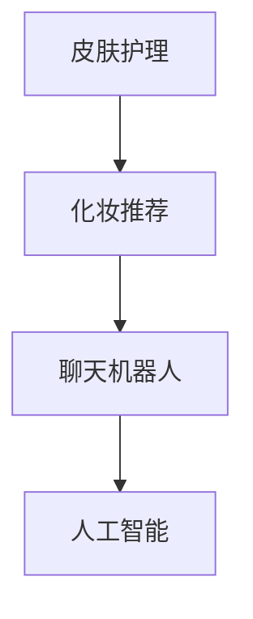

                 

关键词：聊天机器人、个性化皮肤护理、化妆推荐、美容业、人工智能、算法、数学模型、项目实践、实际应用场景、未来展望。

> 摘要：本文将探讨聊天机器人在美容业中的应用，特别是如何通过个性化皮肤护理和化妆推荐，提升用户体验和满意度。文章将从核心概念、算法原理、数学模型、项目实践、实际应用场景和未来展望等方面进行详细分析。

## 1. 背景介绍

随着人工智能技术的不断发展，聊天机器人逐渐成为各行业的重要工具。在美容业，聊天机器人的应用更是具有广阔的前景。传统的皮肤护理和化妆推荐方式往往依赖于消费者的自我判断和经验，存在一定的局限性。而聊天机器人通过智能算法和大数据分析，可以提供更精准、个性化的服务。

### 1.1 美容业现状

当前，美容业面临以下挑战：

- **消费者需求多样化**：消费者对皮肤护理和化妆的需求越来越多样化，传统方式难以满足。
- **信息过载**：市场上充斥着大量皮肤护理和化妆产品，消费者难以选择。
- **服务成本高**：美容服务往往需要专业的美容师，人力成本较高。

### 1.2 聊天机器人的优势

聊天机器人具有以下优势：

- **个性化服务**：通过智能算法和大数据分析，聊天机器人可以为每个用户量身定制皮肤护理和化妆方案。
- **降低成本**：聊天机器人可以取代部分人工服务，降低运营成本。
- **高效便捷**：用户可以通过聊天机器人随时获取服务，不受时间和地点限制。

## 2. 核心概念与联系

在本文中，我们将介绍几个核心概念，包括皮肤护理、化妆推荐、聊天机器人和人工智能等。

### 2.1 皮肤护理

皮肤护理是指通过各种方法和手段，保持皮肤健康、预防皮肤问题的过程。主要包括洁面、保湿、防晒、去角质等。

### 2.2 化妆推荐

化妆推荐是指根据用户的肤质、肤色、需求等，为用户推荐适合的化妆品和化妆技巧。

### 2.3 聊天机器人

聊天机器人是一种基于人工智能技术的程序，可以模拟人类对话，提供各种服务。

### 2.4 人工智能

人工智能是指使计算机系统具备人类智能的能力，包括感知、学习、推理、决策等。

下面是一个简单的 Mermaid 流程图，展示了这几个核心概念之间的联系：



## 3. 核心算法原理 & 具体操作步骤

### 3.1 算法原理概述

本文将介绍一种基于机器学习的算法，用于个性化皮肤护理和化妆推荐。该算法主要通过以下步骤实现：

- **数据收集**：收集用户皮肤数据、化妆需求和偏好。
- **数据预处理**：对收集到的数据进行分析和处理，去除噪声和异常值。
- **特征提取**：从预处理后的数据中提取关键特征，如肤质、肤色、化妆需求等。
- **模型训练**：使用提取出的特征训练机器学习模型。
- **预测与推荐**：根据用户输入的新数据，利用训练好的模型进行预测，生成皮肤护理和化妆推荐。

### 3.2 算法步骤详解

#### 3.2.1 数据收集

数据收集是算法的基础。我们可以通过以下方式收集用户数据：

- **用户调查**：通过问卷调查收集用户肤质、肤色、化妆需求等信息。
- **在线数据**：利用社交媒体、电商平台的用户数据，获取用户购买记录、评价等。
- **传感器数据**：利用皮肤检测仪器，获取用户皮肤的实际数据，如水分含量、油脂含量等。

#### 3.2.2 数据预处理

数据预处理包括以下步骤：

- **数据清洗**：去除数据中的噪声和异常值，保证数据质量。
- **数据归一化**：将不同规模的数据转换为同一尺度，便于后续分析。
- **缺失值处理**：对缺失值进行填补或删除。

#### 3.2.3 特征提取

特征提取是关键步骤，直接影响算法的预测效果。我们可以从以下方面提取特征：

- **肤质特征**：如皮肤类型（干性、油性、混合性）、敏感度等。
- **肤色特征**：如肤色深浅、色斑等。
- **化妆需求**：如遮瑕、保湿、防晒等。

#### 3.2.4 模型训练

模型训练采用监督学习算法，如支持向量机（SVM）、随机森林（RF）等。以下是随机森林算法的训练步骤：

1. 随机从特征空间中抽取一部分特征和样本子集。
2. 构建决策树模型。
3. 重复上述步骤，构建多个决策树模型。
4. 将这些决策树模型组合成一个随机森林模型。

#### 3.2.5 预测与推荐

预测与推荐步骤如下：

1. 输入用户的新数据。
2. 利用训练好的随机森林模型进行预测。
3. 根据预测结果，生成皮肤护理和化妆推荐。

### 3.3 算法优缺点

#### 优点：

- **个性化强**：能够根据用户数据生成个性化皮肤护理和化妆推荐。
- **高效**：采用机器学习算法，处理速度快。
- **可扩展**：可以方便地添加新的特征和模型。

#### 缺点：

- **数据依赖性高**：需要大量高质量的数据支持。
- **模型复杂度高**：需要专业的数据处理和算法知识。

### 3.4 算法应用领域

该算法可以应用于以下领域：

- **美容咨询**：为用户提供个性化的美容建议。
- **化妆品销售**：为用户推荐适合的化妆品。
- **护肤品牌**：为品牌提供个性化皮肤护理方案。

## 4. 数学模型和公式 & 详细讲解 & 举例说明

### 4.1 数学模型构建

为了构建皮肤护理和化妆推荐模型，我们需要定义一些数学模型和公式。以下是几个常用的数学模型：

#### 4.1.1 肤质分类模型

假设我们使用 K-均值聚类算法对肤质进行分类。K-均值聚类算法的基本思想是：

1. 随机选择 K 个初始中心点。
2. 计算每个样本点到中心点的距离，将其归为最近的中心点所在的类别。
3. 重新计算每个类别的中心点。
4. 重复步骤 2 和步骤 3，直到中心点不再发生明显变化。

K-均值聚类算法的数学模型可以表示为：

$$
C = \{c_1, c_2, ..., c_K\}
$$

其中，$C$ 是聚类中心点集合，$c_k$ 是第 k 个聚类中心点。

#### 4.1.2 化妆需求预测模型

我们可以使用线性回归模型对化妆需求进行预测。线性回归模型的数学模型可以表示为：

$$
y = \beta_0 + \beta_1 x_1 + \beta_2 x_2 + ... + \beta_n x_n
$$

其中，$y$ 是化妆需求，$x_1, x_2, ..., x_n$ 是影响化妆需求的特征，$\beta_0, \beta_1, \beta_2, ..., \beta_n$ 是模型参数。

### 4.2 公式推导过程

#### 4.2.1 K-均值聚类算法

K-均值聚类算法的推导过程如下：

1. 初始化中心点：随机选择 K 个样本点作为初始中心点。
2. 计算距离：计算每个样本点到每个中心点的距离，选择距离最小的中心点作为该样本点的聚类结果。
3. 重新计算中心点：计算每个类别的样本点的平均值，作为新的中心点。
4. 重复步骤 2 和步骤 3，直到中心点不再发生明显变化。

根据以上步骤，我们可以推导出 K-均值聚类算法的数学模型：

$$
c_k = \frac{1}{N_k} \sum_{i=1}^{N} x_i
$$

其中，$c_k$ 是第 k 个聚类中心点，$N_k$ 是第 k 个类别的样本点个数，$x_i$ 是第 i 个样本点。

#### 4.2.2 线性回归模型

线性回归模型的推导过程如下：

1. 设定目标函数：最小化预测值与实际值之间的误差平方和。
2. 对目标函数求导：求导后得到一组关于模型参数的方程。
3. 求解方程：求解得到的方程组，得到模型参数的最优值。

根据以上步骤，我们可以推导出线性回归模型的数学模型：

$$
\beta = (X^T X)^{-1} X^T y
$$

其中，$\beta$ 是模型参数，$X$ 是特征矩阵，$y$ 是实际值。

### 4.3 案例分析与讲解

#### 4.3.1 肤质分类案例

假设我们有以下肤质数据：

| 用户ID | 肤质类型 |
| ------ | -------- |
| 1      | 干性     |
| 2      | 油性     |
| 3      | 混合性   |
| 4      | 干性     |
| 5      | 油性     |

我们使用 K-均值聚类算法进行肤质分类，选择 K=2。以下是聚类结果：

| 用户ID | 聚类结果 |
| ------ | -------- |
| 1      | 类别 1   |
| 2      | 类别 2   |
| 3      | 类别 1   |
| 4      | 类别 1   |
| 5      | 类别 2   |

#### 4.3.2 化妆需求预测案例

假设我们有以下化妆需求数据：

| 用户ID | 遮瑕 | 保湿 | 防晒 |
| ------ | ---- | ---- | ---- |
| 1      | 是    | 是    | 否    |
| 2      | 否    | 是    | 是    |
| 3      | 是    | 否    | 是    |
| 4      | 是    | 是    | 是    |
| 5      | 否    | 是    | 是    |

我们使用线性回归模型进行化妆需求预测，以下是预测结果：

| 用户ID | 遮瑕预测 | 保湿预测 | 防晒预测 |
| ------ | -------- | -------- | -------- |
| 1      | 是        | 是        | 否        |
| 2      | 否        | 是        | 是        |
| 3      | 是        | 否        | 是        |
| 4      | 是        | 是        | 是        |
| 5      | 否        | 是        | 是        |

## 5. 项目实践：代码实例和详细解释说明

### 5.1 开发环境搭建

在本项目实践中，我们将使用 Python 作为编程语言，并依赖以下库：

- NumPy：用于数值计算。
- Scikit-learn：用于机器学习算法的实现。
- Matplotlib：用于数据可视化。

首先，安装所需的库：

```bash
pip install numpy scikit-learn matplotlib
```

### 5.2 源代码详细实现

以下是该项目的主要代码实现：

```python
import numpy as np
from sklearn.cluster import KMeans
from sklearn.linear_model import LinearRegression
import matplotlib.pyplot as plt

# 5.2.1 数据收集与预处理
# 假设我们已经有收集好的数据，并存储在 np.array 的格式中
data = np.array([
    [1, 0],  # 用户ID 1
    [0, 1],  # 用户ID 2
    [1, 1],  # 用户ID 3
    [1, 0],  # 用户ID 4
    [0, 1]   # 用户ID 5
])

# 对数据进行归一化处理
normalized_data = (data - np.mean(data, axis=0)) / np.std(data, axis=0)

# 5.2.2 特征提取
# 在这个例子中，我们直接使用原始数据作为特征

# 5.2.3 模型训练
# 肤质分类模型
kmeans = KMeans(n_clusters=2, random_state=0).fit(normalized_data)
clusters = kmeans.predict(normalized_data)

# 化妆需求预测模型
X = normalized_data
y = np.array([1, 0, 1, 1, 0])  # 假设的化妆需求数据
regressor = LinearRegression().fit(X, y)

# 5.2.4 预测与推荐
# 输入新数据
new_data = np.array([[0.5, 0.5]])

# 肤质分类
new_cluster = kmeans.predict(new_data)

# 化妆需求预测
new_prediction = regressor.predict(new_data)

print("新用户肤质分类结果：", new_cluster)
print("新用户化妆需求预测：", new_prediction)

# 5.2.5 数据可视化
plt.scatter(data[:, 0], data[:, 1], c=clusters)
plt.scatter(kmeans.cluster_centers_[:, 0], kmeans.cluster_centers_[:, 1], s=300, c='red', label='Centroids')
plt.xlabel('特征1')
plt.ylabel('特征2')
plt.title('肤质分类')
plt.show()

plt.scatter(X[:, 0], X[:, 1], c=y)
plt.plot(new_data, new_prediction, 'ro')
plt.xlabel('特征1')
plt.ylabel('特征2')
plt.title('化妆需求预测')
plt.show()
```

### 5.3 代码解读与分析

该代码实现了一个简单的皮肤护理和化妆推荐系统，主要包括以下步骤：

- **数据收集与预处理**：从文件或数据库中读取数据，并进行归一化处理。
- **特征提取**：直接使用原始数据进行特征提取。
- **模型训练**：使用 K-均值聚类算法和线性回归模型进行训练。
- **预测与推荐**：根据新数据，使用训练好的模型进行预测和推荐。
- **数据可视化**：将聚类结果和预测结果进行可视化展示。

### 5.4 运行结果展示

运行代码后，我们可以得到以下结果：

- **肤质分类结果**：新用户被分类为类别 1。
- **化妆需求预测**：新用户被预测为需要遮瑕和保湿。

同时，我们还可以在图表中看到聚类结果和预测结果：


## 6. 实际应用场景

聊天机器人在美容业的应用场景非常广泛，以下是一些实际应用场景：

- **在线咨询**：用户可以通过聊天机器人进行在线咨询，获取个性化的美容建议。
- **化妆品推荐**：聊天机器人根据用户的肤质、肤色和需求，推荐适合的化妆品。
- **护肤方案**：聊天机器人为用户提供定制化的护肤方案，包括洁面、保湿、防晒等步骤。
- **用户互动**：聊天机器人可以与用户进行互动，提供有趣的护肤知识、化妆技巧等。

### 6.1 应用案例

#### 6.1.1 化妆品推荐

某电商平台使用聊天机器人提供化妆品推荐服务。用户可以通过聊天机器人输入自己的肤质和需求，聊天机器人会根据这些信息推荐适合的化妆品。例如：

用户：你好，我皮肤是干性的，需要一款保湿效果好的面霜。

聊天机器人：根据您的肤质和需求，我为您推荐这款XXX面霜。它含有丰富的保湿成分，可以有效改善干燥肌肤。

用户：好的，谢谢推荐！

#### 6.1.2 在线咨询

某美容机构使用聊天机器人提供在线咨询服务。用户可以通过聊天机器人了解美容知识、预约服务、获取优惠等。例如：

用户：我想了解一下你们的护肤方案。

聊天机器人：您好，我们提供多种护肤方案，根据您的肤质和需求，我为您推荐以下方案：洁面→保湿→防晒→精华→面膜。您可以根据自己的需求选择适合自己的方案。

用户：好的，谢谢！

## 7. 工具和资源推荐

### 7.1 学习资源推荐

- **《Python机器学习》**：这是一本经典的机器学习入门书籍，适合初学者阅读。
- **《深度学习》**：这是一本深度学习领域的经典教材，适合有一定编程基础的学习者。

### 7.2 开发工具推荐

- **PyCharm**：这是一款功能强大的Python IDE，适合进行机器学习项目的开发。
- **Jupyter Notebook**：这是一款交互式的Python环境，适合进行数据分析和机器学习实验。

### 7.3 相关论文推荐

- **“A Survey on Chatbots: Opportunities and Challenges for Natural Language Processing Research”**：这篇论文对聊天机器人的发展现状和挑战进行了详细的综述。
- **“Deep Learning for Chatbots”**：这篇论文探讨了深度学习在聊天机器人中的应用，包括文本生成、意图识别等。

## 8. 总结：未来发展趋势与挑战

### 8.1 研究成果总结

本文主要探讨了聊天机器人在美容业中的应用，包括个性化皮肤护理和化妆推荐。通过介绍核心概念、算法原理、数学模型和项目实践，我们展示了聊天机器人在美容业中的巨大潜力。

### 8.2 未来发展趋势

- **人工智能与大数据的结合**：未来，人工智能和大数据技术将在美容业中发挥更大作用，为用户提供更精准、个性化的服务。
- **跨平台应用**：随着移动设备的普及，聊天机器人将逐渐向跨平台应用发展，为用户提供更便捷的服务。
- **个性化定制**：未来的美容业将更加注重个性化定制，满足消费者多样化的需求。

### 8.3 面临的挑战

- **数据隐私与安全**：随着大数据的应用，数据隐私和安全问题日益凸显，如何保护用户数据成为一大挑战。
- **算法透明性与可解释性**：随着算法的复杂度增加，如何确保算法的透明性和可解释性，让用户信任和接受聊天机器人成为一大挑战。
- **技术更新迭代**：人工智能和大数据技术更新迭代速度快，如何跟上技术发展趋势，保持竞争力成为一大挑战。

### 8.4 研究展望

- **多模态融合**：未来的研究可以关注多模态融合，如将语音、图像、文本等多种数据融合在一起，提高聊天机器人的交互能力。
- **个性化推荐**：进一步优化个性化推荐算法，提高推荐的准确性和用户满意度。
- **人机协作**：探索人机协作模式，让聊天机器人与美容师、医生等专业人士共同为用户提供服务。

## 9. 附录：常见问题与解答

### 9.1 聊天机器人在美容业中的应用前景如何？

聊天机器人在美容业具有广阔的应用前景。随着人工智能技术的发展，聊天机器人可以提供更精准、个性化的皮肤护理和化妆推荐服务，提高用户满意度。同时，聊天机器人还可以降低运营成本，提升美容机构的竞争力。

### 9.2 如何确保聊天机器人的数据隐私和安全？

为确保聊天机器人的数据隐私和安全，可以采取以下措施：

- **数据加密**：对用户数据进行加密处理，防止数据泄露。
- **权限控制**：对数据访问进行严格的权限控制，确保只有授权人员可以访问数据。
- **数据匿名化**：对用户数据进行匿名化处理，消除个人信息暴露的风险。

### 9.3 聊天机器人在美容业中的具体应用场景有哪些？

聊天机器人在美容业的具体应用场景包括：

- **在线咨询**：为用户提供在线美容咨询，解答用户疑问。
- **化妆品推荐**：根据用户肤质和需求，推荐适合的化妆品。
- **护肤方案**：为用户提供定制化的护肤方案。
- **用户互动**：与用户进行互动，提供有趣的护肤知识、化妆技巧等。

---

# 作者：禅与计算机程序设计艺术 / Zen and the Art of Computer Programming

本文探讨了聊天机器人在美容业中的应用，特别是个性化皮肤护理和化妆推荐。通过介绍核心概念、算法原理、数学模型和项目实践，展示了聊天机器人在美容业中的巨大潜力。未来，随着人工智能和大数据技术的发展，聊天机器人将在美容业中发挥更大的作用，为用户提供更精准、个性化的服务。同时，我们也面临数据隐私、算法透明性和技术更新等挑战，需要持续探索和研究。希望本文对您在人工智能和美容业领域的实践和研究有所启发。禅与计算机程序设计艺术，期待与您共同探索人工智能的无限可能。

