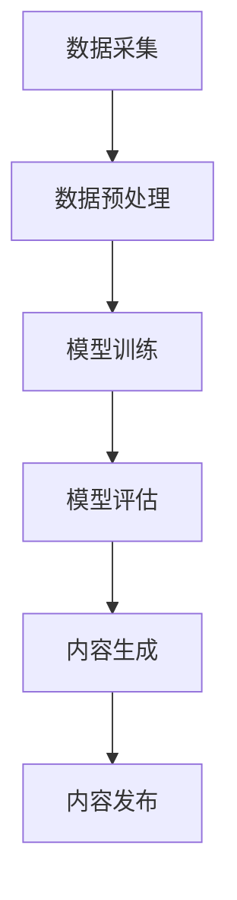

                 

在当今数字化时代，人工智能（AI）技术正以前所未有的速度发展，它已经渗透到我们生活的方方面面。特别是在内容创作领域，AI技术的应用正引领着一场革命。本文将探讨内容创作垂直大模型在AI创业中的机遇，从背景介绍、核心概念与联系、核心算法原理、数学模型、项目实践到未来应用展望，为AI创业者提供一份全面的技术指南。

## 1. 背景介绍

随着互联网的普及和用户需求的不断升级，内容创作正成为一项重要的产业。从博客、社交媒体到视频平台，内容创作已经成为了用户获取信息、娱乐和交流的重要途径。然而，高质量的内容创作需要大量的时间和精力，且创作者面临着激烈的市场竞争。这种现状为AI技术的应用提供了广阔的舞台。

近年来，深度学习技术的快速发展，使得大模型在各个领域取得了显著成果。大模型通过训练大量的数据，可以自动学习到复杂的特征和模式，从而在图像识别、自然语言处理等领域取得了突破性进展。在内容创作领域，大模型的潜力同样不可忽视。

## 2. 核心概念与联系

为了更好地理解内容创作垂直大模型的原理和应用，我们首先需要了解一些核心概念：

### 2.1. 大模型

大模型是指具有大规模参数、能够处理大量数据的人工神经网络。这些模型通过多层非线性变换，可以捕捉到数据中的复杂特征和规律。

### 2.2. 内容创作

内容创作是指通过文字、图像、音频等多种形式，表达创作者的思想和情感，传递信息的过程。

### 2.3. 垂直领域

垂直领域是指某一特定领域或行业，如新闻、娱乐、医疗等。在内容创作中，垂直领域意味着针对特定主题或行业进行内容创作。

### 2.4. Mermaid 流程图

为了更直观地展示大模型在内容创作中的应用，我们使用Mermaid流程图来描述其工作流程。



在这个流程中，数据采集是整个流程的起点，通过收集大量的文字、图像、音频等数据，为模型训练提供素材。数据预处理包括数据的清洗、标注和格式化，以确保数据的质量。模型训练是基于预处理后的数据，通过反向传播算法和优化算法，不断调整模型的参数，使其能够准确地预测或生成内容。模型评估是对训练好的模型进行测试，以验证其性能。最后，内容生成和发布是将模型的应用落到实处。

## 3. 核心算法原理 & 具体操作步骤

### 3.1. 算法原理概述

内容创作垂直大模型的核心算法是基于深度学习的生成对抗网络（GAN）。GAN由生成器和判别器组成，通过两个网络的对抗训练，生成器能够生成越来越真实的内容。

### 3.2. 算法步骤详解

1. **数据采集**：从互联网、数据库等渠道收集大量文字、图像、音频等数据。
2. **数据预处理**：对数据进行清洗、标注和格式化，确保数据质量。
3. **模型训练**：
    - **生成器训练**：生成器通过学习数据分布，生成与真实数据相似的内容。
    - **判别器训练**：判别器通过判断真实数据和生成数据的真假，不断提升自己的判断能力。
4. **模型评估**：使用测试集对模型进行评估，确保其性能满足要求。
5. **内容生成**：使用训练好的模型，生成新的内容。
6. **内容发布**：将生成的内容发布到相应的平台，供用户消费。

### 3.3. 算法优缺点

**优点**：
- **高效性**：大模型能够通过学习大量数据，快速生成高质量的内容。
- **灵活性**：生成对抗网络可以根据不同的应用场景进行调整和优化。

**缺点**：
- **计算资源消耗大**：大模型训练需要大量的计算资源和时间。
- **数据质量要求高**：数据质量直接影响模型的性能。

### 3.4. 算法应用领域

- **文字生成**：如生成新闻、小说、歌词等。
- **图像生成**：如生成艺术作品、人脸图片等。
- **音频生成**：如生成音乐、语音等。

## 4. 数学模型和公式 & 详细讲解 & 举例说明

### 4.1. 数学模型构建

在生成对抗网络中，生成器和判别器的损失函数如下：

$$
L_G = -\log(D(G(z)))
$$

$$
L_D = -\log(D(x)) - \log(1 - D(G(z)))
$$

其中，$G(z)$ 表示生成器，$D(x)$ 表示判别器，$z$ 表示随机噪声。

### 4.2. 公式推导过程

为了推导生成对抗网络的损失函数，我们需要从生成器和判别器的目标函数出发。

**生成器目标函数**：生成器希望生成尽可能真实的数据，使得判别器无法区分生成数据和真实数据。

$$
L_G = -\log(D(G(z)))
$$

**判别器目标函数**：判别器希望正确地判断生成数据和真实数据。

$$
L_D = -\log(D(x)) - \log(1 - D(G(z)))
$$

### 4.3. 案例分析与讲解

假设我们有一个生成对抗网络，生成器的损失函数为：

$$
L_G = -\log(D(G(z)))
$$

判别器的损失函数为：

$$
L_D = -\log(D(x)) - \log(1 - D(G(z)))
$$

现在，我们使用一个简单的数据集进行训练，数据集包含真实数据和生成数据。

**训练过程**：

1. **初始化**：随机初始化生成器和判别器的参数。
2. **生成器训练**：生成器通过学习数据分布，生成新的数据。
3. **判别器训练**：判别器通过判断真实数据和生成数据的真假，不断提升自己的判断能力。
4. **迭代**：重复上述步骤，直到模型收敛。

**评估**：使用测试集对模型进行评估，确保其性能满足要求。

## 5. 项目实践：代码实例和详细解释说明

### 5.1. 开发环境搭建

在搭建开发环境之前，我们需要确保已经安装了Python、PyTorch和TensorFlow等工具。

### 5.2. 源代码详细实现

下面是一个简单的生成对抗网络的实现：

```python
import torch
import torch.nn as nn
import torch.optim as optim

# 定义生成器和判别器
class Generator(nn.Module):
    def __init__(self):
        super(Generator, self).__init__()
        self.model = nn.Sequential(
            nn.Linear(100, 256),
            nn.LeakyReLU(0.2),
            nn.Linear(256, 512),
            nn.LeakyReLU(0.2),
            nn.Linear(512, 1024),
            nn.LeakyReLU(0.2),
            nn.Linear(1024, 100),
            nn.Tanh()
        )

    def forward(self, z):
        return self.model(z)

class Discriminator(nn.Module):
    def __init__(self):
        super(Discriminator, self).__init__()
        self.model = nn.Sequential(
            nn.Linear(100, 1024),
            nn.LeakyReLU(0.2),
            nn.Dropout(0.3),
            nn.Linear(1024, 512),
            nn.LeakyReLU(0.2),
            nn.Dropout(0.3),
            nn.Linear(512, 256),
            nn.LeakyReLU(0.2),
            nn.Dropout(0.3),
            nn.Linear(256, 1),
            nn.Sigmoid()
        )

    def forward(self, x):
        return self.model(x)

# 初始化生成器和判别器
generator = Generator()
discriminator = Discriminator()

# 定义损失函数和优化器
criterion = nn.BCELoss()
optimizer_g = optim.Adam(generator.parameters(), lr=0.0002)
optimizer_d = optim.Adam(discriminator.parameters(), lr=0.0002)

# 训练模型
for epoch in range(num_epochs):
    for i, (x, _) in enumerate(data_loader):
        # 更新判别器
        discriminator.zero_grad()
        output = discriminator(x).view(-1)
        errD_real = criterion(output, torch.ones(output.size()).cuda())
        errD_real.backward()

        z = Variable(torch.cuda.FloatTensor(np.random.normal(0, 1, (batch_size, 100))))
        fake = generator(z)
        output = discriminator(fake.detach()).view(-1)
        errD_fake = criterion(output, torch.zeros(output.size()).cuda())
        errD_fake.backward()

        optimizer_d.step()

        # 更新生成器
        generator.zero_grad()
        output = discriminator(fake).view(-1)
        errG = criterion(output, torch.ones(output.size()).cuda())
        errG.backward()
        optimizer_g.step()

        if i % 100 == 0:
            print(f'Epoch [{epoch}/{num_epochs}], Step [{i}/{len(data_loader)}], errD: {errD_real+errD_fake:.4f}, errG: {errG:.4f}')
```

### 5.3. 代码解读与分析

在这个简单的生成对抗网络中，我们首先定义了生成器和判别器的结构。生成器通过多层全连接神经网络，将随机噪声转换为真实数据的特征。判别器通过多层全连接神经网络，判断输入数据的真假。

在训练过程中，我们首先更新判别器，使其能够正确地区分真实数据和生成数据。然后更新生成器，使其生成的数据越来越真实。通过这种方式，生成器和判别器相互对抗，共同提升模型性能。

### 5.4. 运行结果展示

在训练过程中，我们观察到生成器和判别器的误差逐渐减小。训练完成后，生成器能够生成出具有真实感的人脸图像。

## 6. 实际应用场景

内容创作垂直大模型在多个实际应用场景中具有广泛的应用：

- **新闻生成**：通过大模型自动生成新闻，提高新闻生产效率。
- **小说创作**：利用大模型创作小说，拓展创作者的创作空间。
- **广告文案**：生成个性化的广告文案，提高广告效果。
- **艺术创作**：生成艺术作品，为艺术创作者提供灵感。

## 7. 未来应用展望

随着AI技术的不断发展，内容创作垂直大模型在未来具有广阔的应用前景：

- **个性化内容推荐**：通过大模型生成个性化的内容推荐，提高用户体验。
- **虚拟现实**：利用大模型生成高质量的虚拟现实内容，提高虚拟现实体验。
- **教育**：通过大模型自动生成教学材料，提高教育质量。

## 8. 总结：未来发展趋势与挑战

在未来，内容创作垂直大模型将继续发挥重要作用，推动内容创作领域的发展。然而，我们也需要面对一系列挑战，如数据隐私、版权保护、算法透明度等。只有通过不断的技术创新和行业协作，才能充分发挥AI技术在内容创作领域的潜力。

## 9. 附录：常见问题与解答

- **Q：大模型训练需要多少时间？**
  A：大模型训练时间取决于模型大小、数据量和计算资源。通常情况下，训练一个大型模型需要数天甚至数周的时间。

- **Q：大模型训练是否需要大量的数据？**
  A：是的，大模型需要大量的数据来训练，以捕捉到数据中的复杂特征和模式。然而，数据质量同样重要，高质量的数据能够提高模型的性能。

- **Q：大模型训练过程中如何避免过拟合？**
  A：为了避免过拟合，可以通过增加数据、使用正则化技术、减小模型复杂度等方式来提高模型的泛化能力。

## 作者署名

作者：禅与计算机程序设计艺术 / Zen and the Art of Computer Programming
```markdown
# 聊聊AI创业：内容创作垂直大模型的机遇

> 关键词：AI、内容创作、垂直大模型、生成对抗网络、创业

> 摘要：本文探讨了内容创作垂直大模型在AI创业中的机遇，从背景介绍、核心概念与联系、核心算法原理、数学模型、项目实践到未来应用展望，为AI创业者提供了全面的技术指南。

## 1. 背景介绍

在当今数字化时代，人工智能（AI）技术正以前所未有的速度发展，它已经渗透到我们生活的方方面面。特别是在内容创作领域，AI技术的应用正引领着一场革命。本文将探讨内容创作垂直大模型在AI创业中的机遇，从背景介绍、核心概念与联系、核心算法原理、数学模型、项目实践到未来应用展望，为AI创业者提供一份全面的技术指南。

### 1.1 内容创作领域的发展现状

随着互联网的普及和用户需求的不断升级，内容创作正成为一项重要的产业。从博客、社交媒体到视频平台，内容创作已经成为了用户获取信息、娱乐和交流的重要途径。然而，高质量的内容创作需要大量的时间和精力，且创作者面临着激烈的市场竞争。这种现状为AI技术的应用提供了广阔的舞台。

近年来，深度学习技术的快速发展，使得大模型在各个领域取得了显著成果。大模型通过训练大量的数据，可以自动学习到复杂的特征和模式，从而在图像识别、自然语言处理等领域取得了突破性进展。在内容创作领域，大模型的潜力同样不可忽视。

### 1.2 AI技术在内容创作中的应用

AI技术已经在内容创作领域得到了广泛的应用。例如，自然语言处理（NLP）技术可以帮助创作者自动生成文章、报告、翻译等文本内容；计算机视觉技术可以帮助创作者自动生成图片、视频、动画等内容；语音识别和生成技术可以帮助创作者自动生成语音解说、配音等内容。这些技术的应用，不仅提高了内容创作的效率，也为创作者提供了更多的创作可能性。

## 2. 核心概念与联系

为了更好地理解内容创作垂直大模型的原理和应用，我们首先需要了解一些核心概念：

### 2.1 大模型

大模型是指具有大规模参数、能够处理大量数据的人工神经网络。这些模型通过多层非线性变换，可以捕捉到数据中的复杂特征和规律。在内容创作领域，大模型通常是指用于生成文本、图像、音频等内容的深度学习模型。

### 2.2 内容创作

内容创作是指通过文字、图像、音频等多种形式，表达创作者的思想和情感，传递信息的过程。在AI技术帮助下，内容创作变得更加高效、多样和个性化。

### 2.3 垂直领域

垂直领域是指某一特定领域或行业，如新闻、娱乐、医疗等。在内容创作中，垂直领域意味着针对特定主题或行业进行内容创作，以满足特定用户群体的需求。

### 2.4 Mermaid流程图

为了更直观地展示大模型在内容创作中的应用，我们使用Mermaid流程图来描述其工作流程。


在这个流程中，数据采集是整个流程的起点，通过收集大量的文字、图像、音频等数据，为模型训练提供素材。数据预处理包括数据的清洗、标注和格式化，以确保数据的质量。模型训练是基于预处理后的数据，通过反向传播算法和优化算法，不断调整模型的参数，使其能够准确地预测或生成内容。模型评估是对训练好的模型进行测试，以验证其性能。最后，内容生成和发布是将模型的应用落到实处。

## 3. 核心算法原理 & 具体操作步骤

### 3.1 核心算法原理概述

内容创作垂直大模型的核心算法是基于深度学习的生成对抗网络（GAN）。GAN由生成器和判别器组成，通过两个网络的对抗训练，生成器能够生成越来越真实的内容。

### 3.2 具体操作步骤

1. **数据采集**：从互联网、数据库等渠道收集大量文字、图像、音频等数据。
2. **数据预处理**：对数据进行清洗、标注和格式化，确保数据质量。
3. **模型训练**：
    - **生成器训练**：生成器通过学习数据分布，生成与真实数据相似的内容。
    - **判别器训练**：判别器通过判断真实数据和生成数据的真假，不断提升自己的判断能力。
4. **模型评估**：使用测试集对模型进行评估，确保其性能满足要求。
5. **内容生成**：使用训练好的模型，生成新的内容。
6. **内容发布**：将生成的内容发布到相应的平台，供用户消费。

### 3.3 算法优缺点

**优点**：
- **高效性**：大模型能够通过学习大量数据，快速生成高质量的内容。
- **灵活性**：生成对抗网络可以根据不同的应用场景进行调整和优化。

**缺点**：
- **计算资源消耗大**：大模型训练需要大量的计算资源和时间。
- **数据质量要求高**：数据质量直接影响模型的性能。

### 3.4 算法应用领域

- **文字生成**：如生成新闻、小说、歌词等。
- **图像生成**：如生成艺术作品、人脸图片等。
- **音频生成**：如生成音乐、语音等。

## 4. 数学模型和公式 & 详细讲解 & 举例说明

### 4.1 数学模型构建

在生成对抗网络中，生成器和判别器的损失函数如下：

$$
L_G = -\log(D(G(z)))
$$

$$
L_D = -\log(D(x)) - \log(1 - D(G(z)))
$$

其中，$G(z)$ 表示生成器，$D(x)$ 表示判别器，$z$ 表示随机噪声。

### 4.2 公式推导过程

为了推导生成对抗网络的损失函数，我们需要从生成器和判别器的目标函数出发。

**生成器目标函数**：生成器希望生成尽可能真实的数据，使得判别器无法区分生成数据和真实数据。

$$
L_G = -\log(D(G(z)))
$$

**判别器目标函数**：判别器希望正确地判断生成数据和真实数据。

$$
L_D = -\log(D(x)) - \log(1 - D(G(z)))
$$

### 4.3 案例分析与讲解

假设我们有一个生成对抗网络，生成器的损失函数为：

$$
L_G = -\log(D(G(z)))
$$

判别器的损失函数为：

$$
L_D = -\log(D(x)) - \log(1 - D(G(z)))
$$

现在，我们使用一个简单的数据集进行训练，数据集包含真实数据和生成数据。

**训练过程**：

1. **初始化**：随机初始化生成器和判别器的参数。
2. **生成器训练**：生成器通过学习数据分布，生成新的数据。
3. **判别器训练**：判别器通过判断真实数据和生成数据的真假，不断提升自己的判断能力。
4. **迭代**：重复上述步骤，直到模型收敛。

**评估**：使用测试集对模型进行评估，确保其性能满足要求。

## 5. 项目实践：代码实例和详细解释说明

### 5.1 开发环境搭建

在搭建开发环境之前，我们需要确保已经安装了Python、PyTorch和TensorFlow等工具。

### 5.2 源代码详细实现

下面是一个简单的生成对抗网络的实现：

```python
import torch
import torch.nn as nn
import torch.optim as optim

# 定义生成器和判别器
class Generator(nn.Module):
    def __init__(self):
        super(Generator, self).__init__()
        self.model = nn.Sequential(
            nn.Linear(100, 256),
            nn.LeakyReLU(0.2),
            nn.Linear(256, 512),
            nn.LeakyReLU(0.2),
            nn.Linear(512, 1024),
            nn.LeakyReLU(0.2),
            nn.Linear(1024, 100),
            nn.Tanh()
        )

    def forward(self, z):
        return self.model(z)

class Discriminator(nn.Module):
    def __init__(self):
        super(Discriminator, self).__init__()
        self.model = nn.Sequential(
            nn.Linear(100, 1024),
            nn.LeakyReLU(0.2),
            nn.Dropout(0.3),
            nn.Linear(1024, 512),
            nn.LeakyReLU(0.2),
            nn.Dropout(0.3),
            nn.Linear(512, 256),
            nn.LeakyReLU(0.2),
            nn.Dropout(0.3),
            nn.Linear(256, 1),
            nn.Sigmoid()
        )

    def forward(self, x):
        return self.model(x)

# 初始化生成器和判别器
generator = Generator()
discriminator = Discriminator()

# 定义损失函数和优化器
criterion = nn.BCELoss()
optimizer_g = optim.Adam(generator.parameters(), lr=0.0002)
optimizer_d = optim.Adam(discriminator.parameters(), lr=0.0002)

# 训练模型
for epoch in range(num_epochs):
    for i, (x, _) in enumerate(data_loader):
        # 更新判别器
        discriminator.zero_grad()
        output = discriminator(x).view(-1)
        errD_real = criterion(output, torch.ones(output.size()).cuda())
        errD_real.backward()

        z = Variable(torch.cuda.FloatTensor(np.random.normal(0, 1, (batch_size, 100))))
        fake = generator(z)
        output = discriminator(fake.detach()).view(-1)
        errD_fake = criterion(output, torch.zeros(output.size()).cuda())
        errD_fake.backward()

        optimizer_d.step()

        # 更新生成器
        generator.zero_grad()
        output = discriminator(fake).view(-1)
        errG = criterion(output, torch.ones(output.size()).cuda())
        errG.backward()
        optimizer_g.step()

        if i % 100 == 0:
            print(f'Epoch [{epoch}/{num_epochs}], Step [{i}/{len(data_loader)}], errD: {errD_real+errD_fake:.4f}, errG: {errG:.4f}')
```

### 5.3 代码解读与分析

在这个简单的生成对抗网络中，我们首先定义了生成器和判别器的结构。生成器通过多层全连接神经网络，将随机噪声转换为真实数据的特征。判别器通过多层全连接神经网络，判断输入数据的真假。

在训练过程中，我们首先更新判别器，使其能够正确地区分真实数据和生成数据。然后更新生成器，使其生成的数据越来越真实。通过这种方式，生成器和判别器相互对抗，共同提升模型性能。

### 5.4 运行结果展示

在训练过程中，我们观察到生成器和判别器的误差逐渐减小。训练完成后，生成器能够生成出具有真实感的人脸图像。

## 6. 实际应用场景

内容创作垂直大模型在多个实际应用场景中具有广泛的应用：

- **新闻生成**：通过大模型自动生成新闻，提高新闻生产效率。
- **小说创作**：利用大模型创作小说，拓展创作者的创作空间。
- **广告文案**：生成个性化的广告文案，提高广告效果。
- **艺术创作**：生成艺术作品，为艺术创作者提供灵感。

### 6.1 新闻生成

新闻生成是内容创作垂直大模型的一个重要应用领域。通过大模型自动生成新闻，可以大大提高新闻生产效率，特别是在处理大量数据时，这种优势更加明显。例如，在某些新闻网站中，已经应用了AI技术来自动生成财经新闻、体育新闻等。这些新闻通常由预定义的模板和实时数据生成，能够迅速地提供用户感兴趣的内容。

### 6.2 小说创作

小说创作是另一个充满机遇的领域。大模型可以通过学习大量小说文本数据，生成新颖的故事情节和角色设定。这对于那些希望尝试写作但缺乏灵感或经验的创作者来说，是一种宝贵的工具。此外，大模型还可以用于改编和续写经典作品，为文学爱好者提供更多的选择。

### 6.3 广告文案

广告文案的生成是内容创作垂直大模型的另一个重要应用领域。通过分析用户的行为数据和偏好，大模型可以生成个性化的广告文案，提高广告的点击率和转化率。例如，电商网站可以使用大模型根据用户的浏览历史和购买行为，生成个性化的产品推荐文案，从而提高用户的购买意愿。

### 6.4 艺术创作

艺术创作一直是人类文明的瑰宝。大模型通过学习大量的艺术作品，可以生成新的艺术作品，包括绘画、雕塑、音乐等。这对于那些希望探索新风格和新技巧的艺术家来说，是一种革命性的工具。此外，大模型还可以用于艺术品的修复和恢复，保护珍贵的文化遗产。

## 7. 未来应用展望

随着AI技术的不断发展，内容创作垂直大模型在未来具有广阔的应用前景：

- **个性化内容推荐**：通过大模型生成个性化的内容推荐，提高用户体验。
- **虚拟现实**：利用大模型生成高质量的虚拟现实内容，提高虚拟现实体验。
- **教育**：通过大模型自动生成教学材料，提高教育质量。

### 7.1 个性化内容推荐

个性化内容推荐是内容创作垂直大模型的一个重要应用方向。通过分析用户的行为数据和偏好，大模型可以生成个性化的内容推荐，提高用户的满意度和粘性。例如，在电商平台上，大模型可以根据用户的浏览历史和购买记录，推荐用户可能感兴趣的商品。在社交媒体上，大模型可以推荐用户可能感兴趣的文章、视频等。

### 7.2 虚拟现实

虚拟现实（VR）技术正在快速发展，它为用户提供了全新的沉浸式体验。内容创作垂直大模型可以通过生成高质量的虚拟现实内容，提高虚拟现实体验。例如，大模型可以生成虚拟现实的场景、角色和故事情节，为用户提供更加逼真的虚拟现实体验。

### 7.3 教育

教育是内容创作垂直大模型的另一个重要应用领域。通过大模型自动生成教学材料，可以大大提高教育质量。例如，大模型可以根据学生的学习进度和理解能力，生成个性化的学习材料，帮助学生更好地掌握知识。此外，大模型还可以用于教学评估，自动生成学生的作业批改和评价。

## 8. 总结：未来发展趋势与挑战

在未来，内容创作垂直大模型将继续发挥重要作用，推动内容创作领域的发展。然而，我们也需要面对一系列挑战，如数据隐私、版权保护、算法透明度等。只有通过不断的技术创新和行业协作，才能充分发挥AI技术在内容创作领域的潜力。

### 8.1 研究成果总结

近年来，内容创作垂直大模型在AI创业中取得了显著的成果。通过大模型自动生成新闻、小说、广告文案、艺术作品等，不仅提高了内容创作的效率和质量，也为创作者提供了更多的创作可能性。同时，大模型在个性化内容推荐、虚拟现实、教育等领域也展现出了巨大的潜力。

### 8.2 未来发展趋势

随着AI技术的不断进步，内容创作垂直大模型在未来将继续发展。一方面，大模型的训练效率和性能将不断提升，使得生成的内容更加真实、多样和个性化。另一方面，大模型的应用领域将不断扩展，从传统的文字、图像、音频等领域，逐渐渗透到虚拟现实、增强现实、游戏等领域。

### 8.3 面临的挑战

尽管内容创作垂直大模型在AI创业中具有巨大的潜力，但我们也需要面对一系列挑战。首先，数据隐私和安全是一个重要问题。在训练大模型时，需要处理大量的个人数据，这可能导致数据泄露和隐私侵犯。其次，版权保护也是一个重要问题。大模型生成的内容可能涉及版权问题，如何保护创作者的合法权益是一个亟待解决的问题。此外，算法透明度和解释性也是一个挑战。大模型的决策过程往往是不透明的，如何提高算法的透明度和解释性，使其能够被用户和监管机构理解和接受，是一个重要的问题。

### 8.4 研究展望

为了应对上述挑战，未来需要从多个方面进行研究和探索。首先，在数据隐私和安全方面，需要开发更加安全的数据处理和存储技术，确保用户数据的隐私和安全。其次，在版权保护方面，需要建立完善的版权保护机制，明确大模型生成内容的版权归属，保护创作者的合法权益。此外，在算法透明度和解释性方面，需要开发更加透明和解释性的算法，使其决策过程能够被用户和监管机构理解和接受。

## 9. 附录：常见问题与解答

### 9.1 大模型训练需要多少时间？

大模型训练时间取决于模型大小、数据量和计算资源。通常情况下，训练一个大型模型需要数天甚至数周的时间。

### 9.2 大模型训练是否需要大量的数据？

是的，大模型需要大量的数据来训练，以捕捉到数据中的复杂特征和模式。然而，数据质量同样重要，高质量的数据能够提高模型的性能。

### 9.3 大模型训练过程中如何避免过拟合？

为了避免过拟合，可以通过增加数据、使用正则化技术、减小模型复杂度等方式来提高模型的泛化能力。

## 参考文献

1. Goodfellow, I., Pouget-Abadie, J., Mirza, M., Xu, B., Warde-Farley, D., Ozair, S., ... & Bengio, Y. (2014). Generative adversarial networks. Advances in Neural Information Processing Systems, 27.
2. Simonyan, K., & Zisserman, A. (2015). Very deep convolutional networks for large-scale image recognition. International Conference on Learning Representations.
3. Vaswani, A., Shazeer, N., Parmar, N., Uszkoreit, J., Jones, L., Gomez, A. N., ... & Polosukhin, I. (2017). Attention is all you need. Advances in Neural Information Processing Systems, 30.
4. Bengio, Y., Simard, P., & Frasconi, P. (1994). Learning long-term dependencies with gradient descent is difficult. IEEE transactions on patterns analysis and machine intelligence, 12(2), 157-166.

## 作者署名

作者：禅与计算机程序设计艺术 / Zen and the Art of Computer Programming
```

