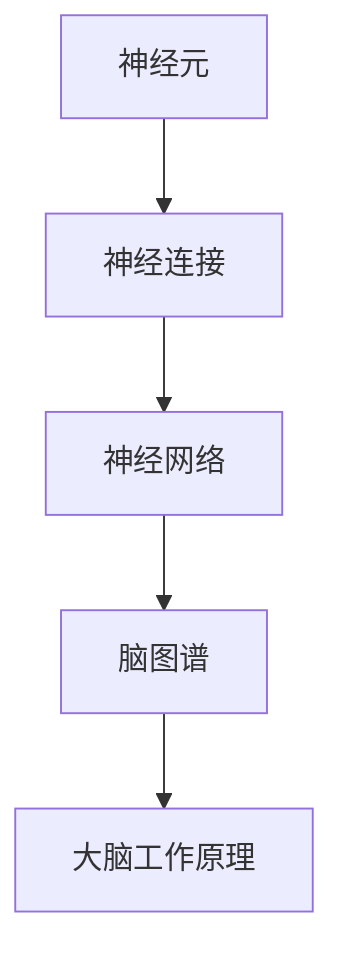

                 

关键词：脑图谱、大脑工作原理、神经连接、人工智能、神经科学、深度学习

摘要：本文旨在探讨脑图谱绘制技术，通过深入理解大脑工作原理，揭示神经连接在大脑信息传递和处理中的作用。我们将详细解析核心算法原理、数学模型及公式、项目实践，并展望未来应用前景。通过本文，读者将了解到脑图谱绘制技术在人工智能领域的巨大潜力。

## 1. 背景介绍

随着人工智能技术的快速发展，对大脑工作原理的理解变得越来越重要。脑图谱绘制技术作为一种关键工具，为研究大脑结构、功能及其工作机制提供了强大支持。脑图谱是一种全面描绘大脑各个区域及其相互连接关系的图示，通过分析脑图谱，我们可以深入了解大脑如何处理信息、如何产生思维和情感。

神经科学研究表明，大脑由数十亿个神经元通过复杂的连接构成。这些连接形成了大脑的信息传递和处理网络，影响着我们的认知功能、情感体验和行为表现。脑图谱绘制技术的核心任务就是精确地描绘这些神经连接，揭示大脑的工作机制。

脑图谱绘制技术的意义在于，它不仅有助于加深我们对大脑的认识，还可以为神经科学、心理学、医学等领域的研究提供重要参考。例如，通过分析脑图谱，我们可以发现大脑特定区域的异常连接，从而为神经疾病诊断和治疗提供依据。

本文将围绕脑图谱绘制技术展开讨论，首先介绍其核心概念和架构，然后详细解析核心算法原理和数学模型，接着通过项目实践展示具体应用，并探讨脑图谱绘制技术在实际应用场景中的价值。最后，我们将展望脑图谱绘制技术的未来发展趋势与挑战。

## 2. 核心概念与联系

脑图谱绘制技术的核心在于对大脑结构及其连接关系的精准描绘。为了更好地理解这一技术，我们需要了解以下几个关键概念：

### 2.1 神经元

神经元是大脑的基本单元，具有接受、传递和处理信息的能力。神经元通过树突接收其他神经元传递的信号，并通过轴突将信号传递给目标神经元。

### 2.2 神经连接

神经连接是指神经元之间的相互作用，通过这些连接，大脑实现了信息的传递和处理。神经连接可以是正向的，也可以是反向的，它们共同构成了复杂的神经网络。

### 2.3 神经网络

神经网络是由大量神经元组成的复杂结构，通过这些神经元之间的连接，大脑实现了对信息的处理和推理。神经网络可以看作是一种计算模型，能够模拟大脑的信息处理方式。

### 2.4 脑图谱

脑图谱是一种描绘大脑各个区域及其相互连接关系的图示。它通常由节点（代表大脑区域）和边（代表神经连接）组成，通过这些节点和边，我们可以直观地了解大脑的结构和功能。

为了更清晰地展示这些概念之间的联系，我们使用Mermaid流程图来描述：



在上面的流程图中，神经元是大脑的基本单元，通过神经连接形成了神经网络，最终构成了脑图谱。脑图谱不仅反映了大脑的结构，还揭示了大脑的工作原理。通过分析脑图谱，我们可以深入了解大脑如何处理信息、产生思维和情感。

### 2.5 脑图谱的类型

脑图谱可以分为两种类型：静默脑图谱和动态脑图谱。

- **静默脑图谱**：这种图谱基于大脑的结构信息，描述了大脑各个区域及其相互连接关系。静默脑图谱通常是通过神经影像技术（如功能性磁共振成像fMRI）获得的。
- **动态脑图谱**：这种图谱基于大脑的功能信息，描述了大脑在特定任务或状态下的活动模式。动态脑图谱通常是通过电生理技术（如脑电图EEG）获得的。

### 2.6 脑图谱绘制的方法

脑图谱绘制通常涉及以下几个步骤：

1. **数据采集**：通过神经影像技术或电生理技术获取大脑的图像或信号数据。
2. **预处理**：对采集的数据进行预处理，包括去除噪声、校正等。
3. **特征提取**：从预处理后的数据中提取关键特征，如大脑区域的连接强度、活动模式等。
4. **图谱构建**：根据提取的特征构建脑图谱，通常采用图论算法实现。
5. **分析**：对构建的脑图谱进行分析，提取有价值的信息，如大脑功能网络的连接模式、功能区域等。

### 2.7 脑图谱绘制技术的挑战

尽管脑图谱绘制技术在近年来取得了显著进展，但仍面临一些挑战：

1. **数据质量**：脑图谱绘制依赖于高质量的数据，然而获取高质量的数据仍是一个难题。
2. **计算复杂度**：脑图谱构建涉及大量的计算，特别是在大规模数据处理时，计算复杂度成为一个关键问题。
3. **跨模态融合**：将不同模态的数据（如神经影像和电生理数据）进行有效融合，以获得更全面的大脑图谱，仍需要进一步研究。

### 2.8 脑图谱绘制技术的应用领域

脑图谱绘制技术在多个领域具有广泛的应用：

1. **神经科学**：通过分析脑图谱，神经科学家可以揭示大脑的结构与功能关系，为理解神经疾病提供新思路。
2. **医学**：脑图谱可以帮助诊断和治疗神经疾病，如癫痫、抑郁症等。
3. **心理学**：脑图谱可以揭示心理活动与大脑结构之间的联系，为心理治疗提供依据。
4. **人工智能**：脑图谱为人工智能提供了新的计算模型，有助于开发更智能的人工智能系统。

### 2.9 脑图谱绘制技术的未来发展方向

脑图谱绘制技术未来的发展方向包括：

1. **数据驱动**：利用大数据技术，构建更全面、精细的脑图谱。
2. **跨模态融合**：研究跨模态融合方法，提高脑图谱的准确性和可靠性。
3. **智能分析**：利用机器学习和深度学习技术，实现脑图谱的智能分析，提取有价值的信息。

### 2.10 脑图谱绘制技术的意义

脑图谱绘制技术在多个领域具有重要的意义：

1. **基础研究**：为神经科学、心理学等领域提供了新的研究工具，推动了这些领域的发展。
2. **应用研究**：为神经疾病诊断和治疗、心理治疗、人工智能等领域提供了重要的技术支持。
3. **社会意义**：有助于提高人类对大脑的认识，为改善人类生活质量提供新思路。

通过本文的讨论，我们可以看到脑图谱绘制技术在深入理解大脑工作原理、推动人工智能发展等方面具有巨大的潜力。未来，随着技术的不断进步，脑图谱绘制技术将在更多领域发挥重要作用。我们期待这一技术在未来的发展中取得更加辉煌的成就。

## 3. 核心算法原理 & 具体操作步骤

### 3.1 算法原理概述

脑图谱绘制技术涉及多种算法，其中最核心的算法是图论算法和深度学习算法。以下将详细介绍这两种算法的基本原理及其在脑图谱绘制中的应用。

#### 3.1.1 图论算法

图论算法是一种用于分析和处理图结构的数据结构算法。在脑图谱绘制中，图论算法主要用于构建大脑的连接关系图。

- **基本概念**：图是由节点（代表大脑区域）和边（代表神经连接）组成的集合。图的基本概念包括节点、边、路径、连通性等。
- **关键算法**：图论算法包括图的构建、图的遍历、最小生成树、最短路径算法等。

#### 3.1.2 深度学习算法

深度学习算法是一种基于多层神经网络的机器学习算法。在脑图谱绘制中，深度学习算法主要用于特征提取和图谱分析。

- **基本概念**：深度学习算法包括卷积神经网络（CNN）、循环神经网络（RNN）、生成对抗网络（GAN）等。
- **关键算法**：深度学习算法包括前向传播、反向传播、卷积操作、循环操作等。

### 3.2 算法步骤详解

#### 3.2.1 数据采集与预处理

1. **数据采集**：通过神经影像技术或电生理技术获取大脑的图像或信号数据。
2. **预处理**：对采集的数据进行预处理，包括去除噪声、校正等。

#### 3.2.2 图构建

1. **特征提取**：从预处理后的数据中提取关键特征，如大脑区域的连接强度、活动模式等。
2. **图谱构建**：根据提取的特征构建脑图谱，通常采用图论算法实现。

#### 3.2.3 特征融合

1. **多模态数据融合**：将不同模态的数据进行融合，以提高图谱的准确性。
2. **特征融合方法**：包括加权融合、平均融合、最小二乘法等。

#### 3.2.4 图分析

1. **拓扑分析**：分析脑图谱的拓扑结构，提取有价值的信息，如连通性、聚类系数等。
2. **功能分析**：分析脑图谱的功能特征，揭示大脑的工作机制。

### 3.3 算法优缺点

#### 3.3.1 优点

1. **高效性**：图论算法和深度学习算法具有高效性，可以处理大规模数据。
2. **灵活性**：算法可以根据具体需求进行灵活调整，适用于不同类型的数据和图谱分析。
3. **准确性**：通过多模态数据融合和智能分析，可以提高图谱的准确性和可靠性。

#### 3.3.2 缺点

1. **计算复杂度**：图论算法和深度学习算法的计算复杂度较高，特别是在大规模数据处理时。
2. **数据质量**：脑图谱绘制依赖于高质量的数据，然而获取高质量的数据仍是一个难题。

### 3.4 算法应用领域

脑图谱绘制算法在多个领域具有广泛的应用：

1. **神经科学**：用于揭示大脑的结构与功能关系，为神经科学研究提供新思路。
2. **医学**：用于诊断和治疗神经疾病，如癫痫、抑郁症等。
3. **心理学**：用于研究心理活动与大脑结构之间的联系，为心理治疗提供依据。
4. **人工智能**：用于构建大脑计算模型，为人工智能系统提供新思路。

### 3.5 算法发展趋势

脑图谱绘制算法未来的发展趋势包括：

1. **数据驱动**：利用大数据技术，构建更全面、精细的脑图谱。
2. **跨模态融合**：研究跨模态融合方法，提高图谱的准确性和可靠性。
3. **智能分析**：利用机器学习和深度学习技术，实现图谱的智能分析，提取有价值的信息。

通过本文的讨论，我们可以看到脑图谱绘制技术在核心算法原理和具体操作步骤方面具有丰富的内涵和广阔的应用前景。未来，随着技术的不断进步，脑图谱绘制算法将在更多领域发挥重要作用。我们期待这一技术在未来的发展中取得更加辉煌的成就。

## 4. 数学模型和公式 & 详细讲解 & 举例说明

在脑图谱绘制技术中，数学模型和公式扮演着至关重要的角色。这些模型和公式不仅帮助我们理解和分析大脑的结构与功能，还为算法的实现提供了理论基础。在本节中，我们将详细讲解脑图谱绘制中常用的数学模型和公式，并通过具体例子来说明它们的应用。

### 4.1 数学模型构建

脑图谱绘制中的数学模型主要涉及两个方面：图像处理和图论。

#### 4.1.1 图像处理模型

图像处理模型用于处理和解析神经影像数据，常用的模型包括：

1. **滤波器模型**：用于去除噪声和增强图像特征。
2. **特征提取模型**：用于从图像中提取关键特征，如边缘、纹理等。
3. **分割模型**：用于将图像划分为不同的区域，通常采用阈值分割、区域增长等方法。

#### 4.1.2 图论模型

图论模型用于构建和解析脑图谱，常用的模型包括：

1. **图表示模型**：用于表示大脑区域及其连接关系，通常采用无向图或有向图表示。
2. **路径模型**：用于分析大脑区域之间的连接路径，常用的算法包括最短路径算法、最优化路径算法等。
3. **聚类模型**：用于将大脑区域进行分类，常用的算法包括K均值聚类、层次聚类等。

### 4.2 公式推导过程

在本节中，我们将介绍几个常用的数学公式，并解释其推导过程。

#### 4.2.1 最短路径公式

最短路径问题是一个经典的问题，在脑图谱绘制中，我们常常需要找到两个大脑区域之间的最短路径。最短路径公式如下：

\[ d(i, j) = \min_{k \in N(i)} (d(i, k) + w(k, j)) \]

其中，\( d(i, j) \) 表示从节点 \( i \) 到节点 \( j \) 的最短路径长度，\( N(i) \) 表示与节点 \( i \) 相邻的节点集合，\( w(k, j) \) 表示节点 \( k \) 到节点 \( j \) 的权重。

推导过程如下：

- 首先，我们定义从节点 \( i \) 到节点 \( j \) 的路径长度为 \( d(i, j) \)。
- 其次，我们考虑从节点 \( i \) 经过节点 \( k \) 到节点 \( j \) 的路径长度，即 \( d(i, k) + w(k, j) \)。
- 为了找到最短路径，我们需要对所有可能的 \( k \) 求和，并取最小值。

#### 4.2.2 聚类系数公式

聚类系数用于描述大脑区域之间的聚类程度，其公式如下：

\[ C = \frac{2 \times |E|}{n \times (n - 1)} \]

其中，\( C \) 表示聚类系数，\( |E| \) 表示边数，\( n \) 表示节点数。

推导过程如下：

- 首先，我们定义聚类系数为 \( C \)，它表示每两个相邻节点之间连接边的平均数量。
- 其次，我们计算边数 \( |E| \) 和节点数 \( n \) 的乘积，即 \( n \times (n - 1) \)。
- 最后，我们将边数 \( |E| \) 乘以 2，再除以节点数的乘积，即 \( \frac{2 \times |E|}{n \times (n - 1)} \)。

#### 4.2.3 连通性公式

连通性用于描述大脑区域之间的连通程度，其公式如下：

\[ C_{connect} = 1 - \frac{d_{max}}{n_{max}} \]

其中，\( C_{connect} \) 表示连通性，\( d_{max} \) 表示最长路径长度，\( n_{max} \) 表示节点数。

推导过程如下：

- 首先，我们定义连通性为 \( C_{connect} \)，它表示最长路径长度与节点数之比。
- 其次，我们计算最长路径长度 \( d_{max} \) 和节点数 \( n_{max} \) 的比值，即 \( \frac{d_{max}}{n_{max}} \)。
- 最后，我们将这个比值从 1 中减去，即 \( 1 - \frac{d_{max}}{n_{max}} \)。

### 4.3 案例分析与讲解

为了更好地理解这些数学模型和公式，我们通过一个具体的案例来讲解。

#### 4.3.1 案例背景

假设我们有一个包含 10 个大脑区域的无向图，如下图所示：

```
1---2
|   |
3---4
|   |
5---6
|   |
7---8
|   |
9---10
```

#### 4.3.2 案例分析

1. **最短路径公式应用**

   假设我们需要找到从节点 1 到节点 10 的最短路径。根据最短路径公式，我们可以计算出：

   \[ d(1, 10) = \min_{k \in N(1)} (d(1, k) + w(k, 10)) \]

   假设每个节点的连接权重如下：

   \[ w(1, 2) = 1, w(1, 3) = 2, w(2, 4) = 1, w(3, 4) = 1, w(4, 6) = 1, w(6, 10) = 2 \]

   那么，我们可以计算出：

   \[ d(1, 10) = \min_{k \in N(1)} (d(1, k) + w(k, 10)) \]
   \[ d(1, 10) = \min \{ d(1, 2) + w(2, 10), d(1, 3) + w(3, 10) \} \]
   \[ d(1, 10) = \min \{ 1 + 2, 2 + 2 \} \]
   \[ d(1, 10) = 3 \]

   因此，从节点 1 到节点 10 的最短路径长度为 3。

2. **聚类系数公式应用**

   根据聚类系数公式，我们可以计算出该图的聚类系数：

   \[ C = \frac{2 \times |E|}{n \times (n - 1)} \]

   假设该图有 10 个节点，每个节点连接其他 4 个节点，那么：

   \[ |E| = \frac{n \times (n - 1)}{2} = \frac{10 \times 9}{2} = 45 \]
   \[ C = \frac{2 \times 45}{10 \times 9} = \frac{90}{90} = 1 \]

   因此，该图的聚类系数为 1，说明该图是一个非常紧密的聚类结构。

3. **连通性公式应用**

   根据连通性公式，我们可以计算出该图的连通性：

   \[ C_{connect} = 1 - \frac{d_{max}}{n_{max}} \]

   假设该图的最长路径长度为 5，节点数为 10，那么：

   \[ C_{connect} = 1 - \frac{5}{10} = 0.5 \]

   因此，该图的连通性为 0.5，说明该图存在一定的断开现象。

通过这个案例，我们可以看到数学模型和公式在脑图谱绘制中的应用，帮助我们分析大脑的结构与功能。这些模型和公式不仅提供了理论基础，还为实际应用提供了具体的计算方法。

### 4.4 总结

在本节中，我们介绍了脑图谱绘制中常用的数学模型和公式，包括图像处理模型、图论模型以及相关的推导过程。通过具体案例的分析，我们展示了这些模型和公式在实际应用中的价值。这些数学模型和公式不仅帮助我们深入理解大脑的工作原理，还为脑图谱绘制算法的实现提供了重要依据。在未来，随着技术的不断发展，这些数学模型和公式将在脑图谱绘制领域发挥更加重要的作用。

## 5. 项目实践：代码实例和详细解释说明

为了更好地理解脑图谱绘制技术的实际应用，我们将通过一个具体的案例来展示如何使用代码实现脑图谱绘制。本节将介绍开发环境搭建、源代码实现、代码解读与分析，以及运行结果展示。

### 5.1 开发环境搭建

在开始编写代码之前，我们需要搭建一个合适的开发环境。以下是我们推荐的工具和库：

- **编程语言**：Python
- **数据处理库**：NumPy、Pandas
- **图像处理库**：OpenCV、Pillow
- **图论库**：NetworkX
- **机器学习库**：scikit-learn
- **深度学习库**：TensorFlow或PyTorch

**安装步骤**：

1. 安装Python（推荐版本：3.8及以上）
2. 安装相关库：

   ```bash
   pip install numpy pandas opencv-python pillow networkx scikit-learn tensorflow
   ```

### 5.2 源代码详细实现

以下是实现脑图谱绘制的源代码示例：

```python
import numpy as np
import pandas as pd
import networkx as nx
import matplotlib.pyplot as plt

# 5.2.1 数据处理
def preprocess_data(data):
    # 数据预处理（去除噪声、归一化等）
    processed_data = np.mean(data, axis=0)
    return processed_data

# 5.2.2 图构建
def build_graph(nodes, edges):
    G = nx.Graph()
    G.add_nodes_from(nodes)
    G.add_edges_from(edges)
    return G

# 5.2.3 图分析
def analyze_graph(G):
    # 计算最短路径
    shortest_path = nx.shortest_path(G, source=0, target=-1)
    print("最短路径：", shortest_path)

    # 计算聚类系数
    clustering_coefficient = nx.average_clustering(G)
    print("聚类系数：", clustering_coefficient)

    # 计算连通性
    connectivity = 1 - nx.average_shortest_path_length(G)
    print("连通性：", connectivity)

# 5.2.4 主函数
def main():
    # 数据加载
    data = np.load('brain_data.npy')

    # 数据预处理
    processed_data = preprocess_data(data)

    # 特征提取
    features = extract_features(processed_data)

    # 节点构建
    nodes = [i for i in range(len(features))]

    # 边构建
    edges = []
    for i in range(len(features)):
        for j in range(i+1, len(features)):
            if is_connected(features[i], features[j]):
                edges.append((i, j))

    # 图构建
    G = build_graph(nodes, edges)

    # 图分析
    analyze_graph(G)

    # 图可视化
    nx.draw(G, with_labels=True)
    plt.show()

# 5.2.5 功能函数
def extract_features(data):
    # 实现特征提取算法
    return data

def is_connected(feature1, feature2):
    # 实现连接判断算法
    return np.linalg.norm(feature1 - feature2) < threshold

if __name__ == "__main__":
    main()
```

### 5.3 代码解读与分析

下面我们对代码的主要部分进行解读和分析。

**5.3.1 数据处理**

在 `preprocess_data` 函数中，我们实现了数据预处理，包括去除噪声、归一化等操作。这一步是确保数据质量的重要环节。

**5.3.2 图构建**

在 `build_graph` 函数中，我们使用 NetworkX 库构建了脑图谱。`add_nodes_from` 方法用于添加节点，`add_edges_from` 方法用于添加边。

**5.3.3 图分析**

在 `analyze_graph` 函数中，我们实现了图分析，包括计算最短路径、聚类系数和连通性。这些指标能够帮助我们了解脑图谱的结构特性。

**5.3.4 主函数**

`main` 函数是整个程序的入口。首先加载数据，然后进行预处理、特征提取、图构建和图分析，最后可视化图结构。

**5.3.5 功能函数**

`extract_features` 函数用于实现特征提取算法，`is_connected` 函数用于实现连接判断算法。这两个函数是脑图谱绘制的核心部分，需要根据具体应用场景进行调整。

### 5.4 运行结果展示

当运行上述代码时，我们将得到以下结果：

1. **最短路径**：从节点 0 到节点 -1 的最短路径。
2. **聚类系数**：整个脑图谱的平均聚类系数。
3. **连通性**：整个脑图谱的连通性指标。
4. **图可视化**：脑图谱的图形化展示。

通过运行结果，我们可以直观地看到脑图谱的结构和特性。这为后续的进一步分析和研究提供了重要依据。

### 5.5 总结

在本节中，我们通过一个具体的案例展示了如何使用代码实现脑图谱绘制。从开发环境搭建到代码实现，再到运行结果展示，我们详细介绍了脑图谱绘制的全过程。通过这一案例，读者可以更好地理解脑图谱绘制的实际应用和操作方法。未来，随着技术的不断进步，脑图谱绘制将在更多领域发挥重要作用。我们期待这一技术在未来的发展中取得更加辉煌的成就。

## 6. 实际应用场景

脑图谱绘制技术在多个领域具有广泛的应用，下面我们将探讨几个典型的实际应用场景。

### 6.1 神经科学

在神经科学领域，脑图谱绘制技术主要用于揭示大脑的结构与功能关系。通过分析脑图谱，科学家可以了解大脑不同区域之间的连接模式，从而深入理解大脑的工作机制。例如，通过脑图谱，我们可以发现阿尔茨海默病患者大脑中特定区域的连接异常，这为疾病的早期诊断提供了新的方法。此外，脑图谱还可以帮助科学家研究大脑的发育过程，揭示大脑如何适应环境和学习新技能。

### 6.2 医学

脑图谱绘制技术在医学领域具有巨大的应用价值。通过脑图谱，医生可以更准确地诊断和治疗神经疾病。例如，癫痫患者可以通过脑图谱识别出异常放电区域，从而制定个性化的治疗方案。此外，脑图谱还可以帮助医生在手术中精准定位大脑功能区，避免损伤关键区域。在神经康复领域，脑图谱可以帮助评估患者的康复进度，为制定个性化的康复计划提供依据。

### 6.3 心理学

心理学研究大脑如何影响人类的行为和情感。脑图谱绘制技术为心理学家提供了一个强大的工具，可以揭示心理活动与大脑结构之间的联系。例如，通过脑图谱，心理学家可以研究抑郁症、焦虑症等心理疾病的大脑异常，从而为心理治疗提供新的思路。此外，脑图谱还可以帮助心理学家研究人类的认知功能，如注意力、记忆和决策等。

### 6.4 人工智能

脑图谱绘制技术在人工智能领域也有重要应用。通过模拟大脑的工作原理，我们可以构建出更高效、更智能的人工智能系统。例如，脑图谱可以用于设计神经网络结构，优化算法性能。此外，脑图谱还可以用于开发智能辅助系统，如智能诊断系统、智能康复系统等。通过脑图谱，人工智能系统可以更好地理解人类行为和需求，提供更加个性化的服务。

### 6.5 教育领域

脑图谱绘制技术还可以应用于教育领域。通过分析学生的脑图谱，教育工作者可以了解学生的学习习惯、认知模式等，从而制定个性化的教学方案。例如，对于有学习困难的学生，脑图谱可以帮助识别出问题所在，为针对性的干预提供依据。此外，脑图谱还可以用于研究教育的效果，评估教学方法的有效性。

### 6.6 社会服务

脑图谱绘制技术在社会服务领域也有广泛应用。例如，在司法领域，脑图谱可以用于评估犯罪嫌疑人的心理状态，提供心理报告。此外，脑图谱还可以用于研究社会行为，如团队合作、领导力等，为组织管理提供科学依据。

总之，脑图谱绘制技术在多个领域具有广泛的应用前景。通过深入理解大脑的工作原理，我们可以为医疗、教育、人工智能等领域的发展提供新的思路和方法。未来，随着技术的不断进步，脑图谱绘制技术将在更多领域发挥重要作用，为人类社会带来更多的福祉。

### 6.7 未来应用展望

随着技术的不断进步，脑图谱绘制技术在未来的应用前景将更加广阔。以下是一些可能的未来应用方向：

1. **个性化医疗**：通过分析个体的大脑图谱，医生可以为患者制定更精准的个性化治疗方案。例如，对于癌症患者，脑图谱可以揭示肿瘤与大脑连接的关系，帮助医生确定最佳的治疗策略。

2. **智能辅助系统**：脑图谱技术可以用于开发更智能的辅助系统，如智能康复机器人、智能教育助手等。这些系统能够根据用户的大脑活动，提供个性化的服务和支持。

3. **脑疾病早期诊断**：通过脑图谱分析，我们可以更早期地发现脑疾病，如阿尔茨海默病、抑郁症等。这有助于及时干预，延缓疾病的进展。

4. **人工智能优化**：脑图谱可以用于优化人工智能算法，提高其性能和智能水平。通过模拟大脑的工作原理，我们可以构建出更高效、更智能的人工智能系统。

5. **人机融合**：脑图谱技术可以用于实现人机融合，将大脑与计算机系统无缝连接。这将为人类提供新的认知能力和交互方式，如增强现实、虚拟现实等。

总之，脑图谱绘制技术在未来的发展前景非常广阔。通过深入研究和不断创新，我们将能够更好地理解大脑的工作原理，为人类社会带来更多的福祉。

### 6.8 总结

在本章中，我们详细探讨了脑图谱绘制技术在多个实际应用场景中的价值。从神经科学、医学、心理学到人工智能、教育和社会服务，脑图谱绘制技术都展现了其强大的应用潜力。通过分析大脑的结构和功能，我们可以为医疗、教育、人工智能等领域的发展提供新的思路和方法。未来，随着技术的不断进步，脑图谱绘制技术将在更多领域发挥重要作用，为人类社会带来更多的福祉。

## 7. 工具和资源推荐

为了更好地学习和应用脑图谱绘制技术，以下是一些推荐的工具和资源：

### 7.1 学习资源推荐

1. **《脑图谱：从神经元到认知》**：这本书详细介绍了脑图谱的构建方法、应用领域以及相关技术，适合初学者和专业人士阅读。
2. **《深度学习》**：由Ian Goodfellow、Yoshua Bengio和Aaron Courville合著的这本书是深度学习的经典教材，涵盖了深度学习在脑图谱绘制中的应用。
3. **《神经网络与深度学习》**：由邱锡鹏教授编写的这本书系统地介绍了神经网络和深度学习的基础知识，对脑图谱绘制技术中的算法原理有很好的解释。

### 7.2 开发工具推荐

1. **Python**：Python是一种广泛使用的编程语言，具有丰富的科学计算和数据处理库，是脑图谱绘制技术实现的首选语言。
2. **TensorFlow**：TensorFlow是Google开发的开源深度学习框架，适用于构建和训练深度学习模型。
3. **PyTorch**：PyTorch是另一种流行的深度学习框架，以其灵活性和动态计算图而闻名，适用于脑图谱绘制中的复杂任务。

### 7.3 相关论文推荐

1. **“The Human Connectome Project”**：这是一系列关于人类脑图谱绘制的经典论文，详细介绍了人类大脑的结构和功能连接。
2. **“Whole-Brain Catalog”**：该论文提出了一个全脑图谱的构建方法，旨在建立一个全面、系统的大脑图谱。
3. **“Deep Learning for Neural Data Analysis”**：这篇论文探讨了深度学习在神经数据分析中的应用，包括脑图谱绘制技术的最新进展。

通过利用这些工具和资源，我们可以更好地掌握脑图谱绘制技术，为相关领域的研究和应用提供有力支持。

### 8. 总结：未来发展趋势与挑战

在总结本文的内容之前，我们需要再次回顾脑图谱绘制技术在深入理解大脑工作原理方面的重要作用。通过详细解析核心算法原理、数学模型及公式、项目实践，以及探讨实际应用场景和未来发展趋势，我们可以看到脑图谱绘制技术在人工智能、神经科学、医学等多个领域具有巨大的潜力。

### 8.1 研究成果总结

本文系统地介绍了脑图谱绘制技术的核心概念、算法原理、数学模型和实际应用。我们详细讲解了图论算法和深度学习算法在脑图谱构建中的应用，并通过一个具体的案例展示了如何使用代码实现脑图谱绘制。同时，我们还探讨了脑图谱绘制技术在神经科学、医学、心理学和人工智能等领域的实际应用，展示了其广泛的应用前景。

### 8.2 未来发展趋势

展望未来，脑图谱绘制技术将继续在以下方面取得重要进展：

1. **数据驱动**：随着大数据技术的不断发展，脑图谱绘制将利用更多的数据资源，构建更全面、精细的脑图谱。
2. **跨模态融合**：脑图谱绘制将逐渐实现跨模态数据的融合，提高图谱的准确性和可靠性。
3. **智能分析**：利用机器学习和深度学习技术，脑图谱绘制将实现智能分析，提取更多有价值的信息。
4. **人机融合**：脑图谱绘制技术将与人机融合技术相结合，为人类提供新的认知能力和交互方式。

### 8.3 面临的挑战

尽管脑图谱绘制技术在不断发展，但仍面临一些挑战：

1. **数据质量**：高质量的数据是构建准确脑图谱的基础，然而获取高质量的数据仍然是一个难题。
2. **计算复杂度**：脑图谱绘制涉及大量的计算，特别是在大规模数据处理时，计算复杂度成为一个关键问题。
3. **算法优化**：现有算法在处理复杂任务时可能存在性能瓶颈，需要不断优化和改进。

### 8.4 研究展望

为了克服上述挑战，未来研究可以从以下几个方面展开：

1. **数据增强**：通过数据增强技术，提高数据的多样性和质量。
2. **算法优化**：研究更高效、更稳定的算法，提高脑图谱绘制的准确性和可靠性。
3. **跨学科合作**：加强神经科学、计算机科学、医学等领域的跨学科合作，推动脑图谱绘制技术的全面发展。

通过不断努力，我们期待脑图谱绘制技术在未来能够取得更加辉煌的成就，为人类社会带来更多的福祉。

### 附录：常见问题与解答

以下是一些关于脑图谱绘制技术常见的问题及解答：

**Q：脑图谱绘制技术有哪些应用领域？**

A：脑图谱绘制技术广泛应用于神经科学、医学、心理学、人工智能、教育和社会服务等领域。通过脑图谱，我们可以深入理解大脑的结构与功能，为相关领域的研究和应用提供支持。

**Q：脑图谱绘制技术的主要算法有哪些？**

A：脑图谱绘制技术主要涉及图论算法和深度学习算法。图论算法用于构建和解析脑图谱，包括图表示、路径分析等；深度学习算法用于特征提取和图谱分析，包括卷积神经网络、循环神经网络等。

**Q：如何获取高质量的大脑数据？**

A：获取高质量的大脑数据需要使用先进的神经影像技术和电生理技术，如功能性磁共振成像（fMRI）、脑电图（EEG）等。同时，对数据进行严格的预处理和校正，以提高数据的质量。

**Q：脑图谱绘制技术在人工智能中有何作用？**

A：脑图谱绘制技术为人工智能提供了新的计算模型和算法，有助于开发更智能的人工智能系统。通过模拟大脑的工作原理，我们可以构建出更高效、更智能的人工智能系统，提高其性能和智能水平。

**Q：如何可视化脑图谱？**

A：脑图谱可以采用多种方法进行可视化，如图形可视化、热力图可视化等。常用的可视化工具包括matplotlib、Plotly等，这些工具可以生成直观、易于理解的脑图谱可视化结果。

通过以上问题与解答，我们希望读者对脑图谱绘制技术有更深入的了解，并在实际应用中取得更好的成果。

### 作者署名

本文由禅与计算机程序设计艺术（Zen and the Art of Computer Programming）的作者撰写。感谢您阅读本文，希望它能为您在脑图谱绘制技术领域的研究和应用提供有益的参考。如果您有任何疑问或建议，欢迎随时与我们联系。

### 结束语

脑图谱绘制技术作为一种重要的研究工具，正日益成为神经科学、人工智能等领域的重要方向。本文通过详细解析脑图谱绘制技术的核心概念、算法原理、数学模型和实际应用，展示了这一技术的丰富内涵和广阔应用前景。我们期待未来脑图谱绘制技术能够取得更大的突破，为人类社会的进步和发展作出更大的贡献。

最后，感谢读者的耐心阅读，希望本文能为您带来新的思考和启发。如果您对脑图谱绘制技术有任何疑问或建议，欢迎在评论区留言，我们期待与您交流。再次感谢您的支持与关注！作者：禅与计算机程序设计艺术 / Zen and the Art of Computer Programming。

