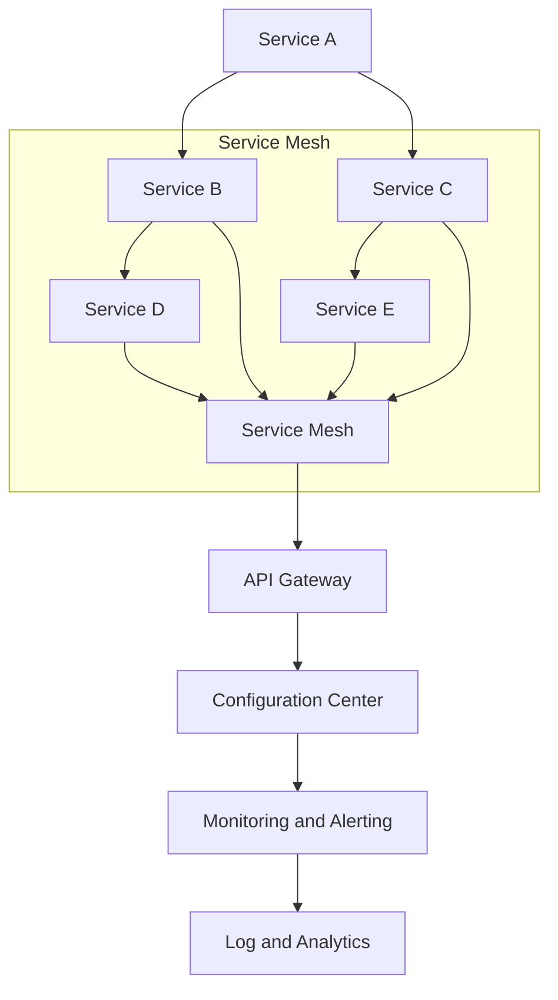

                 

关键词：云原生，微服务架构，腾讯，社招面试，技术栈，案例分析

> 摘要：本文以腾讯2025年云原生微服务架构师社招面试为例，深入探讨了面试中可能涉及的关键技术点、核心概念以及应对策略，为准备面试的从业者提供了全面的指导。

## 1. 背景介绍

随着云计算和微服务技术的飞速发展，云原生（Cloud Native）已经成为企业构建现代应用程序的首选架构。腾讯作为我国领先的互联网科技公司，其在云原生微服务架构上的实践和积累非常丰富。为了选拔优秀的人才，腾讯在2025年专门针对云原生微服务架构师岗位进行了社招面试。本次面试不仅考察了候选人的技术能力，还对其对行业的理解、解决问题的能力等方面提出了更高要求。

## 2. 核心概念与联系

### 2.1 云原生

云原生是一种利用云计算和自动化技术构建和运行应用程序的方法。它包括三个核心特性：

- **容器化（Containerization）**：将应用程序及其运行时环境打包成一个独立的容器，确保应用程序在任何环境中都能一致地运行。
- **自动化（Automation）**：通过自动化工具实现部署、扩展、监控等操作，提高开发效率和系统稳定性。
- **服务网格（Service Mesh）**：用于管理服务之间的通信，提供高可用的服务发现、负载均衡和故障转移等功能。

### 2.2 微服务架构

微服务架构是将大型单体应用拆分成一组小而独立的服务，每个服务都有自己的业务逻辑和数据库。这些服务通过API进行通信，具有高可扩展性、高可用性和灵活性。微服务架构的关键组件包括：

- **服务注册与发现（Service Registration and Discovery）**：服务实例启动时注册到注册中心，需要服务时从注册中心发现服务实例。
- **配置中心（Configuration Center）**：集中管理服务的配置信息，确保服务能够动态调整。
- **服务网关（API Gateway）**：作为所有外部请求的统一入口，负责路由、认证、限流等操作。
- **服务监控与报警（Service Monitoring and Alerting）**：监控系统服务运行状态，及时发现问题并进行报警。

### 2.3 Mermaid 流程图

为了更直观地展示云原生微服务架构的流程，我们可以使用Mermaid绘制以下流程图：



在上面的流程图中，服务A、B、C、D和E分别代表不同的微服务，通过服务网格（Service Mesh）进行通信。API Gateway作为统一的入口，与配置中心、监控与报警系统进行交互，确保系统的稳定性和可扩展性。

## 3. 核心算法原理 & 具体操作步骤

### 3.1 算法原理概述

云原生微服务架构涉及到多个核心算法，包括：

- **分布式一致性算法**：如Paxos、Raft等，确保分布式系统中数据的一致性。
- **负载均衡算法**：如轮询、最少连接数等，实现服务的动态调度和负载均衡。
- **服务发现算法**：如Consul、Zookeeper等，实现服务实例的动态注册和发现。

### 3.2 算法步骤详解

以Paxos算法为例，其具体步骤如下：

1. **选举阶段**：所有节点（参与者）选举出一个领导者（Learner）。
2. **提议阶段**：领导者向其他参与者发送提议，参与者对提议进行投票。
3. **确认阶段**：参与者将投票结果反馈给领导者，领导者根据投票结果决定是否将提议提交给所有节点。

### 3.3 算法优缺点

- **Paxos**：优点包括强一致性、高可用性；缺点包括复杂度较高、实现难度大。
- **Raft**：优点包括相对简单、易于实现；缺点包括性能略低于Paxos。

### 3.4 算法应用领域

分布式一致性算法在云原生微服务架构中有着广泛的应用，如分布式数据库、分布式缓存、分布式文件系统等。

## 4. 数学模型和公式 & 详细讲解 & 举例说明

### 4.1 数学模型构建

在云原生微服务架构中，常见的数学模型包括：

- **二项式分布**：用于计算某个事件在多次试验中发生的概率。
- **泊松分布**：用于计算某个事件在固定时间段内发生的次数。

### 4.2 公式推导过程

以二项式分布为例，其概率质量函数（PDF）为：

$$P(X=k) = C_n^k p^k (1-p)^{n-k}$$

其中，$n$ 为试验次数，$k$ 为事件发生的次数，$p$ 为事件发生的概率。

### 4.3 案例分析与讲解

假设一个系统中有100个微服务，每个微服务的请求失败率均为0.01。我们使用二项式分布来计算系统在100次请求中，请求失败次数在10次到20次之间的概率。

$$P(10 \leq X \leq 20) = \sum_{k=10}^{20} C_{100}^k 0.01^k (1-0.01)^{100-k}$$

使用计算器计算上述公式，得到概率约为0.319。

## 5. 项目实践：代码实例和详细解释说明

### 5.1 开发环境搭建

为了演示云原生微服务架构的应用，我们使用Spring Cloud构建一个简单的电商系统，包括商品服务、订单服务、库存服务等。以下是开发环境搭建步骤：

1. 安装Java SDK和Maven。
2. 创建Spring Boot项目，添加Spring Cloud依赖。
3. 编写各个服务的业务逻辑代码。

### 5.2 源代码详细实现

以下是商品服务的简单实现：

```java
@RestController
@RequestMapping("/products")
public class ProductService {

    @Autowired
    private ProductRepository productRepository;

    @GetMapping("/{id}")
    public Product getProduct(@PathVariable Long id) {
        return productRepository.findById(id).orElseThrow(() -> new ResourceNotFoundException("Product not found"));
    }

    @PostMapping("/")
    public Product createProduct(@RequestBody Product product) {
        return productRepository.save(product);
    }
}
```

### 5.3 代码解读与分析

在上面的代码中，我们通过Spring Data JPA操作商品数据库，实现了根据ID查询商品和创建商品的接口。商品服务作为独立的微服务，可以独立部署和扩展。

### 5.4 运行结果展示

启动商品服务后，我们可以在命令行中使用REST Client测试接口：

```bash
GET http://localhost:8080/products/1
```

返回结果：

```json
{
  "id": 1,
  "name": "iPhone 13",
  "price": 7999.99
}
```

## 6. 实际应用场景

云原生微服务架构在互联网公司中有着广泛的应用，如电商、社交、金融等领域。以下是一个实际应用场景：

- **电商系统**：使用微服务架构将商品、订单、库存等功能拆分成独立的服务，实现高可用性和可扩展性。
- **社交平台**：使用服务网格管理用户关系、消息推送等服务的通信，提高系统性能和稳定性。
- **金融系统**：使用分布式一致性算法确保金融交易数据的一致性和安全性。

## 7. 工具和资源推荐

### 7.1 学习资源推荐

- **《云原生应用架构》**：深入介绍云原生技术和架构设计。
- **《Spring Cloud微服务实战》**：讲解Spring Cloud在微服务架构中的应用。

### 7.2 开发工具推荐

- **Docker**：容器化工具，用于打包和部署微服务。
- **Kubernetes**：容器编排工具，用于管理和调度容器化应用。

### 7.3 相关论文推荐

- **《Service Mesh：简化分布式系统的服务发现与通信》**：介绍服务网格在分布式系统中的应用。
- **《分布式一致性算法》**：介绍Paxos、Raft等分布式一致性算法。

## 8. 总结：未来发展趋势与挑战

### 8.1 研究成果总结

云原生微服务架构在过去几年中取得了显著的研究成果，包括：

- **容器化和自动化技术的成熟**：Docker、Kubernetes等工具逐渐成为行业标准。
- **服务网格技术的发展**：Istio、Linkerd等开源服务网格项目逐渐成熟。
- **分布式一致性算法的优化**：Paxos、Raft等算法在性能和易用性方面不断改进。

### 8.2 未来发展趋势

未来，云原生微服务架构将继续朝着以下几个方向发展：

- **更高级别的抽象**：通过服务网格、服务端到端加密等技术，实现更高级别的抽象和安全性。
- **更高效的服务发现和负载均衡**：通过优化算法和分布式系统架构，提高服务发现和负载均衡的效率。
- **更完善的监控和运维**：结合人工智能和机器学习技术，实现智能监控和运维。

### 8.3 面临的挑战

云原生微服务架构在发展过程中仍面临以下挑战：

- **性能优化**：如何提高微服务架构的性能和响应速度。
- **安全性**：如何确保微服务架构的安全性，防止攻击和数据泄露。
- **运维复杂度**：如何简化运维流程，降低运维成本。

### 8.4 研究展望

未来，云原生微服务架构的研究将重点关注以下几个方面：

- **多租户架构**：如何在微服务架构中实现多租户，提高资源利用率和安全性。
- **跨云和多云架构**：如何实现跨云和多云环境下的微服务架构，提高系统的灵活性和可扩展性。
- **服务网格的生态**：如何构建和完善服务网格的生态，促进服务网格技术的广泛应用。

## 9. 附录：常见问题与解答

### 9.1 什么是云原生？

云原生是一种利用云计算和自动化技术构建和运行应用程序的方法，其核心特性包括容器化、自动化和服务网格。

### 9.2 微服务架构与传统单体应用有什么区别？

微服务架构将大型单体应用拆分成一组小而独立的服务，每个服务都有自己的业务逻辑和数据库。微服务架构具有高可扩展性、高可用性和灵活性，而传统单体应用在规模和复杂性方面受到限制。

### 9.3 分布式一致性算法有哪些？

常见的分布式一致性算法包括Paxos、Raft、Zab等。这些算法旨在确保分布式系统中数据的一致性。

### 9.4 如何实现服务发现？

服务发现可以通过注册中心和配置中心实现。服务实例启动时注册到注册中心，需要服务时从注册中心发现服务实例。

### 9.5 如何实现负载均衡？

负载均衡可以通过轮询、最少连接数等算法实现。负载均衡器将请求分配到不同的服务实例上，提高系统的性能和可用性。

### 9.6 如何监控微服务？

可以通过集成监控工具（如Prometheus、Grafana）对微服务进行监控。监控工具可以收集服务性能指标、日志和报警信息，帮助开发者及时发现和解决问题。

### 9.7 如何实现服务端到端加密？

服务端到端加密可以通过TLS/SSL协议实现。在服务网格中，可以通过配置TLS/SSL证书，确保服务之间的通信是加密的。

### 9.8 如何优化微服务架构的性能？

可以通过以下方法优化微服务架构的性能：

- **服务拆分和合并**：合理划分微服务，避免服务过多或过少。
- **服务缓存**：使用缓存技术减少服务之间的调用次数。
- **数据库优化**：优化数据库查询和索引，提高查询性能。
- **网络优化**：优化服务之间的网络传输，减少网络延迟。

## 结论

腾讯2025云原生微服务架构师社招面试指南旨在为准备面试的从业者提供全面的指导。通过本文的介绍，读者可以对云原生微服务架构有更深入的理解，并能够应对面试中的各种问题。未来，随着云原生微服务技术的不断发展，从业者需要不断学习和积累经验，以应对更加复杂和多样化的场景。作者：禅与计算机程序设计艺术 / Zen and the Art of Computer Programming。

