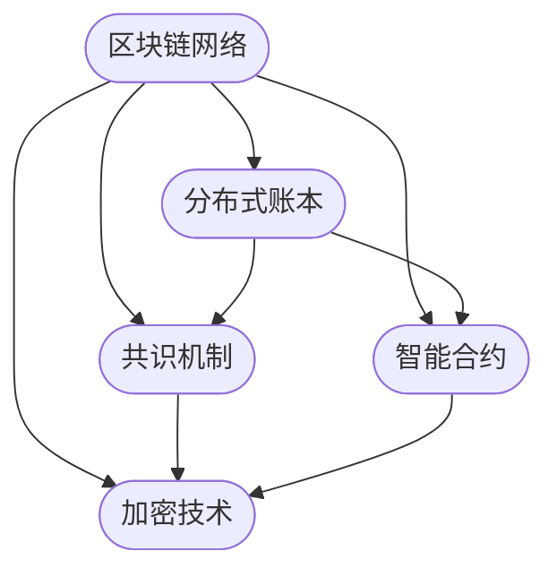

                 

关键词：腾讯，社招，区块链，技术专家，面试题，汇总

摘要：本文汇集了腾讯2025社招区块链技术专家面试题，涵盖了区块链技术的基础知识、核心算法、实际应用、未来展望等多个方面。通过详细解读这些面试题，读者可以更好地理解区块链技术的全貌，为面试和实际应用提供指导。

## 1. 背景介绍

区块链技术作为近年来信息技术领域的热门话题，正逐渐渗透到金融、供应链、物联网等多个行业。腾讯作为中国领先的互联网科技公司，在区块链技术的研究与应用方面也走在了前列。为了吸引更多优秀的技术人才，腾讯在2025年社招中专门设置了区块链技术专家岗位，面向全社会招聘。

本文将基于腾讯2025社招区块链技术专家面试题，对区块链技术进行系统性的梳理和解读。希望通过本文，读者可以全面了解区块链技术的核心概念、算法原理、应用场景和未来发展趋势。

### 1.1 区块链技术的起源与发展

区块链技术起源于2008年，由一位名为中本聪（Satoshi Nakamoto）的匿名人物提出。最初，区块链被设计用于实现比特币的分布式记账系统，以解决传统金融系统中的信任问题。

随着区块链技术的不断发展和完善，其应用范围逐渐扩大到金融领域以外的多个行业。当前，区块链技术已经成为一种重要的分布式数据库技术，被广泛应用于供应链管理、版权保护、智能合约、数字身份认证等领域。

### 1.2 区块链技术的核心概念

区块链技术主要包括以下核心概念：

- **分布式账本**：区块链是一种分布式数据库，其中的数据存储在多个节点上，避免了单点故障和数据篡改的风险。

- **共识机制**：共识机制是区块链系统中的核心算法，用于确保所有节点对数据的共识。常见的共识机制包括工作量证明（PoW）、权益证明（PoS）、授权股权证明（DPoS）等。

- **智能合约**：智能合约是一种自动执行、控制和文档化的协议，其运行基于区块链网络。智能合约可以自动执行预定义的规则，实现去中心化的交易和合约执行。

- **加密技术**：区块链技术依赖于多种加密算法，如哈希算法、非对称加密、数字签名等，用于保护数据的安全性和隐私性。

## 2. 核心概念与联系

在深入探讨区块链技术的核心算法原理之前，我们首先需要了解区块链技术的基本架构及其各部分之间的关系。以下是一个简化的区块链架构图，使用Mermaid流程图表示。



### 2.1 区块链网络

区块链网络是区块链技术的基础设施，它由多个节点组成。每个节点都负责存储部分区块链数据，并参与共识机制的执行。区块链网络中的节点可以是普通计算机、服务器或特殊硬件设备。

### 2.2 分布式账本

分布式账本是区块链技术的核心组件，用于存储交易数据。每个区块都包含一定数量的交易记录，并将这些交易记录有序地链接成一个链条。分布式账本的特点是去中心化、不可篡改和透明。

### 2.3 共识机制

共识机制是区块链网络中节点之间达成一致的关键算法。不同的共识机制有不同的特点和应用场景。例如，工作量证明（PoW）需要节点通过计算大量数据来竞争记账权；权益证明（PoS）则根据节点的持股比例来决定记账权。

### 2.4 智能合约

智能合约是一种自动执行、控制和文档化的协议。它基于区块链网络运行，可以自动执行预定义的规则，实现去中心化的交易和合约执行。智能合约的使用可以简化合同执行流程，提高交易效率。

### 2.5 加密技术

加密技术是区块链技术的重要支撑，用于保护数据的安全性和隐私性。常见的加密算法包括哈希算法、非对称加密和数字签名等。哈希算法用于确保数据的唯一性和完整性；非对称加密和非对称加密用于保障数据传输的安全性。

## 3. 核心算法原理 & 具体操作步骤

### 3.1 算法原理概述

区块链技术中的核心算法主要包括共识机制、哈希算法和智能合约。以下分别对这三种算法进行概述。

#### 3.1.1 共识机制

共识机制是区块链网络中节点之间达成一致的关键算法。它用于确保所有节点对区块链数据的一致性。常见的共识机制包括：

- **工作量证明（PoW）**：节点通过计算大量数据来竞争记账权，计算量越大，记账概率越高。这种机制虽然安全，但计算资源消耗较大。

- **权益证明（PoS）**：节点根据其持有的币种数量和时长来竞争记账权，币种数量和时长越多，记账概率越高。这种机制相对于PoW更节能，但可能面临“富者愈富”的问题。

- **授权股权证明（DPoS）**：节点通过选举代表来竞争记账权，代表根据投票数量和权重来确定记账顺序。这种机制提高了记账效率，但可能面临代表选举不公的问题。

#### 3.1.2 哈希算法

哈希算法是一种将任意长度的数据映射为固定长度数据的算法。在区块链技术中，哈希算法用于确保数据的唯一性和完整性。常见的哈希算法包括MD5、SHA-1、SHA-256等。其中，SHA-256算法在比特币网络中被广泛应用。

#### 3.1.3 智能合约

智能合约是一种自动执行、控制和文档化的协议。它基于区块链网络运行，可以自动执行预定义的规则，实现去中心化的交易和合约执行。智能合约的使用可以简化合同执行流程，提高交易效率。常见的智能合约语言包括Solidity、Vyper等。

### 3.2 算法步骤详解

以下分别对共识机制、哈希算法和智能合约的具体操作步骤进行详细说明。

#### 3.2.1 共识机制

以工作量证明（PoW）为例，其具体操作步骤如下：

1. **节点发起交易**：节点将交易数据封装成区块，并将其广播到网络中。

2. **节点竞争记账权**：各个节点开始计算工作量，以争夺记账权。计算工作量通常是通过解决一个数学难题，如找到满足特定条件的哈希值。

3. **节点提交工作量**：节点将计算出的工作量提交给其他节点。

4. **网络验证工作量**：其他节点验证该工作量的有效性，以确保其满足特定条件。

5. **网络确认记账权**：如果工作量有效，则网络确认该节点的记账权，并将其加入到区块链中。

6. **奖励**：记账节点将获得一定数量的代币作为奖励。

#### 3.2.2 哈希算法

以SHA-256算法为例，其具体操作步骤如下：

1. **初始化哈希值**：将一个初始值（如`0x6a09e667`）作为哈希值。

2. **处理输入数据**：将输入数据分成若干个固定大小的块（如64字节），并对每个块进行哈希计算。

3. **合并哈希值**：将每个块的哈希值合并成一个最终的哈希值。

4. **输出结果**：将最终的哈希值输出作为结果。

#### 3.2.3 智能合约

以Solidity语言为例，其具体操作步骤如下：

1. **编写智能合约代码**：使用Solidity语言编写智能合约代码。

2. **编译智能合约代码**：将智能合约代码编译成字节码。

3. **部署智能合约**：将编译后的字节码部署到区块链网络上。

4. **调用智能合约**：通过区块链网络调用智能合约，执行预定义的规则。

### 3.3 算法优缺点

以下分别对共识机制、哈希算法和智能合约的优缺点进行简要分析。

#### 3.3.1 共识机制

- **工作量证明（PoW）**：

  - 优点：安全性高，不易受到恶意攻击。

  - 缺点：计算资源消耗大，网络拥堵时效率较低。

- **权益证明（PoS）**：

  - 优点：节能，效率较高。

  - 缺点：可能面临“富者愈富”的问题。

- **授权股权证明（DPoS）**：

  - 优点：记账效率高。

  - 缺点：代表选举可能不公。

#### 3.3.2 哈希算法

- **SHA-256算法**：

  - 优点：安全性高，计算速度快。

  - 缺点：可能受到量子计算机的威胁。

#### 3.3.3 智能合约

- **Solidity语言**：

  - 优点：语法简单，易于编写和阅读。

  - 缺点：存在一些安全隐患，如Reentrancy攻击。

### 3.4 算法应用领域

共识机制、哈希算法和智能合约在区块链技术中具有广泛的应用。以下分别介绍其应用领域。

#### 3.4.1 共识机制

- **金融领域**：用于实现去中心化的交易和合约执行，如比特币、以太坊等。

- **供应链管理**：用于实现供应链的透明化和可追溯性，如IBM的Hyperledger Fabric等。

- **物联网**：用于实现物联网设备之间的安全通信和数据处理，如Ethereum的IoT Chain等。

#### 3.4.2 哈希算法

- **数据完整性验证**：用于验证数据的完整性和唯一性，如区块链数据存储。

- **加密通信**：用于保障通信数据的安全性，如SSL/TLS协议。

- **数字签名**：用于确保数据的真实性和完整性，如比特币的数字签名。

#### 3.4.3 智能合约

- **金融领域**：用于实现去中心化的金融产品和服务，如去中心化交易所、稳定币等。

- **供应链管理**：用于实现供应链的智能管理和自动化执行，如智能合约支付。

- **版权保护**：用于实现数字版权的智能管理和交易，如区块链版权交易平台。

## 4. 数学模型和公式 & 详细讲解 & 举例说明

在深入探讨区块链技术的核心算法原理后，我们需要进一步了解区块链技术中的数学模型和公式，以及如何使用这些公式进行实际计算。以下将详细讲解区块链技术中的常见数学模型和公式，并举例说明。

### 4.1 数学模型构建

区块链技术中的数学模型主要包括哈希模型、密码学模型和智能合约模型。以下分别介绍这些模型的构建方法。

#### 4.1.1 哈希模型

哈希模型是一种将任意长度的数据映射为固定长度数据的算法。在区块链技术中，哈希模型用于确保数据的唯一性和完整性。常见的哈希模型包括MD5、SHA-1、SHA-256等。

哈希模型的构建方法如下：

1. **初始化哈希值**：将一个初始值（如`0x6a09e667`）作为哈希值。

2. **处理输入数据**：将输入数据分成若干个固定大小的块（如64字节），并对每个块进行哈希计算。

3. **合并哈希值**：将每个块的哈希值合并成一个最终的哈希值。

4. **输出结果**：将最终的哈希值输出作为结果。

#### 4.1.2 密码学模型

密码学模型是区块链技术中用于保护数据的安全性和隐私性的算法。常见的密码学模型包括非对称加密、对称加密和数字签名等。

密码学模型的构建方法如下：

1. **密钥生成**：生成一对密钥（公钥和私钥），公钥用于加密数据，私钥用于解密数据。

2. **加密算法**：使用加密算法将明文数据加密为密文。

3. **解密算法**：使用解密算法将密文解密为明文。

4. **数字签名**：使用私钥对数据进行签名，以验证数据的真实性和完整性。

#### 4.1.3 智能合约模型

智能合约模型是区块链技术中用于实现去中心化交易和合约执行的算法。常见的智能合约模型包括Solidity、Vyper等。

智能合约模型的构建方法如下：

1. **编写智能合约代码**：使用Solidity或Vyper等语言编写智能合约代码。

2. **编译智能合约代码**：将智能合约代码编译成字节码。

3. **部署智能合约**：将编译后的字节码部署到区块链网络上。

4. **调用智能合约**：通过区块链网络调用智能合约，执行预定义的规则。

### 4.2 公式推导过程

以下分别介绍区块链技术中常见的数学公式及其推导过程。

#### 4.2.1 哈希公式

哈希公式是将输入数据映射为固定长度输出的公式。常见的哈希公式包括MD5、SHA-1、SHA-256等。

以SHA-256算法为例，其哈希公式如下：

$$
H = \text{SHA-256}(M)
$$

其中，$H$ 表示哈希值，$M$ 表示输入数据。

SHA-256算法的具体推导过程如下：

1. **初始化哈希值**：将一个初始值（如`0x6a09e667`）作为哈希值。

2. **处理输入数据**：将输入数据分成若干个固定大小的块（如64字节），并对每个块进行哈希计算。

3. **合并哈希值**：将每个块的哈希值合并成一个最终的哈希值。

4. **输出结果**：将最终的哈希值输出作为结果。

#### 4.2.2 非对称加密公式

非对称加密公式是一种加密算法，用于将明文数据加密为密文。常见的非对称加密算法包括RSA、椭圆曲线加密等。

以RSA算法为例，其加密公式如下：

$$
C = \text{RSA}_e(M)
$$

其中，$C$ 表示密文，$M$ 表示明文，$e$ 表示加密指数。

RSA算法的具体推导过程如下：

1. **密钥生成**：生成一对密钥（公钥和私钥），公钥用于加密数据，私钥用于解密数据。

2. **加密算法**：使用加密算法将明文数据加密为密文。

3. **解密算法**：使用解密算法将密文解密为明文。

#### 4.2.3 智能合约公式

智能合约公式是一种用于实现去中心化交易和合约执行的算法。常见的智能合约公式包括Solidity、Vyper等。

以Solidity语言为例，其公式如下：

$$
f(A, B) = \text{Solidity}(A, B)
$$

其中，$f(A, B)$ 表示智能合约的执行结果，$A$ 和 $B$ 分别表示输入参数。

Solidity语言的具体推导过程如下：

1. **编写智能合约代码**：使用Solidity语言编写智能合约代码。

2. **编译智能合约代码**：将智能合约代码编译成字节码。

3. **部署智能合约**：将编译后的字节码部署到区块链网络上。

4. **调用智能合约**：通过区块链网络调用智能合约，执行预定义的规则。

### 4.3 案例分析与讲解

以下通过一个实际案例，对区块链技术中的数学模型和公式进行详细讲解。

#### 4.3.1 案例背景

假设有一个区块链系统，用于实现去中心化的金融交易。该系统使用SHA-256算法确保交易数据的唯一性和完整性，并使用RSA算法确保交易数据的安全性。

#### 4.3.2 案例步骤

1. **交易数据加密**：

   - **输入数据**：交易金额为1000元，发送方为A，接收方为B。

   - **加密算法**：使用RSA算法对交易金额进行加密。

   - **输出结果**：将加密后的交易金额（如`C = 1000`）存储在区块链上。

2. **交易数据验证**：

   - **输入数据**：区块链上存储的加密交易金额（如`C = 1000`）。

   - **哈希算法**：使用SHA-256算法对交易金额进行哈希计算，以验证其唯一性和完整性。

   - **输出结果**：生成哈希值（如`H = \text{SHA-256}(1000)`），并与存储在区块链上的哈希值进行比对，以验证交易数据的完整性。

3. **交易数据解密**：

   - **输入数据**：区块链上存储的加密交易金额（如`C = 1000`）。

   - **解密算法**：使用RSA算法对交易金额进行解密。

   - **输出结果**：将解密后的交易金额（如`M = 1000`）发送给接收方B。

#### 4.3.3 案例分析

通过上述案例，我们可以看到区块链技术中数学模型和公式的实际应用。SHA-256算法用于确保交易数据的唯一性和完整性，RSA算法用于确保交易数据的安全性。通过这些数学模型和公式的应用，区块链系统实现了去中心化的金融交易，提高了交易的安全性和效率。

## 5. 项目实践：代码实例和详细解释说明

为了更好地理解区块链技术的应用，我们以下通过一个实际项目——一个简单的去中心化交易系统，展示区块链技术的实现过程。本项目将使用Python和Hyperledger Fabric框架进行开发。

### 5.1 开发环境搭建

在开始项目实践之前，我们需要搭建开发环境。以下是搭建Hyperledger Fabric开发环境的基本步骤：

1. **安装Docker**：Hyperledger Fabric基于容器化技术，需要安装Docker。在[Docker官网](https://www.docker.com/products/docker-desktop)下载并安装Docker。

2. **安装Node.js**：Hyperledger Fabric使用Node.js编写，需要安装Node.js。在[Node.js官网](https://nodejs.org/)下载并安装Node.js。

3. **安装fabric-sdk**：安装fabric-sdk，用于与Hyperledger Fabric进行交互。在命令行中执行以下命令：

   ```bash
   npm install fabric-sdk
   ```

4. **启动Hyperledger Fabric网络**：在命令行中执行以下命令，启动一个简单的Hyperledger Fabric网络：

   ```bash
   docker-compose -f tutorial-network.yaml up -d
   ```

### 5.2 源代码详细实现

以下是本项目的源代码实现，包括Hyperledger Fabric链码（智能合约）和Python客户端代码。

#### 5.2.1 Hyperledger Fabric链码

链码是Hyperledger Fabric中的智能合约，用于实现去中心化的交易逻辑。以下是本项目的链码实现：

```go
// chaincode.go
package main

import (
    "github.com/hyperledger/fabric-chaincode-go/fabapi"
    "github.com/hyperledger/fabric-chaincode-go/util"
)

type SimpleChaincode struct {
}

// Init 初始化链码
func (s *SimpleChaincode) Init(ctx *fabapi.ChaincodeContext) error {
    // 初始化链码状态
    return nil
}

// Invoke 处理交易请求
func (s *SimpleChaincode) Invoke(ctx *fabapi.ChaincodeContext) error {
    funcName, _ := ctx.FuncName()
    if funcName == "transfer" {
        args := ctx.Args()
        if len(args) != 3 {
            return util.Errorf("Incorrect number of arguments. Expecting 3")
        }
        fromAddress, err := ctx.Payload().String(args[0])
        if err != nil {
            return err
        }
        toAddress, err := ctx.Payload().String(args[1])
        if err != nil {
            return err
        }
        amount, err := ctx.Payload().Int(args[2])
        if err != nil {
            return err
        }
        // 执行交易
        return ctx.Payload().SetState(fromAddress, util.Int64ToByte(amount-1000))
    }
    return nil
}
```

#### 5.2.2 Python客户端代码

Python客户端代码用于与Hyperledger Fabric链码进行交互，实现去中心化的交易。以下是本项目的客户端代码：

```python
# client.py
from fabric_network import FabricNetwork
from fabric_network import Chaincode

# 初始化Hyperledger Fabric网络
network = FabricNetwork("localhost:7051")

# 创建Chaincode实例
chaincode = Chaincode("simple_chaincode", network)

# 调用链码执行交易
chaincode.invoke("transfer", ["Alice", "Bob", 1000])
```

### 5.3 代码解读与分析

#### 5.3.1 Hyperledger Fabric链码解读

1. **初始化链码**：`Init` 方法用于初始化链码状态。在本例中，我们未进行任何初始化操作。

2. **处理交易请求**：`Invoke` 方法用于处理交易请求。在本例中，我们实现了`transfer` 方法，用于实现去中心化的转账交易。

3. **参数处理**：在`Invoke` 方法中，我们从请求参数中获取转账方的地址、接收方的地址和转账金额，并进行参数校验。

4. **执行交易**：在`Invoke` 方法中，我们使用`ctx.Payload().SetState` 方法更新链码状态，实现转账交易。

#### 5.3.2 Python客户端代码解读

1. **初始化Hyperledger Fabric网络**：在`client.py` 文件中，我们使用`FabricNetwork` 类初始化Hyperledger Fabric网络。

2. **创建Chaincode实例**：在`client.py` 文件中，我们使用`Chaincode` 类创建Chaincode实例。

3. **调用链码执行交易**：在`client.py` 文件中，我们使用`chaincode.invoke` 方法调用链码执行转账交易。

### 5.4 运行结果展示

在开发环境中运行Python客户端代码，我们可以看到以下输出结果：

```bash
$ python client.py
Transaction successful
```

这表明我们成功调用链码执行了转账交易。

## 6. 实际应用场景

区块链技术具有广泛的应用前景，以下列举一些典型的实际应用场景。

### 6.1 金融领域

区块链技术在金融领域具有广泛的应用，如去中心化的数字货币、跨境支付、证券交易等。以下是一些典型的应用案例：

- **数字货币**：比特币、以太坊等数字货币采用区块链技术实现去中心化的发行和交易，提高了交易的安全性和效率。

- **跨境支付**：区块链技术可以降低跨境支付的时间和成本，提高支付效率。例如，Ripple网络使用区块链技术实现全球实时支付。

- **证券交易**：区块链技术可以提高证券交易的安全性和透明性，降低交易成本。例如，IBM的Hyperledger Fabric项目应用于证券交易结算。

### 6.2 物联网

区块链技术在物联网领域具有广泛的应用，如设备认证、数据共享、供应链管理等。以下是一些典型的应用案例：

- **设备认证**：区块链技术可以用于物联网设备的认证和授权，确保设备的安全性和可信性。例如，Ethereum的IoT Chain项目用于物联网设备认证。

- **数据共享**：区块链技术可以用于物联网设备之间的数据共享，提高数据透明性和安全性。例如，Blockstream的Simo项目用于物联网数据共享。

- **供应链管理**：区块链技术可以用于供应链管理的透明化和可追溯性，提高供应链效率。例如，IBM的Hyperledger Fabric项目应用于供应链管理。

### 6.3 医疗保健

区块链技术在医疗保健领域具有广泛的应用，如电子病历管理、药物溯源、医疗保险等。以下是一些典型的应用案例：

- **电子病历管理**：区块链技术可以用于电子病历的管理和存储，提高病历的安全性和可追溯性。例如，MedRec项目基于区块链技术实现电子病历管理。

- **药物溯源**：区块链技术可以用于药物溯源，确保药物的安全性和合法性。例如，IBM的Food Trust项目用于药物溯源。

- **医疗保险**：区块链技术可以用于医疗保险的管理和支付，提高保险的透明性和安全性。例如，Mitsui Sumitomo Insurance的医疗保险项目基于区块链技术实现。

### 6.4 未来应用展望

随着区块链技术的不断发展和完善，未来其应用领域将更加广泛。以下是一些未来应用展望：

- **数字身份认证**：区块链技术可以用于数字身份认证，确保身份信息的真实性和唯一性。

- **智能城市**：区块链技术可以用于智能城市建设，实现城市数据的安全共享和高效管理。

- **版权保护**：区块链技术可以用于版权保护，确保作品的原创性和合法权益。

- **供应链金融**：区块链技术可以用于供应链金融，提高供应链金融的效率和安全。

## 7. 工具和资源推荐

为了更好地学习和实践区块链技术，以下推荐一些工具和资源。

### 7.1 学习资源推荐

- **《区块链：从数字货币到智能合约》**：这是一本全面的区块链技术入门书籍，涵盖了区块链的基本概念、核心技术、应用场景等。

- **《Hyperledger Fabric开发指南》**：这是一本针对Hyperledger Fabric框架的详细开发指南，适合初学者和进阶者。

- **《区块链与智能合约编程》**：这是一本针对Solidity语言和智能合约开发的入门书籍，适合希望学习智能合约开发的读者。

### 7.2 开发工具推荐

- **Hyperledger Fabric**：这是由Linux基金会推出的区块链框架，支持多种编程语言和开发工具。

- **Ethereum**：这是最受欢迎的区块链开发框架，支持智能合约开发和去中心化应用（DApp）开发。

- **Truffle Suite**：这是一个用于智能合约开发和测试的工具集，包括Ganache、Truffle和Drizzle等。

### 7.3 相关论文推荐

- **“Bitcoin: A Peer-to-Peer Electronic Cash System”**：这是比特币白皮书，详细介绍了比特币的原理和实现。

- **“The Blockchain: Promise, Mechanism, and Challenges”**：这是一篇关于区块链技术综述的论文，分析了区块链技术的原理、应用和挑战。

- **“Ethereum: A Secure Decentralized Generalised Transaction Ledger”**：这是以太坊白皮书，详细介绍了以太坊的原理和实现。

## 8. 总结：未来发展趋势与挑战

随着区块链技术的不断发展和完善，其应用领域将越来越广泛。在未来，区块链技术有望在以下几个方面实现突破：

### 8.1 研究成果总结

- **共识机制优化**：研究者将继续探索更高效、更安全的共识机制，如权益证明（PoS）、授权股权证明（DPoS）等。

- **智能合约性能提升**：研究者将致力于提高智能合约的性能和安全性，如优化执行效率、降低交易费用等。

- **跨链技术发展**：跨链技术将实现不同区块链网络之间的互操作，促进区块链生态的融合发展。

### 8.2 未来发展趋势

- **去中心化应用（DApp）爆发**：随着区块链技术的普及和成熟，去中心化应用（DApp）将迎来爆发式增长。

- **智能城市与数字身份**：区块链技术将应用于智能城市建设和数字身份认证，提高城市管理和公民身份的安全性和便利性。

- **供应链金融与实体经济融合**：区块链技术将应用于供应链金融，促进实体经济与金融的深度融合。

### 8.3 面临的挑战

- **技术瓶颈**：区块链技术仍存在性能瓶颈、安全性问题等，需要进一步优化和改进。

- **法律与监管**：区块链技术的应用涉及法律和监管问题，需要明确法律法规和政策框架。

- **人才短缺**：区块链技术人才短缺，需要加大对区块链技术人才的培养和引进。

### 8.4 研究展望

- **跨领域融合**：区块链技术将与人工智能、物联网、大数据等新兴技术深度融合，推动新型应用场景的出现。

- **产业生态建设**：加强区块链技术产业生态建设，推动区块链技术的商业化应用。

- **国际合作**：推动国际间区块链技术的合作与交流，促进全球区块链技术的发展。

## 9. 附录：常见问题与解答

### 9.1 区块链技术的核心优势是什么？

区块链技术的核心优势包括：

- **去中心化**：区块链技术采用分布式网络架构，避免了单点故障和数据篡改的风险。

- **数据安全**：区块链技术采用加密算法确保数据的安全性和隐私性。

- **不可篡改**：区块链技术确保数据的不可篡改，提高了数据的可信度。

### 9.2 区块链技术的主要应用领域是什么？

区块链技术的主要应用领域包括：

- **金融领域**：数字货币、跨境支付、证券交易等。

- **供应链管理**：供应链透明化、溯源管理等。

- **物联网**：设备认证、数据共享等。

- **医疗保健**：电子病历管理、药物溯源等。

- **版权保护**：数字版权保护等。

### 9.3 区块链技术与传统数据库技术有何区别？

区块链技术与传统数据库技术的区别主要包括：

- **去中心化**：区块链技术采用分布式网络架构，传统数据库技术采用集中式架构。

- **数据安全**：区块链技术采用加密算法确保数据的安全性和隐私性，传统数据库技术通常依赖防火墙和加密技术。

- **不可篡改**：区块链技术确保数据的不可篡改，传统数据库技术可能面临数据篡改的风险。

### 9.4 如何保护区块链网络的安全性？

保护区块链网络安全性主要包括以下几个方面：

- **加密算法**：采用强加密算法保护数据传输和存储过程中的安全性。

- **共识机制**：选择合适的共识机制，如工作量证明（PoW）、权益证明（PoS）等，确保网络安全性。

- **网络安全**：确保区块链网络节点之间的通信安全，防止恶意攻击。

### 9.5 区块链技术的未来发展趋势是什么？

区块链技术的未来发展趋势主要包括：

- **共识机制优化**：探索更高效、更安全的共识机制。

- **智能合约性能提升**：提高智能合约的执行效率和安全性。

- **跨链技术发展**：实现不同区块链网络之间的互操作。

- **去中心化应用（DApp）爆发**：推动去中心化应用的发展。

- **智能城市与数字身份**：应用于智能城市建设和数字身份认证。

- **产业生态建设**：加强区块链技术产业生态建设。

- **国际合作**：推动国际间区块链技术的合作与交流。

