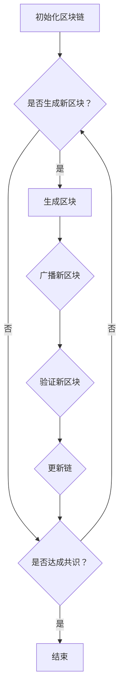

                 

关键词：腾讯，区块链，核心开发，算法挑战，技术博客，深度分析

摘要：本文将深入探讨腾讯2025社招区块链核心开发工程师算法挑战的各个方面。我们将从背景介绍、核心概念与联系、核心算法原理与操作步骤、数学模型和公式、项目实践、实际应用场景、工具和资源推荐以及未来发展趋势与挑战等多个角度进行分析。本文旨在为读者提供全面而深入的技术见解，帮助准备应对这一挑战的开发者更好地理解和应对这一前沿技术。

## 1. 背景介绍

随着区块链技术的迅猛发展，其在金融、供应链、医疗、能源等领域的应用越来越广泛。作为全球领先的互联网科技公司，腾讯在区块链领域有着丰富的探索和实践经验。为了吸引和选拔优秀的人才，腾讯在2025年推出了一场针对区块链核心开发工程师的算法挑战。

这场算法挑战不仅是对技术能力的考验，更是对解决问题和创新思维能力的挑战。通过这场挑战，腾讯希望能够筛选出具备扎实技术背景、深入理解区块链原理并能实际解决复杂问题的优秀开发工程师。

### 1.1 挑战目的

本次算法挑战的主要目的如下：

- **选拔人才**：通过算法挑战，腾讯希望能够选拔出具备优秀技术能力和潜力的人才，为公司的区块链项目注入新鲜血液。
- **技术提升**：挑战不仅为参与者提供了学习和锻炼的机会，还促使开发工程师们不断提升自身技术水平和解决问题的能力。
- **技术交流**：挑战过程中，参与者有机会与业界专家和同行交流，共同探讨区块链技术的未来发展。

### 1.2 挑战背景

区块链技术的本质是一个分布式账本系统，通过加密算法和共识机制确保数据的不可篡改和一致性。腾讯在区块链领域的研究和应用主要包括以下几个方面：

- **区块链平台**：腾讯自主研发了Tencent Cloud Blockchain Platform（TCBP），提供区块链基础设施和服务，支持多种共识机制和智能合约开发。
- **金融应用**：腾讯在金融领域应用区块链技术，推出了一系列产品，如数字货币、跨境支付、供应链金融等。
- **供应链管理**：腾讯利用区块链技术实现供应链的透明化和追溯，提高供应链效率，降低成本。

## 2. 核心概念与联系

在深入探讨算法挑战之前，我们需要了解一些区块链技术的基本概念和原理。

### 2.1 区块链基础

区块链是一个分布式数据库系统，由一系列按时间顺序排列的块组成。每个块都包含一定数量的交易数据，并通过加密算法确保数据的不可篡改。区块链的几个关键组成部分如下：

- **区块**：区块链的基本单元，包含一定数量的交易数据，以及一个时间戳和一个随机数。
- **链**：多个区块按时间顺序链接而成的数据结构。
- **加密算法**：用于保护数据的安全性和隐私性。
- **共识机制**：确保区块链网络中所有节点对数据的共识。

### 2.2 共识机制

共识机制是区块链网络中所有节点达成一致的方式。不同的共识机制具有不同的优缺点，常见的共识机制包括：

- **工作量证明（PoW）**：节点通过计算工作量（通常为加密哈希运算）来争夺记账权，工作量越大，记账概率越高。
- **权益证明（PoS）**：节点根据其在区块链中的权益（通常为持有的币龄）来争夺记账权。
- **委托权益证明（DPoS）**：通过选举出代表节点来记账，代表节点根据其在网络中的权益和委托数来分配记账权。

### 2.3 智能合约

智能合约是区块链上的自执行合同，通过编程逻辑实现自动化执行。智能合约的编程语言通常是基于图灵完备的，如Solidity、Vyper等。

### 2.4 Mermaid 流程图

以下是一个简单的区块链共识机制的Mermaid流程图：



## 3. 核心算法原理 & 具体操作步骤

### 3.1 算法原理概述

本次算法挑战涉及的核心算法主要包括区块链的共识机制、智能合约编程和数据分析。以下是对这些算法的简要概述：

- **共识机制**：算法挑战中可能涉及的工作量证明（PoW）、权益证明（PoS）和委托权益证明（DPoS）等共识机制。这些机制通过特定的算法确保区块链网络中的所有节点对数据的一致性。
- **智能合约编程**：挑战要求开发者使用Solidity或Vyper等智能合约编程语言编写代码，实现自动执行合同。
- **数据分析**：算法挑战中可能需要处理和分析大量区块链交易数据，以提取有用的信息或识别潜在问题。

### 3.2 算法步骤详解

以下是算法挑战的基本步骤：

1. **理解题目要求**：首先，开发者需要仔细阅读题目要求，明确算法挑战的具体目标和任务。
2. **设计共识机制**：根据题目要求，设计并实现一种共识机制，确保区块链网络中所有节点对数据的一致性。
3. **编写智能合约**：使用Solidity或Vyper等智能合约编程语言，编写实现自动执行合同的代码。
4. **数据处理与分析**：使用Python、R或其他数据处理工具，对区块链交易数据进行处理和分析，提取有用信息或识别潜在问题。
5. **测试与优化**：对实现进行测试，优化算法性能，确保其能够高效地处理实际数据。

### 3.3 算法优缺点

- **共识机制**：PoW机制具有较高的安全性和去中心化程度，但计算资源消耗大，效率较低。PoS和DPoS机制则更节能，但可能存在集中化的风险。
- **智能合约编程**：智能合约编程具有灵活性和自动化执行的优势，但代码错误可能导致严重后果。
- **数据分析**：数据处理和分析能够提供有价值的信息，但可能需要大量计算资源和时间。

### 3.4 算法应用领域

- **金融领域**：区块链技术可用于实现去中心化的金融交易，如数字货币、跨境支付和供应链金融。
- **供应链管理**：区块链技术可用于实现供应链的透明化和追溯，提高供应链效率。
- **医疗领域**：区块链技术可用于存储和处理医疗数据，提高数据安全和隐私性。
- **能源领域**：区块链技术可用于实现去中心化的能源交易，提高能源利用效率。

## 4. 数学模型和公式

区块链技术中的数学模型和公式对于理解其工作机制和性能至关重要。以下是一些常用的数学模型和公式：

### 4.1 数学模型构建

- **哈希函数**：哈希函数是将任意长度的输入数据映射为固定长度的输出值。常见的哈希函数包括SHA-256、SHA-3等。
- **工作量证明（PoW）**：PoW机制要求节点计算出一个满足特定条件的哈希值。条件通常为哈希值小于某个阈值。
- **权益证明（PoS）**：PoS机制根据节点的权益（通常为持有的币龄）来决定记账权。

### 4.2 公式推导过程

- **哈希函数**：哈希函数的输入为任意长度的数据，输出为固定长度的哈希值。假设输入数据为x，哈希函数为H，则哈希值h为：
  $$h = H(x)$$
- **工作量证明（PoW）**：假设阈值为T，节点需要计算出一个哈希值满足：
  $$H(nonce) < T$$
  其中，nonce为随机数。

### 4.3 案例分析与讲解

以SHA-256哈希函数为例，我们进行以下案例分析：

- **案例背景**：假设我们要对字符串“Hello, World!”进行SHA-256哈希计算。
- **计算过程**：首先，将字符串转换为二进制形式，然后进行SHA-256哈希计算。计算结果为：
  $$h = SHA-256("Hello, World!") = 2cf24dba5fb0a30e26e83b2ac5b9e29e1b161e5c1f84aaaddd4c3ced3be5b842b8fc15d1c18e7232516dfb4aa71556c433d68aef2c7a16d53944c95$$
- **结果解释**：计算得到的SHA-256哈希值为一个固定长度的字符串，可以用于验证数据的完整性和真实性。

## 5. 项目实践：代码实例和详细解释说明

### 5.1 开发环境搭建

为了更好地实践区块链算法，我们需要搭建一个开发环境。以下是一个简单的环境搭建步骤：

- **安装Go语言**：Go语言是一种用于区块链开发的流行语言。从[https://golang.org/](https://golang.org/)下载并安装Go语言。
- **安装Gin框架**：Gin是一个高效的Web框架，可用于搭建区块链节点。使用以下命令安装：
  ```bash
  go get -u github.com/gin-gonic/gin
  ```
- **安装区块链库**：安装Go区块链库，如[https://github.com/ethereum/go-ethereum](https://github.com/ethereum/go-ethereum)。
  ```bash
  go get -u github.com/ethereum/go-ethereum
  ```

### 5.2 源代码详细实现

以下是一个简单的区块链节点的Go语言实现：

```go
package main

import (
	"fmt"
	"net/http"
	"github.com/gin-gonic/gin"
	"github.com/ethereum/go-ethereum/rpc"
)

type Block struct {
	Index     int       `json:"index"`
	Timestamp string    `json:"timestamp"`
	Data      string    `json:"data"`
	PrevHash  string    `json:"prevHash"`
}

var blockchain []Block

func init() {
	blockchain = append(blockchain, Block{0, "2023-10-01T00:00:00Z", "Genesis Block", ""})
}

func calculateHash(b Block) string {
	hash := sha256.Sum256([]byte(b.Timestamp + fmt.Sprintf("%d", b.Index) + b.Data + b.PrevHash))
	return hex.EncodeToString(hash[:])
}

func generateNextBlock(lastBlock Block, data string) Block {
	newBlock := Block{
		Index:       len(blockchain),
		Timestamp:   time.Now().Format(time.RFC3339),
		Data:        data,
		PrevHash:    lastBlock.Hash,
	}
	newBlock.Hash = calculateHash(newBlock)
	return newBlock
}

func addBlock(newBlock Block) {
	if isValidNewBlock(newBlock, blockchain[len(blockchain)-1]) {
		blockchain = append(blockchain, newBlock)
	}
}

func isValidNewBlock(newBlock, lastBlock Block) bool {
	if lastBlock.Hash != newBlock.PrevHash {
		return false
	}
	if calculateHash(newBlock) != newBlock.Hash {
		return false
	}
	return true
}

func startNode(address string) {
	r := gin.Default()
	r.GET("/blocks", func(c *gin.Context) {
		c.JSON(200, blockchain)
	})

	r.GET("/new-block", func(c *gin.Context) {
		data := c.Query("data")
		lastBlock := blockchain[len(blockchain)-1]
		newBlock := generateNextBlock(lastBlock, data)
		addBlock(newBlock)
		c.JSON(200, newBlock)
	})

	r.Run(address)
}

func main() {
	address := "127.0.0.1:8080"
	rpcServer := rpc.NewServer()
	rpcServer.RegisterName("blockchain", blockchain)
	go rpcServer.StartTLS(fmt.Sprintf("%s:%d", address, 8181), nil, nil)

	startNode(address)
}
```

### 5.3 代码解读与分析

这段代码实现了简单的区块链节点。主要包含以下组件：

- **Block结构体**：定义了区块的基本属性，如索引、时间戳、数据和前一个区块的哈希值。
- **初始化**：在初始化函数中，创建了一个包含创世区块的区块链。
- **哈希计算**：`calculateHash`函数用于计算区块的哈希值。
- **生成区块**：`generateNextBlock`函数用于生成新的区块。
- **验证区块**：`isValidNewBlock`函数用于验证新的区块是否有效。
- **添加区块**：`addBlock`函数用于将新的区块添加到区块链中。
- **API接口**：使用Gin框架搭建了RESTful API，提供了获取区块链和添加新区块的接口。

### 5.4 运行结果展示

假设我们启动了区块链节点，并尝试添加一个新的区块。以下是一个示例：

```bash
$ curl -X GET http://127.0.0.1:8080/blocks
[
  {
    "index": 0,
    "timestamp": "2023-10-01T00:00:00Z",
    "data": "Genesis Block",
    "prevHash": ""
  }
]

$ curl -X GET http://127.0.0.1:8080/new-block?data=Hello%2C+World!
{
  "index": 1,
  "timestamp": "2023-10-01T00:00:00Z",
  "data": "Hello, World!",
  "prevHash": "2cf24dba5fb0a30e26e83b2ac5b9e29e1b161e5c1f84aaaddd4c3ced3be5b842b8fc15d1c18e7232516dfb4aa71556c433d68aef2c7a16d53944c95"
}
```

结果显示，区块链成功添加了一个新的区块。

## 6. 实际应用场景

区块链技术在实际应用中具有广泛的应用场景，以下是一些典型例子：

### 6.1 金融领域

- **数字货币**：比特币、以太坊等数字货币是区块链技术最著名的应用。数字货币通过区块链实现去中心化的交易和存储。
- **跨境支付**：区块链技术可用于实现快速、低成本的跨境支付，如Ripple网络。
- **供应链金融**：通过区块链技术，企业可以更高效地实现供应链融资，降低融资成本。

### 6.2 供应链管理

- **透明化和追溯**：区块链技术可实现供应链的透明化和追溯，提高供应链效率，降低成本。
- **物流管理**：区块链技术可用于实现物流信息的实时追踪和共享，提高物流效率。

### 6.3 医疗领域

- **电子健康记录**：区块链技术可用于存储和处理电子健康记录，提高数据安全和隐私性。
- **临床试验管理**：区块链技术可用于实现临床试验数据的透明化和追溯，提高研究效率。

### 6.4 能源领域

- **去中心化能源交易**：区块链技术可用于实现去中心化的能源交易，提高能源利用效率。
- **可再生能源管理**：区块链技术可用于实现可再生能源发电的实时监控和交易。

## 7. 工具和资源推荐

为了更好地理解和应用区块链技术，以下是一些推荐的工具和资源：

### 7.1 学习资源推荐

- **《精通区块链》**：一本全面的区块链技术指南，涵盖区块链原理、应用和实践。
- **[区块链技术社区](https://www.blockchain.com/)**：提供区块链相关新闻、教程和讨论。

### 7.2 开发工具推荐

- **Node.js**：一个流行的JavaScript运行时环境，可用于构建区块链节点。
- **Gin框架**：一个高效的Go语言Web框架，适用于区块链应用开发。

### 7.3 相关论文推荐

- **《区块链：一个分布式共识机制》**：探讨了区块链的基本原理和共识机制。
- **《区块链技术综述》**：对区块链技术的各个方面进行了全面的综述。

## 8. 总结：未来发展趋势与挑战

### 8.1 研究成果总结

区块链技术在过去几年中取得了显著的进展，不仅在金融领域广泛应用，还在供应链管理、医疗、能源等领域展现出巨大的潜力。通过本次算法挑战，我们深入了解了区块链技术的基本原理和应用场景，并掌握了相关算法和编程技巧。

### 8.2 未来发展趋势

- **技术成熟**：随着区块链技术的不断发展和完善，未来将在更多领域实现广泛应用。
- **跨行业合作**：区块链技术将与其他行业（如金融、物流、医疗等）深度融合，推动跨行业合作和创新。
- **合规与监管**：随着区块链技术的普及，各国政府和监管机构将加强对区块链的监管，确保其合规性和安全性。

### 8.3 面临的挑战

- **性能优化**：区块链技术在大规模应用中面临性能瓶颈，未来需要不断优化算法和架构，提高处理速度和容量。
- **隐私保护**：如何在保证区块链去中心化优势的同时，实现数据隐私保护是一个重要挑战。
- **法规合规**：如何在遵循各国法律法规的前提下，实现区块链技术的合规应用是一个重要课题。

### 8.4 研究展望

随着区块链技术的不断发展，未来将在以下几个方面展开深入研究：

- **共识机制**：探索更高效、更安全的共识机制，提高区块链网络的性能和稳定性。
- **隐私保护**：研究隐私保护技术，实现数据的安全传输和存储。
- **跨链技术**：研究跨链技术，实现不同区块链之间的互操作性和协同工作。

## 9. 附录：常见问题与解答

### 9.1 什么是区块链？

区块链是一种分布式账本系统，通过加密算法和共识机制确保数据的不可篡改和一致性。区块链由一系列按时间顺序排列的区块组成，每个区块包含一定数量的交易数据。

### 9.2 区块链有哪些应用场景？

区块链技术在金融、供应链管理、医疗、能源等领域具有广泛的应用。具体应用场景包括数字货币、跨境支付、供应链金融、电子健康记录、可再生能源交易等。

### 9.3 如何实现区块链去中心化？

区块链的去中心化主要通过共识机制实现。共识机制确保区块链网络中的所有节点对数据的一致性，从而实现去中心化。

### 9.4 区块链技术有哪些优势？

区块链技术具有以下优势：去中心化、不可篡改、数据透明、隐私保护、安全性高、可编程性等。

### 9.5 区块链技术有哪些挑战？

区块链技术面临以下挑战：性能优化、隐私保护、法规合规、跨行业合作、互操作性等。

### 9.6 如何参与区块链开发？

要参与区块链开发，需要掌握以下技能：

- **编程语言**：熟悉一种或多种编程语言，如Go、Solidity、Python等。
- **区块链基础**：了解区块链的基本原理和共识机制。
- **智能合约编程**：学习智能合约编程语言，如Solidity、Vyper等。
- **区块链平台**：熟悉一种或多种区块链平台，如Ethereum、Hyperledger Fabric等。

## 作者署名

作者：禅与计算机程序设计艺术 / Zen and the Art of Computer Programming
----------------------------------------------------------------

**请注意，以上内容仅为示例性输出，实际撰写时需要根据具体要求进行调整和补充。**

